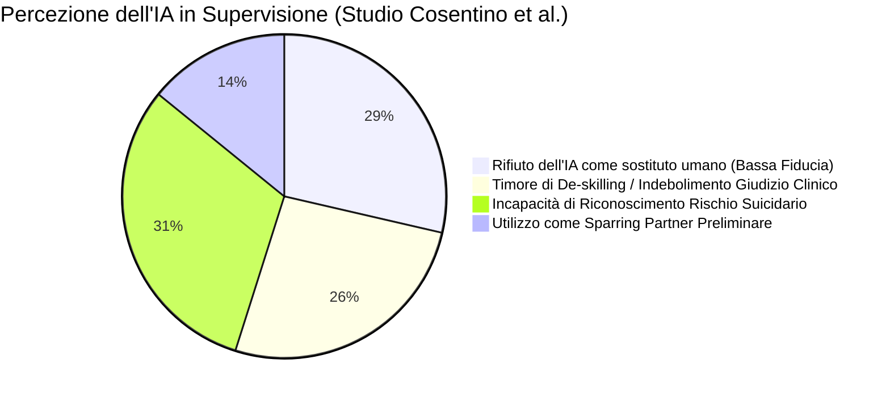

# Lezione e Seminario: RAG, LLM in Psicoterapia, Supervisione e Governance Etica (10 Giugno 2026)

**Summary**: Resoconto analitico del seminario SITCC Veneto dedicato all'integrazione clinica, tecnica ed etica dell'Intelligenza Artificiale in psicoterapia. Vengono approfondite le architetture RAG e API-first, il Modello Centauro applicato alla seduta clinica con feedback NLP, l'indagine empirica sull'uso dell'IA nella supervisione (Cosentino et al., 2026), e la fenomenologia dell'uso problematico e della dipendenza da chatbot negli adolescenti (Romano & Baioni, 2026).
**Sources**: 06-10 Lezione_ RAG, LLM in Psicoterapia e Governance Etica.txt
**Last updated**: 2026-08-27
---

## Quadro Generale e Organizzazione

Il seminario, promosso e organizzato dalla sezione Veneto della **SITCC (Società Italiana di Terapia Cognitivo Comportamentale)** (moderato da Francesca Baggio, Chiara Novello e Gloria Fioravanti), si inserisce nel dibattito specialistico sull'impatto trasformativo dei [[large-language-models|Large Language Models (LLM)]] e del [[rag-in-psicoterapia|Retrieval-Augmented Generation (RAG)]] nella clinica, nella formazione e nella tutela della salute mentale. 

L'incontro si articola in quattro moduli tematici sinergici:
1. Architetture tecniche, personalizzazione RAG e confronto tra interfacce Web e API.
2. Applicazione clinica in vivo, feedback aumentato e il [[modello-centauro-clinico|Modello Centauro]] nella gestione della seduta.
3. Studio empirico sull'adozione dell'IA nella [[supervisione-clinica-ai|supervisione clinica]] (variabili di colpa, ansia sociale e timore di de-skilling).
4. Inquadramento clinico-nosografico dell'[[uso-problematico-chatbot-ai|uso problematico di chatbot]], dinamiche di dipendenza affettiva e vulnerabilità evolutiva negli adolescenti.

---

## 1. Architetture Tecniche, RAG e Governance dei Dati

Nella sessione di apertura tecnica (Dott. Giacomo Antonio / Dott. Mauro Bonora), vengono illustrati i principi architetturali alla base dell'interazione con i modelli linguistici avanzati e le metodologie di Retrieval-Augmented Generation (RAG) sviluppate per contesti applicativi e di studio (es. prototipi basati su Streamlit):

### Retrieval-Augmented Generation (RAG) e Personalizzazione Avanzata
- **Funzionamento del RAG**: Il sistema interroga dinamicamente una base documentale esterna (slide, manuali clinici, capitoli in PDF o trascritti deidentificati) e inietta i passaggi rilevanti nel prompt di contesto, vincolando l'LLM a sintetizzare e rispondere esclusivamente sulla base delle fonti certificate.
- **Personalizzazione valoriale e di personalità**: Viene citata la letteratura più recente (studio *IW et al., 2026*) che dimostra come sia possibile modificare le risposte del modello allineandole a specifici profili di personalità o teorie valoriali (es. la *Teoria dei Valori Universali di Schwartz*) attraverso meccanismi di reward e RAG combinati, consentendo di simulare pazienti con specifici stili di funzionamento (es. tratti introversi vs estroversi).

### Confronto Strutturale: Interfacce Web Commerciali vs API-First
| Dimensione | Utilizzo Classico Web / Chatbot | Integrazione tramite API |
| :--- | :--- | :--- |
| **Costi** | Abbonamento fisso elevato (20–200 €/mese per utente). | Pay-per-token estremamente economico (frazioni di centesimo per query). |
| **Privacy e GDPR** | I dati inseriti possono essere usati per addestrare i modelli pubblici. | Politica di **zero-data retention**: i dati scambiati via API non vengono usati per l'addestramento (OpenAI, Gemini). |
| **Personalizzazione** | Limitata alla sessione o a Custom Instructions generiche. | Totale: selezione dinamica della memoria, prompt di sistema, RAG su basi documentali proprietarie. |
| **Scalabilità** | Limitata all'interazione individuale 1:1. | Elevata: integrabile in questionari, piattaforme cliniche e app terze. |
| **Affidabilità** | Più esposta ad allucinazioni generaliste e bias impliciti. | Riduzione delle allucinazioni tramite vincoli contestuali RAG e temperature controllate. |
| **Barriere d'ingresso** | Nessuna (interfaccia utente immediata). | Richiede competenze di programmazione e gestione dell'infrastruttura. |

---

## 2. Applicazione Clinica in Vivo: Il Modello Centauro e l'Analisi della Seduta

Il Dott. Giuseppe (Lilac) analizza l'integrazione dell'IA nel processo terapeutico attraverso il paradigma del [[modello-centauro-clinico|Modello Centauro]] e l'impiego del feedback sistematico post-seduta:

### Origine Epistemologica: Il "Centaur Chess" di Kasparov
Nel 1997, dopo il match contro *Deep Blue*, Garry Kasparov teorizzò che l'abbinamento sinergico tra intuizione umana e potenza computazionale (*Centaur*) supera sia il miglior umano da solo sia il più potente supercomputer isolato:
$$\text{Clinico Umano} + \text{Co-pilota IA} > \text{Clinico Umano da Solo} \gg \text{IA Autonoma}$$

### I Quattro Pilastri del Feedback Clinico Aumentato
1. **L'esperienza da sola non basta (Feedback-Informed Practice)**: 
   - I dati longitudinali (*Goldberg & Rousmaniere*, studio su 170 terapeuti e 6.500 pazienti seguiti fino a 18 anni) mostrano che le performance cliniche non migliorano automaticamente con l'anzianità di servizio, anzi tendono a un lieve declino se non accompagnate da pratica deliberata.
   - La pratica non supervisionata rende gli errori permanenti; il miglioramento deriva dall'analisi sistematica dei **feedback negativi** e delle micro-rotture dell'alleanza.
2. **Capacità di lettura del Natural Language Processing (NLP)**:
   - Sistemi NLP (come nel trial clinico *Listen*) mostrano un livello di accordo elevato con codificatori umani esperti su costrutti trans-teorici quali empatia, distress e alleanza di lavoro.
   - È indispensabile correlare gli output degli LLM con strumenti psicometrici validati (es. *Working Alliance Inventory - WAI*).
3. **Predizione Algoritmica del Drop-out**:
   - Modelli di machine learning basati su dati pre-seduta (*Bennemann et al., 2022*, su 2.543 pazienti CBT con Random Forest + kNN) predicono il 63,4% dei drop-out, a fronte di un'accuratezza del giudizio clinico umano non assistito pari al 30%.
4. **Cosa NON fare: I Pericoli dell'Automazione senza Human-in-the-Loop**:
   - Il caso emblematico del chatbot *Tessa* (sviluppato da NEDA per le linee di supporto per i disturbi alimentari), che a seguito di un aggiornamento non presidiato ha iniziato a consigliare diete restrittive da 500 kcal a pazienti anoressiche, scatenando scandali legali e chiusura del servizio.
   - Regola cardine: **nessun LLM autonomo a contatto diretto con popolazioni cliniche fragili**.

```mermaid
graph TD
    subgraph Setting Seduta
        P[Paziente] <-->|Relazione Corporea & Affettiva| T[Terapeuta]
    end

    Setting Seduta -->|Trascrizione Audio & Anonimizzazione GDPR| RAG[Sistema RAG + LLM su Server UE]
    RAG -->|Report di Processo| Post[Report Post-Seduta]

    subgraph Report Post-Seduta
        Post --> F1[Scoring Empatia, Alleanza & Turni Eloquio]
        Post --> F2[Rilevazione Rotture Precoci: Ritiro vs Confronto]
        Post --> F3[Identificazione Blind Spots & Enactment]
    end

    Post --> Intervisione[Discussione in Intervisione & Pratica Deliberata]
    Intervisione -->|Affina il Ragionamento Clinico| T
```

### Vignetta Clinica Reale: Il Caso "Marco"
Viene presentata una seduta deidentificata di un paziente ("Marco", 7 mesi di trattamento multidisciplinare online per disturbo alimentare, assunzione autogestita di agonista GLP-1, nodo problematico tra accudimento e sessualità, eloquio brillante e intellettualizzante):
- **Dinamica clinica osservata dal terapeuta**:
  - *Minuti 0–15*: Eloquio grandioso, proposte di beneficenza, minimizzazione delle difficoltà alimentari.
  - *Minuti 15–23*: Pretese sessuali verso una conoscente vissute come "diritto curativo-tantrico"; il terapeuta interviene confrontando la pretesa, innescando una forte rottura dell'alleanza da confronto ("È una cazzata, tu non capisci").
  - *Minuti 23–24*: Il terapeuta ripristina il clima collaborativo legittimando l'esperienza emotiva; focusing sul corpo (nodo allo stomaco) ed emergenza del nucleo traumatico infantile (madre intrusiva/invischiante che confondeva accudimento e sessualità).
- **Lettura del Sistema LLM + RAG (confronto e blind spots)**:
  - *Conferme*: Riconoscimento puntuale della riparazione al minuto 23 e dell'efficacia del lavoro somato-rappresentazionale.
  - *Blind Spot 1 (Enactment iniziale)*: L'algoritmo segnala che al minuto 1 il paziente ha tentato di invischiare il terapeuta proponendo una raccolta fondi; il clinico ha glissato per imbarazzo invece di problematizzare il pattern di accudimento onnipotente.
  - *Blind Spot 2 (Segnale multidisciplinare)*: Dilazione autonoma del GLP-1 non approfondita, richiedente coordinamento medico.
  - *Blind Spot 3 (Dinamica temporale della rottura)*: L'analisi del testo e della prosodia evidenzia che la rottura non è iniziata al minuto 15 (confronto manifesto), ma già nei primi minuti sotto forma di **rottura da ritiro intellettualizzante** (*Safran & Muran*), in cui il paziente monopolizzava il discorso escludendo il terapeuta.

### Dilemmi Epistemologici e Linee Rosse
- **Effetto Minority Report**: Rischio che la predizione algoritmica di rottura alteri negativamente la postura del terapeuta, generando una profezia che si autoavvera.
- **Interferenza sull'Autenticità**: Il dubbio del paziente ("Me lo dice perché l'ha dedotto l'IA?") gestibile clinicamente riconducendolo ai cicli interpersonali e ai test relazionali (*Weiss & Sampson*).
- **Governance del "Lavoro di Bottega"**: L'IA funge da terzo osservatore privo di corpo e di esperienza; i suoi dati devono essere filtrati e decostruiti nella comunità dei pari (supervisione/intervisione).

---

## 3. L'IA nella Supervisione Clinica: Evidenze Empiriche

La Dott.ssa Teresa Cosentino (APC/SPC, *Cognitivismo Clinico*) presenta i risultati di un'indagine empirica esplorativa sull'adozione dell'IA nella supervisione:

### Review della Letteratura (Orro & Mannarini, 2026)
- **Vantaggi**: Accessibilità H24, abbattimento dei costi, supporto preliminare alla concettualizzazione e riduzione dell'ansia da prestazione.
- **Criticità**: Tendenza alla compiacenza (*sycophancy*), rischio di delega passiva e deresponsabilizzazione (*de-skilling*), assenza di risonanza affettiva autentica, incapacità strutturale di riconoscere e gestire le crisi suicidarie e le psicosi.

### Risultati dello Studio Empirico (Campione $N = 93$)
- **Composizione**: 48 allievi specializzandi in psicoterapia e 45 psicoterapeuti già specializzati (età media 38 anni).
- **Strumenti**: Questionario ad hoc a 25 item (scala Likert 1–5), *Fear of Guilt Scale (FGS)* e *Liebowitz Social Anxiety Scale (LSAS)*.



### Principali Risultanze Statistiche:
1. **Rifiuto della Sostituzione**: Accordo pressoché unanime nel considerare l'IA inadatta a sostituire il supervisore umano e priva del calore e del supporto emotivo necessario.
2. **Incapacità di Gestione del Rischio Suicidario**: Fortissima consapevolezza della pericolosità dell'IA nei quadri acuti e nelle comorbilità complesse.
3. **Timore di De-skilling e Indebolimento del Giudizio Autonomo**: 
   - Preoccupazione diffusa in tutto il campione, significativamente più accentuata tra gli **allievi specializzandi** rispetto ai clinici esperti.
4. **Ruolo delle Variabili Psicologiche Individuali**:
   - *Timore della Colpa (sottoscala Punishment)*: Correla positivamente con la preoccupazione che l'uso dell'IA possa compromettere la qualità del giudizio clinico e danneggiare il paziente.
   - *Ansia Sociale (LSAS)*: L'evitamento sociale correla positivamente con l'uso dell'IA per attenuare il timore del giudizio del supervisore umano; l'ansia sociale spiega il **10,3% della varianza** nel timore di de-skilling clinico.

---

## 4. Uso Problematico da Chatbot, Dipendenze e Vulnerabilità negli Adolescenti

La Dott.ssa Michela Romano (referente dipendenze Centro Sant'Agostino) e la Dott.ssa Alessia Baioni (referente adolescenti Centro Sant'Agostino) delineano il quadro clinico dell'abuso di chatbot generativi:

### Inquadramento Nosografico e Modello I-PACE
Non esistendo ancora un'etichetta diagnostica formale in DSM-5-TR o ICD-11, il fenomeno viene trattato come **dipendenza comportamentale** e descritto tramite il modello **I-PACE (Interaction of Person-Affect-Cognition-Execution)**:
- **Fattori di Persona e Vulnerabilità**: Solitudine, deficit di autostima, neurodivergenze (ADHD, DSA), disregolazione emotiva.
- **Fattori Tecnologici Stimolanti**: Risposta istantanea H24, totale assenza di giudizio, antropomorfismo, risposte compiacenti e rassicuranti.
- **Meccanismo di Mantenimento**: L'interazione genera un rinforzo positivo immediato; il chatbot diviene una strategia di *coping disadattivo* per fuggire dalle emozioni negative, innescando un circolo vizioso di isolamento relazionale.

### Epidemiologia e Dati di Ricerca
- **Indagine Save the Children Italia (Agosto 2025)** (800 adolescenti 15–19 anni vs adulti):
  - Il **92%** degli adolescenti utilizza regolarmente l'IA (contro il 46% degli adulti).
  - Il **41%** vi ricorre specificamente nei momenti di tristezza, solitudine o ansia.
  - Il **42%** richiede consigli per decisioni personali rilevanti.
  - Il **63%** dichiara di trovare l'interazione con l'IA occasionalmente più soddisfacente rispetto al confronto con persone reali.

### Specificità Evolutiva e Rischi Clinici negli Adolescenti
1. **La Relazione "Senza Corpo"**: L'adolescenza richiede l'integrazione della corporeità, della pulsione sessuale e della gestione dell'attrito interpersonale. L'interazione con l'IA offre una relazione asettica, senza corpo e priva di conflitto, favorendo quadri di ritiro sociale severo (*hikikomori*).
2. **Delega Cognitiva e Arresto dell'Autonomia**: La continua richiesta di indicazioni comportamentali al chatbot inibisce lo sviluppo delle funzioni esecutive, del pensiero critico e dell'identità personale.
3. **"AI-Psychosis" e Allucinazioni Condivise**: Casi di adolescenti che sviluppano convinzioni deliranti alimentate dai chatbot o che assorbono diagnosi psichiatriche allucinate dal modello.
4. **Fallimento nel Rischio Suicidario**: Casi di cronaca internazionale (es. suicidi di adolescenti negli USA a fine 2025) in cui i chatbot hanno assecondato l'ideazione di morte senza allertare i servizi di emergenza o i genitori.

### Casistica Clinica Reale
- **Primo Caso SerD in Italia (Venezia, Maggio 2026)**: Presa in carico formale per dipendenza comportamentale da assistente virtuale di una giovane di 20 anni, con progressivo azzeramento dei contatti umani e delega totale dei processi decisionali.
- **Caso Clinico di "Andrea" (18 anni, seguito dalla Dott.ssa Baioni)**:
  - Pregresso percorso per disturbo oppositivo, condotta a rischio e DSA/ADHD, rientrato con successo grazie all'alleanza terapeutica e alla canalizzazione nella scrittura musicale.
  - Ricaduta a 18 anni caratterizzata da blocco creativo, grave derealizzazione e consultazione ossessiva di ChatGPT ("Mi ha detto che sono schizofrenico").
  - L'IA agiva come mente sostitutiva e amplificatore d'ansia.
  - Intervento clinico: ripristino dell'alleanza reale, modello della *Mente Saggia* (DBT), decostruzione dell'etichetta allucinata e riappropriazione della creatività autonoma (completamento del primo album rap senza ausili digitali).

### Indicazioni di Trattamento
- Psicoterapia Cognitivo-Comportamentale (CBT) focalizzata sulla ristrutturazione dei bias antropomorfi e delle credenze di dipendenza.
- Protocolli DBT per la regolazione affettiva e la tolleranza della frustrazione relazionale.
- Interventi psicoeducativi e sistemico-familiari per ristabilire limiti digitali e riattivare la socialità incarnata.
- Promozione della *Mente Critica*: l'intelligenza umana deve fungere costantemente da filtro etico ed emotivo verso quella artificiale.

---

## Related pages
- [[modello-centauro-clinico]]
- [[supervisione-clinica-ai]]
- [[uso-problematico-chatbot-ai]]
- [[rag-in-psicoterapia]]
- [[augmented-psychotherapy]]
- [[digital-therapeutic-alliance]]
- [[human-in-the-reasoning]]
- [[ai-research-ethics]]
- [[anthropomorphism-in-ai]]
- [[large-language-models]]
- [[feedback-informed-practice-ai]]
