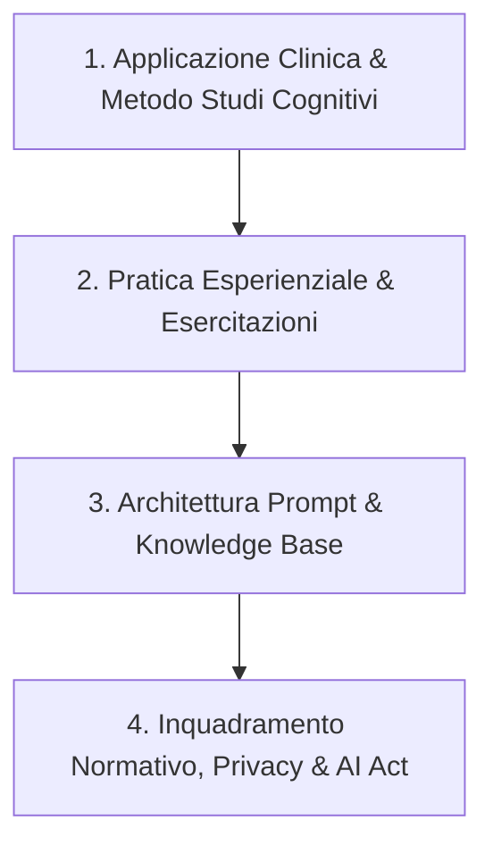
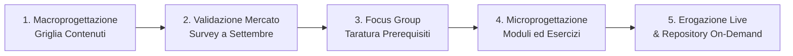

# Riunione 07-08: Pianificazione Corso IA per Psicoterapia — Struttura, Validazione Interessi, Microprogettazione e Coordinamento

**Summary**: Sintesi strategico-operativa della riunione di progettazione del corso di formazione continua sull'Intelligenza Artificiale applicata alla psicoterapia per la community di Studi Cognitivi. Vengono definiti il razionale metodologico (ancoraggio al processo clinico CBT vs strumenti generici di marketing), l'articolazione didattica (Modulo Base e Avanzato, Second Brain clinico, psicodiagnostica, consapevolezza metacognitiva del terapeuta) e l'iter procedurale di sviluppo (macroprogettazione, survey di validazione a settembre, focus group, microprogettazione e governance).
**Sources**: 07-08 Riunione_ Pianificazione corso IA per psicoterapia — struttura, validazione interessi, microprogettazione e coordinamento.txt
**Last updated**: 2026-08-27
---

## 1. Contesto, Visione e Posizionamento Strategico

La riunione vede la partecipazione di **Roberta** (Direzione Formazione Continua, Studi Cognitivi), **Erika** (Dipartimento Formazione Continua / Bioetica), **Andrea Ferrari** (Psicoterapeuta, docente e coordinatore operativo) e **Matilde** (Ricercatrice).

### Critica alle Offerte Formative Generiche di Mercato
Il punto di partenza della discussione è l'analisi critica del panorama formativo attuale relativo all'IA in psicologia e psicoterapia:
- **Derivazione da marketing e social media**: La quasi totalità dei corsi disponibili mutua metodologie ed esempi dal marketing digitale, dalla copywriting automatizzata o dalla creazione di contenuti promozionali, costringendo il clinico a un faticoso e spesso inadeguato lavoro di riadattamento al setting clinico.
- **Strumentalismo rigido e acritico**: Diverse proposte commerciali (es. modelli preconfezionati basati su registratori/trascrittori generici come Plaud o template chiusi) offrono "facili strumentini" privi di trasparenza metodologica, che bypassano il ragionamento clinico e standardizzano forzatamente la complessità dell'incontro terapeutico.

### Proposta di Valore: Ancoraggio al Metodo Clinico CBT di Studi Cognitivi
L'iniziativa di Studi Cognitivi si differenzia radicalmente proponendo una formazione:
- **Processuale e Procedurale**: Integrata nelle fasi canoniche del processo terapeutico cognitivo-comportamentale (assessment psicodiagnostico, concettualizzazione del caso, condivisione del contratto e degli scopi, protocolli di intervento, costruzione di gerarchie di esposizione, monitoraggio di processo ed esiti).
- **Epistemologicamente Consapevole**: Educazione alla natura puramente **statistica e probabilistica** dei Large Language Models ("l'IA lavora con la statistica, non è una sfera di cristallo"), superando sia l'allarmismo tecnofobico sia l'entusiasmo acritico per sviluppare una capacità di valutazione e confutazione attiva dei risultati.
- **Riferimento di Mercato Positivo**: Viene citata una recente indagine dell'Ordine degli Psicologi della Lombardia, da cui emerge una platea di professionisti né terrorizzata né tecno-entusiasta, ma fortemente curiosa e desiderosa di una formazione equilibrata, rigorosa e metodologica.

---

## 2. Riorganizzazione della Scaletta Didattica e Target

Mentre la proposta iniziale prevedeva una sequenza classica (1. Normativa/AI Act/GDPR -> 2. Panoramica Tool -> 3. Prompt Engineering), il confronto ha portato a un'inversione metodologica orientata all'ingaggio clinico:

1. **Inversione della sequenza**: Mettere al centro fin dal primo incontro l'**utilità clinica concreta** e l'interazione terapeutica, lasciando la cornice normativa e tecnica a supporto della pratica e come chiusura integrata.
2. **Formato e Frequenza**: Modulo intensivo e denso (**5-6 incontri da 1,5 ore** in diretta live interattiva), integrato da registrazioni e materiali di sintesi on-demand per la community. La modalità live è ritenuta fondamentale per favorire il confronto, le domande estemporanee e la risoluzione guidata di casi.
3. **Target di Riferimento**: 
   - Riservato prioritariamente ad **allievi del 3° e 4° anno di specializzazione**, docenti e psicoterapeuti esperti.
   - Esclusione mirata degli allievi del 1° e 2° anno per evitare il rischio di *de-skilling* o scorciatoie algoritmiche prima che il ragionamento clinico e metodologico di base sia pienamente consolidato.

---

## 3. Struttura Modulare: Livello Base vs Livello Avanzato

### Modulo Base (Accessibile a tutti i clinici qualificati)
- **Fondamenti operativi**: Comprensione del funzionamento degli LLM, logica probabilistica e prevenzione delle allucinazioni.
- **Prompting clinico di base**: Regole per la formulazione di prompt efficaci, contestualizzati, strutturati su ruoli e compiti specifici.
- **Autoformazione e Deep Research**: Uso avanzato di strumenti di sintesi ed esplorazione bibliografica (es. *Perplexity*, *NotebookLM*) per l'aggiornamento scientifico e clinico continuo.
- **Note cliniche assistite**: Metodi e cautele deontologiche per la redazione assistita di report di seduta e sintesi descrittive.
- **Esercizi pratici ("take-home")**: Costruzione guidata di piani di esposizione graduata e compiti a casa (homework) al termine di ogni modulo.

### Modulo Avanzato / Advance (Specialistico)
- **Costruzione del [[second-brain-clinico|Second Brain Clinico]]**: Organizzazione della conoscenza personale tramite cartelle strutturate e strumenti come *Obsidian* per gestire protocolli, note e concettualizzazioni.
- **Custom Skills e Agenti Specialistici**: Creazione di assistenti dedicati (es. in *Claude* o custom GPT) capaci di effettuare scoring, estrarre item critici e incrociare dati psicodiagnostici.
- **Protocolli ad Alta Complessità**: Supporto alla gestione e categorizzazione del materiale clinico in aree delicate (es. assessment del rischio suicidario, rotture dell'alleanza).

---

## 4. Applicazioni Cliniche Emergenti

### A. Psicodiagnostica Integrata e Ragionamento Clinico
- Collegamento sinergico con il **Master in Psicodiagnostica** di Studi Cognitivi.
- L'IA non viene impiegata per la mera somministrazione automatizzata dei reattivi, ma come supporto alla **triangolazione clinica**: integrazione tra punteggi psicometrici, evidenze del colloquio clinico e generazione di ipotesi differenziali per amplificare il ragionamento del terapeuta.

### B. Indagine sull'Uso dell'IA da parte del Paziente ([[psicoeducazione-ia-relazione-terapeutica]])
- Integrazione dell'IA nell'indagine clinica relazionale: esplorare sistematicamente se e come il paziente utilizza chatbot (es. ChatGPT).
- Analisi dei pattern disfunzionali: identificazione dell'uso dei modelli per **rimuginio ricorsivo**, ricerca ossessiva di rassicurazioni o auto-diagnosi incontrollate, trasformando tale comportamento in oggetto di psicoeducazione e ristrutturazione.

### C. Consapevolezza degli Schemi e Piani del Terapeuta ([[autosupervisione-schemi-terapeuta-ia]])
- Riconoscimento del funzionamento personale del terapeuta nell'interazione con l'IA: analizzare se il ricorso al modello sia motivato da scopi difensivi o di **autorassicurazione** di fronte all'incertezza clinica.
- Esplicitazione dello scopo d'uso per mitigare la suggestionabilità e il bias di conferma rispetto alle risposte fornite dall'algoritmo.

---

## 5. Processo di Macroprogettazione, Validazione e Governance

La Direzione Formazione Continua adotta un processo strutturato in 5 fasi:

1. **Macroprogettazione (Entro fine Luglio)**: Stesura di una scheda sintetica con griglia dei contenuti e obiettivi formativi.
2. **Validazione dell'Interesse (Settembre)**: Lancio di una survey (finestra di 15 giorni) rivolta alla community di Studi Cognitivi per verificare interesse, fasce orarie preferite, frequenza e disponibilità economica.
3. **Focus Group di Approfondimento**: Sessioni qualitative con docenti e allievi per rilevare l'effettivo livello di partenza e scongiurare assunzioni errate sulle competenze pregresse.
4. **Microprogettazione Esecutiva**: Dettaglio delle singole lezioni, definizione delle esercitazioni pratiche di fine modulo e preparazione dei materiali didattici.
5. **Governance e Ruoli**:
   - Definizione del team: figure dedicate alla *progettazione*, alla *docenza d'aula* e al *coordinamento/tutoraggio continuo*.
   - Riconoscimento economico distinto per la fase di progettazione, per le ore di docenza e per l'attività continuativa di coordinamento e supporto discenti.

---

## 6. Roadmap Temporale

- **Fine Luglio**: Condivisione via email della griglia di macroprogettazione da parte del gruppo di lavoro (Andrea, Matilde, Erika).
- **Inizio Settembre**: Lancio della survey di validazione e raccolta feedback dalla rete degli allievi e docenti.
- **Metà/Fine Settembre**: Analisi dei dati della survey, eventuale conduzione dei focus group e avvio della microprogettazione di dettaglio.
- **Fine 2026 / Inizio 2027**: Partenza della prima edizione in diretta live del corso.

---

## Related pages
- [[second-brain-clinico]]
- [[microprogettazione-formativa-ia]]
- [[psicoeducazione-ia-relazione-terapeutica]]
- [[autosupervisione-schemi-terapeuta-ia]]
- [[05-08_Riunione_Knowledge_Base]]
- [[03-13_Avvio_Gruppo_Lavoro_IA_Psicoterapia]]
- [[04-20_Tavola_rotonda_Integrazione_IA]]
- [[human-in-the-reasoning]]
- [[augmented-psychotherapy]]
- [[ai-assisted-psychotherapy]]
