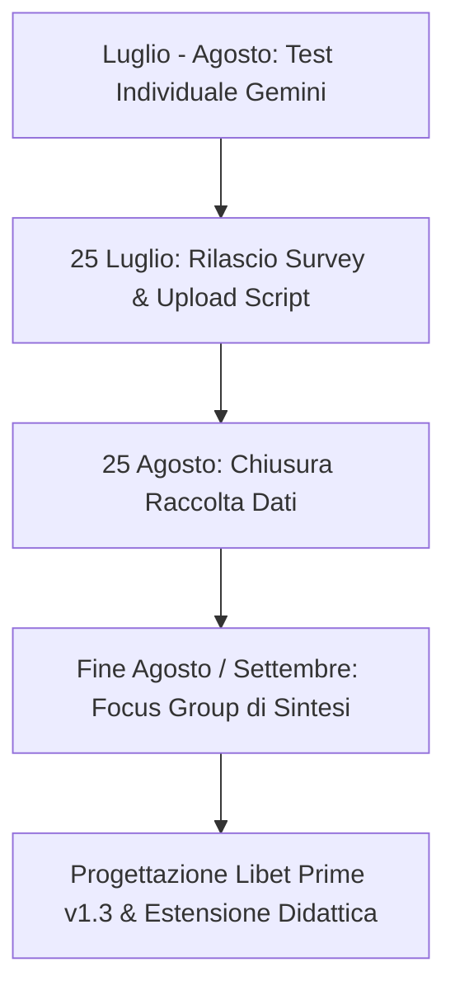

# Riunione 07-10: Test e Valutazione di Libet Prime, Trainer Simulator e Piano Operativo

**Summary**: Sintesi della riunione operativa di presentazione e avvio del test pilota di "Libet Prime" (v1.2), introduzione dell'agente "Trainer Simulator" (v0.2), protocollo di sperimentazione strutturato su piattaforma Gemini per i responsabili di sede e didatti di Studi Cognitivi, e discussione pedagogico-etica sul co-ragionamento maieutico.
**Sources**: 07-10 Riunione_ Test e Valutazione di “Libet Prime” (Tutor AI per Libet_CBT), Trainer Simulator e Piano Operativo.txt
**Last updated**: 2026-08-27
---

## Quadro Generale e Contesto Didattico

Il 10 luglio 2026 si è tenuta la riunione plenaria di presentazione e avvio della sperimentazione operativa dei primi agenti intelligenti sviluppati per la rete di scuole di psicoterapia *Studi Cognitivi* (SC Formazione), coordinata da Gabriele Caselli (co-autore del modello LIBET) con il gruppo di lavoro su IA e psicoterapia (Andrea Ferrari, Erika, Matilde Boattini).

Obiettivo dell'iniziativa è introdurre l'intelligenza artificiale nei percorsi di specializzazione in modo cauto, modulare e verificabile, partendo da prototipi controllati integrati nell'ecosistema istituzionale **Google for Education / Gemini** (Google Classroom e Gem condivisi), accessibili a docenti e allievi.

Il focus primario riguarda le competenze di base degli allievi dei primi due anni:
- Comprensione approfondita e discriminazione dei costrutti psicopatologici e teorici.
- Collegamento rigoroso tra formulazione del caso e razionale degli interventi.
- Sviluppo del ragionamento clinico prudente e ipotetico, evitando approssimazioni ed etichettature premature.

---

## 1. [[libet-prime|Libet Prime]]: Tutor Clinico-Didattico (v1.2)

**Libet Prime** è un Gem di Gemini sviluppato come tutor didattico specializzato sul modello **LIBET** (*Life Themes and Plans in CBT*) e sulle terapie cognitivo-comportamentali.

### Identità e Perimetro (Guardrails)
- **Cosa fa**: Chiarisce costrutti teorici, discrimina nomenclature sovrapposte o ambigue tra modelli cognitivisti, supporta l'analisi di vignette cliniche, corregge formulazioni e allena a costruire un razionale d'intervento.
- **Cosa NON è**: Non è un terapeuta, né un supervisore clinico, né un motore diagnostico, né un oracolo o un assistente generico (stile ChatGPT).
- **Tenuta dei confini (*Boundary Enforcement*)**: Rifiuto categorico di richieste cliniche dirette o fuori dominio (*out-of-domain*).

### Postura Bimodale
1. **Sui contenuti teorici e costrutti**: Fornisce risposte scolastiche dirette, puntuali e rigorose, corredate da esempi clinici standard ed errori tipici di comprensione.
2. **Sul materiale clinico e vignette**: Assume una postura dialogica, socratica e maieutica. Non fornisce risposte chiuse né "verità" preconfezionate, ma stimola l'allievo attraverso domande di rilancio e contro-ipotesi, allungando il processo riflessivo anziché offrire scorciatoie cognitive.

### Architettura e 5 Modalità Operative con Routing Dinamico
L'agente si basa su un macro-prompt strutturato che governa 5 modalità operative mediante un motore di routing:
1. *Spiegazione teorica* dei concetti del modello LIBET.
2. *Confronto e distinzione* tra costrutti psicopatologici e teorici.
3. *Ragionamento sulla formulazione* e analisi di vignette cliniche.
4. *Impostazione del razionale di trattamento* e ipotesi d'intervento.
5. *Interrogazione attiva* (l'agente interroga l'allievo per testarne la comprensione).

### Knowledge Base e Versioning
- **Knowledge Base proprietaria**: Corpus strutturato di 33 capitoli e 230 pagine, ottimizzato per l'elaborazione degli LLM.
- **Prevenzione delle regressioni algoritmiche**: Superamento dei limiti riscontrati nelle versioni 1.0 e 1.1 (dove l'eccesso di vincoli sequenziali causava rigidità e collasso espressivo). Necessità di tracciare script standardizzati per testare le nuove iterazioni (v1.3).

---

## 2. [[trainer-simulator|Trainer Simulator]]: Simulatore Esperienziale (v0.2)

Accanto a Libet Prime, è stato introdotto in anteprima il secondo agente in cantiere (**Trainer Simulator / Interview Trainer**), orientato all'allenamento esperienziale al colloquio clinico.

- **Perimetro di addestramento**: Dalla fase iniziale del colloquio alla formulazione condivisa (assessment, ABC, ABC Libet e restituzione).
- **Libreria di Pazienti Virtuali**: Pacchetto iniziale di 10 profili di pazienti simulati con quadri sintomatologici e dinamiche relazionali differenziate.
- **3 Livelli di Difficoltà**: Base, intermedio e avanzato (variazione progressiva di vaghezza nell'eloquio, difese e resistenze relazionali).
- **Comandi di Controllo Sessione**: Comandi interattivi per la gestione dell'esercitazione (`inizia`, `pausa`, `indizio`, `riformula`, `feedback`).
- **Valutazione e Feedback**: Generazione automatizzata di una rubrica di valutazione analitica delle competenze cliniche e comunicative mostrate dall'allievo.

---

## 3. Protocollo di Test e Piano Operativo

La sperimentazione pilota coinvolge responsabili di sede, didatti storici e allievi junior di Studi Cognitivi secondo un cronoprogramma definito:

### Dimensioni di Valutazione del Test
1. **Accuratezza teorica e fedeltà lessicale**: Coerenza con il lessico LIBET e CBT.
2. **Qualità del ragionamento clinico**: Capacità di argomentare e stimolare riflessioni strutturate.
3. **Granularità**: Adeguatezza del livello di dettaglio rispetto alle informazioni fornite.
4. **Prudenza epistemica**: Uso del linguaggio ipotetico, assenza di conclusioni premature o diagnosi automatiche.
5. **Tenuta dei confini (*Guardrails*)**: Rifiuto puntuale dei compiti estranei al perimetro didattico.
6. **Rilevazione errori critici**: Confusione di dinamiche, allucinazioni, anticipazione indebita di interventi avanzati in fase sintomatica acuta.

---

## 4. Riflessioni Pedagogiche, Psicologiche ed Etiche

- **Dalla Scorciatoia al Prolungamento della Riflessione**: Contrastare l'uso dell'IA come generatore di risposte rapide, trasformandola in uno strumento che allunga e articola il processo metacognitivo (*[[human-in-the-reasoning]]*).
- **Gestione dei Bias Uomo-Macchina**:
  - *Over-confidence / Effetto Oracolo*: Rischio che gli studenti accettino acriticamente le indicazioni del modello.
  - *Rigidità di Conferma del Clinico Esperto*: Rischio che il didatta respinga spunti coerenti dell'IA solo perché disallineati rispetto alle proprie consuetudini interpretative.
- **Etica e Deontologia**: Salvaguardia della responsabilità decisionale umana come principio non delegabile.

---

## Related pages
- [[libet-prime]]
- [[trainer-simulator]]
- [[human-in-the-reasoning]]
- [[simulazione-pazienti-ai]]
- [[clinical-ai-simulation]]
- [[ai-assisted-psychotherapy]]
- [[05-08_Riunione_Knowledge_Base]]
- [[04-20_Tavola_rotonda_Integrazione_IA]]
- [[03-13_Avvio_Gruppo_Lavoro_IA_Psicoterapia]]
