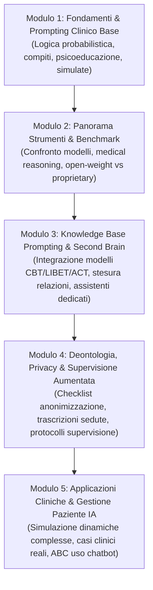
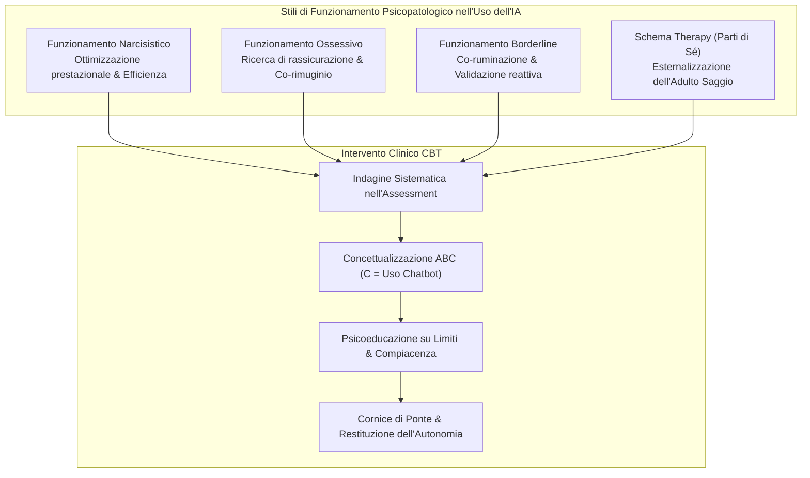
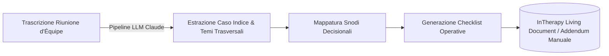

# Riunione 07-17: Corso di Formazione sull'IA in Psicologia, Gestione Clinica del Paziente, LLM-Wiki e Documentazione Bottom-Up

**Summary**: Sintesi della riunione operativa del 17 luglio 2026 tra Andrea Ferrari, Matilde Boattini, Gabriele Caselli ed Erika. Vengono definiti l'articolazione didattica in 5 moduli per il corso di formazione sull'IA per psicoterapeuti (16-20 ore), l'inquadramento psicopatologico e le linee di intervento clinico sull'uso dell'IA da parte dei pazienti, il benchmark comparativo dei modelli (Claude, Gemini, Grok, GPT-5, Kimi k3 di Moonshot AI), l'introduzione dell'architettura LLM-Wiki (Karpathy) e la sperimentazione di living documents clinici generati dal basso (bottom-up) dalle trascrizioni di équipe inTherapy.
**Sources**: 07-17 Riunione_ Corso di Formazione sull'IA in Psicologia e Utilizzo Clinico.txt
**Last updated**: 2026-08-27
---

## 1. Partecipanti e Inquadramento Generale

La riunione vede il confronto tra **Andrea Ferrari** (psicoterapeuta, docente e coordinatore operativo), **Matilde Boattini** (ricercatrice e psicoterapeuta), **Gabriele Caselli** (didatta, co-autore del modello LIBET e direttore scientifico) ed **Erika** (dipartimento formazione continua / bioetica).

L'incontro si sviluppa lungo quattro direttrici strategiche e metodologiche:
1. Perfezionamento della scaletta e della microprogettazione didattica del corso di formazione sull'IA per psicoterapeuti.
2. Analisi della gestione clinica e psicopatologica del paziente che utilizza autonomamente strumenti di intelligenza artificiale.
3. Rassegna dei benchmark dei modelli linguistici (LMSYS Chatbot Arena, medical reasoning, modelli USA vs open-weight cinesi).
4. Esplorazione di metodologie innovative per la gestione della conoscenza clinica: il paradigma **[[llm-wiki|LLM-Wiki]]** e la **[[bottom-up-clinical-documentation|documentazione clinica bottom-up]]** da trascritti di équipe (*inTherapy living documents*).

---

## 2. Microprogettazione Didattica del Corso di Formazione

A partire dalla bozza iniziale elaborata da Matilde, il gruppo ridefinisce la struttura del corso, passando da un format compatto a un percorso modulare esteso in **5 moduli da 3-4 ore ciascuno** (per un totale di **16-20 ore di formazione**), destinato prioritariamente a psicoterapeuti professionisti ed esperti.

### Dettaglio dei 5 Moduli Didattici

1. **Modulo 1 — Fondamenti di IA Generativa e Prompting Clinico di Base**:
   - Comprensione della natura statistica/probabilistica degli LLM e mitigazione delle allucinazioni.
   - Strutturazione del prompt clinico (assegnazione di ruolo, vincoli di contesto, scomposizione per obiettivi).
   - Esercitazioni pratiche: generazione assistita di materiale psicoeducativo, schede di monitoraggio e compiti a casa (homework).
   - Simulazioni di base su interazioni di colloquio.

2. **Modulo 2 — Panorama degli Strumenti, Benchmark e Criteri di Selezione**:
   - Analisi comparativa dei principali modelli di frontiera tramite **LMSYS Chatbot Arena** e benchmark di *medical/clinical reasoning*.
   - Mappatura delle specializzazioni: predominio di **Anthropic Claude** nei compiti di ragionamento complesso e analisi testuale; eccellenza di **Google Gemini** nelle applicazioni sanitarie (*medical care*) e gestione di contesti multimodali; posizionamento di **OpenAI GPT-5/5.2** e **Grok**.
   - Introduzione ai modelli emergenti open-weight, in particolare **Kimi k3** (sviluppato da *Moonshot AI*, con finestra di contesto fino a 1 milione di token): riflessione geopolitica e tecnologica sulla competizione tra la potenza di calcolo/data center USA e l'efficienza algoritmica dei modelli cinesi a fronte di vincoli energetici e restrizioni sulle GPU.
   - Fornitura di matrici decisionali per orientare il clinico nella scelta dello strumento più idoneo per ciascun compito professionale.

3. **Modulo 3 — Knowledge Base Prompting e Second Brain Clinico**:
   - Differenza qualitativa tra prompting generico (*zero-shot*) e prompting ancorato a basi di conoscenza strutturate (*grounding* su CBT standard, LIBET, ACT).
   - Esercitazione guidata sul supporto alla stesura di relazioni cliniche e profili diagnostico-funzionali a partire da casi clinici standardizzati forniti dai docenti.
   - Costruzione di assistenti didattici specializzati e pazienti simulati (*[[trainer-simulator|Trainer Simulator]]*, *[[libet-prime|Libet Prime]]*).

4. **Modulo 4 — Deontologia, Privacy e Supervisione Clinica Aumentata**:
   - Governance dei dati e rispetto del GDPR/AI Act: erogazione di una **Privacy Checklist operativa** su cosa è lecito inserire, cosa omettere e come procedere a una rigorosa anonimizzazione/de-identificazione dei dati clinici.
   - Analisi ed elaborazione assistita di trascrizioni integrali di sedute terapeutiche.
   - Protocolli di supervisione aumentata: rilevazione di bias di conferma, identificazione di rotture dell'alleanza e generazione di ipotesi d'intervento alternative.

5. **Modulo 5 — Applicazioni Cliniche Avanzate e Gestione dell'Uso dell'IA da parte del Paziente**:
   - Formato esperienziale *"Porta il tuo caso"*: analisi in supervisione di casi complessi portati direttamente dai partecipanti.
   - Approfondimento specialistico sulla gestione clinica dei pazienti che utilizzano chatbot AI nel setting privato.
   - Esercitazioni di flessibilizzazione del piano terapeutico e ristrutturazione cognitiva.

### Kit di Materiali e Deliverable per i Partecipanti
- **Checklist Privacy & Deontologia**: Guida rapida e prescrizioni operative per il trattamento sicuro dei dati.
- **Template Architetturali di Knowledge Base**: Strutture modulari preconfigurate (per approcci CBT, LIBET, ACT) esportabili nel proprio [[second-brain-clinico|Second Brain Clinico]].
- **Libreria di Prompt Clinici**: Repository di prompt strutturati, collaudati e commentati per differenti finalità terapeutiche.
- **Matrice Comparativa dei Tool**: Scheda sintetica aggiornata sulle caratteristiche, costi e profili di privacy dei principali LLM.

---

## 3. Gestione Clinica dell'Uso dell'IA da parte del Paziente

Un tema centrale e altamente innovativo affrontato nella riunione riguarda il fatto che l'utilizzo di chatbot intelligenti (es. ChatGPT) è già una realtà per oltre la metà dei pazienti in psicoterapia, spesso senza che il terapeuta ne sia informato.

### Pattern Psicopatologici di Utilizzo dell'IA
- **Funzionamento Narcisistico**: Uso mirato ad aumentare l'efficienza, massimizzare le performance o delegare compiti cognitivi per mantenere un'immagine grandiosa.
- **Funzionamento Ossessivo**: Uso ricorsivo dell'IA come partner di rimuginio e ricerca compulsiva di rassicurazioni e certezze assolute, alimentando il ciclo di intolleranza dell'incertezza.
- **Funzionamento Borderline**: Co-ruminazione su conflitti interpersonali, ricerca di alleanze triadiche e conferme compiacenti contro figure relazionali esterne (*"Dimmi che ho ragione e che l'altro è lo stronzo"*).
- **De-responsabilizzazione nella Schema Therapy**: Viene discusso il caso clinico di un paziente che ha addestrato una chat a riconoscere le proprie "parti di sé" (modi) per classificare vignette autobiografiche. Il rischio clinico evidenziato è l'esternalizzazione dell'istanza dell'**Adulto Saggio** sulla macchina, impedendo l'interiorizzazione delle capacità di auto-riflessione e auto-validazione autonoma.

### Strategie di Valutazione e Intervento Clinico
1. **Indagine Sistematica**: Chiedere esplicitamente al paziente (durante l'assessment o l'assegnazione di compiti a casa cognitivi vs comportamentali) se, come e con quali scopi utilizzi assistenti AI.
2. **Concettualizzazione Funzionale ABC**: Mappare il ricorso all'IA come comportamento (*Consequence/Behavior*) scatenato da specifici antecedenti emotivi e convinzioni cognitive disfunzionali.
3. **Psicoeducazione**: Chiarire la natura non umana dello strumento, la tendenza alla compiacenza algoritmica (*sycophancy*) e il rischio di delegare funzioni cognitive o emotive.
4. **Cornice di Ponte (*Bridge Framing*)**: Definire limiti concordati sull'uso dell'IA (es. strumento esplorativo di brainstorming o chiarimento concettuale, mai giudice delle decisioni o dispensatore di risposte certe).

### Riferimenti Deontologici Istituzionali
Viene esaminata la guida operativa dell'**Ordine degli Psicologi del Veneto** (gennaio 2026) sull'impiego dell'IA nella pratica professionale (trasparenza, alfabetizzazione di base, consenso informato, selezione degli strumenti). Il gruppo rileva come la letteratura e le linee guida istituzionali si concentrino quasi esclusivamente sui doveri del professionista, lasciando un vuoto teorico-clinico sulla **gestione del paziente che utilizza l'IA**, tema su cui il gruppo di lavoro intende produrre contributi e linee guida operative.

---

## 4. Nuove Evidenze sui Bias Clinici negli LLM

Andrea condivide i risultati di una recente revisione della letteratura sull'audit dei bias algoritmici nei modelli applicati alla salute mentale:
- **Bias di Genere**: Evidenza di una sistematica sottostima del benessere psicologico maschile unita alla sovrastima della gravità funzionale della psicopatologia nei pazienti maschi.
- **Bias Razziali e Intersezionali**: Tendenza degli algoritmi ad attribuire tratti di irritabilità, aggressività o pericolosità in modo sproporzionato a pazienti appartenenti a minoranze etniche (es. maschi neri), determinando distorsioni prognostiche e diagnostiche.

---

## 5. Il Paradigma [[llm-wiki|LLM-Wiki]]: Oltre il RAG Tradizionale

Andrea introduce la proposta metodologica elaborata da **Andrej Karpathy** (co-fondatore di OpenAI ed ex-direttore AI di Tesla), denominata **LLM-Wiki**:

| Parametro | RAG Tradizionale / NotebookLM | Architettura LLM-Wiki |
| :--- | :--- | :--- |
| **Struttura dei Dati** | Archivio statico di documenti grezzi suddivisi in chunk vettoriali. | Enciclopedia dinamica in Markdown strutturata e gerarchizzata per temi. |
| **Modalità di Elaborazione** | *Reattiva*: recupero di frammenti al momento della query (*chunk retrieval*). | *Proattiva*: sintesi, distillazione e cross-linking all'atto dell'ingestion. |
| **Integrazione della Conoscenza** | Frammentaria e decontestualizzata. | Olistica, cumulativa e processuale. |
| **Velocità e Precisione** | Rischio di allucinazioni e perdita del contesto globale. | Elevata accuratezza e risposte istantanee basate su conoscenza consolidata. |

Quando un nuovo documento viene inserito, l'LLM lo legge, estrae le informazioni concettualmente rilevanti, aggiorna le pagine tematiche preesistenti nella Wiki e tesse una rete di collegamenti ipertestuali bidirezionali. Questo approccio automatizza la manutenzione del [[second-brain-clinico|Second Brain Clinico]] e delle basi di conoscenza didattiche (come [[libet-prime|Libet Prime]]).

---

## 6. [[bottom-up-clinical-documentation|Documentazione Clinica Bottom-Up]]: I Living Documents di inTherapy

Gabriele presenta una metodologia avanzata sviluppata all'interno delle équipe cliniche specialistiche del network *inTherapy* (es. équipe DOC):

### Casi Operativi Sviluppati
1. **Gestione dei Trasferimenti di Pazienti (*Transfer Protocol*)**:
   - Analisi delle casistiche complesse (maternità del terapeuta, ripresa post-sospensione, passaggio stabile, invio specialistico).
   - Principio clinico: distinguere il *tratto* dallo *stato* attuale del paziente.
   - Analisi del *movente* del trasferimento (prima domanda della segreteria clinica: *"Cosa è successo che ha fatto cambiare idea al paziente?"*).
   - Checklist di ponte per il nuovo terapeuta e procedure per la segreteria clinica.
2. **Paziente Richiestivo, Passivo e Non Allineato**:
   - Gestione dell'aspettativa magica di guarigione senza impegno (*"bacchetta magica"*).
   - Lavoro sul processo relazionale anziché sul mero contenuto sintomatico.
   - Monitoraggio del funzionamento del terapeuta (*"Chi me lo fa fare?"*).
   - Definizione esplicita di bivi decisionali (Opzione 1 vs Opzione 2).

### Visione Evolutiva
- **InTherapy Living Document**: Piattaforma digitale protetta in cui i protocolli clinici si aggiornano iterativamente ad ogni riunione d'équipe.
- **Manuale Clinico "Dal Basso"**: Creazione di testi e manuali operativi fondati sull'esperienza clinica reale con autorato diffuso e partecipativo dei terapeuti d'équipe.

---

## 7. Valutazione della Fedeltà Clinica su Gruppi di Terapia Metacognitiva

Andrea illustra l'esigenza di analizzare un corpus di circa 20 trascrizioni di sedute di Terapia Metacognitiva di gruppo condotte presso la SIP. 

Gabriele suggerisce un protocollo metodologico di [[clinical-fidelity-assessment|valutazione della fedeltà]]:
1. **Grounding Teorico**: Caricamento in una Knowledge Base del modello teorico metacognitivo (compresi i contributi di Nordahl sui disturbi di personalità).
2. **Confronto Computazionale**: Interrogazione dell'LLM per discriminare le aderenze strette rispetto alle variazioni introdotte nella pratica d'aula.
3. **Analisi e Clusterizzazione delle Differenze**: Distinzione tra adattamenti clinici consapevoli ed erosioni involontarie del protocollo.
4. **Ottimizzazione del Setting**: Suggerimenti guidati dall'AI per mantenere l'efficacia clinica preservando la coerenza con il razionale teorico.

---

## 8. Calendario e Prossimi Passi

- **Fine Luglio 2026**: Invio email di coordinamento a Roberta (Direzione Formazione Continua) con la proposta di macroprogettazione e indicazioni di disponibilità per un incontro pre-estivo.
- **Autunno 2026**: Somministrazione della survey di validazione e conduzione dei focus group con allievi e docenti.
- **Inizio / Primavera 2027**: Lancio della prima edizione live del corso di formazione da 16-20 ore.
- **28 Agosto 2026 (ore 15:00)**: Prossima riunione plenaria del gruppo di lavoro su Teams.

---

## Related pages
- [[microprogettazione-formativa-ia]]
- [[llm-wiki]]
- [[bottom-up-clinical-documentation]]
- [[second-brain-clinico]]
- [[audit-bias-llm-clinici]]
- [[clinical-fidelity-assessment]]
- [[trainer-simulator]]
- [[libet-prime]]
- [[uso-problematico-chatbot-ai]]
- [[human-in-the-reasoning]]
- [[augmented-psychotherapy]]
- [[ai-assisted-psychotherapy]]
- [[07-08_Riunione_Pianificazione_Corso]]
- [[07-10_Riunione_Test_Libet_Prime]]
- [[06-10_Lezione_RAG_LLM]]
