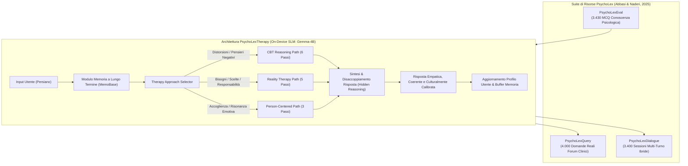

# PsychoLexTherapy: Simulating Reasoning in Psychotherapy with Small Language Models in Persian

## Definizione Operativa
- Framework clinico-computazionale e architettura modulare sviluppata da Mohammad Amin Abbasi e Hassan Naderi (Iran University of Science and Technology, 2025) per simulare il ragionamento psicoterapeutico in lingua persiana attraverso Small Language Models (SLM, modelli compatti sotto i 10 miliardi di parametri, specificamente Gemma-3 4.3B / Gemma-4B) ottimizzati per l'esecuzione locale (*on-device*) a tutela della privacy.
- Il framework integra: (1) un **Therapy Approach Selector** per il routing dinamico tra diversi orientamenti teorici; (2) **Percorsi di Ragionamento Psicoterapeutico Stepwise** (*Therapeutic Reasoning Paths*) per la Terapia Cognitivo-Comportamentale (CBT), la Reality Therapy (RT) e la Person-Centered Therapy (PCT); (3) un **Modulo di Gestione della Memoria a Lungo Termine** (*MemoBase*) per la profilazione gerarchica dinamica dell'utente e la continuità longitudinale multi-turno; (4) una suite di tre dataset specialistici in persiano: **PsychoLexEval** (benchmark di conoscenza psicologica), **PsychoLexQuery** (~4.000 query cliniche reali single-turn) e **PsychoLexDialogue** (3.400 sessioni multi-turno simulate ibride).
- **Utilità Clinica e CBT:** Supera la superficialità del prompting generico e dell'empatia di facciata (*surface-level empathy*), formalizzando il processo decisionale clinico in passaggi sequenziali che decostruiscono la triade cognitiva (pensieri, emozioni, comportamenti) e guidano la ristrutturazione senza riversare gergo analitico o pedante sull'utente; risolve l'amnesia conversazionale nei colloqui multi-seduta ed elimina i rischi di violazione della riservatezza dei dati sanitari grazie all'inferenza edge interamente locale.

## Evidenze dalla Letteratura

### 1. Il Divario di Ragionamento, Privacy e Adattamento Culturale nell'IA Clinica
- **Limiti dei Paradigmi Correnti:** Sebbene i sistemi di supporto emotivo abbiano dimostrato benefici preliminari (Sorin et al., 2024; Wang et al., 2025), la maggior parte degli agenti si affida a prompting diretto privo di logica procedurale clinica, generando cliché rassicuranti o consigli generici (Abbasi & Naderi, 2025).
- **Rischio di Riservatezza e Dipendenza Cloud:** I Large Language Models (LLM) commerciali ospitati su cloud pongono gravi minacce alla privacy per i dati psicoterapeutici sensibili (Wiest et al., 2024; Lawrence et al., 2024). L'adozione di Small Language Models (SLM, <10B) eseguiti in locale (*on-device*) azzera la fuga di dati verso server esterni e garantisce accessibilità in contesti a risorse limitate (Lu et al., 2024; Xu et al., 2024).
- **Necessità di Grounding Culturale e Linguistico:** La quasi totalità della ricerca si concentra sulla lingua inglese e sul contesto occidentale (WEIRD). Nella lingua persiana e nella società iraniana, la mancanza di corpora clinici specifici e l'ignoranza di norme socioculturali e dinamiche familiari riducono drasticamente l'efficacia e l'accettabilità dei sistemi (Aleem et al., 2024; Albor et al., 2024).

### 2. La Suite di Dataset PsychoLex
Gli autori hanno sviluppato e rilasciato tre risorse aperte dedicate alla psicoterapia in persiano:

| Dataset | Tipologia & Dimensione | Metodologia di Costruzione | Finalità Clinica & Sperimentale |
| :--- | :--- | :--- | :--- |
| **PsychoLexEval** | **3.430 quesiti a scelta multipla** (4 opzioni, 1 corretta) | Raccolta da esami di ammissione alle lauree magistrali/specialistiche in psicologia in Iran, concorsi professionali e item calibrati con GPT-4o su manuali accademici persiani. | Saggiare la competenza teorico-psicologica di base degli SLM prima del deployment (aree: clinica, cognitiva, dello sviluppo, sociale). |
| **PsychoLexQuery** | **~4.000 domande reali di utenti** (single-turn) | Web crawling e anonimizzazione manuale da portali persiani di consulenza (*EhyaCenter*, *Moshaverfa*, *Simiaroom*). | Benchmark per risposte a turno singolo: misura empatia, coerenza, accuratezza dei contenuti e aderenza socioculturale. |
| **PsychoLexDialogue** | **3.400 dialoghi multi-turno** (10–14 turni per sessione) | Pipeline ibrida: estrazione profili clinici $\rightarrow$ copione narrativo a 5 stadi PCT $\rightarrow$ co-simulazione a 2 agenti LLM (terapeuta con vincoli PCT + cliente con esitazioni/difese). | Valutazione della memoria a lungo termine, stabilità dell'alleanza terapeutica, personalizzazione e coerenza nel tempo. |

- **Distribuzione Tematica in PsychoLexQuery:** Difficoltà relazionali e coniugali (53,7%), problematiche comportamentali in bambini/adolescenti (9,6%), disturbi d'ansia (7,7%), problematiche di autostima/PTSD (6,7%), depressione (5,8%), conflitti accademici/lavorativi e lutto (16,5%).
- **Temi Emotivi Emergenti:** Frustrazione ($N=2.914$), tristezza ($N=2.124$), ansia ($N=1.306$), paura ($N=1.228$), insicurezza ($N=1.224$), confusione ($N=1.150$), preoccupazione ($N=678$), impotenza ($N=415$), disperazione ($N=266$), senso di colpa ($N=216$).

### 3. Architettura Modulare di PsychoLexTherapy
Il framework formalizza il processo decisionale e inferenziale del terapeuta umano in tre moduli interconnessi:

1. **Therapy Approach Selector:**
   - Analizza la richiesta e il profilo utente instradando il dialogo verso l'approccio ottimale:
     - *CBT:* Attivato da pensieri automatici negativi, distorsioni cognitive e vissuti di disperazione (*hopelessness*).
     - *Reality Therapy (RT):* Attivato da bisogni psicologici inappagati, scelte controproducenti e deficit di responsabilizzazione (*agency*).
     - *Person-Centered Therapy (PCT):* Attivato dal bisogno di validazione emotiva, accettazione incondizionata ed esplorazione non-direttiva.

2. **Percorsi di Ragionamento Stepwise (*Therapeutic Reasoning Paths*):**
   - **Percorso CBT (6 Passi):**
     1. *Estrazione dei Pensieri Automatici:* Identificazione delle cognizioni distorte (es. *"fallisco sempre"*).
     2. *Inferenza delle Conseguenze Emotive:* Mappatura dell'affettività collegata (es. vergogna, scoraggiamento).
     3. *Proiezione delle Tendenze Comportamentali:* Simulazione delle risposte disfunzionali (es. isolamento, evitamento).
     4. *Generazione di Alternative Bilanciate:* Ristrutturazione controfattuale e realistica culturalmente adattata.
     5. *Derivazione di Comportamenti Adattivi:* Formulazione di micro-interventi comportamentali pratici.
     6. *Sintesi in Risposta Terapeutica:* Fusione del ragionamento in un testo empatico e fluido, celando il gergo clinico interno.
   - **Percorso Reality Therapy (5 Passi):**
     1. *Identificazione dei Bisogni Nucleari:* Estrazione dei bisogni fondamentali (rispetto, amore, appartenenza, libertà, sicurezza, autoefficacia).
     2. *Analisi dei Comportamenti Attuali:* Esame delle scelte correnti che bloccano il raggiungimento dei bisogni.
     3. *Valutazione delle Conseguenze:* Connessione esplicita tra scelte individuali ed esiti, rafforzando l'autonomia.
     4. *Pianificazione Comportamentale Alternativa:* Identificazione di azioni fattibili, incrementali e culturalmente appropriate.
     5. *Integrazione nella Risposta Finale:* Comunicazione responsabilizzante, accogliente e non giudicante.
   - **Percorso Person-Centered Therapy (3 Passi):**
     1. *Rispecchiamento Empatico e Comprensione:* Identificazione e restituzione degli stati emotivi e bisogni cardine.
     2. *Domande Esplorative di Autoconsapevolezza:* Formulazione di quesiti aperti non invasivi per approfondire l'esperienza.
     3. *Sintesi Supportiva:* Chiusura con considerazione positiva incondizionata e invito alla riflessione.

3. **Long-Term Memory Management Module (MemoBase):**
   - Memorizzazione gerarchica strutturata del profilo utente:
     - *Basic Information:* Dati anagrafici, occupazione, contesto di residenza, fuso orario.
     - *Ongoing Preferences:* Stile relazionale preferito, argomenti sensibili, obiettivi di apprendimento.
     - *Personalization Settings:* Preferenze di registro, umorismo, lunghezza dei turni.
     - *Recent Events:* Eventi di vita salienti estratti con marcatori temporali.
   - *Sistema di Buffering:* I nuovi dati vengono temporaneamente isolati prima del consolidamento definitivo nel profilo a lungo termine, prevenendo derive (*profile drift*) o allucinazioni di memoria.

### 4. Risultati Sperimentali

#### A. Valutazione delle Competenze Psicologiche degli SLM (PsychoLexEval)
Valutazione zero-shot dell'accuratezza su 3.430 quesiti accademici:
- **Gemma-3 7.8B:** 55,2% | **Qwen-3 8.2B:** 53,0%
- **Gemma-3 4.3B:** **50,4%** (Selezionato come base model per PsychoLexTherapy: compromesso ideale tra accuratezza clinica, requisiti di memoria per PC consumer e totale privacy locale)
- **Qwen-3 4.0B:** 48,3% | **Gemma-3 1.0B:** 33,1%
- **Mistral 7.2B:** 31,2% | **LLaMA-3.2 3.2B:** 28,7% | **LLaMA-3.2 1.2B:** 21,3%

#### B. Valutazione Single-Turn (PsychoLexQuery)
Confronto tra PsychoLexTherapy e 4 baseline (LLM-as-a-judge con GPT-5 su scala 1–10 e Ranking Umano in cieco da parte di 3 psicologi, dove rank 1 = migliore):

| Modello / Metodo | Empatia | Coerenza & Struttura | Cultural Fit | Allineamento Terapeutico | Accuratezza Contenuto | Adattabilità | Media LLM Judge | Rank Umano (1-5) |
| :--- | :---: | :---: | :---: | :---: | :---: | :---: | :---: | :---: |
| **Simple Prompt** | 3.12 | 2.92 | 4.42 | 1.24 | 1.90 | 0.42 | 3.15 | 3.25 |
| **Simple + Selector** | 3.96 | 4.16 | 5.62 | 2.50 | 0.42 | 2.08 | 3.67 | 3.20 |
| **Empathy Chain (CoT)** | 2.43 | 1.62 | 2.92 | 1.70 | 1.44 | 1.44 | 6.19* | 3.16 |
| **Empathic Agents (Multi-Agent)** | 5.42 | 7.08 | 6.88 | 7.92 | 6.24 | 6.24 | 6.45 | 2.00 |
| **PsychoLexTherapy** | **6.25** | **8.76** | **7.29** | **8.34** | **7.08** | **7.50** | **7.24** | **1.43** |

*\*Nota sull'Empathy Chain:* I valutatori umani hanno penalizzato fortemente l'Empathy Chain (rank 3.16) a causa dell'intrusione pedante del gergo analitico nel testo rivolto al paziente, confermando l'importanza del *disaccoppiamento* implementato in PsychoLexTherapy.

#### C. Valutazione Multi-Turn (PsychoLexDialogue)
Impatto della memoria a lungo termine strutturata (scala 1–10, LLM-as-a-Judge):

| Configurazione | Empatia | Coerenza Contenuto | Coerenza Emotiva | Allineamento Terapeutico | Personalizzazione | Fluidità | Umanità Percepita | Media Globale |
| :--- | :---: | :---: | :---: | :---: | :---: | :---: | :---: | :---: |
| **Multi-Turn w/o Memory (Raw Concatenation)** | 7.8 | 6.8 | 6.6 | 6.8 | 6.4 | 3.1 | 3.4 | 5.43 |
| **Multi-Turn + Memory (MemoBase)** | 8.4 | 7.8 | 7.6 | 7.8 | 7.4 | 4.2 | 4.6 | 6.34 |
| **PsychoLexTherapy w/o Memory** | 8.6 | 7.8 | 7.8 | 8.2 | 7.6 | 5.6 | 5.7 | 6.99 |
| **PsychoLexTherapy + Memory (Full)** | **9.2** | **8.8** | **8.6** | **8.8** | **8.6** | **7.3** | **7.6** | **8.14** |

- **Effetto Sinergico:** La combinazione di percorsi inferenziali clinici e memoria gerarchica consente a PsychoLexTherapy di superare nettamente sia la concatenazione grezza del contesto (che porta a perdita di coerenza ed errori cumulativi) sia i prompt multi-agente non memorizzati.

### 5. Limiti e Considerazioni Etiche
- **Natura di Prototipo di Ricerca:** Il sistema non costituisce un dispositivo medico certificato e non include moduli convalidati di rilevamento del rischio suicidario o protocolli automatici di escalation d'emergenza.
- **Assenza di Esiti Clinici Longitudinali:** La valutazione si basa su metriche linguistiche e giudizi di esperti in cieco; mancano trial clinici randomizzati (RCT) con scale standardizzate di esito (PHQ-9, GAD-7) o di alleanza terapeutica reale (WAI).
- **Paradigmi Terapeutici Circoscritti:** Il sistema modella esclusivamente CBT, RT e PCT, escludendo approcci di terza onda (ACT, Dialectical Behavior Therapy, Schema Therapy, psicoterapia focalizzata sulle emozioni).

**Riferimenti Bibliografici:**
- Abbasi, M. A., & Naderi, H. (2025). PsychoLexTherapy: Simulating Reasoning in Psychotherapy with Small Language Models in Persian. *arXiv preprint arXiv:2510.03913v1 [cs.CL]*, 1–26. https://doi.org/10.48550/arXiv.2510.03913
- Sorin, V., Brin, D., Barash, Y., Konen, E., Charney, A., Nadkarni, G., et al. (2024). Large Language Models and Empathy: Systematic Review. *Journal of Medical Internet Research*, 26, e52597.
- Wang, Y., Li, X., Zhang, Q., Yeung, D., & Wu, Y. (2025). Effect of a Cognitive Behavioral Therapy–Based AI Chatbot on Depression and Loneliness in Chinese University Students: Randomized Controlled Trial. *JMIR mHealth and uHealth*, 13, e63806.
- Wiest, I. C., Ferber, D., Zhu, J., van Treeck, M., Meyer, S. K., Juglan, R., et al. (2024). Privacy-preserving large language models for structured medical information retrieval. *NPJ Digital Medicine*, 7, 257.
- Lawrence, H. R., Schneider, R. A., Rubin, S. B., Matarić, M. J., McDuff, D. J., & Bell, M. J. (2024). The opportunities and risks of large language models in mental health. *JMIR Mental Health*, 11, e59479.
- Lu, Z., Li, X., Cai, D., Yi, R., Liu, F., Zhang, X., et al. (2024). Small language models: Survey, measurements, and insights. *arXiv preprint arXiv:2409.15790*.
- Xu, J., Li, Z., Chen, W., Wang, Q., Gao, X., Cai, Q., et al. (2024). On-device language models: A comprehensive review. *arXiv preprint arXiv:2409.00088*.
- Packer, C., Fang, V., Patil, S. G., Lin, K., Wooders, S., & Gonzalez, J. E. (2023). MemGPT: Towards LLMs as Operating Systems. *arXiv preprint arXiv:2310.08560*.

## Relazioni
- Vedi anche: [[psycholextherapy-framework]], [[therapeutic-reasoning-paths]], [[on-device-slm-mental-health]], [[persian-psychotherapy-benchmarks]], [[memory-augmented-therapeutic-dialogue]], [[crdial-framework]], [[stepwise-cot]], [[supportive-listener-prompting]], [[cbt-dialogue-systems-and-tools]], [[simulated-therapeutic-alliance]], [[ai-assisted-psychotherapy]]
