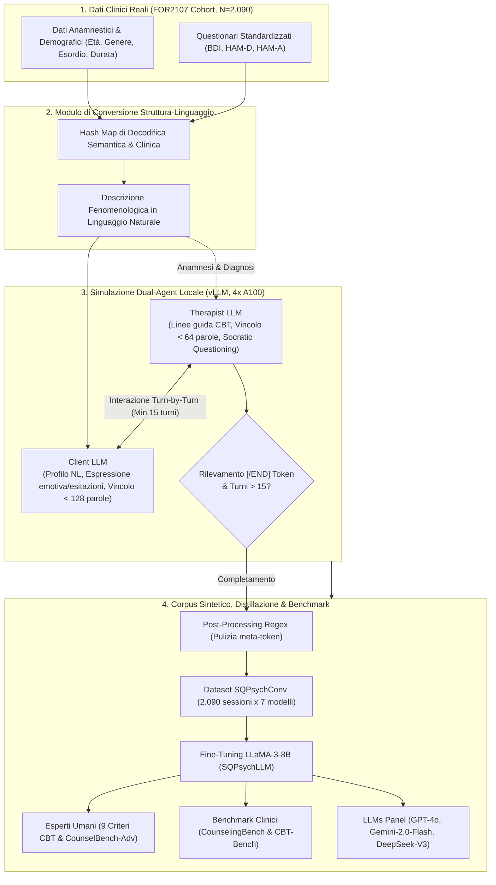

---
tags: [sqpsych, synthetic-data, dual-agent, open-weight-llm, psicoterapia-ai, cbt, depressione, privacy-salute-mentale, benchmark-clinico, distillation]
source_papers: ["2510.25384v1.pdf"]
---

# Roleplaying with Structure: Synthetic Therapist-Client Conversation Generation from Questionnaires

## Definizione Operativa
- Studio metodologico e sperimentale condotto da Vu et al. (2025) che introduce **SQPsych** (*Structured Questionnaire-based Psychotherapy*), una pipeline di simulazione multi-agente (*dual-agent roleplay*) per la generazione automatizzata di dialoghi psicoterapeutici sintetici multi-turno conformi ai principi della Terapia Cognitivo-Comportamentale (CBT) per il disturbo depressivo maggiore (MDD) e l'ansia. Per garantire il pieno rispetto delle normative sulla privacy (GDPR, HIPAA, PIPL) ed evitare la trasmissione di dati sanitari sensibili a servizi cloud proprietari terzi, il framework impiega sette modelli di linguaggio open-weight (da 27B a 123B parametri) ospitati localmente per convertire profili clinici reali e scale psicometriche standardizzate (BDI, HAM-D, HAM-A) in descrizioni in linguaggio naturale e simulare l'interazione terapeutica.
- **Utilità CBT / Clinica:** Risolve la drammatica penuria di dataset clinici conversazionali dovuta a vincoli di privacy e alla storica assenza di registrazioni integrali delle sedute. Supera le simulazioni mono-agente e l'uso non conforme di modelli commerciali (es. GPT-4 in CACTUS o SMILE), consentendo la distillazione di competenze cliniche avanzate (scoperta guidata, ristrutturazione cognitiva, individuazione di distorsioni cognitive e credenze nucleari) in modelli compatti da 8B parametri (**SQPsychLLM**), con performance superiori nei benchmark clinici standardizzati (*CounselingBench*, *CBT-Bench*) e nella preferenza espressa da psicoterapeuti esperti.

## Evidenze dalla Letteratura

- **Collo di Bottiglia di Riservatezza e Mancanza di Dati Conversazionali:**
  - L'avanzamento dei modelli di elaborazione del linguaggio naturale (NLP) e degli agenti conversazionali nella salute mentale è fortemente limitato dalla scarsità di dialoghi terapeutici autentici (Vu et al., 2025; Sharma et al., 2021).
  - Le normative internazionali di protezione dei dati (HIPAA negli Stati Uniti, GDPR nell'Unione Europea, PIPL in Cina) e i codici deontologici sul segreto professionale vietano rigorosamente la condivisione e la trasmissione di trascrizioni o cartelle cliniche a piattaforme cloud proprietarie terze (es. API OpenAI) prive di audit e isolamento certificato (De Freitas et al., 2022; Cabrera et al., 2023).
  - Nella prassi clinica tradizionale, i colloqui terapeutici non venivano routinariamente registrati o trascritti; le informazioni cliniche venivano storicamente sintetizzate attraverso scale psicometriche e questionari di autovalutazione.

- **Architettura del Framework SQPsych e Pipeline di Generazione:**
  - *Condizionamento e Conversione da Struttura a Linguaggio Naturale:* Il framework assume in ingresso dati clinici reali anonimizzati raccolti dal consorzio FOR2107 (Kircher et al., 2019) su $N = 2.090$ individui ($1.178$ controlli sani e $912$ pazienti con diagnosi di Depressione Maggiore - MDD). I metadati demografici (età, genere, istruzione, impiego, anamnesi familiare, rischio genetico, età di esordio, durata dell'episodio) e le risposte numeriche alle scale *Beck Depression Inventory* (BDI), *Hamilton Depression Rating Scale* (HAM-D) e *Hamilton Anxiety Rating Scale* (HAM-A) vengono convertiti in descrizioni estese in linguaggio naturale tramite una tabella di hash semantica (es. `HAMD2 = 2` $\rightarrow$ *"Il paziente riferisce persistenti sentimenti di colpa e idee di auto-rimprovero"*).
  - *Strategia Dual-Role (Multi-Agente Indipendente):* A differenza di paradigmi precedenti basati su un singolo modello che genera contemporaneamente entrambi i turni di dialogo (come CACTUS, Lee et al., 2024; SMILE, Qiu et al., 2024), SQPsych separa nettamente due agenti cognitivi indipendenti:
    1. **Therapist LLM:** Istruito a operare come terapeuta CBT abilitato con oltre 3.000 ore di esperienza clinica. Segue il workflow di seduta standard: verifica dell'umore (*mood check*), definizione dell'agenda (*agenda setting*), inquadramento cognitivo, scoperta guidata (*guided discovery* e *Socratic questioning*), ristrutturazione cognitiva, pianificazione di homework ed estrazione del feedback. Gli enunciati sono vincolati a essere concisi (< 64 parole), non imporre affermazioni positive artificiose e non citare mai esplicitamente i nomi dei questionari.
    2. **Client LLM:** Riceve il profilo fenomenologico in linguaggio naturale e simula autenticamente lo stato psicologico, includendo esitazioni contestuali (*"uh"*, *"well"*, *"like"*), pause di riflessione cognitiva e risposte concise (< 128 parole) coerenti con la gravità della depressione.
  - *Workflow Turn-by-Turn e Criterio di Arresto:* La simulazione procede a turni alternati integrando dinamicamente la cronologia della conversazione. Per garantire profondità ed ecologia clinica, la sessione richiede un minimo di **15 turni** prima che il Therapist LLM possa concludere l'incontro emettendo il token formale `[/END]` con fissazione della data successiva. Un post-processing con espressioni regolari (regex) rimuove meta-commenti o spiegazioni ridondanti.

- **Hosting Locale con Modelli Open-Weight e Corpus SQPsychConv:**
  - Per rispettare i vincoli di riservatezza, tutti i modelli generatori sono stati eseguiti interamente on-premise su un cluster locale di 4 GPU NVIDIA A100 (80GB VRAM ciascuna) in precisione BF16 tramite il framework `vLLM` (Kwon et al., 2023).
  - Sono stati impiegati **7 modelli open-weight** di dimensioni eterogenee (27B–123B parametri):
    1. `mistralai/Mistral-Large-Instruct-2407` (123B) $\rightarrow$ 98.342 utterance, 23.12 turni medi, 31.10 tok/utt.
    2. `CohereLabs/c4ai-command-a-03-2025` (111B) $\rightarrow$ 64.760 utterance, 17.45 turni medi, 51.02 tok/utt.
    3. `Qwen/Qwen2.5-72B-Instruct` (72B) $\rightarrow$ 64.488 utterance, 15.53 turni medi, 34.49 tok/utt.
    4. `meta-llama/Llama-3.3-70B-Instruct` (70B) $\rightarrow$ 101.694 utterance, 24.60 turni medi, 32.63 tok/utt.
    5. `nvidia/Llama-3_3-Nemotron-Super-49B-v1` (49B) $\rightarrow$ 64.238 utterance, 15.91 turni medi, 51.43 tok/utt.
    6. `Qwen/QwQ-32B` (32B) $\rightarrow$ 77.134 utterance, 18.60 turni medi, 26.29 tok/utt.
    7. `google/gemma-3-27b-it` (27B) $\rightarrow$ 71.000 utterance, 17.00 turni medi, 51.79 tok/utt.
  - Ciascun modello ha generato un corpus completo di **2.090 dialoghi** (Train: 1.693, Dev: 144, Test: 253), costituendo la suite di dataset **SQPsychConv**.
  - *Distillazione su Modelli Compatti:* Utilizzando ciascun subset sintetico, è stato eseguito il fine-tuning completo in BF16 su `Llama-3-8B-Instruct`, creando la famiglia di modelli dedicati al counseling **SQPsychLLM** (es. `SQPsychLLM_gemma`, `SQPsychLLM_command`, ecc.).

- **Valutazione Clinica Qualitativa e Quantitativa di Esperti Umani:**
  - È stato coinvolto un panel di psicologi e psicoterapeuti professionisti con formazione post-laurea per valutare 35 dialoghi clinici completi estratti casualmente dal test set (*SQPsychConv-sampled-test*).
  - *Criteri di Valutazione CBT (0–2 punti per dimensione, max 18 punti per il terapeuta):* (1) Identificazione di credenze/concetti chiave, (2) Parafrasi per comprensione reciproca, (3) Scoperta guidata della validità dei pensieri, (4) Validazione emotiva, (5) Ascolto riflessivo, (6) Precisione nella comprensione delle espressioni del cliente, (7) Chiusura strutturata della seduta, (8) Uso di linguaggio semplice, (9) Assenza di formule ripetitive.
  - *Risultati Quantitativi Umani:* **SQPsychConv-qwen2.5** ha ottenuto il punteggio medio più elevato (**16.4 ± 1.744 / 18**), seguito da **SQPsychConv-gemma** (**15.9 ± 1.375**), superando nettamente modelli di scala superiore come Mistral (14.2) e Llama-3.3 (13.5).
  - *Analisi Qualitativa:* I dialoghi MDD hanno riprodotto con notevole fedeltà le dinamiche di auto-svalutazione e auto-critica associate agli item 7 (*Self-Dislike*) e 8 (*Self-Criticalness*) del BDI (*"Perché non riesco a fare nulla? Tutti gli altri ci riescono..."*), mentre i controlli esprimevano stanchezza contingente. Gli esperti hanno apprezzato l'uso di ristrutturazioni cognitive graduali (*"Let's gently challenge this dichotomy"*) e reality-check calibrati, evidenziando la necessità di semplificare ulteriormente il lessico per evitare sovraccarico cognitivo.

- **Benchmark Automatici di Competenze Cliniche (CounselingBench e CBT-Bench):**
  - I modelli distillati `SQPsychLLM (8B)` sono stati confrontati con baseline cliniche di settore: **MentaLLaMA** (Yang et al., 2024), **CAMEL-8B** (Lee et al., 2024, addestrato su CACTUS/GPT-4o) e **Psych8k** (Liu et al., 2023, basato su casi reali riscritti con GPT-4).
  - *CounselingBench (1.612 quesiti di esame clinico NCMHCE):* Nel regime diretto *Zero-Shot*, `SQPsychLLM_gemma` e `SQPsychLLM_nemotron` hanno superato tutte le baseline con il massimo Recall (**0.492**) e `SQPsychLLM_gemma` con il miglior F1 (**0.484** vs 0.455 di Psych8k e 0.301 di CAMEL). Nel regime *Zero-Shot CoT*, CAMEL ha raggiunto 0.606 F1 beneficiando del ragionamento esplicito, mentre `SQPsychLLM_gemma` ha totalizzato 0.568 F1.
  - *CBT-Bench (Esami Master in Social Work su compiti cognitivi):*
    - *CBT-CD (Classificazione di 10 distorsioni cognitive, 146 casi):* `SQPsychLLM_gemma` ha primeggiato con Recall **0.555** e F1 **0.345** (vs 0.325 di CAMEL e 0.326 di Psych8k).
    - *CBT-PC (Identificazione di credenze nucleari primarie: helpless, unlovable, worthless, 184 casi):* `SQPsychLLM_command` ha ottenuto il massimo Recall (**0.849**) e `SQPsychLLM_nemotron` il miglior F1 (**0.737** vs 0.727 di Psych8k e 0.624 di CAMEL).
    - *CBT-FC (Credenze nucleari fini a 19 sottotipi, 112 casi):* `SQPsychLLM_qwq` ha mostrato robustezza con Recall **0.682** e F1 0.348, mentre CAMEL ha raggiunto F1 0.392.
  - *Efficienza dei Dati:* I modelli SQPsychLLM hanno superato o eguagliato le baseline proprietarie pur essendo addestrati su un volume di enunciati pari a solo il **10%** di CACTUS, dimostrando la superiorità qualitativa del condizionamento da questionari psicometrici reali.

- **Valutazione di Preferenza e Discrepanza tra Giudici LLM ed Esperti Umani:**
  - *CounselBench-Adv (120 scenari avversariali):* Nei confronti diretti a doppio cieco condotti da psicoterapeuti esperti, `SQPsychLLM_gemma` è stato preferito in modo schiacciante rispetto a CAMEL (**84 vittorie vs 22 sconfitte**) e rispetto a Psych8k (**44 vittorie vs 29 sconfitte**).
  - *Motivazione Clinica degli Esperti:* SQPsych privilegia un'indagine maieutica graduale, lasciando spazio al paziente e verificando le motivazioni sottostanti, mentre le risposte di Psych8k sono state giudicate eccessivamente frettolose, educative e soverchianti per un primo contatto clinico.
  - *Panel di LLM-as-a-Judge e Analisi di Correlazione:* Sono stati utilizzati 4 modelli proprietari come giudici automatici (GPT-4o, GPT-4o-mini, Gemini-2.0-Flash, DeepSeek-V3). Mentre la correlazione inter-modello tra LLM è risultata elevata ($r = 0.40 - 0.57$), la correlazione di Pearson tra i punteggi degli LLM-judge e i giudizi degli esperti clinici umani si è attestata su valori solo **moderati** ($r = 0.40$ con GPT-4o, $r = 0.41$ con Gemini-2.0-Flash, $r = 0.18$ con DeepSeek-V3 e $r = -0.00$ con GPT-4o-mini). Ciò evidenzia come gli LLM-judge tendano a sovrastimare la verbosità e l'articolazione formale, non cogliendo le sottigliezze relazionali e la pragmatica dell'intervento terapeutico.

- **Limiti e Implicazioni Etiche:**
  - *Focalizzazione Nosografica:* Il corpus si concentra primariamente sul disturbo depressivo maggiore (MDD) e sulle manifestazioni ansiose; disturbi complessi come psicosi o disturbo bipolare richiedono casistiche dedicate.
  - *Omogeneità di Coorte:* I dati derivano dal singolo consorzio tedesco FOR2107, richiedendo futura validazione cross-culturale.
  - *Valutazione Multi-Turn vs Single-Turn:* I benchmark esistenti privilegiano formati a singolo turno, mentre la competenza terapeutica reale si esprime nella gestione longitudinale dell'alleanza e delle rotture relazionali su più sedute.
  - *Sicurezza e Stato di Ricerca:* I modelli e i dataset sono destinati esclusivamente alla ricerca accademica e al training didattico, con divieto di applicazione clinica autonoma su pazienti reali senza supervisione umana qualificata.

**Riferimenti Bibliografici:**
- Vu, D. N. L., Tan, R., Moench, L., Francke, S. J., Woiwod, D., Thomas-Odenthal, F., Stroth, S., Kircher, T., Hermann, C., Dannlowski, U., Jamalabadi, H., & Ji, S. (2025). Roleplaying with Structure: Synthetic Therapist-Client Conversation Generation from Questionnaires. *arXiv preprint arXiv:2510.25384v1 [cs.CL]*, 1–22. https://doi.org/10.48550/arXiv.2510.25384
- Beck, A. T. (1963). Thinking and depression: I. Idiosyncratic content and cognitive distortions. *Archives of General Psychiatry*, 9(4), 324–333.
- Beck, A. T. (1974). *The Beck Depression Inventory*. Psychological Corporation.
- Hamilton, M. (1959). The assessment of anxiety states by rating. *British Journal of Medical Psychology*, 32(1), 50–55.
- Hamilton, M. (1980). Rating depressive patients. *The Journal of Clinical Psychiatry*, 41(12 Pt 2), 21–24.
- Kircher, T., Wöhr, M., Nenadic, I., Schwarting, R., Schratt, G., Alferink, J., ... & Dannlowski, U. (2019). Neurobiology of the major psychoses: A translational perspective on brain structure and function—the FOR2107 consortium. *European Archives of Psychiatry and Clinical Neuroscience*, 269(8), 949–962.
- Kwon, W., Li, Z., Zhuang, S., Sheng, Y., Zheng, L., Yu, C. H., ... & Stoica, I. (2023). Efficient memory management for large language model serving with PagedAttention. In *Proceedings of the 29th ACM SOSP*, pages 611–626.
- Lee, S., Kim, S., Kim, M., Kang, D., Yang, D., Kim, H., ... & Yeo, J. (2024). CACTUS: Towards psychological counseling conversations using cognitive behavioral theory. In *Findings of EMNLP 2024*, pages 14245–14274.
- Li, Y., Yao, J., Bunyi, J. B. S., Frank, A. C., Hwang, A., & Liu, R. (2025). CounselBench: A large-scale expert evaluation and adversarial benchmark of large language models in mental health counseling. *arXiv preprint arXiv:2506.08584*.
- Liu, J. M., Li, D., Cao, H., Ren, T., Liao, Z., & Wu, J. (2023). ChatCounselor: A large language models for mental health support. *arXiv preprint arXiv:2309.15461*.
- Nguyen, V. C., Taher, M., Hong, D., Possobom, V. K., Gopalakrishnan, V. T., Raj, E., Li, Z., Soled, H. J., Birnbaum, M. L., Kumar, S., & De Choudhury, M. (2025). Do large language models align with core mental health counseling competencies? In *Findings of NAACL 2025*, pages 7488–7511.
- Zhang, M., Yang, X., Zhang, X., Labrum, T., Chiu, J. C., Eack, S. M., Fang, F., Wang, W. Y., & Chen, Z. (2025). CBT-Bench: Evaluating large language models on assisting cognitive behavior therapy. In *Proceedings of NAACL-HLT 2025*, pages 3864–3900.

## Relazioni
- Vedi anche: [[sqpsych-framework]], [[open-weight-privacy-compliant-synthesis]], [[conversione-questionari-dialoghi-clinici]], [[clinical-ai-simulation]], [[simulazione-pazienti-ai]], [[dsm5agentflow]], [[crdial-framework]], [[cbt-dialogue-systems-and-tools]], [[audit-bias-llm-clinici]], [[explainable-mental-health-diagnosis]], [[supportive-listener-prompting]], [[language-style-matching-human-ai]], [[modello-centauro-clinico]], [[ai-assisted-psychotherapy]]