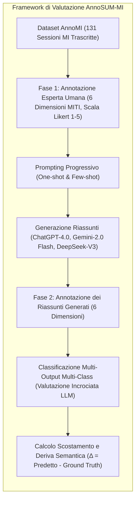

# Mitigating Semantic Drift: Evaluating LLMs’ Efficacy in Psychotherapy through MI Dialogue Summarization

## Definizione Operativa
- Studio metodologico e sperimentale (Kumar, Rajawat, & Ntoutsi, 2025; IJCNN 2025) che valuta l'efficacia dei Large Language Models (LLM) nella generazione di sintesi contestuali e nell'annotazione automatizzata di dialoghi di Colloquio Motivazionale (Motivational Interviewing, MI), introducendo il dataset esperto **AnnoSUM-MI** e un framework di valutazione a due stadi basato sulle dimensioni del **Motivational Interviewing Treatment Integrity (MITI)** per quantificare e mitigare la **deriva semantica** (*semantic drift*).
- **Utilità Clinica e CBT:** Fornisce un protocollo strutturato per monitorare l'accuratezza con cui i modelli linguistici preservano le componenti relazionali e procedurali chiave della terapia (empatia, autonomia, collaborazione, evocazione, direzione e atteggiamento non giudicante). Nel contesto CBT e negli interventi motivazionali integrati, impedisce che le sintesi automatizzate di seduta perdano informazioni critiche sul tono emotivo, sulle resistenze del paziente o sull'alleanza terapeutica, garantendo una supervisione clinica e una documentazione affidabili.

## Evidenze dalla Letteratura
- **Criticità degli LLM nel Dominio della Salute Mentale:** L'applicazione di modelli linguistici in contesti clinici e a basse risorse informative soffre di carenza di dati annotati di alta qualità, allucinazioni, incoerenze testuali e *semantic drift* (la graduale divergenza del testo generato rispetto all'intento clinico e alle dinamiche relazionali originarie), con il rischio di rinforzare stereotipi o fornire cure disomogenee (Kumar et al., 2025; Sogancioglu et al., 2024; Tripathi et al., 2024).
- **Schema di Annotazione a 6 Dimensioni (Grounded MITI):** Sviluppato aderendo al manuale MITI 4.1 (Moyers et al., 2014, 2016), lo schema valuta su scala Likert a 5 punti (da $1 = \text{Extremely Low}$ a $5 = \text{Extremely High}$):
  1. *Evocazione (Evocation):* Capacità di far emergere le motivazioni intrinseche del paziente al cambiamento.
  2. *Collaborazione (Collaboration):* Postura relazionale orizzontale e cooperativa anziché autoritaria.
  3. *Autonomia (Autonomy):* Rispetto e valorizzazione del potere decisionale e dell'indipendenza del paziente.
  4. *Direzione (Direction):* Guida costruttiva della conversazione verso gli obiettivi terapeutici senza rigidità prescrittiva.
  5. *Empatia (Empathy):* Comprensione profonda dei sentimenti e dei punti di vista del paziente.
  6. *Atteggiamento Non Giudicante (Non-Judgmental Attitude):* Creazione di un clima sicuro e di accettazione incondizionata che previene reazioni difensive.
- **Dataset AnnoSUM-MI e Accordo tra Valutatori:** Basato sul corpus AnnoMI (Wu et al., 2022, 2023) di 131 sessioni (108 ad alta qualità, 23 a bassa qualità), suddiviso in training ($n = 97$) e test set ($n = 34$). L'accordo inter-annotatore su un sottoinsieme condiviso di 15 sessioni ha riportato un $\text{Cohen's } \kappa = 0.50$ ($0.52$), valore moderato conforme alla complessità di compiti clinici multi-scala (Landis & Koch, 1977; Tanana et al., 2016; Hallgren, 2012).
- **Confronto Comparativo tra Modelli (18 Set Sperimentali):**
  - **OpenAI ChatGPT-4.0:** Miglior modello complessivo in tutti i set sperimentali; ha mostrato la minima deriva semantica rispetto alla ground truth degli esperti ($\Delta \in [-1, +1]$), producendo sintesi descrittive, bilanciate e sensibili alle sfumature empatiche ed emotive.
  - **DeepSeek-V3:** Prestazioni intermedie; superiore a Gemini ma soggetto ad allucinazioni e perdita di contesto in presenza di prompt estesi (*lost in the middle*), manifestando tendenze a giudizi polarizzati/estremi.
  - **Google Gemini-2.0 Flash:** Minore qualità nelle sintesi e massima deviazione dalla ground truth sia in configurazione one-shot che few-shot; genera riassunti troppo concisi che non riflettono l'intensità emotiva e adotta giudizi estremi sulle dimensioni cliniche.
- **Impatto del Prompting Progressivo:** L'adozione di strategie di prompting arricchite con esempi (*one-shot* e *few-shot*) riduce significativamente la deviazione semantica rispetto al prompt zero-shot, guidando i modelli a focalizzarsi sulle dimensioni relazionali del MITI (Kumar et al., 2025).

**Riferimenti Bibliografici:**
- Kumar, V., Rajawat, P. S., & Ntoutsi, E. (2025). Mitigating semantic drift: Evaluating LLMs’ efficacy in psychotherapy through MI dialogue summarization leveraging MITI code. In *2025 International Joint Conference on Neural Networks (IJCNN)*, pp. 1–8. arXiv preprint arXiv:2511.22818v1.
- Moyers, T. B., Manuel, J. K., Ernst, D., & Fortini, C. (2014). *Motivational Interviewing Treatment Integrity Coding Manual 4.1 (MITI 4.1)*. University of New Mexico CASAA.
- Moyers, T. B., Rowell, L. N., Manuel, J. K., Ernst, D., & Houck, J. M. (2016). The Motivational Interviewing Treatment Integrity code (MITI 4): Rationale, preliminary reliability and validity. *Journal of Substance Abuse Treatment*, 65, 36–42.
- Wu, Z., Balloccu, S., Kumar, V., Helaoui, R., Reiter, E., Reforgiato Recupero, D., & Riboni, D. (2022). Anno-MI: A dataset of expert-annotated counselling dialogues. In *ICASSP 2022 - 2022 IEEE International Conference on Acoustics, Speech and Signal Processing (ICASSP)*, pp. 6177–6181.
- Wu, Z., Balloccu, S., Kumar, V., Helaoui, R., Reforgiato Recupero, D., & Riboni, D. (2023). Creation, analysis and evaluation of AnnoMI, a dataset of expert-annotated counselling dialogues. *Future Internet*, 15(3), 110.
- Tanana, M., Hallgren, K. A., Imel, Z. E., Atkins, D. C., & Srikumar, V. (2016). A comparison of natural language processing methods for automated coding of motivational interviewing. *Journal of Substance Abuse Treatment*, 65, 43–50.
- Landis, J. R., & Koch, G. G. (1977). The measurement of observer agreement for categorical data. *Biometrics*, 33(1), 159–174.
- Sogancioglu, G., Mosteiro, P., Salah, A. A., Scheepers, F., & Kaya, H. (2024). Fairness in AI-based mental health: Clinician perspectives and bias mitigation. In *Proceedings of the AAAI/ACM Conference on AI, Ethics, and Society*, 7(1), 1390–1400.
- Tripathi, S., Sukumaran, R., & Cook, T. S. (2024). Efficient healthcare with large language models: Optimizing clinical workflow and enhancing patient care. *Journal of the American Medical Informatics Association*, 31(3), ocad258.

## Relazioni
- Vedi anche: [[semantic-drift-psicoterapia]], [[miti-annotation-scheme]], [[clinical-fidelity-assessment]], [[supervisione-clinica-ai]], [[bottom-up-clinical-documentation]], [[in-session-warning-signs]], [[cbt-dialogue-systems-and-tools]], [[stamp-llm-framework]], [[validita-psicometrica-llm]]
