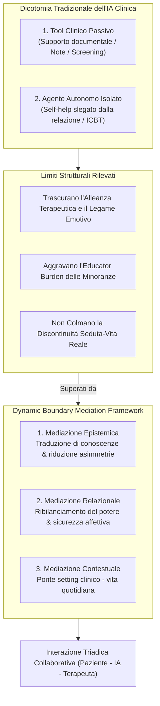
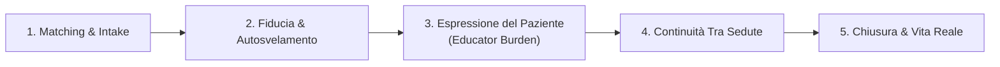
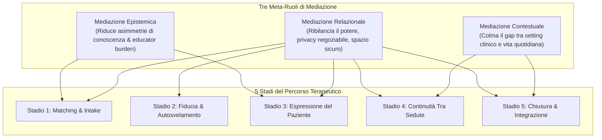

# Relational Mediators: LLM Chatbots as Boundary Objects in Psychotherapy

## Definizione Operativa
- Studio qualitativo ed empirico-metodologico condotto da J. Quan, Z. Li, T. Q. Zhu, Y. Li, B. Wang, W. Pratt e N. Gao (The Hong Kong Polytechnic University, University of Washington, Nankai University; arXiv:2512.22462v1, 2025) che ripensa radicalmente l'inquadramento dei Large Language Models (LLM) nella salute mentale, superando la tradizionale dicotomia tra "strumenti clinici passivi" (supporto burocratico-documentale per il terapeuta) e "agenti terapeutici autonomi" (sistemi di auto-aiuto disconnessi dalla relazione di cura).
- **Utilità Clinica e di Design:** Basandosi sulla **Boundary-Object Theory** (Star & Griesemer, 1989) e sulla nozione winnicottiana di *spazio potenziale*, introduce il **Dynamic Boundary Mediation Framework**. Il modello concettualizza i sistemi conversazionali potenziati da LLM come *oggetti di confine dinamici* e *mediatori relazionali socio-tecnici*, capaci di rimodulare attivamente il proprio ruolo lungo 5 stadi del percorso terapeutico attraverso tre forme di mediazione: **Epistemica** (riduzione delle asimmetrie di conoscenza e dell'onere pedagogico del paziente), **Relazionale** (riequilibrio delle dinamiche di potere e privacy negoziabile) e **Contestuale** (collegamento tra setting clinico e vita quotidiana), con specifico riferimento ai bisogni di popolazioni marginalizzate (LGBTQ+, fasce a basso reddito, malati cronici).

## Evidenze dalla Letteratura

### 1. Inquadramento Teorico: Perché la Boundary-Object Theory?
- **Limiti dei Modelli Esistenti di Interazione Uomo-IA:**
  - I primi sistemi digitali (es. Woebot, Wysa) hanno introdotto una CBT interattiva fondata su alberi decisionali e modelli strutturati (Fitzpatrick et al., 2017; Sinha et al., 2023). Tuttavia, l'uso predominante di LLM continua a focalizzarsi su metriche prestazionali disgiunte dalla qualità interpersonale della relazione di cura (Lawrence et al., 2024).
  - Per i pazienti marginalizzati (minoranze sessuali e di genere, individui a basso status socio-economico, persone con malattie croniche o neurodivergenze), l'incontro clinico è gravato da *minority stress* (Meyer, 2003), sfiducia istituzionale e asimmetrie di potere (Sue & Sue, 1999; DeVito et al., 2019).
- **Confronto tra Paradigmi Teorici Sociotecnici:**
  - *Mediation Theory (Gagnepain):* Considera simboli e cognizione come processi lineari di trasmissione dell'informazione, risultando inadeguata a catturare la continua e fluida rinegoziazione del potere interpersonale in psicoterapia.
  - *Actor-Network Theory (ANT, Callon & Latour):* Distribuendo l'agency indistintamente tra umani e non-umani, rischia di diluire l'intenzionalità clinica, l'etica e la responsabilità legale che devono tassativamente rimanere in capo al terapeuta; inoltre, tenta di convergere verso "punti di passaggio obbligati" che contrastano con la natura aperta ed ermeneutica del processo terapeutico.
  - *Boundary-Object Theory (Star & Griesemer, 1989; Trompette & Vinck, 2009):* Gli *oggetti di confine* sono artefatti sufficientemente plastici da adattarsi ai bisogni locali e specifici delle parti, ma abbastanza robusti da mantenere un'identità comune condivisa. In psicoterapia, l'oggetto di confine si configura come un'articolazione dello **spazio potenziale di Winnicott** (BenEzer, 2012) — una zona franca e protetta in cui affetti, significati e confini relazionali vengono continuamente co-costruiti.

---

### 2. Disegno Metodologico ed Ecosistema Empirico
- **Approccio Qualitativo:** *Constructivist Grounded Theory* (CGT; Charmaz, 2012) focalizzata sull'analisi di come significato, fiducia e allineamento interpretativo siano negoziati dinamicamente.
- **Campione di Partecipanti ($N = 24$):**
  - *12 Psicoterapeuti:* Professionisti abilitati in Cina (esperienza clinica da 3 a 15 anni; orientamenti CBT, psicodinamico, umanistico, junghiano, sandplay, relazionale d'oggetto e sistemico-familiare).
  - *12 Pazienti Marginalizzati:* Adulti cresciuti nel contesto culturale cinese (8 identificati come LGBTQ+, 2 con marginalizzazione intersezionale, 2 con patologie croniche o elevata sensibilità; 11 su 12 con oltre 3 sedute pregresse).
- **Protocollo Sperimentale basato su Design Probes:**
  - Interviste semi-strutturate in profondità (60–90 minuti).
  - Valutazione di 12 feature speculative di chatbot LLM (wireframe annotati presentati in condivisione schermo con scala Likert 0–10).
  - Impiego dell'**Elaboration Prompting Technique (EPT)** (Chi et al., 2001) per far emergere credenze profonde, valori e timori relazionali.
  - Codifica iterativa in tre fasi: *Open Coding* linea per linea, *Focused Coding* comparativo e *Theoretical Coding* sintetico.

---

### 3. RQ1: Sfide Relazionali nei 5 Stadi del Percorso Terapeutico
L'analisi qualitativa identifica 5 snodi critici in cui emergono tensioni sui confini relazionali (*boundary tensions*):

1. **Stadio 1: Matching e Contatto Iniziale — Conflitto di Competenze:**
   - Asimmetria epistemica tra la nozione istituzionale di "competenza clinica" (titoli formali e accreditamenti accademici privilegiati dai terapeuti) e la "competenza per esperienza vissuta / fluidità identitaria" richiesta dai pazienti marginalizzati (C8: *"Non ci serve un certificato di un seminario multiculturale, ma un terapeuta che capisca davvero le nostre vite"*).
   - I moduli di intake standardizzati tendono ad appiattire l'identità, ostacolando una valutazione autentica di compatibilità.
2. **Stadio 2: Costruzione della Fiducia e Autosvelamento — Vulnerabilità e Confini:**
   - La fiducia è una struttura a sviluppo graduale (P7). Pressioni premature all'autosvelamento o ambiguità sulla riservatezza (specialmente in contesti universitari o ospedalieri pubblici) provocano rotture precoci e ritirata difensiva.
3. **Stadio 3: Espressione del Paziente e "Educator Burden" (*Who Explains to Whom?*):**
   - Asimmetria comunicativa estenuante in cui il paziente marginalizzato è costretto a "istruire" continuamente il terapeuta su concetti socioculturali, lessico LGBTQ+ e dinamiche comunitarie (C1: *"Il terapeuta non capiva il mio background..."*; C11: *"È cambiato il terapeuta e ho dovuto riraccontare e rispiegare tutto da capo"*). Questo lavoro di confine ripetitivo (*boundary labor*) consuma energie emotive e mina la profondità del lavoro clinico.
4. **Stadio 4: Continuità tra le Sedute — Disallineamento di Aspettative:**
   - Conflitto tra i rigidi confini temporali professionali del clinico (P2: *"I pazienti ci scrivono, ma non possiamo rispondere fuori orario"*) e il bisogno di "presenza continuativa" e contenimento avvertito dal paziente vulnerabile (C1).
5. **Stadio 5: Chiusura e Integrazione nel Mondo Reale — Mancanza di Portabilità Contestuale:**
   - Difficoltà nel trasferire le abilità comunicative e di autoregolazione apprese nello "spazio sicuro" del setting clinico all'interno di ambienti quotidiani ostili, non supportivi o stigmatizzanti (*limited contextual portability*; C5, P4).

---

### 4. RQ2: Il Dynamic Boundary Mediation Framework
Il framework articola come i sistemi LLM possano operare come mediatori socio-tecnici attivi integrando tre meta-ruoli nei 5 stadi:

#### Mappatura delle 12 Feature Speculative lungo i 5 Stadi
| Stadio Terapeutico | Mediazione Epistemica | Mediazione Relazionale | Mediazione Contestuale |
| :--- | :--- | :--- | :--- |
| **1. Matching & Contatto Iniziale** | **Prescreening**: traduce i vissuti soggettivi in profili clinici interpretabili. **Psicoeducazione**: chiarisce le aspettative sul processo. | **Basic Chat**: spazio informale a basso rischio per sondare la compatibilità. **Privacy Control**: impostazione precoce dei confini informativi. | *(Nessuna funzione primaria)* |
| **2. Costruzione Fiducia & Autosvelamento** | **Prescreening**: riduce l'ansia dell'ignoto e struttura il setting. | **Privacy Control** ⭐: consenso granulare (share once / partially / keep private). **Empathy Feature** ⭐: buffer emotivo non giudicante. **Basic Chat**: gradualità nella vulnerabilità. | *(Nessuna funzione primaria)* |
| **3. Espressione del Paziente** | **Psicoeducazione** ⭐: pre-carica al terapeuta conoscenze identitarie (riduce l'*educator burden*). **Prescreening**: memoria clinica cumulativa per evitare rinarrazioni esauste. | **Therapeutic Journaling** ⭐: articolazione preliminare sicura delle emozioni complesse. **Privacy Control**: condivisione selettiva delle voci di diario. | *(Nessuna funzione primaria)* |
| **4. Continuità tra le Sedute** | *(Nessuna funzione primaria)* | **Empathy Feature** ⭐: compagnia AI 24/7, mitigazione dell'ansia da disconnessione. **Therapeutic Journaling**: filo conduttore emotivo continuativo. | **Between-Session Activities** ⭐: esercizi strutturati e reminder contestualizzati. **Crisis Intervention**: rete di sicurezza e de-escalation in tempo reale. |
| **5. Chiusura & Integrazione nel Mondo Reale** | *(Nessuna funzione primaria)* | **Therapeutic Journaling**: riflessione sui progressi e autoconsapevolezza portatile. | **Between-Session Activities** ⭐: consolidamento pratico nel quotidiano. **Crisis Intervention** ⭐: percorsi di aiuto post-terapia. **Mindfulness Exercises**: abilità di coping incorporate nelle routine. |

*(Nota: ⭐ indica la funzione primaria di mediazione nello stadio specifico).*

---

### 5. Tensioni Empiriche e Sfide Sociotecniche
- **Il "Robotic Feeling" e l'Empatia Stereotipata:**
  - I partecipanti hanno evidenziato una forte repulsione verso risposte empatiche generiche e prefabbricate (C5: *"Quando parli con un chatbot e risponde solo 'capiamo il tuo dolore'... non è attraente"*). Senza sintonizzazione profonda e flessibilità espressiva, il sistema non genera reale sicurezza affettiva.
- **Memoria Relazionale Distillata vs. Effetto Panopticon:**
  - La continuità conversazionale è ritenuta essenziale per non frammentare la storia clinica (C6). Tuttavia, la registrazione integrale dei log suscita ansie da sorveglianza (*panopticon effect*) e timori di ri-identificazione. Gli autori propongono l'uso di **"sintesi relazionali distillate"** (temi, trigger, progressi) controllate da autorizzazioni esplicite.
- **Validazione Comunitaria (*Community-Vetted Pathways*):**
  - I pazienti marginalizzati si fidano primariamente delle raccomandazioni provenienti da reti di pari (*peer networks*) e organizzazioni di advocacy, diffidando dell'accreditamento puramente istituzionale. I sistemi di matching devono integrare percorsi di validazione *community-informed*.

---

### 6. Cinque Linee Guida di Design (Design Guidelines - DGs)
1. **DG1 — Stage-Aware, Community-Informed & Emotionally Attuned Role Shifting:** Adattamento dinamico del ruolo del sistema attraverso i 5 stadi (dall'intake trasparente, al disinnesco dell'educator burden, fino al consolidamento autonomo post-chiusura).
2. **DG2 — Negotiable Data Visibility within a Flexible Privacy Architecture:** Consenso multilivello e granulare (*share once, share partially, keep private*) per restituire al paziente il controllo sui confini tra spazio privato e clinico.
3. **DG3 — Contextualized Relational Memory and Deep Adaptive Emotional Attunement:** Impiego di memorie relazionali distillate abbinate a risposte che mostrino autentica comprensione dell'evoluzione affettiva, superando il formalismo sterile.
4. **DG4 — Community-Validated Onboarding and Proactive Identity Knowledge Integration:** Integrazione strutturale di risorse verificate dalle comunità e aggiornamento proattivo dei modelli sui concetti identitari salienti.
5. **DG5 — Pervasive, Nuanced Context-Adaptive Empathy to Overcome Robotic Feeling:** Modulazione flessibile di registro linguistico, tono, dialetto e formalità in funzione dello stato dell'utente e della fase terapeutica.

---

**Riferimenti Bibliografici:**
- Quan, J., Li, Z., Zhu, T. Q., Li, Y., Wang, B., Pratt, W., & Gao, N. (2025). Relational Mediators: LLM Chatbots as Boundary Objects in Psychotherapy. *arXiv preprint arXiv:2512.22462v1 [cs.HC]*, 1–35. https://doi.org/10.48550/arXiv.2512.22462
- Star, S. L., & Griesemer, J. R. (1989). Institutional ecology, 'translations' and boundary objects: Amateurs and professionals in Berkeley's Museum of Vertebrate Zoology, 1907-39. *Social Studies of Science*, 19(3), 387–420.
- BenEzer, G. (2012). From Winnicott’s potential space to mutual creative space: A principle for intercultural psychotherapy. *Transcultural Psychiatry*, 49(2), 323–339.
- Bordin, E. S. (1979). The generalizability of the psychoanalytic concept of the working alliance. *Psychotherapy: Theory, Research & Practice*, 16(3), 252–260.
- Rogers, C. R. (1957). The necessary and sufficient conditions of therapeutic personality change. *Journal of Consulting Psychology*, 21(2), 95–103.
- Charmaz, K. (2012). *Constructing Grounded Theory: A Practical Guide through Qualitative Analysis*. Sage Publications.
- DeVito, M. A., Walker, A. M., Birnholtz, J., Ringland, K., Macapagal, K., Kraus, A., Munson, S., Liang, C., & Saksono, H. (2019). Social technologies for digital wellbeing among marginalized communities. In *CSCW '19 Companion* (pp. 449–454). ACM.
- Meyer, I. H. (2003). Prejudice, social stress, and mental health in lesbian, gay, and bisexual populations: Conceptual issues and research evidence. *Psychological Bulletin*, 129(5), 674–697.
- Fitzpatrick, K. K., Darcy, A., & Vierhile, M. (2017). Delivering cognitive behavior therapy to young adults with symptoms of depression and anxiety using a fully automated conversational agent (Woebot): A randomized controlled trial. *JMIR Mental Health*, 4(2), e19.
- Sinha, C., Meheli, S., & Kadaba, M. (2023). Understanding digital mental health needs and usage with an artificial intelligence–led mental health app (Wysa) during the COVID-19 pandemic: Retrospective analysis. *JMIR Formative Research*, 7, e41913.
- Lawrence, H. R., Schneider, R. A., Rubin, S. B., Matarić, M. J., McDuff, D. J., & Bell, M. J. (2024). The opportunities and risks of large language models in mental health. *JMIR Mental Health*, 11, e59479.
- Trompette, P., & Vinck, D. (2009). Revisiting the notion of boundary object. *Revue d’anthropologie des connaissances*, 3(1), 3–25.

## Relazioni
- Vedi anche: [[dynamic-boundary-mediation-framework]], [[boundary-objects-in-psychotherapy]], [[educator-burden-marginalized-clients]], [[negotiable-data-visibility-privacy]], [[contextualized-relational-memory]], [[between-session-continuity-ai]], [[interazione-triadica-terapeuta-paziente-ia]], [[ai-mental-health-vulnerable-populations]], [[simulated-empathy-vs-authentic-presence]], [[genuineness-gap]], [[weird-bias-cultural-adaptability-ai]], [[2512-05836v1]], [[2512-04124v4]]

