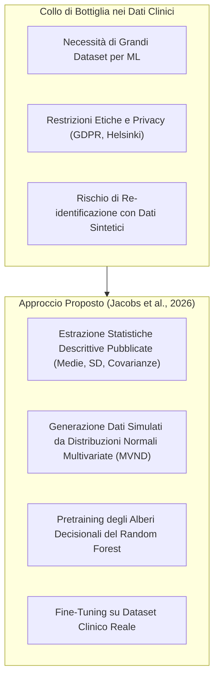
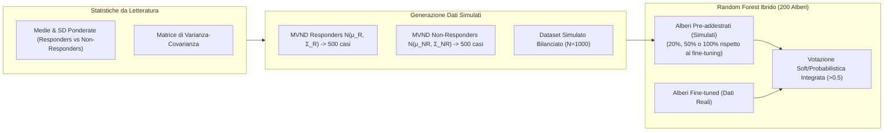
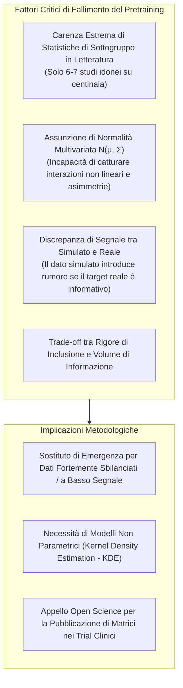

# Can we Improve Prediction of Psychotherapy Outcomes Through Pretraining With Simulated Data? (Jacobs et al., 2026)

## Definizione Operativa
- **Sintesi:** Studio empirico che valuta se il pre-addestramento (*pretraining*) di modelli di Machine Learning (Random Forests) tramite dati sintetici simulati a partire da statistiche descrittive pubblicate in letteratura (medie, deviazioni standard e matrici di covarianza di responder e non-responder) possa migliorare l'accuratezza nella predizione degli esiti della Psicoterapia Cognitivo-Comportamentale (CBT) nel Disturbo Ossessivo-Compulsivo (OCD), affrontando la scarsità di dataset clinici aperti. Attraverso due studi condotti su $N=463$ pazienti e validati con Monte Carlo Cross-Validation (100 iterazioni), gli autori rilevano che nel primo studio (predizione della *risposta*) il pretraining ha mostrato miglioramenti descrittivi (+2.2% di balanced accuracy) ma non statisticamente significativi ($p=0.19$), mentre nel secondo studio (predizione della *remissione* con estrazione sistematica) il modello addestrato solo su dati reali ha superato nettamente i modelli pre-addestrati. Vengono discusse le cause del fallimento e fornite linee guida per la ricerca futura. Fonti: `2601.06159v1.pdf` (*arXiv:2601.06159v1 [stat.ML]*).
- **Utilità CBT:** L'approccio cerca di ovviare alla mancanza di ampi dataset clinici in ambito psicoterapeutico per costruire modelli di *precision psychotherapy*, i quali mirerebbero ad allocare i trattamenti più adatti per i pazienti con OCD. L'inclusione di dati aggregati da letteratura mira a mitigare il *sampling bias* locale, mentre il *pretraining* tenta di compensare la scarsità dei dati originali, specialmente in contesti fortemente sbilanciati dove le convenzionali tecniche (es. SMOTE) non bastano. Nonostante i risultati mostrino limiti, fornisce un quadro su come integrare le evidenze di letteratura per il supporto decisionale in CBT.

## Evidenze dalla Letteratura

### La Sfida della Medicina Personalizzata e la Carenza di Dati Clinici Aperti
La medicina personalizzata e la *precision psychotherapy* mirano ad allocare in modo mirato ed efficiente i trattamenti psicoterapeutici più idonei per il singolo paziente. Sebbene gli algoritmi di Machine Learning (ML) siano ideali per gestire dati clinici complessi e ad alta dimensionalità, essi necessitano di ampi volumi di dati per raggiungere una generalizzazione ottimale. Tuttavia, in psicologia clinica e psichiatria, la condivisione pubblica di dataset (*Open Data*) è fortemente limitata da vincoli etici e normativi.

### L'Approccio Basato su Statistiche Descrittive Pubblicate
Per superare questo limite, Jacobs et al. propongono un paradigma alternativo:
1. **Aggregazione Cross-Nazionale**: estrarre parametri statistici aggregati già pubblicati in letteratura su campioni eterogenei internazionali suddivisi per esito (*responders* vs *non-responders* / *remitters* vs *non-remitters*).
2. **Mitigazione di Overfitting e Sampling Bias**: Il rumore specifico del singolo centro clinico viene smorzato; il *sampling bias* locale perde peso nella distribuzione simulata.
3. **Pretraining di Random Forest**: costruzione di un ensemble ibrido in cui una quota di alberi decisionali viene addestrata sui dati simulati da letteratura (*pretraining*) e la restante quota sui dati reali del centro clinico (*fine-tuning*).

### Architettura e Metodologia del Pretraining
1. **Simulazione dei Dati da Distribuzioni Normali Multivariate (MVND)**: I parametri estratti vengono ponderati e si definiscono distribuzioni $\mathcal{N}(\boldsymbol{\mu}, \boldsymbol{\Sigma})$. Vengono campionati 500 casi responder e 500 non-responder.
2. **Condizioni di Simulazione delle Feature**: *Six-features* (es. YBOCS, BDI-II, GAF), *Seven-features* (con MADRS), *All-features* (504 feature), *All-features MADRS included*.
3. **Ponderazione del Pretraining**: Testate le ponderazioni al 20%, 50%, e 100% di alberi pre-addestrati.
4. **Pipeline ML e Validazione**: Campione reale $N=463$ pazienti OCD trattati con CBT (Hilbert et al., 2021). Preprocessing tramite MICE e SMOTE-NC. Framework di Validazione tramite Monte Carlo Cross-Validation (MCCV) con 100 iterazioni e test di significatività di Bouckaert & Frank (2004).

### Studio 1: Predizione della Risposta al Trattamento CBT
Predizione della risposta clinica definita tramite Reliable Change Index sulla scala YBOCS.
- Risultati con bilanciamento SMOTE: Il modello pre-addestrato su tutte le feature con peso 50% ha mostrato una Balanced Accuracy del 0.549 (rispetto allo 0.526 dello standard), un miglioramento descrittivo ma non significativo ($p = 0.19$). 
- Risultati senza bilanciamento SMOTE: Il pretraining (100% peso) ha raggiunto 0.571 contro 0.516 del modello standard, risultando esplorativamente significativo ($p = 0.02$). L'inclusione della scala MADRS ha ulteriormente supportato le prestazioni.

### Studio 2: Predizione della Remissione con Ricerca Sistematica
Predizione della remissione clinica dell'OCD tramite revisione sistematica della letteratura (solo 7 studi idonei con 5 feature simulabili).
- Nello Studio 2, l'introduzione dei dati simulati ha progressivamente **degradato** le prestazioni: la balanced accuracy è scesa dallo 0.650 (modello standard) fino a 0.517 (modello con 100% peso), con drastico collasso della specificità.

### Analisi Comparativa, Limiti e Raccomandazioni

- **Limiti riscontrati**: Il colloquio di bottiglia delle pubblicazioni (*reporting deficit*) riduce drasticamente i dati sfruttabili. Inoltre, la simulazione tramite Normale Multivariata non cattura le asimmetrie psicometriche e interazioni complesse. Il pretraining ha agito perlopiù come meccanismo compensativo per l'assenza di casi della classe minoritaria, utilità che sfuma applicando lo SMOTE.
- **Raccomandazioni per il futuro**: Utilizzare stimatori non parametrici come la Kernel Density Estimation (KDE); promuovere standard *Open Science* nei trial clinici (RCT) per pubblicare matrici complete; impiegare l'approccio solo in scenari fortemente sbilanciati dove l'oversampling convenzionale fallisce.

**Riferimenti Bibliografici:**
- Jacobs, N., Voelkle, M. C., Kathmann, N., & Hilbert, K. (2026). Can we Improve Prediction of Psychotherapy Outcomes Through Pretraining With Simulated Data? *arXiv preprint arXiv:2601.06159v1 [stat.ML]*.
- Hilbert, K., Jacobi, T., Kunas, S. L., Elsner, B., Reuter, B., Lueken, U., & Kathmann, N. (2021). Identifying CBT non-response among OCD outpatients: A machine-learning approach. *Psychotherapy Research*, 31(1), 52–62.
- Bouckaert, R. R., & Frank, E. (2004). Evaluating the Replicability of Significance Tests for Comparing Learning Algorithms. *Advances in Knowledge Discovery and Data Mining*, 3056, 3–12.
- DeRubeis, R. J., Cohen, Z. D., Forand, N. R., Fournier, J. C., Gelfand, L. A., & Lorenzo-Luaces, L. (2014). The Personalized Advantage Index. *PLoS ONE*, 9(1), e83875.
- Goncalves, A., Ray, P., Soper, B., Stevens, J., Coyle, L., & Sales, A. P. (2020). Generation and evaluation of synthetic patient data. *BMC Medical Research Methodology*, 20(1), 108.
- Hittmeir, M., Mayer, R., & Ekelhart, A. (2020). A Baseline for Attribute Disclosure Risk in Synthetic Data. *Proceedings of the 10th ACM Conference on Data and Application Security and Privacy*, 133–143.

## Relazioni
- [[pretraining-simulated-data-clinical-ml]]: Concetto teorico e metodologico di pretraining con dati simulati da parametri di letteratura.
- [[open-data-scarcity-clinical-psychology]]: Problematica della scarsità di dati aperti, vincoli di privacy e reporting statistico in psicologia clinica.
- [[mccv-and-statistical-validation-clinical-ml]]: Protocollo di validazione MCCV a 100 iterazioni, bilanciamento SMOTE-NC e test statistici corretti per ML clinico.
- [[treatment-outcome-and-relapse-prediction]]: Panoramica generale sull'impiego del Machine Learning per la predizione dell'esito psicoterapeutico.
- [[ai-clinical-decision-support]]: Sistemi di supporto decisionale clinico basati su algoritmi predittivi.
- [[ai-enhanced-cbt]]: Integrazione di modelli computazionali e IA nel ciclo di trattamento cognitivo-comportamentale.
