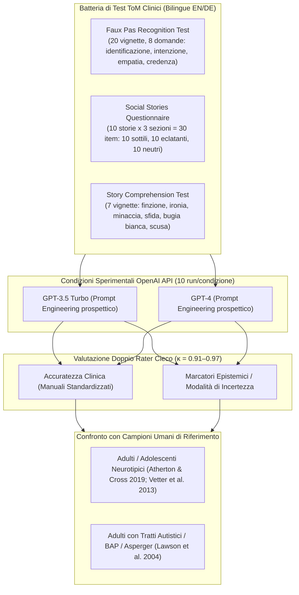
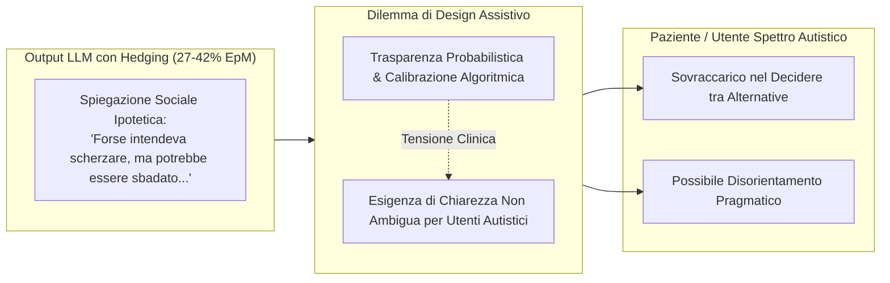

---
tags: [theory-of-mind, large-language-models, autism-spectrum, social-vignettes, faux-pas-test, social-stories-questionnaire, story-comprehension-test, epistemic-markers, assistive-ai, mental-health-ai]
source_papers: ["2601.06032v1.pdf"]
---

# Applied Theory of Mind and Large Language Models – how good is ChatGPT at solving social vignettes?

## Definizione Operativa
- Studio empirico e sperimentale condotto da Anna Katharina Holl-Etten, Nina Schnaderbeck, Elizaveta Kosareva, Leonhard Aron Prattke, Ralph Krüger, Lisa Marie Warner e Nora C. Vetter (MSB Medical School Berlin & TH Köln, 2026) che valuta sistematicamente le capacità di **Theory of Mind (ToM) di ordine superiore e applicata** in modelli di linguaggio generativo (GPT-3.5 Turbo e GPT-4) attraverso una batteria di compiti neuropsicologici basati su vignette sociali complesse (Faux Pas Recognition Test, Social Stories Questionnaire, Story Comprehension Test) in lingua inglese e tedesca.
- **Utilità Clinica e Assistiva:** Esplora la fattibilità dei Large Language Models ([[large-language-models]]) come tecnologie di supporto per individui con difficoltà nella comunicazione sociale (in particolare nello spettro autistico / *Autism Spectrum Condition*). Lo studio quantifica sia l'accuratezza inferenziale nel decodificare situazioni relazionali ambigue (gaffe sociali, ironia, bugie bianche, minacce, inganni) sia l'incidenza di **marcatori epistemici di incertezza** (*hedging* come *"maybe"*, *"probably"*, *"possibly"*), identificando il delicato trade-off tra calibrazione probabilistica dell'IA e l'esigenza di risposte univoche e non ambigue per utenti neurodivergenti.

## Evidenze dalla Letteratura

### 1. Inquadramento Teorico: Livelli di Theory of Mind e Spettro Autistico
- La **Theory of Mind (ToM)** è la capacità sociocognitiva di attribuire stati mentali (credenze, desideri, intenzioni, emozioni) a sé e agli altri per comprendere e prevedere i comportamenti interpersonali (Baron-Cohen et al., 1985; Premack & Woodruff, 1978).
- **Gerarchia di Sviluppo:**
  - *ToM di Primo Ordine (First-Order False Belief):* Comprensione delle credenze altrui che divergono dalla realtà (acquisita a 3–5 anni; paradigma Unexpected Transfer / Sally-Anne; Wimmer & Perner, 1983).
  - *ToM di Secondo Ordine (Second-Order False Belief):* Ragionamento su credenze ricorsive (*"A pensa che B creda..."*, acquisita a 6–8 anni; Miller, 2009).
  - *ToM di Ordine Superiore Applicata (Applied Higher-Order ToM):* Decodifica di sfumature pragmatiche complesse nel discorso naturale (ironia, sarcasmo, gaffe sociali/*faux pas*, bugie pietose), pienamente sviluppata in adolescenza e giovinezza (Vetter et al., 2013).
- **Difficoltà nella Neurodivergenza:** Gli individui nello spettro autistico incontrano specifiche barriere nella ToM applicata, interpretando spesso enunciati non letterali in modo rigido o fallendo nel rilevare che un commento sconveniente è stato pronunciato senza intenzioni malevole. Ciò genera isolamento sociale, ansia relazionale e vulnerabilità a incomprensioni (Müller et al., 2008).

### 2. Protocollo Metodologico dello Studio
- **Campione di Modelli e API:** GPT-3.5 Turbo e GPT-4 testati tramite API OpenAI (novembre 2023), con script asincrono e 10 repliche indipendenti per ciascuna condizione linguistica e sperimentale.
- **Strategia di Prompting:** Istruzioni mirate per arginare verbosità e allucinazioni riscontrate nei test pilota (*"Please give a single most likely answer... put yourself in the shoes of the characters and adopt their perspective and intentions"*).
- **Validazione Cross-Linguistica (Inglese vs Tedesco):** Traduzione e retrotraduzione armonizzata del Social Stories Questionnaire; versioni validate in tedesco per Faux Pas (Ströbele, 2004) e Story Comprehension (Vetter et al., 2013). Questa procedura controlla esplicitamente i bias di addestramento e la contaminazione dei dati inglesi pre-esistenti.
- **Doppia Valutazione Indipendente:** Codifica manuale rigorosa condotta da due valutatori secondo i criteri standardizzati dei test; concordanza inter-rater elevatissima ($\kappa = 0.91 - 0.97$).

---

### 3. Risultati Sperimentali per Test

#### A. Faux Pas Recognition Test (Stone et al., 1998; Baron-Cohen et al., 1999; Ströbele, 2004)
- Valuta 20 storie (10 con faux pas, 10 controllo). 8 domande per vignetta (6 punteggiate per ToM: rilevamento, identificazione, comprensione dell'inopportunità, intenzione non malevola, credenza/memoria dell'oratore, risonanza empatica + 2 domande di controllo sui fatti). Max = 60 punti (esclusa storia 16 per anomalie di risposta).

| Condizione Sperimentale | Media Punti (SD) | Accuratezza (%) | Marcatori Incertezza (Media) | % Risposte con Incertezza (EpM) |
| :--- | :---: | :---: | :---: | :---: |
| **GPT-3.5 Inglese** | 45.20 (1.87) | 84.0% | 16.10 (0.74) | 29.8% |
| **GPT-3.5 Tedesco** | 43.30 (4.16) | 80.0% | 18.70 (2.11) | 34.6% |
| **GPT-4 Inglese** | **49.60 (0.52)** | **92.0%** | 19.40 (0.84) | 35.9% |
| **GPT-4 Tedesco** | **49.50 (1.27)** | **92.0%** | 22.50 (1.35) | 41.7% |
| *Benchmark Umano: Adulti Neurotipici (Atherton & Cross, 2019)* | — | **95.0%** | — | — |
| *Benchmark Umano: Broad Autism Phenotype (Atherton & Cross, 2019)* | — | **89.0%** | — | — |

- **Analisi Statistica:** Differenza statisticamente significativa a favore di GPT-4 rispetto a GPT-3.5 sia in inglese ($z = -2.67, p = .009, r = .89$) sia in tedesco ($z = -2.52, p = .014, r = .89$).
- GPT-4 eguaglia le performance degli adulti neurotipici (92% vs 95%), superando il campione con fenotipo autistico allargato (89%). GPT-3.5 ottiene invece punteggi inferiori al benchmark clinico.

#### B. Social Stories Questionnaire (SSQ; Lawson et al., 2004)
- 10 vignette articolate in 3 sezioni (A, B, C) per un totale di 30 item (10 faux pas sottili, 10 faux pas eclatanti/blatant, 10 sezioni di controllo prive di inopportunità). Punteggio max = 20 punti.

| Condizione / Gruppo di Riferimento | Punteggio Totale (SD) | % Totale | % Faux Pas Sottili (Subtle) | % Faux Pas Eclatanti (Blatant) |
| :--- | :---: | :---: | :---: | :---: |
| **GPT-3.5 Inglese** | 4.10 (0.74) | 20.0% | 10.0% | 40.0% |
| **GPT-3.5 Tedesco** | 5.70 (1.42) | 28.0% | 15.0% | 48.0% |
| **GPT-4 Inglese** | 12.60 (1.26) | 63.0% | 35.0% | 91.0% |
| **GPT-4 Tedesco** | **13.50 (0.85)** | **67.0%** | **36.0%** | **99.0%** |
| *Adulti Neurotipici - Femmine (Lawson et al., 2004)* | — | **70.0%** | — | — |
| *Adulti Neurotipici - Maschi (Lawson et al., 2004)* | — | **60.0%** | — | — |
| *Adulti con Sindrome di Asperger (Lawson et al., 2004)* | — | **50.0%** | — | — |

- **Analisi Statistica:** Effetto principale della versione del modello massiccio: $F(1,36) = 249.46, p < .001, \eta_p^2 = .94$. Effetto principale della lingua significativo ($F(1,36) = 10.50, p = .003, \eta_p^2 = .26$), con punteggi leggermente più alti in tedesco. Interazione versione $\times$ lingua non significativa ($p = .323$).
- GPT-4 si attesta all'interno del range neurotipico adulto (63–67%), eccellendo nei commenti eclatanti (91–99%), ma mostrando limiti nei casi sottili (35–36%). GPT-3.5 collassa (20–28%), collocandosi molto al di sotto del gruppo clinico con Asperger (50%).

#### C. Story Comprehension Test (SCT; Channon & Crawford, 2000; Vetter et al., 2013)
- 7 vignette incentrate sulla comprensione di intenzioni complesse non letterali (finzione, minaccia, ironia, sfida, bugia bianca, scusa, ironia elaborata). Punteggio: 0 (errato), 1 (parziale), 2 (completo); max = 14 punti.

| Condizione / Gruppo Umano | Punteggio Medio (SD) | % Accuratezza | % Marcatori di Incertezza (EpM) |
| :--- | :---: | :---: | :---: |
| **GPT-3.5 Inglese** | 7.80 (1.14) | 56.0% | 14.2% |
| **GPT-3.5 Tedesco** | 7.90 (2.64) | 56.0% | 50.0% |
| **GPT-4 Inglese** | 8.90 (0.74) | 64.0% | 30.0% |
| **GPT-4 Tedesco** | **12.30 (0.82)** | **89.0%** | 27.1% |
| *Adulti Neurotipici (Vetter et al., 2013)* | — | **64.0%** | **5.7%** |
| *Adolescenti Neurotipici (Vetter et al., 2013)* | — | **50.0%** | **5.9%** |

- **Analisi Statistica:** ANOVA di Welch: $F(3, 19.2) = 44.60, p < .001, \eta^2 = 0.61$. GPT-4 in tedesco supera significativamente GPT-3.5 ($p = .002$) e GPT-4 in inglese ($p < .001$), oltrepassando persino il benchmark di adulti neurotipici umani (89% vs 64%).

---

### 4. L'Analisi dei Marcatori Epistemici (Epistemic Modalities & Hedging)
- I ricercatori hanno codificato sistematicamente l'uso di formule di indecisione o cautela probabilistica (*epistemic markers*, es. *"maybe"*, *"probably"*, *"possibly"*, *"vielleicht"*, *"wahrscheinlich"*).
- **Discrepanza Uomo-Macchina:** Mentre i partecipanti umani utilizzano marcatori epistemici solo nel **5.7% – 5.9%** dei casi, GPT-4 li impiega tra il **27.1% e il 41.7%** delle risposte, e GPT-3.5 raggiunge il **50.0%** nei prompt tedeschi.
- **Effetto Versione e Lingua:** Nei test ToM complessi, GPT-4 impiega più modalità epistemiche rispetto a GPT-3.5 ($p = .006$ nel Faux Pas Test), riflettendo verosimilmente le policy di allineamento e safety introdotte da OpenAI per aumentare la trasparenza quando il modello opera su contesti aperti.
- Le risposte in tedesco mostrano un'incidenza di incertezza significativamente maggiore rispetto all'inglese ($F(1,36) = 25.40, p < .001, \eta^2 = .23$), probabilmente collegata alla diversa ampiezza dei corpora di training.

---

### 5. Discussione, Dilemma Assistivo e Limiti Clinici

1. **Simulazione Funzionale vs Comprensione Reale:** I risultati eccellenti di GPT-4 attestano una capacità di estrarre e ricombinare strutture narrative e intenzionali complesse. Questo tuttavia non dimostra una reale coscienza o comprensione introspettiva degli stati mentali (*neural Theory of Mind*), bensì un avanzato pattern-matching statistico sulle regolarità sociolinguistiche umane.
2. **Il Paradosso dell'Hedging per la Neurodivergenza:** La presenza massiccia di modalità epistemiche rischia di compromettere l'efficacia pratica dell'IA come strumento assistivo: un utente che fatica a decodificare le intenzioni sociali non dovrebbe essere costretto a selezionare tra molteplici ipotesi vaghe prodotte dal bot, ma necessita di spiegazioni chiare, coerenti e strutturate.
3. **Robustezza Translinguistica:** La tenuta delle performance in tedesco scongiura l'ipotesi che GPT-4 stia unicamente recitando a memoria i test inglesi presenti nel pre-training, provando una reale capacità di generalizzazione logico-semantica.
4. **Limiti:** Assenza di canali comunicativi non verbali (prosodia vocale, sguardi, mimica facciale, postura corporale); mancata sperimentazione diretta con coorti di pazienti in compiti ecologici di vita reale.

---

**Riferimenti Bibliografici:**
- Holl-Etten, A. K., Schnaderbeck, N., Kosareva, E., Prattke, L. A., Krüger, R., Warner, L. M., & Vetter, N. C. (2026). Applied Theory of Mind and Large Language Models – how good is ChatGPT at solving social vignettes? *arXiv preprint arXiv:2601.06032v1*, 1–40.
- Atherton, G., & Cross, L. (2019). Animal faux pas: two legs good four legs bad for theory of mind, but not in the broad Autism Spectrum. *Journal of Genetic Psychology*, 180(2–3), 81–95.
- Baron-Cohen, S., Leslie, A. M., & Frith, U. (1985). Does the autistic child have a “theory of mind”? *Cognition*, 21(1), 37–46.
- Baron-Cohen, S., O’Riordan, M., Stone, V., Jones, R., & Plaisted, K. (1999). Recognition of faux pas by normally developing children and children with Asperger Syndrome or high-functioning Autism. *Journal of Autism and Developmental Disorders*, 29(5), 407–418.
- Channon, S., & Crawford, S. (2000). The effects of anterior lesions on performance on a story comprehension test: left anterior impairment on a theory of mind-type task. *Neuropsychologia*, 38(7), 1006–1017.
- Lawson, J., Baron-Cohen, S., & Wheelwright, S. (2004). Empathising and systemising in adults with and without Asperger Syndrome. *Journal of Autism and Developmental Disorders*, 34(3), 301–310.
- Stone, V. E., Baron-Cohen, S., & Knight, R. T. (1998). Frontal lobe contributions to theory of mind. *Journal of Cognitive Neuroscience*, 10(5), 640–656.
- Strachan, J. W. A., Albergo, D., Borghini, G., Pansardi, O., Scaliti, E., Gupta, S., et al. (2024). Testing theory of mind in large language models and humans. *Nature Human Behaviour*, 8(7), 1285–1295.
- Vetter, N. C., Leipold, K., Kliegel, M., Phillips, L. H., & Altgassen, M. (2013). Ongoing development of social cognition in adolescence. *Child Neuropsychology*, 19(6), 615–629.

## Relazioni
- Vedi anche: [[applied-theory-of-mind-llm]], [[epistemic-markers-in-ai]], [[large-language-models]], [[machine-psychology]], [[validita-psicometrica-llm]], [[ai-assisted-psychotherapy]], [[simulated-empathy-vs-authentic-presence]], [[simulated-therapeutic-alliance]], [[modello-centauro-clinico]]
