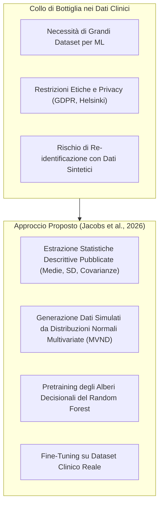
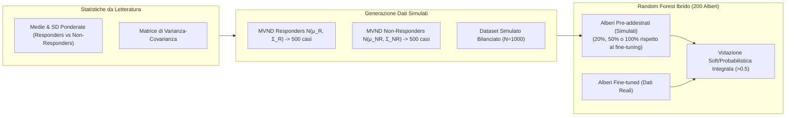
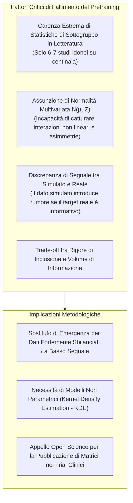

# Can we Improve Prediction of Psychotherapy Outcomes Through Pretraining With Simulated Data? (Jacobs et al., 2026)

**Summary**: Studio empirico che valuta se il pre-addestramento (*pretraining*) di modelli di Machine Learning (Random Forests) tramite dati sintetici simulati a partire da statistiche descrittive pubblicate in letteratura (medie, deviazioni standard e matrici di covarianza di responder e non-responder) possa migliorare l'accuratezza nella predizione degli esiti della Psicoterapia Cognitivo-Comportamentale (CBT) nel Disturbo Ossessivo-Compulsivo (OCD), affrontando la scarsità di dataset clinici aperti. Attraverso due studi condotti su $N=463$ pazienti e validati con Monte Carlo Cross-Validation (100 iterazioni), gli autori rilevano che nel primo studio (predizione della *risposta*) il pretraining ha mostrato miglioramenti descrittivi (+2.2% di balanced accuracy) ma non statisticamente significativi ($p=0.19$), mentre nel secondo studio (predizione della *remissione* con estrazione sistematica) il modello addestrato solo su dati reali ha superato nettamente i modelli pre-addestrati. Vengono discusse le cause del fallimento (scarsità di statistiche pubblicate per sottogruppi, limiti della normalità multivariata) e fornite linee guida per la ricerca futura.
**Sources**: `2601.06159v1.pdf` (*arXiv:2601.06159v1 [stat.ML]*, Health and Medical University Erfurt, Humboldt-Universität zu Berlin, Université de Fribourg, 2026)
**Last updated**: 2026-08-27
---

## Inquadramento e Razionale Teorico

### La Sfida della Medicina Personalizzata e la Carenza di Dati Clinici Aperti
La medicina personalizzata e la *precision psychotherapy* mirano ad allocare in modo mirato ed efficiente i trattamenti psicoterapeutici più idonei per il singolo paziente (es. Personalized Advantage Index, DeRubeis et al., 2014). Sebbene gli algoritmi di Machine Learning (ML) siano ideali per gestire dati clinici complessi e ad alta dimensionalità, essi necessitano di ampi volumi di dati per raggiungere una generalizzazione ottimale.
Tuttavia, in psicologia clinica e psichiatria, la condivisione pubblica di dataset (*Open Data*) è fortemente limitata da vincoli etici e normativi a tutela della privacy del paziente. Anche la generazione di dati sintetici (*synthetic datasets*) basata su dati individuali non azzera completamente il rischio di re-identificazione (*attribute disclosure risk*, Hittmeir et al., 2020).

### L'Approccio Basato su Statistiche Descrittive Pubblicate
Per superare questo limite, Jacobs et al. propongono un paradigma alternativo:
1. **Aggregazione Cross-Nazionale**: estrarre parametri statistici aggregati (medie, deviazioni standard, correlazioni) già pubblicati in letteratura su campioni eterogenei internazionali suddivisi per esito (*responders* vs *non-responders* / *remitters* vs *non-remitters*).
2. **Mitigazione di Overfitting e Sampling Bias**:
   - Il rumore specifico del singolo centro clinico (*noise*) viene smorzato dall'integrazione di caratteristiche di campioni eterogenei.
   - Il *sampling bias* (caratteristiche peculiari di una specifica popolazione locale) perde peso nella distribuzione simulata.
3. **Pretraining di Random Forest**: costruzione di un ensemble ibrido in cui una quota di alberi decisionali viene addestrata sui dati simulati da letteratura (*pretraining*) e la restante quota sui dati reali del centro clinico (*fine-tuning*).

---

## Architettura e Metodologia del Pretraining

### 1. Simulazione dei Dati da Distribuzioni Normali Multivariate (MVND)
- I parametri estratti da molteplici studi vengono ponderati in base alla dimensione totale del campione degli studi ($n$ complessivo, per evitare distorsioni dovute al rapporto responder/non-responder degli studi originari).
- Vengono definite due distribuzioni normali multivariate:
  $$\mathcal{N}(\boldsymbol{\mu}_R, \boldsymbol{\Sigma}_R) \quad \text{e} \quad \mathcal{N}(\boldsymbol{\mu}_{NR}, \boldsymbol{\Sigma}_{NR})$$
- Vengono campionati 500 casi di responder (label=1) e 500 casi di non-responder (label=0), ottenendo un dataset simulato bilanciato di $N=1000$ casi.

### 2. Condizioni di Simulazione delle Feature
1. **Six-features**: simulazione delle sole 6 variabili cliniche target identificate dalla letteratura (YBOCS, BDI-II, GAF, OCI-R, età di esordio del disturbo, età anagrafica).
2. **Seven-features**: 6 feature target + MADRS (inclusione esplorativa).
3. **All-features**: le 6 feature target simulate da letteratura + tutte le rimanenti feature del dataset reale (504 totali) simulate a partire dalle statistiche descrittive del train-set reale.
4. **All-features MADRS included**: tutte le 504 feature simulate (7 da letteratura, restanti da train split).

### 3. Ponderazione del Pretraining (*Weighting Parameter*)
Vengono confrontati tre livelli di peso dei dati simulati all'interno della foresta da 200 alberi:
- **20%**: 33 alberi pre-addestrati su simulati, 167 alberi su dati reali.
- **50%**: 67 alberi pre-addestrati su simulati, 133 alberi su dati reali.
- **100%**: 100 alberi pre-addestrati su simulati, 100 alberi su dati reali.

### 4. Pipeline ML e Validazione
- **Campione Reale**: $N=463$ pazienti con Disturbo Ossessivo-Compulsivo (56% donne, età 18–70, YBOCS > 16) trattati con CBT presso la clinica ambulatoriale della Humboldt-Universität zu Berlin (Hilbert et al., 2021).
- **Preprocessing**: One-hot encoding per categoriche, imputazione con Multiple Imputation by Chained Equations (MICE), bilanciamento con SMOTE-NC (oversampling della classe minoritaria).
- **Tuning Iperparametri**: Grid search a 5-fold (numero massimo di feature per split: $\sqrt{n}$, $\log_2 n$, 4, 5; campioni minimi per foglia: 1, 3, 5, 10; max samples: 66%, 80%, 100%).
- **Framework di Validazione**: **Monte Carlo Cross-Validation (MCCV)** con 100 iterazioni con differenti random seed.
- **Test di Significatività**: Corrected Resampled $t$-test (Bouckaert & Frank, 2004; Nadeau & Bengio, 2003) per correggere la non-indipendenza delle partizioni train/test ripetute.

---

## Studio 1: Predizione della Risposta al Trattamento CBT

### Obiettivo e Ipotesi
Predire la **risposta clinica** (definita tramite il Reliable Change Index, RCI, sulla scala YBOCS).
- *Ipotesi 1*: Il miglior modello pre-addestrato supererà significativamente il Random Forest standard in balanced accuracy.
- *Ipotesi 2*: Il modello con peso basso (20%) supererà i modelli ad alto peso, intervenendo selettivamente nei casi in cui il modello reale è incerto.

### Risultati dello Studio 1 (Dataset Bilanciato con SMOTE)

| Modello / Condizione | Balanced Acc (Mean ± SD) | AUC (Mean ± SD) | Sensitivity (Mean ± SD) | Specificity (Mean ± SD) | $p$-value ($H_1$) |
| :--- | :--- | :--- | :--- | :--- | :--- |
| **Standard (No Pretraining)** | $0.526 \pm 0.035$ | $0.606 \pm 0.048$ | $0.924 \pm 0.036$ | $0.128 \pm 0.066$ | — |
| **6 Feature, 20% Peso** | $0.521 \pm 0.031$ | $0.600 \pm 0.055$ | $0.921 \pm 0.035$ | $0.120 \pm 0.062$ | — |
| **6 Feature, 50% Peso** | $0.521 \pm 0.042$ | $0.578 \pm 0.061$ | $0.878 \pm 0.041$ | $0.165 \pm 0.086$ | — |
| **6 Feature, 100% Peso** | $0.521 \pm 0.049$ | $0.554 \pm 0.062$ | $0.743 \pm 0.066$ | $0.300 \pm 0.097$ | — |
| **All Features, 20% Peso** | $0.542 \pm 0.042$ | $0.594 \pm 0.056$ | $0.850 \pm 0.056$ | $0.235 \pm 0.089$ | — |
| **All Features, 50% Peso** | **$\mathbf{0.549 \pm 0.052}$** | $0.588 \pm 0.057$ | $0.680 \pm 0.132$ | $0.417 \pm 0.145$ | $p = 0.19$ (n.s.) |
| **All Features, 100% Peso** | $0.546 \pm 0.054$ | $0.583 \pm 0.058$ | $0.420 \pm 0.210$ | $0.671 \pm 0.186$ | — |

> [!NOTE]
> - **Esito statistico**: Sebbene il modello pre-addestrato su tutte le feature con peso 50% abbia mostrato un incremento descrittivo di $+2.3\%$ di balanced accuracy (da 0.526 a 0.549), il corrected resampled $t$-test ha confermato la non significatività ($t(99) = 0.89, p = 0.19$).
> - **Analisi su dati sbilanciati (senza SMOTE)**: Il pretraining su tutte le feature (100% peso) ha raggiunto una balanced accuracy di $0.571 \pm 0.050$ vs $0.516 \pm 0.020$ dello standard, risultando esplorativamente significativo ($t(99) = 2.04, p = 0.02$).
> - **Inclusione MADRS**: Ha prodotto la migliore performance descrittiva assoluta ($0.554 \pm 0.049$ bilanciato; $0.573 \pm 0.054$ sbilanciato).

---

## Studio 2: Predizione della Remissione con Ricerca Sistematica

### Obiettivo e Metodologia
Per superare i limiti di estrazione non sistematica dello Studio 1 e testare la robustezza su un diverso outcome clinico, lo Studio 2 ha focalizzato la predizione sulla **remissione clinica** dell'OCD tramite una revisione sistematica della letteratura (database: PubMed, PsycInfo, ClinicalTrials.gov al 10 ottobre 2024).

### Risultati della Ricerca Sistematica
- Su 254 record identificati (188 unici dopo rimozione duplicati), **solo 7 studi** riportavano dati statistici descrittivi idonei suddivisi tra remitter e non-remitter trattati con CBT.
- È stato possibile simulare solo **5 feature** da letteratura.

### Risultati dello Studio 2 (Dataset Bilanciato)

| Modello / Condizione | Balanced Acc (Mean ± SD) | AUC (Mean ± SD) | Sensitivity (Mean ± SD) | Specificity (Mean ± SD) | $p$-value ($H_1$) |
| :--- | :--- | :--- | :--- | :--- | :--- |
| **Standard (No Pretraining)** | **$\mathbf{0.650 \pm 0.036}$** | **$0.709 \pm 0.035$** | $0.630 \pm 0.062$ | $0.670 \pm 0.059$ | — |
| **5 Feature, 20% Peso** | $0.637 \pm 0.036$ | $0.695 \pm 0.036$ | $0.581 \pm 0.058$ | $0.694 \pm 0.055$ | $p = 1.00$ |
| **5 Feature, 50% Peso** | $0.622 \pm 0.034$ | $0.669 \pm 0.039$ | $0.518 \pm 0.068$ | $0.725 \pm 0.056$ | — |
| **5 Feature, 100% Peso** | $0.595 \pm 0.034$ | $0.637 \pm 0.042$ | $0.448 \pm 0.084$ | $0.741 \pm 0.060$ | — |
| **All Features, 20% Peso** | $0.628 \pm 0.032$ | $0.706 \pm 0.035$ | $0.787 \pm 0.074$ | $0.470 \pm 0.097$ | — |
| **All Features, 50% Peso** | $0.553 \pm 0.040$ | $0.704 \pm 0.034$ | $0.936 \pm 0.062$ | $0.170 \pm 0.129$ | — |
| **All Features, 100% Peso** | $0.517 \pm 0.027$ | $0.699 \pm 0.034$ | $0.984 \pm 0.032$ | $0.050 \pm 0.080$ | — |

> [!WARNING]
> Nello Studio 2, l'introduzione dei dati simulati da pretraining ha progressivamente **degradato** le prestazioni del modello. All'aumentare del peso dei dati simulati, la balanced accuracy è crollata da $0.650$ (standard) fino a $0.517$ (all features 100%), con un collasso drammatico della specificità ($0.050$).

---

## Analisi Comparativa, Limiti e Cause del Fallimento

### 1. Collo di Bottiglia delle Pubblicazioni (*Reporting Deficit*)
Nonostante la vasta letteratura sui trial clinici (RCT), pochissimi articoli pubblicano tabelle complete con medie, deviazioni standard e matrici di correlazione disaggregate per responder vs non-responder. Questo ha ridotto il pool a soli 6 studi nello Studio 1 e 7 nello Studio 2.

### 2. Semplificazione della Distribuzione Normale Multivariata
La generazione tramite $\mathcal{N}(\boldsymbol{\mu}, \boldsymbol{\Sigma})$ assume che le feature psicometriche e cliniche abbiano distribuzioni gaussiane simmetriche e lineari, ignorando:
- Asimmetrie tipiche dei punteggi psicometrici clinici (*floor/ceiling effects*).
- Interazioni non-lineari e pattern di clustering complessi tra le variabili.

### 3. Effetto Sostitutivo del Bilanciamento
Il pretraining ha mostrato vantaggi principalmente sui dataset non bilanciati, agendo come meccanismo compensativo per l'assenza di casi della classe minoritaria (*non-responders*). Tuttavia, quando si applica SMOTE-NC, il beneficio svanisce o diventa controproducente se il dato simulato è troppo disallineato dalla popolazione reale.

---

## Raccomandazioni per la Ricerca Futura

1. **Adozione di Distribuzioni Non Parametriche**: Sostituire la normalità multivariata con tecniche di stima non parametrica come la **Kernel Density Estimation (KDE)** (Rosenblatt, 1956) o modelli generativi basati su copule non parametriche.
2. **Standard di Pubblicazione nei Trial Clinici (RCT)**: Incoraggiare i ricercatori a pubblicare sistematicamente tabelle descrittive complete e matrici di correlazione per sottogruppi di outcome terapeutico nei materiali supplementari.
3. **Selezione Guidata da Evidenze delle Feature da Simulare**: Includere un numero maggiore di variabili predittive rilevanti anche a costo di allentare leggermente i criteri di inclusione (come dimostrato dall'impatto positivo dell'inclusione del MADRS).
4. **Strategia Sequenziale**: Applicare il pretraining con dati simulati principalmente quando il modello addestrato su dati reali presenta performance vicine al caso e le tecniche di oversampling convenzionali falliscono.

---

## Riferimenti Bibliografici
- Jacobs, N., Voelkle, M. C., Kathmann, N., & Hilbert, K. (2026). Can we Improve Prediction of Psychotherapy Outcomes Through Pretraining With Simulated Data? *arXiv preprint arXiv:2601.06159v1 [stat.ML]*.
- Hilbert, K., Jacobi, T., Kunas, S. L., Elsner, B., Reuter, B., Lueken, U., & Kathmann, N. (2021). Identifying CBT non-response among OCD outpatients: A machine-learning approach. *Psychotherapy Research*, 31(1), 52–62.
- Bouckaert, R. R., & Frank, E. (2004). Evaluating the Replicability of Significance Tests for Comparing Learning Algorithms. *Advances in Knowledge Discovery and Data Mining*, 3056, 3–12.
- DeRubeis, R. J., Cohen, Z. D., Forand, N. R., Fournier, J. C., Gelfand, L. A., & Lorenzo-Luaces, L. (2014). The Personalized Advantage Index. *PLoS ONE*, 9(1), e83875.
- Goncalves, A., Ray, P., Soper, B., Stevens, J., Coyle, L., & Sales, A. P. (2020). Generation and evaluation of synthetic patient data. *BMC Medical Research Methodology*, 20(1), 108.
- Hittmeir, M., Mayer, R., & Ekelhart, A. (2020). A Baseline for Attribute Disclosure Risk in Synthetic Data. *Proceedings of the 10th ACM Conference on Data and Application Security and Privacy*, 133–143.

---

## Pagine e Concetti Correlati
- [[pretraining-simulated-data-clinical-ml]]: Concetto teorico e metodologico di pretraining con dati simulati da parametri di letteratura.
- [[open-data-scarcity-clinical-psychology]]: Problematica della scarsità di dati aperti, vincoli di privacy e reporting statistico in psicologia clinica.
- [[mccv-and-statistical-validation-clinical-ml]]: Protocollo di validazione MCCV a 100 iterazioni, bilanciamento SMOTE-NC e test statistici corretti per ML clinico.
- [[treatment-outcome-and-relapse-prediction]]: Panoramica generale sull'impiego del Machine Learning per la predizione dell'esito psicoterapeutico.
- [[ai-clinical-decision-support]]: Sistemi di supporto decisionale clinico basati su algoritmi predittivi.
- [[ai-enhanced-cbt]]: Integrazione di modelli computazionali e IA nel ciclo di trattamento cognitivo-comportamentale.
