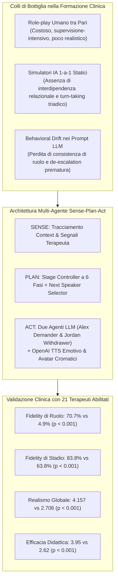
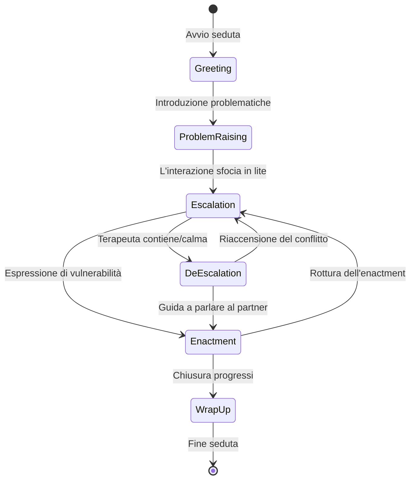

# Simulating Couple Conflict: Designing A Multi-Agent System for Therapy Training and Practice

## Definizione Operativa
- Studio sperimentale e metodologico condotto da Wang et al. (2026; Carnegie Mellon University, University of Utah, University of Pittsburgh) che presenta la progettazione, implementazione e validazione clinica di un sistema di simulazione multi-agente e multimodale per l'addestramento pratico di psicoterapeuti nella terapia di coppia.
- **Utilità Clinica e CBT:** Supera i simulatori basati su singoli pazienti e prompt statici (es. *PATIENT-Ψ*, *Roleplay-doh*), modellando la terapia di coppia come un **sistema dinamico controllato a tre vie** (terapeuta discente + 2 pazienti virtuali) imperniato sul pattern relazionale **demand–withdraw** (pursue–withdraw) e strutturato su sei stadi interattivi non lineari (*Greeting*, *Problem Raising*, *Escalation*, *De-escalation*, *Enactment*, *Wrap-up*). Il sistema permette agli allievi terapeuti di sperimentare interventi complessi (rallentamento, validazione, interruzione del ciclo disfunzionale, facilitazione dell'enactment) in un ambiente protetto a basso rischio (*deliberate practice* senza rischio di danno clinico).

---

## Evidenze dalla Letteratura

### 1. Inquadramento e Criticità del Training nella Terapia di Coppia
- **Complessità Clinica e Relazionale:** Nella terapia di coppia (orientata a modelli evidence-based come *Emotionally Focused Therapy* - EFT, *Behavioral Couple Therapy* - BCT e *Integrative Behavioral Couple Therapy* - IBCT), il terapeuta non gestisce un singolo cliente, ma una diade in cui i comportamenti e gli affetti dei partner sono strettamente interdipendenti (Christensen & Heavey, 1990; Johnson & Greenman, 2006; Benson et al., 2012).
- **Il Ciclo Demand–Withdraw:** Rappresenta la dinamica disfunzionale nucleare più diffusa: un partner (*demander*) esprime insoddisfazione, critica, incalza e richiede cambiamenti immediati; l'altro (*withdrawer*) si difende, minimizza, contrattacca passivamente o si ritira nel silenzio emotivo, innescando una spirale di esasperazione reciproca (Eldridge et al., 2002; Crenshaw et al., 2017).
- **Limiti delle Metodologie Esistenti:**
  - *Role-play con pari:* Dipendenza da supervisori e colleghi, difficoltà a standardizzare e replicare gli scenari, frequente assenza di intensità emotiva autentica (Lane & Rollnick, 2007; Shurts et al., 2006).
  - *Pazienti Virtuali LLM 1-a-1:* Sistemi precedenti (Wang et al., 2024; Louie et al., 2024; Steenstra et al., 2025) operano su contesti diadici singoli e usano prompt statici soggetti a deriva comportamentale (*behavioral drift*) e *sycophancy*, mancando di una gestione esplicita dell'evoluzione temporale della seduta (Luz de Araujo et al., 2026).

---

### 2. Framework dei Sei Stadi di Interazione e Regole di Transizione
Sulla base della letteratura clinica, di interviste semistrutturate con terapeuti esperti supervisori ($T1$ e $T2$) e dell'analisi di 7 trascrizioni reali dell'Alexander Street Transcripts corpus (1.621 turni; accordo $\kappa = 0.88$), gli autori hanno formalizzato 6 stadi sequenziali ma non lineari:

1. **Greeting:** Check-in iniziale e stabilizzazione del clima di sicurezza relazionale.
2. **Problem Raising:** Introduzione di rimproveri o motivi di consultazione; Alex assume l'iniziativa criticando dettagliatamente, Jordan si difende o minimizza.
3. **Escalation:** Conflitto aperto con accuse dirette (*"you always"*, *"you never"*); Alex incalza aggressivamente, Jordan si chiude nel sarcasmo o nel mutismo.
4. **De-escalation:** Intervento attivo del terapeuta per validare gli affetti e rallentare il ritmo (*"let's slow down"*); i partner considerano prospettive alternative.
5. **Enactment:** Intervento strutturato in cui i partner si rivolgono direttamente l'uno all'altro per esprimere emozioni primarie vulnerabili (dolore, solitudine, paura dell'abbandono) senza colpevolizzazioni (Woolley et al., 2012).
6. **Wrap-up:** Sintesi dei passi compiuti, consolidamento dei guadagni e definizione degli homework.

---

### 3. Architettura Sense-Plan-Act e Controllo Multi-Agente
Il sistema integra un'architettura **Sense-Plan-Act** progettata per mantenere coerenza a lungo raggio nel dialogo triadico:
- **Sensing & Planning (Stage Controller):** Dopo ogni messaggio del terapeuta o dei partner, il controller analizza il contesto recente ($\pm 5$ turni) e la cronologia degli stadi per selezionare la fase successiva.
- **Vincoli Euristici Deterministi (System Logic):**
  - *Turno $\le 5$:* Nessuna escalation consentita per favorire l'alleanza iniziale.
  - *Turno $7$ in Problem Raising:* Escalation forzata per garantire a tutti i corsisti l'esposizione al conflitto.
  - *Escalation per 2 turni consecutivi:* Se il terapeuta compie due tentativi di guida, viene forzata la de-escalation per consentire la transizione all'enactment.
  - *Wrap-up irreversibile:* Previene aperture disfunzionali a fine seduta.
- **Algoritmo di Determinazione del Prossimo Speaker (Next Speaker Determination):**
  - Se il terapeuta interpella un partner per nome $\rightarrow$ risponde quel partner.
  - Se il messaggio è generale $\rightarrow$ rispondono entrambi.
  - Se un agente usa espressioni accusatorie dirette rivolte all'altro $\rightarrow$ si attiva un **loop inter-agente (*agent-to-agent*)** di 3 turni in *Problem Raising* e 5 turni in *Escalation*, interrompibile in tempo reale dal terapeuta tramite Socket.IO.

---

### 4. Implementazione Multimodale e Scenari Clinici
- **Agente Alex (Demander):** Diretto, vocale, esigente, rapido all'escalation.
- **Agente Jordan (Withdrawer):** Silenzioso, difensivo, sarcastico, evitante.
- **Dinamica Emotiva e Prosodica:**
  - *Alex:* Neutral $\rightarrow$ Sad $\rightarrow$ Angry $\rightarrow$ Hopeful $\rightarrow$ Vulnerable $\rightarrow$ Relieved.
  - *Jordan:* Neutral $\rightarrow$ Anxious $\rightarrow$ Defensive/Sad $\rightarrow$ Cautious $\rightarrow$ Open $\rightarrow$ Calm.
  - *OpenAI TTS Emozionale:* Prompt dedicati modulano il tono vocale, l'affanno e l'incrinatura della voce (ad es. per la rabbia: *"Intense, urgent; voice cracks between anger and pleading"*).
- **Tre Livelli di Difficoltà:** *Easy* (agenti flessibili), *Normal* (resistenza moderata), *Hard* (alta resistenza, interruzioni reciproche spontanee).
- **Scenari Validati:** Casi clinici tratti dall'Alexander Street Corpus incentrati su infedeltà coniugale e depressione grave con ideazione suicidaria.

---

### 5. Risultati della Valutazione Sperimentale

Lo studio ha condotto un trial within-subjects in doppio cieco con **$N = 21$ psicoterapeuti abilitati** negli Stati Uniti (esperienza clinica media: $14.57$ anni; esperienza in terapia di coppia: $10.81$ anni), confrontando il sistema a stadi con una baseline prompt-only.

#### A. Valutazione Tecnica (42 sessioni, 566 turni, 1.571 enunciati)
| Dimensione Tecnica | Sistema Sperimentale | Baseline Prompt-Only | Statistica di Test | Significatività |
| :--- | :---: | :---: | :---: | :---: |
| **Stage Transition Fidelity ($\kappa$)** | $\kappa = 0.770$ (Acc: 82.93%, F1: 0.84) | N/A | Inter-rater $\kappa = 0.81$ | Confermato |
| **Numero di Transizioni di Stadio** | Più frequenti e dinamiche | Statiche / Piatte | $t = 6.36$ | $p < 0.001^{***}$ |
| **Role Fidelity (Demander / Withdrawer)** | **70.7%** (376/532) | 4.9% (16/329) | $\chi^2 = 352.39$ | $p < 0.001^{***}$ |
| **Stage Fidelity (Comportamento per stadio)** | **83.8%** (446/532) | 63.8% (210/329) | $\chi^2 = 43.75$ | $p < 0.001^{***}$ |
| **Contextual Consistency (Coerenza)** | 87.9% ($SD = 8.4$) | 93.7% ($SD = 7.8$) | $\chi^2 = 4.70$ | $p = 0.030^*$ |

#### B. Valutazione Soggettiva e Pedagogica (Modelli GLS Gerarchici)
| Outcome Clinico (Likert 1–5) | Media Sperimentale (SE) | Media Baseline (SE) | Test $z$ | $p$-value |
| :--- | :---: | :---: | :---: | :---: |
| **Riconoscimento Stadi (Stage Naming)** | **0.460** (0.035) | 0.378 (0.020) | $z = 2.32$ | $p = 0.020^*$ |
| **Riconoscimento Demand–Withdraw** | **3.301** (0.052) | 1.460 (0.181) | $z = 35.46$ | $p < 0.001^{***}$ |
| **Realismo Risposte Agenti** | **4.111** (0.051) | 2.857 (0.259) | $z = 24.72$ | $p < 0.001^{***}$ |
| **Realismo Complessivo della Coppia** | **4.157** (0.052) | 2.706 (0.234) | $z = 27.87$ | $p < 0.001^{***}$ |
| **Efficacia Didattica per Allievi Terapeuti** | **3.95** (0.19) | 2.62 (0.27) | $z = 4.18$ | $p < 0.001^{***}$ |

- **Effetti Differenziali per Stadio:** Il vantaggio di realismo del sistema sperimentale è risultato particolarmente marcato nelle fasi a più alto conflitto emotivo: **Problem Raising**, **Escalation** e **De-escalation** ($p < 0.05$).

---

### 6. Discussione e Generalizzabilità ad Altri Domini
- **Deliberate Practice Sicura:** I clinici hanno evidenziato come il simulatore fornisca un banco di prova ideale per apprendere a tollerare l'intensità emotiva dello scontro, calibrare il timing delle interruzioni e guidare l'enactment senza incorrere in rischi iatrogeni su pazienti reali.
- **Generalizzabilità a Sistemi Multi-Agente Complessi:** L'architettura Sense-Plan-Act con stage controller dinamico costituisce un design pattern generale per simulare interazioni multipartitiche non cooperative o ad alta intensità negoziale (mediazione legale, risoluzione di conflitti organizzativi, crisis management, leadership di team).

---

**Riferimenti Bibliografici:**
- Wang, C., Chen, A., Bao, C., Jin, S., Swartz, H., Wu, T., Kraut, R. E., & Zhu, H. (2026). Simulating Couple Conflict: Designing A Multi-Agent System for Therapy Training and Practice. *arXiv preprint arXiv:2601.10970v2 [cs.CY]*, 1–21. https://doi.org/10.48550/arXiv.2601.10970
- Christensen, A., & Heavey, C. L. (1990). Gender and social structure in the demand/withdraw pattern of marital conflict. *Journal of Personality and Social Psychology*, 59(1), 73–81.
- Crenshaw, A. O., Christensen, A., Baucom, D. H., Epstein, N. B., & Baucom, B. R. (2017). Revised scoring and improved reliability for the Communication Patterns Questionnaire. *Psychological Assessment*, 29(7), 913–925.
- Eldridge, K. A., & Christensen, A. (2002). Demand-withdraw communication during couple conflict: A review and analysis. *Understanding Marriage: Developments in the Study of Couple Interaction*, 289–322.
- Johnson, S. M., & Greenman, P. S. (2006). The path to a secure bond: Emotionally focused couple therapy. *Journal of Clinical Psychology*, 62(5), 597–609.
- Louie, R., Nandi, A., Fang, W., Chang, C., Brunskill, E., & Yang, D. (2024). Roleplay-doh: Enabling domain-experts to create llm-simulated patients via eliciting and adhering to principles. *arXiv preprint arXiv:2407.00870*.
- Luz de Araujo, P. H., Hedderich, M. A., Modarressi, A., Schuetze, H., & Roth, B. (2026). Persistent personas? Role-playing, instruction following, and safety in extended interactions. In *Proceedings of the 19th Conference of the European Chapter of the Association for Computational Linguistics (EACL 2026)*, pp. 5329–5359.
- Steenstra, I., Nouraei, F., & Bickmore, T. (2025). Scaffolding Empathy: Training counselors with simulated patients and utterance-level performance visualizations. In *Proceedings of the 2025 CHI Conference on Human Factors in Computing Systems (CHI 2025)*, Article 593, pp. 1–22.
- Wang, R., Milani, S., Chiu, J. C., Zhi, J., Eack, S. M., Labrum, T., Murphy, S. M., Jones, N., Hardy, K., Shen, H., et al. (2024). Patient-Ψ: Using large language models to simulate patients for training mental health professionals. *arXiv preprint arXiv:2405.19660*.
- Woolley, S. R., Wampler, K. S., & Davis, S. D. (2012). Enactments in couple therapy: Identifying therapist interventions associated with positive change. *Journal of Family Therapy*, 34(3), 284–305.

## Relazioni
- Vedi anche: [[multi-party-interaction-simulation]], [[demand-withdraw-multi-agent-dynamics]], [[simulazione-pazienti-ai]], [[clinical-ai-simulation]], [[trainer-simulator]], [[clinical-fidelity-assessment]], [[reverse-training-simulazione]], [[ai-assisted-psychotherapy]], [[modello-centauro-clinico]]
