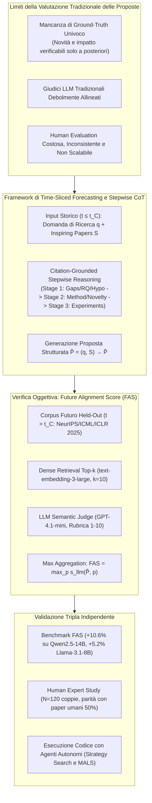
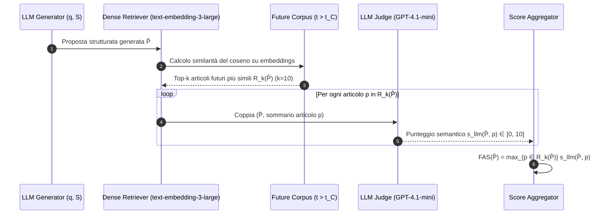
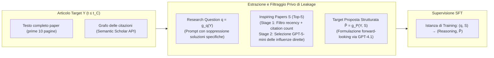
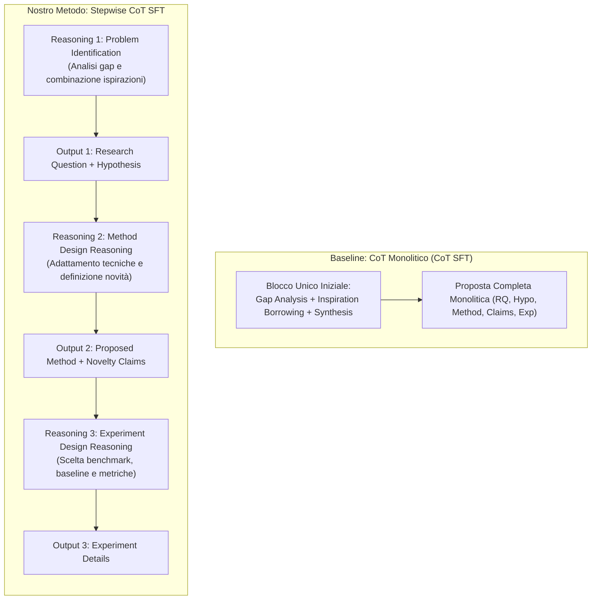
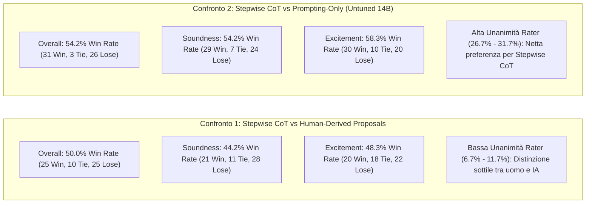
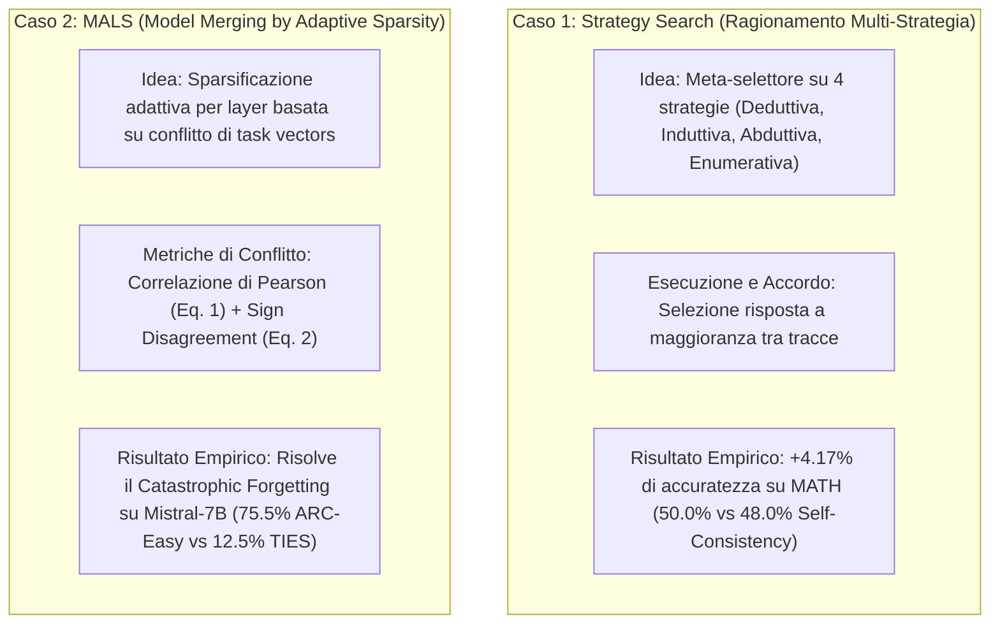

---
tags: [scientific-forecasting, future-alignment-score, proposal-generation, stepwise-cot, citation-grounded-reasoning, llm-scientific-discovery, model-merging, multi-strategy-reasoning]
source_papers: ["2603.27146v3.pdf"]
---

# Learning to Predict Future-Aligned Research Proposals with Language Models

## Definizione Operativa
- Studio pionieristico e sperimentale condotto da Heng Wang, Pengcheng Jiang, Jiashuo Sun, Zhiyi Shi, Haofei Yu, Jiawei Han e Heng Ji (University of Illinois Urbana-Champaign, 2026) che riformula la generazione automatica di proposte di ricerca da parte di [[large-language-models]] come un problema di **forecasting scientifico a divisione temporale (*time-sliced scientific forecasting*)**.
- **Utilità Metodologica e di Ricerca:** Supera i limiti dell'ottimizzazione di criteri soggettivi e non scalabili (novità, solidità tecnica, fattibilità), valutando se una proposta generata prima di una data di cutoff $t_C$ sia in grado di **anticipare traiettorie di ricerca effettivamente perseguite e pubblicate dalla comunità scientifica umana** in un corpus futuro ($t > t_C$). L'obiettivo è operazionalizzato attraverso il **[[future-alignment-score|Future Alignment Score (FAS)]]**, calcolato tramite recupero denso (*dense retrieval*) e scoring semantico basato su LLM-judge con aggregazione per valore massimo (*max aggregation*). Il framework introduce una supervisione temporale coerente priva di leakage su 21.835 occorrenze di articoli scientifici (NeurIPS, ICML, ICLR) e addestra modelli con **[[stepwise-cot|Stepwise CoT SFT]]**, che decompone la pianificazione scientifica in tre stadi interleavati (identificazione del problema, design metodologico, pianificazione sperimentale). L'efficacia è validata sia tramite benchmark empirici (+10.6% FAS su Qwen2.5-14B), sia mediante valutazione qualitativa in doppio cieco con esperti umani ($N=120$ confronti, parità con proposte umane: 50.0% win rate), sia tramite implementazione ed esecuzione di codice reale mediante agenti autonomi (+4.17% su MATH; superamento del catastrophic forgetting nel model merging MALS).

---

## Evidenze dalla Letteratura

### 1. Inquadramento e Rationale: Il Problema della Valutazione dell'Ideazione Scientifica
- **L'Ascesa dei Modelli per l'Assistenza alla Ricerca:** Negli ultimi anni, i modelli di linguaggio sono stati sempre più impiegati per accelerare la scoperta scientifica: esplorazione di idee (Wang et al., 2024a; Si et al., 2025; Pu et al., 2025), sintesi della letteratura (Wang et al., 2024b), screening e peer review (Liang et al., 2024; Zhu et al., 2025), fino ad agenti autonomi capaci di condurre workflow di ricerca end-to-end (Lu et al., 2024; Schmidgall & Moor, 2025; Yamada et al., 2025).
- **Il Collo di Bottiglia della Valutazione:** A differenza del question answering o della sintesi testuale, la generazione di proposte di ricerca non ammette un'unica risposta corretta (*no single ground-truth output*). Proprietà fondamentali come la novità concettuale, la solidità metodologica, la fattibilità tecnica e l'impatto a lungo termine sono soggettive e verificabili solo retrospettivamente. I giudici automatici convenzionali faticano a distinguere una proposta superficialmente fluida da una scientificamente valida, mentre le valutazioni umane su larga scala risultano proibitive per tempi e costi (Si et al., 2026a).
- **La Riformulazione in Forecasting Scientifico:** Gli autori trasformano la valutazione qualitativa soggettiva in una **previsione oggettiva e verificabile**: se una proposta formulata sulla base della letteratura precedente a un tempo di cutoff $t_C$ si allinea semanticamente con gli articoli che la comunità scientifica ha effettivamente prodotto e pubblicato successivamente ($t > t_C$), ciò dimostra che il modello ha catturato traiettorie di sviluppo scientificamente fruttuose e significative.

---

### 2. La Metrica del Future Alignment Score (FAS)
Dato un corpus temporizzato $\mathcal{C}$, sia $t_C$ la data di cutoff (es. fine 2024). Il corpus futuro è definito come $\mathcal{C}_{\text{future}} = \{p \in \mathcal{C} \mid t_p > t_C\}$. Data una proposta generata $\hat{P}$:

1. **Recupero Denso dei Candidati Futuri:**
   $$R_k(\hat{P}) = \text{TopK}_{p \in \mathcal{C}_{\text{future}}} \cos\big(e(\hat{P}), e(p)\big)$$
   dove $e(\cdot)$ è il modello di embedding `text-embedding-3-large` e $k=10$.
2. **Valutazione Semantica con LLM-Judge:**
   Un modello di valutazione ($s_{\text{llm}}$, GPT-4.1-mini con temperatura 0.1) assegna un punteggio da 0 a 10 su rubriche esplicite (0: Completamente slegato; 3: Stessa macro-area ma focus diverso; 5: Correlato con idee sovrapposte; 7: Direzione molto simile; 10: Quasi identico).
3. **Aggregazione per Massimo (*Max Aggregation*):**
   $$\text{FAS}(\hat{P}) = \max_{p \in R_k(\hat{P})} s_{\text{llm}}(\hat{P}, p)$$
   *Rationale del Max:* La generazione di proposte è un problema di predizione "uno-su-molti" (*one-of-many prediction*). Una proposta di alto valore deve anticipare almeno una direzione futura plausibile, non fare la media di tutte le pubblicazioni limitrofe. L'aggregazione media penalizzerebbe le idee fortemente specifiche premiando proposte generiche e banali posizionate al centroide dell'area.
4. **FAS Component-Level:** La metrica viene calcolata sia complessivamente sia per ciascuna delle 5 sezioni strutturate della proposta:
   - *Research Question*
   - *Hypothesis*
   - *Proposed Method*
   - *Novelty Claims*
   - *Experimental Details*

---

### 3. Pipeline di Costruzione dei Dati e Prevenzione dei Leakage

Per addestrare i modelli senza incorrere in contaminazioni informative future (*future leakage*), gli autori sviluppano una procedura in tre fasi partendo da paper pubblicati prima del cutoff $t_C$:

- **Estrazione della Research Question ($q$):** GPT-4.1 estrae una domanda di ricerca ampia e aperta dal testo del target paper, sopprimendo esplicitamente dettagli implementativi, nomi di algoritmi o soluzioni proprietarie.
- **Selezione Coarse-to-Fine degli Inspiring Papers ($S$, $|S|=5$):**
  - *Filtro Euristico (Stage 1):* Punteggio basato su recenza (100 punti se pubblicato entro 2 anni dal target, decadimento lineare fino a 5 anni, 0 oltre i 5 anni) più un bonus logaritmico sulle citazioni ($\min(\log(1+c)\times 2, 20)$); esclusione di citazioni con meno di 5 occorrenze. Vengono trattenuti i migliori 15 candidati.
  - *Selezione LLM Specialistica (Stage 2):* GPT-5-mini analizza titolo e abstract del target ed esclude i lavori fondazionali generici (es. Transformer, ResNet, BERT), selezionando i 5 paper che forniscono l'ispirazione metodologica o tecnica più diretta e specifica.
- **Sintesi della Proposta Target ($\tilde{P}$):** Formulazione in stile prospettico (*forward-looking proposal style*, vietando frasi retrospettive come *"gli autori propongono"* o *"in questo articolo presentiamo"*).

---

### 4. Citation-Grounded Stepwise Reasoning Traces

Gli esseri umani non generano proposte scientifiche di getto, ma formulano ipotesi analizzando i limiti della letteratura precedente (*gap analysis*), prendendo in prestito e ricombinando tecniche (*inspiration borrowing*) e pianificando gradualmente metodi ed esperimenti. Per insegnare questo processo cognitivo, lo studio sintetizza tracce di ragionamento tramite GPT-5:

- **Varianti a Confronto:**
  1. *Direct SFT:* Addestramento supervisionato diretto $(q, S) \to \tilde{P}$ senza passaggi intermedi di pensiero.
  2. *CoT SFT (w/o stepwise):* Traccia di ragionamento collocata interamente all'inizio prima della proposta: $(q, S) \to (R, \tilde{P})$.
  3. *Stepwise CoT SFT:* Ragionamento interleavato a 3 stadi, in cui ogni fase di pensiero genera direttamente la sezione corrispondente della proposta scientifica.

---

### 5. Risultati Sperimentali su Larga Scala

L'addestramento è stato condotto su **2.823 istanze di training** (NeurIPS 2024 e ICLR 2024, per un totale di 6.296 paper analizzati) e valutato su **819 istanze di test** (NeurIPS 2025, ICML 2025, ICLR 2025, per un totale di 12.243 paper nel corpus futuro), coinvolgendo 21.835 occorrenze di articoli. Modelli addestrati con LoRA ($r=16, \alpha=32$, bf16) su 4 GPU NVIDIA H100 (94GB).

#### Prestazioni Future Alignment Score (FAS) per Modello e Componente

| Backbone / Metodo | Hypothesis | Proposed Method | Novelty Claims | Exp. Details | Overall FAS |
| :--- | :---: | :---: | :---: | :---: | :---: |
| **Llama-3.1-8B-Instruct** | | | | | |
| RQ only (prompting) | 63.0 | 52.8 | 51.1 | 52.4 | 60.0 |
| Paper only (prompting) | 55.2 | 49.4 | 46.9 | 48.0 | 52.4 |
| Standard Prompting $(q, S)$ | 64.5 | 56.8 | 54.4 | 55.0 | 62.1 |
| AI-Researcher (Si et al., 2025) | 57.9 | 46.0 | 45.1 | 44.4 | 53.7 |
| Chain-of-Ideas (Li et al., 2025) | 63.2 | 54.1 | 51.6 | 45.9 | 59.3 |
| **Ours (Future-aligned SFT + Stepwise CoT)** | **68.1** | **61.0** | **58.7** | 51.9 | **65.3 (+5.2%)** |
| *-- w/o reasoning traces (Direct SFT)* | 66.7 | 58.3 | 56.9 | 54.6 | 64.1 |
| *-- w/o stepwise (Monolithic CoT)* | 67.2 | 59.2 | 57.6 | **55.1** | 65.0 |
| **Qwen2.5-7B-Instruct** | | | | | |
| Standard Prompting $(q, S)$ | 66.3 | 57.8 | 55.1 | 54.8 | 63.6 |
| AI-Researcher | 58.0 | 47.5 | 45.6 | 44.8 | 54.1 |
| Chain-of-Ideas | 62.0 | 53.2 | 50.3 | 47.1 | 59.3 |
| **Ours (Future-aligned SFT + Stepwise CoT)** | **68.7** | **60.5** | **59.1** | **54.9** | **66.5 (+4.6%)** |
| *-- w/o reasoning traces* | 67.9 | 60.0 | 58.7 | 54.9 | 65.3 |
| *-- w/o stepwise* | 68.3 | 60.2 | 59.2 | 54.8 | 65.9 |
| **Qwen2.5-14B-Instruct** | | | | | |
| Standard Prompting $(q, S)$ | 65.8 | 57.1 | 55.1 | 55.6 | 63.0 |
| AI-Researcher | 58.5 | 48.1 | 46.0 | 45.0 | 55.3 |
| Chain-of-Ideas | 63.8 | 54.7 | 52.1 | 46.8 | 60.8 |
| **Ours (Future-aligned SFT + Stepwise CoT)** | **71.4** | **63.5** | **61.8** | 56.7 | **69.7 (+10.6%)** |
| *-- w/o reasoning traces* | 68.0 | 60.0 | 58.9 | 55.1 | 65.1 |
| *-- w/o stepwise* | 68.7 | 60.0 | 58.2 | **56.8** | 66.1 |

#### Principali Evidenze Empiriche
1. **Efficacia del Tuning Temporale:** L'addestramento supervisionato allineato al futuro supera sistematicamente il prompting e le baseline precedenti su tutti i modelli. I modelli più grandi (14B) traggono il massimo vantaggio dal segnale di training (+10.6% di guadagno relativo complessivo).
2. **Superiorità dello Stepwise CoT:** La scomposizione del ragionamento in tre stadi migliora sia il CoT monolitico sia il direct SFT. I guadagni maggiori si concentrano su **Hypothesis** (da 68.0 a 71.4 su 14B) e **Proposed Method** (da 60.0 a 63.5), evidenziando come la scomposizione guidi le fasi a maggiore intensità concettuale.
3. **Difficoltà della Progettazione Sperimentale:** I miglioramenti sulla sezione *Experimental Details* sono più modesti (56.7), confermando che pianificare configurazioni sperimentali concrete e realistiche rimane un collo di bottiglia per gli attuali LLM.
4. **Ruolo degli Input:** La sola domanda di ricerca ($q$) fornisce il vincolo di alto livello (FAS 62.6 su 14B), mentre i soli paper ($S$) ottengono punteggi bassi (FAS 51.3). L'integrazione $(q, S)$ esprime il suo pieno potenziale solo quando il modello viene addestrato esplicitamente a sfruttare le citazioni tramite citation-grounded reasoning.

---

### 6. Validazione con Esperti Umani ($N=120$ Coppie)

Studio in doppio cieco condotto su 120 coppie di proposte (60 vs Human-Derived, 60 vs Prompting-Only), valutate da 11 studenti di dottorato/ricercatori esperti con esperienza di revisione congressuale (NeurIPS, ICML, ICLR).

- **Parità con le Proposte Umane:** Il modello Stepwise CoT raggiunge un tasso di vittoria del **50.0% complessivo** contro le proposte estratte da paper reali pubblicati. L'alto tasso di parità e la bassa unanimità tra i rater (6.7–11.7%) confermano che le proposte generate sono spesso indistinguibili da quelle concepite da ricercatori umani.
- **Superiorità sul Prompting:** Nello scontro con il prompting non addestrato, Stepwise CoT vince significativamente in solidità (+54.2%) ed excitement (+58.3%), con un'alta concordanza tra i revisori.

---

### 7. Studi di Caso Eseguibili con Agenti di Codifica

Per verificare se le proposte ad alto FAS corrispondano a idee concretamente implementabili, gli autori hanno affidato due proposte generate direttamente a un coding agent autonomo (*Cursor + Claude-4.5-Opus*):

1. **Strategy Search (Prompting Strategy Proposal):**
   - Esplora quattro modalità di pensiero distinte (deduttiva, induttiva, abduttiva, enumerativa) e seleziona la risposta tramite scoring di accordo.
   - Test su GSM8K, MATH e BBH: raggiunge il **50.0% su MATH** (superando il Self-Consistency al 48.0%), grazie all'efficacia della strategia enumerativa nei problemi combinatori.
2. **MALS - Merging by Adaptive Layerwise Sparsity Allocation (Model Merging Proposal):**
   - Assegna livelli di sparsità $s_l$ differenziati per ciascun layer $l$ combinando il punteggio di conflitto tra task vector $c_l$ (correlazione di Pearson e discordanza di segno) e l'importanza del layer $m_l$ (magnitudo media degli aggiornamenti).
   - Test su Mistral-7B (unione di WizardMath, OpenHermes e Zephyr): raggiunge il **75.5% su ARC-Easy** e **60.5% su ARC-Challenge**, laddove metodi classici come TIES-Merging collassano al 12.5% a causa dell'eliminazione distruttiva dei pesi in disaccordo di segno.

---

### 8. Analisi di Sensibilità delle Citazioni e Giudizio Multidimensionale

#### A. Ablazione per Tipologia di Citazione (Tabella 2)
Classificazione delle citazioni di $S$ in tre categorie (GPT-4.1-mini):
1. *Foundational / Background* (72.1% dei paper): inquadramento teorico e definizione del problema.
2. *Method / Technical* (62.8% dei paper): tecniche, algoritmi o moduli specifici.
3. *Benchmark / Experimental* (9.2% dei paper): dataset e protocolli di valutazione.

- La rimozione delle citazioni di Background comporta un calo di FAS di **-6.59 punti (-9.6%)**, mentre la rimozione delle citazioni di Metodo causa un calo di **-6.63 punti (-9.6%)**.
- La sezione **Novelty Claims** risulta la più sensibile in assoluto alla rimozione delle citazioni (-8.35 punti), dimostrando che i paper ispiratori consentono al modello di articolare contributi distintivi reali rispetto allo stato dell'arte.

#### B. Valutazione Qualitativa LLM Multidimensionale (Scala 1–5, Tabella 3)
Un LLM-judge (GPT-4.1-mini a temp 0) ha valutato le proposte su tre assi di qualità strutturale:
- **Resource Validity (1–5):** Veridicità ed esattezza dei dataset e modelli citati.
- **Task–Method Consistency (1–5):** Coerenza logica tra metodo proposto e domanda di ricerca.
- **Task–Experiment Consistency (1–5):** Adeguatezza degli esperimenti per validare l'ipotesi.

| Modello | Resource Validity | Task–Method Consistency | Task–Exp Consistency | Media Globale |
| :--- | :---: | :---: | :---: | :---: |
| Standard Prompting | 3.26 | 3.20 | 2.99 | 3.15 |
| Chain-of-Ideas (CoI) | 3.52 | 3.20 | 3.12 | 3.28 |
| AI-Researcher | 3.30 | 3.13 | 3.03 | 3.16 |
| **Future-aligned SFT (Stepwise CoT)** | **3.63** | **3.42** | **3.21** | **3.42** |
| *-- w/o reasoning traces* | 3.54 | 3.41 | 3.16 | 3.37 |
| *-- w/o stepwise* | 3.39 | 3.30 | 3.07 | 3.25 |

---

### 9. Analisi Qualitativa di Due Casi di Studio Reali (Appendice D)

- **Caso 1: TypedThinker (LLM Reasoning):**
  - *Paper Umano Pubblicato:* Architettura a tre componenti (meta-thinker per predire l'efficacia del tipo di ragionamento, memoria di dimostrazioni few-shot per tipo, reasoner con weighted voting).
  - *Nostro Modello Stepwise CoT (Score 7/10 Hypo, 7/10 Method):* Propone esattamente la selezione esplicita tra strategie (deduttiva, induttiva, abduttiva, analogica), "strategy biasing" condizionato e coordinamento modulare.
  - *Baseline Untuned (Score 3/10 Method) & CoI (Score 4/10 Method):* Propongono raccolte vaghe di componenti disconnessi e generici (world models, multi-agent debate, grafi) non presenti nel paper target.
- **Caso 2: Retrieval Head (Long-Context Factuality):**
  - *Paper Umano Pubblicato:* Identifica specifici "retrieval heads" nell'attenzione per il recupero copy-paste da contesti lunghi via Needle-in-a-Haystack.
  - *Nostro Modello Stepwise CoT (Score 9/10 Hypo, 7/10 Method):* Concepisce autonomamente la nozione di "Long-Context Retrieval Heads", ne ipotizza il ruolo causale e progetta ablazioni e analisi PCA per identificarli.

---

### 10. Limiti, Considerazioni Metodologiche ed Etiche
1. **Orizzonte Temporale e Dominio:** Studio limitato all'ambito Machine Learning (NeurIPS, ICML, ICLR) con orizzonte a 1 anno ($2024 \to 2025$). In discipline con cicli di pubblicazione più lenti (biologia, matematica teorica), l'orizzonte temporale deve essere ricalibrato su scale pluriennali ($3-5$ anni).
2. **Bias verso la Ricerca Incrementale e Ricombinativa:** Ottimizzare per l'allineamento con le pubblicazioni future favorisce intrinsecamente la ricerca modale e incrementale (*modal recombinative progress*) e non premia idee eterodosse o salti di paradigma radicali che richiedono decenni per essere recepiti dalla comunità. L'aggregazione via massimo mitiga parzialmente questo effetto, ma gli autori raccomandano di combinare FAS con obiettivi di diversità e novità intrinseca.
3. **Dipendenza dagli LLM nel Dataset:** L'uso di modelli (GPT-5, GPT-4.1) per l'estrazione di domande e la generazione di tracce di pensiero introduce potenziali bias algoritmici, mitigati dall'impiego di prompt deterministici e validazioni con esperti umani.
4. **Sicurezza e Dual-Use:** Sistemi capaci di formulare piani di ricerca avanzati richiedono guardrail per evitare applicazioni in domini sensibili (bioterrorismo, cyber-attacchi) e necessitano sempre di supervisione umana (*human-in-the-loop*).

---

## Riferimenti Bibliografici
- Wang, H., Jiang, P., Sun, J., Shi, Z., Yu, H., Han, J., & Ji, H. (2026). Learning to Predict Future-Aligned Research Proposals with Language Models. *arXiv preprint arXiv:2603.27146v3 [cs.CL]*, 1–31. https://doi.org/10.48550/arXiv.2603.27146
- Ajith, A., Singh, A., DeYoung, J., Kunievsky, N., Kozlowski, A. C., Tafjord, O., Evans, J., Weld, D. S., Hope, T., & Downey, D. (2026). Prescience: A benchmark for forecasting scientific contributions. *arXiv preprint arXiv:2602.20459*.
- Gottweis, J., Weng, W. H., Daryin, A., Tu, T., Palepu, A., Sirkovic, P., et al. (2025). Towards an AI co-scientist. *arXiv preprint arXiv:2502.18864*.
- Hu, E. J., Shen, Y., Wallis, P., Allen-Zhu, Z., Li, Y., Wang, S., Wang, L., & Chen, W. (2022). LoRA: Low-rank adaptation of large language models. In *International Conference on Learning Representations (ICLR 2022)*.
- Li, L., Xu, W., Guo, J., Zhao, R., Li, X., Yuan, Y., et al. (2025). Chain of ideas: Revolutionizing research via novel idea development with LLM agents. In *Findings of EMNLP 2025*, 8971–9004.
- Lu, C., Lu, C., Lange, R. T., Foerster, J., Clune, J., & Ha, D. (2024). The AI scientist: Towards fully automated open-ended scientific discovery. *arXiv preprint arXiv:2408.06292*.
- Schmidgall, S., & Moor, M. (2025). Agentrxiv: Towards collaborative autonomous research. *arXiv preprint arXiv:2503.18102*.
- Si, C., Yang, D., & Hashimoto, T. (2025). Can LLMs generate novel research ideas? A large-scale human study with 100+ NLP researchers. In *The Thirteenth International Conference on Learning Representations (ICLR 2025)*.
- Si, C., Hashimoto, T., & Yang, D. (2026a). The ideation-execution gap: Execution outcomes of LLM-generated versus human research ideas. In *The Fourteenth International Conference on Learning Representations (ICLR 2026)*.
- Wang, Q., Downey, D., Ji, H., & Hope, T. (2024a). SciMON: Scientific inspiration machines optimized for novelty. In *Proceedings of ACL 2024*, 279–299.
- Wang, X., Wei, J., Schuurmans, D., Le, Q. V., Chi, E. H., Narang, S., Chowdhery, A., & Zhou, D. (2023). Self-consistency improves chain of thought reasoning in language models. In *ICLR 2023*.
- Yadav, P., Tam, D., Choshen, L., Raffel, C., & Bansal, M. (2023). TIES-merging: Resolving interference when merging models. In *NeurIPS 2023*.
- Yamada, Y., Lange, R. T., Lu, C., Hu, S., Lu, C., Foerster, J., Clune, J., & Ha, D. (2025). The AI scientist-v2: Workshop-level automated scientific discovery via agentic tree search. *arXiv preprint arXiv:2504.08066*.

---

## Relazioni
- Vedi anche: [[future-alignment-score]], [[stepwise-cot]], [[time-sliced-scientific-forecasting]], [[hypothesis-generation]], [[hybrid-ai-research-workflows]], [[large-language-models]], [[guide-genai-literature-review]], [[structured-literature-reviews]], [[llm-assisted-synthesis]], [[generative-ai-in-research]], [[ai-research-ethics]], [[wang-et-al-2026]]
