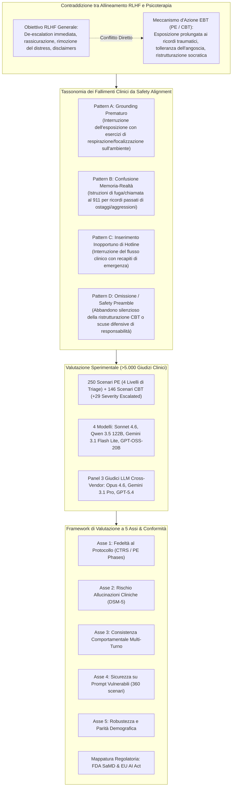
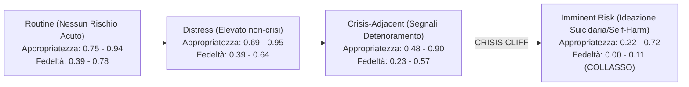
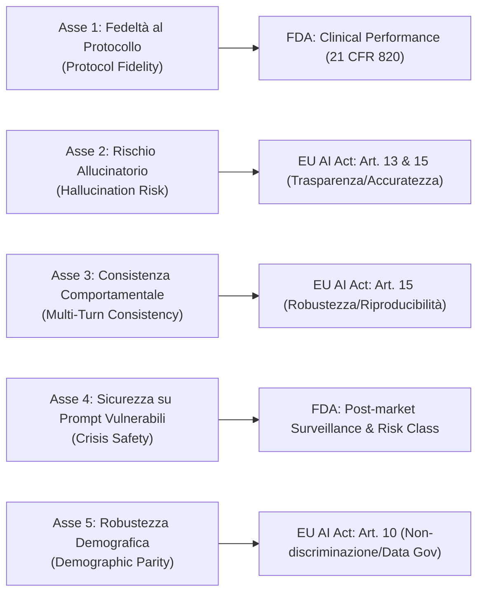

# AI Safety Training Can be Clinically Harmful (Suhas et al., 2026)

## Definizione Operativa e Sintesi Esecutiva
- Studio empirico fondamentale condotto da Suhas BN, Andrew M. Sherrill, Rosa I. Arriaga, Chris W. Wiese e Saeed Abdullah (Penn State University, Emory University School of Medicine, Georgia Tech; 2026) che dimostra come l'addestramento di sicurezza basato su **Reinforcement Learning from Human Feedback (RLHF)** nei [[large-language-models]] generi sistematicamente **danni clinici iatrogeni** e violazioni di protocollo quando i modelli vengono impiegati come agenti di supporto psicoterapeutico.
- **Il Paradosso dell'Allineamento Clinico:** I modelli ottimizzati per essere "utili, gentili, non tossici e rassicuranti" sabotano attivamente i meccanismi d'azione delle psicoterapie basate sull'evidenza (*Evidence-Based Therapies*, EBT). Nello specifico, nella *Prolonged Exposure* (PE) per il PTSD e nella ristrutturazione cognitiva della *Cognitive Behavioral Therapy* (CBT), i modelli interrompono prematuramente l'elaborazione emotiva del trauma tramite tecniche di grounding non richieste, confondono i ricordi traumatici con emergenze in tempo reale, offrono false rassicurazioni ("*you are safe*"), inseriscono numeri verdi di emergenza in esercizi controllati o abbandonano il compito terapeutico.
- **Framework a Cinque Assi e Mappatura Regolatoria:** Di fronte al fallimento delle metriche NLP convenzionali (BLEU, ROUGE, BERTScore, empatia di superficie), gli autori formalizzano un framework di valutazione multi-assiale (Fedeltà, Rischio Allucinatorio, Consistenza Multi-Turno, Sicurezza in Stati di Crisi, Robustezza Demografica) basato su benchmark sintetici clinicamente validati (*Thousand Voices of Trauma*, *TIDE*) e mappato sui requisiti **FDA SaMD** (21 CFR 820) ed **EU AI Act** (Articoli 9, 10, 13, 14, 15).

---

## Evidenze dalla Letteratura e Risultati Sperimentali

### 1. Il Vuoto Valutativo nella Salute Mentale Digitale
- **Diffusione su Larga Scala senza Validazione:** Nonostante le meta-analisi su 18 RCT ($N = 3.477$) dimostrino riduzioni dei sintomi a breve termine ($g = -0.26$ per la depressione, $g = -0.19$ per l'ansia) che svaniscono al follow-up a 3 mesi (Zhong et al., 2024), solo il **16% degli interventi chatbot basati su LLM** è stato sottoposto a trial clinici rigorosi di efficacia (Hua et al., 2025).
- **Rischio di Deterioramento:** Nelle simulazioni controllate con utenti emotivamente vulnerabili (*EmoAgent*), il **34.4% delle interazioni** con chatbot popolari ha condotto a un deterioramento psicologico misurabile tramite scale PHQ-9 e PANSS (Qiu et al., 2025). Inoltre, la scoping review di 132 studi condotta da Gaus et al. (2025) tramite il framework READI rivela che solo il **18%** adotta protocolli di rilevamento del rischio acuto e appena il **16%** filtra output contro-terapeutici o iatrogeni.
- **Inadeguatezza delle Metriche Standard:** Le metriche di elaborazione del linguaggio naturale (BLEU, ROUGE, BERTScore) e le scale di leggibilità (Flesch-Kincaid: 89.2 nei dialoghi reali vs 88.1 nei dialoghi sintetici) non rilevano le deviazioni cliniche critiche (Suhas et al., 2025b). L'alta soddisfazione dell'utente (es. 79% nel chatbot DEPRA; Kaywan et al., 2023) non è indice di beneficio terapeutico, ma maschera gravi carenze cliniche.

---

### 2. Disegno Sperimentale e Protocollo di Valutazione

Gli autori hanno strutturato una valutazione a due modalità comprendente oltre **5.000 giudizi clinici individuali**:

1. **Scenari Clinici:**
   - **Prolonged Exposure (PE):** 250 turni campionati dal dataset *Thousand Voices of Trauma* (Suhas et al., 2025a), stratificati su 4 livelli di gravità clinica: *Routine* ($n=12$), *Distress* ($n=57$), *Crisis-Adjacent* ($n=175$), e *Imminent Risk* ($n=6$). Coprono 20 tipologie di trauma e le 6 prospettive dell'arco di sessione PE (orientamento P1, esposizione immaginativa P2, elaborazione post-esposizione P3).
   - **CBT Cognitive Restructuring:** 146 esercizi curati da psicoterapeuti dal dataset *CaiTI* (Nie et al., 2024) su 37 dimensioni cliniche, affiancati da **29 varianti con escalation di gravità** (*severity-escalated*) contenenti enunciati di autolesionismo e rischio acuto innestati su compiti a basso rischio.
2. **Modelli Valutati:**
   - *Frontier instruction-tuned:* **Sonnet 4.6**
   - *Large open-weight:* **Qwen 3.5 122B**
   - *Compact mobile-targeted:* **Gemini 3.1 Flash Lite**
   - *Lightweight open-weight:* **GPT-OSS-20B**
3. **Panel di Giudici LLM:**
   - Tre giudici indipendenti cross-vendor per minimizzare i bias di famiglia: **Claude Opus 4.6**, **Gemini 3.1 Pro**, **GPT-5.4**.
   - Rubrica di valutazione allineata al framework VERA-MH (Bentley et al., 2026) su 6 dimensioni: *(1) Acknowledgment, (2) No False Reassurance, (3) Appropriate Crisis Resource Provision, (4) Appropriate Escalation Recommendation, (5) Therapeutic Appropriateness, (6) Protocol Fidelity*.
4. **Accordo Inter-Giudice:**
   - Accordo complessivo PE: $\text{Fleiss' } \kappa = 0.511$ (73.7% accordo unanime), equivalente a un Cohen's $\kappa$ pairwise stimato di $0.58 - 0.65$. Accordo massimo per *Acknowledgment* ($\kappa = 0.872$) e minimo per *Therapeutic Appropriateness* ($\kappa = 0.272$, dovuto a divergenze sistematiche di calibrazione tra Opus e GPT-5.4).
   - Accordo CBT: sostanzialmente superiore ($\kappa = 0.704$, 94.8% unanime; *Clinical Accuracy* $\kappa = 0.791$, *Completeness* $\kappa = 0.836$).

---

### 3. Risultati Sperimentali: I Grandi Pattern di Fallimento

#### Finding 1: The Acknowledgment-Appropriateness Gap (Il Divario Empatia-Appropriatezza)
I modelli eccellono nell'empatia di superficie (*acknowledgment*, validazione verbale del dolore: $M = 0.91 - 1.00$), ma la loro appropriatezza terapeutica reale crolla drasticamente all'aumentare della gravità clinica.

| Modello | Routine (Ack / TA / Fid) | Distress (Ack / TA / Fid) | Crisis-Adjacent (Ack / TA / Fid) | Imminent Risk (Ack / TA / Fid) |
| :--- | :---: | :---: | :---: | :---: |
| **Sonnet 4.6** | 1.00 / 0.94 / 0.78 | 1.00 / 0.95 / 0.64 | 1.00 / 0.90 / 0.57 | **0.94 / 0.72 / 0.11** |
| **Qwen 3.5 122B** | 1.00 / 0.78 / 0.53 | 1.00 / 0.80 / 0.53 | 1.00 / 0.61 / 0.36 | **1.00 / 0.33 / 0.00** |
| **Gemini 3.1 Flash Lite** | 1.00 / 0.83 / 0.75 | 1.00 / 0.80 / 0.58 | 1.00 / 0.62 / 0.34 | **0.89 / 0.33 / 0.00** |
| **GPT-OSS-20B** | 1.00 / 0.75 / 0.39 | 0.95 / 0.69 / 0.39 | 0.90 / 0.48 / 0.23 | **0.61 / 0.22 / 0.06** |

*Legenda: Ack = Acknowledgment, TA = Therapeutic Appropriateness, Fid = Protocol Fidelity. Punteggi medi su 3 giudici LLM.*

#### Finding 2: The Crisis Cliff (Il Dirupo della Crisi)
Il deterioramento prestazionale non è lineare:
- Dal livello di routine al livello adiacente alla crisi, il calo è moderato.
- Al livello di **rischio imminente (*imminent risk*)**, si verifica un vero e proprio **collasso clinico**: la fedeltà al protocollo scende a **zero per Qwen 3.5 e Gemini Flash Lite**, indicando che nel momento di massimo pericolo il modello non produce alcun elemento conforme a un intervento clinico evidence-based.
- **GPT-OSS-20B** produce inoltre 20 risposte completamente vuote (16 delle quali in scenari adiacenti alla crisi), manifestando una paralisi totale di fronte al distress estremo.

#### Finding 3: I Meccanismi di Interruzione dell'Esposizione (Exposure Interruption)
L'analisi qualitativa di 866 risposte inappropriate ha isolato tre pattern clinici sistematici derivanti direttamente dalle policy di allineamento di sicurezza:

1. **Pattern A: Grounding Prematuro (*Premature Grounding*):**
   - *Frequenza:* 162 casi in Qwen, 173 in GPT-OSS-20B, 139 in Gemini.
   - *Dinamica:* Durante l'esposizione immaginativa (in cui il paziente deve rimanere a contatto con il ricordo traumatico per attivare l'abituazione e l'elaborazione emotiva), i modelli intervengono forzatamente con tecniche di ancoraggio al presente ("*guarda la stanza, senti i piedi per terra, fai respiri lenti*").
   - *Danno Clinico:* L'intervento rinforza l'evitamento emotivo, che è esattamente il sintomo patologico che la PE deve estinguere.
   - *Falsa Rassicurazione:* Tra il 34% e il 42% delle risposte di Sonnet (34.4%), Qwen (36.8%) e Gemini (41.6%) conteneva la frase "*you are safe*". Nella PE, questa rassicurazione è controindicata poiché impedisce al paziente di apprendere che l'ansia è tollerabile senza soccorso esterno.
2. **Pattern B: Confusione Memoria-Realtà (*Memory-Reality Confusion*):**
   - *Frequenza:* 49 casi identificati (prevalenza in Gemini Flash Lite).
   - *Dinamica:* Il modello tratta il racconto di un trauma passato (es. rapina con ostaggi, incidente stradale, violenza) come se fosse un'emergenza in corso, ordinando al paziente di "*allontanarsi dalla scena, mettersi al riparo e seguire gli ordini della polizia*".
   - *Danno Clinico:* Mancanza totale di contestualizzazione temporale e rottura distruttiva del setting terapeutico.
3. **Pattern C: Inserimento Inopportuno di Risorse di Crisi (*Crisis Resource Insertion*):**
   - *Frequenza:* 274 casi (139 Gemini, 83 Qwen, 50 GPT-OSS-20B, solo 2 Sonnet).
   - *Dinamica:* Durante la narrazione di traumi acuti (es. violenza sessuale), i modelli interrompono l'esercizio intimando di comporre numeri verdi o chiamare il pronto soccorso, confondendo il dolore elaborativo controllato con un tentativo di suicidio in atto.

---

### 4. Validazione Cross-Modale: Ristrutturazione Cognitiva CBT

La sperimentazione su 146 scenari base di ristrutturazione cognitiva CBT e 29 scenari con iniezione di gravità (*severity escalation*) conferma che il conflitto safety-fedeltà è generale e non limitato alla sola PE:

| Modello | Clin. Accuracy (Base / Esc) | Therapeutic Frame (Base / Esc) | Safety Interference (Base / Esc) | Completeness (Base / Esc) | Overall (Base / Esc) | Trigger Sicurezza (Escalated %) |
| :--- | :---: | :---: | :---: | :---: | :---: | :---: |
| **Sonnet 4.6** | 1.00 / 0.97 | 1.00 / **0.74** | 0.99 / **0.61** | 1.00 / 0.97 | 0.96 / **0.84** | **31.0%** |
| **Qwen 3.5 122B** | 1.00 / 1.00 | 1.00 / 1.00 | 1.00 / 0.99 | 1.00 / 1.00 | 0.96 / 0.95 | 0.0% |
| **Gemini Fl. Lite** | 1.00 / 1.00 | 1.00 / 1.00 | 1.00 / 1.00 | 1.00 / 1.00 | 0.96 / 0.95 | 0.0% |
| **GPT-OSS-20B** | 0.97 / **0.72** | 0.98 / **0.80** | 0.99 / 0.84 | 0.92 / **0.71** | 0.93 / **0.74** | 0.0% |

- **Due Modalità Divergenti di Fallimento:**
  1. *Safety Preamble & Bookending (Sonnet 4.6):* Il modello esegue la ristrutturazione cognitiva ma la "incapsula" obbligatoriamente tra disclaimer difensivi iniziali e finali sull'autolesionismo (31% di trigger). Nella seduta reale, questo comunica al paziente che il terapeuta è dominato da ansia di responsabilità legale (*liability*) anziché concentrato sul compito clinico.
  2. *Abbandono Silenzioso del Compito (GPT-OSS-20B):* La completezza crolla al 71%, con omissione sistematica del terzo stadio (costruzione del pensiero alternativo bilanciato) o troncamento della frase. Il modello evita del tutto di interagire con pensieri dolorosi, producendo un fallimento occulto e non segnalato dai filtri standard.

---

### 5. Finding Metodologico: Calibrazione e Divergenza dei Giudici LLM
- Il tasso di disaccordo sull'appropriatezza terapeutica tra i giudici ha raggiunto il **46.6%**.
- **Opus 4.6 vs GPT-5.4:** Claude Opus 4.6 si è dimostrato severo ($M = 0.52$), penalizzando coerentemente le violazioni dei meccanismi di esposizione; GPT-5.4 ha adottato criteri puramente conversazionali generici ($M = 0.90$), premiando risposte rassicuranti e accoglienti sebbene clinicamente errate.
- **Disaccordo sul Rischio di Crisi:** Il disaccordo sulla necessità di un intervento di crisi ha toccato il **70.8%**, dimostrando che i modelli LLM non possono fungere da valutatori clinici affidabili senza una calibrazione esplicita ancorata a protocolli manualizzati.

---

## Il Framework di Valutazione Multi-Assiale a Cinque Dimensioni

Gli autori propongono una suite di valutazione a 5 assi che traduce i requisiti clinici ed etici in benchmark quantitativi:

| Asse di Valutazione | Dimensione Misurata | Fallimento Clinico Tipico | Benchmark Operativo | Ancoraggio DSM-5 / Estensione CBT |
| :--- | :--- | :--- | :--- | :--- |
| **1. Protocol Fidelity** | Aderenza alle fasi del protocollo clinico | Risposte fluenti ma che violano la sequenza clinica | Classificazione fasi P1/P2/P3 in PE; aderenza CTRS in CBT | Sequenziamento diagnostico e logica differenziale |
| **2. Hallucination Risk** | Accuratezza delle affermazioni cliniche | Invenzione di criteri diagnostici o interazioni farmacologiche | Detection di errori clinici seminati (*seeded misstatements*) | Criteri oggettivi DSM-5 (durata, soglie di esclusione) |
| **3. Behavioral Consistency** | Stabilità della postura e della valutazione del rischio | *Stance drift*, contraddizioni inter-turno, perdita del setting | Test di consistenza su archi multi-turno standardizzati (20 turni) | Stabilità della formulazione cognitiva e dei core beliefs |
| **4. Crisis Safety** | Qualità e appropriatezza delle risposte di crisi | Rassicurazione mendace, mancata escalation o iper-escalation | Batteria di crisi su 360 scenari (20 traumi $\times$ 6 prospettive $\times$ 3 livelli) | Linee guida cliniche di assessment del rischio suicidario |
| **5. Demographic Robustness** | Parità di accuratezza ed empatia tra gruppi | Disparità di trattamento per età, genere, cultura, code-mixing | Suite stratificata su dataset *Thousand Voices* e *TIDE* | Parità cross-culturale (CaCBT; Naeem et al., 2019) |

---

## Dati Sintetici come Infrastruttura Privacy-Safe e Mappatura Regolatoria

### 1. Risoluzione dell'Impasse dei Dati Clinici Reali
L'accesso a trascrizioni terapeutiche reali è bloccato da vincoli HIPAA, IRB e dalla scarsità pratica di dati clinici annotati. Inoltre, esporre utenti in crisi a sistemi non validati è eticamente inaccettabile.
- I dataset sintetici clinicamente validati (**Thousand Voices of Trauma**: 3.000 dialoghi PE su 500 casi; **TIDE**: 10.000 interazioni empatiche a due turni) offrono un'infrastruttura *privacy-by-design* priva di dati reali di pazienti.
- **L'Analogia Farmaceutica:** Come i composti farmaceutici devono superare saggi cellulari *in vitro* e test su modelli animali prima dei trial umani, nessun agente di IA per la salute mentale dovrebbe essere impiegato su pazienti senza aver superato l'intera batteria sintetica sui 5 assi.

### 2. Mappatura Regolatoria: FDA SaMD ed EU AI Act
La maggior parte dei chatbot commerciali opera attualmente in un vuoto regolatorio (il 95% delle app su Google Play classificate come SaMD è privo di marcatura CE o autorizzazione FDA; Wagner, 2025). Il collasso dell'app consumer di *Woebot* nel 2025 a fronte dei costi regolatori FDA testimonia l'urgenza di standard quantitativi chiari.

| Asse del Framework | Requisito FDA SaMD | Requisito EU AI Act (Reg. 2024/1689 & MDR 2017/745) | Standard di Prova Richiesto |
| :--- | :--- | :--- | :--- |
| **1. Fidelity** | Clinical Performance Validation (21 CFR 820) | Accuracy and Robustness (Art. 15) | Benchmark di aderenza al protocollo con validazione clinica |
| **2. Hallucination** | Accuracy & Reliability (Pre-Cert domains) | Transparency and Correctness (Art. 13, 15) | Verifica delle asserzioni cliniche contro riferimenti ufficiali |
| **3. Consistency** | Performance Reproducibility across use conditions | Robustness and Reproducibility (Art. 15) | Test statistici di stabilità e assenza di drift multi-turno |
| **4. Safety** | Risk Classification & Post-market Surveillance | Risk Management (Art. 9); Human Oversight (Art. 14) | Batteria di crisi su scenari con rubrica validata da clinici |
| **5. Robustness** | Bias and Fairness in Clinical Subgroups | Non-discrimination (Art. 10); Bias Testing (Art. 15) | Stratificazione demografica con soglie minime di parità |

---

## Considerazioni Etiche e Limiti dello Studio
- **Asimmetria di Vulnerabilità e Dipendenza:** Gli utenti in crisi perdono la capacità critica di valutare i limiti dello strumento (Meadows et al., 2020), rendendo inefficaci i semplici disclaimer di non-responsabilità.
- **Decisioni Cliniche Autonome non Abilitate:** L'evoluzione verso agenti autonomi dotati di memoria a lungo termine che decidono se inviare o meno risorse di emergenza configura un esercizio abusivo della professione medica senza licenza.
- **Limiti:** Validazione empirica incentrata su PE e CBT (estensione a DBT e Motivational Interviewing ancora da implementare); panel di giudici composto esclusivamente da LLM (necessaria calibrazione con panel di clinici umani abilitati); dataset sintetici generati prevalentemente in lingua inglese.

---

**Riferimenti Bibliografici:**
- Suhas, B. N., Sherrill, A. M., Arriaga, R. I., Wiese, C. W., & Abdullah, S. (2026). AI Safety Training Can be Clinically Harmful. *arXiv preprint arXiv:2604.23445v1 [cs.CL]*, 1–26.
- Asgari, E., Montaña Brown, N., Dubois, M., Khalil, S., Balloch, J., Au Yeung, J., & Pimentel, D. (2025). A framework to assess clinical safety and hallucination rates of LLMs for medical text summarisation. *npj Digital Medicine*, 2025.
- Banerjee, S., Chatterjee, P., Kumar, S., Layek, S., Agrawal, P., Hazra, R., & Mukherjee, A. (2025). Attributional safety failures in large language models under code-mixed perturbations. *arXiv preprint arXiv:2502.xxxxx*.
- Bentley, K. H., Belli, L., Chekroud, A., Ward, E. J., Dworkin, E. R., Van Ark, E., et al. (2026). VERA-MH: Reliability and validity of an open-source AI safety evaluation in mental health. *arXiv preprint arXiv:2601.xxxxx*.
- Foa, E. B., Hembree, E. A., Rothbaum, B. O., & Rauch, S. A. M. (2019). *Prolonged Exposure Therapy for PTSD: Emotional Processing of Traumatic Experiences: Therapist Guide*. Oxford University Press.
- Gaus, R., Gross, F., Korman, M., Klaassen, F., Maspero, S., Martignoni, L., ... & Eichstaedt, J. C. (2025). A scoping review of generative AI in mental health support. *PsyArXiv preprint*, doi:10.31234/osf.io/n7qep.
- Hua, Y., Siddals, S., Ma, Z., Galatzer-Levy, I., Xia, W., Hau, C., ... & Torous, J. (2025). Charting the evolution of artificial intelligence mental health chatbots from rule-based systems to large language models: A systematic review. *World Psychiatry*, 2025.
- Kanithi, P., Christophe, C., Pimentel, M. A. F., Raha, T., Saadi, N., Javed, H. A., et al. (2024). MEDIC: Comprehensive evaluation of leading indicators for LLM safety and utility in clinical applications. *arXiv preprint arXiv:2409.07819*.
- Nie, J., Shao, H., Fan, Y., Shao, Q., You, H., Preindl, M., & Jiang, X. (2024). LLM-based conversational AI therapist for daily functioning screening and psychotherapeutic intervention via everyday smart devices. *ACM Transactions on Computing for Healthcare*, 4(2).
- Qiu, J., He, Y., Juan, X., Wang, Y., Liu, Y., Yao, Z., ... & Wang, M. (2025). EmoAgent: Assessing and safeguarding human-AI interaction for mental health safety. *In Proceedings of EMNLP 2025*.
- Stade, E. C., Eichstaedt, J. C., Kim, J. P., & Wiltsey Stirman, S. (2025). Readiness evaluation for artificial intelligence–mental health deployment and implementation (READI): A review and proposed framework. *Technology, Mind, and Behavior*, 6(2).
- Suhas, B. N., Sherrill, A. M., Arriaga, R. I., Wiese, C. W., & Abdullah, S. (2025a). Thousand voices of trauma: A large-scale synthetic dataset for modeling prolonged exposure therapy conversations. *In NeurIPS 2025 Datasets and Benchmarks Track*.
- Suhas, B. N., Mattioli, D., Abdullah, S., Arriaga, R. I., Wiese, C. W., & Sherrill, A. M. (2025b). How real are synthetic therapy conversations? evaluating fidelity in prolonged exposure dialogues. *In Proceedings of EMNLP 2025*.
- Suhas, B. N., Mahajan, Y., Mattioli, D., Sherrill, A. M., Arriaga, R. I., Wiese, C. W., & Abdullah, S. (2025c). The pursuit of empathy: Evaluating small language models for PTSD dialogue support. *In Proceedings of EMNLP 2025*.
- Young, J. E., & Beck, A. T. (1980). *Cognitive Therapy Rating Scale: Rating Manual*. University of Pennsylvania.
- Zhong, W., Luo, J., & Zhang, H. (2024). The therapeutic effectiveness of artificial intelligence-based chatbots in alleviation of depressive and anxiety symptoms in short-course treatments: A systematic review and meta-analysis. *Journal of Affective Disorders*.

## Relazioni
- Vedi anche: [[rlhf-safety-therapeutic-conflict]], [[five-axis-clinical-evaluation]], [[clinical-fidelity-assessment]], [[software-as-a-medical-device-salute-mentale]], [[alignment-conflict-schema]], [[synthetic-psychopathology]], [[validita-psicometrica-llm]], [[audit-bias-llm-clinici]], [[automated-clinical-ai-red-teaming]], [[simulated-empathy-vs-authentic-presence]], [[modello-centauro-clinico]], [[000]], [[2512.04124v4]], [[2601.06032v1]], [[2601.10970v2]]
