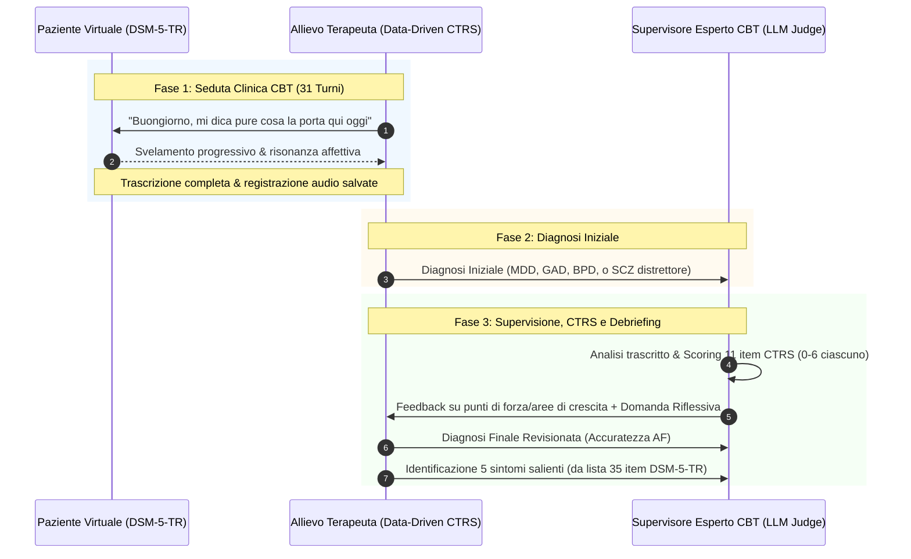
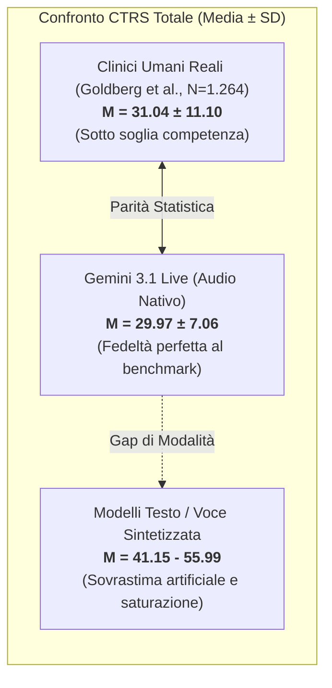
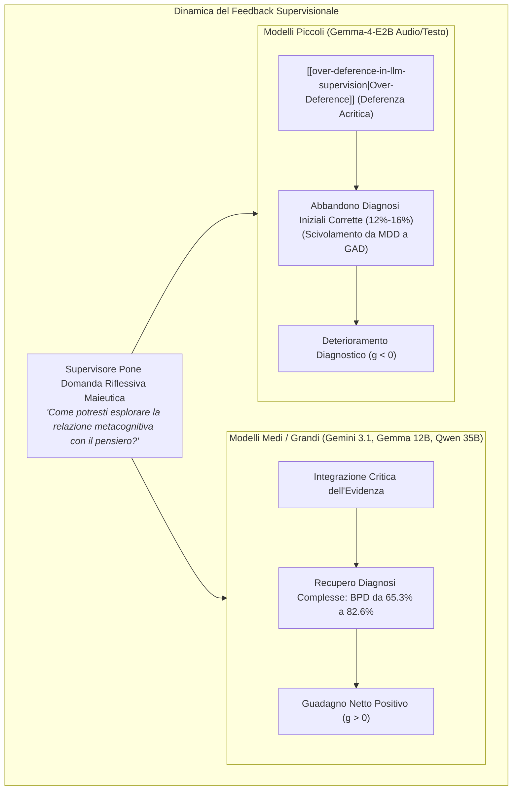

# MyMentorLLM: A Psychotherapy GenAI Environment with Multimodal Voice/Text Patients, Trainees and Experts for Deliberate Practice (Rizzi et al., 2026)

## Definizione Operativa
- Studio pionieristico e sperimentale su larga scala condotto da Rodolfo Rizzi, Alessandro Grecucci e Massimo Stella (CogNosco Lab, Università di Trento & Università di Bari, 2026; arXiv:2607.25667v1) che introduce, formalizza e valida **MyMentorLLM**, un ambiente di simulazione generativa multimodale (audio nativo, audio sintetizzato e testo) basato sul paradigma della **Deliberate Practice** (pratica deliberata) per la formazione e supervisione in Psicoterapia Cognitivo-Comportamentale (CBT).
- **Utilità Clinica e CBT:** Supera i limiti delle simulazioni diadiche isolate e dei test statici, modellando la formazione clinica come un **sistema cognitivo triadico** composto da: (1) un *paziente simulato* ancorato a casi clinici reali del DSM-5-TR (Depressione Maggiore, Ansia Generalizzata, Disturbo Borderline); (2) un *allievo terapeuta* calibrato empiricamente sulla distribuzione reale delle competenze CTRS di 413 clinici in formazione (Goldberg et al., 2020); (3) un *supervisore clinico esperto* che analizza le sedute, valuta le 11 dimensioni della *Cognitive Therapy Rating Scale* (CTRS), offre debriefing didattico e stimola la riflessività con domande socratiche non prescrittive.
- **Risultanze Chiave su 2.100 Sessioni Simulate:**
  1. *Dinamiche Affettive Disturbo-Congruenti:* I pazienti virtuali esprimono profili emotivi congruenti alla diagnosi (Plutchik/EmoAtlas), e i terapeuti in formazione manifestano un rispecchiamento empatico attenuato (*affective mirroring*) analogo a quello documentato nelle diadi umane reali (corpus HOPE).
  2. *Gap di Modalità e Illusione di Competenza nel Testo:* I modelli **speech-to-speech nativi (Gemini 3.1 Flash Live)** riproducono con straordinaria fedeltà il profilo di competenza clinica umana (CTRS medio $29.97 \pm 7.06$ vs $31.04 \pm 11.10$ umano, entrambi sotto la soglia di competenza CTRS $\ge 40$), mentre le interazioni puramente testuali o con voce sintetizzata generano punteggi artificialmente inflazionati ($41.15 - 55.99$) a causa della fluidità sintattica che nasconde le esitazioni paralinguistiche.
  3. *Asimmetria di Scala e Deferenza Acritica (*[[over-deference-in-llm-supervision|Over-Deference]]*):* Il feedback di supervisione incrementa l'accuratezza diagnostica nei modelli medi e grandi (favorendo il recupero delle diagnosi complesse di BPD), ma provoca un **deterioramento diagnostico sistematico nei modelli più piccoli (Gemma-4-E2B)**, che interpretano le domande riflessive del supervisore come ordini tassativi di modifica, abbandonando diagnosi corrette.

```mermaid
flowchart TD
    subgraph Problem ["Limiti della Formazione Psicoterapeutica Tradizionale"]
        P1["Carenza di Specialisti (1.3 per 10.000 ab. a livello globale)"]
        P2["Rischi Etici (Pazienti reali esposti agli errori dei tirocinanti)"]
        P3["Scarsità e Costi di Attori Standardizzati e Supervisori Esperti"]
        P4["Simulazioni IA Tradizionali: Solo testo, diadiche, prive di ciclo pedagogico"]
    end

    subgraph CoreArchitecture ["MyMentorLLM: Sistema Cognitivo Triadico"]
        SP["Paziente Virtuale (DSM-5-TR Grounding)<br/>[MDD: 'Despair', GAD: 'Always on Edge', BPD: 'Fragile and Angry']"]
        ST["Allievo Terapeuta (Dr. Mario Rossi)<br/>[Calibrato su Mediane CTRS di 413 Clinici Reali]"]
        SM["Supervisore CBT Senior<br/>[CTRS 11 Item, Analisi Metacognitiva, Domanda Riflessiva]"]
    end

    subgraph SimulationCycle ["Ciclo di Mentorship a 3 Stadi (2.100 Sessioni)"]
        S1["1. Setup & Inizializzazione (7 Condizioni Modello-Modalità x 3 Disturbi)"]
        S2["2. Colloquio Clinico CBT (31 Turni: Audio Nativo / Sintetizzato / Testo)"]
        S3["3. Supervisione & Debriefing:<br/>- Diagnosi Iniziale Trainee (MDD, GAD, BPD, SCZ)<br/>- Valutazione CTRS (0-66) & Feedback Didattico del Mentor<br/>- Revisione Diagnostica Post-Feedback<br/>- Riconoscimento 5 Sintomi Salienti DSM-5-TR"]
    end

    subgraph CoreFindings ["Scoperte e Fenomeni Emergenti"]
        F1["Fedeltà Audio Nativo: Gemini 3.1 Live (CTRS 29.97) = Umano (31.04)"]
        F2["Illusione di Competenza nel Testo: CTRS saturato a 41-56 nei modelli testuali"]
        F3["Over-Deference nei Modelli Piccoli: Gemma-4-E2B perde accuratezza diagnostica (-6% / -11%)"]
        F4["Consistency Diagnosi-Sintomi: Riconoscimento sintomi scala con la dimensione del modello (19% -> 95%)"]
    end

    Problem --> CoreArchitecture
    CoreArchitecture --> SimulationCycle
    SimulationCycle --> CoreFindings
```

---

## Evidenze dalla Letteratura

### 1. Inquadramento Teorico: Deliberate Practice e Simulazione Multimodale
- **Il Collo di Bottiglia Formativo in Salute Mentale:** L'Organizzazione Mondiale della Sanità stima oltre un miliardo di persone affette da disturbi mentali, con una densità globale mediana di soli 1,3 operatori ogni 10.000 abitanti (WHO, 2022). Competenze cardine come l'impostazione dell'agenda, la scoperta guidata socratica, la concettualizzazione del caso e la sintonizzazione affettiva richiedono centinaia di ore di pratica ed esposizione a supervisione continuativa.
- **Il Ruolo della Deliberate Practice:** Come teorizzato da Rousmaniere (2024), l'accumulo passivo di ore cliniche produce un rapido plateau di rendimento. La *pratica deliberata* supera questo limite introducendo prove comportamentali ripetute, micro-obiettivi focalizzati e feedback continuo da parte di esperti al di fuori delle sedute con pazienti reali.
- **Dalla Sostituzione all'Addestramento Pedagogico:** Gran parte della letteratura su [[large-language-models]] in salute mentale ha tentato di sostituire i terapeuti o di valutare la sicurezza in task single-turn generici (HarmBench, ALERT). MyMentorLLM riorienta l'IA verso la creazione di palestre cliniche sicure, verificando se l'intero triangolo pedagogico (paziente-allievo-supervisore) possa essere modellato in modo psicologicamente e didatticamente fedele.
- **Il Limite del Solo Testo e la Paralinguistica Clinica:** La psicoterapia autentica si sviluppa attraverso la parola parlata, dove esitazioni, pause, ritmo, tono e prosodia veicolano una parte essenziale del disagio emotivo e della regolazione relazionale (Muntigl, 2016; Low, 2024). Le simulazioni testuali eliminano questa dimensione, appiattendo l'interazione sul trascritto ed esaltando artificialmente la competenza percepita.

---

### 2. Architettura di MyMentorLLM e Disegno Sperimentale

#### A. I Tre Ruoli Clinici
1. **Paziente Virtuale (DSM-5-TR Grounding):** Adattato fedelmente da casi clinici standardizzati pubblicati in *DSM-5-TR Clinical Cases* (Barnhill, 2023):
   - *Depressione Maggiore (MDD):* Caso 4.5 ("Despair" - Munday & Abelson), caratterizzato da depressione melanconica, anedonia, autosvalutazione e rallentamento;
   - *Disturbo d'Ansia Generalizzata (GAD):* Caso 5.5 ("Always on Edge" - Lawrence & Cabaniss), focalizzato su rimuginio cronico incontrollabile, tensione muscolare e allerta continua;
   - *Disturbo Borderline di Personalità (BPD):* Caso 18.5 ("Fragile and Angry" - Yeomans & Kernberg), dominato da instabilità affettiva, rabbia intensa, timore dell'abbandono e reattività interpersonale.
   - *Struttura del Profilo in 6 Parti:* (i) dati demografici e contesto di vita, (ii) motivo della consultazione, (iii) anamnesi e funzionamento attuale, (iv) profilo sintomatologico, (v) stile comunicativo e prosodia, (vi) schemi cognitivo-emotivi ricorrenti e pensieri automatici.
   - *Guardrail Comportamentali:* Rivelazione graduale del materiale intimo; reattività contingente all'attunement del terapeuta (apertura con validazione empatica, chiusura/ritirata o minaccia di abbandono della seduta in caso di invalidazione o domande inquisitorie).
2. **Allievo Terapeuta (*Data-Driven Trainee*):**
   - Calibrato empiricamente sulla distribuzione reale delle competenze della **Cognitive Therapy Rating Scale (CTRS)** documentata da Goldberg et al. (2020) su 1.264 registrazioni di sedute CBT condotte da 413 clinici di comunità.
   - Le competenze sono state mappate sulle mediane reali degli item (es. Agenda mediana = 2: *"Therapist set agenda that was vague or incomplete"*), riproducendo un allievo che possiede basi teoriche consolidate ma applica le tecniche in modo meccanico e rigido.
3. **Supervisore Clinico Esperto CBT:**
   - Valuta il trascritto completo assegnando un punteggio da 0 a 6 a ciascuno degli 11 item della CTRS (punteggio totale 0–66).
   - Fornisce un debriefing pedagogico ancorato a precisi stralci della seduta, integrando analisi su processo vs contenuto, credenze metacognitive e bilanciamento tra accettazione e cambiamento, concludendo con una singola **domanda riflessiva maieutica non prescrittiva**.

#### B. Modelli, Modalità e Condizioni Sperimentali
Il disegno comprende 7 combinazioni modello–modalità (100 run per ciascuno dei 3 disturbi = 300 run per condizione, per un totale di **2.100 cicli completi di mentorship**):

| Condizione | Sviluppatore | Modalità Interazione | Modello Paziente & Terapeuta | Modello Supervisore |
| :--- | :--- | :--- | :--- | :--- |
| **Gemini-3.1LA** | Google | **Native Audio $\leftrightarrow$ Audio** | Gemini 3.1 Flash Live Preview | Gemini 3.5 Flash (testo JSON) |
| **Gemma-4-12BA** | Google | Audio $\rightarrow$ Testo (Sintesi OmniVoice) | Gemma-4-12B-it | Gemma-4-12B-it |
| **Gemma-4-12BT** | Google | Testo $\rightarrow$ Testo | Gemma-4-12B-it | Gemma-4-12B-it |
| **Gemma-4-E2BA** | Google | Audio $\rightarrow$ Testo (Sintesi OmniVoice) | Gemma-4-E2B-it | Gemma-4-E2B-it |
| **Gemma-4-E2BT** | Google | Testo $\rightarrow$ Testo | Gemma-4-E2B-it | Gemma-4-E2B-it |
| **Qwen3.6-35BT** | Alibaba | Testo $\rightarrow$ Testo | Qwen3.6-35B-A3B-AWQ | Qwen3.6-35B-A3B-AWQ |
| **Qwen3.5-9BT** | Alibaba | Testo $\rightarrow$ Testo | Qwen3.5-9B | Qwen3.5-9B |

---

## Risultati Sperimentali

### 1. Dinamiche Emotive e Risonanza Affettiva (Plutchik & EmoAtlas)
L'analisi inferenziale delle emozioni (8 dimensioni del modello psicoevoluzionistico di Plutchik tramite EmoAtlas e dizionario EmoLex, calcolando z-score di significatività rispetto al caso su 300 permutazioni) ha evidenziato che:
- **Disorder-Congruence dei Pazienti Virtuali:**
  - *MDD:* Profilo guidato da tristezza statisticamente elevata ($z = 2.99 - 5.15, p < .001$) e affetto positivo/gioia bloccato o depresso ($z = -1.59$).
  - *GAD:* Profilo dominato da paura ($z = 2.09 - 3.54$) e anticipazione ansiosa ($z = 4.09 - 4.89$).
  - *BPD:* Ampio spettro di affettività negativa simultanea con co-elevazione di paura ($z = 2.03 - 3.55$), tristezza ($z = 3.57 - 4.92$) e rabbia ($z = 1.60 - 3.17$).
- **Affective Mirroring del Terapeuta:** In tutte le condizioni, l'allievo terapeuta non è rimasto emotivamente neutro ma ha rispecchiato l'impronta affettiva del paziente in forma attenuata e calda, preservando punteggi elevati di fiducia (*trust*, $z = 3.05 - 5.42$) e speranza/anticipazione ($z = 3.07 - 7.33$), ricalcando esattamente le dinamiche relazionali osservate nelle diadi umane reali del corpus di riferimento HOPE (212 sedute reali di counselling).

---

### 2. Valutazione della Competenza CTRS: Il Gap Audio Nativo vs Testo

La Cognitive Therapy Rating Scale (CTRS) valuta 11 competenze cliniche (Agenda, Feedback, Comprensione, Efficacia interpersonale, Collaborazione, Pacing, Scoperta guidata, Cognizioni chiave, Strategie di cambiamento, Tecniche CBT, Compiti a casa).

#### Dati Dettagliati per Item e Punteggio Totale:

| Dimensione CTRS (0–6) | Benchmark Umano | Gemini-3.1LA | Gemma-4-12BA | Gemma-4-12BT | Gemma-4-E2BA | Gemma-4-E2BT | Qwen3.6-35BT | Qwen3.5-9BT |
| :--- | :---: | :---: | :---: | :---: | :---: | :---: | :---: | :---: |
| 1. Agenda | 2.53 | 1.47 | 3.61 | 3.74 | 4.04 | 4.12 | 4.34 | 3.80 |
| 2. Feedback | 2.39 | 2.51 | 2.38 | 2.71 | 4.01 | 4.03 | 3.51 | 4.68 |
| 3. Comprensione | 3.24 | 3.72 | 5.97 | 5.98 | 6.00 | 6.00 | 4.79 | 5.66 |
| 4. Efficacia Interpersonale | 3.96 | 3.75 | 5.90 | 5.94 | 6.00 | 6.00 | 4.50 | 5.42 |
| 5. Collaborazione | 3.27 | 2.84 | 4.93 | 5.21 | 4.12 | 4.34 | 3.72 | 4.79 |
| 6. Pacing & Gestione Tempo | 2.92 | 2.76 | 4.35 | 4.81 | 5.13 | 5.13 | 3.59 | 4.80 |
| 7. Scoperta Guidata | 2.73 | 2.78 | 5.59 | 5.79 | 5.34 | 5.68 | 3.40 | 5.17 |
| 8. Cognizioni Chiave | 2.84 | 3.76 | 5.65 | 5.85 | 5.98 | 5.99 | 4.57 | 5.67 |
| 9. Strategie di Cambiamento | 2.69 | 2.63 | 4.52 | 4.92 | 5.41 | 5.81 | 3.85 | 4.69 |
| 10. Tecniche CBT | 2.33 | 2.68 | 4.89 | 5.16 | 4.65 | 5.38 | 3.50 | 5.01 |
| 11. Compiti a Casa (*Homework*) | 2.14 | 1.07 | 0.36 | 0.56 | 2.03 | 3.50 | 1.37 | 3.23 |
| **Totale CTRS Medio (SD)** | **31.04 (11.10)** | **29.97 (7.06)** | **48.15 (3.49)** | **50.66 (4.11)** | **52.70 (3.93)** | **55.99 (3.52)** | **41.15 (10.49)** | **52.91 (10.41)** |

- **Fedeltà dell'Audio Nativo:** Gemini-3.1LA ottiene un punteggio totale di 29.97, situandosi esattamente nella fascia tipica dei terapeuti in formazione umani e al di sotto del cut-off di competenza clinica esperta (CTRS $\ge 40$). L'audio nativo preserva pause, esitazioni e imperfezioni ritmiche che espongono i reali limiti dell'allievo.
- **L'Illusione di Competenza nel Testo:** Tutti i modelli basati su testo o audio re-sintetizzato sovrastimano gravemente le abilità del terapeuta, raggiungendo la quasi saturazione (punteggi 5.8–6.0) in item critici come Comprensione, Efficacia interpersonale e Cognizioni chiave. La perfezione sintattica del testo scritto maschera la reale complessità dell'interazione clinica.

---

### 3. Effetto del Feedback di Supervisione e Fenomeno di Over-Deference

Il passaggio tra diagnosi iniziale ($A_I$) e diagnosi finale post-supervisione ($A_F$) con calcolo del guadagno normalizzato $g = \frac{A_F - A_I}{A_F}$ ha rivelato una netta divergenza dipendente dalla taglia computazionale del modello:

| Condizione Sperimentale | Accuratezza Iniziale ($A_I$) | Accuratezza Finale ($A_F$) | Guadagno Normalizzato ($g$) | Accuratezza Sintomi ($A_S$) |
| :--- | :---: | :---: | :---: | :---: |
| **Gemini-3.1LA** | 87.0% | **95.7%** | **+0.09** | 85.8% |
| **Qwen3.5-9BT** | 84.0% | **91.7%** | **+0.08** | 72.7% |
| **Gemma-4-12BA** | 85.3% | **93.0%** | **+0.08** | 87.2% |
| **Gemma-4-12BT** | 86.3% | **91.7%** | **+0.06** | 86.8% |
| **Qwen3.6-35BT** | 95.7% | **99.3%** | **+0.04** | 95.5% |
| **Gemma-4-E2BA** | 79.0% | **74.3%** | **-0.06** | 25.5% |
| **Gemma-4-E2BT** | 75.3% | **68.0%** | **-0.11** | 19.4% |

- **Beneficio nei Modelli Capaci:** Nei modelli da 12B a 35B e in Gemini Live, il feedback permette di correggere l'iniziale sottodiagnosi del Disturbo Borderline di Personalità (salito da 65.3% a 82.6%), dove l'allievo iniziale tendeva a confondere la componente depressiva o a fornire risposte multiple/hedging.
- **Il Paradosso di Over-Deference:** Nei modelli piccoli (Gemma-4-E2B), il 12–16% delle sessioni con diagnosi inizialmente corretta è stato convertito in diagnosi errata (principalmente da MDD a GAD). L'allievo debole interpreta la domanda esplorativa del mentor non come uno spunto di ragionamento, ma come un'implicita bocciatura, cambiando acriticamente la propria risposta corretta.

---

### 4. Riconoscimento dei Sintomi DSM-5-TR e Scaling Law
- L'accuratezza nell'identificare i 5 sintomi salienti da una lista di 35 item ($A_S$) scala in modo ripido con la capacità del modello:
  - *Qwen 35B:* 95.5% di accuratezza;
  - *Gemma 12B e Gemini 3.1 Live:* 86% – 87%;
  - *Qwen 9B:* 72.7%;
  - *Gemma E2B:* 19.4% – 25.5% (livello del puro caso).
- Si evidenzia una stretta correlazione tra la correttezza della diagnosi finale e la concordanza dei sintomi selezionati: la corretta categorizzazione nosografica emerge solo quando il modello possiede un autentico grounding sui pattern sintomatologici specifici.

---

## Implicazioni Pedagogiche e Governance Clinica

1. **La Simulazione Triadica come Nuovo Standard:** La validazione di strumenti di IA per la formazione non può limitarsi alla qualità linguistica del paziente virtuale, ma deve testare l'intera dinamica educativa triadica (paziente $\leftrightarrow$ allievo $\leftrightarrow$ supervisore).
2. **Priorità all'Audio Nativo per la Formazione Realistica:** Le piattaforme didattiche per la salute mentale devono integrare interfacce speech-to-speech end-to-end; l'addestramento su sole interfacce testuali rischia di creare un'eccessiva sicurezza (*overconfidence*) e di non preparare gli allievi alla complessità temporale e prosodica del setting clinico reale.
3. **Salvaguardie Contro la Deferenza Acritica:** I sistemi di feedback pedagogico basati su IA devono essere progettati per preservare l'incertezza, citare evidenze testuali verificabili e incoraggiare l'allievo a difendere argomentazioni corrette, prevenendo il collasso per conformismo algoritmico.

---

## Riferimenti Bibliografici
- Rizzi, R., Grecucci, A., & Stella, M. (2026). MyMentorLLM: A psychotherapy GenAI environment with multimodal voice/text patients, trainees and experts for deliberate practice. *arXiv preprint arXiv:2607.25667v1 [cs.CL]*, 1–27.
- Barnhill, J. W. (2023). *DSM-5-TR Clinical Cases*. American Psychiatric Association Publishing.
- Goldberg, S. B., Rousmaniere, T., Miller, S. D., Whipple, J., Nielsen, S. L., Hoyt, W. T., & Wampold, B. E. (2020). The structure of competence: Evaluating the factor structure of the Cognitive Therapy Rating Scale. *Behavior Therapy*, 51(1), 113–122.
- Rousmaniere, T. (2024). *Deliberate practice for psychotherapists: A guide to improving clinical effectiveness*. Routledge.
- Semeraro, A., et al. (2025). EmoAtlas: An emotional network analyzer of texts that merges psychological lexicons, artificial intelligence, and network science. *Behavior Research Methods*, 57, 77.
- Shaw, B. F., et al. (1999). Therapist competence ratings in relation to clinical outcome in cognitive therapy of depression. *Journal of Consulting and Clinical Psychology*, 67(6), 837–846.

---

## Related pages
- [[mymentorllm-framework]]
- [[native-speech-vs-text-in-clinical-simulation]]
- [[over-deference-in-llm-supervision]]
- [[deliberate-practice-in-psicoterapia-ia]]
- [[supervisione-clinica-ai]]
- [[simulazione-pazienti-ai]]
- [[trainer-simulator]]
- [[modello-centauro-clinico]]
- [[automated-clinical-ai-red-teaming]]
- [[ctrs-automated-evaluation]]
- [[large-language-models]]
- [[2602.19948v2]]
