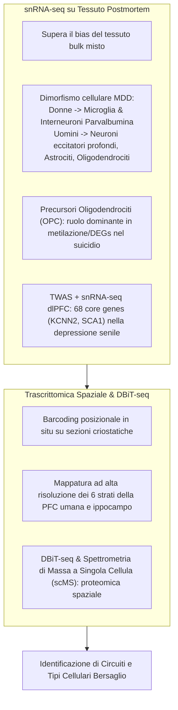
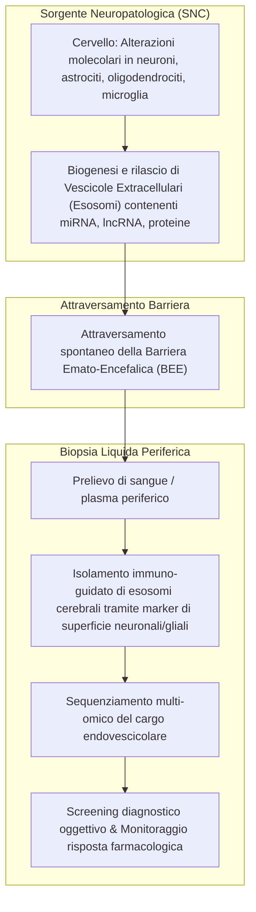

# Recent Developments in Omics Studies and Artificial Intelligence in Depression and Suicide

## Definizione Operativa
- Narrative review sistematica e approfondita pubblicata su *Translational Psychiatry* da Qingzhong Wang e Yogesh Dwivedi (Department of Psychiatry and Behavioral Neurobiology, University of Alabama at Birmingham, 2025) che esamina lo stato dell'arte nell'integrazione tra piattaforme multi-omiche ad alto rendimento (bulk RNA-seq, single-cell/single-nucleus RNA-seq, trascrittomica spaziale, proteomica DBiT-seq/scMS, epigenomica e metilazione del DNA, epitrascrittomica m6A) e modelli avanzati di Intelligenza Artificiale (Machine Learning come SVM, Random Forest e Random Deep Forest; Deep Learning multimodale; Natural Language Processing su cartelle cliniche e segnali acustici).
- **Utilità Clinica e Psichiatria di Precisione:** Indirizza le sfide cruciali del Disturbo Depressivo Maggiore (MDD) e della suicidalità—patologie caratterizzate da marcata eterogeneità clinica, assenza di biomarker oggettivi di laboratorio e un gap di risposta/aderenza farmacologica (~33% di resistenza agli antidepressivi). L'integrazione computazionale multi-omica consente di superare l'approccio empirico del *trial-and-error*, consentendo l'identificazione precoce del rischio suicidario, la stratificazione molecolare dei pazienti, la previsione della risposta terapeutica (SSRI, ketamina) e l'impiego della biopsia liquida basata su esosomi cerebrali circolanti come finestra non invasiva sul sistema nervoso centrale.

```mermaid
flowchart TD
    subgraph ClinicalNeeds ["Criticità Cliniche (MDD & Suicidio)"]
        N1["Diagnosi basata su colloqui soggettivi & scale"]
        N2["Prevalenza lifetime MDD 15-17%; Rischio suicidio 15%"]
        N3["Ideazione suicidaria 53%, Tentativi 31%"]
        N4["Resistenza terapeutica (~33%) & Non-aderenza"]
    end

    subgraph MultiOmicsData ["Piattaforma Multi-Omica & Biomarcatori"]
        O1["Bulk RNA-seq (Cervello postmortem, Sangue, Animali)"]
        O2["Non-Coding RNA (miRNA, lncRNA, circRNA, snoRNA, piRNA)"]
        O3["snRNA-seq & Trascrittomica Spaziale (6 strati PFC, Ippocampo)"]
        O4["Epigenomica (Siti CpG) & Epitrascrittomica (m6A / METTL3, WTAP)"]
        O5["Biopsia Liquida (Esosomi derivati dal SNC che superano la BEE)"]
    end

    subgraph AIComputationalCore ["Algoritmi di Intelligenza Artificiale"]
        A1["Machine Learning: SVM, Random Forest, Random Deep Forest"]
        A2["Deep Learning: Integrazione Genomica-Cromatinica (PsychENCODE Hi-C)"]
        A3["Natural Language Processing & Analisi Acustica (EHR, Audio interviste)"]
        A4["Integrazione Multi-Omica: WGCNA, CFG Bayesiano, Deconvoluzione"]
    end

    subgraph TranslationalOutcomes ["Applicazioni Cliniche e Psichiatria di Precisione"]
        T1["Classificazione Diagnostica Oggettiva (Accuratezza 90-100%)"]
        T2["Stratificazione Rischio Suicidario (Accuratezza 92.6% su 63 CpG)"]
        T3["Predizione Quantitativa Scale Cliniche (HDRS R²=0.96, SSI R²=0.94)"]
        T4["Selezione Personalizzata dei Trattamenti & Scoperta Bersagli Druggable"]
    end

    ClinicalNeeds --> MultiOmicsData
    MultiOmicsData --> AIComputationalCore
    AIComputationalCore --> TranslationalOutcomes
```

---

## Evidenze dalla Letteratura

### 1. Inquadramento Clinico-Epidemiologico ed Eziopatogenetico
- **Epidemiologia e Comorbilità:** Il MDD colpisce il 15–17% della popolazione globale. Nel corso degli episodi depressivi maggiori, circa il 53% dei pazienti sviluppa ideazione suicidaria, il 31% compie tentativi di suicidio e il rischio complessivo di morte per suicidio si attesta al 15% (Dong et al., 2018, 2019; Malhi & Mann, 2018).
- **Fattori di Non-Aderenza e Gap di Efficacia:** La scarsa aderenza terapeutica aggrava la prognosi ed è predetta da età giovanile, comorbilità con disturbi di personalità o abuso di sostanze, ridotto insight, effetti avversi dei farmaci e debolezza dell'alleanza terapeutica (Pompili et al., 2013).
- **Necessità di Biomarker Obiettivi:** L'assenza di marcatori biologici validati rende indispensabile la transizione verso approcci di biologia dei sistemi capaci di decifrare le complesse interazioni gene-ambiente ($G \times E$).

---

### 2. Bulk RNA-Sequencing: Cervello Postmortem, Sangue e Modelli Animali

```mermaid
flowchart LR
    subgraph BrainPostmortem ["Cervello Postmortem"]
        B1["Disregolazione vie Glutamatergiche & GABAergiche"]
        B2["Dimorfismo sessuale: quasi nessun DEG sovrapposto M/F"]
        B3["Firme suicidio: PRS26, ARNT, SYN3, MTRNRL8, IL8"]
        B4["Moduli immunitari/infiammatori associati a ideazione"]
    end

    subgraph BloodSurrogate ["Sangue Periferico"]
        BL1["Predittori risposta farmaci: RORα, GCET2, CHI3L2, LSP1"]
        BL2["Non-responder escitalopram: ↑ CHN2 & ↑ JAK2"]
        BL3["Convergent Functional Genomics (CFG bayesiano)"]
        BL4["19 moduli genici correlati a ideazione suicidaria"]
    end

    subgraph AnimalModels ["Modelli Animali"]
        AN1["Learned Helplessness: geni olfattivi & miRNA sinaptici"]
        AN2["Stress postnatale (two-hit): Otx2 nella VTA previene vulnerabilita"]
        AN3["UCMS: Ipericina ripristina m6A via METTL3 e WTAP"]
        AN4["EEG in vivo + snRNA-seq: neuroni GABAergici guidano la vulnerabilita"]
    end

    BrainPostmortem -.->|Validazione incrociata| BloodSurrogate
    AnimalModels -.->|Meccanismi causali| BrainPostmortem
```

#### A. Studi su Cervello Postmortem Umano
- **Regioni Cerebrali Esplorate:** Corteccia prefrontale dorsolaterale (dlPFC), corteccia prefrontale dorsomediale (dmPFC), corteccia cingolata anteriore (ACC), corteccia orbitofrontale (OFC), amigdala, ippocampo e ipotalamo.
- **Sistemi Neurotrasmettitoriali:** Anomalie consistenti nelle vie di segnalazione del glutammato e dell'acido gamma-aminobutirrico (GABA), associate ad alterazioni gliali, endoteliali e dell'attività ATPasica (Pantazatos et al., 2017).
- **Dimorfismo Sessuale Trascrizionale:** Analisi trascrittomiche su 6 aree cerebrali (Labonté et al., 2017; Mansouri et al., 2023) mostrano una quasi totale assenza di geni differenzialmente espressi (DEGs) comuni tra uomini e donne con MDD, nonostante un'omologia nelle reti di co-espressione.
- **Geni e Moduli Specifici del Suicidio:** L'integrazione di profili trascrittomici di soggetti depressi deceduti per suicidio vs cause naturali ha identificato DEGs chiave come `PRS26`, `ARNT`, `SYN3`, `MTRNRL8` e `IL8`. I moduli di co-espressione associati all'ideazione suicidaria convergono su risposte infiammatorie, immunitarie e risposte a infezioni microbiche sia nel cervello che nel sangue (Sun et al., 2024).

#### B. Studi su Sangue Periferico
- **Biomarcatori di Risposta Terapeutica:**
  - L'analisi del trascrittoma ematico a 0, 2 e 5 settimane di trattamento antidepressivo ha identificato 127 trascritti correlati all'efficacia clinica; la ridotta espressione basale di `RORα` (*retinoid-related orphan receptor α*), `GCET2` e `CHI3L2` predice la remissione, mentre `LSP1` (*leukocyte-specific protein 1*) si riduce marcatamente dopo 5 settimane di cura (Hennings et al., 2015).
  - Nei non-responder a 8 settimane di escitalopram si osserva un incremento di `CHN2` (coinvolto nella neurogenesi ippocampale) e `JAK2` (regolatore dell'immunità innata e adattiva) (Ju et al., 2019).
- **Convergent Functional Genomics (CFG):** Integrazione bayesiana di evidenze genomiche e funzionali per identificare e prioritizzare biomarcatori ematici di disturbi dell'umore e suicidalità (Le-Niculescu et al., 2009, 2013).
- **Moduli di Ideazione Suicidaria:** Identificati 19 moduli di co-espressione nel sangue significativamente correlati alla gravità dell'ideazione suicidaria attiva (Sun et al., 2024; Geng et al., 2020).

#### C. Studi su Modelli Animali di Depressione
- **Modello "Two-Hit" e Asse Otx2:** Lo stress precoce (separazione materna a PND 10–20) aumenta la vulnerabilità allo stress sociale (*social defeat*) in età adulta (PND 60–70). La trascrittomica nell'area tegmentale ventrale (VTA) e nel nucleus accumbens (NAc) ha svelato che la sovraespressione transitoria del fattore di trascrizione `Otx2` nella VTA inverte la suscettibilità allo stress ripristinando i programmi trascrittomici fisiologici (Peña et al., 2017).
- **Epitrascrittomica $m^6A$:** Nel modello di stress cronico imprevedibile (UCMS), il trattamento con ipericina corregge i deficit comportamentali aumentando l'espressione degli enzimi metiltransferasi `METTL3` e `WTAP`, potenziando le vie dei fattori neurotrofici (Lei et al., 2023).
- **Elettrofisiologia di Rete e snRNA-seq:** L'integrazione di registrazioni EEG multicanale in vivo e snRNA-seq nella PFC ha dimostrato che i profili trascrizionali dei neuroni GABAergici sono i principali determinanti degli stati di rete associati alla vulnerabilità allo stress (Hing et al., 2024).

---

### 3. Tassonomia e Ruolo Funzionale degli RNA Non Codificanti (ncRNAs)

Gli RNA non codificanti costituiscono oltre il 90% dell'output trascrizionale del genoma e agiscono da potenti modulatori epigenetici e post-trascrizionali:

| Classe di ncRNA | Dimensioni e Biogenesi | Meccanismo Biologico | Scoperte Salienti nel MDD e Suicidio | Riferimenti |
| :--- | :--- | :--- | :--- | :--- |
| **microRNA (miRNA)** | ~22 nt; processamento DROSHA/DGCR8 $\to$ Dicer $\to$ complesso RISC | Repressione traduzionale o degradazione dell'mRNA bersaglio (legame alla regione 3' UTR) | - Downregulation diffusa nella PFC di soggetti suicidi (network di 29 miRNA che regolano apoptosi e metilazione). - **miRNoma sinaptosomiale**: 351 miRNA alterati nelle sinapsi purificate della dlPFC. - `miR-124-3p`: iperespresso in cervello e sangue nel MDD, modula la trasmissione glutamatergica. - `miR-19a-3p`: perde l'interazione con TNF-α nel suicidio a causa della competizione con la proteina HuR, determinando un'iperproduzione continua di TNF-α. - Biomarcatori di risposta antidepressiva: `miR-1202` (primate-specifico, bersaglia GRM4), `miR-135a`, `miR-16`, `miR-146a/b-5p`, `miR-425-3p`. | Smalheiser et al., 2012; Yoshino et al., 2020, 2021; Roy et al., 2017; Wang et al., 2018; Lopez et al., 2014, 2017 |
| **Long Non-Coding RNA (lncRNA)** | >200 nt; trascrizione da RNA polimerasi II, assenza di ORF | Modulazione di enhancer, loop cromatinici, scaffolding proteico, splicing alternativo | - **LINC00473**: bersaglio femmina-specifico, downregolato nella PFC di donne depresse; la sua espressione promuove la resilienza. - **FEDORA**: upregolato nella PFC e nel sangue di donne con MDD, espresso in oligodendrociti e neuroni; predice la risposta rapida alla **ketamina**. - **LINC01268**: iperespresso nella PFC di individui morti per suicidio violento; l'allele di rischio correla con aggressività lifetime e ipoattivazione fMRI della PFC a volti arrabbiati. - Modelli animali: geni lncRNA `Spp2`, `Olr25`, `Mboat7`, `Lmod1`, `Il18`, `Rfx5` legati a suscettibilità; `Adam6`, `Tpra1` a risposta a fluoxetina. | Issler et al., 2020, 2022; Punzi et al., 2019; Wang, Wang & Dwivedi, 2024 |
| **Circular RNA (circRNA)** | Struttura circolare a singolo filamento chiusa covalentemente (back-splicing) | Spugne per miRNA (*miRNA sponges*), regolazione trascrizionale e di legame proteico; elevatissima stabilità | - Marcatori ematici differenziali nel MDD: `hsa_circRNA_103636`, `circFKBP8`, `circMBNL1`, `circDYM`. - Ruolo regolatorio sulla plasticità sinaptica e cognizione (es. circRNA correlati a geni di rischio psichiatrico). | Cui et al., 2016; Shi et al., 2021; Zimmerman et al., 2020 |
| **Small Nucleolar RNA (snoRNA)** | Piccoli RNA non codificanti nucleolari | Modifica chimica dell'rRNA (metilazione 2'-O, pseudouridilazione) e regolazione dello splicing alternativo | - `SNORD90`: incrementato dai trattamenti antidepressivi monoaminergici, reprime il gene `NRG3` (neuregulina 3) aumentando il glutammato e producendo effetto terapeutico. - `SNORD85`: ridotto del ~50% nei sinaptosomi corticali nella schizofrenia e psicosi. | Lin et al., 2023; Smalheiser et al., 2014; Wajahat et al., 2021 |
| **PIWI-interacting RNA (piRNA)** | 24–32 nt; biogenesi Dicer-indipendente; legame a proteine PIWI | Silenziamento di retrotrasposoni, modifiche epigenetiche e plasticità neuronale nella memoria | - Modelli murini knockout per `Miwi/Piwil1` e `Piwil2` mostrano iperattività, comportamenti ansiosi e alterazione della memoria di paura, implicando i piRNA nell'omeostasi cerebrale. | Nandi et al., 2016; Sato et al., 2023; Weick & Miska, 2014 |

---

### 4. Risoluzione a Singola Cellula, snRNA-Seq e Trascrittomica Spaziale

- **Limiti del Bulk e Vantaggi del snRNA-seq:** Il tessuto cerebrale bulk maschera i segnali di popolazioni cellulari rare. L'isolamento di singoli nuclei (*single-nucleus RNA-seq*) permette di mappare traiettorie pseudo-temporali e assegnare variazioni trascrittomiche a specifiche tipologie cellulari (Maitra et al., 2023).
- **Dimorfismo Cellula-Specifico:** Nel MDD, le donne mostrano alterazioni trascrizionali prevalentemente in **microglia** e **interneuroni GABAergici parvalbumina (PV)**, mentre negli uomini i DEGs si concentrano nei **neuroni eccitatori corticali profondi, astrociti e oligodendrociti mature** (Maitra et al., 2023).
- **Ruolo Centrale degli OPC nel Suicidio:** L'integrazione di scRNA-seq, bulk mRNA-seq e metilazione del DNA in cervelli di soggetti suicidi ha identificato le cellule progenitrici degli oligodendrociti (**OPC**) come la popolazione che fornisce il contributo proporzionale più elevato alle aberrazioni epigenetiche e trascrizionali (Zhou et al., 2023).
- **TWAS e Depressione Senile:** L'integrazione di GWAS e snRNA-seq nella dlPFC ha individuato 68 geni cardine arricchiti in neuroni eccitatori e inibitori, con geni specifici come `KCNN2` e `SCA1` legati alla suscettibilità depressiva in età avanzata (Zeng et al., 2024).
- **Trascrittomica Spaziale (ST):** Permette di associare ciascun trascritto alle coordinate anatomiche 2D/3D tramite vetrini con primer a codice a barre spaziale. È stata utilizzata per mappare la diversità cellulare dell'ippocampo e l'architettura trascrizionale dei **sei strati della corteccia prefrontale dorsolaterale umana** (Maynard et al., 2021; Thompson et al., 2025).

---

### 5. Intelligenza Artificiale, Machine Learning e Deep Learning Multimodale

L'applicazione di algoritmi di Machine Learning (ML), Deep Learning (DL) e Natural Language Processing (NLP) permette di estrarre pattern complessi e non lineari da dataset multi-omici ed eterogenei:

```mermaid
flowchart LR
    subgraph InputFeatures ["Dati Multi-Omici & Multimodali"]
        F1["Trascrittoma Ematico (mRNA/ncRNA)"]
        F2["Metiloma Ematico (Siti CpG)"]
        F3["Conformazione Cromatina Hi-C & GWAS"]
        F4["Note Cliniche & EHR (NLP)"]
        F5["Segnali Vocali & Acustici"]
    end

    subgraph MLAlgorithms ["Modelli di Machine Learning & DL"]
        A1["Support Vector Machine (SVM)"]
        A2["Random Deep Forest (Leave-One-Out CV)"]
        A3["Deep Neural Networks Multimodali"]
        A4["NLP Transformers & Speech Processing"]
    end

    subgraph ClinicalOutputs ["Validazione Clinica"]
        O1["Classificazione MDD / SSD / Controlli:<br><b>100% Accuratezza</b> (48 geni)"]
        O2["Diagnosi MDD:<br><b>90.6% Sensibilita & Specificita</b> (10 geni)"]
        O3["Suicidio in MDD:<br><b>92.6% Accuratezza</b> (63 siti CpG)"]
        O4["Stima Scale Psichiatriche:<br><b>R² = 0.961</b> (HDRS-17) & <b>R² = 0.943</b> (SSI)"]
    end

    InputFeatures --> MLAlgorithms
    MLAlgorithms --> ClinicalOutputs
```

#### A. Classificazione Diagnostica e Predittiva con Machine Learning
1. **Support Vector Machines (SVM) su Trascrittoma Ematico:**
   - Classificazione a tre vie tra soggetti al primo episodio con depressione sottosindromica (SSD), MDD conclamato e controlli sani: identificato un pannello di **48 signature geniche con un'accuratezza del 100%** (Yi et al., 2012).
   - Diagnosi di MDD tramite un pannello ristretto di soli **10 RNA marker ematici**: modello SVM con equazione logistica che garantisce **sensibilità e specificità del 90.6%** (Yu et al., 2016).
2. **Random Deep Forest su Dati Multi-Omici Ematici (Trascrittoma + Metiloma):**
   - Modello di Random Deep Forest con validazione *leave-one-out cross-validation* addestrato su DEGs e siti CpG differenzialmente metilati: ha distinto pazienti depressi con tentativi di suicidio da pazienti depressi non suicidi e controlli con un'**accuratezza del 92.6%**; 63 delle feature più informative erano rappresentate esclusivamente da siti CpG metilati (Bhak et al., 2019).
3. **Regressione Quantitativa su Gravità e Rischio Suicidario:**
   - Modelli di regressione basati su multi-omica ematica predicono i punteggi effettivi della Hamilton Rating Scale for Depression (*HDRS-17*, $R^2 = 0.961$) e della Scale for Suicide Ideation (*SSI*, $R^2 = 0.943$) (Bhak et al., 2019).
4. **Machine Learning su lncRNA e miRNA:**
   - Algoritmi supervisionati e non supervisionati hanno identificato lncRNA ematici e cerebrali capaci di distinguere con elevata area sotto la curva (AUC) la depressione con e senza suicidalità (Peng et al., 2023; Qi et al., 2020; Wang, Wang & Dwivedi, 2024).

#### B. Deep Learning Multimodale ed NLP
- **Integrazione Genomica-Funzionale (PsychENCODE):** Architetture di deep learning integrate con WGCNA su SNP genomici, trascrittoma e dati di conformazione cromatinica tridimensionale (*Hi-C*) da dlPFC hanno svelato network sinaptici e immunitari condivisi tra disturbi affettivi e schizofrenia (Gusev et al., 2018; Wang & Dwivedi, 2025).
- **NLP su Cartelle Elettroniche (EHR) e Testi Digitali:** Reti neurali sequenziali analizzano narrazioni cliniche e testi per il rilevamento precoce del rischio suicidario e dell'esordio depressivo (Al Hanai et al., 2018; Walsh et al., 2018; Nickson et al., 2023).
- **Analisi Acustica e Vocale:** Algoritmi di machine learning estraggono pattern comportamentali e paralinguistici da interviste audio medico-paziente per supportare la formulazione diagnostica (Birnbaum et al., 2022).

---

### 6. Traduzione Clinica: Biopsia Liquida ed Esosomi Cerebrali (EVs)

1. **Il Paradosso del Tessuto Nervoso:** Il tessuto cerebrale postmortem fornisce accesso diretto alla fisiopatologia ma non è campionabile clinicamente *in vivo*. Il sangue periferico è facilmente accessibile ma può riflettere risposte infiammatorie sistemiche aspecifiche.
2. **Esosomi Cerebrali Circolanti (*Brain-Derived Extracellular Vesicles*):** Le vescicole extracellulari secrete da cellule del SNC oltrepassano la barriera emato-encefalica (BEE) e possono essere isolate dal sangue mediante anticorpi specifici per antigeni di superficie neuronali o gliali. Il loro carico biologico (miRNA, lncRNA, frammenti di mRNA, proteine) funge da **"finestra molecolare non invasiva sul cervello"**, consentendo una profilazione dinamica e ripetibile dello stato neurobiologico del paziente.

---

### 7. Sfide Aperte e Raccomandazioni Future
1. **Dimensioni Campionarie e Replicabilità:** Necessità di coorti cliniche multicentriche standardizzate per evitare overfitting e mitigare il problema dei campioni ridotti nei modelli di machine learning.
2. **Integrazione Multimodale Omica + Imaging + Elettrofisiologia:** Fusione di profili multi-omici con dati fMRI, spettroscopia e tracciati EEG per costruire classificatori olistici.
3. **Modelli 3D e Organoidi Cerebrali:** Utilizzo di organoidi derivati da iPSC per la validazione funzionale *in vitro* dei target farmacologici (*druggable targets*) identificati dall'IA.
4. **Validazione di Regolamentazione Clinica:** Sviluppo di standard operativi per l'introduzione di pannelli multi-omici di biopsia liquida nei percorsi diagnostico-terapeutici assistenziali (PDTA) di salute mentale.

---

**Riferimenti Bibliografici:**
- Wang, Q., & Dwivedi, Y. (2025). Recent developments in omics studies and artificial intelligence in depression and suicide. *Translational Psychiatry*, 15(1), 275. https://doi.org/10.1038/s41398-025-03497-y
- Bhak, Y., Jeong, H. O., Cho, Y. S., Jeon, S., Cho, J., Gim, J. A., et al. (2019). Depression and suicide risk prediction models using blood-derived multi-omics data. *Translational Psychiatry*, 9(1), 262.
- Issler, O., van der Zee, Y. Y., Ramakrishnan, A., Wang, J., Tan, C., Loh, Y. E., et al. (2020). Sex-specific role for the long non-coding RNA LINC00473 in depression. *Neuron*, 106(6), 912–926.
- Labonté, B., Engmann, O., Purushothaman, I., Menard, C., Wang, J., Tan, C., et al. (2017). Sex-specific transcriptional signatures in human depression. *Nature Medicine*, 23(9), 1102–1111.
- Le-Niculescu, H., Levey, D., Ayalew, M., Palmer, L., Gavrin, L., Jain, N., et al. (2013). Discovery and validation of blood biomarkers for suicidality. *Molecular Psychiatry*, 18(12), 1249–1264.
- Maitra, M., Mitsuhashi, H., Rahimian, R., Chawla, A., Yang, J., Fiori, L. M., et al. (2023). Cell type specific transcriptomic differences in depression show similar patterns between males and females but implicate distinct cell types and genes. *Nature Communications*, 14(1), 2912.
- Maynard, K. R., Collado-Torres, L., Weber, L. M., Uytingco, C., Barry, B. K., Williams, S. R., et al. (2021). Transcriptome-scale spatial gene expression in the human dorsolateral prefrontal cortex. *Nature Neuroscience*, 24(3), 425–436.
- Peña, C. J., Kronman, H. G., Walker, D. M., Cates, H. M., Bagot, R. C., Purushothaman, I., et al. (2017). Early life stress confers lifelong stress susceptibility in mice via ventral tegmental area OTX2. *Science*, 356(6343), 1185–1188.
- Sun, S., Liu, Q., Wang, Z., Huang, Y. Y., Sublette, M. E., Dwork, A. J., et al. (2024). Brain and blood transcriptome profiles delineate common genetic pathways across suicidal ideation and suicide. *Molecular Psychiatry*, 29(5), 1417–1426.
- Yi, Z., Li, Z., Yu, S., Yuan, C., Hong, W., Wang, Z., et al. (2012). Blood-based gene expression profiles models for classification of subsyndromal symptomatic depression and major depressive disorder. *PLoS ONE*, 7(2), e31283.
- Yu, J., Xue, A., Redei, E., & Bagheri, N. (2016). A support vector machine model provides an accurate transcript-level-based diagnostic for major depressive disorder. *Translational Psychiatry*, 6(10), e931.
- Zhou, Y., Xiong, L., Chen, J., & Wang, Q. (2023). Integrative analyses of scRNA-seq, bulk mRNA-seq, and DNA methylation profiling in depressed suicide brain tissues. *International Journal of Neuropsychopharmacology*, 26(12), 840–855.

---

## Relazioni
- Vedi anche: [[multi-omics-ai-psychiatry]], [[non-coding-rna-psychiatric-biomarkers]], [[explainable-mental-health-diagnosis]], [[personalized-networks-in-psychotherapy]], [[network-based-mental-healthcare]], [[ai-assisted-psychotherapy]], [[software-as-a-medical-device-salute-mentale]], [[11920_2026_Article_1690]]
