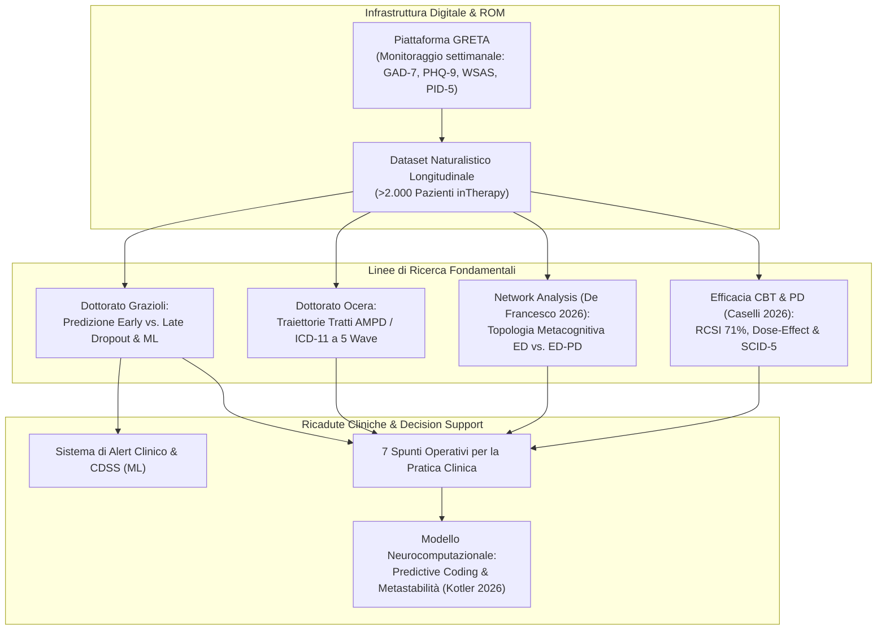
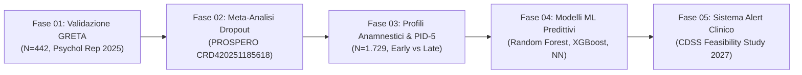
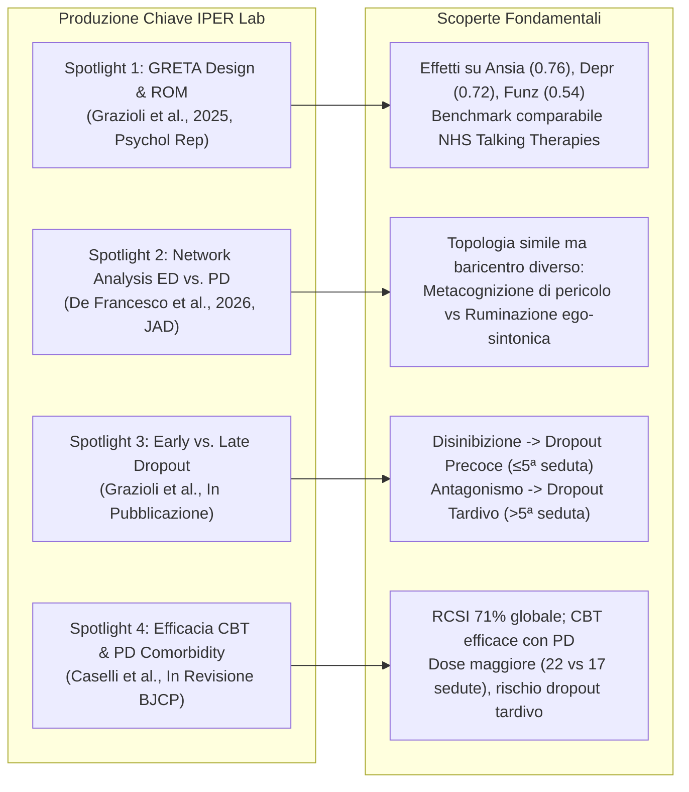
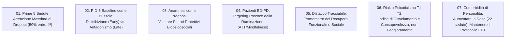
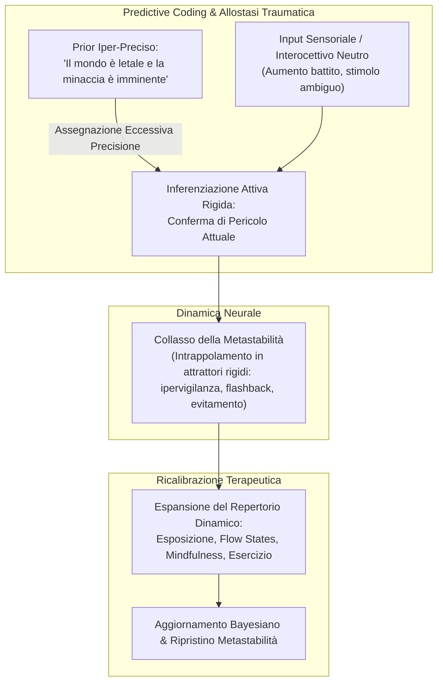

# Bollettino di Ricerca IPER Lab × inTherapy — N° 01 (Giugno 2026): Tra Ricerca e Clinica

## Definizione Operativa e Sintesi Esecutiva
- **Inquadramento Generale:** Primo numero del bollettino scientifico semestrale curato dall'**IPER Lab** (*Innovation in Psychotherapy Efficacy Research*, Sigmund Freud University, Milano; Direzione Scientifica: Prof. Gabriele Caselli, Dott.ssa Rossana Piron, Prof. Giovanni Maria Ruggiero, Prof.ssa Sandra Sassaroli) per la comunità clinica del servizio **inTherapy**.
- **Missione e Infrastruttura:** Rendicontare i progetti di ricerca, le pubblicazioni *peer-reviewed*, le pre-registrazioni e i risultati empirici generati sui dati naturalistici raccolti in modo continuativo tramite la piattaforma digitale **GRETA** (*Routine Outcome Monitoring* - ROM). L'infrastruttura connette l'attività clinica quotidiana alla ricerca quantitativa evidence-based, alimentando un ciclo continuo in cui il dato clinico genera ipotesi di ricerca che ritornano alla pratica sotto forma di linee guida tattiche, strumenti prognostici e sistemi di *clinical decision support*.
- **Assi Portanti del Semestre (Gennaio–Giugno 2026):**
  1. **Predizione e Tassonomia del Dropout nella CBT Online (Progetto Silvia Grazioli):** Distinzione fenomenologica e predittiva tra *dropout precoce* (≤ 5ª seduta) e *dropout tardivo* (> 5ª seduta) su $N = 1.729$ pazienti tramite profili anamnestici latenti (*Latent Class Analysis* - LCA) e tratti maladattivi di personalità (**PID-5**), propedeutica allo sviluppo di modelli predittivi di *Machine Learning* e alert clinici.
  2. **Traiettorie Longitudinale dei Tratti di Personalità in CBT (Progetto Alessandro Ocera):** Monitoraggio multidimensionale basato sui modelli **AMPD (DSM-5)** e **ICD-11** ($N = 660$ baseline, $N = 153$ a 3 mesi), volto a mappare se e come i tratti maladattivi si modifichino nel tempo rispetto alla remissione dei sintomi acuti.
  3. **Topologia di Rete e Comorbidità (De Francesco et al., 2026):** *Network analysis* su $N = 962$ pazienti con disturbi emotivi con e senza comorbidità di personalità, che documenta baricentri disfunzionali distinti (credenze metacognitive di pericolo vs. ruminazione depressiva ego-sintonica).
  4. **Efficacia della CBT nei Disturbi di Personalità (Caselli et al., 2026):** Studio naturalistico su $N = 1.782$ pazienti con diagnosi **SCID-5**, che dimostra come i protocolli CBT standard disturbo-specifici mantengano un tasso di *Reliable and Clinically Significant Improvement* (**RCSI = 71%**) anche in presenza di disturbi di personalità, a patto di adeguare dosaggio (22 vs. 17 sedute) e prevenire il dropout tardivo.
  5. **Neurocomputazione del Trauma e Metastabilità (Kotler et al., 2026):** Revisione critica del paradigma di van der Kolk (*"The Body Keeps the Score"*) alla luce del *predictive coding* e della riduzione della metastabilità neurale.

---

## Progetti di Dottorato in Corso

### 1. Prevedere chi lascia la terapia: Il Progetto di Silvia Grazioli
- **Razionale Metodologico e Clinico:** Il dropout in psicoterapia cognitivo-comportamentale raggiunge in letteratura tassi fino al **35%**, e nei trattamenti online circa il **50% delle interruzioni si concentra entro le prime 4 sedute** (e il 75% entro la 10ª). Negli RCT tradizionali chi abbandona viene frequentemente escluso o trattato con assunzioni distorsive, gonfiando artificiosamente l'efficacia stimata.
- **Obiettivo Finale:** Sviluppo e validazione di uno strumento di **Clinical Decision Support System (CDSS)** integrato nell'interfaccia clinica di GRETA, capace di elaborare i dati anamnestici e i primi questionari di monitoraggio per allertare tempestivamente il terapeuta sul rischio imminente di interruzione.
- **Roadmap Sequenziale in Cinque Fasi (2025–2027):**
  1. **Fase 01 (Pubblicato - Psychological Reports, 2025):** Validazione di efficacia dell'infrastruttura GRETA su $N = 442$ pazienti dimessi (*completers* e *drop-out*). Riduzioni pre-post significative e clinicamente rilevanti per sintomi ansiosi (GAD-7, $\xi = 0.76$), depressivi (PHQ-9, $\xi = 0.72$) e compromissione del funzionamento psicosociale (WSAS, $\xi = 0.54$).
  2. **Fase 02 (In corso - PROSPERO CRD420251185618):** Revisione sistematica e meta-analisi comparativa dei tassi di dropout tra CBT online e CBT in presenza in contesti naturalistici (screening in completamento, estrazione dati entro luglio 2026).
  3. **Fase 03 (In fase di pubblicazione):** Studio empirico su $N = 1.729$ pazienti inTherapy che identifica 3 profili anamnestici latenti tramite *Latent Class Analysis* (LCA) e dimostra la dissociazione predittiva dei tratti PID-5 tra dropout precoce (≤ 5ª seduta) e tardivo (> 5ª seduta).
  4. **Fase 04 (In fase di analisi - H2 2026):** Sviluppo e validazione incrociata di modelli supervisionati di Machine Learning (*Random Forest*, *XGBoost*, *Reti Neurali Artificiali*) sui dati GRETA per la stima probabilistica personalizzata del dropout.
  5. **Fase 05 (Prospettiva 2027):** Trial di *feasibility* e impatto clinico sull'integrazione di alert predittivi per il terapeuta per valutare l'effettiva riduzione dell'attrito terapeutico.

---

### 2. Come cambiano i tratti durante la CBT: Il Progetto di Alessandro Ocera
- **Cornice Teorica e Gap della Letteratura:** Il passaggio nosografico dal paradigma categoriale rigido del DSM-IV-TR alla prospettiva dimensionale dell'**Alternative Model for Personality Disorders (AMPD, DSM-5 Sezione III)** e dell'**ICD-11** concettualizza i disturbi di personalità attraverso grandi domini maladattivi (*Affettività Negativa, Distacco, Antagonismo, Disinibizione, Anankastia, Psicoticismo*). La letteratura storica (es. meta-analisi di Roberts et al., 2017) ha documentato la modificabilità dei tratti generali con la psicoterapia, ma è quasi interamente basata sul modello dei Big Five e su disegni pre-post a due punti, lasciando inesplorata la dinamica longitudinale fine dei domini maladattivi specifici.
- **Domande di Ricerca Pre-registrate su OSF:**
  - *RQ1:* I livelli basali di tratti maladattivi correlano con una maggiore severità sintomatica e un funzionamento più compromesso?
  - *RQ2:* L'esacerbazione acuta intra-individuale di un tratto rispetto al baseline abituale del paziente si associa a un peggioramento parallelo di sintomi e funzionamento?
  - *RQ3:* La riduzione dei tratti maladattivi precede temporalmente il miglioramento dei sintomi (*leading indicator*) o evolve in sincronia parallela?
  - *RQ4:* Nel corso del trattamento, il dominio di personalità predominante rimane invariato o subisce una riconfigurazione qualitativa?
- **Disegno Sperimentale e Metodologia:**
  - Disegno longitudinale naturalistico a **5 wave di assessment su 12 mesi** ($T_1$ baseline, $T_2$ a 3 mesi, $T_3$ a 6 mesi, $T_4$ a 9 mesi, $T_5$ a 12 mesi). Target pre-registrato: $N = 200$ pazienti con follow-up completo; $N = 660$ reclutati ad aprile 2026 (approvazione Comitato Etico Sigmund Freud University Wien).
  - Strumenti: **PID-5 completo** (220 item) a $T_1$ per l'inquadramento di dettaglio; **PID-5-BF+M** (versione breve a 36 item che mappa i 6 domini congiunti AMPD/ICD-11) ai wave successivi, affiancato da GAD-7, PHQ-9 e WSAS.
  - Systematic Review e Meta-analisi in corso sui domini AMPD/ICD-11 in psicoterapia ($k = 7$ studi inclusi, $N \approx 419$; Ocera, Hopwood, Caselli).
- **Risultati Preliminari ($T_1 \rightarrow T_2$, $N = 153$ pazienti a 3 mesi):**
  1. *Rapida Risposta Sintomatica:* Flessione marcata e statisticamente significativa di ansia, depressione e compromissione funzionale.
  2. *Stabilità Relativa dei Tratti Globali:* I punteggi dimensionali complessivi dei domini di personalità mostrano un'elevata inerzia temporale nei primi tre mesi, confermandosi dimensioni di funzionamento più strutturate rispetto alla fluttuazione dei sintomi.
  3. *Lieve Incremento del Dominio Psicoticismo:* Dato apparentemente paradossale, interpretato non come deterioramento clinico iatrogeno, ma come indice di **accresciuta auto-consapevolezza e disvelamento clinico** (il paziente, all'interno dell'alleanza, acquisisce il vocabolario e la sicurezza per esplicitare vissuti cognitivi insoliti ed eccentricità precedentemente taciute o mascherate).
  4. *Pattern di Cambiamento Sociale e Relazionale:* A livello di singoli item, le variazioni precoci significative riguardano prevalentemente gli aspetti di connessione interpersonale e investimento relazionale dei tratti.

---

## Spotlight sulle Pubblicazioni e Ricerche del Semestre

### Spotlight 1: Validazione della Piattaforma GRETA e Benchmark Internazionale
*Grazioli S., Ocera A., Notaristefano I., Piron R., Fanfoni M., Terrazzan L., Ruggiero G.M., Sassaroli S., Caselli G. (2025). Advancing Cognitive Behavioural Therapy Progress Tracking: A Study on the Design and Implementation of the Online Platform GRETA. Psychological Reports, SAGE Publications. DOI: 10.1177/00332941251409157.*
- **Campione e Metodo:** $N = 442$ pazienti dimessi da inTherapy (inclusi sia *completers* che *drop-out*), trattati per disturbi d'ansia o depressivi con rilevazione settimanale computerizzata di GAD-7, PHQ-9 e WSAS.
- **Metriche di Efficacia Pre-Post:**
  - Sintomi Ansiosi (GAD-7): Effect size $\xi = 0.76$ (miglioramento medio-grande).
  - Sintomi Depressivi (PHQ-9): Effect size $\xi = 0.72$ (miglioramento medio-grande).
  - Funzionamento Globale (WSAS): Effect size $\xi = 0.54$ (miglioramento moderato).
- **Rilevanza e Posizionamento:** Prima pubblicazione scientifica italiana a validare un servizio clinico privato allineato ai criteri di monitoraggio del sistema sanitario pubblico britannico (**NHS Talking Therapies** / IAPT), dimostrando che la CBT digitalizzata naturalistica in setting interamente online raggiunge dimensioni dell'effetto comparabili a quelle dei grandi benchmark pubblici europei.

---

### Spotlight 2: Network Analysis della Comorbidità tra Disturbi Emotivi e di Personalità
*De Francesco S., Caselli G., Giani L., Ocera A., Scaini S., Buattini M., Piron R., Fanfoni M., Giuri S., Nordahl H.M., Sassaroli S., Ruggiero G.M. (2026). Network analysis of emotional disorders with and without comorbid personality disorders: Symptom, metacognition, and repetitive thinking patterns. Journal of Affective Disorders, Elsevier, Vol. 398, 121062. DOI: 10.1016/j.jad.2025.121062.*
- **Domanda Strutturale:** La peggiore prognosi clinica dei disturbi emotivi con comorbidità di personalità (**ED-PD**) rispetto ai disturbi emotivi puri (**ED-noPD**) deriva da una mera differenza quantitativa (maggiore gravità degli stessi nodi) o da una riorganizzazione topologica qualitativa tra sintomi, metacognizioni e pensiero ripetitivo negativo (*Repetitive Negative Thinking* - RNT)?
- **Campione e Approccio Analitico:** $N = 962$ pazienti clinici inTherapy (il più ampio campione mondiale analizzato con questa metodologia per tale quesito). Valutazione tramite *Network Comparison Test* (NCT).
- **Evidenze Topologiche:**
  1. *Invarianza della Struttura Globale:* Il NCT non evidenzia discrepanze significative nella connettività globale complessiva della rete.
  2. *Divergenza dei Baricentri di Rete:*
     - **Gruppo ED-noPD (Disturbi Emotivi Puri):** Il nodo a massima centralità è costituito dalle **credenze metacognitive negative sull'incontrollabilità e sulla pericolosità dei pensieri**.
     - **Gruppo ED-PD (Comorbidità con Personalità):** Il baricentro migra nettamente verso la **ruminazione depressiva**, la quale mostra una connessione privilegiata e densa con l'**autoconsapevolezza cognitiva (*cognitive self-consciousness*)**, ossia la tendenza all'auto-monitoraggio introspettivo continuo.
- **Traduzione Clinica:** Nei pazienti con disturbo di personalità la ruminazione si struttura come un processo **ego-sintonico** (legato all'abitudine all'auto-osservazione identitaria più che alla minaccia di perdita di controllo). L'intervento terapeutico precoce deve prioritariamente disinnescare l'investimento metacognitivo nella ruminazione attraverso tecniche come l'**Attention Training Technique (ATT)** e la **Detached Mindfulness**, prima di avviare il potenziamento del controllo esecutivo o la ristrutturazione cognitiva del contenuto di minaccia.

---

### Spotlight 3: Profili Anamnestici e Tratti PID-5 nella Predizione di Early vs. Late Dropout
*Grazioli S., Canessa N., Villa G., De Francesco S., Ocera A., Galletti E., Sassaroli S., Caselli G. Distinguishing early from late dropout in online Cognitive Behavioral Therapy: the role of biopsychosocial anamnestic profiles and maladaptive personality traits. Manoscritto in fase di pubblicazione.*
- **Campione:** $N = 1.729$ pazienti adulti in CBT online su inTherapy, classificati in tre stati di esito: *Terapia in corso / conclusa*, *Dropout precoce* (≤ 5ª seduta) e *Dropout tardivo* (> 5ª seduta).
- **Risultati e Modello Predittivo:**
  1. *Profili Anamnestici Latenti (LCA):* Identificate 3 classi latenti distinte di risorse biopsicosociali (livello *Basso*, *Medio* e *Alto* di fattori protettivi). L'appartenenza al profilo ad "alti fattori protettivi" dimezza il rischio di abbandono precoce (**-52% di rischio di dropout precoce** rispetto alla classe a bassi fattori protettivi).
  2. *Dissociazione Predittiva dei Tratti PID-5:*
     - **Disinibizione (PID-5):** Predittore specifico e robusto del **dropout precoce**, riflettendo deficit di tolleranza alla frustrazione, impulsività e insofferenza verso la strutturazione formale iniziale del setting terapeutico.
     - **Antagonismo (PID-5):** Predittore specifico e selettivo del **dropout tardivo**, manifestandosi attraverso diffidenza, conflittualità interpersonale e rotture dell'alleanza terapeutica quando il lavoro clinico entra nelle fasi di sfida attiva degli schemi nucleari.
  3. *Superiorità dei Modelli Dimensionali:* Le diagnosi categoriali di disturbo di personalità e il mero conteggio delle comorbilità non aggiungono varianza spiegata una volta controllati i fattori protettivi anamnestici e i domini dimensionali del PID-5.

---

### Spotlight 4: Efficacia della CBT Standard nei Disturbi di Personalità in Setting Naturalistico
*Caselli G., Grazioli S., Piron R., Fanfoni M., Giuri S., Scaini S., Ruggiero G.M., Sassaroli S. Effectiveness of Cognitive Behavioral Therapy on anxiety and depression symptoms in naturalistic settings for patients with and without personality disorders. British Journal of Clinical Psychology, Wiley (In revisione / sottomissione 2026).*
- **Campione e Metodologia Rigorosa:** $N = 1.782$ pazienti adulti trattati tra marzo 2023 e dicembre 2025. A differenza dei servizi sanitari pubblici (che raramente dispongono di diagnostica strutturata per l'Asse II), lo studio ha sottoposto l'intero campione a intervista diagnostica strutturata **SCID-5** all'intake e monitoraggio settimanale ROM (PHQ-9, GAD-7, WSAS) con calcolo dell'indice **RCSI (Reliable and Clinically Significant Improvement)**.
- **Risultati Fondamentali:**
  - **Tasso RCSI Globale = 71%:** Risultato eccellente che supera ampiamente il target standard del 50% definito dal National Health Service britannico (NHS-TT).
  - **Efficacia Preservata nei Pazienti con DP:** Controllando la severità iniziale, il dropout e il numero di sedute erogate, la diagnosi formale di Disturbo di Personalità **non predice un esito peggiore**. I tassi grezzi inferiori osservati nei pazienti con DP sono interamente imputabili alla maggiore severità sintomatica di partenza e a un più elevato tasso di abbandono, non a un'intrinseca inefficacia della CBT.
  - **Dinamica di Dose ed Esposizione:** I pazienti con DP che completano con successo la terapia richiedono una durata significativamente maggiore (**media di 22 sedute vs. 17 sedute** nei pazienti senza DP).
  - **La Criticità Clinica del Dropout Tardivo:** Se l'abbandono precoce produce esiti analoghi tra i gruppi, l'interruzione dopo la 5ª seduta (*late dropout*) nei pazienti con disturbo di personalità si associa a una compromissione funzionale finale marcatamente più grave rispetto ai pazienti senza DP, evidenziando che per questo sottogruppo la tenuta della terapia è indispensabile per il consolidamento del cambiamento.

| Parametro Clinico | Pazienti Senza Disturbo di Personalità (no-PD) | Pazienti Con Disturbo di Personalità (PD) | Significatività / Impatto |
| :--- | :---: | :---: | :--- |
| **Tasso RCSI Globale** | Elevato | Comparabile (dopo controllo covariate) | Efficacia della CBT confermata |
| **Numero Medio Sedute Completers** | **17 sedute** | **22 sedute** | Richiesta di maggiore "dose" terapeutica |
| **Traiettorie Sintomatiche (GAD/PHQ)** | Rapido decremento iniziale | Rapido decremento iniziale | Risposta sintomatica precoce analoga |
| **Traiettoria Funzionamento (WSAS)** | Miglioramento rapido | Miglioramento più lento e graduale | Richiede consolidamento nel tempo |
| **Impatto Funzionale del Late Dropout** | Moderato | **Severo decadimento funzionale** | Massima vulnerabilità all'interruzione tardiva |

---

## Altre Linee di Ricerca dell'IPER Lab

1. **Systematic Review & Meta-Analysis sulla Modificabilità dei Tratti AMPD/ICD-11:**
   - *Autori:* Ocera A., Hopwood C.J., Caselli G. (In preparazione).
   - *Oggetto:* Revisione sistematica e meta-analisi degli studi longitudinali pre-post che quantificano il cambiamento nei domini AMPD/ICD-11 a seguito di psicoterapie strutturate (DBT, Unified Protocol, CBT, modelli integrati). Inclusi $k = 7$ studi ($N \approx 419$).
2. **Traiettorie Cliniche e Cluster di Personalità nei Disturbi Depressivi:**
   - *Autori:* Molteni G., Ocera A., Grazioli S., Wang W., Caselli G. (Manoscritto in fase di scrittura).
   - *Oggetto:* Analisi su $N = 395$ pazienti con depressione maggiore suddivisi tramite cluster analysis in due profili PID-5 (alta vs. bassa patologia di personalità). Il cluster ad alta patologia evidenzia una probabilità di raggiungere il *Reliable and Clinically Significant Improvement* dimezzata (**-50% RCSI**).
3. **Network Analysis Avanzata PID-5 e Pensiero Ripetitivo Negativo (RNT):**
   - *Autori:* Polzella A., Ocera A., Caselli G. (Pre-print OSF, Marzo 2026, DOI: 10.17605/OSF.IO/9XWD4).
   - *Oggetto:* Estensione metodologica del lavoro di De Francesco et al., integrando l'intera costellazione dei cinque domini PID-5 nelle reti sintomatiche per mappare i ponti causali con il pensiero perseverativo.
4. **Struttura Fattoriale e Psicometria del PID-5 in Campione Clinico:**
   - *Autori:* Ocera A., Oppici L., Antelmi A., Roma P., Sellbom M., Krueger R., Hopwood C.J., Caselli G. (Pre-registrazione OSF, Febbraio 2026, DOI: 10.17605/OSF.IO/JBWNQ).
   - *Oggetto:* Studio metodologico di psicometria avanzata che confronta modelli fattoriali esplorativi e confermativi (EFA vs. CFA vs. ESEM) della versione italiana del PID-5 sul grande campione clinico di inTherapy.

---

## Specchietto Pratico: Sette Spunti Operativi per la Clinica

1. **Le prime cinque sedute meritano attenzione doppia:** Il 50% dei dropout si concentra entro la 4ª seduta e il 75% entro la 10ª. È essenziale esplicitare apertamente il rischio di interruzione già nell'assessment, normalizzando le difficoltà e concordando un monitoraggio continuo di motivazione e dubbi.
2. **Il PID-5 al baseline è uno strumento prognostico attivo:** Punteggi elevati in *Disinibizione* impongono un lavoro preliminare di psicoeducazione, gestione delle aspettative irrealistiche e tolleranza al setting strutturato (rischio precoce). Punteggi alti in *Antagonismo* richiedono una costante manutenzione dell'alleanza terapeutica, anticipando le rotture collaborative (rischio tardivo).
3. **L'anamnesi è anche prognosi, non solo storia:** I profili anamnestici latenti a bassi fattori protettivi (isolamento, instabilità di vita, assenza di risorse) predicono l'abbandono indipendentemente dalla sintomatologia, orientando la validazione del dolore e il supporto al setting.
4. **Nei pazienti ED-PD, fuoco prioritario sulla ruminazione:** La ruminazione in comorbilità con disturbi di personalità è un processo stabile ed ego-sintonico. Conviene disinnescarla precocemente con tecniche metacognitive e attentive prima di sfidare il contenuto verbale dei pensieri.
5. **Il Distacco è il dominio più clinicamente 'tracciabile':** Mostra la correlazione più robusta con il recupero del funzionamento (WSAS) e la remissione depressiva; monitorare la riattivazione sociale ed emotiva è il miglior barometro di efficacia.
6. **Punteggi che salgono ≠ peggioramento (Il caso dello Psicoticismo):** Il lieve incremento dello Psicoticismo a 3 mesi riflette spesso una maggiore fiducia e trasparenza nel riferire anomalie cognitive e pensieri insoliti, e va contestualizzato dialogicamente senza allarmismi.
7. **Comorbidità PD: cambia la dose, non il protocollo:** I protocolli CBT standard disturbo-specifici funzionano ottimamente anche nei disturbi di personalità, a condizione di pianificare un monte-sedute più esteso (~22 sedute), blindare la continuità contro il dropout tardivo e prevedere un eventuale secondo stadio terapeutico incentrato su flessibilità e schemi di personalità.

---

## Frontiere Scientifiche: Il Modello Neurocomputazionale del Trauma (Kotler et al., 2026)

*Riferimento: Kotler, S., Mannino, M., Fox, G., & Friston, K. (2026). The body does not keep the score: trauma, predictive coding, and the restoration of metastability. Frontiers in Systems Neuroscience, 20, 1812957. DOI: 10.3389/fnsys.2026.1812957.*

### Superamento del Modello 'The Body Keeps the Score'
Per oltre un decennio, la formula di Bessel van der Kolk (2014) ha promosso l'idea che il trauma psicologico rimanga "immagazzinato" o iscritto somaticamente nei tessuti corporei. Kotler, Mannino, Fox e Karl Friston propongono una ridefinizione fondata sulle neuroscienze computazionali e sul **Predictive Coding**:
- **L'Errore Concettuale del Deposito Corporeo:** Se il trauma fosse immagazzinato direttamente nel corpo, la quasi totalità degli individui esposti a traumi severi dovrebbe sviluppare PTSD. Al contrario, la maggioranza dimostra resilienza naturale, evidenziando che il disturbo dipende dalla capacità dinamica del sistema nervoso centrale di aggiornare i propri modelli interni una volta cessata la minaccia oggettiva.
- **Iper-Precisione delle Previsioni di Minaccia (*Precision Weighting*):** Nel PTSD, il cervello non registra passivamente il passato, ma alloca un'eccessiva precisione statistica (*precision weighting*) ai priors generativi di pericolo. Qualsiasi perturbazione viscerosensoriale o interocettiva (tachicardia, tensione muscolare, rumori improvvisi) viene forzatamente interpretata come conferma probabilistica che la minaccia letale sia presente nel contesto attuale.

### Il Costrutto Chiave: La Metastabilità Neurale
- **Definizione:** La **metastabilità** descrive la capacità fisiologica del sistema nervoso di oscillare dinamicamente e flessibilmente tra configurazioni e attrattori neurali molteplici, senza rimanere intrappolato in un singolo stato.
- **Patologia come Rigidità Dinamica:** Nel PTSD si verifica una drammatica perdita di metastabilità: il cervello collassa in stati attrattori rigidi e iper-stabili di difesa (iperarousal, dissociazione, evitamento), impedendo l'integrazione di segnali di sicurezza attuali.
- **Ricalibrazione Clinica:** L'intervento psicoterapeutico non consiste in una "scarica catartica" di memorie corporee sopite, ma in un processo di **ricalibrazione bayesiana attiva**. Interventi evidence-based (esposizione prolungata, abituazione enterocettiva, *flow states*, mindfulness, pratiche attentive ed esercizio fisico) operano ampliando il repertorio degli stati dinamici cerebrali, inducendo competizione tra le previsioni di minaccia e nuovi priors di sicurezza e ripristinando la metastabilità del sistema.

---

## Riepilogo della Produzione Scientifica Semestrale

| Tipologia Output | Titolo / Descrizione | Autori / Riferimento | Stato / Sede Editoriale |
| :--- | :--- | :--- | :--- |
| **Articolo Peer-Reviewed** | *Network analysis of emotional disorders with and without comorbid personality disorders* | De Francesco et al. (2026) | **Pubblicato** — *Journal of Affective Disorders*, 398, 121062 |
| **Articolo Peer-Reviewed** | *Advancing Cognitive Behavioural Therapy Progress Tracking: Online Platform GRETA* | Grazioli et al. (2025) | **Pubblicato** — *Psychological Reports*, DOI: 10.1177/00332941251409157 |
| **Articolo Peer-Reviewed** | *Longitudinal Changes in Maladaptive Personality Domains: A Study Protocol* | Ocera et al. (2025) | **Pubblicato** — *Psychological Reports*, DOI: 10.1177/00332941251358219 |
| **Manoscritto In Pubblicazione** | *Distinguishing early from late dropout in online CBT: biopsychosocial profiles and PID-5* | Grazioli et al. (2026) | **In fase di pubblicazione** (Submission effettuata) |
| **Manoscritto In Pubblicazione** | *Effectiveness of CBT on anxiety and depression in naturalistic settings with and without PD* | Caselli et al. (2026) | **In revisione** — *British Journal of Clinical Psychology* |
| **Manoscritto In Scrittura** | *Longitudinal Symptom Trajectories Across Personality Clusters in Depression ($N=395$)* | Molteni et al. (2026) | **In scrittura** (Submission prevista H2 2026) |
| **Manoscritto In Scrittura** | *Changes in Maladaptive Personality Traits Following Psychotherapy: Meta-Analysis* | Ocera, Hopwood, Caselli | **In scrittura** (Submission prevista H2 2026; $k=7$) |
| **Pre-registrazione PROSPERO** | *Comparing Dropout Rates between Online and In-Person CBT: A Meta-Analysis* | Grazioli et al. (2026) | **Registrata** — PROSPERO ID: CRD420251185618 |
| **Pre-registrazione OSF** | *Maladaptive Personality Domains and Repetitive Negative Thinking: Network Analysis* | Polzella, Ocera, Caselli | **Pubblicato OSF** — DOI: 10.17605/OSF.IO/9XWD4 |
| **Pre-registrazione OSF** | *Structure of PID-5 Traits in a Clinical Sample: A Comparison Among Methods* | Ocera et al. (2026) | **Pubblicato OSF** — DOI: 10.17605/OSF.IO/JBWNQ |
| **Atti di Congresso** | *Effectiveness of CBT in naturalistic settings for patients with and without PD* | Caselli et al. (2024) | **EABCT 2024 Belgrado** (Book of Proceedings) |

---

## Relazioni
- Vedi anche: [[early-vs-late-dropout-cbt]], [[metastabilita-predictive-coding-trauma]], [[treatment-outcome-and-relapse-prediction]], [[clinical-fidelity-assessment]], [[personalized-networks-in-psychotherapy]], [[processes-of-change-in-psychotherapy]], [[process-based-therapy]], [[software-as-a-medical-device-salute-mentale]], [[modello-centauro-clinico]], [[000]]\n