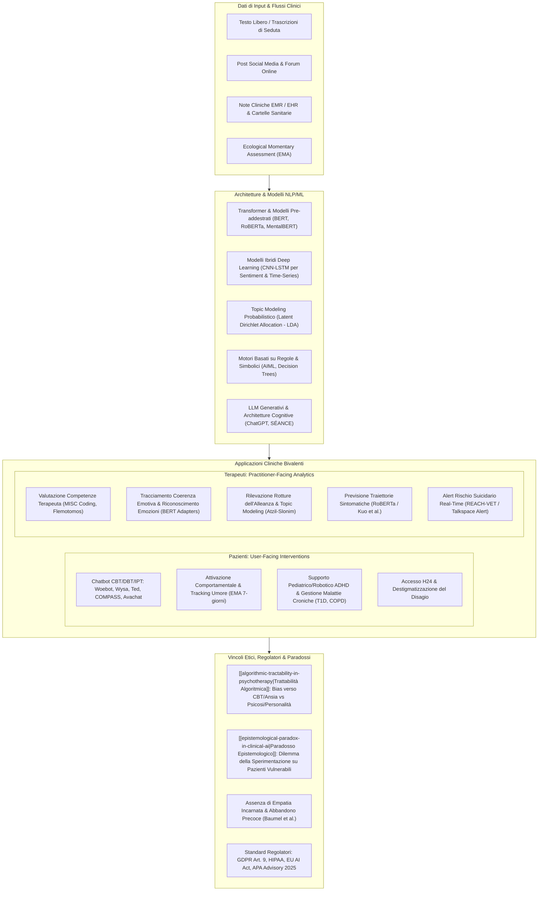
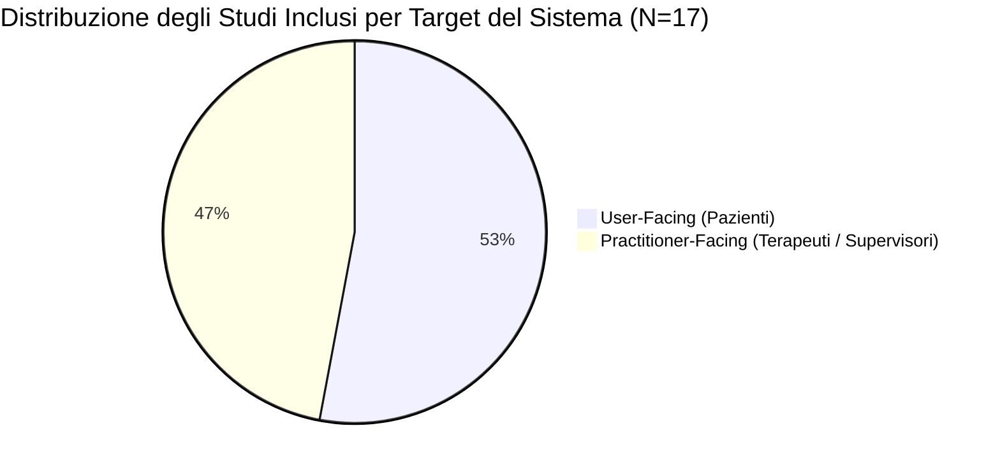
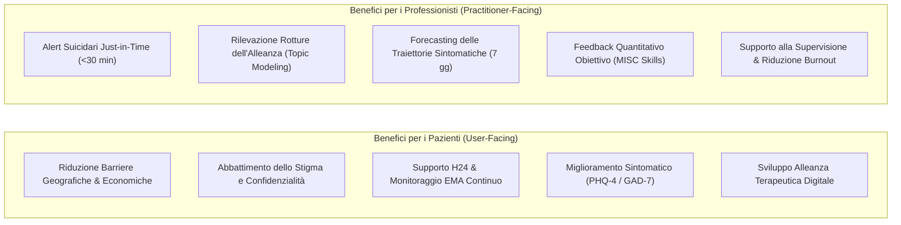

# The Role of Artificial Intelligence in Clinical Psychology: How AI and NLP Systems Are Reshaping Psychological Interventions (Orrù & Mannarini, 2026)

## Definizione Operativa
- **Revisione sistematica** condotta secondo le linee guida **PRISMA** e pubblicata su *Clinical Psychology & Psychotherapy* (Wiley, 2026) da Luisa Orrù e Stefania Mannarini (Dipartimento FiSPPA e Centro CIRF, Università degli Studi di Padova; DOI: [10.1002/cpp.70242](https://doi.org/10.1002/cpp.70242)).
- **Oggetto e Ambito:** Esamina in modo rigoroso 17 studi empirici peer-reviewed (selezionati tra 883 record estratti da *PsycNet*, *Web of Science* e *Scopus* per il periodo 2019–2024, dall'avvento dell'architettura Transformer/BERT e GPT) focalizzati sull'applicazione dell'Elaborazione del Linguaggio Naturale ([[large-language-models|NLP]]) e del Machine Learning (ML) nella psicologia clinica e negli interventi digitali di salute mentale (*Digital Mental Health Interventions* - DMHIs).
- **Inquadramento Clinico e CBT:** Struttura una tassonomia analitica basata su:
  1. *Target del sistema:* Sistemi orientati ai pazienti (*user-facing / direct support*) vs sistemi per i clinici (*practitioner-facing / backend analytics, supervisione e decision support*);
  2. *Tipo di intervento:* Supportivo (*adjunctive care / complement*) vs Sostitutivo (*substitutional / autonomous delivery*);
  3. *Inquadramento diagnostico:* Disturbi puramente psicologici (Depressione, Ansia, PTSD, Suicidarietà, Schizofrenia, Fobie, SAD) vs Disturbi psicologici su base medica/organica (Diabete Tipo 1 [T1D], Broncopneumopatia Cronica Ostruttiva [COPD], ADHD pediatrico);
  4. *Modelli psicoterapeutici di riferimento:* Terapia Cognitivo-Comportamentale (CBT, predominante), Dialectical Behaviour Therapy (DBT), Terapia Interpersonale (IPT), Attivazione Comportamentale (BA), Self-Compassion, Teoria della Mente e Psicoterapia Psicodinamica Breve.
- **Contributi Chiave e Frontiere Critiche:** Evidenzia come l'NLP consenta l'estrazione automatizzata di pattern linguistici dai trascritti di seduta per valutare la coerenza emotiva, monitorare le rotture dell'alleanza, predire le traiettorie sintomatiche ed erogare alert sul rischio suicidario *just-in-time*. Formalizza due sfide epistemologico-cliniche cruciali: il **[[algorithmic-tractability-in-psychotherapy|bias di trattabilità algoritmica]]** (iper-concentrazione su condizioni altamente manualizzate come ansia e depressione rispetto a quadri complessi e di personalità) e il **[[epistemological-paradox-in-clinical-ai|paradosso epistemologico dell'IA clinica]]** (necessità di testare modelli su popolazioni vulnerabili per validarne la sicurezza, rischiando al contempo danni iatrogeni). Integra infine le raccomandazioni dell'**APA Health Advisory 2025** e una dettagliata comparazione regolatoria internazionale (GDPR, HIPAA, UK DPA, PIPEDA, Privacy Act australiano, WHO/ISO 27799).

---

## Evidenze dalla Letteratura

### 1. Metodologia di Revisione Sistematica (PRISMA) e Selezione degli Studi
- **Protocollo e Banche Dati:** Ricerca sistematica condotta secondo le linee guida **PRISMA** sui database internazionali *PsycNet*, *Web of Science* e *Scopus*, conclusa l'8 aprile 2025.
- **Finestra Temporale e Rationale (2019–2024):** La selezione dal 2019 è motivata dallo spartiacque tecnologico del 2018 (introduzione dell'architettura *Transformer* con BERT e dei primi modelli OpenAI GPT), che ha rivoluzionato il Natural Language Processing (NLP) e il Natural Language Generation (NLG).
- **Flusso dei Record:**
  - *Identificazione:* 1.832 record identificati $\rightarrow$ 883 dopo rimozione automatica dei duplicati;
  - *Screening Titolo/Abstract:* 883 record esaminati da 2 revisori indipendenti (con terzo revisore per arbitraggio) $\rightarrow$ 165 paper selezionati;
  - *Filtro Specialistico NLP/Testo:* Restringimento esclusivo agli studi focalizzati su analisi testuale e conversazioni cliniche $\rightarrow$ 34 paper valutati in esteso;
  - *Inclusione Finale:* **17 studi empirici inclusi**, con esclusione di studi puramente teorici, non incentrati su condizioni psicologiche umane o privi di dati applicativi/metriche di impatto clinico.

---

### 2. Tassonomia dei Sistemi: Target, Intervento e Cornici Teoriche

Dall'analisi sistematica emerge una netta biforcazione tra sistemi orientati all'utente finale e piattaforme analitiche per il clinico:

1. **Main Target (Pazienti vs Terapeuti):**
   - *Patient-Targeted (53%, 9/17):* Agenti conversazionali autonomi, app mobili di supporto, chatbot per la gestione di patologie fisiche croniche con distress associato, assistenti robotici.
   - *Therapist-Targeted (47%, 8/17):* Algoritmi di NLP per la codifica automatizzata delle sedute, predittori di outcome, sistemi di allerta suicidaria e dashboard di supervisione.
2. **Type of Intervention (Supportivo vs Sostitutivo):**
   - *Supportive (88%, 15/17):* Sistemi progettati come adiuvanti (*adjunctive tools*) per integrare e potenziare il trattamento umano standard o per fornire monitoraggio inter-seduta.
   - *Substitutional (12%, 2/17):* Sistemi concepiti come interventi standalone a basso costo per superare lo stigma e il treatment gap (es. *Ted the therapist*, *AIML chatbot psychologist*).
3. **Modelli Teorici di Riferimento:**
   - Dominanza netta degli approcci cognitivo-comportamentali (*Cognitive-Behavioural Therapy - CBT*), seguiti da *Behavioural Activation (BA)*, *Dialectical Behaviour Therapy (DBT)*, *Interpersonal Psychotherapy (IPT)* e protocolli di *Self-Compassion*. Marginali le applicazioni basate su *Theory of Mind* o modelli psicodinamici brevi.

---

### 3. Matrice Completa dei 17 Studi Inclusi

| Autori & Anno | Sistema / Architettura AI | Main Target | Tipo Intervento | Condizione Clinica & Campione | Risultati Chiave & Metriche Cliniche |
| :--- | :--- | :--- | :--- | :--- | :--- |
| **Chiauzzi et al. (2024)** | **Woebot (W-MA-02)**: Agente relazionale NLP con contenuti CBT, IPT e DBT | Pazienti | Sostitutivo / Standalone | Depressione e Ansia ($N=256$, di cui 111 con depressione e 107 con ansia clinica baseline) | Riduzione statisticamente significativa dei sintomi depressivi e ansiosi dopo 8 settimane d'uso; alta compliance. |
| **Kolenik, Schiepek & Gams (2024)** | **Computational Psychotherapy System**: Architettura cognitiva con simulazione Theory of Mind + LLM | Pazienti / Terapeuti | Supportivo | Stress, Ansia e Depressione (SAD) in popolazione non clinica con barriere d'accesso | Generazione di messaggi motivazionali personalizzati sui tratti di personalità; **predizione di episodi depressivi con 7 giorni di anticipo**. |
| **Berrezueta-Guzman et al. (2023/2024)** | **Custom ChatGPT + Assistente Robotico**: Interfaccia di supporto per compiti a casa | Pazienti (Pediatrici) / Terapeuti | Supportivo | ADHD infantile ($N=10$ terapeuti esperti in ADHD) | Valutazione positiva su 3 dimensioni: insight sullo stato emotivo, risposte personalizzate ed efficacia come strumento terapeutico gamificato. |
| **Boggiss et al. (2023)** | **COMPASS**: Chatbot basato su alberi decisionali + NLP per estrazione emozioni e rischio | Pazienti | Supportivo | Diabete di Tipo 1 (T1D) con distress ($N=15-20$ adolescenti 12-16 anni, 10-15 professionisti) | Erogazione di 14 lezioni quotidiane in 2 settimane; incremento significativo delle abilità di coping e self-compassion durante COVID-19. |
| **Omarov et al. (2023)** | **AIML Mobile Chatbot Psychologist**: Riconoscimento dello stato emotivo e moduli CBT | Pazienti | Sostitutivo | Ansia, Depressione, Stress e Fobie | Interazioni contestualmente appropriate; riduzione del carico di lavoro per i servizi territoriali; alta accessibilità mobile. |
| **Beatty et al. (2022)** | **Wysa**: Conversational agent a testo libero con tecniche CBT e monitoraggio emotivo | Pazienti | Sostitutivo / Standalone | Ansia e Depressione ($N=1.205$ utenti positivi allo screening PHQ-4) | Dimostrazione di una solida **alleanza terapeutica digitale** percepita; la frequenza di utilizzo correla direttamente con il miglioramento sintomatico. |
| **Pandey, Sharma & Wazir (2022)** | **‘Ted’ the Therapist**: Chatbot web basato su Deep Learning (lemmatizzazione, intent extraction) | Pazienti | Sostitutivo | Quadro misto: Ideazione Suicidaria, Ansia, Depressione | Abbattimento dello stigma percepito rispetto al colloquio vis-à-vis; supporto immediato e confidenziale h24. |
| **Rathnayaka et al. (2022)** | **BA Chatbot**: Moduli NLP per feature extraction, intent recognition e selezione risposte | Pazienti / Terapeuti | Supportivo | Ansia e Depressione | **Ecological Momentary Assessment (EMA)**: calcolo del mood score (0-10) su finestra mobile di 7 giorni; pianificazione personalizzata di attività gratificanti. |
| **Easton et al. (2019)** | **Avachat (Persona 'Ava')**: Agente virtuale autonomo audio-visivo per self-management | Pazienti | Supportivo | Broncopneumopatia Cronica Ostruttiva (COPD) con Ansia, Depressione e Attacchi di Panico ($N=20$) | Riduzione di ansia e stress superiore ai comparatori standard; forte valorizzazione del supporto empatico e della triangolazione clinica. |
| **Atzil-Slonim et al. (2024)** | **BERT Emotion Adapters**: Modelli linguistici per etichettatura automatica delle emozioni utterance-level | Terapeuti | Supportivo | 872 sedute trascritte da 68 pazienti (diagnosi comorbili: ansia 25.7%, disturbi affettivi, ecc.) | Misurazione oggettiva della **coerenza emotiva** in seduta; consente ai clinici di calibrare le risposte e cogliere micro-espressioni positive sottili. |
| **Kuo et al. (2024)** | **RoBERTa Sentence Embeddings**: Modello NLP predittivo delle valutazioni sintomatiche del paziente | Terapeuti | Supportivo | Campione clinico ampio (Ansia 69.7%, Depressione 63.3%, Bassa Autostima 41%, Solitudine 36.4%) | **Predizione dell'outcome della seduta successiva** a partire dai trascritti della seduta precedente; integrazione nei sistemi di monitoraggio della cura. |
| **Xin & Zakaria (2024)** | **BERT + CNN + BiLSTM (XAI)**: Tre modelli di rilevazione della depressione confrontati con MentalBERT | Terapeuti / Ricercatori | Supportivo | Depressione su testi da social media | Elevata accuratezza diagnostica; interfaccia **Explainable AI (XAI)** che evidenzia con mappe di colore e intensità l'importanza semantica delle parole. |
| **Flemotomos et al. (2022)** | **Automated Speech & Language Evaluation**: Piattaforma di trascrizione e behavioural coding | Terapeuti / Supervisori | Supportivo | Trascrizioni di sedute per abuso di alcol e polidipendenze | Predizione automatica dei codici **MISC** (*Motivational Interviewing Skill Code*): ratio domande/riflessioni, ratio tempo di parola paziente/terapeuta, punteggio empatia. |
| **Kour & Gupta (2022)** | **Hybrid CNN-LSTM Deep Learning**: Sentiment analysis multivariata su testi Twitter | Terapeuti / Ricercatori | Sostitutivo / Screening | Depressione e Rischio Suicidario | Estrazione di feature sintattico-semantiche profonde superando i problemi di *vanishing/exploding gradient* grazie alle celle LSTM. |
| **Atzil-Slonim et al. (2021)** | **Topic Modeling (LDA)**: Clustering bayesiano di co-occorrenza lessicale nei trascritti di seduta | Terapeuti | Supportivo | 873 sedute trascritte da 58 pazienti in psicoterapia individuale | Identificazione oggettiva dei cluster tematici associati a **rotture dell'alleanza terapeutica (*alliance ruptures*)** o deterioramento clinico. |
| **Bantilan et al. (2021)** | **Just-in-Time Crisis Alert System**: Modello NLP su 1.864 diadi paziente-terapeuta (Talkspace) | Terapeuti | Supportivo | Rischio Suicidario (fattori di rischio, ideazione, metodi, piani) | **Scoring automatico ogni 30 minuti** dei messaggi del paziente; alert real-time al clinico di telemedicina per l'erogazione tempestiva di protocolli di crisi. |
| **Levis et al. (2021)** | **REACH-VET + SÉANCE NLP**: Integrazione di feature linguistiche estratte da note cliniche libere EMR | Terapeuti | Supportivo | Coorte di veterani con diagnosi di PTSD ad alto rischio suicidario | L'inclusione di variabili NLP estratte dal testo non strutturato **incrementa significativamente l'accuratezza predittiva del decesso per suicidio**. |

---

### 4. Sistemi User-Facing vs Practitioner-Facing: Evidenze di Efficacia

#### A. Impatto sui Pazienti (User-Facing)
- **Accessibilità e Continuità:** Consentono l'erogazione di interventi immediati a costi marginali nulli, raggiungendo popolazioni isolate o prive di copertura sanitaria (Naslund et al., 2020; Gual-Montolio et al., 2022).
- **Abbattimento dello Stigma:** Giovani adulti e adolescenti mostrano la massima accettazione dei DMHI (Rideout et al., 2018), preferendo l'interazione con agenti conversazionali per esplorare pensieri intimi senza il timore del giudizio sociale (Grist et al., 2019; Pandey et al., 2022).
- **Alleanza Terapeutica Digitale:** Studi come quello di Beatty et al. (2022) su *Wysa* smentiscono l'assunto che non possa crearsi un legame funzionale tra utente e agente software, dimostrando che la qualità dell'alleanza percepita correla positivamente con il miglioramento clinico.

#### B. Impatto sui Professionisti (Practitioner-Facing)
- **Mitigazione del Rischio e Crisis Management:** I sistemi di Bantilan et al. (2021) e Levis et al. (2021) dimostrano che l'NLP può fungere da rete di sicurezza per i servizi di telepsicoterapia, analizzando il flusso continuo dei messaggi e allertando il clinico in caso di escalation del rischio suicidario.
- **Supervisione Obiettiva e Formazione:** La piattaforma di Flemotomos et al. (2022) automatizza la codifica MISC, fornendo metriche puntuali (es. rapporto riflessioni/domande, aderenza al colloquio motivazionale) che riducono i tempi e i costi della supervisione clinica tradizionale.
- **Process Research Aumentata:** L'analisi automatica della coerenza emotiva (Atzil-Slonim et al., 2024) e dei temi di seduta (Atzil-Slonim et al., 2021) permette di superare la memoria retrospettiva soggettiva del terapeuta, evidenziando dinamiche relazionali invisibili a livello macro.

---

### 5. Limiti Metodologici e Criticità Cliniche Emerse

Nonostante i risultati promettenti, la review evidenzia profonde criticità metodologiche ed etiche nella letteratura:

1. **Assenza di Validazione Scientifica Rigorosa:** Meno del **5% delle app di salute mentale** disponibili negli store commerciali dispone di validazione empirica formale (Leigh & Flatt, 2015).
2. **Carenza di Gruppi di Controllo Attivi:** Molti studi (es. Chiauzzi et al., 2024) non utilizzano disegni randomizzati controllati con braccio di controllo attivo o placebo digitale, rendendo impossibile distinguere l'effetto intrinseco dell'algoritmo da fattori aspecifici (aspettative, decorso naturale del tempo, motivazione spontanea; Andersson et al., 2019).
3. **Mancanza di Efficacia Clinica Significativa in Alcuni Trial:** Studi controllati (Ogawa et al., 2022; Kolenik & Gams, 2021) non hanno riscontrato riduzioni statisticamente significative dei sintomi post-interazione con chatbot, indicando l'immaturità di molti applicativi attuali.
4. **Bias Demografici, Razziali e Culturali:** Gli algoritmi NLP addestrati prevalentemente su campioni anglofoni e caucasici (WEIRD) falliscono nel riconoscere marcatori depressivi in minoranze etniche (Mehrabi et al., 2021; Rai et al., 2024; Moudden et al., 2025), producendo tassi elevati di falsi negativi e falsi positivi (Haghish & Czajkowski, 2024).
5. **Assenza di Decodifica Non-Verbale e Abbandono Precoce:** L'incapacità dell'NLP di elaborare il comportamento paraverbale, la prosodia, le espressioni micro-facciali e la risonanza corporea compromette l'efficacia a lungo termine, determinando tassi di abbandono (*attrition*) marcatamente superiori rispetto alla terapia umana (Baumel et al., 2019; Bickmore & Picard, 2005).

---

### 6. Confronto Regolatorio Internazionale per i Clinici (Tabella 3)

La review sintetizza i principali quadri normativi regionali relativi alla gestione dei dati sensibili di salute mentale generati da sistemi di IA:

| Regione / Quadro | Principi Chiave | Raccomandazioni Pratiche per il Clinico | Formula di Consenso Raccomandata | Checklist di Sicurezza Dati |
| :--- | :--- | :--- | :--- | :--- |
| **Unione Europea (GDPR)** | Basi di liceità (Art. 6); Categorie particolari di dati: salute e genetica (Art. 9); Diritto di accesso, rettifica e cancellazione; Minimizzazione dei dati. | Assicurarsi che i pazienti comprendano l'uso dei dati; consenso esplicito e informato con opzione di revoca; utilizzo di cartelle EMR certificate GDPR. | *"Acconsento alla raccolta, conservazione e utilizzo dei miei dati sanitari per la mia cura clinica e per le ricerche correlate."* | - Pseudonimizzazione / anonimizzazione; - Crittografia a riposo e in transito; - Controlli d'accesso basati sui ruoli (RBAC); - Audit logging continuo. |
| **Stati Uniti (HIPAA)** | Protected Health Information (PHI); Privacy Rule: diritto del paziente ad accedere/correggere PHI; Security Rule: tutele fisiche, tecniche e amministrative. | Fornire informativa sulla privacy; acquisire consenso per uso e divulgazione PHI per trattamento/fatturazione; formazione obbligatoria del personale. | *"Autorizzo l'uso e la divulgazione delle mie informazioni sanitarie come descritto nell'informativa per trattamento, pagamento e operazioni."* | - Crittografia obbligatoria dei PHI; - Accesso limitato al minimo necessario; - Risk assessment periodici; - Backup sicuri e disaster recovery. |
| **Regno Unito (NHS & DPA 2018)** | Allineato al GDPR; Principi di Caldicott per la confidenzialità; consenso esplicito per dati sensibili. | Seguire le raccomandazioni del Caldicott Guardian; documentare il consenso in cartella; usare moduli di consenso in linguaggio chiaro. | *Consenso integrato secondo standard Caldicott.* | - Sistemi NHS protetti; - RBAC e audit trail; - Accordi formali di data sharing per ricerca. |
| **Canada (PIPEDA & Leggi Prov.)** | Personal Information Protection and Electronic Documents Act; regolamentazioni sanitarie provinciali diversificate. | Rispettare le normative provinciali; ottenere consenso significativo (*meaningful consent*); verificare la conformità nei trasferimenti dati transfrontalieri. | *"Acconsento alla raccolta, uso e divulgazione delle mie informazioni sanitarie per la mia cura e come richiesto dalla legge."* | - Restrizioni d'accesso rigorose; - Audit trail verificabili; - Sistemi elettronici protetti. |
| **Australia (Privacy Act 1988)** | Australian Privacy Principles (APPs); regole speciali per i dati sanitari e cartella *My Health Record*. | Verificare il consenso prima della condivisione dati; registri di audit accurati; consenso esplicito per upload su My Health Record. | *"Acconsento all'inclusione delle mie informazioni sanitarie in My Health Record e alla condivisione con i curanti coinvolti."* | - Protezione sistemi My Health Record; - Autenticazione a più fattori (MFA); - Formazione privacy del personale. |
| **Standard Globali (WHO & ISO 27799)** | Riservatezza e sicurezza dei dati per la cura e la ricerca etica; linee guida per l'information security management in sanità. | Integrazione con le policy EHR istituzionali; uso di consenso informato chiaro e documentato digitalmente o cartaceo. | *Modelli conformi a linee guida OMS.* | - Valutazione continua del rischio; - Crittografia end-to-end; - Piano di incident response documentato. |

---

### 7. Le 4 Raccomandazioni dell'APA Health Advisory 2025

Orrù & Mannarini evidenziano la perfetta convergenza delle loro evidenze con l'**Advisory 2025 dell'American Psychological Association (APA)**:

1. **Non affidare la psicoterapia autonoma alla GenAI:** I chatbot generativi non devono essere impiegati in sostituzione del terapeuta qualificato, ma esclusivamente come supporto supervisionato, per prevenire allucinazioni diagnostiche, disinformazione ed escalation incontrollata.
2. **Protezione da Bias, Disinformazione ed Efficacia Illusoria:** Educare utenti e professionisti sulla tendenza strutturale dei modelli alla compiacenza seduttiva (*[[sycophantic-mirroring|sycophancy]]*), che valida acriticamente le convinzioni del paziente compromettendo il reality testing.
3. **Salvaguardie Specifiche per Popolazioni Vulnerabili:** Monitorare rigorosamente l'uso di chatbot da parte di adolescenti, soggetti isolati o con diagnosi psichiatriche conclamate, in cui l'IA può fungere da potente amplificatore di deliri (*[[ai-psychosis|AI psychosis]]*) o dipendenza relazionale (*[[artificial-intimacy|artificial intimacy]]*).
4. **Alfabetizzazione Digitale e Formazione Specialistica (AI Literacy):** Implementare percorsi formativi obbligatori per i clinici sui meccanismi algoritmici, le trappole dell'*automation bias* e i limiti tecnici dell'elaborazione del linguaggio naturale.

---

## Riferimenti Bibliografici
- Orrù, L., & Mannarini, S. (2026). The Role of Artificial Intelligence in Clinical Psychology: How AI and NLP Systems Are Reshaping Psychological Interventions. A Systematic Review. *Clinical Psychology & Psychotherapy*, 33, e70242. https://doi.org/10.1002/cpp.70242
- Andersson, G., Carlbring, P., Titov, N., & Lindefors, N. (2019). Internet interventions for adults With Anxiety and Mood Disorders: A Narrative Umbrella Review. *Canadian Journal of Psychiatry*, 64(7), 465–470.
- APA. (2025). *APA Health Advisory on the Use of Generative AI Chatbots and Wellness Applications for Mental Health*. American Psychological Association.
- Atzil-Slonim, D., Eliassaf, A., Warikoo, N., et al. (2024). Leveraging natural language processing to study emotional coherence in psychotherapy. *Psychotherapy*, 61(1), 82–92.
- Atzil-Slonim, D., Juravski, D., Bar-Kalifa, E., et al. (2021). Using topic models to identify clients' functioning levels and alliance ruptures in psychotherapy. *Psychotherapy*, 58(2), 324–339.
- Bantilan, N., Malgaroli, M., Ray, B., & Hull, T. D. (2021). Just in time crisis response: Suicide alert system for telemedicine psychotherapy settings. *Psychotherapy Research*, 31(3), 289–299.
- Baumel, A., Muench, F., Edan, S., & Kane, J. (2019). Benchmarks of real-world objective user engagement with mental health apps. *JMIR mHealth and uHealth*, 7(9), e15830.
- Beatty, C., Malik, T., Meheli, S., & Sinha, C. (2022). Evaluating the therapeutic alliance with a free-text CBT conversational agent (Wysa): A mixed-methods study. *Frontiers in Digital Health*, 4, 847991.
- Berrezueta-Guzman, S., Kandil, M., Martín-Ruiz, M. L., Pau de la Cruz, I., & Krusche, S. (2024). Future of ADHD care: Evaluating the efficacy of ChatGPT in therapy enhancement. *Healthcare*, 12(6), 683.
- Bickmore, T. W., & Picard, R. W. (2005). Establishing and maintaining long-term human-computer relationships. *ACM TOCHI*, 12(2), 293–327.
- Boggiss, A., Consedine, N., Hopkins, S., et al. (2023). Improving the well-being of adolescents with Type 1 Diabetes: Acceptability of a self-compassion chatbot. *JMIR Diabetes*, 8(1), e40641.
- Chiauzzi, E., Williams, A., Mariano, T. Y., et al. (2024). Demographic and clinical characteristics associated with symptom outcomes in users of a digital mental health intervention incorporating a relational agent. *BMC Psychiatry*, 24(1), 79.
- Easton, K., Potter, S., Bec, R., et al. (2019). A virtual agent to support individuals living with physical and mental comorbidities: Co-design and acceptability testing. *JMIR*, 21(5), e12996.
- Flemotomos, N., Martinez, V. R., Chen, Z., et al. (2022). Automated evaluation of psychotherapy skills using speech and language technologies. *Behavior Research Methods*, 54(2), 690–711.
- Grist, R., Croker, A., Denne, M., & Stallard, P. (2019). Technology delivered interventions for depression and anxiety in children and adolescents: Systematic review and meta-analysis. *Clinical Child and Family Psychology Review*, 22(2), 147–171.
- Gual-Montolio, P., Jaén, I., Martínez-Borba, V., et al. (2022). Using artificial intelligence to enhance ongoing psychological interventions in real- or close to real-time: Systematic review. *IJERPH*, 19(13), 7737.
- Haghish, E. F., & Czajkowski, N. (2024). Reconsidering false positives in machine learning binary classification models of suicidal behavior. *Current Psychology*, 43(11), 10117–10121.
- Kazdin, A. E., & Rabbitt, S. M. (2013). Novel models for delivering mental health services. *Clinical Psychological Science*, 1(2), 170–191.
- Kolenik, T., Schiepek, G., & Gams, M. (2024). Computational psychotherapy system for mental health prediction and behavior change with a conversational agent. *Neuropsychiatric Disease and Treatment*, 20, 2465–2498.
- Kour, H., & Gupta, M. K. (2022). Predicting the language of depression from multivariate Twitter data using a feature-rich hybrid deep learning model. *Concurrency and Computation*, 34(24), e7224.
- Kuo, P. B., Tanana, M. J., Goldberg, S. B., et al. (2024). Machine-learning-based prediction of client distress from session recordings. *Clinical Psychological Science*, 12(3), 435–446.
- Leigh, S., & Flatt, S. (2015). App-based psychological interventions: Friend or foe? *Evidence-Based Mental Health*, 18(4), 97–99.
- Levis, M., Westgate, C. L., Gui, J., Watts, B. V., & Shiner, B. (2021). Natural language processing of clinical mental health notes may add predictive value to existing suicide risk models. *Psychological Medicine*, 51(8), 1382–1391.
- Mehrabi, N., Morstatter, F., Saxena, N., Lerman, K., & Galstyan, A. (2021). A survey on bias and fairness in machine learning. *ACM Computing Surveys*, 54(6), 115.
- Mittelstadt, B. (2019). Principles alone cannot guarantee ethical AI. *Nature Machine Intelligence*, 1(11), 501–507.
- Morley, J., Floridi, L., Kinsey, L., & Elhalal, A. (2020). From what to how: An initial review of publicly available AI ethics tools. *Science and Engineering Ethics*, 26(4), 2141–2168.
- Moudden, I. E., Bittner, M. C., Karpov, M. V., et al. (2025). Predicting mental health disparities using machine learning. *Scientific Reports*, 15(1), 5900.
- Naslund, J. A., Bondre, A., Torous, J., & Aschbrenner, K. A. (2020). Social media and mental health: Benefits, risks, and opportunities for research and practice. *Journal of Technology in Behavioral Science*, 5(3), 245–257.
- Omarov, B., Zhumanov, Z., Gumar, A., & Kuntunova, L. (2023). Artificial intelligence enabled mobile chatbot psychologist using AIML and cognitive behavioral therapy. *IJACSA*, 14(6), 616.
- Pandey, S., Sharma, S., & Wazir, S. (2022). Mental healthcare chatbot based on natural language processing and deep learning approaches: Ted the therapist. *Int. J. Inf. Technol.*, 14(7), 3757–3766.
- Rai, S., Stade, E. C., Giorgi, S., et al. (2024). Key language markers of depression on social media depend on race. *PNAS*, 121(14), e2319837121.
- Rathnayaka, P., Mills, N., Burnett, D., De Silva, D., Alahakoon, D., & Gray, R. (2022). A mental health chatbot with cognitive skills for personalised behavioural activation and remote health monitoring. *Sensors*, 22(10), 3653.
- Topaz, M., & Pruinelli, L. (2017). Big data and nursing: Implications for the future. *Studies in Health Technology and Informatics*, 232, 165–171.
- Xin, C., & Zakaria, L. Q. (2024). Integrating BERT with CNN and BiLSTM for explainable detection of depression in social media contents. *IEEE Access*, 12, 161203–161212.

---

## Relazioni
- [[algorithmic-tractability-in-psychotherapy]]: Analisi approfondita del bias di trattabilità algoritmica verso condizioni e protocolli strutturati (CBT per ansia/depressione) rispetto a disturbi complessi.
- [[epistemological-paradox-in-clinical-ai]]: Inquadramento del paradosso etico-metodologico tra necessità di testing su pazienti vulnerabili e tutela dal danno iatrogeno.
- [[behavsci-16-00676]]: Revisione critica di Neacșu (2026) su infrastrutture emotive, intimità artificiale e psicosi da IA.
- [[ai-v5-e84305]]: Systematic review di Kandeel et al. (2026) su prospettive legali, GDPR, HIPAA ed EU AI Act in salute mentale.
- [[ai_v5i1e80348]]: Systematic review di Cho et al. (2026) su agenti conversazionali, metodologie di valutazione e divario di prontezza clinica.
- [[11920_2026_Article_1690]]: Revisione di Cavalera et al. (2026) sui potenziali clinici e rischi relazionali della GenAI.
- [[digital-therapeutic-alliance]]: Costrutto e validazione dell'alleanza di lavoro tra paziente e agente software.
- [[clinical-fidelity-assessment]]: Metodologie NLP per il tracciamento e la valutazione dell'aderenza ai protocolli terapeutici.
- [[modello-centauro-clinico]]: Paradigma di cooperazione Human-in-the-Loop tra psicoterapeuta e sistemi di intelligenza artificiale.
- [[supervisione-clinica-ai]]: Applicazione di modelli linguistici e speech technologies per l'analisi delle competenze e la supervisione dei terapeuti in formazione.
