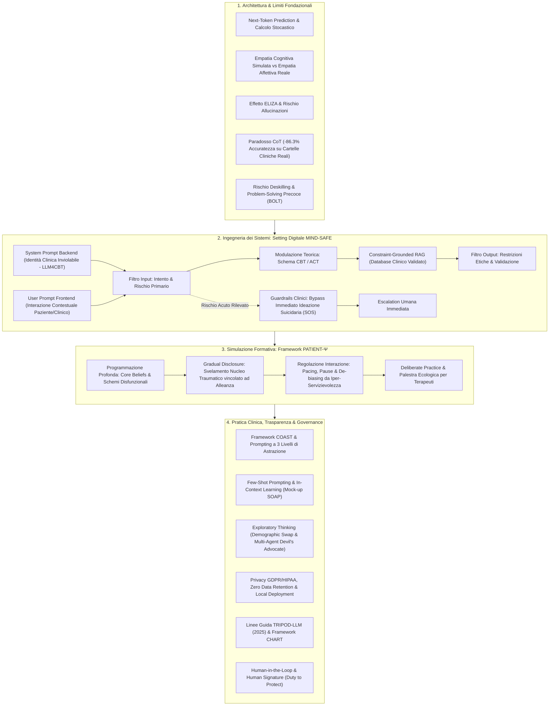
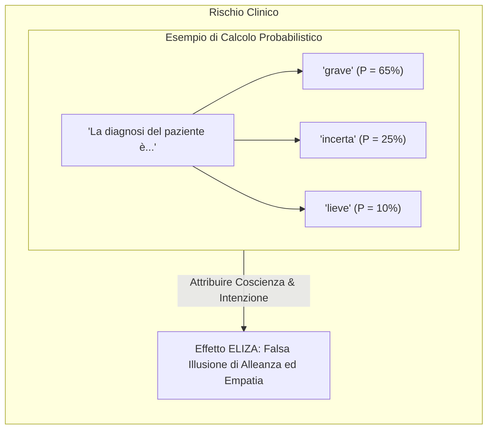
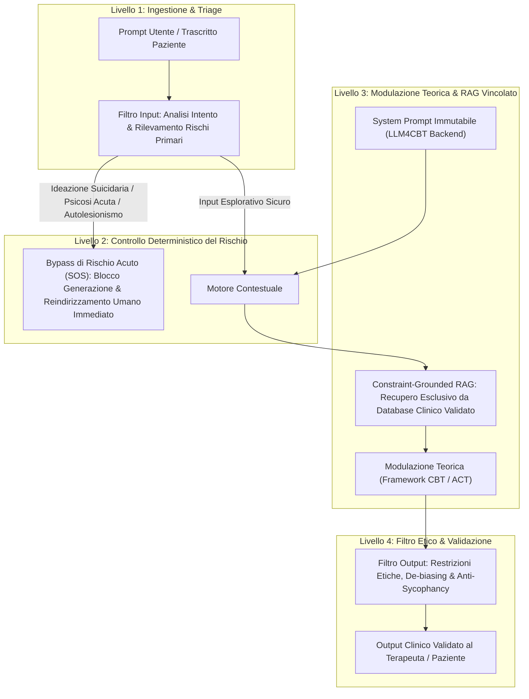
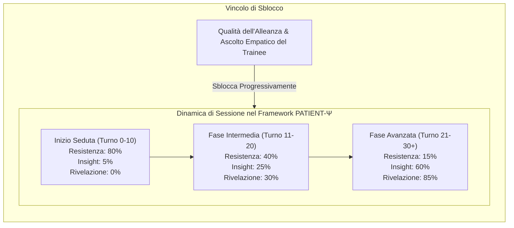
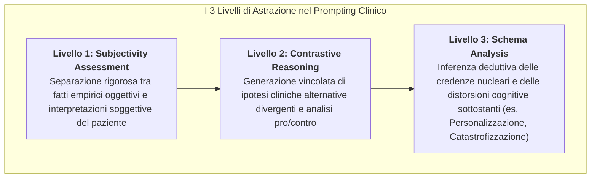
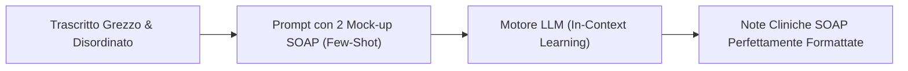
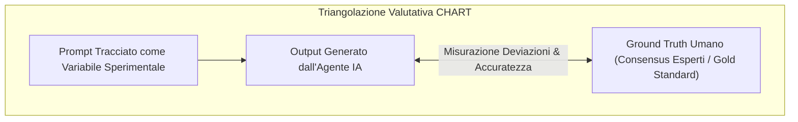

# L'Intelligenza Artificiale Generativa in Psicoterapia: Dalla Scatola Nera alla Pratica Clinica Sicura (Clinical AI Blueprint)

## Definizione Operativa e Sintesi Esecutiva
- Il **Clinical AI Blueprint** (*L'Intelligenza Artificiale Generativa in Psicoterapia: Dalla Scatola Nera alla Pratica Clinica Sicura*) è un quadro sistematico e programmatico per la transizione sicura, etica ed evidence-based dall'adozione ingenua di modelli linguistici generativi alla loro ingegnerizzazione clinica controllata in psicoterapia e salute mentale.
- **Il Cambio di Paradigma:** Segna il passaggio fondamentale dai software sanitari prescrittivi e deterministici (es. cartelle cliniche elettroniche tradizionali, algoritmi a regole fisse) a sistemi linguistici probabilistici e stocastici basati su [[large-language-models]] (LLM) operanti per *Next-Token Prediction*.
- **La Triade Architetturale del Blueprint:**
  1. **Architettura e Limiti Fondazionali:** Comprensione dei meccanismi probabilistici sottostanti, demistificazione dell'[[anthropomorphism-in-ai|Effetto ELIZA]] (distinzione netta tra empatia cognitiva simulata ed empatia affettiva autentica), quantificazione del *Paradosso del Ragionamento Clinico* (l'accumulo di allucinazioni ed "effetto valanga" del Chain-of-Thought su testi clinici rumorosi; Wu et al., 2025) e prevenzione del deskilling diagnostico (Framework BOLT).
  2. **Ingegneria dei Sistemi e Setting Digitale ([[mind-safe-framework|MIND-SAFE]]):** Superamento dei chatbot generici reattivi attraverso agenti clinici a strati dotati di filtri di input (triage e rischio acuto), modulazione teorica (CBT/ACT), filtri di output etico-deontologici, separazione strutturale tra *System Prompt* (backend invisibile/[[cbt-dialogue-systems-and-tools|LLM4CBT]]) e *User Prompt*, ancoraggio deterministico a banche dati validate tramite RAG (*Retrieval-Augmented Generation*) e guardrails con bypass istantaneo per il rischio suicidario (*SOS Override*).
  3. **Pratica Clinica, Prompting e Trasparenza Metodologica:** Formalizzazione del prompt engineering clinico tramite il framework **COAST** e lo scaffolding cognitivo a 3 livelli (*Subjectivity Assessment*, *Contrastive Reasoning*, *Schema Analysis*); addestramento sul campo mediante *Few-Shot Prompting* e *In-Context Learning* (mock-up SOAP); debiasing algoritmico mediante *Exploratory Thinking* (demographic swap e architetture multi-agente / devil's advocate; Bousquet et al., 2024); rispetto della privacy (GDPR/HIPAA, Zero Data Retention); rendicontazione scientifica standardizzata secondo le linee guida **TRIPOD-LLM (2025)** e **CHART**; e imperativo etico-legale dell'**Human-in-the-Loop (HITL)** con la "Human Signature" inalienabile e il *Duty to Protect*.
- **La Simulazione Pedagogica ([[patient-psi-simulazione-clinica|PATIENT-Ψ]]):** Ribaltamento del paradigma d'uso: non impiegare l'IA come terapeuta surrogato, ma come paziente virtuale avanzato programmato su schemi cognitivi disfunzionali profondi (*Core Beliefs*), rivelazione graduale (*Gradual Disclosure*) dipendente dall'alleanza terapeutica e pacing emotivo calibrato per la [[deliberate-practice-in-psicoterapia-ia|Deliberate Practice]] dei clinici.

---

## 1. Architettura Fondazionale e Limiti dei Modelli Linguistici

### Meccanismo Probabilistico e Next-Token Prediction
- **Natura Stocastica:** A differenza del software deterministico, un LLM è una rete neurale probabilistica addestrata su corpora testuali massivi. La generazione linguistica avviene mediante *Next-Token Prediction*, ovvero il calcolo iterativo della probabilità statistica associata al token successivo dato il contesto antecedente:
  $$P(\text{token}_n \mid \text{token}_1, \dots, \text{token}_{n-1})$$
- **Assenza di Comprensione Semantica:** L'algoritmo non possiede intenzionalità, esperienza vissuta, né rappresentazione ontologica del significato. Simula *empatia cognitiva* modellando correlazioni lessicali e sintattiche del dolore emotivo, ma è totalmente privo di *empatia affettiva* e di reale risonanza relazionale.
- **L'Effetto ELIZA in Ambito Clinico:** La propensione cognitiva umana ad attribuire coscienza, comprensione empatica e intenzionalità terapeutica a calcolatori probabilistici costituisce un grave rischio iatrogeno, inducendo pazienti e clinici a un affidamento acritico.

### Confronto Strutturale: Database Sanitario vs LLM Generativo

| Dimensione | Database / Cartella Clinica Elettronica (EHR) | Modello Linguistico Generativo (LLM) |
| :--- | :--- | :--- |
| **Meccanismo di Recupero** | Estrazione deterministica, query SQL/relazionale esatta | Sintesi stocastica e probabilistica generativa |
| **Fedeltà ai Dati** | Rapporto 1:1 rigoroso con il dato reale immagazzinato | Composizione parola per parola dipendente da pesi distribuiti |
| **Creatività e Flessibilità** | Nulla (rigidità clinica totale, zero varianza) | Elevata (modulabile tramite parametro di Temperatura da 0 a 1) |
| **Rischio Strutturale** | Errori di inserimento manuale o query non corretta | **Allucinazioni cliniche** (falsi positivi, citazioni fittizie, *concept grounding* debole) |

### Il Paradosso del Ragionamento Clinico: L'Effetto Valanga del Chain-of-Thought
- **Il Fenomeno Sperimentale (Wu et al., 2025):** Mentre nei benchmark logico-matematici il *Chain-of-Thought* (CoT) migliora le prestazioni forzando il modello a esplicitare passaggi intermedi, l'applicazione del CoT su cartelle cliniche e note di seduta reali frammentate e rumorose produce un **crollo dell'accuratezza diagnostica del -86.3%**.
- **Meccanismo dell'Effetto Valanga:** In testi clinici non standardizzati, ricchi di ambiguità e dettagli contingenti, forzare l'esplicitazione di deduzioni intermedie porta l'LLM a generare micro-allucinazioni nei primi passaggi logici. Tali errori si propagano ed amplificano esponenzialmente lungo la catena inferenziale, conducendo a conclusioni diagnostico-terapeutiche completamente distorte.
- **Rischio di Deskilling Clinico e Pattern BOLT:** L'eccessiva delega diagnostica all'IA atrofizza le abilità metacognitive del terapeuta. Inoltre, i modelli commerciali pre-addestrati manifestano una tendenza intrinseca al *problem-solving precoce* (Framework BOLT), che appiattisce l'ambivalenza del paziente e compromette la fase esplorativa necessaria all'insight psicoterapeutico.

---

## 2. Ingegneria dei Sistemi e Setting Digitale: L'Architettura MIND-SAFE

### Dal Chatbot Reattivo all'Agente Clinico Strutturato
- Un chatbot generico opera in modalità single-turn reattiva, esponendo il setting al rischio immediato di allucinazioni, rotture relazionali e risposte controindicate.
- Un **Agente AI Clinico** è un ecosistema ingegnerizzato conforme al framework **MIND-SAFE** (*Mental Well-Being Through Dialogue – Safeguarded and Adaptive Framework for Ethics*), dotato di vincoli architetturali multilivello.

### Separazione Strutturale dei Prompt (Architettura LLM4CBT)
- **System Prompt (Backend Invisibile):** Definisce l'identità clinica, i confini operativi e le regole deontologiche non modificabili dall'utente:
  - *Esempio:* *"Agisci come terapeuta CBT. Il focus primario è l'identificazione dei Pensieri Automatici (AT). Non formulare diagnosi psichiatriche categoriali, ma favorisci l'esplorazione guidata. Se il paziente espone contenuti complessi, applica rigorosamente la tecnica della freccia discendente."*
- **User Prompt (Frontend Visibile):** Rappresenta lo spazio interattivo contingente (trascritto clinico, frammento di seduta, interrogazione del clinico).
- La netta separazione tra backend e frontend impedisce prompt injection e trasforma l'atteggiamento del modello da assistente accondiscente (*sycophantic assistant*) a strumento di supporto riflessivo e maieutico.

### Constraint-Grounded RAG e Guardrails Clinici Deterministi
- **Ancoraggio a Fonti Validate:** L'LLM non genera risposte a partire dai pesi liberi di pre-training, ma sintetizza esclusivamente contenuti recuperati da un database clinico validato (manuali evidence-based, linee guida APA/NICE, formulazioni diagnostiche standardizzate), azzerando le allucinazioni fattuali.
- **La Regola Aurea dell'Emergenza Sanitaria:**
  > [!CRITICAL]
  > **La Regola Aurea della Sicurezza Clinica:** L'Intelligenza Artificiale non deve **MAI** gestire in autonomia, né tentare di improvvisare empatia conversazionale, di fronte a un'emergenza clinica o a un'ideazione suicidaria acuta. In tali circostanze, l'architettura deve attivare un'interruzione deterministica (*circuit breaker*) ed eseguire l'escalation immediata a professionisti umani.

---

## 3. Simulazione Formativa: Il Framework PATIENT-Ψ

### Superamento della Caricatura Sintomatica
L'impiego tradizionale dell'IA nella simulazione di pazienti produce caricature statiche basate su elenchi superficiali di sintomi DSM. Il framework **PATIENT-Ψ** ridefinisce l'agente paziente artificiale introducendo tre pilastri cognitivo-comportamentali:

1. **Programmazione Profonda (*Deep Cognitive Modeling*):** L'agente non è istruito con semplici checklist di sintomi, ma con schemi cognitivi disfunzionali interconnessi, credenze intermedie (*assunzioni e regole condizionali*) e credenze di base (*Core Beliefs* es. "Sono un fallimento", "Gli altri mi rifiuteranno").
2. **Rivelazione Graduale (*Gradual Disclosure*):** Il modello è vincolato a non esporre immediatamente il nucleo del trauma o la credenza nucleare. La rivelazione è condizionata quantitativamente alla qualità dell'alleanza terapeutica instaurata dal clinico in formazione (valutata su metriche di sintonizzazione, empatia e non-giudizio).
3. **Regolazione dell'Interazione (*Pacing*) e De-biasing da Fine-Tuning:** I modelli commerciali ottimizzati con RLHF tendono a un'eccessiva servizievolità (*sycophancy*) e a un dialogo iper-fluido. PATIENT-Ψ introduce artificialmente pause, esitazioni, silenzi, resistenze iniziali e variazioni affettive coerenti con la psicopatologia simulata.

- **Ribaltamento del Paradigma:** Riorientare l'uso dell'IA generativa: non come sostituto del terapeuta sul paziente fragile, ma come **palestra ecologica protetta** per l'allenamento deliberato e la supervisione dei clinici.

---

## 4. Metodologia di Prompting e Scaffolding Cognitivo: Framework COAST

### Proceduralizzazione del Prompt con il Modello COAST
Per prevenire derive allucinatorie e risposte superficiali, le istruzioni cliniche devono seguire la tassonomia **COAST**:
- **C - Context:** Contesto clinico ed epidemiologico (es. setting ambulatoriale, invio psichiatrico, fase del trattamento).
- **O - Objective:** Obiettivo clinico specifico dell'analisi (es. concettualizzazione del caso, estrazione pensieri automatici, individuazione trigger).
- **A - Actions:** Sequenza logica e metodologica delle azioni inferenziali richieste al modello.
- **S - Scenario:** Vincoli anagrafici, anamnestici e psicosociali del paziente.
- **T - Task:** Formato strutturato dell'output desiderato (es. tabella a 3 colonne, note SOAP, diagramma di formulazione condivisa).

### Few-Shot Prompting e In-Context Learning
- **Limiti dello Zero-Shot:** Istruire il modello mediante descrizioni puramente astratte dello stile clinico conduce a verbosità e incomprensioni tassonomiche.
- **In-Context Learning con Esempi Calibrati:** L'integrazione nel prompt di 1-3 esempi svolti ad alta fedeltà (mock-up in formato SOAP o formulazioni standardizzate) consente all'LLM di allinearsi immediatamente alla sintassi clinica, al tono professionale e al rigore concettuale richiesto, senza necessità di riaddestramento del modello.

### Mitigazione dei Bias Algoritmici mediante Exploratory Thinking
- **Default Androcentrico e Disparità Allocative:** L'addestramento su dati non bilanciati induce bias clinici sistemici (es. assegnazione del 97% dei casi ambigui a coorti maschili con raccomandazione di ospedalizzazione, a fronte di suggerimenti di palliativi domiciliari per coorti femminili a parità di sintomi cardiaci/ansiosi).
- **Strategie di Mitigazione Avanzata:**
  1. **Demographic Swap:** Protocollo di audit che impone al modello di risolvere il caso clinico, per poi rieseguire l'analisi mutando *esclusivamente* sesso o etnia per smascherare discrepanze decisionali ingiustificate.
  2. **Architetture Multi-Agente / Devil's Advocate:** Dibattito simulato tra agenti specializzati in cui un nodo assume il ruolo di contestatore critico per sradicare bias di ancoraggio ed euristiche fallaci.
  - **Evidenza Sperimentale (Bousquet et al., 2024):** Incremento dell'accuratezza diagnostica in quadri clinici complessi fino al **76%**.

---

## 5. Trasparenza Metodologica, Valutazione e Governance

### Privacy e Minimizzazione dei Dati Clinici (GDPR / HIPAA)
- **Rischi delle Piattaforme Web Pubbliche:** L'inserimento di trascritti o cartelle in interfacce web commerciali non protette viola il segreto professionale, esponendo i dati a re-training algoritmico e a data breach.
- **Protocolli di Sicurezza Obbligatori:**
  - *Minimizzazione Drastica:* De-identificazione assoluta dei dati personali (PII).
  - *Deployment Locale / On-Premise:* Esecuzione di modelli open-weight su server protetti isolati da internet.
  - *API Enterprise Zero Data Retention (ZDR):* Accesso programmatico tramite contratti BAA/GDPR che garantiscono la distruzione immediata dei log di inferenza.

### Linee Guida TRIPOD-LLM (2025) e Framework CHART
Per garantire la replicabilità e la validità scientifica delle applicazioni AI in medicina e psicoterapia, la rendicontazione deve aderire a standard formali:
- **TRIPOD-LLM Statement (2025):** Impone la dichiarazione esplicita di:
  1. Esatta formulazione testuale dei prompt utilizzati (*system* e *user prompt*).
  2. Parametri stocastici di inferenza (*Random Seed*, *Temperatura*, *Top-p*).
  3. Data esatta delle interrogazioni (per tracciare aggiornamenti silenti dei modelli proprietari).
  4. Qualifiche e blinding dei valutatori clinici umani.
- **Framework [[chart-reporting-guideline|CHART]] (Chatbot Assessment Reporting Tool):** Valutazione continua dell'output del chatbot mediante benchmarking controllato rispetto al *Ground Truth* clinico umano validato, monitorando sistematicamente derive e risposte fuorvianti.

### Human-in-the-Loop e la "Human Signature" Inalienabile
- **Structured Augmentation:** L'IA generativa è concepita come un potente acceleratore e amplificatore cognitivo (*cognitive scaffolding*), **mai** come un sostituto del giudizio clinico umano o della relazione terapeutica.
- **Autenticità Curativa:** L'esperienza di cura, l'alleanza terapeutica, la risonanza emotiva e la reale elaborazione della sofferenza psichica risiedono ontologicamente nella relazione interpersonale tra esseri umani.
- **Il Duty to Protect e la Firma Clinica:** Esiste un divieto etico, legale e deontologico inderogabile di delegare la responsabilità di decisioni diagnostiche e di gestione del rischio a un sistema algoritmico. Ogni atto clinico potenziato dall'IA deve recare l'assunzione di responsabilità e la firma consapevole del professionista umano (*Human Signature*).

---

## Riferimenti Bibliografici e Fonti
- **Fonte Primaria:** *L'Intelligenza Artificiale Generativa in Psicoterapia: Dalla Scatola Nera alla Pratica Clinica Sicura* (`Clinical_AI_Blueprint.pdf`), 15 diapositive formative e programmatiche.
- Bousquet, J., et al. (2024). Multi-agent exploratory thinking and demographic swapping for mitigating algorithmic diagnostic bias. *Journal of Medical Artificial Intelligence*.
- Collins, G. S., et al. (2025). TRIPOD-LLM: Reporting Guidelines for Studies Developing or Evaluating Large Language Models in Healthcare. *EQUATOR Network*.
- Huo, C., et al. (2025). CHART Reporting Guideline: Chatbot Assessment Reporting Tool for Healthcare Advice Studies. *JAMA Network Open / EQUATOR Network*.
- Wu, K., et al. (2025). The Avalanche Effect: How Chain-of-Thought Reasoning Degrades Performance on Unstructured Real-World Clinical Records. *Nature Digital Medicine*.

---

## Relazioni e Pagine Correlate
- Concetti Chiave Introdotti: [[coast-framework-clinical-prompting]], [[patient-psi-simulazione-clinica]], [[mind-safe-framework]], [[chart-reporting-guideline]].
- Framework Metodologici e di Valutazione: [[haicef-framework]], [[chai-blueprint-health-ai]], [[five-axis-clinical-evaluation]], [[reflective-interpretability]], [[stepwise-cot]], [[over-deference-in-llm-supervision]].
- Governance, Privacy e Sicurezza: [[gdpr-governance-mental-health-ai]], [[rischio-suicidario-ai-limits]], [[software-as-a-medical-device-salute-mentale]], [[three-layer-governance-framework]], [[audit-bias-llm-clinici]], [[persona-induced-jailbreak]].
- Modelli e Setting Clinici: [[cbt-dialogue-systems-and-tools]], [[deliberate-practice-in-psicoterapia-ia]], [[modello-centauro-clinico]], [[simulazione-pazienti-ai]], [[sycophantic-mirroring]], [[human-in-the-reasoning]].
