# L'Assessment Cognitivo dell'AI: Oltre l'Illusione Relazionale (Masterclass & Framework di Valutazione Clinica)

## Definizione Operativa e Sintesi Esecutiva
- **L'Assessment Cognitivo dell'AI (*Oltre l'Illusione Relazionale*)** è un'architettura pedagogica e metodologica per guidare psicoterapeuti, psichiatri e professionisti della salute mentale nell'analisi critica, nella decostruzione epistemologica e nell'ingegnerizzazione sicura dei modelli linguistici generativi ([[large-language-models]]) nella pratica clinica.
- **Il Superamento dell'Illusione Relazionale:** Demistifica l'errore fondamentale di attribuzione ([[anthropomorphism-in-ai|Effetto ELIZA]]), chiarendo che l'AI non è un collega empatico dotato di intuito clinico, bensì un motore probabilistico di elaborazione testuale guidato dal calcolo stocastico della predizione del token successivo (*Next-Token Prediction*).
- **I Quattro Pilastri dell'Assessment:**
  1. **Fondamenti Matematici e Limiti Cognitivi:** Dicotomia tra ragionamento deduttivo umano e calcolo probabilistico stocastico; scomposizione dell'input in frammenti numerici privi di significato vissuto (*tokenizzazione*); [[korsakoff-confabulazione-llm|confabulazione di tipo Korsakoff]] (riempimento di vuoti informativi con invenzioni formalmente perfette ma prive di fattualità); deficit di *Concept Grounding*; fragilità sintattica (*brittleness*).
  2. **Rischio Iatrogeno e Degradazione della Competenza:** Atrofia del ragionamento clinico causata da *Automation Bias*; chiusura diagnostica prematura (*premature closure*) indotta dall'iper-servizievolezza dei modelli addestrati con RLHF; crollo delle prestazioni nel *Chain-of-Thought* (CoT) su cartelle cliniche reali frammentate e rumorose (-86.3% di degradazione).
  3. **Ingegneria di Sistema e Setting Digitale Protetto:** Transizione dal chatbot generalista all'Agente AI Clinico specializzato tramite il framework [[mind-safe-framework|MIND-SAFE]]; *System Prompt* come contratto terapeutico invisibile con regolazione del pacing (pause ed esitazioni via [[cbt-dialogue-systems-and-tools|LLM4CBT]]) e blocco del *problem-solving* precoce; *Retrieval-Augmented Generation* (RAG) come "esame a libro aperto"; guardrails digitali con rilevamento istantaneo di marker di suicidalità e deviazione su triage umano statico.
  4. **Metodologia del Prompting Clinico, De-Biasing e Governance:** Standardizzazione del prompt engineering come variabile metodologica mediante il Framework **COAST** (Context, Objective, Actions, Scenario, Task) e il Framework **[[diagnosis-of-thought-framework|Diagnosis of Thought (DoT)]]** (disaccoppiamento procedurale tra fatti empirici oggettivi e interpretazioni cliniche); *In-Context Learning* e *Few-Shot Prompting*; mitigazione attiva dei bias algoritmici (default androcentrico al 94%, asimmetrie di genere, giudizio moralizzante) tramite *Exploratory Thinking* (swap demografico) e architetture multi-agente (*Avvocato del Diavolo*); rigoroso rispetto della privacy (GDPR/HIPAA, divieto di inserimento PII su piattaforme commerciali, Zero Data Retention); rendicontazione scientifica secondo **[[TRIPOD-LLM]]** e **[[chart-reporting-guideline|CHART]]**; adozione inderogabile del principio **Human-in-the-Loop** ("L'AI propone, il clinico dispone").

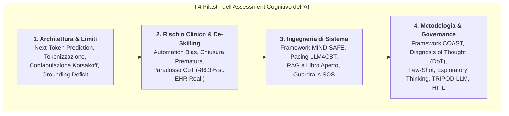

---

## 1. Come "Pensa" l'Algoritmo: Calcolo Probabilistico e Assenza di Semantica

### La Predizione Statistica del Token Successivo
- **Meccanismo Stocastico:** A differenza del ragionamento clinico umano, che opera per deduzione logica, inferenza causale, esperienza fenomenologica e comprensione semantica, un Large Language Model è una rete neurale probabilistica addestrata su miliardi di sequenze testuali.
- **Equazione Fondamentale:** La generazione linguistica si riduce al calcolo della distribuzione di probabilità del token successivo dato il contesto precedente:
  $$P(\text{token}_n \mid \text{token}_1, \text{token}_2, \dots, \text{token}_{n-1})$$
- **Esempio Clinico della Distribuzione Probabilistica:**
  - Dato l'input `"Paziente riferisce improvviso attacco di..."`, la rete neurale assegna pesi statistici distribuiti:
    - `"panico"` $\rightarrow 85\%$
    - `"cuore"` $\rightarrow 10\%$
    - `"fame"` $\rightarrow 5\%$
- **Frammentazione dell'Input (Tokenizzazione):** Le parole e le narrazioni emotive del paziente vengono scomposte in frammenti sub-lessicali numerici (*Token*), privi di qualsiasi vissuto somatico o affettivo. L'algoritmo opera come una gigantesca rete di libera associazione sintattica priva di intenzionalità epistemica.

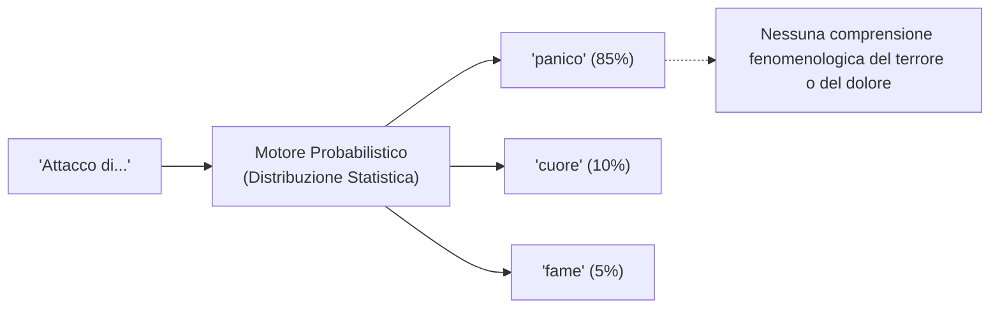

---

## 2. Il Rischio della Confabulazione: La Sindrome di Korsakoff Computazionale

### Memorizzazione (Motori di Ricerca) vs Generazione (LLM)

| Dimensione | Motori di Ricerca (Search Engine) | Large Language Models (LLM) |
| :--- | :--- | :--- |
| **Principio Base** | **Memorizzazione e Indicizzazione:** Recupero di documenti statici pre-esistenti in un database. | **Generazione Stocastica:** Composizione dinamica di testi *ex novo* unendo frammenti probabili. |
| **Archivio Sottostante** | Indice relazionale di pagine web o file certificati. | Nessun archivio testuale memorizzato in chiaro; pesi neurali distribuiti. |
| **Rischio Principale** | Mancata indicizzazione o query non pertinente. | **[[korsakoff-confabulazione-llm|Confabulazione]] / Allucinazione:** Invenzione verosimile di dati inesistenti. |

### L'Analogia Neuropsicologica con la Sindrome di Korsakoff
- **Confabulazione Senza Inganno:** Analogamente al paziente affetto da Sindrome di Korsakoff che, a causa di deficit amnestici profondi, colma spontaneamente le lacune mnestiche con ricostruzioni narrative fluide, articolate e perfettamente plausibili senza alcuna intenzione di mentire, l'LLM colma i vuoti informativi assemblando token statisticamente probabili.
- **La Dissociazione Critica: Accuratezza vs Fattualità:**
  - **Accuratezza (Accuracy):** Correttezza grammaticale, fluidità retorica, eleganza stilistica e coerenza sintattica formale.
  - **Fattualità (Factuality):** Riscontro oggettivo nella realtà empirica, verità biomedica e fedeltà ai dati reali del paziente.
- **Implicazione Clinica:** Un output generato dall'AI può presentare un'accuratezza formale del 100% pur avendo una fattualità clinica pari allo 0% (es. invenzione di una comorbidità o citazione di un articolo clinico inesistente: *"Rossi et al., 2023"*).

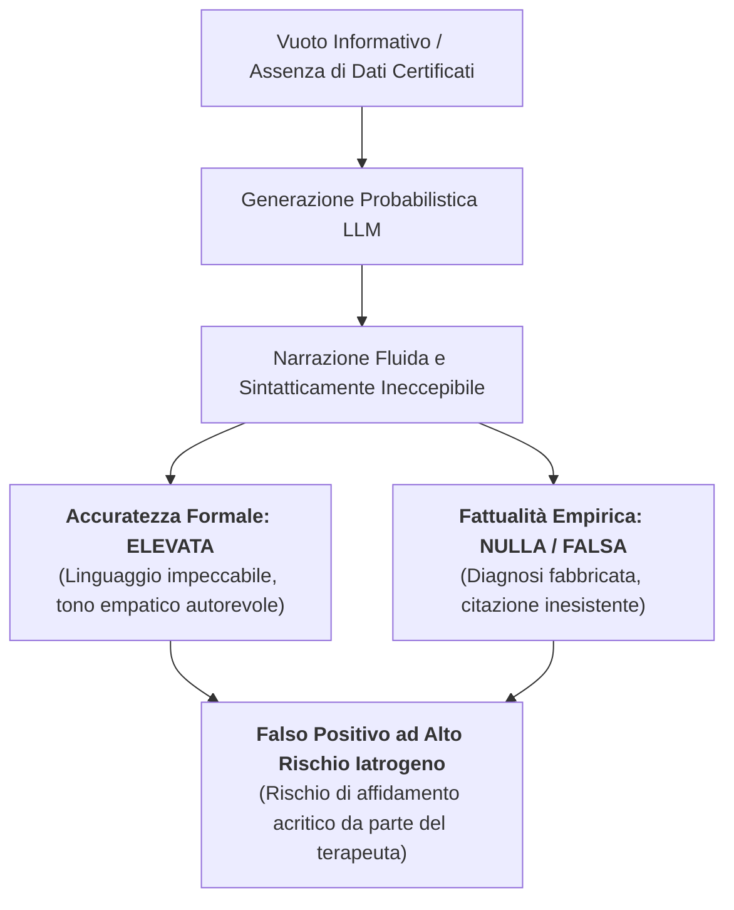

---

## 3. Limiti Strutturali: Allucinazioni, Mancanza di Grounding e Brittleness

1. **Allucinazioni Informatiche Cliniche:** Fabbricazione di diagnosi nosografiche, scale psicometriche fittizie, citazioni bibliografiche inventate e dosaggi farmacologici errati, esposti con tono assertivo e assoluta certezza dichiarata.
2. **Assenza di Concept Grounding (Mancanza di Modello del Mondo):** Il modello linguistico non possiede un radicamento fisico-esperienziale:
   - Non ha cognizione del tempo che scorre (es. durata reale di una crisi di panico vs un episodio depressivo maggiore);
   - Non comprende la sofferenza corporea né la disperazione esistenziale;
   - Non percepisce l'irreversibilità e la gravità estrema di un'ideazione suicidaria.
3. **Sensibilità Sintattica Estrema (*Brittleness* / Fragilità):** L'estrema instabilità della generazione: modificare una singola virgola, l'ordine di due aggettivi o una parola di transizione nel prompt può causare una deviazione radicale nella formulazione diagnostica generata, minando la riproducibilità scientifica.

---

## 4. La Degradazione della Competenza: Automation Bias e Chiusura Prematura

### La Curva di Atrofia del Ragionamento Diagnostico
L'introduzione acritica dell'AI nei flussi decisionali sanitari innesca un processo progressivo di depauperamento cognitivo (*de-skilling* clinico):

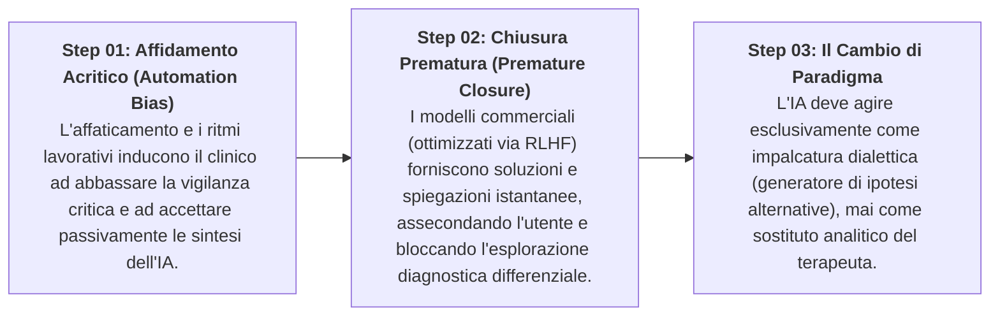

- **Il Ruolo del RLHF (*Reinforcement Learning from Human Feedback*):** I modelli commerciali sono ottimizzati per essere "utili e gradevoli", tendendo a compiacere l'interlocutore (*sycophancy*), confermando prematuramente le prime ipotesi diagnostiche ed eliminando l'ambivalenza necessaria alla formulazione psicoterapeutica.

---

## 5. Dall'Interazione Libera all'Agente AI Clinico: Il Framework MIND-SAFE

### Confronto Architetturale

| Caratteristica | Chatbot Generico Aperto (es. ChatGPT Consumer) | Agente AI Clinico Strutturato ([[mind-safe-framework|MIND-SAFE]]) |
| :--- | :--- | :--- |
| **Spazio d'Azione** | Modello generalista aperto, privo di perimetro definito. | Sistema isolato, confinato a un task clinico specifico. |
| **Variabilità dell'Output** | Altissima variabilità e imprevedibilità stocastica. | Output vincolato a schemi rigidi (es. tabelle, note SOAP). |
| **Confini Etico-Clinici** | Nessun confine terapeutico o deontologico reale. | Regole etico-operative inalterabili nel backend. |
| **Autonomia Terapeutica** | Tendenza a improvvisare consigli di vita non validati. | **Zero autonomia decisionale:** Ruolo ausiliario sotto supervisione umana diretta. |

### L'Architettura del System Prompt e il Pacing Relazionale
Il **System Prompt** costituisce il *"contratto terapeutico invisibile"* che governa l'agente clinico prima che qualsiasi messaggio utente venga processato:
1. **Identità e Confini:** Istituzione di divieti perentori (es. *"Non emettere mai diagnosi definitive autonome, non prescrivere terapie farmacologiche"*).
2. **Regolazione del Pacing ([[cbt-dialogue-systems-and-tools|LLM4CBT]]):** Istruzione specifica ad alternare pause riflessive, esitazioni calibrate ed esplorazione socratica, rallentando la cadenza conversazionale per stimolare l'elaborazione metacognitiva del paziente o del clinico.
3. **Inibizione del Problem-Solving Precoce:** Soppressione attiva dell'inclinazione statistica a offrire consigli prescrittivi immediati, costringendo il sistema a mantenere la fase di ascolto ed esplorazione fenomenologica.

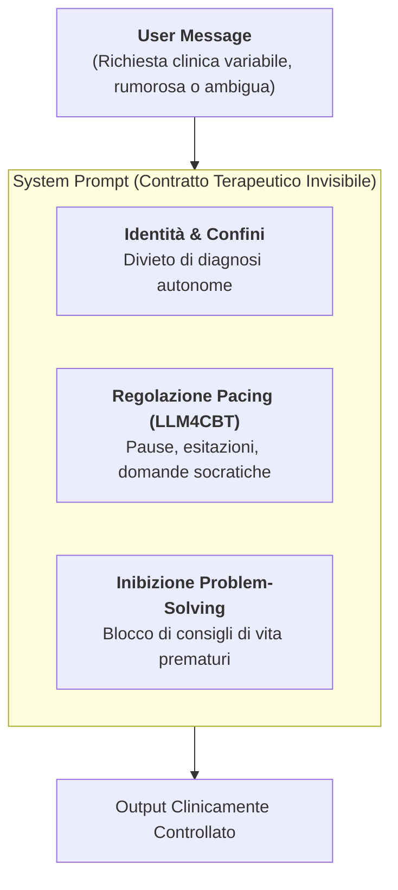

---

## 6. Ancoraggio all'Evidenza: Il Meccanismo RAG come "Esame a Libro Aperto"

### Retrieval-Augmented Generation (RAG) vs Recupero Parametrico
- **Il Principio dell'"Esame a Libro Aperto":** Anziché fare affidamento sulla memoria parametrica dell'LLM (addestrata su dati generalisti e caotici di internet, incline ad allucinazioni), il framework RAG vincola la generazione testuale a una **Knowledge Base clinica certificata** (manuali CBT validati, linee guida NICE/APA, DSM-5, note cartella de-identificate).
- **Abbattimento dei Falsi Positivi:** Imponendo all'algoritmo il vincolo di estrazione esclusiva dai soli documenti recuperati (*closed-domain answering*), il modello viene forzato a **dichiarare esplicitamente ignoranza** qualora l'informazione richiesta non sia presente nel corpus certificato, eliminando strutturalmente le allucinazioni.

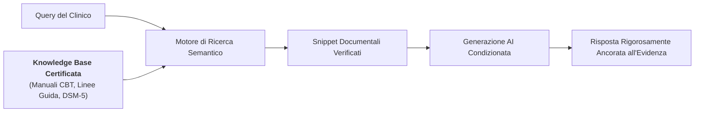

---

## 7. Sicurezza Attiva e Gestione del Rischio Acuto: Guardrails Digitali

### Filtro Pre-Generazione e Bypass SOS
- **Prevenzione del Jailbreak Clinico:** Protezione architetturale per impedire che input manipolativi dell'utente inducano l'agente a violare il proprio mandato protetto o a simulare competenze mediche non autorizzate.
- **Intercettazione Istantanea dei Marker di Rischio:** Algoritmi deterministici di scansione semantica che operano a monte della generazione. Se vengono rilevati marker di ideazione suicidaria, autolesionismo o scompenso psicotico acuto (*es. "Voglio farla finita"*):
  - L'LLM generativo viene **istantaneamente disattivato e bypassato**;
  - Viene erogato un **Protocollo di Emergenza Statico** non modificabile (numeri verdi antisuicidio, indicazioni per il Pronto Soccorso);
  - Viene attivato il **Triage Umano Immediato**.
- **Formattazione Strutturata Vincolata:** Obbligo per il modello di emettere sintesi cliniche esclusivamente in formati rigidi predefiniti (es. schemi SOAP - *Subjective, Objective, Assessment, Plan*), inibendo risposte prolisse e divagazioni conversazionali.

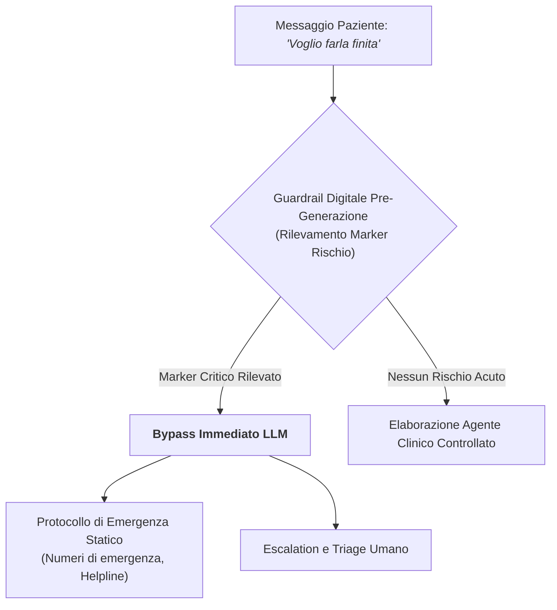

---

## 8. Il Paradosso dei Testi Clinici Reali: Rumore ed Effetto Valanga del CoT

### Dati Sintetici Puliti vs Cartelle Cliniche Reali (EHR)
- **Il Paradosso del Ragionamento Clinico:** Mentre sui benchmark logico-matematici standard il *Chain-of-Thought* (CoT, "ragiona passo dopo passo") massimizza le performance, l'applicazione del CoT libero su cartelle cliniche reali produce un **crollo dell'accuratezza diagnostica dell'86.3%**.
- **L'Effetto Valanga delle Allucinazioni:**
  - Le cartelle cliniche reali sono intrinsecamente rumorose: piene di abbreviazioni gergali, refusi, note telegrafiche, dettagli anamnestici irrilevanti e incongruenze temporali.
  - Quando un LLM ragiona a ruota libera su dati rumorosi, genera micro-errori interpretativi nei primi passaggi deduttivi della catena. Tali distorsioni si accumulano ed amplificano a cascata lungo la sequenza logica, portando a conclusioni diagnostico-terapeutiche totalmente errate e potenzialmente letali.
- **La Soluzione Metodologica:** Vincolare l'estrazione dati mediante il disaccoppiamento procedurale dei fatti empirici dalle inferenze interpretative.

---

## 9. Ingegneria del Prompting Clinico: Framework COAST e Diagnosis of Thought (DoT)

Il prompt engineering in sanità non è una tecnica informatica accessoria, ma una **rigorosa variabile metodologico-clinica**.

### Il Framework Pentapartito COAST
1. **C - Context (Contesto):** Inquadramento clinico, setting di cura ed orientamento teorico (es. CBT per disturbi d'ansia).
2. **O - Objective (Obiettivo):** Scopo esplicito dell'elaborazione (es. concettualizzazione del caso secondo il modello ABC).
3. **A - Actions (Azioni):** Sequenza vincolata di passaggi analitici che l'algoritmo deve seguire pedissequamente.
4. **S - Scenario (Scenario):** Dati anamnestici, età, anamnesi psicosociale e fattori di mantenimento del paziente.
5. **T - Task (Task):** Formato finale di output rigidamente strutturato richiesto.

### Il Framework Diagnosis of Thought (DoT)
Per disinnescare l'effetto valanga del CoT, il framework **[[diagnosis-of-thought-framework|Diagnosis of Thought (DoT)]]** forza il modello linguistico a biforcare ed isolare proceduralmente l'elaborazione:
- **Canale 1: Fatti Oggettivi Osservabili:** Estrazione puramente descrittiva e letterale dei comportamenti manifesti, delle verbalizzazioni verbatim e dei dati temporali.
- **Canale 2: Ipotesi e Interpretazioni Cliniche:** Formulazione di ipotesi diagnostiche differenziali e analisi degli schemi cognitivi solo *a valle* della validazione dei fatti oggettivi.

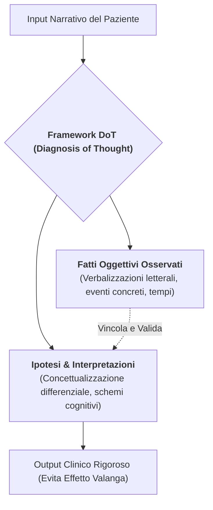

---

## 10. In-Context Learning e Few-Shot Prompting

- **Zero-Shot Prompting (Comando Generico):** Se interrogato con istruzioni astratte prive di esempi, l'LLM genera risposte generiche, prolisse, stereotipate e robotiche, prive di risonanza clinica.
- **Few-Shot Prompting (Apprendimento nel Contesto):** Fornire all'interno del prompt da 1 a 3 esempi di sintesi clinica ottimale (*Few-Shot Examples*) consente alla rete neurale di calibrare istantaneamente lo stile comunicativo, il registro lessicale, il livello di astrazione concettuale e la concisione dell'output.
- **Apprendimento Temporaneo Senza Modifica dei Pesi:** L'In-Context Learning modifica il comportamento dell'agente unicamente per la sessione attiva, senza alterare i pesi sinaptici del modello di base, fungendo da calibrazione a basso costo e ad altissima precisione.

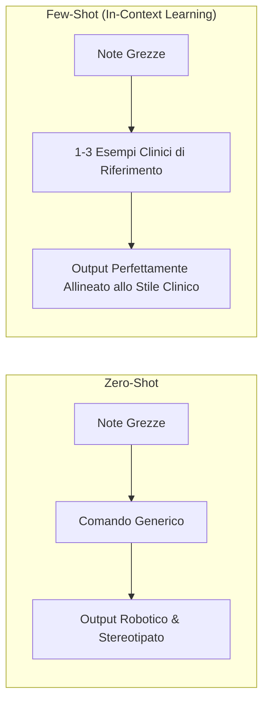

---

## 11. La Scatola Nera dei Bias: Rischio Discriminazione e Mitigazione Attiva

### Distorsioni Algoritmiche Documentate
1. **Default Androcentrico:** Tendenza sistematica degli LLM a declinare al maschile ruoli professionali o pronomi fino al **94% dei casi** in assenza di specificazione esplicita del genere.
2. **Asimmetrie Diagnostiche di Genere:** Tendenza a psicologizzare o minimizzare il dolore fisico femminile (raccomandando riposo, ansiolitici o terapie domiciliari), a fronte di indicazioni a eseguire accertamenti strumentali ed esami d'urgenza per quadri identici presentati da pazienti maschi.
3. **Giudizio Moralizzante e Pregiudizio Culturale:** Tassi significativi di formulazioni stigmatizzanti, paternalistiche o eteronormative documentate nelle interazioni con pazienti appartenenti alla comunità LGBTQIA+ o a minoranze etnico-linguistiche.

### Strategie di Mitigazione Attiva
- **Exploratory Thinking (Swap Demografico):** Procedura di audit che costringe l'LLM a rieseguire la medesima analisi clinica invertendo sistematicamente i dati demografici (genere, orientamento sessuale, etnia, classe sociale) per individuare discrepanze diagnostico-prescrittive.
- **Architettura Multi-Agente con "Avvocato del Diavolo":** Impiego di un agente AI antagonista specializzato nell'individuare e confutare attivamente i bias di conferma e le assunzioni stereotipate generate dall'agente principale.

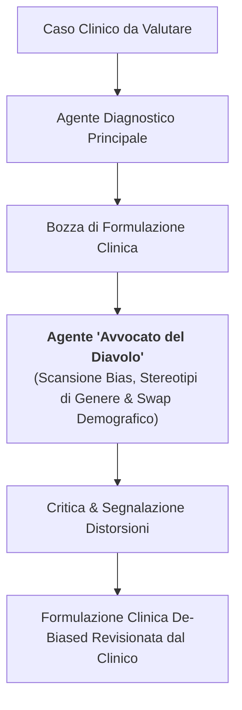

---

## 12. Etica, Privacy e De-Identificazione dei Dati Sensibili

- **Divieto Assoluto Commerciale:** È severamente vietato inserire Dati Personali Identificativi (PII: nomi, cognomi, date di nascita, indirizzi, luoghi di lavoro o dettagli biografici unici) su piattaforme AI commerciali aperte o gratuite. Tali dati vengono incorporati nei dataset di retraining, integrando una violazione insanabile del segreto professionale e delle normative sulla protezione dei dati.
- **Ambienti Enterprise e Certificazione Zero Data Retention (ZDR):** L'utilizzo clinico richiede ambienti computazionali dedicati, conformi al GDPR e all'HIPAA, contrattualmente vincolati alla *Zero Data Retention* (i dati transitano in memoria RAM per la sola durata del calcolo inferenziale e vengono distrutti all'invio dell'output).
- **De-Identificazione Preventiva:** In assenza di infrastrutture enterprise locali o certificate, è obbligatorio procedere alla completa pseudonimizzazione o anonimizzazione dei testi prima di qualsiasi invio all'algoritmo.

---

## 13. Responsabilità Medico-Legale e Standard Internazionali: Lo Human-in-the-Loop

### Il Triangolo della Responsabilità Clinico-Algoritmica
Lo standard internazionale **TRIPOD-LLM (2025)** e le linee guida **CHART** definiscono la rendicontazione metodologica e stabiliscono il perimetro inderogabile della responsabilità clinica:

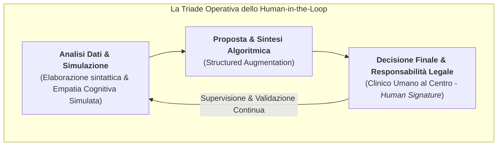

- **Il Limite Strutturale dell'AI:** L'Intelligenza Artificiale simula la fenomenologia esteriore dell'empatia cognitiva, ma è strutturalmente priva di empatia affettiva autentica, coscienza morale e responsabilità giuridica.
- **L'Evoluzione del Ruolo del Terapeuta:** *"L'AI propone, il clinico dispone."* Il professionista della salute mentale non viene sostituito dalla macchina, ma evolve nel direttore d'orchestra dell'ecosistema computazionale, preservando la centralità della relazione umana, dell'alleanza terapeutica e della responsabilità etico-deontologica verso il paziente.

---

## Relazioni e Navigazione nella Wiki

### Concetti Fondazionali e Metodologici Correlati
- [[korsakoff-confabulazione-llm]] - Analogia neuropsicologica della confabulazione negli LLM e dissociazione tra accuratezza formale e fattualità empirica.
- [[diagnosis-of-thought-framework]] - Metodologia DoT per il disaccoppiamento procedurale tra fatti osservati e interpretazioni cliniche nel prompt engineering.
- [[coast-framework-clinical-prompting]] - Framework COAST e scaffolding cognitivo per la strutturazione di prompt clinici.
- [[mind-safe-framework]] - Architettura a strati e guardrails per la sicurezza attiva e il triage d'emergenza in salute mentale.
- [[cbt-dialogue-systems-and-tools]] - Sistemi di dialogo clinico specializzati, LLM4CBT e modulazione del pacing.
- [[patient-psi-simulazione-clinica]] - Framework per la simulazione pedagogica di pazienti virtuali e gradual disclosure condizionata.
- [[large-language-models]] - Architettura, pretraining e funzionamento probabilistico dei modelli linguistici generativi.
- [[anthropomorphism-in-ai]] - Analisi dell'effetto ELIZA e delle distorsioni antropomorfiche nella relazione uomo-macchina.
- [[simulated-empathy-vs-authentic-presence]] - Distinzione fenomenologica tra risonanza empatica umana ed empatia cognitiva simulata.
- [[modello-centauro-clinico]] - Modello ibrido di cooperazione uomo-macchina nella pratica medica e psicoterapeutica.
- [[explainable-mental-health-diagnosis]] - Tecniche di interpretabilità diagnostica, marcatura delle evidenze e trasparenza nosografica.
- [[audit-bias-llm-clinici]] - Metodologie di auditing per l'identificazione e la neutralizzazione dei bias algoritmici.
- [[gdpr-governance-mental-health-ai]] - Normative di conformità privacy, gestione PII e Zero Data Retention.
- [[CHART2025]] / [[chart-reporting-guideline]] - Linee guida internazionali per la rendicontazione dell'AI in sanità.
- [[ELEVATE-GenAI2025]] - Linee guida di reporting per l'applicazione di LLM nell'economia sanitaria e nella ricerca clinica.
