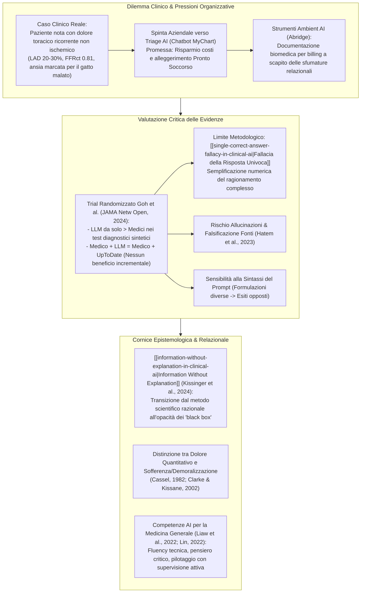
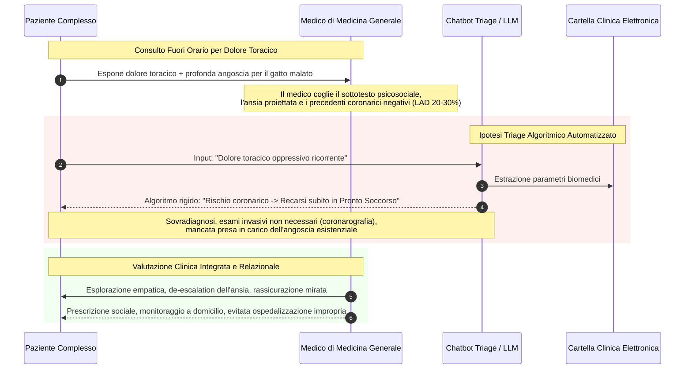
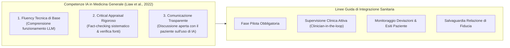

# Clinical Decision-Making and Artificial Intelligence: The Role of Large Language Models in Medicine (Bhasin et al., 2025)

## Definizione Operativa
- **Clinical Decision Report** e revisione critica pubblicata su *Clinical Research in Practice: The Journal of Team Hippocrates* (Vol. 11, Iss. 1, Art. 7, Aprile 2025) da Wassim El-Sayed, Kassim Salami, Richa Bhasin, Mura Abdul-Nabi, Ahmed Elashmawy e M. Ellis Jaruzel II (Michigan State University, Wayne State University, Corewell Health East Wayne).
- **Quesito Clinico Cardine:** Se i modelli linguistici di grandi dimensioni ([[large-language-models]]) debbano essere impiegati come alternativa o supporto primario alla valutazione del medico nei contesti clinici e di triage della medicina generale.
- **Tesi Centrale:** Sebbene i modelli di IA eccellano nel riconoscimento di pattern su ampi volumi di dati biomedici, il processo decisionale clinico (*clinical decision-making*) non è riducibile a un problema di classificazione oggettiva con una singola "risposta corretta". La decisione medica autentica emerge all'interno della relazione medico-paziente, integrando il contesto psicosociale, l'intuito, l'incertezza diagnostica, le dinamiche di transfert/controtransfert e la costruzione di fiducia reciproca—dimensioni ontologicamente inaccessibili agli algoritmi generativi.

---

## Evidenze dalla Letteratura e Revisione Critica

### 1. Il Trial di Goh et al. (2024) e la "Sola Competenza Algoritmica"
- **Disegno dello Studio:** Goh et al. (*JAMA Network Open*, 2024) hanno condotto un trial clinico randomizzato per verificare se l'accesso a un LLM di frontiera migliorasse il ragionamento diagnostico dei medici rispetto a risorse decisionali convenzionali (come *UpToDate*).
- **Risultato Sorprendente e Paradossale:**
  - Il gruppo **Medico + LLM** non ha mostrato differenze statisticamente significative nelle prestazioni diagnostiche rispetto al gruppo **Medico + Strumenti Convenzionali**.
  - Tuttavia, il modello **LLM da solo** ha superato entrambe le coorti umane nel punteggio complessivo.
- **Analisi Critica di Bhasin et al. (2025):**
  1. *Pattern Recognition vs Ragionamento Clinico:* Le elevate prestazioni dell'LLM autonomo riflettono una straordinaria capacità di riconoscimento di pattern linguistici e correlazione statistica su batterie di casi formalizzati, ma non si traducono in un reale potenziamento del ragionamento clinico se affiancate al professionista.
  2. *[[single-correct-answer-fallacy-in-clinical-ai|Fallacia della Risposta Corretta Putativa]]:* Il benchmark sperimentale presupponeva a priori l'esistenza di una singola diagnosi corretta e univoca, assegnando un punteggio numerico quantitativo a un processo inferenziale intrinsecamente non lineare.
  3. *Assenza del Contesto Relazionale:* La medicina reale opera in condizioni di incertezza radicale, sfumature psicosociali, comunicazione non verbale e negoziazione dei valori del paziente, elementi ignorati dai test standardizzati a risposta chiusa.

---

### 2. Sintesi degli Studi Correlati (Livelli di Evidenza)

| Studio | Disegno & Campione | Livello di Evidenza | Risultanze Principali | Limiti e Implicazioni |
| :--- | :--- | :---: | :--- | :--- |
| **Goh et al. (2024)** | RCT su medici con LLM vs UpToDate | **Grado 2** | LLM alone > Medici; Medico+LLM = Medico+UpToDate | Metrica basata su punteggio numerico e diagnosi prefissata; non valuta la qualità del ragionamento in vivo. |
| **Harari et al. (2025)** | RCT con visori AR durante scenari di arresto cardiaco (CPR): guide cartacee vs ChatGPT autonomo vs ChatGPT supervisionato | **Grado 2** | Accuratezza decisionale e fiducia massime nel gruppo **ChatGPT supervisionato** dal clinico. | Tempo di risposta più lungo nel gruppo supervisionato; necessità di rifinire la sicurezza e la latenza. |
| **Hsu et al. (2023)** | Studio predittivo su 2.666 pazienti con crisi iperglicemiche in Pronto Soccorso | **Grado 4** | Buona accuratezza predittiva retrospettiva per sepsi, shock, ICU e mortalità a 30 giorni. | Quando integrato in tempo reale nel sistema informativo ospedaliero (HIS), non ha mostrato differenze significative sugli esiti clinici avversi. |
| **Cabral et al. (2024)** | Valutazione comparativa delle competenze cliniche di GPT-4 vs medici strutturati e specializzandi | **Grado 4** | GPT-4 eccelle in alcune valutazioni di ragionamento clinico; nessuna differenza significativa in altre. | Evidenzia potenziale come supporto decisionale ma richiede convalida prospettica e calibrazione. |
| **Hatem et al. (2023)** | Studio qualitativo su allucinazioni cliniche in LLM | **Report / Revisione** | Identificazione di allucinazioni gravi e fabbricazione di interi articoli con PMID inesistenti o associati a studi non correlati. | Rischio critico di disinformazione medica altamente verosimile che mina la sicurezza clinica. |

---

## Dimensioni Critiche e Rischi Emergenti

### 1. [[information-without-explanation-in-clinical-ai|Informazione Senza Spiegazione]] e Opacità Epistemica
- **L'Erosione del Metodo Scientifico:** Citando l'analisi filosofica di Henry Kissinger, Craig Mundie ed Eric Schmidt in *Genesis: Artificial Intelligence, Hope, and the Human Spirit* (2024), gli autori sottolineano come la medicina stia transitando dal metodo scientifico illuminista — basato su evidenza verificabile, trasparenza, riproducibilità e validazione logica — all'accettazione acritica di *"informazione senza spiegazione"*.
- **I Modelli Black-Box:** Le rappresentazioni interne della realtà generate dalle reti neurali restano opache anche ai loro creatori. Il medico riceve un output clinico verosimile ma non può ispezionare il percorso logico-inferenziale che lo ha generato.
- **La Questione della Coscienza e della Sentience:** Il dibattito sulla coscienza nelle macchine (Chalmers, 2024; Kuhn, 2024; Hart, 2024) dimostra che la mente non è riducibile a computazione algoritmica. I modelli linguistici non possiedono esperienza fenomenica soggettiva né intenzionalità emotiva.

### 2. Riduzionismo Biomedico nella Documentazione Ambientale (Il Caso Abridge©)
- **Ottimizzazione Economica vs Cura Umanistica:** I sistemi di trascrizione e generazione note ambientali basati su LLM (come Abridge©) ottengono grande entusiasmo aziendale perché automatizzano perfettamente i criteri documentali per la fatturazione (*billing*).
- **Perdita della Trama Relazionale:** L'output finale di questi strumenti isola rigidamente i dati biomedici e cancella la complessa trama interpersonale e affettiva emersa durante il colloquio, trasformando l'atto medico in una sequenza di codici rimborsabili e deprivando la cartella della storia esistenziale del paziente.

### 3. Vulnerabilità Cognitive e Tecniche
1. **Volatilità da Sintassi di Prompt:** Piccole variazioni nella formulazione lessicale o nell'ordine delle domande inviate all'LLM producono raccomandazioni cliniche diametralmente opposte, rendendo instabile il supporto decisionale in assenza di protocolli di prompting standardizzati.
2. **Allucinazioni e Fabbricazione di Citazioni:** Come dimostrato da Hatem et al. (2023) con l'esempio dell'osteoporosi associata a omocistinuria, gli LLM generano trattazioni autorevoli corredate da citazioni PubMed interamente inventate, inducendo il medico in errore (*automation bias*).
3. **De-skilling e Riduzione dello Sforzo Cognitivo:** Gli studi di Tankelevitch et al. (2024) e Lee et al. (2025) confermano che l'uso prolungato di IA generativa riduce l'impegno cognitivo e il pensiero critico spontaneo dei lavoratori della conoscenza, creando un falso senso di sicurezza diagnostica.
4. **Incapacità di Discriminare il Dolore dalla Sofferenza:** Citando Cassel (1982), Frank & Frank (1993) e Clarke & Kissane (2002), il testo ribadisce che i modelli quantitativi confondono il punteggio del dolore fisico (*pain score*) con la **sofferenza esistenziale e la demoralizzazione**, non potendo formulare interventi di prescrizione sociale (*social prescribing*) calibrati sulla persona.

---

## Raccomandazioni per la Pratica Clinica e la Governance

1. **Leadership della Medicina Generale (Lin, 2022):** I medici di cure primarie devono guidare l'integrazione dell'IA sanitaria, poiché gestiscono popolazioni eterogenee e possono testare i modelli contro bias clinici e disparità socio-demografiche.
2. **Adozione del [[modello-centauro-clinico]] e [[human-in-the-reasoning]]:** L'IA deve operare esclusivamente come secondo parere consultivo o generatore di diagnosi differenziali estese, mentre la sintesi diagnostica, l'interpretazione del sottotesto e la scelta terapeutica rimangono prerogativa esclusiva del clinico.
3. **Fasi Pilota Rigorose:** Ogni nuova implementazione algoritmica ospedaliera (come i chatbot di triage per il dolore toracico) deve essere preceduta da un periodo pilota con monitoraggio continuo degli eventi avversi, degli accessi impropri e del tasso di sovra/sotto-trattamento.

---

## Riferimenti Bibliografici

- **Bhasin, R., El-Sayed, W., Salami, K., Abdul-Nabi, M., Elashmawy, A., & Jaruzel II, M. E. (2025).** Clinical decision-making and artificial intelligence: The role of large language models in medicine. *Clinical Research in Practice: The Journal of Team Hippocrates*, 11(1), eP3601. https://doi.org/10.22237/crp/1743681960
- **Cabral, S., Restrepo, D., Kanjee, Z., et al. (2024).** Clinical Reasoning of a Generative Artificial Intelligence Model Compared With Physicians. *JAMA Internal Medicine*, 184(5), 581–583. https://doi.org/10.1001/jamainternmed.2024.0295
- **Cassel, E. J. (1982).** The nature of suffering and the goals of medicine. *New England Journal of Medicine*, 306(11), 639–645. https://doi.org/10.1056/NEJM198203183061104
- **Clarke, D. M., & Kissane, D. W. (2002).** Demoralization: its phenomenology and importance. *Australian & New Zealand Journal of Psychiatry*, 36(6), 733–742. https://doi.org/10.1046/j.1440-1614.2002.01086.x
- **Frank, J. D., & Frank, J. B. (1993).** *Persuasion and Healing: A Comparative Study of Psychotherapy* (3rd ed.). Johns Hopkins University Press.
- **Goh, E., Gallo, R., Hom, J., et al. (2024).** Large Language Model Influence on Diagnostic Reasoning: A Randomized Clinical Trial. *JAMA Network Open*, 7(10), e2440969. https://doi.org/10.1001/jamanetworkopen.2024.40969
- **Harari, R. E., Altaweel, A., Ahram, T., Keehner, M., & Shokoohi, H. (2025).** A randomized controlled trial on evaluating clinician-supervised generative AI for decision support. *International Journal of Medical Informatics*, 195, 105701. https://doi.org/10.1016/j.ijmedinf.2024.105701
- **Hatem, R., Simmons, B., & Thornton, J. E. (2023).** A Call to Address AI "Hallucinations" and How Healthcare Professionals Can Mitigate Their Risks. *Cureus*, 15(9), e44720. https://doi.org/10.7759/cureus.44720
- **Hsu, C.-C., Kao, Y., Hsu, C.-C., et al. (2023).** Using artificial intelligence to predict adverse outcomes in emergency department patients with hyperglycemic crises in real time. *BMC Endocrine Disorders*, 23(1), 234. https://doi.org/10.1186/s12902-023-01437-9
- **Kissinger, H. A., Mundie, C., & Schmidt, E. (2024).** *Genesis: Artificial Intelligence, Hope, and the Human Spirit*. Little, Brown and Company.
- **Lee, H. P. H., Sarkar, A., Tankelevitch, L., et al. (2025).** The Impact of Generative AI on Critical Thinking: Self-Reported Reductions in Cognitive Effort and Confidence Effects From a Survey of Knowledge Workers. *Microsoft Research Preprint*.
- **Liaw, W., Kueper, J. K., Lin, S., Bazemore, A., Kakadiaris, I., et al. (2022).** Competencies for the Use of Artificial Intelligence in Primary Care. *Annals of Family Medicine*, 20(6), 559–563. https://doi.org/10.1370/afm.2887
- **Lin, S. (2022).** A Clinician's Guide to Artificial Intelligence (AI): Why and How Primary Care Should Lead the Health Care AI Revolution. *Journal of the American Board of Family Medicine*, 35(1), 175–184. https://doi.org/10.3122/jabfm.2022.01.210226
- **Meza, J. P., Soufan, K., Francis, M., & Berjaoui, A. (2023).** Professionalism and moral injury in a capitalist healthcare system. *Clinical Research in Practice*, 9(1), eP3281. https://doi.org/10.22237/crp/1688342460
- **Tankelevitch, L., Kewenig, V., Simkute, A., et al. (2024).** The metacognitive demands and opportunities of generative AI. *Proceedings of the 2024 CHI Conference on Human Factors in Computing Systems*, 680, 1–24. https://doi.org/10.1145/3613904.3642902

---

## Related Pages
- [[information-without-explanation-in-clinical-ai]]
- [[single-correct-answer-fallacy-in-clinical-ai]]
- [[human-in-the-reasoning]]
- [[modello-centauro-clinico]]
- [[automation-bias-clinical-reasoning]]
- [[simulated-empathy-vs-authentic-presence]]
- [[algorithmic-paternalism-in-ai-mental-health]]
- [[three-layer-governance-framework]]
- [[traffic-light-quality-appraisal-clinical-ai]]
- [[cognitive-offloading-e-diagnostic-deskilling]]
- [[ai-clinical-decision-support]]
- [[bottom-up-clinical-documentation]]
