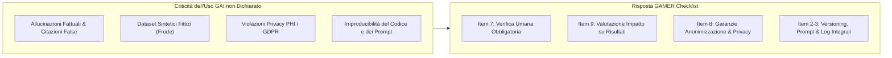
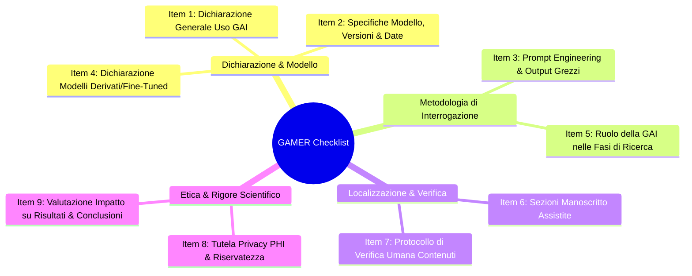
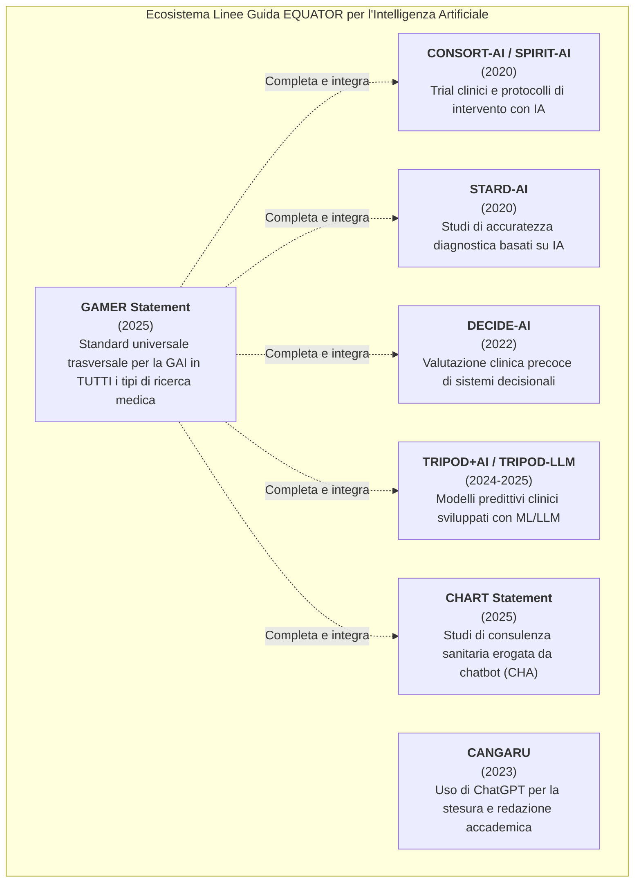

# Reporting guideline for the use of Generative Artificial intelligence tools in MEdical Research: the GAMER Statement (Luo et al., 2025)

## Definizione Operativa
- Il **GAMER Statement** (*Generative Artificial intelligence tools in MEdical Research*) è la prima linea guida di rendicontazione (*reporting guideline*) internazionale standardizzata, universale e trasversale, sviluppata sotto l'egida dell'**EQUATOR Network** (*Enhancing the QUAlity and Transparency Of health Research*), specificamente concepita per regolare e rendere trasparente l'impiego di strumenti di Intelligenza Artificiale Generativa (GAI) in tutte le fasi e per qualsiasi tipologia di disegno di studio nella ricerca medica.
- **Sviluppo Metodologico e Consenso Internazionale:** Pubblicata su *BMJ Evidence-Based Medicine* (2025;30(6):390–400; doi: 10.1136/bmjebm-2025-113825) da un consorzio internazionale guidato da Xufei Luo, Yih Chung Tham, Yaolong Chen e Janne Estill per conto del *GAMER Working Group*, la linea guida è il risultato di una revisione di scoping, di un'indagine Delphi asincrona modificata in due round e di meeting di consenso sincroni che hanno coinvolto **51 esperti internazionali provenienti da 26 paesi e regioni**.
- **Architettura a 9 Item:** A differenza di linee guida vincolate a specifici disegni sperimentali (es. CONSORT-AI per i trial clinici, STARD-AI per studi diagnostici, TRIPOD+AI/TRIPOD-LLM per modelli predittivi) o confinate alla sola stesura manoscritta (es. CANGARU), GAMER definisce **9 item di reporting essenziali** applicabili trasversalmente a revisioni sistematiche, studi osservazionali, trial clinici, protocolli di laboratorio e flussi bioinformatici, coprendo ideazione, prompt engineering, programmazione software, estrazione/trasformazione dati, scrittura e revisione critica.

```mermaid
flowchart TD
    subgraph Context ["Contesto e Criticità Pre-GAMER"]
        C1["Diffusione pervasiva di LLM e Large Visual Models nella ricerca medica"]
        C2["Linee guida editoriali frammentate, eterogenee e prive di base di consenso rigorosa"]
        C3["Rischi di frode accademica, allucinazioni non verificate, fughe di dati PHI e bias"]
        C4["Necessità di uno standard universale applicabile a tutti i disegni di studio"]
    end

    subgraph Process ["Processo di Sviluppo Metodologico (EQUATOR Network)"]
        P1["1. Scoping Review & Analisi Linee Guida Esistenti (CONSORT-AI, DECIDE-AI, ecc.)"]
        P2["2. Delphi Survey a 2 Round (44 esperti internazionali da 26 nazioni; mediana >=6)"]
        P3["3. Virtual Consensus Meetings (Zoom, revisione terminologica, eliminazione ridondanze)"]
        P4["4. Elaborazione Glossary, Documento Explanation & Elaboration (E&E) e Checklist Finale"]
    end

    subgraph Checklist ["Struttura dello Standard GAMER (9 Item)"]
        K1["1. Dichiarazione Generale d'Uso GAI"]
        K2["2. Specifiche del Modello, Versioni e Date"]
        K3["3. Tecniche di Prompting & Risposte Grezze (*Unedited*)"]
        K4["4. Modelli Nuovi / Fine-Tuning e Dati di Base"]
        K5["5. Ruolo Operativo della GAI nelle Fasi di Studio"]
        K6["6. Sezioni/Paragrafi Specifici del Manoscritto Assistiti"]
        K7["7. Protocollo di Verifica dei Contenuti & Modifiche"]
        K8["8. Tutela della Privacy e Riservatezza dei Dati (PHI)"]
        K9["9. Impatto su Interpretazione, Accuratezza e Conclusioni"]
    end

    Context --> Process
    Process --> Checklist
```

---

## Evidenze dalla Letteratura

### 1. Inquadramento del Problema: L'Espansione della GAI e il Vuoto Regolatorio
- **Capacità Uniche della GAI:** La Generative AI si distingue dall'AI analitica o dai semplici motori di ricerca per la capacità autonoma di sintetizzare e generare contenuti inediti (testi argomentativi, codice di analisi statistica, immagini e schemi, sintesi concettuali e trasformazione di dati non strutturati in tabelle).
- **Aree di Rischio Documentate:**
  1. *Autenticità e Frode Accademica:* Fabbricazione di dataset sintetici plausibili ma fittizi per supportare ipotesi sperimentali (Naddaf, 2023), inserimento di referenze bibliografiche allucinate (Kacena et al., 2024), e incapacità dei rilevatori automatici di discriminare testi generati dall'AI (Anderson et al., 2023).
  2. *Privacy e Sicurezza dei Dati:* Trasmissione non autorizzata di informazioni sanitarie protette (*Protected Health Information - PHI*) a server commerciali privi di garanzie di non-addestramento (Wu et al., 2024; Zhou et al., 2024).
  3. *Distorsione dei Risultati e Deskilling:* Dipendenza acritica dai suggerimenti del modello, con potenziali errori subdoli nell'analisi statistica e nell'interpretazione fisiopatologica (Ordak, 2024; Heyman & Heyman, 2024).
- **Limiti delle Linee Guida Esistenti:** Prima di GAMER, le raccomandazioni erano frammentate tra policy individuali di case editrici (ICMJE, WAME, COPE, Nature, Elsevier, SAGE) che si limitavano a vietare l'attribuzione di co-autorialità ai chatbot senza fornire un protocollo operativo dettagliato per rendicontare l'uso scientifico.

---

### 2. Metodologia di Sviluppo dello Standard GAMER
La formulazione della linea guida ha seguito rigorosamente le direttive metodologiche dell'EQUATOR Network per la produzione di linee guida di rendicontazione sanitaria (Moher et al., 2010):

1. **Iniziativa Istituzionale e Registrazione:**
   - Promossa dal *Centro di Medicina Basata sull'Evidenza dell'Università di Lanzhou*, dal *Chinese EQUATOR Centre*, dal *WHO Collaborating Centre for Guideline Implementation and Knowledge Translation* e da affiliati internazionali.
   - Registrazione formale su EQUATOR Network il 3 novembre 2023; protocollo metodologico pubblicato prospetticamente (Luo et al., 2024; *medRxiv* / *BMJ Open*).
2. **Costituzione dei Gruppi di Lavoro:**
   - *Advisory Committee*, *Core Team*, *Delphi Expert Group* e *Coordination Team*.
   - Reclutamento di 200 esperti identificati tramite PubMed e campionamento a valanga, garantendo diversità disciplinare (clinici, epidemiologi, bioinformatici, bioeticisti, redattori di riviste mediche, metodologi) e geografica (26 paesi).
3. **Generazione del Pool di Item e Scoping Review:**
   - Analisi sistematica degli standard AI preesistenti (CONSORT-AI, SPIRIT-AI, DECIDE-AI, STARD-AI, TRIPOD+AI, CLAIM, BePRECISE).
   - Scoping review sulle pratiche reali di rendicontazione nei paper biomedici post-2022.
4. **Indagine Delphi Asincrona (2 Round) e Criteri di Consenso:**
   - Scala Likert a 7 punti (1 = forte disaccordo, 7 = forte accordo per inclusione).
   - *Round 1:* 43 esperti partecipanti. 7 item valutati (tutti con mediana $\ge 6$). 135 commenti raccolti; 4 nuovi item proposti per il round 2. Un item sulla responsabilità autoriale individuale è stato scartato perché ridondante rispetto alla responsabilità etica collettiva.
   - *Round 2:* 33 esperti partecipanti. Valutazione dei 4 nuovi item proposti e consolidamento della checklist.
5. **Consensus Meeting Sincroni e Approvazione Finale:**
   - Due meeting sincroni su Zoom (30 e 31 maggio 2024, con registrazioni e consultazioni asincrone per i fusi orari).
   - Definizione finale dei 9 item, redazione del glossario terminologico e del documento esplicativo (*Explanation and Elaboration - E&E*).

---

### 3. La Checklist GAMER: I 9 Item di Rendicontazione

| N° | Item della Checklist GAMER | Formula di Risposta | Dettaglio Operativo e Razionale Metodologico | Sezione Suggerita |
| :---: | :--- | :---: | :--- | :--- |
| **1** | **Dichiarazione Generale d'Uso** (*General Declaration*) | □ Sì □ No □ N/A | Dichiarare in modo esplicito se sono stati utilizzati strumenti di IA generativa (LLM, LVM, modelli multimodali) in qualsiasi sezione, fase o passaggio dello studio o del manoscritto. *(Non si applica a strumenti di sola traduzione linguistica come Google Translate).* Se "No", gli item successivi non sono richiesti. | Metodi / Dichiarazioni |
| **2** | **Specifiche e Versioning del Modello** (*Tool Specifications & Timing*) | □ Sì □ No □ N/A | Riportare nome commerciale esatto (es. ChatGPT, Claude, Gemini), versione univoca, release date/checkpoint e **date/periodo esatto di utilizzo**. Indicare la modalità d'accesso (interfaccia web vs API), temperatura impostata, token length e iperparametri operativi. | Metodi |
| **3** | **Tecniche di Prompting & Output Grezzi** (*Prompting & Unedited Responses*) | □ Sì □ No □ N/A | Descrivere le strategie di prompt engineering impiegate (zero-shot, few-shot, step-by-step reasoning, RAG). Fornire l'archivio testuale integrale dei prompt e **tutte le risposte grezze non modificate (*unedited responses*)** nei materiali supplementari. | Metodi / Materiali Supplementari |
| **4** | **Sviluppo di Nuovi Modelli / Fine-Tuning** (*Fine-Tuned / Custom Models*) | □ Sì □ No □ N/A | Se lo studio ha sviluppato, addestrato o raffinato un modello personalizzato, documentare il modello base originario (nome, versione, licenza), la pipeline di fine-tuning (es. LoRA, dataset di istruzioni) e i parametri di retraining. *(N/A per modelli standard out-of-the-box).* | Metodi |
| **5** | **Ruolo Operativo nelle Fasi dello Studio** (*Role of GAI in Research Phases*) | □ Sì □ No □ N/A | Dettagliare le funzioni esatte svolte dallo strumento: ideazione dell'ipotesi, progettazione del protocollo, generazione di codice (es. Python, R), estrazione/trasformazione dati da cartelle o testi, sintesi della letteratura o revisione linguistica. | Metodi |
| **6** | **Sezioni Specifiche del Manoscritto** (*AI-Assisted Manuscript Sections*) | □ Sì □ No □ N/A | Indicare con precisione a quali sezioni, paragrafi, tabelle o figure (es. figura 1B) la GAI ha contribuito. *(Se usata esclusivamente per il language editing globale, non è necessario elencare i singoli paragrafi).* | Metodi / Dichiarazioni |
| **7** | **Verifica dei Contenuti & Modifiche** (*Content Verification & Proofreading*) | □ Sì □ No □ N/A | Descrivere il protocollo di verifica umana (*human-in-the-loop*): chi ha controllato l'output, come sono state verificate le citazioni bibliografiche (fact-checking) e le correzioni apportate. Se non è stata eseguita verifica, motivarne le ragioni. | Metodi / Dichiarazioni |
| **8** | **Privacy dei Dati e Riservatezza** (*Data Privacy & PHI Safeguards*) | □ Sì □ No □ N/A | Documentare come è stata garantita la riservatezza: de-identificazione e anonimizzazione dei dati dei pazienti prima dell'input, crittografia end-to-end, conformità GDPR/HIPAA e misure per impedire l'uso dei dati per il riaddestramento commerciale. | Metodi / Etica |
| **9** | **Impatto su Risultati e Conclusioni** (*Impact on Accuracy & Conclusions*) | □ Sì □ No □ N/A | Valutare se e in che modo l'uso della GAI possa aver influenzato l'interpretazione dei dati, l'accuratezza complessiva, potenziali bias o le conclusioni finali. Riaffermare la piena responsabilità scientifica degli autori umani per l'intero contenuto. | Discussione / Conclusioni |

---

### 4. Decisioni Chiave e Dibattiti del Consensus Panel

1. **Adozione del Termine Omnicomprensivo "GAI Tools":**
   - Il panel ha preferito la dicitura *GAI tools* a *Large Language Models (LLMs)* per garantire la longevità e la rilevanza futura della linea guida di fronte all'evoluzione tecnologica dei Large Visual Models (LVM), modelli multimodali voce-video e agenti generativi autonomi.
2. **Esclusione di Strumenti Non-GAI:**
   - La linea guida delimita rigorosamente il proprio perimetro: non si applica a motori di ricerca convenzionali (Google, PubMed) né a strumenti di pura traduzione automatica (es. Google Translate), ma si concentra sulle tecnologie che sintetizzano o generano contenuti nuovi basandosi su pattern probabilistici.
3. **Eliminazione dell'Item sulla Responsabilità Individuale:**
   - L'ipotesi di richiedere l'indicazione nominale di chi fosse il "responsabile dell'uso della GAI" tra i coautori è stata scartata: i principi fondanti dell'editoria scientifica (ICMJE, COPE) stabiliscono che tutti gli autori condividono la **responsabilità collettiva e solidale** per l'accuratezza e l'integrità di quanto pubblicato.
4. **Conservazione e Deposito degli Output Integrali (*Unedited Outputs*):**
   - Il panel ha stabilito che la sola descrizione del prompt è insufficiente per la riproducibilità stocastica degli LLM: gli autori sono tenuti a depositare nei supplementi le risposte grezze complete ottenute dal modello, consentendo a revisori e lettori di esaminare eventuali allucinazioni scartate o integrate.
5. **Collocazione dei Report nel Manoscritto:**
   - Sebbene la sezione Metodi sia considerata la sede d'elezione per la quasi totalità degli item (2-5, 7, 8), il panel ha deliberato di formulare una raccomandazione flessibile anziché un obbligo rigido, permettendo l'inserimento nelle sezioni *Declarations / AI Disclosure* conformemente alle author guidelines delle singole riviste.

---

## Confronto con le Altre Linee Guida EQUATOR

| Linea Guida | Anno | Ambito di Applicazione Specifico | Focus Metodologico |
| :--- | :---: | :--- | :--- |
| **CONSORT-AI / SPIRIT-AI** | 2020 | Trial clinici randomizzati e protocolli con interventi basati su IA | Valutazione dell'efficacia terapeutica/preventiva dell'algoritmo su pazienti |
| **STARD-AI** | 2020 | Studi di validazione diagnostica | Sensibilità, specificità e calibrazione di sistemi di classificazione AI |
| **DECIDE-AI** | 2022 | Valutazione clinica in stadio precoce (*early stage*) | Sicurezza d'uso, usabilità, integrazione nei workflow clinici e fattori umani |
| **TRIPOD-LLM** | 2025 | Modelli di predizione clinica sviluppati con LLM | Rischio clinico, discriminazione, calibrazione e validazione incrociata |
| **CHART Statement** | 2025 | Studi di consulenza sanitaria erogata da chatbot (*Chatbot Health Advice*) | Valutazione dell'accuratezza e sicurezza dei consigli clinici per pazienti/medici |
| **CANGARU** | 2023 | Redazione scientifica assistita da LLM (Medical Writing) | Trasparenza nella stesura del testo del manoscritto |
| **GAMER Statement** | **2025** | **Qualsiasi ricerca medica (trials, review, studi osservazionali, lab)** | **Uso universale della GAI: ideazione, coding, dati, scrittura, privacy e verifica** |

---

## Implicazioni Metodologiche, Cliniche e di Governance

1. **Adozione Editoriale come Standard Minimo di Trasparenza:**
   - Le riviste biomediche internazionali sono incoraggiate a integrare la checklist GAMER nelle istruzioni per gli autori (*Instructions for Authors*), richiedendone la sottomissione obbligatoria a corredo di manoscritti che abbiano impiegato strumenti GAI in qualsiasi fase della ricerca.
2. **Supporto Operativo a Revisori ed Editor:**
   - GAMER funge da strumento di triage e verifica per i *peer reviewers*, consentendo di verificare rapidamente se il codice generato è stato controllato, se i prompt sono replicabili e se sussistono rischi di plagio o distorsione concettuale (*semantic drift*).
3. **Framework "Living Guideline" e Governance Permanente:**
   - Consapevole del ritmo incessante dell'innovazione tecnologica nell'IA generativa, il gruppo di coordinamento ha istituito un **GAMER Long-Standing Coordination Group** con incontri a cadenza annuale per valutare l'usabilità della checklist, incorporare aggiornamenti e programmare future revisioni formali (incluso il coinvolgimento di rappresentanti dei pazienti).
4. **Disseminazione Multilingue Globale:**
   - Traduzione coordinata della checklist nelle lingue locali dei 26 paesi rappresentati nel panel, creazione di una piattaforma web dedicata e promozione attiva presso conferenze internazionali di metodologia ed etica della ricerca.

---

## Riferimenti Bibliografici
- Luo, X., Tham, Y. C., Giuffrè, M., Ranisch, R., Daher, M., Lam, K., Eriksen, A. V., Hsu, C. W., Ozaki, A., de Moraes, F. Y., Khanna, S., Su, K. P., Begagić, E., Bian, Z., Chen, Y., Estill, J., & The GAMER Working Group. (2025). Reporting guideline for the use of Generative Artificial intelligence tools in MEdical Research: the GAMER Statement. *BMJ Evidence-Based Medicine*, 30(6), 390–400. https://doi.org/10.1136/bmjebm-2025-113825
- Luo, X., Tham, Y. C., Daher, M., et al. (2024). Protocol for developing the reporting guideline for the use of chatbots and other Generative Artificial intelligence tools in MEdical Research (GAMER). *medRxiv* / *BMJ Open*, 14, e081155.
- Luo, X., Estill, J., & Chen, Y. (2023). The use of ChatGPT in medical research: do we need a reporting guideline? *International Journal of Surgery*, 109(11), 3750–3751. https://doi.org/10.1097/JS9.0000000000000676
- Collins, G. S., Moons, K. G. M., Dhiman, P., et al. (2024). TRIPOD+AI statement: updated guidance for reporting clinical prediction models that use regression or machine learning methods. *BMJ*, 385, e078378.
- Gallifant, J., Afshar, M., Ameen, S., et al. (2025). The TRIPOD-LLM reporting guideline for studies using large language models. *Nature Medicine*, 31(1), 60–69. https://doi.org/10.1038/s41591-024-03409-7
- Liu, X., Cruz Rivera, S., Moher, D., et al. (2020). Reporting guidelines for clinical trial reports for interventions involving artificial intelligence: the CONSORT-AI extension. *Nature Medicine*, 26(9), 1364–1374.
- Vasey, B., Nagendran, M., Campbell, B., et al. (2022). Reporting guideline for the early-stage clinical evaluation of decision support systems driven by artificial intelligence: DECIDE-AI. *Nature Medicine*, 28(5), 924–933.
- The CHART Collaborative (Huo, B., Guyatt, G. H., et al.). (2025). Reporting guideline for chatbot health advice studies: The CHART Statement. *JAMA Network Open*, 8(8), e2530220.
- Cacciamani, G. E., Collins, G. S., & Gill, I. S. (2023). ChatGPT: standard reporting guidelines for responsible use. *Nature*, 618(7964), 238.
- Moher, D., Schulz, K. F., Simera, I., et al. (2010). Guidance for developers of health research reporting guidelines. *PLoS Medicine*, 7(2), e1000217.

---

## Related pages
- [[gamer-reporting-guideline]]
- [[gai-research-integrity-and-verification]]
- [[chart-reporting-guideline]]
- [[elevate-genai-framework]]
- [[ai-research-ethics]]
- [[large-language-models]]
- [[prompting-in-psychology]]
- [[gdpr-governance-mental-health-ai]]
- [[healthcare-conversational-agents]]
- [[human-in-the-reasoning]]
- [[synthetic-psychopathology]]
