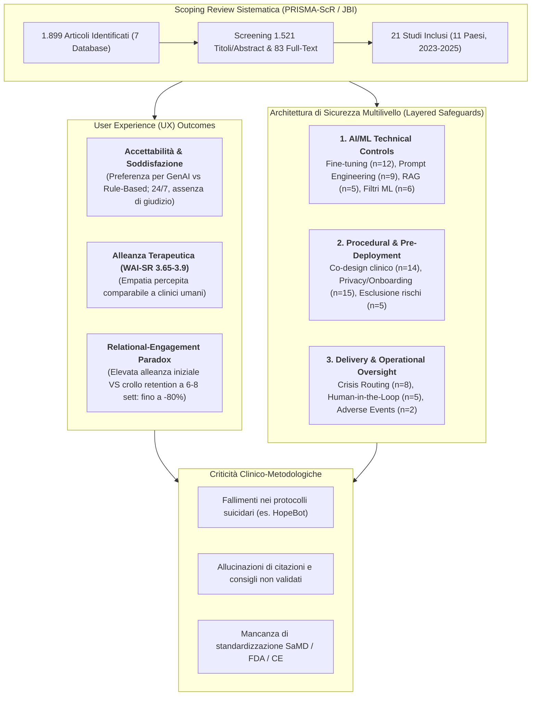
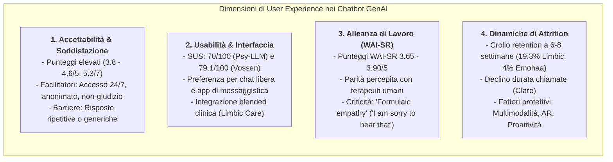
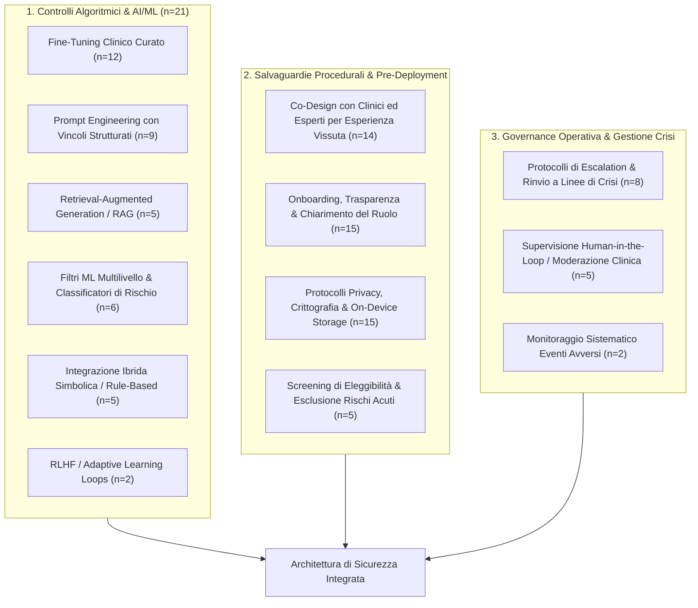

# Generative AI Mental Health Chatbot Interventions: A Scoping Review of Safety and User Experience (Olisaeloka et al., 2026)

## Definizione Operativa
- **Scoping Review Sistematica PRISMA-ScR** condotta da Lotenna Olisaeloka, Chris Richardson, Angel Y. Wang, Richard Munthali e Daniel Vigo (Department of Psychiatry & School of Population and Public Health, Faculty of Medicine, University of British Columbia, Vancouver; protocollo registrato su OSF e pubblicato su *PLOS One*, 2026) che costituisce la **prima mappatura sistematica globale** mirata specificamente all'architettura computazionale, alle modalità di erogazione, agli esiti di **User Experience (UX)** e alle strategie di **mitigazione del rischio e sicurezza clinica** nei chatbot basati su Intelligenza Artificiale Generativa (*GenAI*) appositamente progettati per la salute mentale.
- **Campione ed Evidenze Sintetizzate:** Ricerca sistematica su 7 banche dati accademiche (MEDLINE, Scopus, PsycINFO, ACM Digital Library, IEEE Xplore, Google Scholar, Consensus) che ha censito 1.899 record, includendo **21 studi primari peer-reviewed** condotti in **11 Paesi** tra il 2023 e il 2025 (Cina n=4, Regno Unito n=4, USA n=3, Australia n=2, Germania n=1, Romania n=1, Kenya n=1, Kirghizistan n=1, Malesia n=1, Belgio n=1, Perù n=1).
- **Utilità Clinica e per la Ricerca in Psicoterapia Digitale:** 
  - Fornisce un quadro empirico dettagliato che supera le precedenti review focalizzate su LLM generalisti o chatbot tradizionali rule-based, esaminando interventi progettati ad hoc (*purpose-built*) per ansia, depressione, disturbo post-traumatico da stress (PTSD), demenza, disturbi dell'alimentazione e stress occupazionale.
  - Formalizza il duplice profilo della GenAI in salute mentale: **elevata promessa relazionale e alleanza percepita** (WAI-SR paragonabile a quella con terapeuti umani, 3.65-3.90/5) contrapposta al fenomeno del **[[relational-engagement-paradox-genai|Relational-Engagement Paradox]]** (drastico drop-out/attrition a medio-lungo termine: fino a -80% di retention a 6-8 settimane) e a gravi vulnerabilità di sicurezza (mancata gestione del rischio suicidario in modelli non specializzati, allucinazioni cliniche, scarsità di monitoraggio degli eventi avversi).
  - Dimostra l'imprescindibilità di un'architettura di sicurezza sociotecnica multilivello (**[[layered-safeguards-in-clinical-ai|Layered Safeguards]]**) che combina controlli algoritmici (fine-tuning clinico, RAG con soglie di astensione, filtri multilivello e classificatori di rischio), salvaguardie procedurali (onboarding, chiarimento del ruolo, co-design esperto) e governance operativa (supervisione *Human-in-the-Loop* e percorsi di escalation per le crisi).

---

## Caratteristiche dei Sistemi e Condizioni Cliniche Target

### 1. Condizioni Cliniche e Ambiti di Trattamento
L'analisi degli interventi evidenzia una forte focalizzazione sui disturbi internalizzanti e su approcci transdiagnostici:
- **Ansia e Depressione (n=11 e n=10 studi):** Condizioni primarie maggiormente trattate, spesso integrate mediante framework transdiagnostici basati su ristrutturazione cognitiva, regolazione emotiva e mindfulness (*Therabot*, *Woebot*, *Clare R*, *Emohaa*, *HopeBot*).
- **Stress e Benessere Psicologico Generale (n=6 e n=5 studi):** Interventi a bassa intensità per studenti universitari (*ComPeer*, *Wellness Buddy*, *Wang et al.*) o lavoratori con stress occupazionale (*CareBot*, *Lin et al.*).
- **Condizioni Complesse e Popolazioni Specifiche:**
  - *Demenza in fase iniziale e Caregiver:* Supporto ai caregiver tramite metodo BATHE (*Ana*, Espinoza et al., 2024) e terapia della reminiscenza guidata da stimoli fotografici e vocali per pazienti (*MindTalker*, Xygkou et al., 2024).
  - *Disturbo Post-Traumatico da Stress (PTSD):* Terapia di esposizione graduata in realtà aumentata (ARET) per primi soccorritori (*ExpandXR*, Javanbakht et al., 2024).
  - *Disturbi della Nutrizione e dell'Alimentazione (ED):* Integrazione in trial clinico controllato (*Therabot*, Heinz et al., 2025).
  - *Insonnia:* Monitoraggio e riduzione del punteggio ISI (*Emohaa*, Sabour et al., 2023).

### 2. Approcci Psicoterapeutici Integrati
- **Cognitive Behavioural Therapy (CBT) & Third-Wave:** Approccio nettamente prevalente (13 studi), articolato in psicoeducazione, dialogo socratico, identificazione automatica delle distorsioni cognitive (*TeaBot*), attivazione comportamentale e strategie di *Acceptance and Commitment Therapy* (ACT) (*Therabot*, *Leora*).
- **Approcci Complementari:** Supporto emotivo tra pari (*ComPeer*), psicologia positiva (*Lin et al.*), scrittura espressiva (*Emohaa*), arteterapia multimodale con generazione di immagini (*ArtTheraCat*), terapia della reminiscenza (*MindTalker*) ed esposizione in vivo mediata da avatar olografici (*ExpandXR*).

### 3. Modalità di Interazione e Piattaforme di Erogazione
- **Forma di Embodiment:**
  - *Non-embodied text-based (67%):* Interfaccia di chat testuale pura su app nativa mobile (n=8) o web app (n=8).
  - *Interfacce Vocali/Audio:* Interazione naturale vocale per screening (*HopeBot*) o reminiscenza (*MindTalker*, *Clare R*).
  - *Agenti Multimodali e Avatar:* Integrazione di avatar 2D/3D (*VCounselor*, *Dr. Bot*), generazione visiva (*ArtTheraCat*) e sistemi olografici immersivi in AR (*ExpandXR* su Microsoft HoloLens e Apple Vision Pro).
- **Canali di Accesso:** Piattaforme di messaggistica diffusa (Slack per *CareBot*, Telegram per *TeaBot*, WeChat per *Emohaa*, Tencent QQ per *ComPeer*) impiegate per massimizzare la facilità di fruizione.

---

## Tabella Comparativa dei 21 Interventi Inclusi

La tabella seguente riassume analiticamente i 21 sistemi di GenAI mental health chatbot mappati nella scoping review:

| Studio | Nome Chatbot | Piattaforma & Embodiment | Approccio Terapeutico & Erogazione | Architettura AI & Dataset di Training | Safety & UX Principali |
| :--- | :--- | :--- | :--- | :--- | :--- |
| **Campellone et al. (2025)** (USA) | *Woebot* | Mobile app (Testuale, Non-embodied) | CBT guidata per ansia/umore; trial randomizzato 2 settimane (GenAI vs Rule-based) | OpenAI Ada-002 e DaVinci-003 fine-tuned su dataset proprietario di dialoghi ed FAQ; classificatore NLP per contenuti a rischio | Maggiore empatia percepita nel braccio GenAI; WAI elevata (3.9/5); 4 eventi indesiderati minori; safety net multilivello. |
| **Espinoza et al. (2024)** (Perù) | *Ana* | Web-based (Testuale, Non-embodied) | Supporto ai caregiver di demenza; metodo BATHE; modulo "Vent" per sfogo emotivo | GPT-3.5 con RAG su letteratura validata e Q&A curati da esperti su demenza; matching semantico | Superiore al controllo strutturato su fiducia (4.8 vs 4.2) ed empatia (4.6 vs 2.8); difficoltà su quesiti fuori scope. |
| **Guo et al. (2024)** (UK) | *HopeBot* | Mobile app (Vocale, Non-embodied) | Screening per depressione basato su logica PHQ-9 con chiarimenti empatici vocali | GPT-3.5-Turbo integrato con Whisper per ASR; prompt strutturati per scoring ed empatia | Soddisfazione 3.8/5; **fallimento critico:** risposte generiche su messaggi suicidari senza corretto instradamento di emergenza. |
| **Habicht et al. (2024)** (UK) | *Limbic Care* | Mobile app (Testuale, Non-embodied) | Supporto integrato tra sedute in CBT di gruppo NHS (8-10 settimane); esercizi di reframing | GPT-4 integrato con "Limbic Layer" proprietario (ML per emotion recognition); addestrato su dialoghi clinici anonimizzati NHS | Aumento aderenza clinica rispetto a workbook; crollo di retention app dal 79.3% (sett 1) al 19.3% (sett 6); supervisione clinica. |
| **Heinz et al. (2025)** (USA) | *Therabot* | Mobile app (Testuale, Non-embodied) | Third-wave CBT per depressione, ansia, eating disorders (4 settimane, giornaliero); RCT fully-powered | Ensemble Falcon-7B + LLaMA-2-70B; fine-tuning QLoRA su trascrizioni terapeutiche curate | Riduzione significativa sintomi; WAI paragonabile a terapeuta (4.90/7); 13 interventi umani correttivi per consigli medici impropri. |
| **Javanbakht et al. (2024)** (USA) | *ExpandXR* | AR Headset (Vision Pro/HoloLens) (Avatar Olografico 3D) | Esposizione graduata (ARET) per PTSD e fobie in primi soccorritori; sedute 30-60 min supervisionate | GPT-4 integrato in ambiente ARET; tuning su trascrizioni di esposizione clinica; biofeedback fisiologico | Elevato realismo e riduzione distress; controllo totale human-in-the-loop del clinico su scenari e intensità. |
| **Lai et al. (2024)** (Australia) | *Psy-LLM* | Web platform (Testuale, Non-embodied) | Assistente per professionisti e triage/supporto 24/7 CBT per utenti generali | LLM cinesi (PanGu 200B + WenZhong 3.5B) fine-tuned su PsyQA (56k Q&A validati da psicologi) | SUS soddisfacente (70/100); coerenza e plausibilità clinica; test di laboratorio e metriche ROUGE/Perplexity. |
| **Lin et al. (2023)** (Cina) | *Unnamed* | Web-based (Testuale, Non-embodied) | Gestione stress per impiegati (2 settimane); psicologia positiva e ristrutturazione | RoBERTa (NLU per emozioni/distorsioni) + CDial-GPT (NLG empatico) su dialoghi clinici annotati | Miglioramento benessere soggettivo; 8.24 interazioni medie in 2 settimane; calo progressivo dell'uso. |
| **Liu et al. (2024)** (Cina) | *ComPeer* | Web/QQ messaging (Testuale, Non-embodied) | Peer support proattivo per studenti stressati (1 settimana); messaggi di check-in temporizzati | GPT-4 con memoria e scheduling modulare; Chain-of-Thought (CoT) prompting | +11.92 conversazioni generate dai messaggi proattivi; **allucinazione:** citazione di articoli scientifici inesistenti. |
| **Manole et al. (2024)** (Romania) | *Unnamed* | Mobile app (Testuale, Non-embodied) | Intervento CBT breve su ansia (7 giorni + follow-up 2 mesi); mindfulness e attivazione | ChatGPT con prompt engineering basato su scale cliniche validate; moduli di memoria | Incremento del tempo medio (da 19.55 a 24.15 min/die nella fase 2); punteggi elevati di usabilità. |
| **Nazarova (2023)** (Kirghizistan) | *TeaBot* | Telegram bot (Testuale, Non-embodied) | Riconoscimento distorsioni cognitive e dialogo socratico per studenti (8 settimane) | GPT-3 (Curie classifier + DaVinci generator); RAG su 240 esempi di distorsioni cognitive con soglia di astensione | Riduzione distorsioni; marcato drop-out (-58.1% di retention dalla settimana 1 alla 6); astensione su bassa confidenza. |
| **Ng et al. (2023)** (Malesia) | *CareBot* | Slack (Testuale, Non-embodied) | CBT per stress da lavoro adattata culturalmente al contesto malese | BERT fine-tuned su 5 dataset di emozioni + GPT-3.5 per generazione empatica | Apprezzamento per l'adattamento culturale; bias di classificazione su emozioni positive che ha minato la fiducia. |
| **Ogamba et al. (2023)** (Kenya) | *Wellness Buddy* | Android app (Testuale, Non-embodied) | Supporto CBT e psicoeducazione per studenti kenioti; referral a servizi locali | LLM fine-tuned su dati Kaggle e dati sintetici; architettura con storage dati 100% on-device | Elevata protezione privacy (dati locali); prototipo architetturale privo di validazione empirica di utilizzo. |
| **Sabour et al. (2023)** (Cina) | *Emohaa* | WeChat (Testuale, Non-embodied) | CBT + Helping Skills per depressione/ansia (8 settimane); braccio rule-based vs braccio ibrido LLM | Modello EVA2.0 (2.8B) fine-tuned su ESConv e dialoghi CBT; classificatore di rischio suicidario | Riduzione depressione, ansia e insonnia; forte gradimento per il braccio LLM; **grave drop-out:** solo 12 su 301 completano le 8 sett. |
| **Schäfer et al. (2025)** (Germania) | *Clare R* | Mobile web (Multimodale: Voce + Testo) | CBT e mindfulness con modulazione adattiva del tono; studio longitudinale 8 settimane | Modello ibrido multi-LLM con regole cliniche; NLP per trascrizione vocale; filtro ML con "over-flagging" | WAI-SR 3.76/5; forte calo di engagement (chiamate settimanali da 1.77 a 0.40; durata da 3.35 a 1.45 min); blocco app in crisi. |
| **van der Schyff et al. (2023)** (Australia) | *Leora* | Web & Mobile (Testo e Voce, Non-embodied) | Mental health first aid, screening e supporto breve basato su CBT e ACT | NLP con "humanistic dialogue framework"; architettura di sicurezza e cifratura dati | Studio di fattibilità architetturale ed etica; modello di referral a professionisti umani. |
| **Vossen et al. (2024)** (Belgio) | *Personalised AI* | Web platform (Avatar 2D personalizzabile) | CBT a singola sessione; adattamento di stile (Socratico vs Orientato agli obiettivi) | Architettura ibrida: RASA (intenti e rischio) + ChatGPT API (dialogo a basso rischio); editable "Brain box" | SUS 79.1/100; WAI significativamente superiore nel gruppo personalizzato (3.67 vs 3.18); bypass totale LLM su temi suicidari. |
| **Wang et al. (2024)** (Cina) | *ArtTheraCat* | Website (Multimodale: Testo + Immagini) | Arteterapia ed esternalizzazione visiva delle emozioni per studenti sotto esame (30-40 min) | Pipeline combinata OpenAI GPT-3/4 + DALL-E 3; memoria della cronologia visiva | Incremento affetto positivo; gradimento dell'avatar felino che "dipinge"; richiesta degli utenti di passare alla voce. |
| **Xygkou et al. (2024)** (UK) | *MindTalker* | iOS app (Audio/Voce, Non-embodied) | Terapia della reminiscenza per demenza precoce tramite foto e spunti di memoria | GPT-4 con prompt engineering specializzato su reminiscenza e grounding | Valutazione qualitativa: apprezzato il supporto emotivo, ma percezione di superficialità e timore di sostituzione umana. |
| **Yu & McGuinness (2024)** (UK) | *Dr. Bot* | Web app (Avatar 2D gamificato) | Supporto CBT gamificato a singola sessione | DialoGPT fine-tuned su 7.000 trascrizioni cliniche + ChatGPT-3.5 per raffinamento; filtri di sicurezza | Soddisfazione 4.6/5; metriche BLEU/Perplexity; suggerita integrazione in realtà virtuale e storico chat. |
| **Zhang et al. (2024)** (Cina) | *VCounselor* | Web-based (Multimodale: Voce + Avatar 3D) | Counseling psicologico su criteri DSM-5 in sessione singola | ChatGLM2-6B con LoRA + RAG su conoscenza strutturata DSM-5; BERT per emotion detection | Performance e soddisfazione significativamente superiori rispetto a LLM generici e semplici fine-tuned; matching DSM-5. |

---

## Analisi Approfondita di User Experience (UX)

Diciannove dei ventuno studi hanno valutato almeno una dimensione di UX. L'analisi sintetizza quattro dimensioni cardine:

### 1. Accettabilità, Soddisfazione e Preferenza Comparativa
- **Gradimento Generale:** I partecipanti descrivono costantemente i chatbot GenAI come strumenti accessibili, convenienti e privi di giudizio.
- **Superiorità Percepita su Sistemi Rule-Based:** Nei confronti testa a testa (*Ana*, *Emohaa*, *Woebot*), i modelli generativi sono sistematicamente preferiti agli alberi decisionali rigidi. Anche dove i punteggi quantitativi di soddisfazione erano simili (*Woebot*), il feedback qualitativo ha evidenziato una maggiore naturalezza conversazionale e una superiore profondità empatica.
- **Limiti di Autenticità:** In modelli non ottimizzati, gli utenti lamentano risposte superficiali (*emotional shallowness*), ridondanza e percepita mancanza di autenticità relazionale.

### 2. Usabilità e Modalità di Interazione
- **Standard Usabilità (SUS):** Solo due studi hanno formalizzato l'usabilità con la System Usability Scale (SUS): *Psy-LLM* (70/100) e *Vossen et al.* (79.1/100).
- **Flessibilità Conversazionale:** Gli utenti preferiscono nettamente interfacce di chat a flusso libero e personalizzabili rispetto a menu a scelta multipla strutturati.
- **Piattaforme di Deployment:** L'integrazione in app di messaggistica d'uso quotidiano (WeChat, Telegram, QQ, Slack) riduce le barriere cognitive e l'attrito d'uso. L'integrazione di *Limbic Care* nei percorsi NHS ha mostrato come l'usabilità aumenti quando l'app fa da ponte tra le sedute cliniche umane.

### 3. Alleanza Terapeutica e Parità con il Terapeuta Umano
- **Punteggi WAI-SR:** Gli studi che hanno impiegato la *Working Alliance Inventory – Short Revised* (*Clare R*, *Woebot*, *Vossen et al.*) hanno registrato punteggi compresi tra 3.65 e 3.90 su 5. In *Clare R*, i maschi hanno riportato punteggi lievemente più alti delle femmine (3.88 vs 3.65).
- **Parità Percepita:** In due trial (*Heinz et al.*, *Vossen et al.*), i partecipanti hanno valutato l'alleanza terapeutica con il chatbot come paragonabile a quella stabilita con un terapeuta umano (*"similar to a real therapist"*, 4.90/7).
- **La Trappola dell'Empatia Formulaica:** Nelle architetture prive di fine-tuning specialistico (*HopeBot*), l'empatia è stata percepita come rigida e formulaica, limitata a frasi stereotipate (*"Mi dispiace sentire questo"*), evidenziando il divario tra imitazione lessicale e sintonizzazione affettiva autentica.

### 4. Il Paradosso di Ingaggio e Attrition (Relational-Engagement Paradox)
- Nonostante gli alti punteggi di alleanza e soddisfazione iniziale, **la quasi totalità degli studi longitudinali documenta un drastico declino dell'uso nel tempo**:
  - *Limbic Care:* La retention attiva scende dal **79.3%** nella settimana 1 al **19.3%** nella settimana 6.
  - *TeaBot:* Riduzione del **58.1%** nell'utilizzo tra la settimana 1 e la settimana 6.
  - *Emohaa:* Su 301 partecipanti arruolati, solo **12 hanno completato le 8 settimane** di intervento.
  - *Clare R:* Il numero medio di chiamate settimanali è crollato da 1.77 a 0.40, e la durata media da 3.35 a 1.45 minuti.
- **Fattori di Sostegno dell'Engagement:** Conversazioni multi-thread contestualizzate (*Therabot*), messaggistica proattiva intelligente (*ComPeer*, +11.9 interazioni), interfacce multimodali/AR (*ExpandXR*, *ArtTheraCat*) e integrazione clinica NHS blended (*Limbic Care*).

---

## Architettura di Sicurezza e Mitigazione del Rischio (Layered Safeguards)

Olisaeloka et al. (2026) sintetizzano le strategie di sicurezza in tre macro-categorie complementari:

### 1. Meccanismi Algoritmici e AI/ML
- **Fine-Tuning su Dati Clinici Controllati (n=12):** Utilizzo di trascrizioni reali o simulate supervisionate da psichiatri e psicologi (*Therabot*, *Woebot*, *Dr. Bot*, *VCounselor*). VCounselor ha impiegato ChatGLM2-6B con LoRA su 80 casi annotati basati sui criteri DSM-5.
- **Prompt Engineering Vincolato (n=9):** Strutturazione di prompt di sistema che definiscono la persona terapeutica, impongono la sequenza logica del PHQ-9 (*HopeBot*), guidano il processo maieutico (*Manole et al.*) o applicano Chain-of-Thought (CoT) per ridurre le allucinazioni (*ComPeer*).
- **RAG con Soglie di Astensione (n=5):** Ancoraggio delle risposte a librerie validate di psicoeducazione ed FAQ (*Ana*, *Woebot*, *VCounselor*). In *TeaBot*, il modulo RAG include un meccanismo di astensione (*abstention*): se la confidenza della classificazione scende sotto la soglia di sicurezza, il modello si astiene o dichiara incertezza.
- **Filtri di Contenuto e Classificatori a Cascata (n=6):**
  - *Limbic Layer:* Modulo ML proprietario frapposto tra l'utente e GPT-4 per decodificare gli stati emotivi e garantire la sicurezza clinica.
  - *Woebot Safety Net:* Pipeline a 3 stadi: (1) Classificatore NLP in entrata; (2) Motore RAG su FAQ con LLM fine-tuned vincolato; (3) Ensemble di modelli di classificazione in uscita per bloccare espressioni di odio, violenza o autolesionismo prima della visualizzazione.
  - *Bypass Totale:* In *Vossen et al.*, l'individuazione di intenti suicidari tramite il framework RASA bypassa completamente ChatGPT, erogando messaggi deterministici non generativi con i numeri di emergenza.

### 2. Salvaguardie Procedurali e Pre-Deployment
- **Co-Design Multidisciplinare (n=14):** Coinvolgimento attivo di psicologi, ricercatori HCI e pazienti/caregiver nella fase di ideazione e raffinamento (*MindTalker*, *ExpandXR*, *Ana*).
- **Onboarding e Demistificazione (n=15):** Dichiarazione esplicita e ripetuta che il sistema è un assistente automatizzato e non un sostituto della psicoterapia professionale (*Clare R*, *Woebot*).
- **Criteri di Esclusione Rigorosi (n=5):** Esclusione a priori nei trial di individui con ideazione suicidaria attiva, mania, psicosi o depressione grave (*Heinz et al.*, *Sabour et al.*).

### 3. Mitigazione Operativa ed Eventi Avversi
- **Presenza Human-in-the-Loop (HITL, n=5):**
  - In *Therabot*, clinici hanno supervisionato tutte le interazioni, dovendo intervenire direttamente in **13 occasioni** per correggere consigli medici inappropriati generati dal modello.
  - In *ExpandXR*, il clinico mantiene il controllo visivo e operativo in tempo reale dell'esposizione in realtà aumentata, con facoltà di interrompere la simulazione.
  - In *Limbic Care* ed *Emohaa*, moderatori umani revisionano costantemente le chat contrassegnate dai filtri automatici.
- **Fallimenti Critici e Adverse Events Rilevati:**
  - *HopeBot:* Mancato riconoscimento di frasi a rischio suicidario, con erogazione di generiche rassicurazioni invece dell'escalation di emergenza.
  - *ComPeer:* Allucinazione di referenze e paper scientifici inesistenti forniti agli studenti.
  - *CareBot:* Errore sistematico nel rilevamento di emozioni positive, con conseguente disallineamento empatico e perdita di fiducia.

---

## Lacune Metodologiche e Implicazioni di Governance Sanitaria

### 1. Debolezze Metodologiche della Letteratura Attuale
- **Eterogeneità e Mancanza di Scale Validate:** Prevalenza di questionari Likert non standardizzati o creati ad hoc; solo una minoranza di studi ha impiegato strumenti psicometrici validati per la UX (SUS) o per l'alleanza (WAI-SR).
- **Assenza di Metriche per i Rischi Specifici della GenAI:** Nessuno studio ha impiegato metriche validate per quantificare allucinazioni cliniche, bias algoritmici intersezionali o l'insorgenza di fenomeni dissociativi/psicotici (*AI psychosis*).
- **Carenza di Dati di Deployment e Trasparenza:** Omissione generalizzata dei dettagli architetturali completi, dei parametri di prompt, della latenza di inferenza e del codice sorgente.

### 2. Implicazioni per lo Sviluppo, la Regolazione e la Clinica
1. **Necessità di RCT Comparativi Rigorosi:** I futuri trial devono confrontare i modelli generativi non solo con liste d'attesa, ma con chatbot rule-based e interventi brevi erogati da clinici, valutando l'efficacia a lungo termine (>6-12 mesi).
2. **Standardizzazione dei Benchmark di Sicurezza:** Adozione delle raccomandazioni FDA Digital Health Advisory Committee e sviluppo di checklist armonizzate per il reporting di incidenti ed eventi avversi nei sistemi conversazionali.
3. **Inquadramento come Software as a Medical Device (SaMD):** I chatbot terapeutici autonomi o semi-autonomi devono essere classificati e certificati come tecnologie sanitarie ad alto rischio, sottoposte a continui audit di sicurezza post-commercializzazione.
4. **Modelli di Stepped e Blended Care con Digital Navigators:** Piuttosto che perseguire l'autonomia clinica totale della macchina, i chatbot GenAI devono essere integrati come strumenti di supporto inter-seduta (*blended care*) affiancati da figure umane di navigazione digitale (*digital navigators*) che mantengono il controllo e facilitano l'ingaggio.

---

## Riferimenti Bibliografici
- Olisaeloka, L., Richardson, C., Wang, A. Y., Munthali, R., & Vigo, D. (2026). Generative AI Mental Health Chatbot Interventions: A Scoping Review of Safety and User Experience. *Department of Psychiatry, University of British Columbia*.
- Olisaeloka, L., Richardson, C., & Vigo, D. (2026). User experience and safety of generative AI-based mental health chatbots: Scoping review protocol. *PLOS ONE*, 21, e0341631. https://doi.org/10.17605/OSF.IO/HSNXA
- Campellone, T. R., Flom, M., Montgomery, R. M., Bullard, L., Pirner, M. C., Pavez, A., et al. (2025). Safety and User Experience of a Generative Artificial Intelligence Digital Mental Health Intervention: Exploratory Randomized Controlled Trial. *Journal of Medical Internet Research*, 27, e67365.
- Espinoza, F., Cook, D., Butler, C. R., & Calvo, R. A. (2024). Supporting dementia caregivers in Peru through chatbots: generative AI vs structured conversations. *BCS Learning & Development*, 89–98.
- Habicht, J., Viswanathan, S., Carrington, B., Hauser, T. U., Harper, R., & Rollwage, M. (2024). Closing the accessibility gap to mental health treatment with a personalized self-referral chatbot. *Nature Medicine*, 30, 595–602.
- Heinz, M. V., Mackin, D. M., Trudeau, B. M., Bhattacharya, S., Wang, Y., Banta, H. A., et al. (2025). Randomized Trial of a Generative AI Chatbot for Mental Health Treatment. *NEJM AI*, 2, AIoa2400802.
- Javanbakht, A., Hinchey, L., Gorski, K., Ballard, A., Ritchie, L., & Amirsadri, A. (2024). Unreal that feels real: artificial intelligence-enhanced augmented reality for treating social and occupational dysfunction in post-traumatic stress disorder and anxiety disorders. *European Journal of Psychotraumatology*, 15, 2418248.
- Li, H., Zhang, R., Lee, Y.-C., Kraut, R. E., & Mohr, D. C. (2023). Systematic review and meta-analysis of AI-based conversational agents for promoting mental health and well-being. *npj Digital Medicine*, 6, 1–14.
- Sabour, S., Zhang, W., Xiao, X., Zhang, Y., Zheng, Y., Wen, J., et al. (2023). A chatbot for mental health support: exploring the impact of Emohaa on reducing mental distress in China. *Frontiers in Digital Health*, 5, 1133987.
- Schäfer, L. M., Krause, T., & Köhler, S. (2025). Exploring user characteristics, motives, and expectations and the therapeutic alliance in the mental health conversational AI Clare®: a baseline study. *Frontiers in Digital Health*, 7, 1576135.
- Vossen, W., Szymanski, M., & Verbert, K. (2024). The effect of personalizing a psychotherapy conversational agent on therapeutic bond and usage intentions. In *Proceedings of the 29th International Conference on Intelligent User Interfaces* (pp. 761–771). ACM.

---

## Relazioni
- [[layered-safeguards-in-clinical-ai]]: Framework sociotecnico di salvaguardie multilivello (algoritmiche, procedurali, operative).
- [[relational-engagement-paradox-genai]]: Analisi del divario tra alta alleanza terapeutica percepita iniziale e severo drop-out longitudinale.
- [[clinical-readiness-gap-in-mh-chatbots]]: Divario tra scorrevolezza linguistica di laboratorio e validazione clinica controllata.
- [[traffic-light-quality-appraisal-clinical-ai]]: Valutazione a semaforo della qualità metodologica nei sistemi conversazionali per counseling.
- [[ai_v5i1e80348]]: Systematic review di Cho et al. (2026) sulle metodologie e i framework di valutazione dei chatbot per salute mentale.
- [[behavsci-16-00676]]: Review di Neacșu (2026) su rischi clinici (infrastruttura emotiva, AI psychosis) e opportunità formative dei LLM.
- [[stepped-care-ai-integration]]: Integrazione di strumenti di supporto AI nei sistemi di cure a gradini e blended care.
- [[modello-centauro-clinico]]: Collaborazione Human-in-the-Loop per colmare le falle di affidabilità dell'IA generativa.
- [[software-as-a-medical-device-salute-mentale]]: Inquadramento regolatorio SaMD e standard FDA/CE per dispositivi medici digitali.
- [[between-session-continuity-ai]]: Continuità terapeutica e compiti inter-seduta supportati da agenti conversazionali.
- [[rag-in-psicoterapia]]: Impiego del Retrieval-Augmented Generation per ancorare le risposte a fonti cliniche verificate.
- [[cbt-dialogue-systems-and-tools]]: Architetture informatiche dedicate all'automazione di tecniche cognitivo-comportamentali.
