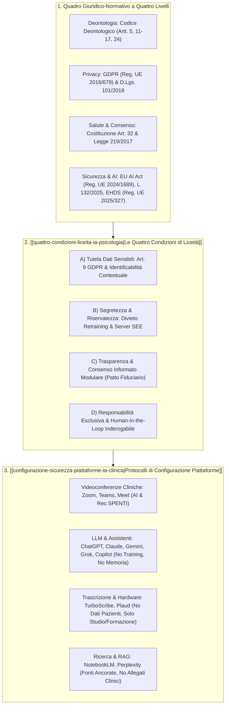
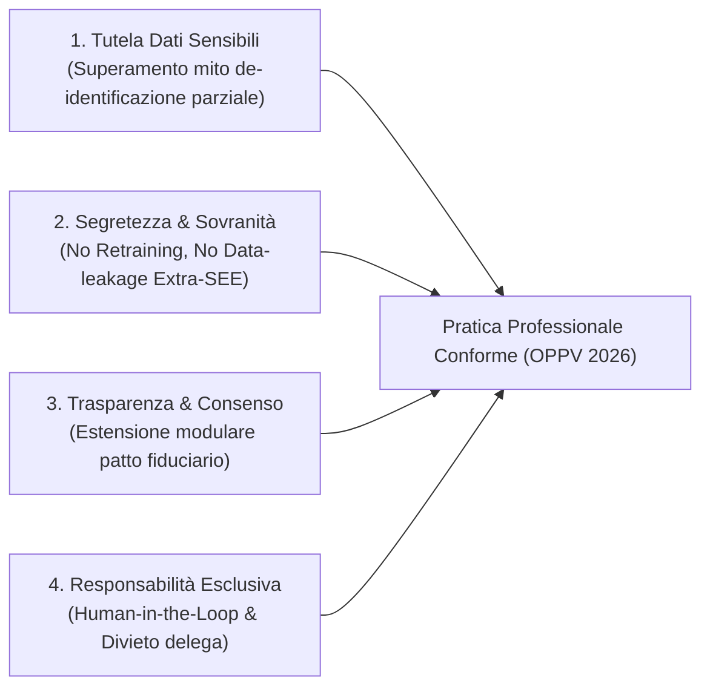
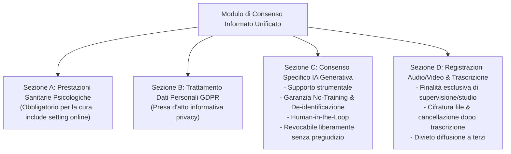
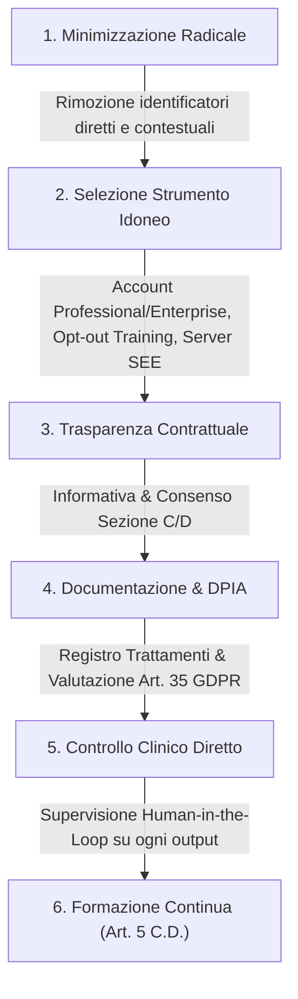
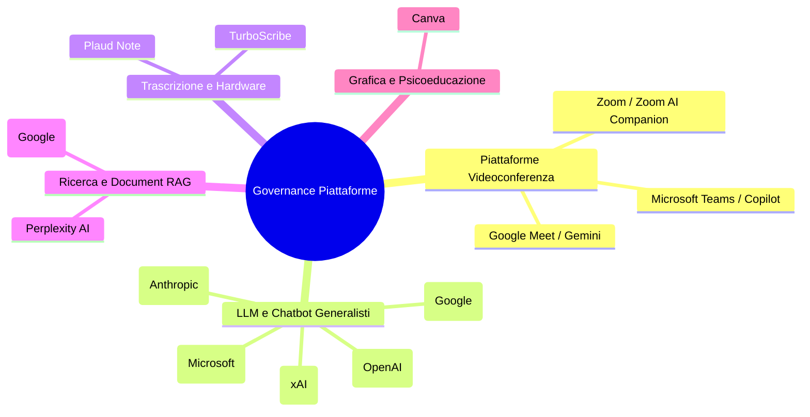
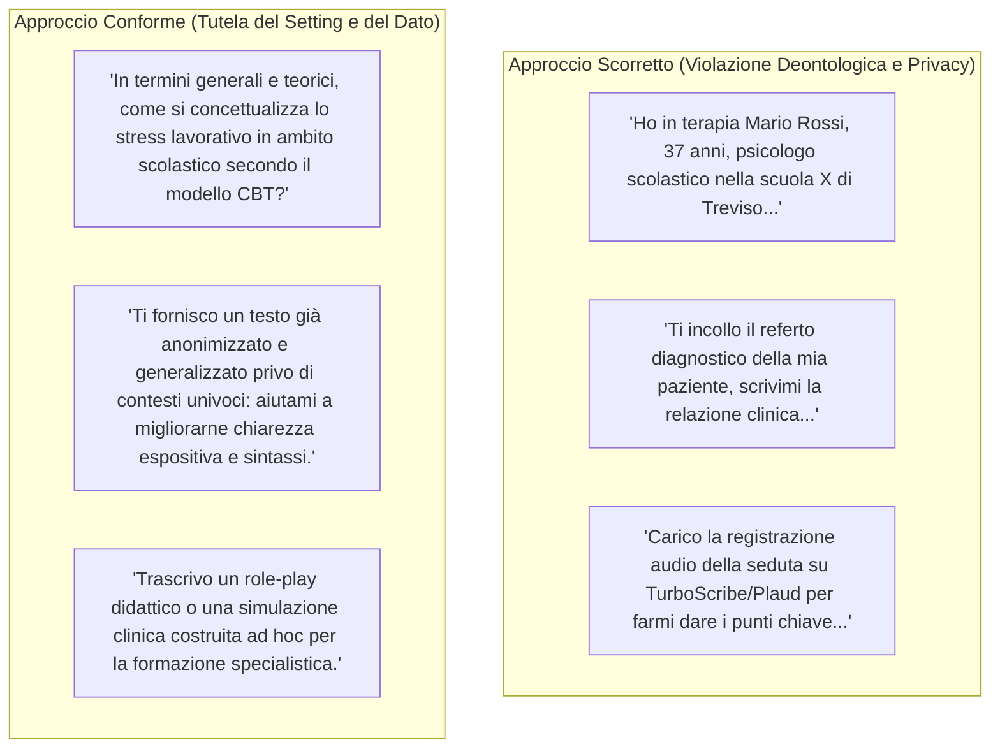

# Guida Operativa all'Utilizzo dell'AI nella Pratica Professionale (OPPV, 2026)

**Summary**: Linee guida ufficiali e operative emanate dal Gruppo di Lavoro Intelligenza Artificiale dell'Ordine delle Psicologhe e degli Psicologi del Veneto (OPPV, Gennaio 2026). Il documento fornisce il quadro giuridico-deontologico integrato (GDPR, AI Act, L. 132/2025, EHDS, Codice Deontologico), stabilisce le quattro condizioni inderogabili di liceità per l'uso dell'IA nella pratica psicologica, fornisce i template personalizzabili di Informativa Privacy e Consenso Informato modulare, e definisce le schede tecniche di configurazione di sicurezza per i principali strumenti commerciali di IA (ChatGPT, Claude, Gemini, Grok, Copilot, Perplexity, Zoom, Teams, Meet, TurboScribe, Plaud Note, NotebookLM, Canva).
**Sources**: `Guida-Pratica-AI-OPPV.pdf` (Versione 1 e 1.1 – Gennaio 2026, a cura del GdL Intelligenza Artificiale OPPV)
**Last updated**: 2026-08-27
---

## Definizione Operativa e Inquadramento Istituzionale

La **Guida Operativa all'Utilizzo dell'AI nella Pratica Professionale** rappresenta il primo documento organico emanato da un Ordine regionale degli psicologi in Italia volto a normare, guidare e disciplinare l'adozione dell'[[large-language-models|Intelligenza Artificiale Generativa]] e degli strumenti digitali avanzati nella professione psicologica e clinica.

Il documento nasce dalla constatazione che l'ingresso dell'IA nella quotidianità professionale avviene spesso in modo informale, frammentario e inconsapevole: molti professionisti considerano i chatbot, i software di trascrizione vocale e i sistemi di sintesi come meri ausili tecnici analoghi a correttori ortografici, motori di ricerca o elaboratori di testo. La Guida OPPV chiarisce che tale percezione è gravemente fuorviante, poiché i sistemi di IA generativa:
1. Elaborano dati personali e particolari (sensibili) su server remoti di terze parti, spesso collocati al di fuori dello Spazio Economico Europeo (extra-SEE);
2. Operano secondo algoritmi complessi e logiche opache (*black box*);
3. Riutilizzano potenzialmente i dati inseriti (prompt, testi, registrazioni vocali) per il riaddestramento continuo dei modelli (*retraining*);
4. Pongono criticità inedite rispetto al segreto professionale, al consenso informato, alla trasparenza relazionale e all'autonomia valutativa del clinico.

L'uso dell'IA generativa in psicologia **non è vietato di per sé**, purché sia impiegato esclusivamente come **strumento assistivo di supporto** e mai come sostituto del ragionamento e dell'atto professionale.

---

## 1. Il Quadro Normativo di Riferimento a Quattro Livelli

L'attività dello psicologo che adotta tecnologie di intelligenza artificiale si colloca all'incrocio vincolante di quattro livelli normativi:

| Livello Normativo | Fonti Giuridiche | Obblighi e Presidi Chiave per lo Psicologo |
| :--- | :--- | :--- |
| **1. Deontologia Professionale** | **Codice Deontologico degli Psicologi Italiani** | - **Artt. 11–17:** Segreto professionale e stretta riservatezza dei dati clinici. - **Art. 24:** Obbligo di acquisizione del consenso informato preliminare. - **Art. 5:** Dovere di competenza, formazione continua e alfabetizzazione digitale adeguata agli strumenti adottati. |
| **2. Protezione dei Dati Personali** | **GDPR (Reg. UE 2016/679)** & **D.Lgs. 101/2018** | - **Art. 9:** Divieto generale di trattamento dati sanitari salvo consenso esplicito e finalità di cura. - **Art. 5:** Principi di liceità, correttezza, trasparenza, limitazione della finalità (*purpose limitation*), minimizzazione dei dati ed esattezza. - **Art. 22:** Diritto a non essere sottoposti a decisioni basate unicamente su trattamenti automatizzati (profilazione). - **Art. 35:** Valutazione d'Impatto sulla Protezione dei Dati (**DPIA**) in caso di trattamenti sistematici di dati sanitari con tecnologie complesse. |
| **3. Diritto alla Salute e Consenso** | **Costituzione Italiana (Art. 32)** & **Legge 219/2017** | - Centralità inderogabile del consenso informato libero, consapevole e documentato. - Nessun trattamento sanitario (diretto o indiretto) può avere inizio senza preventiva informazione completa. |
| **4. Sicurezza dell'IA e Dati Sanitari Europei** | **EU AI Act (Reg. UE 2024/1689)**, **Legge 23 settembre 2025 n. 132**, **EHDS (Reg. UE 2025/327)** | - **AI Act:** Obbligo di supervisione umana effettiva (*Human-in-the-Loop*), trasparenza algoritmica e divieto di delega decisionale autonoma in sanità. - **Legge n. 132/2025:** Disciplina nazionale italiana sull'impiego dell'IA a supporto delle professioni intellettuali con riserva di titolarità decisionale al professionista. - **EHDS:** Regolamentazione dello Spazio Europeo dei Dati Sanitari tra *usi primari* (cura e assistenza diretta) e *usi secondari* (ricerca, sanità pubblica, training algoritmico), con diritto del paziente di opporsi agli usi secondari. |

---

## 2. Le Quattro Condizioni Fondamentali di Liceità Deontologica

Per garantire la tutela del paziente e la legittimità giuridica, l'uso dell'IA deve rispettare **simultaneamente** quattro condizioni (la violazione anche di una sola determina illecito disciplinare e normativo):

### A) Tutela dei Dati Personali e Sensibili (Art. 9 GDPR)
- I dati sulla salute psicologica e mentale godono di protezione rafforzata a prescindere dal formato (appunti, sintesi, audio) e dalle buone intenzioni del clinico.
- **La fallacia della "pseudonimizzazione parziale":** Rimuovere semplicemente il nome e il cognome (*"Tolgo il nome, quindi è anonimo"*) **non rende il dato anonimo**. Nei casi clinici, la ricchezza di dettagli contestuali (professione specifica, dinamiche familiari insolite, micro-localizzazione geografica, eventi temporali precisi) rende la persona pienamente **identificabile per contesto**. Inserire narrazioni cliniche dettagliate in un LLM non conforme costituisce violazione del GDPR.

### B) Segretezza, Riservatezza e Controllo dell'Infrastruttura
- Lo psicologo ha l'obbligo di sapere e poter dimostrare **dove, come e per quanto tempo** i dati vengono trattati.
- **Il rischio del retraining:** L'inserimento di frammenti di anamnesi o sedute in modelli che attuano il riaddestramento automatico può incorporare tali dati nella struttura parametrica del modello, con il rischio teorico che emergano in risposte fornite ad altri utenti.
- **Server extra-SEE:** Il trasferimento di dati sanitari su server statunitensi o extra-europei richiede idonee garanzie giuridiche (es. *Data Privacy Framework UE-USA*, Clausole Contrattuali Standard - SCC). L'affidamento di dati clinici a chatbot gratuiti consumer equivale alla cessione a terzi non vincolati dal segreto professionale.

### C) Trasparenza e Consenso Informato Modulare
- L'utilizzo dell'IA costituisce un trattamento di dati personali che **non può mai essere sottinteso o taciuto**.
- Il paziente ha il diritto inviolabile di conoscere: se e quali strumenti di IA vengono utilizzati, per quali scopi specifici, con quali garanzie tecniche e con quali modalità di opposizione o revoca. La trasparenza è concepita come **estensione del patto fiduciario**.

### D) Responsabilità Professionale Esclusiva e Human-in-the-Loop (HITL)
- L'IA non possiede capacità di giudizio, deontologia né personalità giuridica: è strutturalmente soggetta ad **allucinazioni** (generazione di informazioni errate ma plausibili).
- **Divieto di delega:** L'IA non può in alcuna circostanza formulare diagnosi, stabilire indicazioni terapeutiche o sostituire il ragionamento clinico.
- Qualsiasi output prodotto dalla macchina deve essere criticamente valutato, contestualizzato e validato dal professionista, il quale ne risponde integralmente in sede civile, penale e disciplinare.

---

## 3. Template Documentali Ufficiali (OPPV)

La Guida OPPV include i modelli contrattuali ufficiali precompilati che ogni psicologo deve personalizzare e integrare nella propria modulistica:

### 3.1. Template di Informativa sul Trattamento dei Dati Personali
Il modello recepisce congiuntamente il GDPR (Artt. 13-14), il D.Lgs. 196/2003, l'AI Act (Reg. UE 2024/1689), la Legge n. 132/2025 e l'EHDS (Reg. UE 2025/327):
- **Categorie di dati trattati:** Dati identificativi, particolari sanitari (Art. 9 GDPR), dati biometrici vocali/video (solo previo consenso) e dati elaborati tramite IA (esclusivamente note/bozze preventivamente pseudonimizzate).
- **Finalità d'uso dell'IA:** Supporto strumentale redazionale e organizzativo (revisione linguistica, sintesi di appunti anonimi, traduzioni).
- **Garanzie contrattuali esplicite:**
  1. Principio *Human-in-the-loop*: nessun processo decisionale automatizzato;
  2. Divieto di profilazione automatizzata (Art. 22 GDPR);
  3. Pseudonimizzazione e minimizzazione preventiva;
  4. Esclusione contrattuale del training sui dati immessi e limitazione della persistenza temporale sui server;
  5. Diritto di opposizione agli usi secondari dei dati sanitari ex Reg. EHDS.

### 3.2. Template di Modulo di Consenso Informato Modulare
Strutturato in sezioni autonome per consentire decisioni granulari da parte del paziente:

> [!IMPORTANT]
> **Autonomia della Sezione C e D:** Il mancato rilascio del consenso per l'impiego dell'IA generativa (Sezione C) o per le registrazioni/trascrizioni audio-video (Sezione D) **non impedisce l'erogazione della prestazione psicologica ordinaria**, la quale prosegue con le metodologie cliniche tradizionali.

---

## 4. Vademecum Operativo e Checklist per il Professionista

L'agire concreto dello psicologo richiede l'integrazione di cautele strutturali nella routine professionale:

### Regole Operative Cardine:
1. **Minimizzazione rigorosa:** Eliminare nomi, recapiti, codici, luoghi specifici, date insolite, mestieri rari o combinazioni narrative che rendano riconoscibile il paziente.
2. **Selezione degli strumenti e abbonamenti a pagamento:** Nelle versioni consumer gratuite *"i dati degli utenti sono il prezzo da pagare"*; per l'attività professionale occorre adottare licenze *Professional, Business o Enterprise* che garantiscano contrattualmente l'esclusione del training e tempi certi di cancellazione.
3. **Preferenza per i Reasoning Models:** Nei compiti di riflessione teorica, prediligere modelli capaci di esplicitare la catena di pensiero (*reasoning models* come ChatGPT Thinking o Gemini 3) per consentire una valutazione critica passo-passo della logica algoritmica.
4. **Accountability e DPIA:** Aggiornare il *Registro dei Trattamenti* e valutare la redazione di una *Valutazione d'Impatto sulla Protezione dei Dati (DPIA)* ex art. 35 GDPR in caso di impiego continuativo di strumenti cloud complessi.

---

## 5. Schede Tecnico-Operative delle Piattaforme di Mercato

La Guida OPPV fornisce indicazioni puntuali e percorsi di configurazione per i principali applicativi digitali:

### 5.1. Piattaforme di Videoconferenza Clinica (Zoom, Teams, Google Meet)
*Regola aurea per tutte le piattaforme di telepsicologia:* **La seduta clinica online deve essere una videochiamata in tempo reale pura, senza registrazione, senza trascrizione e senza assistenti IA attivi.**

| Piattaforma | Funzionalità ad Alto Rischio | Regole per Sedute Cliniche | Impostazioni di Hardening Raccomandate |
| :--- | :--- | :--- | :--- |
| **Zoom** | Zoom AI Companion, Meeting Summary, Smart Recording, salvataggio chat | - **AI Companion rigorosamente SPENTO**. - Nessuna registrazione (né locale né cloud). - Sottotitoli ammessi solo per accessibilità senza salvataggio. | - Disattivare registrazione automatica. - Impostare *Data Residency* su server SEE (Impostazioni > Avanzate > Dati e privacy > Imposta SEE). |
| **Microsoft Teams** | Copilot in Teams, Intelligent Recap, Meeting Recap, bot terzi (AI note-takers) | - **Nessuna registrazione né trascrizione live**. - Nessun prompt a Copilot sul contenuto della seduta. - Divieto assoluto di ammettere bot/estensioni di terze parti nella riunione. | - Disattivare registrazione e trascrizione automatica nei criteri di riunione. - Mantenere le licenze Intelligent Recap disattivate per gli account clinici. - Consentito con recap solo per riunioni organizzative/formative prive di dati sensibili. |
| **Google Meet** | Gemini in Meet (*Take notes for me*, *Ask Gemini in Meet*), trascrizione Drive | - **Funzioni Gemini e "Take notes for me" rigorosamente SPENTE**. - Disattivare trascrizione automatica della riunione (evita generazione di file su Google Drive e link su Calendar). | - Configurare Google Calendar escludendo la registrazione automatica. - Se si usano sottotitoli live per accessibilità, informare il paziente ed evitare il salvataggio degli artefatti. |

---

### 5.2. Assistenti LLM e Chatbot Generalisti

| Strumento | Usi Consentiti | Usi Vietati | Configurazione di Privacy e Gestione Cronologia |
| :--- | :--- | :--- | :--- |
| **ChatGPT** *(OpenAI)* | - Spiegazione concetti e procedure. - Revisione stilistica di testi già anonimizzati. - Supporto teorico e psicoeducazione generica. | - Inserimento di dati anagrafici o contesti clinici identificabili. - Caricamento di referti, test o note di seduta. | - **Disattivare Training:** `Settings > General > Data Controls > Improve the model for everyone -> OFF`. - **Disattivare Memoria:** `Settings > Personalizzazione > Memoria -> OFF` (per "Memorie salvate" e "Cronologia chat"). - Utilizzare *Temporary Chat* (icona fumetto tratteggiato) per sessioni delicate. - Cancellazione account: eliminazione permanente in 30 giorni. - *Nota su ChatGPT for Health (Gennaio 2026):* iniziativa OpenAI non ancora accessibile né conformata al GDPR in Italia. |
| **Claude** *(Anthropic)* | - Riflessione teorico-clinica su modelli psicoterapeutici. - Redazione di bozze di informative e consensi generici. - Riformulazione strutturale di testi de-identificati. | - Descrizione di casi clinici reali. - Caricamento di trascrizioni o documentazione sanitaria. - Utilizzo come diario clinico. | - **Disattivare Training:** `Settings > Privacy > Help improve Claude -> OFF` (su Desktop e App mobile). - **Gestione Memoria:** `Settings > Capabilities > Pause / Reset Memory`. - Utilizzare le **Incognito Chats** (icona fantasma). - **Divieto Feedback:** Evitare pollici su/giù su contenuti sensibili (Anthropic trattiene i dati con feedback fino a 5 anni). Cancellazione chat: rimozione entro 30 giorni. |
| **Gemini** *(Google)* | - Elaborazione di materiali psicoeducativi generici. - Supporto alla strutturazione teorica di interventi. - Semplificazione testi teorici per pazienti. | - Inserimento di casi clinici o anamnesi reali. - Repository di note o archivio sanitario. | - **Disattivare Training:** Account Google > Dati e privacy > `Gemini Apps Activity -> OFF` (le chat non salvate restano fino a 72h solo per sicurezza). - Disattivare la spunta *"Migliora i servizi Google"*. Impostare auto-cancellazione a 3 mesi. - Usare *Chat Temporanea*. - **Divieto Feedback:** Non inviare pollici su/giù su chat professionali (Google conserva i dati dei feedback fino a 3 anni con possibile revisione umana). |
| **Microsoft Copilot** *(M365)* | - Bozza email, riassunti di testi organizzativi, slide formative. - Elaborazione su testi teorici o relazioni preventivamente anonimizzate in locale. | - Caricamento diretto di cartelle cliniche, test psicodiagnostici o registrazioni audio con dati sensibili. | - **Account Enterprise:** Lavorare esclusivamente con account aziendale/Enterprise M365 verificando la presenza dello **scudetto verde (Enterprise Data Protection)**, dove i dati non vengono usati per il training. - Se si usa account personale: disattivare training testo/voce in `Impostazioni Profilo > Privacy`. |
| **Grok** *(xAI)* | - Brainstorming su temi teorici e ricerca di trend/notizie in tempo reale sulla piattaforma X. | - Trattamento di casi clinici o informazioni sanitarie. | - **Disattivare Training su X:** `Settings & Privacy > Privacy & Safety > Data sharing and personalization > Grok & Third-party Collaborators > Data Sharing -> OFF`. - **Disattivare Training su grok.com:** `Impostazioni > Controllo dati > Migliora il modello -> OFF`. - *Attenzione:* Grok su X e su grok.com possiedono cronologie e impostazioni distinte (occorre disattivarle entrambe). |

---

### 5.3. Software di Trascrizione, Dispositivi Hardware e Strumenti RAG

| Piattaforma / Tool | Natura dello Strumento | Usi Consentiti | Usi Vietati e Criticità Giuridiche | Buone Pratiche Operative |
| :--- | :--- | :--- | :--- | :--- |
| **TurboScribe** | Piattaforma AI cloud di trascrizione audio/video in testo. | Trascrizione di lezioni, webinar, convegni, interviste simulate e appunti vocali personali teorici. | - **Vietata la trascrizione di sedute cliniche reali** senza tutele contrattuali avanzate. - Nelle versioni standard non offre piene garanzie formali ex art. 28 GDPR per dati sanitari. | - Utilizzare account dedicati separati da quelli personali. - Eliminare file audio e trascrizioni testuali dalla piattaforma subito dopo il download. - Lavorare solo su simulazioni o audio de-identificati. |
| **PLAUD (Plaud Note)** | Dispositivo hardware con registrazione e trascrizione AI cloud online. | Registrazione di riunioni di équipe non cliniche, corsi di formazione, conferenze, memo vocali personali di studio. | - **Vietata la registrazione di sedute cliniche e dati sensibili**. - Server extra-SEE (USA) privi di accordo formale ex art. 28 GDPR per categorie particolari di dati sanitari. | - In caso di registrazione di riunioni formative, informare sempre i partecipanti. - Non archiviare registrazioni con contenuti sanitari sulla memoria del device o sul cloud associato. |
| **NotebookLM** *(Google)* | Ambiente assistivo RAG (*Retrieval-Augmented Generation*) per studio su fonti caricate dall'utente. | - Analisi e sintesi di linee guida, paper scientifici, manuali diagnostici, appunti teorici. - Generazione di FAQ, mappe concettuali, sintesi audio/video psicoeducative. | - **Vietato il caricamento di cartelle cliniche reali, referti o trascrizioni di seduta**. - Rischio condivisione accidentale pubblica del Notebook. | - Utilizzare account Google Workspace istituzionali (dove Google non addestra sui dati caricati). - Mantenere la condivisione ristretta (accesso privato esclusivo). - Non inviare feedback con pollice su/giù su documenti confidenziali. |
| **Canva** | Piattaforma di progettazione grafica con moduli generativi (Magic Write/Media). | Creazione di infografiche psicoeducative, schede riassuntive per pazienti, slide per corsi di formazione. | - Inserimento di foto di pazienti, storie cliniche dettagliate o screenshot di comunicazioni terapeutiche. | - Considerare ogni input di Magic Write/Media come prompt soggetto a memorizzazione. - Usare account professionali/team con nomi di file e cartelle neutri. |

---

## 6. Esemplificazioni Clinico-Operative (Prompting Sicuro vs Rischioso)

La Guida OPPV illustra concretamente la differenza tra formulazioni vietate ad alto rischio di re-identificazione e varianti conformi:

---

## Concetti Correlati e Navigazione nella Knowledge Base

- [[quattro-condizioni-liceita-ia-psicologia|Le Quattro Condizioni di Liceità e Correttezza Deontologica per l'IA in Psicologia]]: Approfondimento dottrinale e giuridico del framework OPPV.
- [[configurazione-sicurezza-piattaforme-ia-clinica|Configurazione di Sicurezza e Mitigazione del Rischio per Piattaforme di IA in Ambito Clinico]]: Protocollo pratico di hardening per gli applicativi digitali.
- [[informed-consent-for-clinical-ai|Consenso Informato per l'IA nella Pratica Clinica]]: Modello etico APA e confronto con il framework europeo/italiano.
- [[gdpr-governance-mental-health-ai|GDPR Governance e Protezione Dati nell'IA per la Salute Mentale]]: Inquadramento regolatorio e rischi di ri-identificazione.
- [[human-oversight-and-liability-in-clinical-ai|Supervisione Umana e Responsabilità Giuridica nell'IA Clinica]]: Principi di non delegabilità e colpa professionale.
- [[modello-centauro-clinico|Modello Centauro Clinico]]: Integrazione post-seduta tra psicoterapeuta e co-pilota computazionale.
- [[augmented-psychotherapy|Psicoterapia Aumentata]]: Applicazioni dell'NLP e della scrittura clinica assistita.
