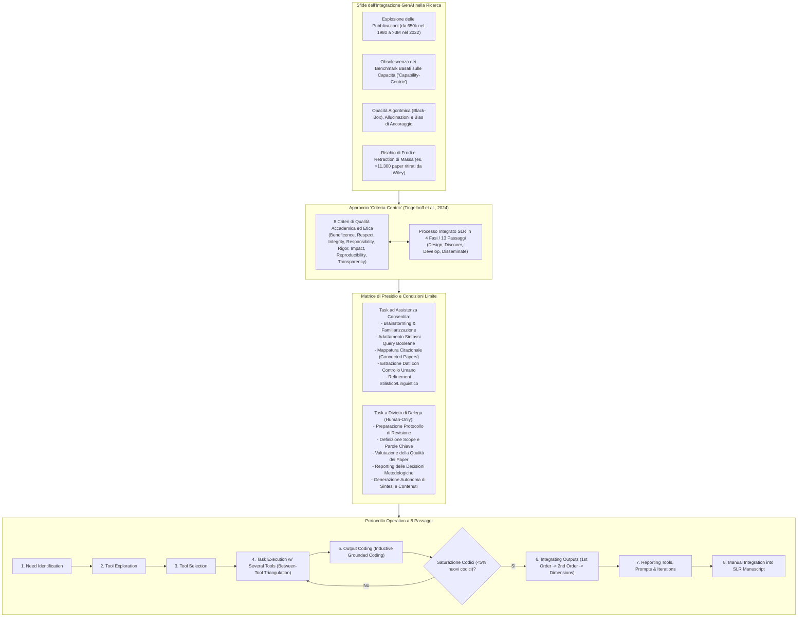
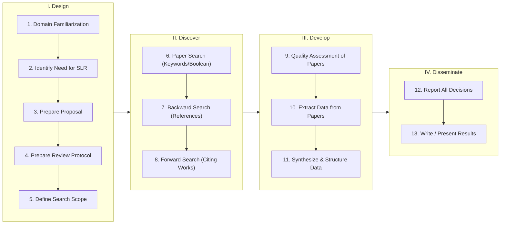
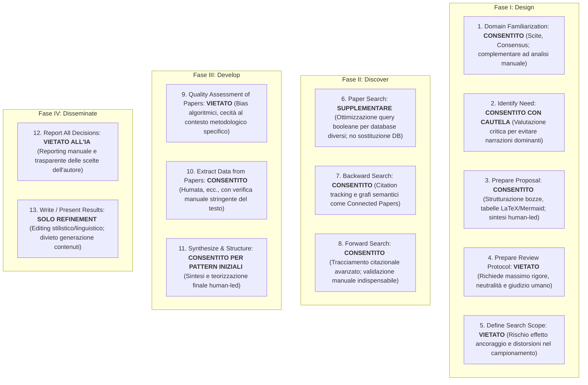
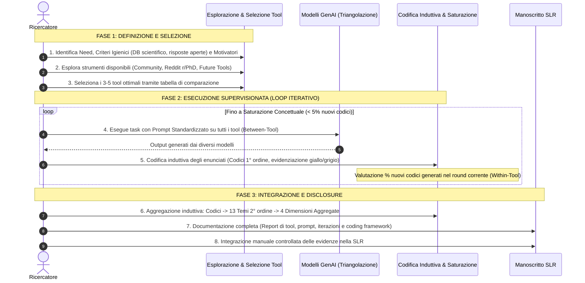
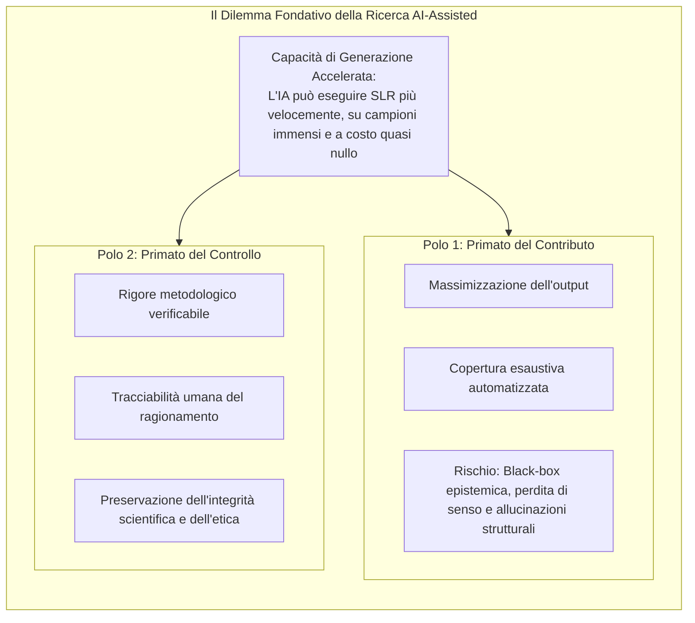

# A Guide for Structured Literature Reviews in Business Research: The State-of-the-Art and How to Integrate Generative Artificial Intelligence (Tingelhoff et al., 2024)

## Definizione Operativa
- Studio metodologico fondamentale condotto da Fabian Tingelhoff, Micha Brugger e Jan Marco Leimeister (Università di San Gallo e Università di Kassel, 2024; *Journal of Information Technology*, DOI: 10.1177/02683962241304105) che formalizza un framework unificato per la conduzione di **Revisioni Strutturate della Letteratura (SLR)** e stabilisce una guida operativa rigorosa per l'integrazione dell'Intelligenza Artificiale Generativa (GenAI).
- **Cambio di Paradigma ("Criteria-Centric" vs "Capability-Centric"):** Di fronte alla rapida obsolescenza delle valutazioni basate sulle capacità tecniche contingenti dei modelli (*"cosa può o non può fare l'IA"*), gli autori ribaltano la prospettiva focalizzandosi sui requisiti normativi della scienza: *"cosa dovremmo permettere all'IA di fare, indipendentemente dalle sue capacità attuali o future?"*.
- **Architettura del Framework:**
  1. *Sintesi del Processo SLR:* Unificazione dello stato dell'arte in **4 macro-fasi e 13 passaggi sequenziali** (Design, Discover, Develop, Disseminate).
  2. *Standard di Qualità Scientifica:* Consolidamento di **8 criteri normativi ed etici** (Beneficenza, Rispetto per le persone, Integrità, Responsabilità, Rigore, Impatto, Riproducibilità, Trasparenza) derivati dall'analisi delle linee guida di oltre 30 comitati etici e istituzioni accademiche di riferimento (IRB, DFG, AOM, AIS, Nature, JIT).
  3. *Mappatura Criteri-Processo e Condizioni di Divieto:* Identificazione puntuale delle fasi in cui la GenAI apporta benefici e delle fasi in cui il suo impiego è **esplicitamente controindicato o vietato** (stesura del protocollo, definizione dello scope di ricerca, valutazione della qualità metodologica dei paper, reporting delle decisioni, generazione autonoma dei contenuti).
  4. *Guida Operativa a 8 Stadi ("Cooking Recipe"):* Metodologia standardizzata per l'assistenza computazionale supervisionata basata su tre pilastri: adeguatezza strumento-compito (*Tool-Task Fit*), triangolazione tra strumenti indipendenti (*Between-Tool Comparison*) e saturazione concettuale iterativa ispirata alla Grounded Theory (*Within-Tool Comparison & Coding Saturation*).
  5. *Dilemma Epistemologico "Control vs Contribution":* Riflessione critica sul trade-off tra velocità/volume della conoscenza prodotta e mantenimento della tracciabilità, trasparenza e responsabilità umana nel processo di scoperta scientifica.

---

## Evidenze dalla Letteratura

### 1. Il Processo Integrato delle Revisioni Strutturate della Letteratura (SLR)

Dall'analisi comparativa dei modelli metodologici seminali (Snyder, 2019; Webster & Watson, 2002; Sauer & Seuring, 2023; Tranfield et al., 2003; vom Brocke et al., 2015; Fisch & Block, 2018), gli autori formalizzano una pipeline sequenziale in 4 macro-fasi e 13 passaggi operativi:

1. **Fase I: Design (Progettazione):**
   - *1. Familiarizzazione con il Dominio:* Acquisizione delle basi concettuali e dello stato dell'arte per orientare la ricerca.
   - *2. Identificazione della Necessità:* Giustificazione dell'utilità della review (consolidamento teorico, emersione di trend divergenti o sintesi interdisciplinare).
   - *3. Preparazione della Proposta:* Definizione degli obiettivi generali e allineamento con gli standard della comunità scientifica.
   - *4. Redazione del Protocollo di Revisione:* Formalizzazione a priori dei criteri di inclusione/esclusione, banche dati, strategie di ricerca e procedure di codifica.
   - *5. Definizione dello Scope di Ricerca:* Selezione dei termini chiave, sinonimi, operatori booleani (AND, OR, NOT) e filtri temporali/linguistici.
2. **Fase II: Discover (Scoperta):**
   - *6. Ricerca degli Articoli (Paper Search):* Esecuzione sistematica delle query nelle banche dati accademiche (Scopus, Web of Science, PubMed, AIS eLibrary).
   - *7. Ricerca a Ritroso (Backward Search):* Esame delle bibliografie degli articoli chiave inclusi per individuare i contributi fondativi.
   - *8. Ricerca in Avanti (Forward Search):* Analisi delle citazioni successive ricevute dai paper seminali (Google Scholar, Scopus) per catturare l'evoluzione contemporanea.
3. **Fase III: Develop (Sviluppo e Sintesi):**
   - *9. Valutazione della Qualità:* Screening metodologico, rigore della fonte (ranking delle riviste, solidità del design empirico) e rilevanza rispetto alla domanda di ricerca.
   - *10. Estrazione dei Dati:* Categorizzazione sistematica di domande di ricerca, campioni, metodologie, teorie e risultanze.
   - *11. Sintesi e Strutturazione dei Dati:* Identificazione di pattern, cluster concettuali, gap conoscitivi e costruzione di un modello integrato.
4. **Fase IV: Disseminate (Disseminazione):**
   - *12. Reporting delle Decisioni:* Documentazione trasparente e replicabile di tutte le scelte metodologiche, deviazioni dal protocollo e percorsi analitici.
   - *13. Scrittura e Presentazione dei Risultati:* Redazione del manoscritto, creazione di visualizzazioni grafiche/tabelle sintetiche e discussione delle implicazioni teoriche e pratiche.

---

### 2. Gli 8 Criteri di Qualità Accademica ed Etica

Attraverso l'analisi incrociata degli standard stabiliti da comitati etici nazionali (*US Institutional Review Board*, *Deutsche Forschungsgemeinschaft - DFG*), associazioni professionali (*Academy of Management - AOM*, *Association for Information Systems - AIS*) e riviste di punta (*Nature*, *Journal of Information Technology*), vengono isolati 8 pilastri normativi:

| Criterio di Qualità | Definizione e Rilevanza per le SLR | Implicazioni per l'Integrazione GenAI |
| :--- | :--- | :--- |
| **1. Beneficence (Beneficenza)** | Massimizzare il contributo positivo al benessere sociale e scientifico, bilanciando benefici e rischi etici identificati nella letteratura. | Evitare l'omologazione su narrazioni dominanti o ridondanti generate dall'IA, preservando l'originalità e l'impatto reale. |
| **2. Respect for Persons (Rispetto per le Persone)** | Tutela della privacy, del consenso informato e della proprietà intellettuale degli autori e dei soggetti dei dati primari. | Rispetto del copyright e confidenzialità nel caricamento di PDF o dati non pubblici su piattaforme commerciali chiuse. |
| **3. Integrity (Integrità)** | Onestà intellettuale assoluta; rifiuto categorico di fabbricazione, falsificazione, manipolazione o plagio delle fonti. | Controllo rigoroso contro le allucinazioni bibliografiche, citazioni inventate e campionamenti parziali/distorti da algoritmi black-box. |
| **4. Responsibility (Responsabilità)** | Assunzione di responsabilità personale e legale per ogni affermazione; attribuzione equa e accurata del lavoro altrui. | L'autore umano rimane il solo responsabile legale ed etico del manoscritto; divieto di attribuire co-autorato a strumenti GenAI. |
| **5. Rigor (Rigore)** | Aderenza metodologica sistematica, trasparente e accurata nell'identificazione, selezione e analisi delle evidenze. | Divieto di affidarsi a scorciatoie che sacrificano la completezza o la profondità analitica a favore della velocità computazionale. |
| **6. Impact (Impatto)** | Capacità della revisione di aprire nuove traiettorie teoriche, guidare le policy e informare la pratica professionale. | L'IA deve supportare la chiarezza espositiva senza impoverire l'originalità o restringere lo scope a cluster già iper-esplorati. |
| **7. Reproducibility (Riproducibilità)** | Possibilità per ricercatori indipendenti di replicare il processo di revisione giungendo alle medesime conclusioni a parità di dati. | Compensare la natura stocastica e non riproducibile dei modelli linguistici tramite registri di prompt, versioning e iterazioni multiple. |
| **8. Transparency (Trasparenza)** | Documentazione esplicita e aperta dell'intero percorso intellettuale, delle query, dei filtri e degli strumenti utilizzati. | Esplicitazione obbligatoria nel manoscritto di quali strumenti GenAI siano stati utilizzati, per quali scopi specifici e con quali prompt. |

---

### 3. Matrice di Integrazione GenAI: Opportunità, Rischi e Prescrizioni Metodologiche

Mappando gli 8 criteri di qualità sui 13 passaggi del processo SLR, Tingelhoff et al. (2024) stabiliscono una guida analitica per ciascuna fase (sintetizzata nella Tabella 1 del testo originale):

#### Dettaglio delle Prescrizioni per Step:

1. **Step 1 (Familiarizzazione):** Strumenti come *Scite Assistant* o *Consensus* permettono una rapida panoramica iniziale tramite tabelle e clustering. **Rischio:** Mancanza di trasparenza, affidamento a database limitati all'Open Access e date di cut-off. **Prescrizione:** Usare solo come punto di partenza, seguito da lettura manuale approfondita.
2. **Step 2 (Necessità della Review):** L'IA aiuta a identificare gap emergenti ed evidenziare studi interdisciplinari. **Rischio:** Tendenza dell'LLM a reiterare le narrative consolidate. **Prescrizione:** L'autore deve valutare criticamente la reale novità epistemologica.
3. **Step 3 (Proposta):** Ottimo supporto per formattazione di schemi, tabelle LaTeX o diagrammi Mermaid tramite linguaggio naturale. **Prescrizione:** Mantenere la concettualizzazione nelle mani del ricercatore.
4. **Step 4 (Protocollo di Revisione) — DIVIETO:** La stesura del protocollo richiede giudizio metodologico fine, pesatura non distorta dei criteri e trasparenza assoluta. L'IA non garantisce neutralità né ponderazione equa. **Prescrizione: Esecuzione esclusivamente manuale.**
5. **Step 5 (Definizione dello Scope) — DIVIETO:** La selezione manuale di keyword e banche dati previene l'effetto ancoraggio (*anchoring bias*; Tversky & Kahneman, 1974), in cui suggerimenti algoritmici parziali limitano il raggio della ricerca. **Prescrizione: Esecuzione manuale da parte dell'esperto di dominio.**
6. **Step 6 (Ricerca Articoli):** I modelli GenAI non possono sostituire i database accademici primari. Possono tuttavia tradurre query booleane complesse adattandole alla sintassi eterogenea di diversi motori (Scopus, Web of Science, PubMed) e suggerire sinonimi. **Prescrizione: Uso supplementare con controllo incrociato.**
7. **Step 7 & 8 (Backward & Forward Search):** Servizi basati su embedding e grafi citazionali (*Semantic Scholar*, *Research Rabbit*, *Connected Papers*) arricchiscono il tracciamento bibliografico identificando legami tematici oltre la citazione diretta. **Prescrizione: Validazione umana di pertinenza.**
8. **Step 9 (Valutazione della Qualità) — DIVIETO:** Nonostante alcuni studi abbiano esplorato l'LLM-reviewing (Drori & Te'eni, 2024), i modelli presentano gravi bias sistemici, privilegiano specifici stili di ricerca e non colgono le sottigliezze contestuali o metodologiche di uno studio. **Prescrizione: Valutazione manuale esclusiva da parte dei ricercatori.**
9. **Step 10 (Estrazione Dati):** Tool come *Humata* velocizzano l'estrazione ancorando visivamente i dati estratti ai paragrafi specifici del PDF, garantendo uniformità di schema. **Rischio:** Semplificazione eccessiva e perdita di sfumature. **Prescrizione: Verifica manuale riga per riga.**
10. **Step 11 (Sintesi e Strutturazione):** L'IA può identificare pattern trasversali su ampi volumi di testo (*ResearchGPT*, *Consensus*). **Prescrizione:** Utilizzare l'IA solo per lo scouting di pattern iniziali; l'integrazione concettuale, l'interpretazione critica e la formulazione teorica devono rimanere sotto il controllo umano.
11. **Step 12 (Reporting delle Decisioni) — DIVIETO:** La rendicontazione dell'uso dell'IA e delle scelte metodologiche deve essere compilata direttamente dagli autori per garantire trasparenza e responsabilità. **Prescrizione: Esecuzione manuale.**
12. **Step 13 (Scrittura dei Risultati):** Utilizzo legittimo di tool di editing linguistico (*Quillbot*, correttori stilistici) per migliorare chiarezza e accessibilità, specialmente per autori non madrelingua. **DIVIETO ASSOLUTO:** Generazione autonoma di testo o contenuti scientifici non elaborati dagli autori (prevenzione di frodi e ritrattazioni, come gli oltre 11.300 paper ritirati da Wiley per contenuti generati; Subbaraman, 2024).

---

### 4. Il Metodo Operativo a 8 Passaggi per l'Assistenza Scientifica della GenAI

Per ovviare all'uso amatoriale e privo di standard dell'IA (documentato da un sondaggio condotto dagli autori su 20 ricercatori internazionali), lo studio formalizza una guida in 8 stadi:

#### I Tre Pilastri Metodologici:
1. **Tool-Task Fit:** Identificazione preventiva di *criteri igienici* (requisiti inderogabili, es. connessione a database accademici peer-reviewed) e *motivatori* (funzionalità a valore aggiunto, es. export tabulare o filtri temporali).
2. **Between-Tool Comparison (Triangolazione dei Dati):** Esecuzione del medesimo prompt standardizzato su molteplici strumenti indipendenti (es. Scite, Elicit, SciSpace) per mitigare l'opacità delle banche dati proprietarie e neutralizzare i bias del singolo fornitore.
3. **Within-Tool Comparison & Coding Saturation (Grounded Theory):** Esecuzione ripetuta del prompt all'interno dello stesso strumento e codifica tematica induttiva degli output (Glaser & Strauss, 1968), proseguendo i cicli iterativi fino al raggiungimento della saturazione dei codici (soglia convenzionale: emersione di < 5% di nuovi codici per round; Guest et al., 2006; Braun & Clarke, 2021).

---

### 5. Caso Esemplificativo: Familiarizzazione sul "Metaverso nel Retail B2C"

Gli autori dimostrano l'efficacia pratica dell'approccio a 8 stadi applicandolo a un caso reale:

1. **Baseline Manuale:** Lettura approfondita di 2 paper di riferimento su riviste FT-50 (Hadi et al., 2023; Yoo et al., 2023) per stabilire la base concettuale di verifica.
2. **Screening dei Tool (da 11 a 3):** Esplorazione di 11 strumenti (Scite, Consensus, Elicit, SciSpace, Semantic Scholar, IrisAI, Copy AI, ChatGPT, Research Rabbit, ChatPDF, Scholarcy). Sette scartati per assenza di requisiti igienici (es. ChatGPT privo di DB scientifico diretto, ChatPDF incapace di rispondere a query aperte di dominio). *Consensus* scartato per ridondanza/divagazione. Selezionati i primi 3: **Scite, Elicit, SciSpace**.
3. **Prompt Standard:** *"How can organizations use the metaverse in the retail context?"*.
4. **Iterazioni e Saturazione:**
   - Round 1: 100% nuovi codici (28 codici di primo ordine).
   - Round 2–4: Progressiva riduzione della novità ed emersione di ripetizioni (colorate in grigio).
   - Round 5: Nuovi codici pari a solo il **5% (3 codici su 66 totali)** $\rightarrow$ Raggiunta la **saturazione concettuale**.
5. **Strutturazione Induttiva:** I 66 codici di primo ordine vengono aggregati in **13 temi di secondo ordine** (es. *Immersive Experiences*, *Novel Retail Features*, *Strategy*) e infine in **4 dimensioni aggregate** (*Retail Perspective*, *Business Perspective*, ecc.).
6. **Reporting ed Embedding:** Trasparenza totale nei materiali supplementari (Online Appendix con screenshot, prompt, matrici di coding) e integrazione manuale guidata nel razionale della SLR.

---

### 6. Dilemma Epistemologico: "Control versus Contribution"

Nel capitolo conclusivo *"Tough questions to ask: Control versus contribution"*, Tingelhoff et al. sollevano una questione epistemologica centrale per la comunità scientifica contemporanea:

- **La Domanda Chiave:** *"Se l'IA generativa è in grado di condurre revisioni della letteratura più rapidamente, con maggiore accuratezza apparente e su scale informative inaccessibili all'uomo, dobbiamo privilegiare l'espansione del contributo di conoscenza a qualunque costo, o dobbiamo salvaguardare il controllo umano e la tracciabilità del processo di scoperta scientifica?"*.
- **La Risposta degli Autori:** L'eccellenza di una review non risiede nella pura velocità computazionale o nella sintesi statistica di token, ma nella capacità umana di contestualizzazione critica, rilevazione di bias storici e assunzione di responsabilità etica. La GenAI deve rimanere un acceleratore cognitivo supervisionato (*Human-in-the-Loop*), mai un sostituto autonomo del pensiero critico del ricercatore.

---

## Riferimenti Bibliografici

- Tingelhoff, F., Brugger, M., & Leimeister, J. M. (2024). A guide for structured literature reviews in business research: The state-of-the-art and how to integrate generative artificial intelligence. *Journal of Information Technology*, 1–23. https://doi.org/10.1177/02683962241304105
- Braun, V., & Clarke, V. (2021). To saturate or not to saturate? Questioning data saturation as a useful concept for thematic analysis and sample-size rationales. *Qualitative Research in Sport, Exercise and Health*, 13(2), 201–216.
- Creswell, J. W., Clark, V. L. P., Gutmann, M. L., et al. (2003). Advanced mixed methods research designs. In A. Tashakkori & C. Teddlie (Eds.), *Handbook of Mixed Methods in Social & Behavioral Research* (pp. 209–240). SAGE Publications.
- Drori, I., & Te’eni, D. (2024). Human-in-the-Loop AI reviewing: Feasibility, opportunities, and risks. *Journal of the Association for Information Systems*, 25(1), 98–109.
- Fisch, C., & Block, J. (2018). Six tips for your (systematic) literature review in business and management research. *Management Review Quarterly*, 68, 103–106.
- Glaser, B. G., & Strauss, A. L. (1968). *The Discovery of Grounded Theory: Strategies for Qualitative Research*. Aldine.
- Guest, G., Bunce, A., & Johnson, L. (2006). How many interviews are enough? Experimenting with data saturation and variability. *Field Methods*, 18(1), 59–82.
- Hadi, R., Melumad, S., & Park, E. S. (2023). The metaverse: A new digital frontier for consumer behavior. *Journal of Consumer Psychology*, 34(1), 142–166.
- Okoli, C., & Schabram, K. (2015). A guide to conducting a systematic literature review of information systems research. *Communications of the Association for Information Systems*, 37, 879–910.
- Sauer, P. C., & Seuring, S. (2023). How to conduct systematic literature reviews in management research: A guide in 6 steps and 14 decisions. *Review of Managerial Science*, 17, 1899–1933.
- Snyder, H. (2019). Literature review as a research methodology: An overview and guidelines. *Journal of Business Research*, 104, 333–339.
- Tranfield, D., Denyer, D., & Smart, P. (2003). Towards a methodology for developing evidence-informed management knowledge by means of systematic review. *British Journal of Management*, 14(3), 207–222.
- Tversky, A., & Kahneman, D. (1974). Judgment under uncertainty: Heuristics and biases. *Science*, 185(4157), 1124–1131.
- vom Brocke, J., Simons, A., Riemer, K., et al. (2015). Standing on the shoulders of giants: Challenges and recommendations of literature search in information systems research. *Communications of the Association for Information Systems*, 37(1), 9.
- Wagner, G., Lukyanenko, R., & Paré, G. (2022). Artificial intelligence and the conduct of literature reviews. *Journal of Information Technology*, 37(2), 209–226.
- Webster, J., & Watson, R. T. (2002). Analyzing the past to prepare for the future: Writing a literature review. *MIS Quarterly*, 26(2), xiii–xxiii.
- Yoo, K., Welden, R., Hewett, K., et al. (2023). The merchants of meta: A research agenda to understand the future of retailing in the metaverse. *Journal of Retailing*, 99(2), 173–192.

---

## Related pages
- [[criteria-centric-genai-integration]]
- [[between-and-within-tool-triangulation]]
- [[eight-step-genai-research-workflow]]
- [[structured-literature-reviews]]
- [[guide-genai-literature-review]]
- [[tingelhoff-et-al-2024]]
- [[hybrid-ai-research-workflows]]
- [[gai-research-integrity-and-verification]]
- [[ai-research-ethics]]
- [[generative-ai-in-research]]
- [[large-language-models]]
- [[prompting-in-psychology]]
- [[bibliometric-analysis]]
- [[llm-assisted-synthesis]]
