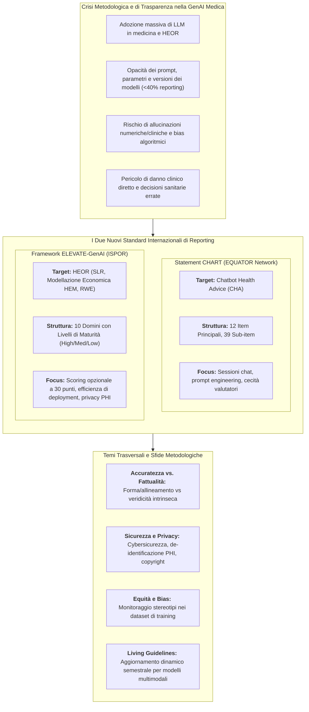
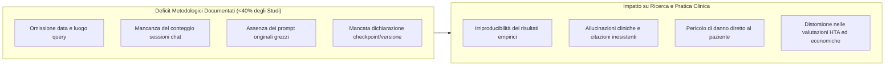
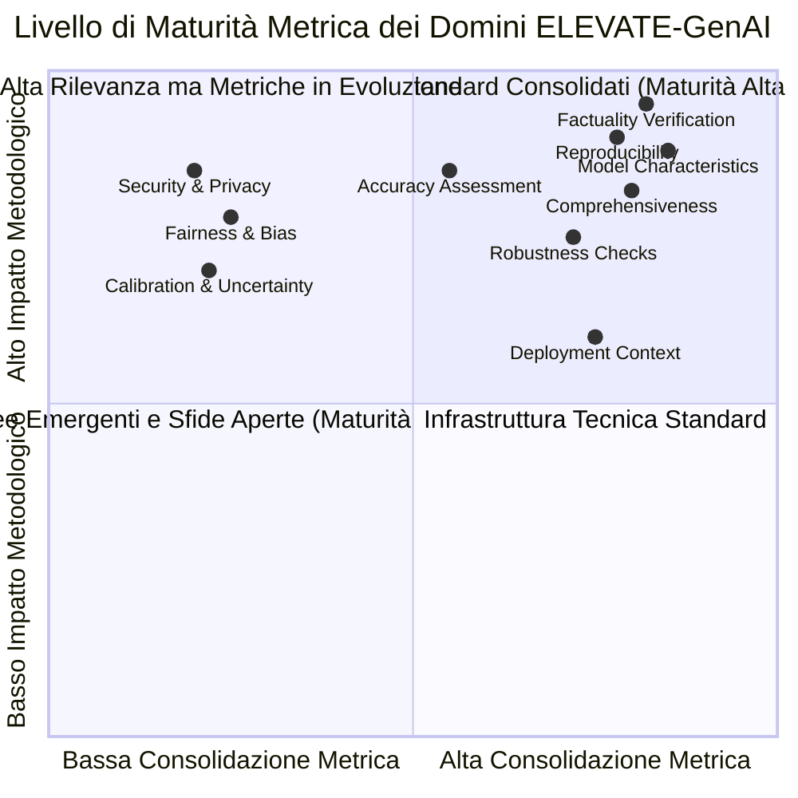

# Linee Guida per il Reporting dell'Intelligenza Artificiale Generativa in Medicina e Ricerca Economico-Sanitaria: Analisi dei Quadri CHART ed ELEVATE-GenAI

## Definizione Operativa
- Il documento costituisce un briefing metodologico comparativo dedicato all'analisi sinottica dei due principali quadri di riferimento internazionali per la rendicontazione scientifica dell'Intelligenza Artificiale Generativa ([[large-language-models|LLM]] e modelli di fondazione) nelle scienze mediche, cliniche ed economico-sanitarie:
  1. **Lo Statement [[chart-reporting-guideline|CHART]] (*Chatbot Assessment Reporting Tool*):** standard registrato presso la rete [[chart-reporting-guideline|EQUATOR Network]] per gli studi che valutano le prestazioni dei chatbot nell'erogazione di consigli sanitari e nella sintesi di evidenze cliniche (*Chatbot Health Advice - CHA studies*).
  2. **Il Framework [[elevate-genai-framework|ELEVATE-GenAI]] (*Evidence, Transparency, and Efficiency for Generative AI*):** standard sviluppato dal gruppo di lavoro ISPOR per l'impiego dei Large Language Models nell'Economia Sanitaria e nella Ricerca sugli Esiti (*Health Economics and Outcomes Research* - [[heor-generative-ai-validation|HEOR]]).
- **Scopo e Rationale Metodologico:** Rispondere alla crisi di riproducibilità, all'opacità dei protocolli di prompt engineering e al rischio clinico derivante da [[accuratezza-vs-fattualita-in-genai|allucinazioni e bias]] negli studi biomedici, fornendo a clinici, revisori paritari, comitati etici, agenzie di [[comparative-ai-health-governance|Health Technology Assessment (HTA)]] e autorità regolatorie una base strutturata per valutare la trasparenza e la sicurezza delle applicazioni di GenAI in sanità.

---

## Evidenze dalla Letteratura

### 1. Inquadramento del Problema: La Necessità di Standard Rigorosi
L'esplosione dell'intelligenza artificiale generativa e dei modelli linguistici di grandi dimensioni nella pratica clinica e nella ricerca sui risultati sanitari ha generato un'urgente necessità di standard di rendicontazione trasparenti e condivisibili:
- **Eterogeneità e Mancanza di Trasparenza:** Una revisione sistematica preliminare su 137 studi eleggibili su chatbot sanitari ha documentato che meno del **40%** degli articoli riportava elementi metodologici essenziali, quali la data esatta di esecuzione delle query, la collocazione geografica dei test o il numero di sessioni di chat indipendenti utilizzate.
- **Rischi per i Pazienti e per le Politiche Sanitarie:** L'omissione dei prompt grezzi, la mancata specificazione della versione del modello (checkpoint esatto, parametri stocastici come temperatura e top-p) e l'assenza di protocolli rigorosi di verifica della fattualità aumentano il rischio di propagazione di errori diagnostici, allucinazioni farmacologiche e bias nosografici, compromettendo la fiducia tra clinici, decisori politici e pazienti.

---

### 2. Lo Statement CHART (Chatbot Assessment Reporting Tool)

#### Metodologia di Sviluppo
Lo Statement CHART, annunciato alla fine del 2023 e pubblicato integralmente nel 2025, è stato sviluppato seguendo rigorosamente le linee guida metodologiche della rete **EQUATOR Network**:
1. **Revisione Sistematica:** Analisi approfondita di 137 studi eleggibili per identificare le variabili critiche di variabilità metodologica.
2. **Processo Delphi Modificato:** Coinvolgimento di **531 stakeholder internazionali** (clinici, metodologi, bioeticisti, informatici medici e pazienti).
3. **Consensus Panel Sincrono:** Tre riunioni strutturate di consenso con 48 esperti multidisciplinari per deliberare sugli item controversi.
4. **Test Pilota Iterativi:** Conduzione di round di piloting su studi CHA pubblicati per verificare chiarezza, applicabilità e saturazione degli item.

#### Struttura e Contenuti Chiave (12 Item Principali e 39 Sub-item)

| Categoria della Checklist | Elementi Critici e Requisiti di Reporting |
| :--- | :--- |
| **Identificatori del Modello** | Denominazione esatta, numero di versione/checkpoint, data di rilascio o di ultimo aggiornamento, indicazione della natura open-source (open weights) o commerciale/proprietaria. |
| **Dettagli del Modello** | Esplicitazione chiara dell'architettura e della natura del modello: modello di base (*base model*), modello ottimizzato (*tuned* via RAG / retrieval) o modello perfezionato (*fine-tuned* su corpus specialistici). |
| **Prompt Engineering** | Descrizione dettagliata dell'evoluzione e della cronologia dei prompt, fonti da cui sono stati tratti, numero e qualifica degli ingegneri dei prompt, eventuale coinvolgimento attivo di pazienti o pubblico (*patient and public involvement* - PPI). Fornitura obbligatoria dei testi grezzi. |
| **Strategia di Query** | Percorso di accesso (API vs interfaccia web), date e luoghi (città e paese) delle interrogazioni, impiego di sessioni di chat separate e indipendenti per prevenire il trascinamento del contesto (*context leakage*). |
| **Valutazione Performance** | Definizione operativa esplicita della *ground truth* (standard di riferimento clinico validato), accecamento (*blinding*) dei valutatori rispetto all'identità del modello, protocolli per la gestione di risposte mancanti, incomplete o non valide. |
| **Open Science & Etica** | Disponibilità pubblica dei dati grezzi, repository del codice e iperparametri del modello; dichiarazione trasparente dei conflitti di interesse, fonti di finanziamento e approvazione da parte di comitati etici. |

#### Ambito di Applicazione
- **Inclusione:** Studi in cui chatbot guidati da GenAI vengono interrogati per riassumere prove cliniche o fornire consigli sanitari diretti (prevenzione, diagnosi differenziale, percorsi terapeutici, comunicazione medico-paziente).
- **Esclusione e Integrazione:** Non si applica in via esclusiva a trial clinici randomizzati (RCT) o studi di coorte prospettici su pazienti reali, per i quali si raccomanda l'uso congiunto e integrato con linee guida consolidate come **CONSORT-AI** o **STROBE**.

---

### 3. Il Framework ELEVATE-GenAI per l'HEOR

#### Finalità e Contesto ISPOR
Sviluppato dall'**ISPOR Working Group on Generative AI**, ELEVATE-GenAI introduce uno standard specifico per l'uso dei Large Language Models nell'Economia Sanitaria e nella Ricerca sugli Esiti Clinici (*Health Economics and Outcomes Research* - [[heor-generative-ai-validation|HEOR]]), focalizzandosi su tre ambiti operativi ad alta intensità di calcolo:
1. **Revisioni Sistematiche della Letteratura (SLR):** Screening automatizzato di titoli/abstract, estrazione tabellare di evidenze, valutazione del rischio di bias.
2. **Modellazione Economica Sanitaria (HEM):** Generazione e validazione di script computazionali per modelli di Markov, alberi decisionali, analisi di costo-efficacia (ICER) e analisi di sensitività probabilistica.
3. **Generazione di Evidenze dal Mondo Reale (RWE):** Estrazione, pulizia e strutturazione di dati non strutturati da cartelle cliniche elettroniche (EHR), registri di patologia e referti narrativi.

#### I 10 Domini di Reporting e Livelli di Maturità Metrica

| Dominio ELEVATE-GenAI | Definizione e Requisiti Operativi di Reporting | Livello di Maturità Metrica |
| :--- | :--- | :---: |
| **1. Caratteristiche del Modello** | Documentazione dettagliata dell'architettura transformer, checkpoint, dataset di addestramento e metodi di accesso/licenza. | **Alta** |
| **2. Valutazione Accuratezza** | Misurazione dell'allineamento dell'output con benchmark umani o gold standard (es. Precision, Recall, F1 Score, metriche NLP). | **Media** |
| **3. Completezza (*Comprehensiveness*)** | Valutazione della copertura esaustiva di tutti gli aspetti del task (es. identificazione di tutti gli studi rilevanti in una SLR o di tutti gli stati di salute in un modello economico). | **Alta** |
| **4. Verifica Fattualità** | Identificazione puntuale di allucinazioni o citazioni inesistenti tramite protocolli sistematici di *cross-referencing* con fonti primarie verificate. | **Alta** |
| **5. Riproducibilità e Generalizzabilità** | Condivisione integrale di protocolli, codice di addestramento/inferenza, fraseggio esatto dei prompt, semi (*seed*) e iperparametri stocastici. | **Alta** |
| **6. Contesto di Deployment** | Specifiche hardware (es. GPU NVIDIA A100/H100), framework software (PyTorch, Docker) e metriche di efficienza economica/computazionale (latenza, costi API per token). | **Alta** |
| **7. Robustezza** | Test formali di resilienza del modello a perturbazioni dell'input (errori tipografici, formulazioni ambigue o prompt avversari). | **Alta** |
| **8. Equità e Bias (*Fairness*)** | Monitoraggio sistematico di stereotipi demografici o disparità nosografiche legate a genere, età o etnia tramite metriche di parità demografica (*demographic parity*). | **Bassa** |
| **9. Calibrazione e Incertezza** | Capacità del modello di esprimere quantitativamente il proprio livello di confidenza e definizione di soglie formali per la revisione manuale esperta (*human-in-the-loop*). | **Bassa** |
| **10. Sicurezza e Privacy** | Protocolli di crittografia, de-identificazione/anonimizzazione dei dati sanitari protetti (PHI) e conformità normativa (GDPR, HIPAA). | **Bassa** |

#### Sistema di Punteggio Opzionale (Scoring System a 30 Punti)
- Il framework introduce una scala quantitativa per l'autovalutazione della completezza del reporting su ciascuno dei 10 domini:
  - **3 punti:** *Chiaramente Riportato* (informazioni complete e verificabili);
  - **2 punti:** *Ambiguo / Parzialmente Riportato* (dati incompleti o vaghi);
  - **1 punto:** *Non Riportato* (totale assenza di menzione).
- **Avvertenza Metodologica:** Lo score riflette esclusivamente la **trasparenza del reporting**, non la qualità intrinseca o la validità metodologica delle conclusioni scientifiche dello studio.

---

### 4. Temi Trasversali e Sfide Metodologiche Fondamentali

```mermaid
flowchart TD
    subgraph AccuratezzaVsFattualita ["1. Accuratezza vs. Fattualità"]
        AF1["<b>Accuratezza:</b> Allineamento formale e stilistico ai benchmark attesi"]
        AF2["<b>Fattualità:</b> Veridicità intrinseca del contenuto & assenza di allucinazioni"]
        AF3["<i>Un riassunto può essere stilisticamente impeccabile ma contenere errori letali</i>"]
        AF1 & AF2 --> AF3
    end

    subgraph PrivacySicurezza ["2. Sicurezza dei Pazienti e Privacy Dati"]
        PS1["Protezione da esposizione di dati identificabili (PHI)"]
        PS2["Misure di cybersicurezza nei canali API/cloud"]
        PS3["Approvazione etica formale & rispetto del copyright sui dati"]
        PS1 & PS2 --> PS3
    end

    subgraph BiasEquita ["3. Bias Algoritmico ed Equità"]
        BE1["Rischio di informazioni fuorvianti per minoranze o sottogruppi"]
        BE2["Maturità metrica bassa: necessità urgente di reporting trasparente dei dataset"]
        BE1 --> BE2
    end

    subgraph LivingGuidelines ["4. Natura Dinamica delle Linee Guida (Living Guidelines)"]
        LG1["Evoluzione rapida dei modelli (da testuali a multimodali e agentici)"]
        LG2["Processi di revisione continua (es. revisioni semestrali per i primi 2 anni in CHART)"]
        LG1 --> LG2
    end
```

#### A. [[accuratezza-vs-fattualita-in-genai|Accuratezza vs. Fattualità]]
Entrambi i quadri insistono sulla demarcazione rigorosa tra due dimensioni spesso confuse:
- **Accuratezza:** Misura la conformità dell'output al task e ai risultati attesi (es. coerenza sintattica, aderenza alla struttura di una sintesi o metriche NLP superficiali).
- **Fattualità:** Riguarda la **veridicità intrinseca e la verificabilità empirica** del dato clinico o economico. Un modello può generare un testo fluido, formalmente perfetto e ben argomentato (alta accuratezza apparente) che contiene però allucinazioni critiche (es. dosaggi farmacologici inesistenti, citazioni bibliografiche inventate o parametri di transizione errati).

#### B. Sicurezza dei Pazienti e Protezione dei Dati Sensibili
- L'immissione di dati sanitari protetti (*Protected Health Information* - PHI) in prompt inviati a servizi cloud non verificati rappresenta una violazione deontologica e regolatoria gravissima.
- CHART ed ELEVATE-GenAI prescrivono l'esplicitazione dei protocolli di de-identificazione, dei contratti di elaborazione dati (DPA B2B con garanzia di non-riaddestramento), dell'approvazione etica e della legittimità nell'utilizzo di materiali coperti da copyright o paywall.

#### C. Bias, Equità e Disparità nei Dataset
- I LLM riflettono e possono amplificare disparità storiche, razziali, di genere o socioeconomiche radicate nei corpus di pretraining.
- Sebbene gli strumenti quantitativi di misurazione del bias nell'HEOR e nella medicina clinica siano ancora classificati a maturità "Bassa", la rendicontazione trasparente della demografia dei dataset di training e testing rappresenta il requisito minimo inderogabile.

#### D. [[living-guidelines-in-health-ai|Linee Guida "Living" (In Evoluzione Dinamica)]]
- A fronte della rapida transizione dai modelli puramente testuali ai Large Multimodal Models (LMM) e ai sistemi agentici autonomi, le linee guida statiche tradizionali diventano rapidamente obsolete.
- Sia CHART che ELEVATE-GenAI sono strutturate come **linee guida viventi (*Living Guidelines*)**, che integrano panel permanenti di esperti e cicli formali di revisione e aggiornamento periodico (es. revisioni semestrali pianificate per CHART nei primi due anni).

---

## Quadro Sinottico Comparativo: CHART vs. ELEVATE-GenAI

| Dimensione di Confronto | Statement CHART (2025) | Framework ELEVATE-GenAI (2025) |
| :--- | :--- | :--- |
| **Istituzione Promotrice** | Consorzio Internazionale / EQUATOR Network | ISPOR Working Group on Generative AI |
| **Ambito Primario** | Chatbot Health Advice (CHA) & Consulenza Clinica | Health Economics and Outcomes Research (HEOR) |
| **Casi d'Uso Tipici** | Sintesi prove cliniche per quesiti medici, triage, consigli terapeutici | SLR automatizzate, modelli di Markov (HEM), RWE da cartelle cliniche |
| **Architettura Strutturale** | 12 Item Principali + 39 Sub-item + Abstract Checklist | 10 Domini Metodologici + Quesiti Guida Operativi |
| **Metodologia di Consenso** | Systematic Review (137 studi), Delphi (531 esperti), Consensus Panel sincrono (48 esperti) | Scoping Review (522 record), sintesi HELM/Bedi, pilot test su 2 casi studio |
| **Classificazione Maturità** | Implicita nel livello di evidenza degli item | Esplicita per dominio (*High*, *Medium*, *Low*) |
| **Valutazione della Qualità** | Checklist descrittiva di trasparenza | Scoring System opzionale a 30 punti (1-3 per dominio) |
| **Interazione con Standard Esistenti**| Integrabile con CONSORT-AI e STROBE per trial/coorti | Integrabile con CHEERS, PRISMA-AI e TRIPOD-LLM |
| **Ciclo di Aggiornamento** | Living Guideline (Revisioni semestrali per 2 anni) | Living Framework con Delphi iterativo futuro |

---

## Implicazioni Pratiche per la Ricerca e la Pubblicazione Biomedica

1. **Per i Ricercatori:** Adozione obbligatoria delle checklist fin dalla fase di protocollo sperimentale, garantendo il congelamento dei seed, la registrazione dei prompt grezzi e l'esecuzione di verifiche di fattualità indipendenti.
2. **Per i Peer Reviewer ed Editor:** Utilizzo degli standard CHART ed ELEVATE-GenAI per filtrare studi affetti da opacità metodologica, verificando che gli abstract contengano identificatori di versione precisi e che le dichiarazioni di accuratezza siano disaccoppiate dai controlli di fattualità.
3. **Per le Autorità Regolatorie e HTA (FDA, EMA, NICE):** Definizione di requisiti di sottomissione che esigano la tracciabilità delle pipeline GenAI utilizzate per generare evidenze a supporto di dossier di rimborso, approvazione di farmaci o dispositivi medici.

---

## Voci Correlate
- [[CHART2025|CHART Statement 2025 (Analisi Dettagliata)]]
- [[ELEVATE-GenAI2025|ELEVATE-GenAI 2025 (Linee Guida ISPOR per HEOR)]]
- [[chart-reporting-guideline|CHART Reporting Guideline]]
- [[elevate-genai-framework|ELEVATE-GenAI Framework]]
- [[accuratezza-vs-fattualita-in-genai|Accuratezza vs. Fattualità nei Modelli di Intelligenza Artificiale]]
- [[living-guidelines-in-health-ai|Living Guidelines nell'Intelligenza Artificiale Sanitaria]]
- [[heor-generative-ai-validation|Validazione della GenAI nell'Economia Sanitaria (HEOR)]]
- [[gai-research-integrity-and-verification|Integrità della Ricerca e Verifica della GenAI]]
- [[traffic-light-quality-appraisal-clinical-ai|Traffic Light Quality Appraisal per l'IA Clinica]]
- [[GAMER2025|GAMER Reporting Guideline (Generative AI in Medical Education)]]
- [[comparative-ai-health-governance|Governance Comparativa dell'IA in Sanità]]
- [[large-language-models|Large Language Models (LLM)]]
