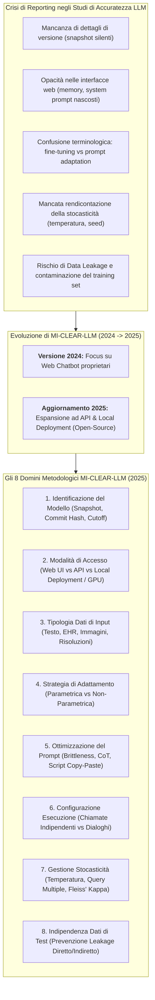
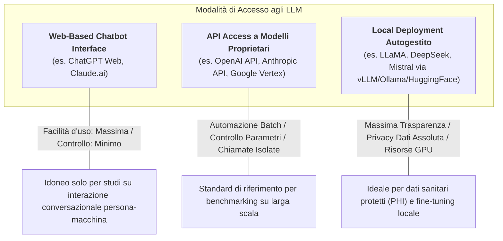
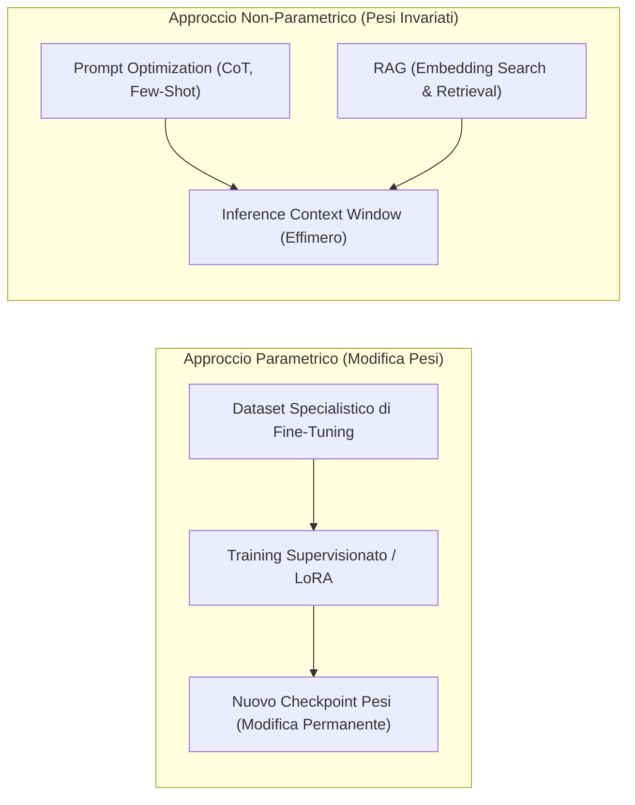

# Minimum Reporting Items for Clear Evaluation of Accuracy Reports of Large Language Models in Healthcare (MI-CLEAR-LLM): 2025 Updates (Park et al., 2025)

## Definizione Operativa
- Il **MI-CLEAR-LLM (2025 Updates)** (*MInimum reporting items for CLear Evaluation of Accuracy Reports of Large Language Models in healthcare*) è una linea guida metodologica standardizzata progettata per garantire la trasparenza, la completezza e la riproducibilità degli studi clinici che valutano l'accuratezza diagnostica e prestazionale dei Large Language Models (LLM) e Large Multimodal Models (LMM) in sanità, pubblicata su *Korean Journal of Radiology* (2025; 26(12):1123-1132; doi: 10.3348/kjr.2025.1522) da un consorzio internazionale guidato da Seong Ho Park, Chong Hyun Suh, Jeong Hyun Lee, Ali S. Tejani, Seng Chan You, Charles E. Kahn, Jr e Linda Moy.
- **Evoluzione dallo Standard 2024:** Rispetto alla prima versione del 2024 — incentrata prevalentemente su LLM proprietari interrogati tramite interfacce chatbot web (es. ChatGPT) —, l'aggiornamento 2025 estende formalmente i requisiti di rendicontazione all'uso di **Application Programming Interfaces (APIs)** e a **modelli open-source/open-weight autogestiti tramite deployment locale** (es. famiglie LLaMA, DeepSeek, Mistral, Gemma, Phi-3).
- **Ruolo Metodologico Complementare:** A differenza dei framework ad ampio spettro strutturale (come [[TRIPOD-LLM]], [[DEAL]] o [[chart-reporting-guideline|CHART]], che coprono l'intero manoscritto dall'abstract alle conclusioni e includono elementi generici di IA clinica), MI-CLEAR-LLM si concentra in modo mirato e pratico sulle determinanti metodologiche specifiche dei modelli linguistici: identificazione rigorosa, modalità di accesso, tipologia dei dati di input, strategie di adattamento (parametriche vs non-parametriche), ottimizzazione dei prompt, configurazione di esecuzione, gestione della stocasticità e indipendenza dei dati di test per prevenire il data leakage.

---

## Evidenze dalla Letteratura

### 1. Inquadramento del Problema: La Crisi di Riproducibilità nelle Valutazioni di Accuratezza LLM
Negli ultimi anni si è assistito a una proliferazione esponenziale di studi volti a misurare l'accuratezza clinica degli LLM in compiti quali:
1. Risoluzione di quesiti diagnostici complessi (*case vignettes*, quiz specialistici, esami di abilitazione medica).
2. Generazione di diagnosi differenziali strutturate da anamnesi ed esami di laboratorio.
3. Interpretazione ed estrazione di informazioni da referti radiologici non strutturati (es. classificazione LI-RADS, resecabilità oncologica).
4. Semplificazione e traduzione di lettere di dimissione per i pazienti.

Tuttavia, recenti revisioni sistematiche (Huo et al., 2025; Ko et al., 2025; Suh et al., 2024) hanno documentato gravi carenze metodologiche nella letteratura, persino nelle riviste a più alto impatto:
- **Eterogeneità degli Snapshot:** L'indicazione generica di aver utilizzato un modello (es. "GPT-4o") omette la specifica versione o snapshot (es. `gpt-4o-2024-05-13`, `gpt-4o-2024-08-06`, `gpt-4o-2024-11-20`), introducendo discrepanze silenti dovute ai continui aggiornamenti dei fornitori.
- **Opacità delle Interfacce Chatbot:** Le sessioni web commerciali integrano memorie inter-sessione e prompt di sistema invisibili che alterano la generalizzabilità dei risultati.
- **Inadeguata Rendicontazione della Stocasticità:** Oltre il 60% degli studi non riporta i parametri di casualità (temperatura, top-p) né il numero di interrogazioni ripetute.
- **Ambiguità Terminologica:** L'uso improprio del termine "fine-tuning" per indicare semplici aggiustamenti di prompt o strategie di in-context learning genera confusione tra modifiche permanenti ai pesi e contesti effimeri.

---

### 2. La Checklist MI-CLEAR-LLM (2025): Gli 8 Domini Essenziali

La Tabella 1 dello standard definisce la griglia minima di elementi che ogni studio di accuratezza deve esplicitare:

| Categoria | Elementi Essenziali di Reporting | Razionale Metodologico e Tecnico |
| :--- | :--- | :--- |
| **1. Model Identification** | • Nome esatto, versione specifica (snapshot/release tag) e sviluppatore. • Modello proprietario vs open-source. • Per modelli proprietari: data esatta di accesso e di esecuzione delle query. • Per modelli open-source locali: modifiche architetturali, fonte dei pesi, commit hash. • Condivisione del modello eseguibile con URL a repository pubblico (se fattibile). • Data di cutoff dei dati di addestramento (se nota). | Consente la replicabilità esatta. Piccole variazioni di implementazione, quantizzazione o versione producono comportamenti divergenti. |
| **2. Access Mode** | • Metodo di accesso: Chatbot web, API o deployment locale autogestito. • Rationale per la scelta della modalità di accesso. • Dichiarazione di funzionalità a livello di sistema note (system prompt, intersession memory). • Per deployment locale: specifiche dell'ambiente computazionale (tipo di GPU, memoria VRAM). | Le modalità di accesso differiscono per controllo dei parametri, isolamento delle query, sicurezza dei dati e trasparenza comportamentale. |
| **3. Input Data Type** | • Dettagli sufficienti sul formato e sul tipo di dati utilizzati nei o con i prompt di input (testo non strutturato, cartelle cliniche elettroniche, tabelle di laboratorio, immagini radiologiche, screenshot, risoluzione in pixel). | Permette ai lettori di ricostruire fedelmente l'esposizione multimodale o testuale sottoposta all'algoritmo. |
| **4. Adaptation Strategy Used** | • Specifica esplicita del metodo di adattamento: indicare chiaramente se i pesi interni sono stati modificati (**approccio parametrico**, es. fine-tuning) oppure no (**approccio non-parametrico**, es. prompt optimization, RAG). • Uso di terminologia rigorosa: "adaptation data" o "prompt development data" (evitando "training data" per contesti non parametrici). • Descrizione metodologica dettagliata del processo di adattamento. | L'adattamento parametrico altera permanentemente il modello; quello non-parametrico influenza solo la sessione specifica e richiede la replicazione esatta del contesto. |
| **5. Prompt Optimization Procedures** | • Passaggi operativi per la creazione e l'iterazione dei prompt. • Rationale della scelta dei termini (terminologia standardizzata, aderenza a linee guida cliniche). • Tecniche esplicite impiegate: *chain-of-thought* (CoT), *reflection prompting*, *instruction prompting*, *few-shot in-context learning*. • Testo integrale e direttamente eseguibile (*copy-paste ready*) dei prompt rappresentativi (o script completo nei supplementari). • Rendicontazione del numero di iterazioni e delle versioni provvisorie/fallimentari (*negative reporting*). | Fenomeno della **prompt brittleness**: variazioni lessicali minime modificano drasticamente l'output clinico. Il negative reporting evita sprechi di ricerca ridondanti. |
| **6. Prompt Execution Setup** | • Configurazione di invio delle query:   - Chatbot web: domande inserite simultaneamente o sequenzialmente nel corso di un dialogo (con accumulo di contesto).   - API: chiamate indipendenti e isolate vs dialogo artificialmente concatenato. • Condivisione dello script sperimentale completo di esecuzione nei supplementi. | L'interazione conversazionale accumula memoria di contesto (*context leakage*), compromettendo la valutazione di quesiti clinici indipendenti. |
| **7. Stochasticity Management** | • Impostazione dei parametri tecnici che regolano la casualità (temperatura, top-p, greedy search decoding). • Numero di query ripetute per ciascun input. • Metodo di sintesi delle risposte multiple (maggioranza, media punteggi, almeno una risposta corretta, prima risposta) e relativo rationale. • Analisi quantitativa dell'affidabilità/consistenza dell'output su tentativi ripetuti (Fleiss' kappa, coefficiente di variazione, AUROC). | Gli LLM sono modelli probabilistici generativi: a parità di prompt possono fornire output divergenti. La gestione della stocasticità misura la robustezza clinica. |
| **8. Independence of Test Data** | • Dichiarazione trasparente di qualsiasi sovrapposizione tra dati di test e dati di addestramento/adattamento. • Natura e fonte dei dataset di adattamento e di test. • Accecamento (*blinding*) dei ricercatori che ottimizzano i prompt rispetto al test set per evitare leakage indiretto. • Per dati reperiti online: URL esatti, accessibilità pubblica e rischio di pregressa inclusione nel corpus di pretraining del modello di fondazione. | Previene il **data leakage** (diretto e indiretto) e la sovrastima artificiosa dell'accuratezza diagnostica del modello. |

---

### 3. Confronto Sistematico tra le Modalità di Accesso

La scelta della modalità di accesso (Tabella 2 di Park et al., 2025) condiziona profondamente la validità metodologica e la sicurezza etica dello studio:

| Caratteristica | Interfaccia Web Chatbot (es. ChatGPT) | Accesso API a Modelli Proprietari (es. OpenAI API) | Deployment Locale Autogestito (es. LLaMA, DeepSeek) |
| :--- | :--- | :--- | :--- |
| **Facilità d'uso** | Molto semplice; nessuna competenza di programmazione. | Richiede competenze di base di programmazione/scripting. | Richiede competenze tecniche avanzate per configurazione e gestione. |
| **Personalizzazione e Controllo** | Minima; impostazioni e prompt di sistema predefiniti e opachi. | Elevata: controllo su iperparametri (temperatura), formato di output (JSON) e RAG. | Massima: controllo completo di pesi, iperparametri, quantizzazione e fine-tuning. |
| **Trasparenza del Comportamento** | Può includere funzioni opache (memoria intersessione, system prompt dinamici). | Comportamento trasparente e controllabile tramite payload espliciti. | Pienamente trasparente; ogni componente è controllato dall'utente. |
| **Elaborazione Batch (Batch Processing)** | Non supportata o molto limitata; inserimento manuale. | Pienamente supportata; ideale per automazione su ampi dataset. | Pienamente supportata; flussi di lavoro personalizzabili. |
| **Sicurezza e Privacy dei Dati** | Dati inviati a server esterni proprietari (rischio conformità PHI/HIPAA/GDPR). | Dati inviati a server esterni (ma con policy di non-retention/enterprise API). | I dati rimangono completamente in locale; massimo livello di sicurezza e riservatezza. |
| **Struttura dei Costi** | Spesso gratuita o con abbonamento fisso mensile. | Tariffazione a consumo basata su token (può diventare onerosa su larga scala). | Costi di utilizzo marginali nulli dopo il setup; richiede investimenti hardware (GPU). |

---

### 4. Analisi Approfondita dei Domini Metodologici Chiave

#### A. Strategie di Adattamento: Distinzione Parametrica vs Non-Parametrica
Park et al. (2025) sottolineano la necessità di eliminare la confusione terminologica nella letteratura clinica:
- **Adattamento Parametrico (*Parametric Adaptation*):** Modifica strutturalmente i pesi sinaptici interni del modello mediante un processo di addestramento supervisionato aggiuntivo (*fine-tuning*, *instruction-tuning* su dataset specialistici, es. coppie reperto-impressione radiologica). Tali modifiche sono permanenti e insite nel checkpoint del modello.
- **Adattamento Non-Parametrico (*Non-Parametric Adaptation*):** Non modifica i pesi interni del modello, ma ne guida il comportamento attraverso il contesto inserito nel prompt (*prompt engineering*, *few-shot learning*, *system instructions*) o mediante il recupero dinamico di documenti esterni (*Retrieval-Augmented Generation* - RAG). Tali effetti sono puramente effimeri e dipendono interamente dall'infrastruttura di querying.
- **Raccomandazione Terminologica:** I ricercatori devono evitare di usare espressioni come *"fine-tuning"* o *"training data"* per descrivere la fase di ottimizzazione dei prompt; è mandatorio utilizzare definizioni come **"adaptation data"** o **"prompt development data"**.

#### B. Prompt Optimization e Fenomeno della "Prompt Brittleness"
I modelli linguistici manifestano una marcata suscettibilità alla formulazione lessicale e sintattica del prompt (**prompt brittleness**):
- Come dimostrato da Lee & Shin (2024), la minima variazione tra *"Calculate the LI-RADS category"* e *"Determine the LI-RADS category"* produce differenze statisticamente significative nell'accuratezza diagnostica dell'LLM.
- **Requisiti di Trasparenza:** Lo standard richiede agli autori di pubblicare il testo esatto, integrale e direttamente eseguibile (*copy-paste ready*) dei prompt utilizzati, inclusi gli eventuali ruoli assegnati (*"You are an experienced radiologist..."*), il formato di output vincolato (es. schema JSON) e la cronologia delle iterazioni di ottimizzazione.
- **Negative Reporting:** La documentazione dei prompt fallimentari e delle formulazioni scartate è incoraggiata per arricchire il corpus di conoscenze metodologiche della comunità scientifica.

#### C. Gestione della Stocasticità e Ripetibilità Clinica
A differenza degli algoritmi di machine learning deterministici tradizionali, gli LLM generano risposte campionando token successivi secondo una distribuzione di probabilità:
- **Controllo degli Iperparametri:** L'uso di temperature basse ($T = 0$) o decodifica *greedy* massimizza il determinismo, ma non elimina completamente le oscillazioni nei modelli serviti via API multi-tenant o con architetture Mixture-of-Experts (MoE).
- **Protocolli di Querying Ripetuto:** Per valutare la robustezza, i ricercatori possono sottomettere lo stesso input più volte (es. 3 o 5 sessioni indipendenti) e calcolare indici di concordanza inter-sessione:
  - **Fleiss' Kappa:** Per quantificare la consistenza diagnostica tra sessioni ripetute.
  - **Coefficient of Variation (CV):** Per misurare la stabilità di stime di rischio numeriche (es. rischio cardiovascolare a 10 anni).
  - **Metodi di Sintesi Esplicitati:** Votazione a maggioranza (*majority voting*), punteggio medio, o presenza della diagnosi corretta tra le prime $N$ ripetizioni.

#### D. Indipendenza dei Dati e Prevenzione del Data Leakage
La validità interna ed esterna degli studi di accuratezza è minacciata da tre forme di contaminazione:
1. **Data Leakage Diretto:** Sovrapposizione materiale tra i casi utilizzati per sviluppare/ottimizzare i prompt (o addestrare il modulo RAG/fine-tuning) e i casi utilizzati per il test finale. È richiesta una netta separazione tra *prompt development set* e *test set*.
2. **Data Leakage Indiretto:** Ricercatori che progettano i prompt conoscendo già i casi di test possono involontariamente inserire indizi o strutture che favoriscono la risoluzione di quel test specifico. Lo standard raccomanda l'accecamento (*blinding*) dei prompt engineer rispetto al test cohort.
3. **Contaminazione del Corpus di Pretraining (Web Scraping):** Poiché i modelli di fondazione sono addestrati su vasti archivi web, banche dati di quiz clinici o articoli di riviste liberamente accessibili online potrebbero essere già stati memorizzati nei pesi del modello. Gli autori devono documentare la fonte dei casi, gli URL e valutare la probabilità di pregressa esposizione.

---

### 5. Esempi Pratici di Reporting Estratti dalla Letteratura

L'articolo di Park et al. (2025) fornisce una casistica di best practice citate direttamente dalla letteratura recente:
- **Identificazione e Cutoff:** *“For pilot testing, we selected several established open-weight models from the LMSYS Chatbot Arena: Phi-3-mini (Oct 2023 cutoff), Mistral-7B-v0.3, Llama-3-8b-instruct (Mar 2023 cutoff), Llama-3-70b-instruct (Dec 2023 cutoff)...”* (Lee et al., 2025).
- **Local Deployment & Risorse GPU:** *“Running the Llama 3.2-11B-Vision model requires at least 22 GB GPU memory, whereas Llama 3.2-90B-Vision requires at least 180 GB GPU memory. A single 80-GB Nvidia A100 was used for the 11B model, and three 80-GB Nvidia A100 GPUs for the 90B model via distributed inference...”* (Hou et al., 2025).
- **Indipendenza delle Chiamate API:** *“Using the API eliminated the bias that could result from ChatGPT’s ability to reference previous requests.”* (Kim et al., 2024).
- **Quantizzazione e Decoding Deterministico:** *“Model responses were constrained to JSON format. Greedy search decoding was applied to ensure deterministic output. Quantization was applied: 4-bit for Llama-3-70b and 8-bit for Gemma-2-27b.”* (Lee et al., 2025).
- **Separazione Rigorosa dei Dati:** *“Three radiologists generated 160 fictitious liver MRI reports: 20 were used for prompt engineering, and 140 formed the internal test cohort. 72 genuine reports formed the external cohort.”* (Gu et al., 2024).

---

## Implicazioni Metodologiche, Cliniche e Regolatorie

1. **Prerequisito per la Validazione come Dispositivo Medico (SaMD):** Gli enti regolatori (FDA, EMA, MFDS) richiedono evidenze verificabili sulla stabilità stocastica, sull'assenza di leakage e sulla tracciabilità dei modelli; MI-CLEAR-LLM fornisce la struttura di reporting indispensabile per i dossier regolatori.
2. **Integrazione con le Macro-Linee Guida Internazionali:**
   - **[[TRIPOD-LLM]]:** Standard globale per studi predittivi e prognostici con LLM.
   - **[[DEAL]]:** Checklist per lo sviluppo, valutazione e assessment tecnico di modelli fondazionali in medicina (*NEJM AI*).
   - **[[chart-reporting-guideline|CHART Statement]]:** Linea guida EQUATOR focalizzata su studi di consulenza sanitaria al paziente tramite chatbot generativi.
   - **MI-CLEAR-LLM:** Fornisce la micro-specificazione metodologica indispensabile per gli aspetti operativi (prompting, API, stocasticità, hardware).
3. **Standardizzazione della Peer Review nelle Riviste Mediche:** L'adozione della checklist a 8 item da parte degli editor consente di identificare tempestivamente bias metodologici, snapshot non tracciati e allucinazioni non controllate.

---

## Riferimenti Bibliografici
- Park, S. H., Suh, C. H., Lee, J. H., Tejani, A. S., You, S. C., Kahn, C. E., Jr., & Moy, L. (2025). Minimum reporting items for clear evaluation of accuracy reports of large language models in healthcare (MI-CLEAR-LLM): 2025 updates. *Korean Journal of Radiology*, 26(12), 1123–1132. https://doi.org/10.3348/kjr.2025.1522
- Park, S. H., Suh, C. H., Lee, J. H., Kahn, C. E., & Moy, L. (2024). Minimum reporting items for clear evaluation of accuracy reports of large language models in healthcare (MI-CLEAR-LLM). *Korean Journal of Radiology*, 25(10), 865–868. https://doi.org/10.3348/kjr.2024.0327
- Park, C. R., Heo, H., Suh, C. H., & Shim, W. H. (2025). Uncover this tech term: Application programming interface for large language models. *Korean Journal of Radiology*, 26(9), 793–796.
- Ko, J. S., Heo, H., Suh, C. H., Yi, J., & Shim, W. H. (2025). Adherence of studies on large language models for medical applications published in leading medical journals according to the MI-CLEAR-LLM checklist. *Korean Journal of Radiology*, 26(4), 304–312.
- Suh, C. H., Yi, J., Shim, W. H., & Heo, H. (2024). Insufficient transparency in stochasticity reporting in large language model studies for medical applications in leading medical journals. *Korean Journal of Radiology*, 25(11), 1029–1031.
- Gallifant, J., Afshar, M., Ameen, S., et al. (2025). The TRIPOD-LLM reporting guideline for studies using large language models. *Nature Medicine*, 31(1), 60–69.
- Tripathi, S., Alkhulaifat, D., Doo, F. X., et al. (2025). Development, evaluation, and assessment of large language models (DEAL) checklist: A technical report. *NEJM AI*, 2(1), AIp2401106.
- CHART Collaborative. (2025). Reporting guideline for chatbot health advice studies: The CHART statement. *JAMA Network Open*, 8(8), e2530220.
- Lee, J. H., & Shin, J. (2024). How to optimize prompting for large language models in clinical research. *Korean Journal of Radiology*, 25(10), 869–873.

---

## Related pages
- [[mi-clear-llm-guideline]]
- [[stochasticity-management-in-clinical-llms]]
- [[chart-reporting-guideline]]
- [[CHART2025]]
- [[elevate-genai-framework]]
- [[ELEVATE-GenAI2025]]
- [[gamer-reporting-guideline]]
- [[GAMER2025]]
- [[Linee_Guida_Reporting_AI_Generativa_CHART_ELEVATE]]
- [[living-guidelines-in-health-ai]]
- [[chai-blueprint-health-ai]]
- [[clinical-fidelity-assessment]]
- [[single-task-zero-shot-evaluation-trap]]
- [[traffic-light-quality-appraisal-clinical-ai]]
- [[power-safety-paradox]]
- [[prompting-in-psychology]]
- [[large-language-models]]
- [[open-weight-privacy-compliant-synthesis]]
- [[gdpr-governance-mental-health-ai]]
- [[software-as-a-medical-device-salute-mentale]]
