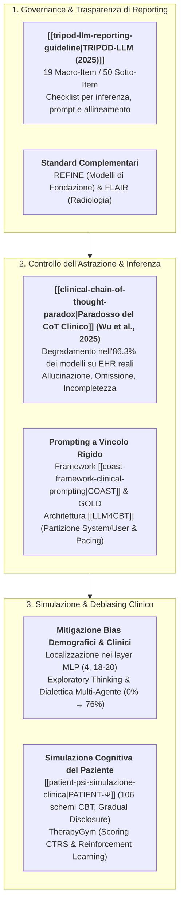
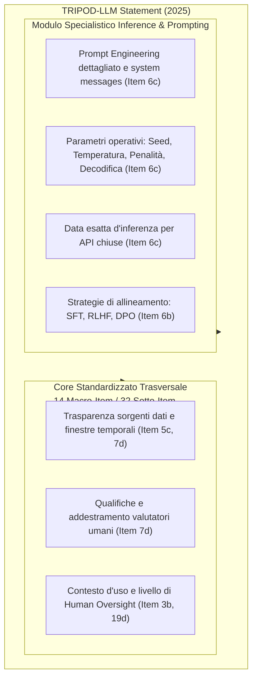
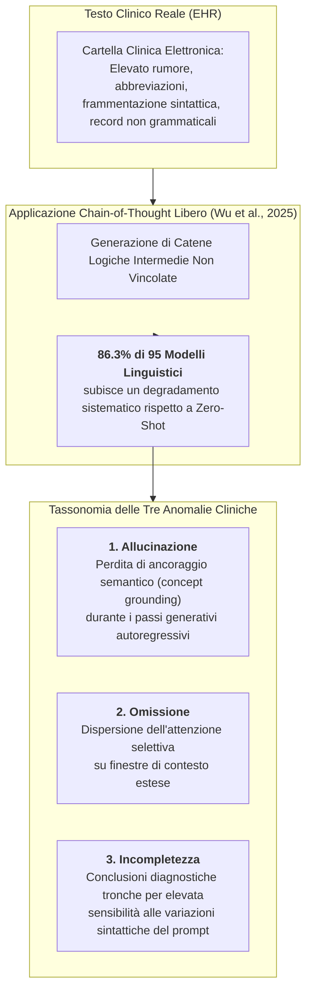
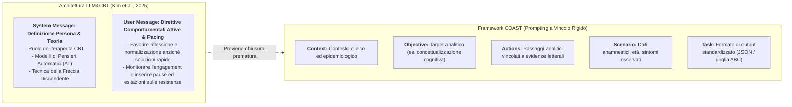
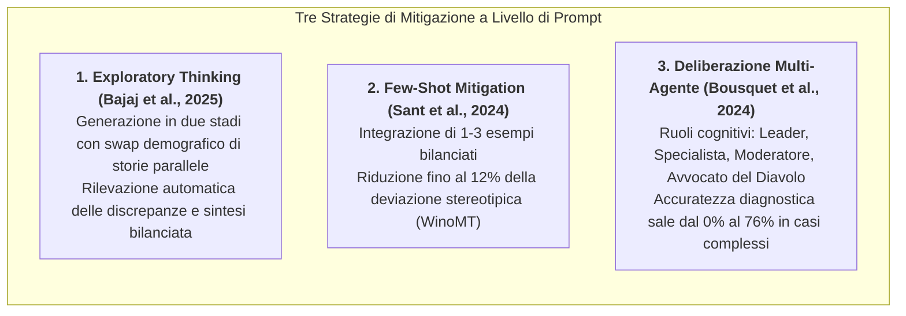
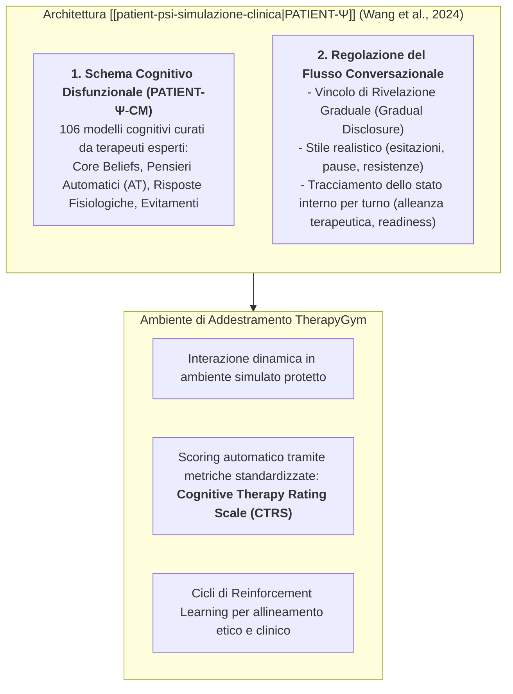

# Analisi dei Framework di Prompting Strutturato in Ambito Clinico e Sanitario

**Summary**: Documento di analisi sistematica e rassegna metodologica sullo stato dell'arte del prompt engineering e dei framework di inferenza strutturata applicati alla medicina, alla documentazione clinica (EHR/SOAP) e alla psicoterapia generativa. Il testo approfondisce lo standard internazionale di rendicontazione **[[tripod-llm-reporting-guideline|TRIPOD-LLM]]** (estensione 2025 di TRIPOD+AI), dimostra empiricamente il **[[clinical-chain-of-thought-paradox|paradosso del Chain-of-Thought (CoT) clinico]]** (degradamento delle prestazioni nell'86.3% dei modelli su cartelle elettroniche reali a causa dell'accumulo di errori non vincolati), esamina le architetture terapeutiche basate su partizione System/User e pacing (**[[LLM4CBT]]**, **[[coast-framework-clinical-prompting|COAST]]**), delinea i meccanismi neurali e le strategie di mitigazione dei bias demografici nei layer MLP intermedi (**Exploratory Thinking**, deliberazione **Multi-Agente**) e presenta i paradigmi di simulazione avanzata del paziente (**[[patient-psi-simulazione-clinica|PATIENT-Ψ]]**, **TherapyGym**).
**Sources**: `Ricerca Prompting LLM Clinico Sanitario.pdf` (Rassegna metodologica e tavola sinottica della letteratura clinico-computazionale 2024-2026).
**Last updated**: 2026-08-28
---

## Definizione Operativa e Inquadramento Generale

L'adozione dei [[large-language-models|Modelli Linguistici di Grandi Dimensioni (LLM)]] in medicina e psicoterapia ha evidenziato una transizione fondamentale: il passaggio da interazioni informali basate su prompt generici (*ad-hoc prompting*) a **framework ingegneristico-clinici formalizzati e verificabili**.

La specificità del dominio clinico — dominato da dati ad altissimo rumore, frammentazione lessicale, vincoli etico-deontologici stringenti e gravità delle conseguenze diagnostico-terapeutiche — rende inadeguati sia i benchmark tradizionali di elaborazione del linguaggio naturale (NLP) sia le euristiche di ragionamento non vincolate.

---

## Sezione 1: Il Framework TRIPOD-LLM e lo Stato dell'Arte delle Linee Guida

Formalizzato all'inizio del 2025 da **Gallifant et al.** come estensione specialistica della dichiarazione *TRIPOD+AI*, lo standard **[[tripod-llm-reporting-guideline|TRIPOD-LLM]]** (*Transparent Reporting of a multivariable model for individual prognosis or diagnosis - Large Language Models*) rappresenta la linea guida metodologica di riferimento per la pubblicazione e validazione scientifica di studi che integrano modelli linguistici generativi e strategie di prompt engineering in medicina.

### 1.1 I Requisiti di Rendicontazione Tecnica
1. **Dettaglio del Prompt Engineering (Item 6c):** Obbligo di pubblicare l'esatta sintassi dei prompt impiegati, compresi i messaggi di sistema (*system messages*), i template per l'utente, i vincoli di formattazione (es. schemi JSON) e i meccanismi adottati per preservare la stabilità dell'output.
2. **Parametri di Generazione e Inferenza (Item 6c):** Tracciamento sistematico delle variabili stocastiche: *random seed*, *temperatura*, *max token length*, penalità di frequenza e presenza (*frequency/presence penalties*) e metodo di decodifica (*greedy*, *nucleus sampling*, *top-k*). Per i modelli commerciali proprietari a codice chiuso interrogati via API, deve essere registrata la data esatta dell'esperimento per rilevare alterazioni prestazionali indotte da aggiornamenti silenti (*silent model updates*).
3. **Strategie di Allineamento e Ottimizzazione (Item 6b):** Esplicitazione delle tecniche di post-pretraining impiegate, quali *Supervised Fine-Tuning* (SFT), *Reinforcement Learning from Human Feedback* (RLHF) o *Direct Preference Optimization* (DPO), descrivendone i target di utilità, onestà e innocuità (*helpfulness, honesty, harmlessness*).
4. **Caratterizzazione Temporale e Valutazione Umana (Item 5c e 7d):** Dichiarazione dell'intervallo temporale delle fonti (data del reperto più antico e più recente nel dataset clinico) e rendicontazione puntuale delle qualifiche professionali, del background e del training dei valutatori clinici umani coinvolti negli audit qualitativi.
5. **Posizionamento Clinico e Autonomia Operativa (Item 3b e 19d):** Definizione accurata della popolazione target, della collocazione del modello nel percorso di cura (*care pathway*) e del grado di autonomia decisionale concesso al sistema, specificando le modalità di supervisione umana (*human-in-the-loop*).

### 1.2 Limiti delle Metriche Tradizionali ed Ecosistema delle Linee Guida
Le riviste biomediche di vertice impongono TRIPOD-LLM poiché le metriche classiche di sovrapposizione lessicale superficiale (come **BLEU** o **ROUGE**) sono clinicamente cieche: non discriminano tra una parafrasi corretta e un errore nosografico letale.

L'ecosistema di reporting comprende standard complementari:
- **REFINE** (*Reporting checklist for FoundatIon and large laNguagE models*): orientato alla trasparenza dei modelli di fondazione biomedici generali;
- **FLAIR** (*Framework for LLM Assessment in Radiology*): 32 item distribuiti in 6 categorie per la trasparenza dei dati e l'integrazione di flussi multimodali in radiologia;
- **[[chart-reporting-guideline|CHART]]** (*Chatbot Assessment Reporting Tool*): focalizzato su chatbot di consulenza sanitaria;
- **[[elevate-genai-framework|ELEVATE-GenAI]]**: specifico per la ricerca economico-sanitaria e gli esiti clinici (HEOR).

---

## Sezione 2: Controllo dei Livelli di Astrazione e il Paradosso del Chain-of-Thought Clinico

Il controllo dell'astrazione semantica è l'elemento determinante per evitare allucinazioni e derive diagnostiche. Nelle discipline formali (matematica, logica simbolica), le catene di pensiero (*Chain-of-Thought* - CoT) potenziano il ragionamento; tuttavia, nei testi clinici reali si assiste a una clamorosa inversione empirica nota come **[[clinical-chain-of-thought-paradox|paradosso del CoT clinico]]**.

### 2.1 Evidenze Empiriche: Wu et al. (2025) e Note SOAP
- **La Valutazione su 95 Modelli ed 87 Task Clinici:** La sperimentazione sistematica di Wu et al. (2025) ha dimostrato che forzare i modelli a produrre passaggi deduttivi intermedi su testi derivati da cartelle cliniche elettroniche (EHR) genera un effetto a valanga (*avalanche effect*) in cui ogni piccolo errore inferenziale iniziale viene amplificato nei token successivi.
- **Penalizzazione nei Modelli di Frontiera per Note SOAP:** Studi recenti sulla redazione automatica di note cliniche SOAP (*Subjective, Objective, Assessment, Plan*) a partire da trascrizioni di colloqui reali hanno dimostrato che l'attivazione del canale di ragionamento avanzato (modelli tipo **o1** o **GPT-5.4**) peggiora la qualità finale del documento, introducendo deduzioni plausibili ma del tutto inventate o non supportate dal colloquio, con gravi rischi per la sicurezza dei pazienti.

### 2.2 Framework di Prompting Strutturato e Architettura LLM4CBT
Per contrastare il degradamento del CoT, la ricerca clinica adotta framework di confinamento rigoroso:

1. **Framework [[coast-framework-clinical-prompting|COAST]] (Context, Objective, Actions, Scenario, Task):** Isola nettamente i dati oggettivi del paziente (*Context, Scenario*) dalla procedura di elaborazione (*Actions, Task*), forzando il modello a legare ogni deduzione a un'evidenza testuale esplicita.
2. **Architettura [[LLM4CBT]] (Kim et al., 2025):** Compartimenta rigidamente il prompt di sistema (che definisce le basi teoriche della CBT, i pensieri automatici e la tecnica della freccia discendente) e il prompt utente (che introduce regole attive di pacing conversazionale, obbligando il sistema a riflettere e normalizzare senza proporre soluzioni affrettate).

---

## Sezione 3: Simulazione del Paziente, Interazione Relazionale e Gestione dei Bias

L'impiego degli LLM per generare vignette cliniche e simulare colloqui terapeutici presenta vulnerabilità critiche legate alla propagazione di bias demografici e cognitivi.

### 3.1 Meccanismi Neurali e Tipologie di Bias nei Modelli Linguistici
Analisi di **interpretabilità meccanicistica** sui principali modelli open-weight (Zack et al., 2024; Zack et al., 2025) dimostrano che le informazioni demografiche (genere, etnia) sono fortemente localizzate all'interno dei moduli **Multilayer Perceptron (MLP)** nei livelli intermedi: specificamente il **layer 4** e l'intervallo tra i **layer 18 e 20**.

| Categoria di Bias | Manifestazione Clinica Osservata | Evidenza Empirica / Studio |
| :--- | :--- | :--- |
| **Amplificazione Epidemiologica** | Sovrarappresentazione patologia-genere molto superiore alla realtà. | GPT-4 attribuisce genere femminile nel **97%** delle vignette per artrite reumatoide (prevalenza reale: ~66%). Epatite B associata quasi solo ad asiatici; sarcoidosi a neri (Zack et al., 2024). |
| **Default Androcentrico** | Generazione automatica di pazienti maschi in assenza di genere esplicito nel prompt. | Il modello assegna il maschile nel **75%–94%** dei casi neutri; il femminile compare solo in contesti stereotipati (Sant et al., 2024). |
| **Disparità Allocativa Terapeutica** | Differenziazione ingiustificata dei percorsi di cura a parità di sintomi acuti. | Di fronte a dolore toracico identico, i modelli propongono ospedalizzazione ed ECG per i maschi, terapia palliativa o analgesici domiciliari per le femmine (Zack et al., 2024). |
| **Discriminazione Minoranze Sessuali** | Giudizi moralizzanti o allucinazioni cliniche su persone LGBTQIA+. | Inappropriatezza etico-clinica nel **43%–62%** delle interazioni con profili LGBTQIA+ (PMC12416741). |

### 3.2 Simulazione Avanzata di Pazienti: Framework PATIENT-Ψ e TherapyGym
Nella formazione clinica, l'uso di prompt ingenui che chiedono al modello di "recitare un paziente con depressione" genera simulazioni stereotipate, piatte e irrealisticamente cooperative (*sycophancy* indotta da RLHF).

- **PATIENT-Ψ e il Dataset PATIENT-Ψ-CM:** Integra 106 schemi cognitivi CBT profondi, ancorando le reazioni dell'agente a schemi nucleari e credenze condizionali realistiche anziché a meri elenchi sintomatici DSM.
- **Gradual Disclosure (Rivelazione Graduale):** Il prompt di sistema inibisce la confessione immediata del quadro patologico, vincolando l'emersione di vissuti intimi o traumatici allo sviluppo di un'autentica alleanza terapeutica nel corso di più turni.
- **TherapyGym:** Ambiente di simulazione interattivo che traduce scale cliniche standardizzate come la *Cognitive Therapy Rating Scale* (CTRS) in funzioni di ricompensa per il fine-tuning e l'allineamento dei modelli terapeutici.

---

## Sezione 4: Tavola Sinottica dei Paper Chiave

| Autore / Anno | Framework di Prompting / Metodologia | Ambito Clinico / Applicativo | Risultato / Evidenza Principale |
| :--- | :--- | :--- | :--- |
| **Gallifant et al. (2025)** | Linee guida e checklist standardizzata **[[tripod-llm-reporting-guideline|TRIPOD-LLM]]** | Metodologia di reporting, trasparenza e riproducibilità nella ricerca medica con LLM | Formulazione del protocollo a 19 macro-item e 50 sotto-item per la rendicontazione dei parametri stocastici, del prompt engineering e dell'allineamento. |
| **Wu et al. (2025)** | Catene Logiche Sequenziali (CoT) vs. Prompting Diretto Zero-Shot | Comprensione di testi clinici complessi ed estrazione da cartelle elettroniche (EHR) | **Degradamento prestazionale nell'86.3% di 95 modelli** a causa dell'accumulo di errori (allucinazioni, omissioni, incompletezza) lungo CoT non vincolati. |
| **Wang et al. (2024)** | Architettura di simulazione psicologica **[[patient-psi-simulazione-clinica|PATIENT-Ψ]]** | Training specialistico di psicoterapeuti nella concettualizzazione del caso CBT | Rilascio del dataset *PATIENT-Ψ-CM* (106 schemi cognitivi); fedeltà clinica significativamente superiore a GPT-4 standard ed eliminazione della compiacenza artificiale. |
| **Kim et al. (2025)** | Architettura **[[LLM4CBT]]** con partizione System/User e controllo del pacing | Elicitazione di pensieri automatici (AT) in interventi CBT digitali | Ottimizzazione dell'alleanza tramite risposte riflessive ed empatiche, inibizione di consigli precoci e regolazione del ritmo sul livello di engagement del paziente. |
| **Sant et al. (2024)** | Prompting Few-Shot, Context-Supplying e vincoli demografici | Traduzione medica specialistica e mitigazione del bias di genere | Riduzione delle risposte polarizzate al maschile fino al **12%** sul benchmark WinoMT rispetto a configurazioni di prompt lineari. |
| **Bajaj et al. (2025)** | Prompting di Pensiero Esplorativo (*Exploratory Thinking*) a due stadi | Mitigazione del bias di genere nella valutazione clinica e decision-making etico | Correzione automatica delle asimmetrie decisionali attraverso la generazione e il confronto critico di casi paralleli con swap demografico. |
| **Zack et al. (2024)** | Ingegneria dei prompt demografici e analisi di interpretabilità meccanicistica | Generazione di vignette cliniche e analisi epidemiologica delle risposte | Dimostrazione dell'esagerazione stereotipica (97% artrite reumatoide femminile vs 66% reale) e localizzazione dei bias nei moduli MLP intermedi (layer 4, 18-20). |
| **Bousquet et al. (2024)** | Framework collaborativo multi-agente con ruoli cognitivi differenziati | Correzione dei bias cognitivi clinici (ancoraggio, conferma, chiusura precoce) | **Aumento dell'accuratezza diagnostica dal 0% al 76%** in casi complessi grazie alla dialettica simulata tra agenti specialistici e avvocato del diavolo. |

---

## Sezione 5: Conclusioni e Raccomandazioni Clinico-Tecnologiche

1. **Adozione Sistematica dello Standard TRIPOD-LLM:** Qualsiasi progetto biomedico o clinico basato su LLM deve documentare rigorosamente l'architettura dei prompt, i parametri stocastici (seed, temperatura, penalità) e le qualifiche dei valutatori umani.
2. **Contenimento delle Catene Logiche Non Vincolate (CoT) sui Testi Clinici:** Evitare CoT liberi su testi complessi o EHR frammentati; adottare scaffold rigidi come [[coast-framework-clinical-prompting|COAST]] o GOLD per separare i dati oggettivi dalle deduzioni.
3. **Programmazione Cognitiva dei Simulatori di Pazienti:** Superare i prompt basati su stereotipi o "personaggi" generici adottando schemi cognitivi formalizzati (PATIENT-Ψ-CM), regole di gradual disclosure e stili conversazionali ecologici.
4. **Regole di Pacing ed Elicitazione in Psicoterapia:** Inserire direttive comportamentali stringenti per forzare la riflessione e la normalizzazione, inibendo il problem-solving precoce dei modelli commerciali (LLM4CBT).
5. **Mitigazione Proattiva dei Bias Demografici e Clinici:** Implementare routine di *Exploratory Thinking* con swap demografico o architetture collaborative multi-agente per contrastare le distorsioni localizzate nei moduli MLP dei modelli.
6. **Integrazione di Ambienti di Addestramento e Scoring Standardizzati:** Utilizzare piattaforme come TherapyGym con metriche cliniche validate (es. *Cognitive Therapy Rating Scale* - CTRS) per guidare l'ottimizzazione e l'allineamento etico tramite Reinforcement Learning.

---

## Bibliografia Completa

1. Gallifant, J., et al. (2025). The TRIPOD-LLM reporting guideline for studies using large language models. *Oxford Research Archive* / *medRxiv*. [https://ora.ox.ac.uk/objects/uuid:5872cf1d-fc00-489f-8a9f-fd5de804723b](https://ora.ox.ac.uk/objects/uuid:5872cf1d-fc00-489f-8a9f-fd5de804723b)
2. TRIPOD-LLM Working Group. (2025). The TRIPOD-LLM Reporting Guideline for Studies Using Large Language Models. *DigitalCommons@TMC*. [https://digitalcommons.library.tmc.edu/cgi/viewcontent.cgi?article=5712&context=uthgsbs_docs](https://digitalcommons.library.tmc.edu/cgi/viewcontent.cgi?article=5712&context=uthgsbs_docs)
3. Gallifant, J., et al. (2024). The TRIPOD-LLM Statement: A Targeted Guideline For Reporting Large Language Models Use. *medRxiv*, doi:10.1101/2024.07.24.24310930.
4. TRIPOD Statement Group. (2025). *A Targeted Guideline For Reporting Large Language Models Use - The TRIPOD-LLM Statement Filled-in Example*. [https://www.tripod-statement.org/wp-content/uploads/2025/01/TRIPOD-LLM-Filled-in-Example.pdf](https://www.tripod-statement.org/wp-content/uploads/2025/01/TRIPOD-LLM-Filled-in-Example.pdf)
5. Kim, S., et al. (2025). Aligning large language models for cognitive behavioral therapy: a proof-of-concept study. *Frontiers in Psychiatry*, 16:1583739, doi:10.3389/fpsyt.2025.1583739.
6. RSNA Delphi Panel. (2026). Guidelines for Reporting Studies on Large Language Models in Radiology (FLAIR). *Radiology*, doi:10.1148/radiol.250913.
7. Source-Aware Clinical AI Group. (2026). When Reasoning Hurts: Source-Aware Evaluation of Frontier LLMs for Clinical SOAP Note Generation. *arXiv:2605.24902*.
8. REFINE Consortium. (2026). Reporting checklist for foundation and large language models in medical research (REFINE). *Diagnostic and Interventional Radiology*, doi:10.5152/dir.2026.263812.
9. Kim, J., et al. (2025). Aligning large language models for cognitive behavioral therapy. *PMC12446991*.
10. IBM Research. (2026). What is chain of thought (CoT) prompting? [https://www.ibm.com/think/topics/chain-of-thoughts](https://www.ibm.com/think/topics/chain-of-thoughts)
11. AWS Architecture Center. (2026). What Is Chain-of-Thought Prompting? [https://aws.amazon.com/what-is/chain-of-thought-prompting/](https://aws.amazon.com/what-is/chain-of-thought-prompting/)
12. PromptHub. (2026). Chain of Thought Prompting Guide. [https://www.prompthub.us/blog/chain-of-thought-prompting-guide](https://www.prompthub.us/blog/chain-of-thought-prompting-guide)
13. Wu, K., et al. (2025). Why Chain of Thought Fails in Clinical Text Understanding. *arXiv:2509.21933* / *OpenReview*.
14. Wu, K., et al. (2025). The Avalanche Effect in Clinical CoT Reasoning. *arXiv:2509.21933v1*.
15. Emergent Mind. (2026). Medical Chain-of-Thought Reasoning Trends. [https://www.emergentmind.com/topics/medical-chain-of-thought-reasoning](https://www.emergentmind.com/topics/medical-chain-of-thought-reasoning)
16. OpenReview Consortium. (2026). Clinical NLP Review: Why Chain of Thought Fails. [https://openreview.net/pdf?id=4900a3adcdda607c62c216a28c8c6bfcbdc76fcd](https://openreview.net/pdf?id=4900a3adcdda607c62c216a28c8c6bfcbdc76fcd)
17. Adaptive Panel Group. (2026). One Panel Does Not Fit All: Case-Adaptive Multi-Agent Deliberation for Clinical Prediction. *arXiv:2604.00085*.
18. Juuzt AI Knowledge Base. (2026). COAST framework - Navigating AI prompt engineering. [https://juuzt.ai/knowledge-base/prompt-frameworks/the-coast-framework/](https://juuzt.ai/knowledge-base/prompt-frameworks/the-coast-framework/)
19. Vivas, F. (2026). COAST Framework: Context, Objective, Actions, Scenario, Task. [https://fvivas.com/en/coast-framework-prompts-llm/](https://fvivas.com/en/coast-framework-prompts-llm/)
20. Pharmavibes. (2024). Chatbots and prompt engineering in clinical communication. [https://www.pharmavibes.co.uk/2024/11/20/chatbots-and-prompt-engineering/](https://www.pharmavibes.co.uk/2024/11/20/chatbots-and-prompt-engineering/)
21. University of Utah WebPath. (2026). Clinical Reasoning Skills and Diagnostic Deductive Steps. [https://webpath.med.utah.edu/TUTORIAL/REASON/REASON04.html](https://webpath.med.utah.edu/TUTORIAL/REASON/REASON04.html)
22. Reflective AI Research Group. (2026). A Reflective Verbalization Strategy to Trigger Alternative Diagnostic Hypotheses. *PMC12415801*.
23. Pharmaceutical Journal Editorial. (2026). Principles of diagnostic reasoning and algorithmic safety. *The Pharmaceutical Journal*.
24. Sant, R., et al. (2024). The power of Prompts: Evaluating and Mitigating Gender Bias in MT with LLMs. *arXiv:2407.18786*.
25. LGBTQIA+ Health Informatics Team. (2025). Evaluating anti-LGBTQIA+ medical bias in large language models. *PMC12416741*.
26. Long-Term Care AI Assessment Group. (2026). Evaluating gender bias in large language models in long-term care. *PMC12337462*.
27. Healthcare Fairness Collaborative. (2025). Gender Bias in Large Language Models for Healthcare: Assignment Consistency and Clinical Implications. *arXiv:2510.08614*.
28. Zack, T., et al. (2025). Elucidating Mechanisms of Demographic Bias in LLMs for Healthcare. *arXiv:2502.13319* / *Findings of EMNLP 2025*.
29. Zack, T., et al. (2025). Demographic Representation in Medical LLMs. *ACL Anthology: 2025.findings-emnlp.789*.
30. Sant, R., et al. (2024). Evaluating Gender Bias in Machine Translation. *ACL Anthology: 2024.gebnlp-1.7*.
31. Bajaj, P., et al. (2025). Mitigating Gender Bias via Fostering Exploratory Thinking in LLMs. *Findings of EMNLP 2025*, 364.
32. Bousquet, J., et al. (2024). Mitigating Cognitive Biases in Clinical Decision-Making Through Multi-Agent Conversations Using Large Language Models: Simulation Study. *Journal of Medical Internet Research*, 26:e59439, doi:10.2196/59439.
33. PatientHub Consortium. (2026). PatientHub: A Unified Framework for Patient Simulation. *arXiv:2602.11684*.
34. Wang, H., et al. (2024). Using Large Language Models to Simulate Patients for Training Mental Health Professionals. *EMNLP 2024* / *OpenReview*.
35. Wang, H., et al. (2024). Patient-Ψ: Using Large Language Models to Simulate Patients for Training Mental Health Professionals. *arXiv:2405.19660v3*.
36. Wang, H., et al. (2024). PATIENT-Ψ Architecture for Clinical Training. *ACL Anthology: 2024.emnlp-main.711*.
37. Patient-Ψ Working Group. (2024). LLMs as Simulated Patients in Psychotherapy. *arXiv:2405.19660v2*.
38. MarkTechPost AI Review. (2024). Meet Patient-Ψ: A Novel Patient Simulation Framework for CBT Training. [https://www.marktechpost.com/2024/07/01/](https://www.marktechpost.com/2024/07/01/)
39. Stanford Clinical AI Lab. (2026). TherapyGym: Evaluating and Aligning Clinical Fidelity and Safety in Therapy Chatbots. *OpenReview:nwANzdlMKI*.
40. ResearchGate Clinical Repository. (2024). PATIENT-Ψ: Using Large Language Models to Simulate Patients. *ResearchGate Publication 386203094*.
41. Clinical AI Bias Initiative. (2024). Bias Patterns in the Application of LLMs for Clinical Decision Support. *PMC13048765*.
42. Parasar, V. (2026). Prompt Engineering Frameworks: A Comparative Research Overview of RACE, CARE, APE, CREATE, TAG, CREO, RISE, PAIN, COAST, and ROSES. *Medium*.
43. WVSOM AI Office. (2026). AI Prompt Frameworks in Osteopathic and Clinical Medicine. [https://www.wvsom.edu/ai/prompt-frameworks](https://www.wvsom.edu/ai/prompt-frameworks)
44. Longitudinal Simulation Lab. (2026). Synthetic or Authentic? Building Mental Patient Simulators from Longitudinal Evidence. *arXiv:2603.22704*.
45. TherapyGym Stanford Group. (2026). Evaluating and Aligning Clinical Fidelity and Safety in Therapy Chatbots. *Stanford University / TherapyGym Portal*.

---

## Relazioni

- **Pagine di Concetto Correlate create da questa fonte:**
  - [[tripod-llm-reporting-guideline]]: Guida approfondita allo standard internazionale di reporting TRIPOD-LLM (2025), checklist a 19 macro-item e parametri operativi.
  - [[clinical-chain-of-thought-paradox]]: Analisi del paradosso CoT nei testi clinici reali (EHR), tassonomia degli errori (allucinazione, omissione, incompletezza) e soluzioni di scaffolding.
- **Pagine della Wiki collegate:**
  - [[chart-reporting-guideline]]: Standard di reporting EQUATOR per chatbot di salute.
  - [[elevate-genai-framework]]: Standard di reporting per HEOR e simulazioni economico-sanitarie.
  - [[gamer-reporting-guideline]]: Linee guida per l'uso dell'IA nella ricerca accademica.
  - [[coast-framework-clinical-prompting]]: Framework pentapartito per il prompting clinico a livelli di astrazione.
  - [[patient-psi-simulazione-clinica]]: Architettura di simulazione paziente CBT e meccanismo di gradual disclosure.
  - [[Clinical_AI_Blueprint]]: Inquadramento generale della GenAI in psicoterapia e medicina.
  - [[audit-bias-llm-clinici]]: Audit e mitigazione dei bias algoritmici.
  - [[stepwise-cot]]: Scomposizione del ragionamento per stadi sequenziali.
  - [[accuratezza-vs-fattualita-in-genai]]: Distinzione critica tra plausibilità formale e veridicità clinica.
  - [[prompt-experiment-gap-in-clinical-ai]]: Divario tra sperimentazioni in vitro su prompt sintetici e pratica clinica ecologica.
