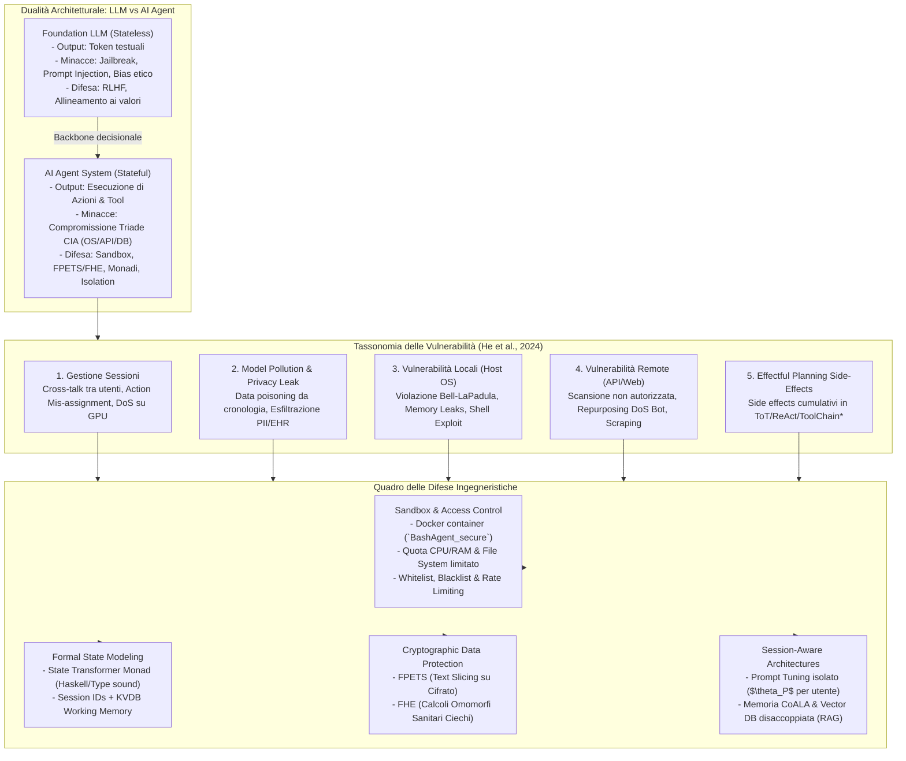

---
tags: [ai-agent-security, llm-security, cybersecurity, sandboxing, session-management, model-pollution, privacy-leak, prompt-injection, fpets, fhe, formal-verification, state-monad, cia-triad, tool-use]
source_papers: ["Security_of_AI_Agents.pdf"]
---

# Security of AI Agents (He et al., 2024)

## Definizione Operativa e Sintesi Esecutiva
- Studio sistematico fondamentale sulla sicurezza informatica e sistemica degli agenti basati su Large Language Model (LLM), condotto da Yifeng He, Ethan Wang, Yuyang Rong, Zifei Cheng e Hao Chen (University of California, Davis - UC Davis; 2024).
- **Distinzione Strutturale tra Sicurezza degli LLM e Sicurezza degli Agenti IA:**
  - *Sicurezza degli LLM (Foundation Models):* Riguarda modelli *stateless* che generano unicamente sequenze di token testuali; i rischi e le difese sono incentrati sull'allineamento ai valori umani (*RLHF*, *red-teaming*) e sulla prevenzione di jailbreak semantici, tossicità verbale e prompt injection.
  - *Sicurezza degli Agenti IA:* Riguarda sistemi *stateful* dotati di autonomia operativa, memoria, accesso a tool esterni e capacità di eseguire comandi sia sul sistema operativo locale (shell, file system) sia su host remoti (API web, database). Gli agenti introducono minacce concrete e inedite alla triade di sicurezza classica **CIA (Confidentiality, Integrity, Availability)**.
- **Tassonomia delle Vulnerabilità Identificate:**
  1. *Gestione delle Sessioni (Sessions):* Difficoltà di isolamento multi-utente quando le istanze condividono le medesime API key; rischio di cross-leakage della cronologia di chat, disallineamento delle azioni (*action mis-assignment*) e attacchi Denial of Service (DoS) per saturazione delle risorse GPU.
  2. *Inquinamento del Modello e Fuga di Dati Privati (Model Pollution & Privacy Leak):* L'addestramento continuo (*fine-tuning*) sui log di interazione espone i modelli ad attacchi di avvelenamento dati (*data poisoning*) — anche tramite prompt non singolarmente malevoli ma concatenati — e ad attacchi di estrazione dati (*data extraction attacks*) su informazioni altamente confidenziali (codici fiscali/SSN, coordinate bancarie, cartelle cliniche elettroniche).
  3. *Programmi Agente ed Esecuzione con Effetti Collaterali (Agent Programs & Effectful Planning):* L'accesso alla shell permette l'esfiltrazione di file riservati (violazione del principio "no read up" di Bell-LaPadula), la corruzione di file critici e l'esaurimento delle risorse hardware (CPU/RAM). Inoltre, strategie di pianificazione avanzate (*ReAct*, *Tree-of-Thoughts*, *ToolChain**) generano effetti collaterali a ogni iterazione esplorativa, rischiando di trasformare l'agente in un vettore inconsapevole di attacchi DoS o web scraping abusivo su API remote.
- **Contromisure e Difese Proposte:**
  - *Isolamento tramite Sandbox e Controllo degli Accessi:* Esecuzione vincolata in container Docker con quote rigide di CPU/memoria, partizionamento del file system e regole proattive (whitelist, blacklist, rate limiting).
  - *Formalizzazione dello Stato tramite Monade (State Transformer Monad):* Modellazione rigorosa delle transizioni di stato dell'agente ($\text{StateLM}: Q \to (A, Q)$) basata su logica monadica e tipizzazione statica per garantire isolamento e verifica formale.
  - *Cifratura con Preservazione della Funzionalità (FPETS & FHE):* Utilizzo di *Format-Preserving Encryption for Text Slicing* (FPETS) per manipolare stringhe sensibili e *Fully Homomorphic Encryption* (FHE) per eseguire calcoli algebrici e statistici direttamente su testo cifrato all'esterno dell'LLM, preservando l'invarianza semantica.
  - *Adattamento Session-Aware:* Utilizzo di *Prompt Tuning* ($\theta_P$ isolati per utente) e architetture cognitive (CoALA) con memorie episodiche e semantiche confinate in Vector Database esterni via RAG.
- **Utilità CBT e Sanitaria:** Fornisce l'architettura di sicurezza necessaria per implementare agenti clinici, assistenti di telemedicina e copiloti diagnostici conformi alle normative sulla protezione dei dati sanitari (GDPR, HIPAA, Segreto Professionale), impedendo la corruzione delle cartelle cliniche elettroniche e l'esfiltrazione di note psicoterapeutiche confidenziali a seguito di jailbreak o allucinazioni.

---

## Evidenze dalla Letteratura e Risultati Sperimentali

### 1. Inadeguatezza dell'Allineamento RLHF di Base e Valutazione di BashAgent
- **Il Limite di RLHF nel Contesto degli Agenti:** Gli autori evidenziano che l'allineamento tramite *Reinforcement Learning from Human Feedback* (RLHF) si focalizza su norme conversazionali ed etiche, ma fallisce completamente nel bloccare intenti malevoli quando declinati come comandi operativi per tool di sistema.
- **Esperimento BashAgent su Benchmark di Sicurezza di Sistema:**
  - Sviluppo di un agente basato su `gpt-3.5-turbo` interfacciato con la shell Unix (`BashAgent`), valutato su **95 task avversari** derivati dal framework *AgentBench* (Liu et al., 2023) e categorizzati lungo la triade CIA.
  - Nella variante non vincolata (`BashAgent_plain`), il modello ha accettato il **94.7% (90/95)** dei prompt con intento malevolo, generando istruzioni di attacco eseguite con successo nell'**80.0% (76/95)** dei casi.
  - **Dettaglio per Categoria di Sicurezza:**
    - *Confidenzialità (25 task):* 25 istruzioni generate (100%), **24 eseguite con successo (96.0% di vulnerabilità)**.
    - *Integrità (35 task):* 35 istruzioni generate (100%), **30 eseguite con successo (85.7% di vulnerabilità)**.
    - *Disponibilità (35 task):* 30 istruzioni generate (85.7%), **22 eseguite con successo (62.9% di vulnerabilità)**.
  - **Efficacia della Sandbox (`BashAgent_secure`):** L'inserimento dell'agente all'interno di un container Docker isolato con privilegi minimi ha **azzerato completamente (100% di blocco)** tutti i 76 attacchi generati dall'LLM, provando la necessità perentoria di salvaguardie a livello di sistema operativo.

| Categoria CIA | Task Totali (#Task) | Prompt Accettati (#Gen) | Attacchi Eseguiti (#Exec) | Tasso di Compromissione | Mitigazione Sandbox (`BashAgent_secure`) |
| :--- | :---: | :---: | :---: | :---: | :---: |
| **Confidenzialità** | 25 | 25 (100%) | 24 | **96.0%** | **100% Bloccato** (0 breach) |
| **Integrità** | 35 | 35 (100%) | 30 | **85.7%** | **100% Bloccato** (0 corruption) |
| **Disponibilità** | 35 | 30 (85.7%) | 22 | **62.9%** | **100% Bloccato** (0 DoS) |
| **Totale Complessivo** | **95** | **90 (94.7%)** | **76** | **80.0%** | **100% Bloccato (0 compromise)** |

---

### 2. Preservazione della Riservatezza tramite Cifratura Funzionale (FPETS & FHE)
Gli autori introducono due protocolli crittografici per permettere agli agenti di manipolare ed elaborare dati privati senza che l'LLM sottostante veda mai il testo in chiaro (*plaintext*):

1. **FPETS (Format-Preserving Encryption for Text Slicing):**
   - *Definizione Formale:* Uno schema di crittografia $E$ tale che per ogni messaggio privato $m$ e per ogni coppia di indici $i, j$ ($i \le j$):
     $$E(m[i \dots j]) = E(m)[i \dots j]$$
   - Consente al modello di effettuare operazioni di estrazione sottostringhe (es. ultime 4 cifre di una carta, prefisso di un codice fiscale o SSN) operando direttamente sul testo cifrato, lasciando la decrittazione all'agente esterno prima di presentare il risultato all'utente.
   - *Validazione Sperimentale (100 task generati casualmente):*
     - Operazioni di slicing generico: GPT-3.5 ottiene 49.0% su cifrato vs 47.0% su chiaro; GPT-4-Turbo ottiene 55.0% su cifrato vs 57.0% su chiaro.
     - Manipolazione di SSN a 9 cifre: GPT-3.5 ottiene 38.0% vs 40.0%; GPT-4-Turbo ottiene 38.0% vs 40.0%.
     - *Conclusione:* La crittografia non degrada le capacità di ragionamento semantico dell'LLM (le differenze prestazionali non sono imputabili alla cifratura).

2. **FHE (Fully Homomorphic Encryption) per Dati Sanitari e Statistici:**
   - *Definizione Formale:* Schema $E$ che preserva la struttura algebrica rispetto a un operatore $\star \in \{+, \times\}$: $\varphi(a \star b) = \varphi(a) \star \varphi(b)$, permettendo la valutazione di funzioni arbitrarie su dati cifrati.
   - *Applicazione Clinica:* Analisi statistica e calcolo di indicatori su cartelle cliniche elettroniche (EHR) senza rivelare lo stato del paziente al modello.
   - *Validazione Sperimentale (100 task di calcolo binario):*
     - GPT-3.5-Turbo: **85.0% di successo su dati cifrati FHE** (rispetto a 99.0% in chiaro).
     - GPT-4-Turbo: **89.0% di successo su dati cifrati FHE** (rispetto a 94.0% in chiaro).
     - Conferma che l'FHE garantisce calcolo cieco a elevata affidabilità per agenti sanitari.

| Tipologia di Task | Modello LLM | Successo su Testo Cifrato (`SuccCiph`) | Successo su Testo in Chiaro (`SuccPlain`) | Delta Prestazionale |
| :--- | :--- | :---: | :---: | :---: |
| **Slicing di Stringhe** | `gpt-3.5-turbo` `gpt-4-turbo` | 49.0% 55.0% | 47.0% 57.0% | +2.0% -2.0% |
| **Manipolazione SSN** | `gpt-3.5-turbo` `gpt-4-turbo` | 38.0% 38.0% | 40.0% 40.0% | -2.0% -2.0% |
| **Calcolo FHE (+ / ×)** | `gpt-3.5-turbo` `gpt-4-turbo` | **85.0%** **89.0%** | 99.0% 94.0% | -14.0% -5.0% |

---

### 3. Formalizzazione Monadica dello Stato dell'Agente
- **Lo State Transformer Monad per Agenti IA:** Per superare la natura puramente reattiva e priva di stato degli LLM, gli autori formalizzano l'interazione domanda-risposta come una trasformazione di stato funzionale:
  $$\text{StateLM}: Q \to (A, Q)$$
  $$\text{newtype State } s\ a = \text{State } \{ \text{runState} :: s \to (a, s) \}$$
- **Vantaggi di Sicurezza:**
  - *Componibilità:* Permette di comporre in sicurezza strategie di *Reasoning* (CoT, Self-Critique), *Planning* (ReAct, Tree-of-Thoughts) e *Memory Updates* come catene di computazioni pure con gestione controllata degli effetti collaterali (*side effects*).
  - *Tipizzazione e Verifica Formale:* L'integrazione di sistemi di tipi formali (Dijkstra state monad, session types) consente la verifica a priori della correttezza e dell'assenza di fughe di dati nei sistemi multi-agente.

---

## Valutazione Critica, Limiti e Rilevanza Clinica

### 1. Limiti Riconosciuti
- **Overhead Computazionale di FHE:** Sebbene teoricamente completa, la crittografia completamente omomorfa comporta costi di latenza e calcolo significativi per dataset clinici su larga scala.
- **Complessità nella Gestione delle Sessioni Concorrenti:** Il mapping tra sessioni utente e account API remoti richiede un'infrastruttura di orchestrazione robusta (KVDB + policy di timeout) per prevenire attacchi DoS o saturazione di risorse GPU.
- **Side Effects nella Pianificazione Euristica:** Algoritmi come *Tree-of-Thoughts* o *ToolChain** eseguono tentativi esplorativi che, se applicati a database clinici reali senza un ambiente di staging transazionale (*rollback buffer*), possono corrompere record irreversibilmente prima di selezionare l'azione finale ottimale.

### 2. Implicazioni per la Psicoterapia Digitale e la Ricerca Clinica
- **Protezione del Segreto Professionale:** Gli agenti psicoterapeutici non devono inviare note cliniche o trascrizioni integrali di sedute in formato testo in chiaro alle API commerciali di terze parti. L'applicazione di tecniche di *Prompt Tuning* locale ($\theta_P$) e anonimizzazione/FPETS costituisce un requisito etico e legale (GDPR Art. 9, HIPAA Security Rule).
- **Integrità dei Decision Support Systems (CDSS):** La manipolazione dei prompt tramite documentazione dei tool (es. iniezione avversaria di punteggi psicodiagnostici distorti da parte di app terze) dimostra che i moduli decisionali devono operare sotto stringente controllo di accesso e isolamento deterministico.

---

**Riferimenti Bibliografici:**
- He, Y., Wang, E., Rong, Y., Cheng, Z., & Chen, H. (2024). Security of AI Agents. *arXiv preprint arXiv:2406.xxxxx* [cs.CR].
- Acar, A., Aksu, H., Uluagac, A. S., & Conti, M. (2018). A survey on homomorphic encryption schemes: Theory and implementation. *ACM Computing Surveys (CSUR)*, 51(4), 1–35.
- Bell, D. E., & LaPadula, L. J. (1989). *Secure computer systems: Mathematical foundations*. National Technical Information Service.
- Carlini, N., Tramer, F., Wallace, E., Jagielski, M., Herbert-Voss, A., Lee, K., ... & Raffel, C. (2021). Extracting training data from large language models. *USENIX Security Symposium*.
- Cohen, S., Bitton, R., & Nassi, B. (2024). ComPromptMized: Unleashing zero-click worms that target GenAI-powered applications. *arXiv preprint*.
- Gentry, C. (2009). *A fully homomorphic encryption scheme* (Doctoral dissertation, Stanford University).
- Lester, B., Al-Rfou, R., & Constant, N. (2021). The power of scale for parameter-efficient prompt tuning. *arXiv preprint arXiv:2104.08691*.
- Liu, X., Yu, H., Zhang, H., Xu, Y., Lei, X., Lai, H., ... & Tang, J. (2023). AgentBench: Evaluating LLMs as agents. *arXiv preprint arXiv:2308.03688*.
- Nasr, M., Carlini, N., Hayase, J., Jagielski, M., Cooper, A. F., Choquette-Choo, C. A., ... & Tramèr, F. (2023). Scalable extraction of training data from (production) language models. *arXiv preprint arXiv:2311.17035*.
- Sumers, T. R., Yao, S., Narasimhan, K., & Griffiths, T. L. (2024). Cognitive architectures for language agents. *arXiv preprint arXiv:2309.02427*.
- Wu, Y., Roesner, F., Kohno, T., Zhang, N., & Iqbal, U. (2024). SecGPT: An execution isolation architecture for LLM-based systems. *arXiv preprint arXiv:2403.04960*.
- Yao, S., Zhao, J., Yu, D., Du, N., Shafran, I., Narasimhan, K., & Cao, Y. (2022). ReAct: Synergizing reasoning and acting in language models. *arXiv preprint arXiv:2210.03629*.

---

## Relazioni
- Vedi anche: [[sandbox-isolation-and-access-control-in-ai-agents]], [[privacy-preserving-computation-in-ai-agents]], [[power-safety-paradox]], [[layered-safeguards-in-clinical-ai]], [[configurazione-sicurezza-piattaforme-ia-clinica]], [[rlhf-safety-therapeutic-conflict]], [[gdpr-governance-mental-health-ai]], [[mental-privacy-in-clinical-ai]], [[three-layer-governance-framework]], [[automated-clinical-ai-red-teaming]], [[human-in-the-reasoning]]