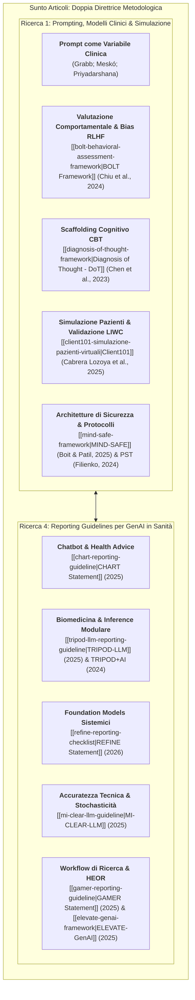
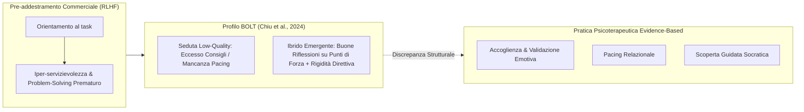
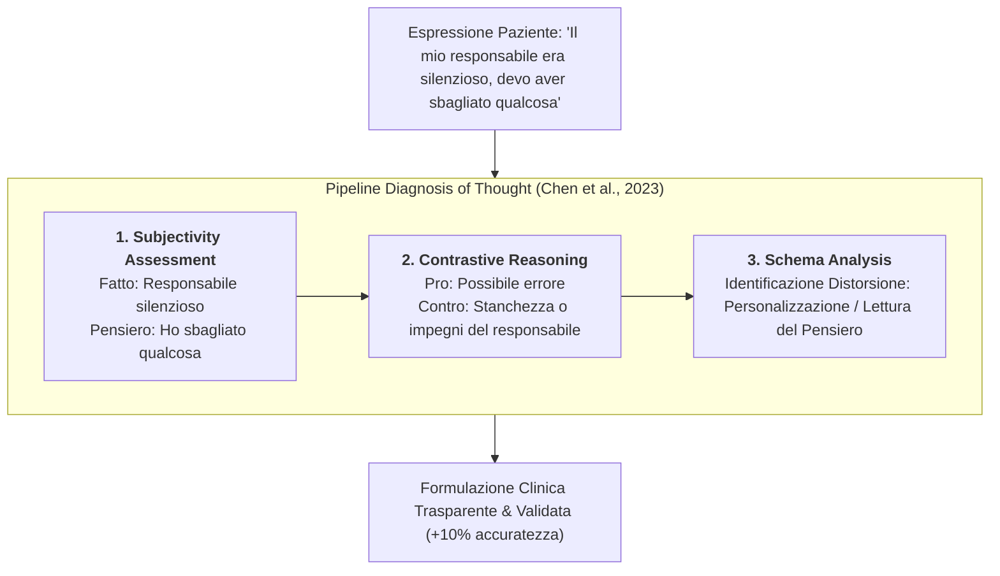
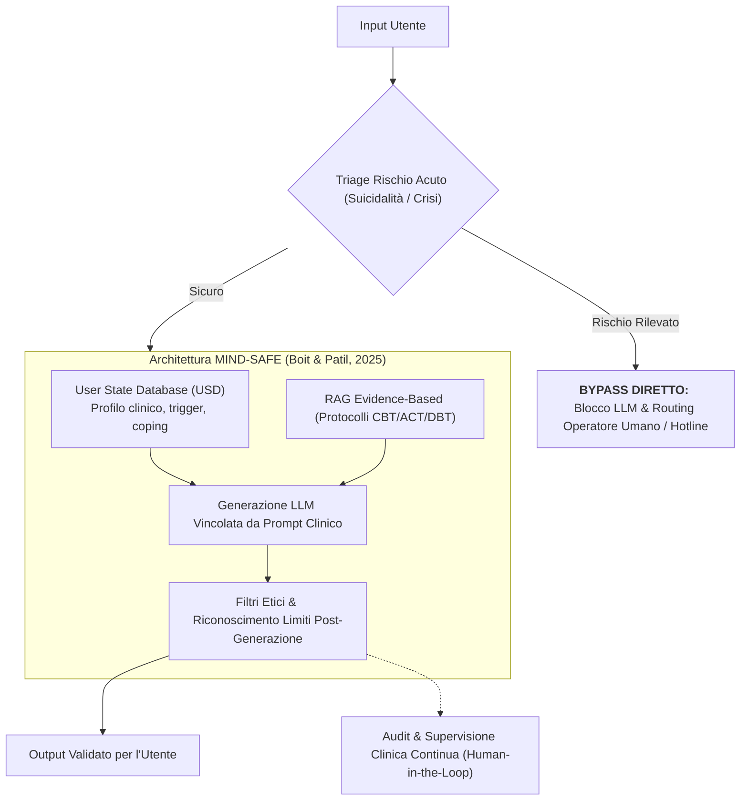
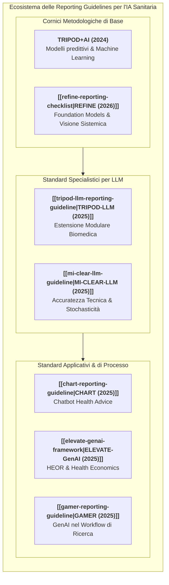

# Sunto Articoli: Prompt Engineering, Simulazione Clinica e Standard di Reporting per l'IA in Salute Mentale

**Summary**: Sintesi integrata e analisi critica della rassegna metodologica sui Large Language Models in psicoterapia e medicina. Il documento articola due macro-filoni: **Ricerca 1**, dedicata all'ingegnerizzazione del prompt come variabile clinico-metodologica, alla valutazione computazionale dei pattern conversazionali ([[bolt-behavioral-assessment-framework|BOLT]]), alla proceduralizzazione del ragionamento CBT ([[diagnosis-of-thought-framework|Diagnosis of Thought]]), alla simulazione di pazienti per la formazione ([[client101-simulazione-pazienti-virtuali|Client101]]) e alle architetture multilivello di sicurezza ([[mind-safe-framework|MIND-SAFE]]); e **Ricerca 4**, focalizzata sugli standard internazionali di reporting e trasparenza metodologica per l'IA generativa in sanità ([[tripod-llm-reporting-guideline|TRIPOD-LLM]], [[chart-reporting-guideline|CHART]], [[elevate-genai-framework|ELEVATE-GenAI]], [[gamer-reporting-guideline|GAMER]], [[mi-clear-llm-guideline|MI-CLEAR-LLM]], [[refine-reporting-checklist|REFINE]] e TRIPOD+AI).
**Sources**: Sunto articoli.docx.pdf (Compendio ragionato di letteratura clinico-computazionale e linee guida 2023-2026).
**Last updated**: 2026-08-28
---

## Inquadramento Generale: I Due Pilastri Metodologici

L'integrazione dei [[large-language-models|Modelli Linguistici di Grandi Dimensioni (LLM)]] e dell'Intelligenza Artificiale Generativa (GenAI) nella salute mentale e nella pratica biomedica si trova a un bivio evolutivo cruciale. La letteratura recente supera l'approccio aneddotico o impressionistico ("l'IA sembra empatica") per strutturarsi attorno a due pilastri rigorosi:

1. **Il Prompt come Variabile Clinico-Metodologica (Ricerca 1):** Il prompt non costituisce un mero espediente tecnico o informatico, bensì un'architettura formale che modula le inferenze cliniche, incarna teorie terapeutiche evidence-based (CBT, PST, ACT, DBT), regola il livello di astrazione e condiziona la dinamica tra aderenza al protocollo e naturalezza relazionale.
2. **Standard di Reporting e Trasparenza Metodologica (Ricerca 4):** L'affidabilità scientifica e la trasferibilità clinica degli LLM esigono protocolli di rendicontazione standardizzati (guidelines registrate su EQUATOR Network e ISPOR), capaci di documentare sistematicamente prompt, stochasticità, dati di training, ground truth, metriche generiche vs. cliniche e supervisione umana.

---

## Parte I: Ricerca 1 – LLM, Prompt Engineering e Pratica Clinica

### 1.1 Il Prompt come Variabile Clinico-Metodologica e Veicolo di Teoria
- **Superamento del generico 'ChatGPT in terapia':** L'efficacia e il profilo di sicurezza di un LLM non dipendono unicamente dai pesi del modello, ma dalla configurazione del prompt, dalla persona clinica assegnata, dal livello di specificità e dal task inferenziale richiesto (*Grabb, 2023; Priyadarshana et al., 2024*).
- **Persona Prompting e Rischio Clinico:** Variazioni minime nel ruolo assegnato (es. *expert psychiatrist*, *psychoanalyst*, *extreme wellness coach*) modificano radicalmente l'output generativo; ruoli non rigorosamente vincolati possono indurre indicazioni estreme o clinicamente rischiose (*Grabb, 2023*).
- **Prompt come Veicolo di Teoria Clinica:** Il prompt traduce formalmente costrutti e tecniche evidence-based (ristrutturazione cognitiva, *Socratic questioning*, attivazione comportamentale, defusione ACT, validazione DBT) in istruzioni computabili (*Boit & Patil, 2025; Filienko et al., 2024; Chen et al., 2023*).
- **AI Literacy Professionale:** Il prompt engineering si configura come una nuova competenza clinica ed epistemica per i professionisti sanitari, essenziale per interagire criticamente con i modelli (*Meskó et al., 2023*).

---

### 1.2 Valutazione Comportamentale Computazionale: Il Framework BOLT e il Bias da RLHF
- **Il Framework [[bolt-behavioral-assessment-framework|BOLT]] (Chiu et al., 2024):** Formalizza la valutazione quantitativa del comportamento conversazionale degli LLM terapeuti su 13 tecniche cliniche e 6 comportamenti del paziente, basandosi sui dataset *High-Low Quality Therapy* e *HOPE*.
- **La Tendenza di Default ('RLHF Advice-Giving Bias'):** Modelli commerciali (GPT-4, GPT-3.5, Llama) mostrano un pattern spontaneo che somiglia maggiormente alle sedute umane di **bassa qualità** (*low-quality sessions*), caratterizzato da un eccesso di problem-solving prematuro, rassicurazioni e consigli direttivi (*advice-giving*).
- **Allineamento Superficiale vs. Qualità Autentica:** Forzare il modello tramite prompt a ridurre le soluzioni e aumentare l'ascolto ottiene una modulazione parziale (specie in GPT-4), ma non garantisce una tenuta relazionale profonda e costante.

---

### 1.3 Il Trade-off tra Aderenza al Protocollo e Naturalezza Conversazionale
- **L'Esperimento sulla Problem-Solving Therapy (Filienko et al., 2024):** Nel guidare caregiver familiari attraverso le fasi della PST (identificazione del problema, goal setting, assessment dei sintomi), l'uso di prompt complessi (few-shot + step-by-step reasoning) incrementa la correttezza procedurale.
- **La Rigidità Algoritmica:** Una maggiore aderenza procedurale induce risposte meccaniche, ripetitive e frustranti (es. reiterare domande di assessment a cui il paziente ha già risposto).
- **Equilibrio Progettuale:** Il prompting clinico ottimale non coincide con la massima rigidità, ma con un bilanciamento tra rispetto del protocollo manualizzato (*protocol adherence*) e responsività flessibile (*natural therapeutic interaction*).

---

### 1.4 Impalcatura Cognitiva e Livelli Inferenziali: Diagnosis of Thought (DoT)
- **Oltre l'Empatia di Facciata (Chen, Lu & Wang, EMNLP 2023):** La psicoterapia richiede la modellizzazione delle credenze e degli schemi disfunzionali. Il framework **[[diagnosis-of-thought-framework|Diagnosis of Thought (DoT)]]** guida l'LLM attraverso tre stadi sequenziali vincolati:
  1. *Subjectivity Assessment:* Separazione netta tra fatti oggettivi osservati (*facts*) e interpretazioni soggettive (*thoughts*).
  2. *Contrastive Reasoning:* Esplorazione dialettica di argomenti a favore e contro la credenza automatica (disputing cognitivo).
  3. *Schema Analysis:* Inferenza dello schema cognitivo profondo e classificazione della distorsione cognitiva (Beck).
- **Esplicitazione del Livello Inferenziale:** Gli LLM forniscono prestazioni diagnostiche superiori se il prompt definisce chiaramente il livello operativo richiesto: descrittivo, interpretativo, formulativo o comparativo.

---

### 1.5 Simulazione Clinica e Addestramento: Client101 e Typed Role-Plays
- **Pazienti Simulati per la Formazione (Cabrera Lozoya et al., 2025; Fung et al., 2024):** L'utilizzo di LLM per simulare clienti virtuali ("Alice" per GAD e "Luke" per MDD in **[[client101-simulazione-pazienti-virtuali|Client101]]**) consente agli allievi di esercitarsi su assessment, ristrutturazione cognitiva e questioning socratico senza rischi per pazienti reali.
- **Validazione Psicolinguistica (LIWC):** Le trascrizioni sintetiche mostrano una notevole sovrapponibilità con le sedute reali su pronomi personali, focus sul presente e pattern emotivi.
- **Limiti della Simulazione Generativa:**
  - *Artificial Compliance:* I chatbot sono eccessivamente collaborativi, privi di difese autentiche, ambivalenze e resistenze relazionali.
  - *Caricaturalità e Stereotipia:* Tendenza del modello ad amplificare i marker tipici del disturbo, rendendo la simulazione eccessivamente ordinata e tematicamente rigida.

---

### 1.6 Architetture di Sicurezza Multilivello: Il Framework MIND-SAFE
- **La Sicurezza oltre il Prompt (Boit & Patil, 2025):** Il prompt engineering da solo non può garantire la sicurezza clinica. È necessaria un'architettura multilivello di governance:
  1. *Acute Risk Detection:* Intercettazione immediata di segnali suicidari o crisi acuta a monte dell'LLM, con bypass diretto verso contatti di emergenza e terapeuti umani.
  2. *User State Database (USD):* Tracciamento computazionale dello stato clinico longitudinale (trend affettivi, trigger, risorse di coping).
  3. *Retrieval-Augmented Generation (RAG):* Ancoraggio delle risposte a banche dati evidence-based per azzerare le allucinazioni.
  4. *Post-Generation Ethical Filters and Human-in-the-Loop:* Revisione continua dei log e supervisione clinica costante.

---

## Parte II: Ricerca 4 – Standard di Reporting e Trasparenza Metodologica

La rassegna analizza le sette principali linee guida internazionali dedicate alla trasparenza, riproducibilità e sicurezza metodologica degli studi di intelligenza artificiale in sanità e salute mentale:

| Linea Guida / Framework | Target Specifico | Struttura / Metodologia | Focus Metodologico Principale |
| :--- | :--- | :--- | :--- |
| **[[chart-reporting-guideline|CHART Statement (2025)]]** | Chatbot per consigli sanitari e sintesi di evidenze (*CHA studies*) | 12 item principali, 39 subitem (Delphi + Consensus) | Genesi dei prompt, blind assessment, reporting sistematico degli output dannosi o fuorvianti, trasparenza ground truth. |
| **[[elevate-genai-framework|ELEVATE-GenAI (2025)]]** | Ricerca economico-sanitaria ed esiti clinici (*HEOR, SLR, RWE*) | 10 domini metodologici, classificazione di maturità | Accuratezza vs. fattualità, robustezza, fairness, privacy PHI, costi computazionali ed efficienza di deployment. |
| **[[gamer-reporting-guideline|GAMER Statement (2025)]]** | Uso di GenAI lungo l'intero workflow di ricerca medica | 9 item essenziali (Scoping review + Delphi) | Disclosure dell'AI in scrittura/analisi, trasparenza prompt/output grezzi, protocolli di verifica umana dei contenuti. |
| **[[mi-clear-llm-guideline|MI-CLEAR-LLM (2025)]]** | Studi di accuratezza diagnostica e clinica di LLM | 8 aree operative (Web chatbot, API, Self-hosted) | Controllo stochasticità (seed, temperatura), gestione memoria di sessione, indipendenza dati di test, disambiguazione terminologica. |
| **[[refine-reporting-checklist|REFINE Statement (2026)]]** | Foundation Models e LLM nella ricerca clinica e imaging | 44 item in 6 sezioni sistemiche (Delphi + Harmonization) | Dataset integrity, contaminazione da pre-training, inferenza, allineamento, impatto sull'implementazione clinica e governance. |
| **[[tripod-llm-reporting-guideline|TRIPOD-LLM (2025)]]** | Sviluppo e validazione di LLM in biomedicina | 19 item, 50 subitem (Architettura modulare) | Inadeguatezza metriche automatiche tradizionali (BLEU/ROUGE), validazione clinica umana, prompt design, annotatori esperti. |
| **TRIPOD+AI (2024)** | Modelli predittivi multivariabili con Machine Learning e AI | 27 item (Aggiornamento dello storico TRIPOD) | Data preparation, class imbalance, fairness demografica, open science (condivisione codice/dati) e patient involvement. |

---

## Conclusioni e Principi di Sintesi per la Pratica Clinica

La convergenza tra la rassegna clinico-applicativa (Ricerca 1) e il quadro regolatorio-metodologico (Ricerca 4) consente di formulare cinque linee guida fondamentali:

1. **L'IA non è un Terapeuta Autonomo:** L'utilizzo responsabile degli LLM risiede nel supporto strutturato (*structured augmentation*), nella concettualizzazione assistita del caso, nella documentazione e nella simulazione didattica, non nell'affidamento autonomo della relazione di cura.
2. **La Qualità Fluente non è Qualità Clinica:** Risposte articolate, rassicuranti o sintatticamente empatiche nascondono frequentemente bias direttivi (problem-solving precoce da RLHF), appiattimento relazionale o amplificazioni caricaturali del disturbo.
3. **Il Prompting richiede Ingegnerizzazione Cognitiva:** Per ottenere valore clinico, il prompt deve esplicitare il quadro teorico di riferimento (CBT/ACT/DBT), imporre stadi inferenziali vincolati (separazione fatti/pensieri) e calibrare il trade-off tra aderenza al protocollo e responsività.
4. **La Sicurezza richiede Architetture di Sistema:** Nessun prompt engineering può sostituire un'architettura completa dotata di triage del rischio acuto a monte, recupero da fonti validate (RAG), filtri post-generazione e supervisione umana (*Human-in-the-Loop*).
5. **Necessità di Trasparenza Totale nei Report:** La validazione scientifica degli LLM clinici esige l'adozione delle linee guida internazionali (TRIPOD-LLM, CHART, REFINE, MI-CLEAR-LLM), documentando integralmente prompt grezzi, parametri stocastici, versioni dei modelli e protocolli di valutazione umana.

---

## Related pages
- [[bolt-behavioral-assessment-framework]]
- [[client101-simulazione-pazienti-virtuali]]
- [[diagnosis-of-thought-framework]]
- [[mind-safe-framework]]
- [[large-language-models]]
- [[ai-assisted-psychotherapy]]
- [[clinical-fidelity-assessment]]
- [[patient-psi-simulazione-clinica]]
- [[tripod-llm-reporting-guideline]]
- [[chart-reporting-guideline]]
- [[elevate-genai-framework]]
- [[gamer-reporting-guideline]]
- [[mi-clear-llm-guideline]]
- [[refine-reporting-checklist]]
