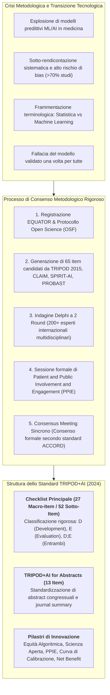
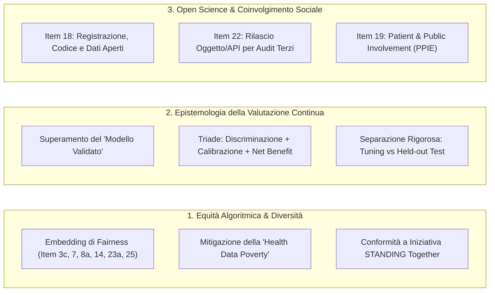
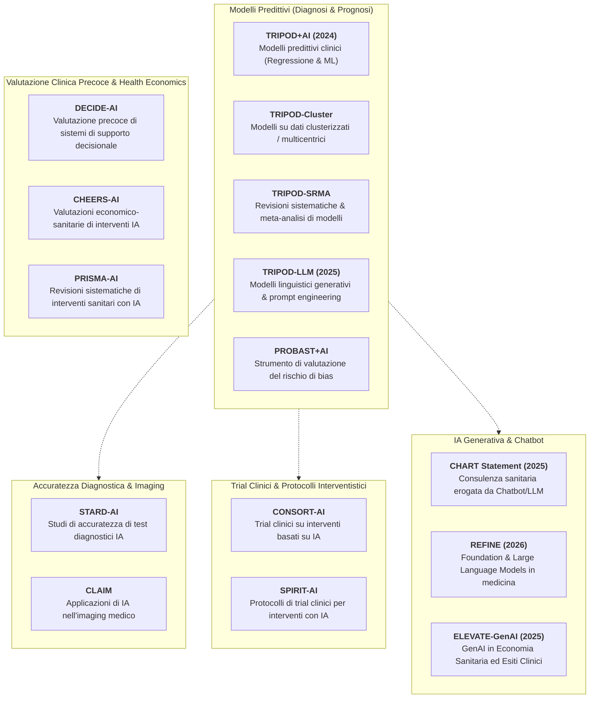

# TRIPOD+AI Statement: Updated Guidance for Reporting Clinical Prediction Models That Use Regression or Machine Learning Methods (Collins et al., 2024)

## Definizione Operativa
- Il **TRIPOD+AI Statement** (*Transparent Reporting of a multivariable prediction model for Individual Prognosis Or Diagnosis - Artificial Intelligence*) è lo standard metodologico internazionale di riferimento per la rendicontazione trasparente, accurata e riproducibile degli studi biomedici e clinici che sviluppano o valutano modelli di predizione multivariabile, indipendentemente dall'impiego di modelli di regressione statistica tradizionale o di algoritmi di Machine Learning ([[machine-learning|ML]]) e Intelligenza Artificiale ([[artificial-intelligence|AI]]).
- **Pubblicazione e Consorzio Internazionale:** Pubblicato su *The BMJ* (2024; 385:e078378; doi: [10.1136/bmj-2023-078378](https://doi.org/10.1136/bmj-2023-078378)) e registrato presso l'**EQUATOR Network** (*Enhancing the QUAlity and Transparency Of health Research*), il framework è stato elaborato da un panel multidisciplinare guidato da Gary S. Collins (University of Oxford) e Karel G.M. Moons (UMC Utrecht), insieme a metodologi di spicco tra cui Richard D. Riley, Andrew L. Beam, Ben Van Calster, Marzyeh Ghassemi, Xiaoxuan Liu, Johannes B. Reitsma, Maarten van Smeden e rappresentanti dei pazienti.
- **Sostituzione di TRIPOD 2015:** TRIPOD+AI **sostituisce integralmente la checklist TRIPOD 2015** (che non deve più essere utilizzata), armonizzando la terminologia tra la comunità statistico-epidemiologica e quella di intelligenza artificiale/data science, e introducendo requisiti avanzati di trasparenza metodologica.
- **Architettura del Framework:**
  1. **Checklist Principale:** Articolata in **27 item principali suddivisi in 52 sotto-item** che coprono l'intero ciclo di vita dello studio (Titolo, Abstract, Introduzione, Metodi, Scienza Aperta, Coinvolgimento dei Pazienti, Risultati, Discussione).
  2. **Matrice di Applicabilità:** Ogni item è formalmente classificato come pertinente allo sviluppo del modello (**D** - *Development*), alla valutazione/validazione (**E** - *Evaluation*), o a entrambi (**D;E**).
  3. **Checklist per Abstract (TRIPOD+AI for Abstracts):** Versione condensata in **13 item** dedicata a report congressuali e abstract di riviste scientifiche.
  4. **Documento di Spiegazione ed Elaborazione Estesa:** Linee guida operative item-by-item corredate da razionale ed esempi di buona pratica.



---

## Evidenze dalla Letteratura

### 1. Inquadramento del Problema: La Crisi di Riproducibilità e Qualità nei Modelli Predittivi
- **Crescita Esponenziale dei Modelli Clinici:** Migliaia di modelli predittivi diagnostici (stima della probabilità di presenza attuale di una malattia) e prognostici (probabilità di un esito clinico futuro) vengono pubblicati ogni anno. Durante i primi 12 mesi della pandemia di COVID-19 sono stati pubblicati oltre 731 modelli predittivi.
- **Deficit Documentati dalle Revisioni Sistematiche:** Nonostante l'elevato investimento economico e scientifico, revisioni sistematiche su larga scala (Dhiman et al., 2021, 2022; Andaur Navarro et al., 2021, 2022, 2023; Wynants et al., 2020) hanno rilevato carenze critiche:
  - Disegni di studio inadeguati e raccolta dati carente;
  - Omissione dei dettagli metodologici essenziali (trattamento dei dati mancanti, iperparametri, selezione dei predittori);
  - Mancanza di calcolo formale della dimensione campionaria;
  - Valutazione della performance limitata alla sola discriminazione ($c$-statistic / AUROC), con omissione sistematica della **calibrazione** e dell'**utilità clinica**;
  - Alto rischio di bias, over-ottimismo e presenza di *spin* (sovrastima retorica dell'efficacia);
  - Rara adozione di pratiche di Open Science (mancata condivisione di codice, dati e oggetti modello).
- **Rischio Clinico Diretto:** L'incompletezza della rendicontazione impedisce a clinici, revisori, comitati etici e autorità regolatorie di valutare la sicurezza del modello prima dell'integrazione nei percorsi di cura (*care pathways*), rischiando di trasferire nella pratica clinica strumenti distorti in grado di esacerbare le disparità sanitarie.

```mermaid
graph LR
    subgraph Deficit ["Deficit Metodologici Documentati"]
        D1["Omissione Dettagli Preprocessing & ML"]
        D2["Assenza Calibrazione (Solo AUROC)"]
        D3["Data Leakage tra Train e Test"]
        D4["Codice e Dati non Condivisi"]
        D5["Fairness Demografica Ignorata"]
    end
    subgraph Rischi ["Conseguenze per la Sanità"]
        R1["Modelli Non Riproducibili"]
        R2["Stime di Rischio Errate al Singolo Paziente"]
        R3["Disparità Sanitarie e Bias Sistemici"]
        R4["Spreco Evitabile di Risorse (Research Waste)"]
    end
    Deficit --> Rischi
```



---

### 2. Metodologia di Sviluppo dello Standard TRIPOD+AI
Lo sviluppo di TRIPOD+AI ha seguito fedelmente le raccomandazioni dell'EQUATOR Network per la produzione di linee guida metodologiche:
1. **Steering Group:** Istituito nel 2019 da Gary S. Collins e Karel G.M. Moons, affiancati da esperti internazionali in statistica medica, machine learning, epidemiologia, etica e medicina clinica.
2. **Registrazione e Protocollo OSF:** Registrazione nel registro EQUATOR (maggio 2019) e pubblicazione del protocollo formale su *Open Science Framework* (marzo 2021) e su *BMJ Open* (Collins et al., 2021; 11:e048008), integrando lo sviluppo congiunto dello strumento di rischio di bias **PROBAST+AI**.
3. **Generazione degli Item Candidati:** Partendo dai 37 item di TRIPOD 2015 e integrando raccomandazioni da TRIPOD-Cluster, TRIPOD for Abstracts, CAIR, MI-CLAIM, CLAIM, MINIMAR, SPIRIT-AI e CONSORT-AI, sono stati sintetizzati **65 item candidati iniziali**.
4. **Indagine Delphi a Due Round:**
   - *Round 1 (Aprile-Maggio 2021):* 170 partecipanti da 22 nazioni hanno valutato i 65 item iniziali (soglia di inclusione prefissata: $\ge 70\%$).
   - *Round 2 (Dicembre 2021-Gennaio 2022):* 200 partecipanti da 27 nazioni hanno rivalutato 59 item raffinati.
5. **Sessione Dedicata di Patient and Public Involvement (PPIE):** Incontro online nell'aprile 2022 con il gruppo PPIE di *Health Data Research UK* (presieduto da Sophie Staniszewska, Università di Warwick), che ha consentito di integrare la prospettiva dei pazienti e dei cittadini nella trasparenza algoritmica.
6. **Consensus Meeting Virtuale (Luglio 2022):** 28 stakeholder multidisciplinari hanno discusso e votato in sessione plenaria 17 item complessi o riscritti, formalizzando la versione definitiva secondo le linee guida ACCORD (*ACcurate COnsensus Reporting Document*).

---

### 3. Armonizzazione Terminologica: Glossario Integrato Statistica–Machine Learning

TRIPOD+AI supera la contrapposizione artificiosa tra modelli di regressione statistica e approcci di machine learning, stabilendo un lessico unificato (Tabella 1 e Box 1 del paper):

| Concetto Tradizionale (Statistica / Epidemiologia) | Termine Machine Learning / Data Science | Definizione Standardizzata TRIPOD+AI |
| :--- | :--- | :--- |
| **Predittore / Variabile Indipendente / Covariata** | Feature / Input / Variabile Esplicativa | Caratteristica misurabile a livello individuale (es. età, pressione arteriosa, radiomica) o di gruppo impiegata per la stima del rischio. |
| **Esito (Outcome) / Variabile Dipendente** | Target / Label / Risposta | Evento diagnostico (stato presente) o prognostico (evento futuro nel tempo) che il modello è chiamato a stimare. |
| **Sviluppo del Modello (Model Development)** | Training / Addestramento del Modello | Fase di stima dei parametri o apprendimento dei pesi a partire dai dati. |
| **Dati di Sviluppo (Development Data)** | Training Data / Set di Addestramento | Dataset utilizzato per derivare o addestrare il modello predittivo. |
| **Validazione Interna (Internal Validation)** | Cross-Validation / Bootstrapping / Split | Valutazione delle prestazioni del modello sulla stessa popolazione/dataset di sviluppo per quantificare l'overfitting. |
| **Ottimizzazione Iperparametri** | Hyperparameter Tuning | Identificazione della configurazione ottimale dei parametri che governano il processo di apprendimento del modello. |
| **Dati di Valutazione / Test (Evaluation Data)** | Test Data / Out-of-Sample Held-Out Set | Dataset **completamente indipendente e privo di sovrapposizioni** di partecipanti rispetto ai dati di sviluppo/tuning, rappresentativo della popolazione target. |
| **Valutazione del Modello (Model Evaluation)** | Testing / Model Performance Evaluation | Stima quantitativa della bontà predittiva mediante **discriminazione**, **calibrazione** e **utilità clinica** (net benefit). |
| **Equità Algoritmica (Fairness)** | Algorithmic Fairness / Bias Mitigation | Proprietà per cui il modello non discrimina individui o gruppi in base ad attributi protetti (età, sesso/genere, etnia, stato socioeconomico). |
| **Percorso di Cura (Care Pathway)** | Clinical Workflow / Clinical Pipeline | Piano clinico strutturato e coordinato per la gestione diagnostico-terapeutica del paziente lungo il suo iter assistenziale. |

---

### 4. La Checklist TRIPOD+AI: Struttura dei 27 Domini e 52 Sotto-Item

La checklist stabilisce in modo univoco quali informazioni devono essere riportate per studi di solo sviluppo (**D**), di sola valutazione esterna (**E**), o combinati (**D;E**):

```mermaid
mindmap
  root((TRIPOD+AI Checklist))
    Inquadramento (Item 1-4)
      1. Titolo esplicito (D;E)
      2. Abstract strutturato (D;E)
      3a-c. Background, Percorso di Cura, Iniquità (D;E)
      4. Obiettivi chiari (D;E)
    Fonti Dati & Coorte (Item 5-7)
      5a-b. Fonti Dati distinte & Finestre temporali (D;E)
      6a-c. Setting, Criteri Eleggibilità, Trattamenti (D;E)
      7. Pre-processing & Controllo Qualità per Sottogruppi (D;E)
    Misure & Campionamento (Item 8-11)
      8a-c. Definizione Esito, Accecamento, Valutatori (D;E)
      9a-c. Selezione Predittori, Accecamento, Valutatori (D, D;E)
      10. Giustificazione Dimensione Campionaria (D;E)
      11. Gestione Dati Mancanti (D;E)
    Metodi Analitici & Valutazione (Item 12-16)
      12a-g. Partizionamento, Algoritmi, Tuning, Calibrazione, Recalibrazione
      13. Gestione Sbilanciamento Classi (D;E)
      14. Approcci alla Fairness (D;E)
      15. Output del Modello & Soglie (D)
      16. Differenze Coorti Sviluppo vs Valutazione (D;E)
    Governance, Etica & Risultati (Item 17-27)
      17. Approvazione Etica & Consenso (D;E)
      18a-f. Open Science: Protocollo, Registro, Dati, Codice (D;E)
      19. Coinvolgimento Pazienti PPIE (D;E)
      20-24. Flowchart, Caratteristiche, Specificazione Modello (Item 22), Performance & Calibrazione (23a-b), Updating (24)
      25-27. Interpretazione & Fairness, Limiti, Usabilità & Competenze Utente (27a-b)
```

#### Tabella Dettagliata dei Requisiti della Checklist TRIPOD+AI

| N° Item | Ambito | Voce di Checklist TRIPOD+AI | Dettaglio Operativo e Razionale |
| :---: | :--- | :--- | :--- |
| **1** | **Titolo** (D;E) | *Identificazione Studio* | Identificare lo studio come sviluppo o valutazione delle prestazioni di un modello predittivo multivariabile, indicando popolazione target ed esito. |
| **2** | **Abstract** (D;E) | *Abstract Strutturato* | Utilizzare la checklist dedicata *TRIPOD+AI for Abstracts* (13 item). |
| **3a** | **Introduzione** (D;E) | *Contesto Clinico* | Descrivere il contesto clinico (diagnostico o prognostico), il razionale e fare riferimento ai modelli predittivi preesistenti. |
| **3b** | **Introduzione** (D;E) | *Percorso di Cura (Care Pathway)* | Descrivere la popolazione target, la collocazione precisa nel percorso clinico e gli utilizzatori finali previsti (medici, pazienti, cittadini). |
| **3c** | **Introduzione** (D;E) | *Iniquità Sanitarie Note* | Esplicitare eventuali disuguaglianze sanitarie note tra gruppi sociodemografici nel dominio clinico in esame. |
| **4** | **Obiettivi** (D;E) | *Scopo dello Studio* | Dichiarare esplicitamente se lo studio descrive lo sviluppo, la valutazione (validazione) o entrambi. |
| **5a** | **Fonti Dati** (D;E) | *Origine dei Dati* | Descrivere separatamente le fonti dati per coorte di sviluppo e di valutazione (RCT, coorte prospettica, registri, cartelle cliniche) e la loro rappresentatività. |
| **5b** | **Fonti Dati** (D;E) | *Date di Raccolta* | Riportare le date esatte di inizio e fine arruolamento dei pazienti e la durata del follow-up. |
| **6a** | **Partecipanti** (D;E) | *Setting dello Studio* | Specificare il contesto assistenziale (cure primarie, ospedale, terapia intensiva) e la distribuzione geografica dei centri. |
| **6b** | **Partecipanti** (D;E) | *Criteri di Eleggibilità* | Definire i criteri di inclusione ed esclusione dei partecipanti. |
| **6c** | **Partecipanti** (D;E) | *Trattamenti Ricevuti* | Riportare i trattamenti clinici ricevuti dai pazienti e come sono stati gestiti durante lo sviluppo o la valutazione. |
| **7** | **Data Preparation** (D;E) | *Pre-processing e Qualità* | Dettagliare pre-processing, normalizzazione e pulizia dei dati, verificando se tali procedure sono state uniformi tra gruppi sociodemografici. |
| **8a** | **Esito (Outcome)** (D;E) | *Definizione dell'Esito* | Definire chiaramente l'esito clinico predetto, l'orizzonte temporale (in modelli prognostici) e verificare la consistenza della misura tra gruppi demografici. |
| **8b** | **Esito (Outcome)** (D;E) | *Valutatori dell'Esito* | Se l'esito richiede interpretazione soggettiva (es. referti radiologici), descrivere qualifiche ed esperienza dei valutatori. |
| **8c** | **Esito (Outcome)** (D;E) | *Accecamento sull'Esito* | Riportare le procedure di accecamento (*blinding*) dei valutatori dell'esito rispetto ai predittori. |
| **9a** | **Predittori** (D) | *Selezione Iniziale* | Descrivere come sono stati scelti i predittori candidati iniziali (letteratura, consenso, disponibilità) ed eventuali pre-selezioni. |
| **9b** | **Predittori** (D;E) | *Definizione Predittori* | Definire rigorosamente tutti i predittori, come e quando sono stati misurati, e l'eventuale accecamento rispetto all'esito. |
| **9c** | **Predittori** (D;E) | *Valutatori dei Predittori* | Riportare qualifiche e caratteristiche demografiche dei valutatori se la misurazione delle feature è soggettiva. |
| **10** | **Campione** (D;E) | *Dimensione Campionaria* | Giustificare la dimensione del campione separatamente per sviluppo e valutazione, allegando i calcoli formali di sample size. |
| **11** | **Dati Mancanti** (D;E) | *Missing Data Handling* | Descrivere come sono stati gestiti i dati mancanti (imputazione multipla, modelli a informatività mancante) e il razionale per eventuali esclusioni. |
| **12a** | **Analisi** (D) | *Partizionamento Dati* | Descrivere la suddivisione dei dati (train, tuning, internal validation) e il rispetto dei requisiti di potenza statistica. |
| **12b** | **Analisi** (D) | *Trattamento Predittori* | Descrivere la forma funzionale (trasformazioni non lineari, spline, scaling, categorizzazione) assegnata a ciascun predittore. |
| **12c** | **Analisi** (D) | *Specifiche del Modello* | Specificare algoritmo (regressione, random forest, neural network), razionale, tuning degli iperparametri e metodo di validazione interna. |
| **12d** | **Analisi** (D;E) | *Eterogeneità e Clustering* | Descrivere come è stata quantificata e gestita l'eterogeneità tra cluster (es. ospedali, regioni), rimandando a TRIPOD-Cluster. |
| **12e** | **Analisi** (D;E) | *Metriche di Performance* | Specificare misure e grafici di valutazione: **discriminazione** ($c$-index/AUROC), **calibrazione** (curve e pendenze) e **utilità clinica** (Decision Curve Analysis). |
| **12f** | **Analisi** (E) | *Model Updating* | Descrivere eventuali procedure di aggiornamento o ricalibrazione del modello (*recalibration intercept/slope*) derivanti dalla valutazione esterna. |
| **12g** | **Analisi** (E) | *Calcolo Predizioni* | Descrivere come sono state calcolate le stime di rischio (formula matematica, pacchetto software, API, oggetto serializzato). |
| **13** | **Analisi** (D;E) | *Class Imbalance* | Se sono stati applicati metodi per classi sbilanciate (es. SMOTE, oversampling), spiegare come e descrivere la ricalibrazione delle probabilità. |
| **14** | **Fairness** (D;E) | *Equità Algoritmica* | Descrivere le strategie adottate per verificare e garantire l'equità del modello tra sottogruppi protetti e il relativo razionale. |
| **15** | **Output** (D) | *Output del Modello* | Specificare l'output (probabilità continua o classificazione binaria/multiclasse); giustificare la scelta delle soglie decisionali (*decision thresholds*). |
| **16** | **Confronto Coorti** (D;E) | *Train vs Evaluation Data* | Identificare esplicitamente le differenze tra coorte di sviluppo e di valutazione (setting, criteri, distribuzione esito e predittori). |
| **17** | **Etica** (D;E) | *Comitato Etico & Consenso* | Riportare nome dell'Institutional Review Board (IRB) approvante e dettagli sul consenso informato o waiver etico. |
| **18a-f** | **Open Science** (D;E) | *Trasparenza e Condivisione* | Riportare: finanziamenti (**18a**), conflitti di interesse (**18b**), reperibilità del protocollo (**18c**), registro pubblico (**18d**), condivisione dati (**18e**) e codice analitico (**18f**). |
| **19** | **PPIE** (D;E) | *Coinvolgimento Pazienti* | Riportare il coinvolgimento attivo di pazienti e cittadini nel design, conduzione, interpretazione e disseminazione dello studio (o dichiararne l'assenza). |
| **20a-c** | **Risultati: Coorte** (D;E) | *Flusso Partecipanti e Baseline* | Riportare flowchart dei partecipanti (**20a**), tabella riassuntiva di predittori ed eventi per setting e sottogruppi (**20b**), e confronto con i dati di sviluppo (**20c**). |
| **21** | **Risultati: Eventi** (D;E) | *Numerosità ed Eventi* | Specificare numero esatto di partecipanti ed eventi in ogni fase analitica (sviluppo, tuning, valutazione). |
| **22** | **Risultati: Modello** (D) | *Specificazione Integrale Modello* | Fornire la specificazione completa del modello (formula, equazione, codice sorgente, pesi/oggetto computazionale, API) per consentire la validazione indipendente da parte di terzi. |
| **23a-b** | **Risultati: Stime** (D;E) | *Performance & Sottogruppi* | Riportare stime di performance con intervalli di confidenza (IC 95%), inclusi i sottogruppi sociodemografici (**23a**) ed eterogeneità tra cluster (**23b**). |
| **24** | **Risultati: Updating** (E) | *Risultati Ricalibrazione* | Riportare i risultati di qualsiasi aggiornamento o ricalibrazione del modello e le prestazioni conseguenti. |
| **25** | **Discussione** (D;E) | *Interpretazione & Fairness* | Interpretare i risultati alla luce degli obiettivi, contestualizzando le implicazioni di equità e i confronti con modelli preesistenti. |
| **26** | **Discussione** (D;E) | *Limiti dello Studio* | Discutere criticamente limiti di rappresentatività, sample size, overfitting, missing data, incertezza statistica e generalizzabilità. |
| **27a-c** | **Usabilità & Futuro** (D;E) | *Integrazione Clinica & Competenze* | Gestione di input mancanti o di bassa qualità nella pratica (**27a**), livello di interazione e competenze richieste agli operatori sanitari (**27b**), prossimi step di ricerca (**27c**). |

---

### 5. I Grandi Pilastri di Innovazione Metodologica di TRIPOD+AI



#### 5.1. Il Principio Epistemologico: "Non esiste un modello predittivo validato una volta per tutte"
- Riprendendo la fondamentale riflessione metodologica di Van Calster et al. (2023; *BMC Medicine*), TRIPOD+AI rigetta formalmente il concetto di "modello validato" inteso come certificato permanente di accuratezza.
- **La Valutazione come Processo Continuo:** Le prestazioni predittive non sono una proprietà intrinseca e statica dell'algoritmo, ma dipendono dal contesto clinico, dalla popolazione, dalla prevalenza della malattia e dalle dinamiche temporali (*case-mix variation*, *clinical drift*). 
- **Sostituzione di "Validazione" con "Valutazione":** Nello standard TRIPOD+AI il termine *validation* viene sostituito dal concetto più rigoroso di **Model Evaluation** (valutazione continua delle prestazioni). Inoltre, si distingue nettamente il "validation dataset" usato nel machine learning per il tuning degli iperparametri (che è parte integrante dello sviluppo) dall'**Evaluation Dataset** esterno, che deve essere rigidamente isolato e mai impiegato per la selezione del modello.

#### 5.2. L'Obbligo della Calibrazione e dell'Utilità Clinica
- Un errore storico della letteratura sul machine learning clinico è stato l'affidamento esclusivo alla discriminazione ($c$-statistic / AUROC). 
- **La Calibrazione come Requisito di Sicurezza:** TRIPOD+AI sancisce che per le decisioni cliniche individuali è indispensabile che le probabilità stimate corrispondano alle frequenze osservate reali. La calibrazione deve essere valutata graficamente tramite **curve di calibrazione continue e flessibili** (*flexible smoothed calibration curves*), riportando pendenza (*calibration slope*) e intercetta (*calibration intercept / calibration-in-the-large*).
- **Decision Curve Analysis (DCA):** La rendicontazione deve includere la valutazione dell'utilità clinica tramite curve decisionali che quantifichino il **Beneficio Netto (Net Benefit)** attraverso range di soglie decisionali clinicamente plausibili.

#### 5.3. Pervasività della Fairness e della Giustizia Distributiva
- TRIPOD+AI incorpora la fairness in tutte le sezioni: background (item 3c), pre-processing (item 7), esiti (item 8a), predittori (item 9c), modellazione (item 14), risultati per sottogruppi (item 20b, 23a) e discussione (item 25, 26).
- **Rappresentatività vs Equità:** Il documento chiarisce che la semplice inclusione numerica di gruppi minoritari non garantisce l'assenza di bias (*representation alone does not guarantee fairness*). Gli autori devono dichiarare attivamente come hanno valutato la performance tra gruppi protetti (sesso, etnia, età, comorbilità), prevenendo il fenomeno della *Health Data Poverty* (Ibrahim et al., 2021) e allineandosi agli standard di diversità dell'iniziativa *STANDING Together* (Ganapathi et al., 2022).

#### 5.4. Open Science, Condivisione del Codice e Specificazione Completa (Item 18 e Item 22)
- Per porre fine all'opacità dei "modelli a scatola nera", TRIPOD+AI richiede di rendere accessibile la formula matematica integrale, il codice analitico di preprocessing/training, o l'oggetto computazionale serializzato (es. modello scikit-learn, PyTorch, R-object o API) tale da consentire a ricercatori indipendenti di effettuare audit e validazioni esterne.

---

### 6. Matrice dei Benefici per gli Stakeholder della Sanità

La Tabella 4 di TRIPOD+AI articola l'impatto traslazionale dell'adozione della linea guida:

| Stakeholder | Azione Raccomandata | Beneficio Traslazionale Diretto |
| :--- | :--- | :--- |
| **Istituzioni Accademiche** | Imporre TRIPOD+AI nei protocolli di ricerca e nella formazione dottorale. | Diffusione di una cultura di trasparenza, riproducibilità e riduzione del *research waste*. |
| **Ricercatori & Autori** | Compilare la checklist sin dalle prime fasi di progettazione dello studio. | Maggiore rigore metodologico, consapevolezza dei dettagli critici e facilitazione della peer review. |
| **Editori di Riviste & Reviewer** | Rendere obbligatoria la sottomissione della checklist compilata con riferimenti a pagina/riga. | Peer review più rapida, efficace e focalizzata sull'identificazione di omissioni critiche. |
| **Enti Finanziatori (Funders)** | Vincolare i bandi di ricerca all'impegno formale di rendicontazione TRIPOD+AI. | Massimizzazione del valore dell'investimento pubblico/privato e riutilizzabilità dei risultati. |
| **Autorità Regolatorie (FDA, EMA, MHRA)** | Utilizzare TRIPOD+AI per valutare i fascicoli clinici di Software as a Medical Device (SaMD). | Allineamento rigoroso tra finalità d'uso dichiarata (*intended purpose*) ed evidenze cliniche sperimentali. |
| **Sviluppatori & Produttori Tech** | Verificare la disponibilità di specifiche complete prima dell'industrializzazione. | Standardizzazione industriale e facilitazione del trasferimento tecnologico sicuro. |
| **Clinici & Operatori Sanitari** | Verificare la completezza dei report prima di adottare un modello nel proprio reparto. | Comprensione chiara dei limiti, della popolazione target e aumento della fiducia nello strumento. |
| **Pazienti e Cittadini** | Promuovere l'adozione delle linee guida e partecipare attivamente (PPIE). | Garanzia di equità nelle cure, protezione da algoritmi discriminatori e rispetto dei valori del paziente. |

---

### 7. Collocazione nell'Ecosistema delle Linee Guida EQUATOR



---

## Punti Chiave e Sintesi Concettuale
- **Superamento Definitivo di TRIPOD 2015:** TRIPOD+AI abroga la linea guida del 2015 ed estende le raccomandazioni a qualsiasi modello predittivo, unificando regressione logistica/Cox, foreste casuali, gradient boosting e reti neurali profonde.
- **27 Item e 52 Sotto-Item Strutturati:** Chiara distinzione funzionale tra item per lo sviluppo (**D**), per la valutazione esterna (**E**) e per entrambi (**D;E**), affiancati da una checklist per abstract a 13 item (*TRIPOD+AI for Abstracts*).
- **Epistemologia dell'Evaluation:** Rifiuto del dogma del "modello validato"; la valutazione delle prestazioni è un processo continuo che richiede la rendicontazione obbligatoria di **calibrazione continua**, **discriminazione** e **curva decisionale di utilità clinica**.
- **Equità e Fairness Integrate:** Requisito vincolante di dichiarare la rappresentatività demografica, valutare le prestazioni nei sottogruppi e prevenire la trasmissione di disparità sanitarie.
- **Open Science Radicale:** Obbligo di esplicitare registro dello studio, disponibilità del protocollo, condivisione del codice analitico e rilascio di equazioni/oggetti software per consentire audit terzi indipendenti.
- **Linee Guida di Riferimento Complementari:** TRIPOD+AI opera come standard di *reporting*; per la valutazione del rischio di bias e della qualità metodologica si rimanda a **PROBAST** e al nascente **PROBAST+AI**.

---

## Concetti Correlati e Connessioni Wiki
- [[tripod-ai-reporting-guideline|TRIPOD+AI Reporting Guideline]] - Analisi strutturale e applicativa della linea guida standard
- [[clinical-prediction-model-evaluation|Valutazione dei Modelli Predittivi Clinici]] - Quadro concettuale: calibrazione, discriminazione, utilità clinica e ricalibrazione
- [[tripod-llm-reporting-guideline|TRIPOD-LLM Reporting Guideline]] - Estensione di TRIPOD per modelli linguistici generativi e prompt engineering
- [[chart-reporting-guideline|CHART Reporting Guideline]] - Standard per studi di consulenza sanitaria erogata da chatbot
- [[refine-reporting-checklist|REFINE Reporting Checklist]] - Checklist per modelli di fondazione e LLM nella ricerca medica
- [[elevate-genai-framework|ELEVATE-GenAI Framework]] - Linee guida per GenAI in economia sanitaria e outcomes research
- [[gamer-reporting-guideline|GAMER Reporting Guideline]] - Standard di reporting per simulazioni multi-agente
- [[mi-clear-llm-guideline|MI-CLEAR-LLM Guideline]] - Standard per interventi clinici e counseling basati su LLM
- [[software-as-a-medical-device-salute-mentale|Software as a Medical Device (SaMD)]] - Inquadramento regolatorio per software clinici predittivi
- [[cross-cultural-bias-and-fairness-audits-ai|Audit di Fairness e Bias nei Sistemi di IA Sanitaria]] - Metodologie per l'identificazione e mitigazione delle disparità
