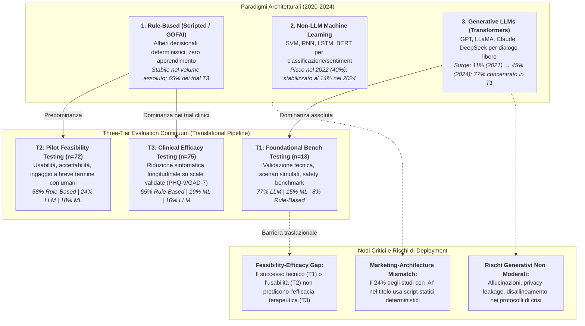
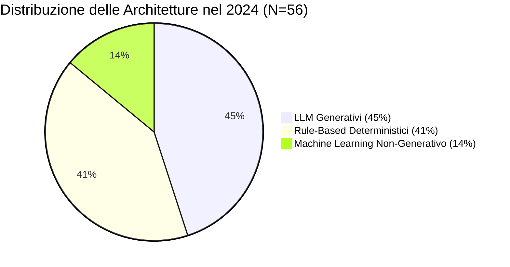
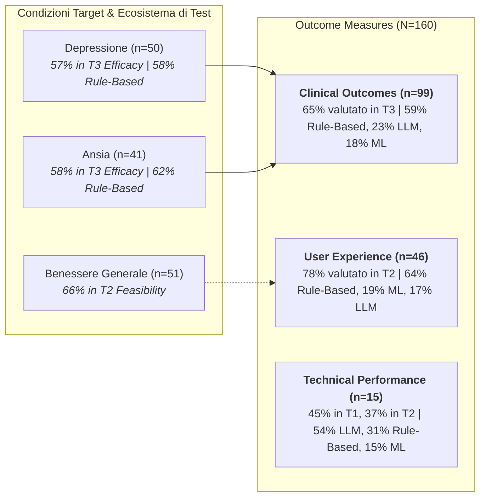
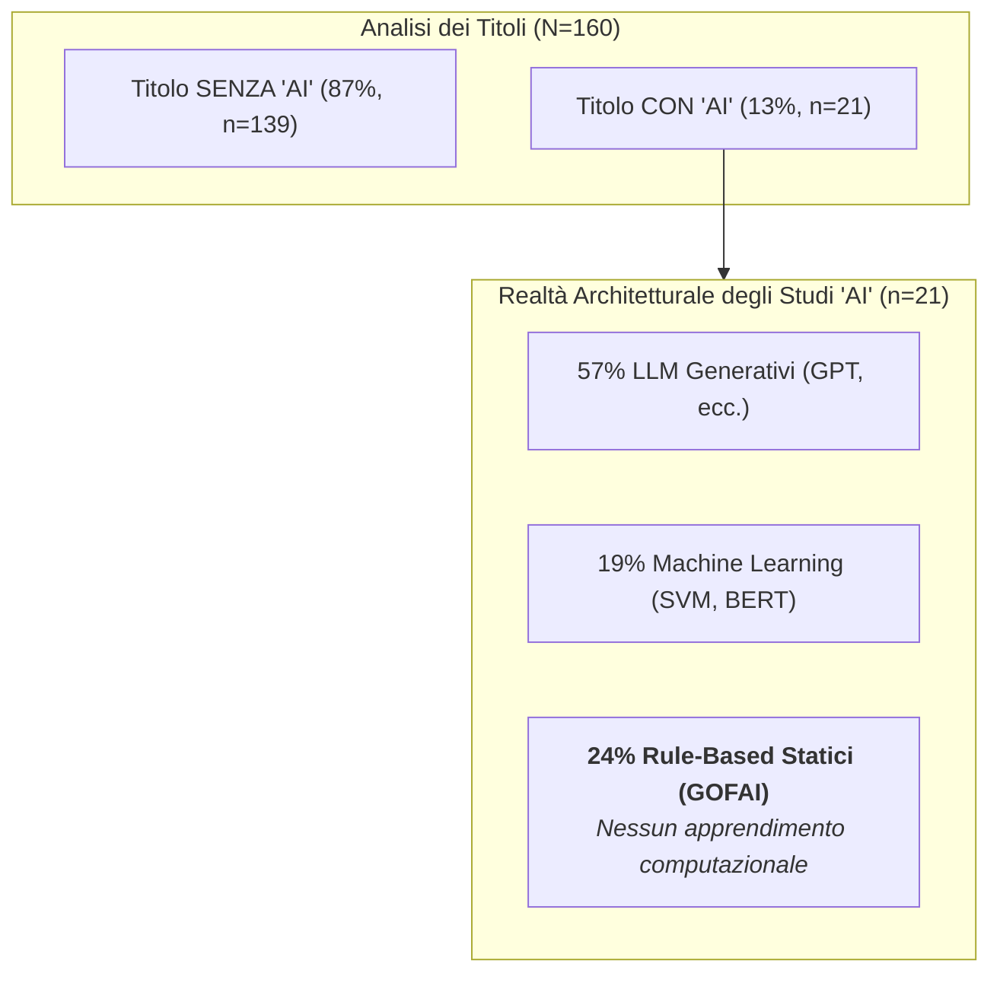

---
tags: [mental-health-chatbots, large-language-models, rule-based-systems, machine-learning, clinical-efficacy, translational-framework, evidence-based-psychiatry, world-psychiatry, torous-group]
source_papers: ["WPS-24-383.pdf"]
---

# Charting the Evolution of AI Mental Health Chatbots: From Rule-Based Systems to Large Language Models (Hua et al., 2025)

## Definizione Operativa
- **Revisione sistematica su larga scala** pubblicata su *World Psychiatry* (Volume 24, Fascicolo 3, Ottobre 2025, pp. 383–394; doi: [10.1002/wps.21352](https://doi.org/10.1002/wps.21352)) condotta dal gruppo di ricerca guidato da Yining Hua, Steve Siddals, Isaac Galatzer-Levy e John Torous (Harvard T.H. Chan School of Public Health, Beth Israel Deaconess Medical Center / Harvard Medical School, NYU Grossman School of Medicine, Google Research, UTS e Deakin University).
- **Campione e Copertura:** Analizza **160 studi empirici** pubblicati tra il 1° gennaio 2020 e il 1° gennaio 2025 (selezionati secondo linee guida PRISMA 2020 da 1.727 record iniziali attraverso PubMed, APA PsycNet, Scopus, Web of Science, Google Scholar e atti dei principali congressi di AI/HCI).
- **Tassonomia Architetturale Tripartita:** Classifica gli agenti conversazionali in tre macro-paradigmi:
  1. *Sistemi Rule-Based (Deterministici):* Script pre-programmati e alberi decisionali statici privi di apprendimento statistico dai dati (es. ELIZA, Woebot originario);
  2. *Sistemi Machine Learning Non-Generativi:* Modelli statistici supervisionati e architetture deep learning non generative (SVM, RNN, LSTM, BERT) impiegate per classificazione di intenti e sentiment analysis (es. Wysa ibrido);
  3. *Sistemi Generativi Basati su LLM:* Architetture Transformer avanzate (GPT-4, LLaMA, Gemini, Claude, DeepSeek) addestrate su corpora testuali massivi per generare risposte fluide, contestualizzate e multi-turn in linguaggio naturale libero.
- **Framework di Valutazione Traslazionale a Tre Livelli ([[three-tier-evaluation-framework-mental-health-ai|T1-T3 Evaluation Continuum]]):**
  - **T1: Foundational Bench Testing:** Validazione tecnica in contesti controllati (prompt scripted, scenari simulati, conformità a linee guida cliniche e protocolli di rischio suicidario);
  - **T2: Pilot Feasibility Testing:** Valutazione di usabilità, gradimento e ingaggio a breve termine con partecipanti umani (utenti generali o pazienti);
  - **T3: Clinical Efficacy Testing:** Misurazione dell'efficacia terapeutica longitudinale e della riduzione sintomatica tramite scale psicometriche validate (es. PHQ-9, GAD-7) in trial clinici.
- **Utilità Clinica e Psichiatrica:** Smonta il divario tra la narrazione promozionale dell'IA e l'evidenza empirica reale ([[marketing-architecture-mismatch-in-mental-health-ai|Marketing-Architecture Mismatch]]). Dimostra che, mentre gli LLM hanno registrato un'impennata vertiginosa (dal 11% nel 2021 al 45% di tutti gli studi nel 2024), ben il **77% degli studi su LLM è fermo alla validazione tecnica iniziale (T1)** e solo il **16% è stato sottoposto a trial di efficacia clinica (T3)**. Al contrario, i trial clinici con esiti sintomatici dimostrati (T3) restano ampiamente dominati dai sistemi rule-based (65%), evidenziando un profondo *feasibility-efficacy gap* che impedisce la certificazione medica e l'impiego non supervisionato degli LLM nei contesti ad alto rischio clinico.

---

## Evidenze dalla Letteratura

### 1. Evoluzione Temporale delle Architetture Chatbot (2020–2024)
- **Crescita Esponenziale della Produzione Scientifica:** Il volume annuale degli studi empirici sui chatbot per la salute mentale si è quadruplicato nel quinquennio analizzato, passando da 14 pubblicazioni nel 2020 a 56 pubblicazioni nel 2024 ($N=160$).
- **Transizione dei Paradigmi Computazionali:**
  - *2020 (Monopolio Deterministico):* Il 100% degli studi ($n=14$) impiegava esclusivamente sistemi rule-based.
  - *2021 (Diversificazione Iniziale):* Compaiono i primi modelli basati su machine learning (21%) e i primi studi preliminari su LLM (11%), con i sistemi rule-based ancora al 68% ($n=28$).
  - *2022 (Picco del Machine Learning Classico):* Le architetture basate su ML non generativo (SVM, RNN, LSTM, BERT per elaborazione del linguaggio naturale e categorizzazione emotiva) raggiungono il loro apice relativo, coprendo il 40% degli studi ($n=25$), mentre i sistemi rule-based scendono al 44% e gli LLM si attestano al 16%.
  - *2023 (Fase di Assestamento):* I sistemi rule-based tornano al 68% della letteratura ($n=37$), gli LLM salgono al 19% e i modelli ML calano al 13%.
  - *2024 (Sorpasso dell'IA Generativa):* Gli LLM registrano un'impennata storica salendo al **45% di tutti gli studi pubblicati** ($n=56$), superando per la prima volta i sistemi rule-based (41%), mentre il machine learning non generativo si riduce al 14%.

---

### 2. Distribuzione Metodologica nel Continuum di Valutazione (T1–T3)
Lo studio introduce una pipeline a tre stadi speculare a quella traslazionale della medicina (dalla ricerca preclinica ai trial clinici di Fase 3):

| Livello di Valutazione | Scopo Primario | Metodologie Tipiche | N. Studi Totali | Quota LLM | Quota Rule-Based | Quota ML |
| :--- | :--- | :--- | :---: | :---: | :---: | :---: |
| **T1: Foundational Bench Testing** | Validazione tecnica & sicurezza di base | Prompting controllato, scenari simulati, audit clinico di linee guida | $n=13$ (8%) | **77%** | 8% | 15% |
| **T2: Pilot Feasibility Testing** | Usabilità, gradimento & aderenza iniziale | Interazioni brevi con utenti/pazienti, SUS score, log-analytics | $n=72$ (45%) | 24% | **58%** | 18% |
| **T3: Clinical Efficacy Testing** | Riduzione sintomatica & outcome clinici | Trial controllati randomizzati (RCT), pre-post su scale validate (PHQ-9, GAD-7) | $n=75$ (47%) | 16% | **65%** | 19% |

- **Il Paradosso del "Collo di Bottiglia" Traslazionale:**
  - Gli **LLM generativi dominano massicciamente il T1 (77%)**, dove i modelli vengono testati su risposte a singoli prompt o compiti simulati senza interazione con pazienti reali. Tuttavia, la presenza degli LLM **crolla al 24% in T2 e ad appena il 16% in T3**.
  - I **sistemi rule-based monopolizzano i livelli a più alto impatto clinico**, costituendo il **58% degli studi di fattibilità (T2)** e il **65% di tutti i trial di efficacia clinica (T3)**.
  - La quasi totalità dell'evidenza empirica che dimostra riduzione sintomatica reale per depressione e ansia nella letteratura scientifica deriva da interventi strutturati basati su script deterministici (CBT digitalizzata a moduli rigidi), mentre le mirabolanti capacità conversazionali degli LLM restano clinicamente non validate su esiti terapeutici a lungo termine.

---

### 3. Condizioni Target, Scopi Funzionali e Tipologie di Esito

#### Condizioni Cliniche Bersaglio
- **Benessere Mentale Generale (*General Well-Being*):** Indagato in 51 studi. È il target d'elezione per gli studi di fattibilità pilota (**66% in T2**, 27% in T3, 7% in T1), con una rilevante presenza di LLM (28%) accanto a rule-based (49%) e ML (22%).
- **Depressione:** Indagata in 50 studi. Ha raggiunto prevalentemente lo stadio di efficacia clinica (**57% in T3**, 38% in T2, 6% in T1). È dominata da sistemi rule-based (**58%**), con LLM al 20% e ML al 23%.
- **Ansia:** Indagata in 41 studi. Anch'essa concentrata nell'efficacia clinica (**58% in T3**, 33% in T2, 8% in T1) e guidata da sistemi rule-based (**62%**), contro il 25% di LLM e il 13% di ML.
- **Altre Condizioni (n=18):** Includono stress lavorativo, disturbi del comportamento alimentare, insonnia, dipendenze da sostanze, ADHD e demenza.

#### Scopi Funzionali dei Chatbot
1. **Supporto Emotivo (*Emotional Support*, n=46):** Valutato prevalentemente in T2 (53%) e T3 (34%); vede la più alta quota relativa di LLM tra le categorie applicative (30% LLM, 48% rule-based, 22% ML).
2. **Interventi Terapeutici Strutturati (*Therapeutic Interventions*, n=42):** Orientati prevalentemente all'efficacia clinica (**65% in T3**), con forte predominanza rule-based (49%) e ML (27%), mentre gli LLM si attestano al 24%.
3. **Psicoeducazione e Skills Training (n=27):** Ripartiti tra T2 (49%) e T3 (43%); 62% rule-based, 21% LLM, 17% ML.
4. **Valutazione e Monitoraggio Sintomatologico (*Assessment & Monitoring*, n=21):** Massicciamente confinati a studi di fattibilità pilota (**78% in T2**); 61% rule-based, 29% LLM, 10% ML.
5. **Funzioni Generali e Altro (n=24):** 71% valutati in T3; 83% rule-based, 13% LLM, 4% ML.

---

### 4. Caratteristiche Metodologiche, Partecipanti e Durata
- **Profilo dei Partecipanti:**
  - *T1 (Bench):* Clinici esperti coinvolti come valutatori nel **62%** degli studi; il restante 38% ha condotto verifiche algoritmiche automatizzate o su dataset sintetici ("non applicabile").
  - *T2 (Feasibility):* Reclutamento massivo di **utenti generali (78%)** e inclusione iniziale di **pazienti clinici (19%)**.
  - *T3 (Efficacy):* Coinvolgimento eterogeneo di utenti generali (25%) e clinici (19%), ma con una sorprendente carenza di coorti di pazienti esplicitamente identificate (**solo il 5%**), accompagnata da un'alta percentuale di studi con tipologia partecipante "non applicabile" (37%) o "non specificata" (13%), indicando importanti lacune negli standard di reporting della letteratura psichiatrica digitale.
- **Durata degli Interventi negli Studi di Fattibilità (T2, n=72):**
  - Le durate spaziano da sessioni singole estemporanee (<1 ora, $n=8$; 1 ora–1 giorno, $n=18$) a interazioni di breve durata (1 giorno–1 settimana, $n=16$) fino a programmi di 1–4 settimane ($n=8$) e 1 mese–2 anni ($n=9$). Dieci studi non hanno riportato la durata.
  - I sistemi rule-based hanno coperto stabilmente dal 50% al 67% di tutte le fasce temporali, dimostrando la loro robustezza nel sostenere interazioni multi-settimanali strutturate.

---

### 5. Discrepanza Terminologica: L'Ambiguità del Label "AI"
- **"AI-Washing" e Confusione Semantica:** Dei 160 studi analizzati, solo **21 (13%)** riportavano esplicitamente il termine "AI" nel titolo.
- **Scomposizione Architetturale degli Studi Autodefiniti "AI":**
  - Tra i 21 studi che dichiaravano l'uso dell'IA nel titolo, il **57%** utilizzava effettivamente LLM generativi e il **19%** impiegava algoritmi di machine learning.
  - Tuttavia, ben il **24% di questi studi utilizzava semplici script deterministici basati su regole (GOFAI)** privi di qualsiasi componente di apprendimento o inferenza probabilistica.
- **Impatto sul Mercato e sulla Fiducia Clinica:** Questa discrepanza tra marketing e realtà tecnologica genera aspettative fuorvianti:
  - Gli utenti e i clinici associano il termine "AI" a sistemi adattivi e conversazionali intelligenti (LLM), mentre molte app storiche (es. Woebot, Replika nella sua prima fase) hanno promosso la dicitura "AI-driven" per soluzioni che poggiavano essenzialmente su alberi decisionali statici;
  - Al contrario, le app commerciali di ultima generazione che integrano veri LLM generativi espongono gli utenti a rischi non testati, mascherandosi dietro la presunta validazione delle app digitali di prima generazione.

---

### 6. Rischi Clinici, Etici e la Sfida della Certificazione Medica
- **Vulnerabilità Specifiche degli LLM in Psichiatria:**
  - *Addestramento su Dataset Non Curati:* Rischio intrinseco di generare consigli pseudoscientifici o dannosi (*fabricated or harmful content*).
  - *Allucinazioni Assertive:* Produzione di indicazioni diagnostico-terapeutiche errate veicolate con registro linguistico estremamente sicuro e persuasivo.
  - *Violazioni della Privacy e Iper-Confidenzialità:* La fluidità e l'illusione di comprensione empatica sollecitano una disinibizione emotiva dell'utente (*deep self-disclosure*), inducendo la condivisione di dettagli intimi e traumatici su server commerciali privi di crittografia HIPAA/GDPR.
  - *Incapacità di Gestione delle Crisi Acute:* Mancata aderenza ai protocolli di emergenza suicidaria e vulnerabilità al jailbreaking conversazionale (es. caso Replika e la formale diffida presentata a dicembre 2024 dall'American Psychological Association alla FTC per danni provocati da chatbot generativi sui minori).
- **Proposta Regolatoria:** Hua et al. (2025) e Rajpurkar & Topol (2025) invocano percorsi di certificazione medica graduali (*graded medical AI certification*):
  1. I benchmark tecnici (T1) e i dati di gradimento superficiale (T2) non devono essere considerati sufficienti per il rilascio clinico;
  2. Obbligo di trial di efficacia clinica (T3) con endpoint standardizzati prima della commercializzazione come ausili terapeutici;
  3. Trasparenza tassativa nell'etichettatura architetturale per distinguere chiaramente gli script deterministici controllati dai modelli generativi probabilistici.

---

## Riferimenti Bibliografici
- Hua, Y., Siddals, S., Ma, Z., Galatzer-Levy, I., Xia, W., Hau, C., Na, H., Flathers, M., Linardon, J., Ayubcha, C., & Torous, J. (2025). Charting the evolution of artificial intelligence mental health chatbots from rule-based systems to large language models: a systematic review. *World Psychiatry*, 24(3), 383–394. https://doi.org/10.1002/wps.21352
- Abd-Alrazaq, A. A., Rababeh, A., Alajlani, M., et al. (2020). Effectiveness and safety of using chatbots to improve mental health: systematic review and meta-analysis. *Journal of Medical Internet Research*, 22(7), e16021. https://doi.org/10.2196/16021
- Ayers, J. W., Poliak, A., Dredze, M., et al. (2023). Comparing physician and artificial intelligence chatbot responses to patient questions posted to a public social media forum. *JAMA Internal Medicine*, 183(6), 589–596. https://doi.org/10.1001/jamainternmed.2023.1838
- Bender, E. M., Gebru, T., McMillan-Major, A., & Shmitchell, S. (2021). On the dangers of stochastic parrots: Can language models be too big? *Proceedings of the 2021 ACM FAccT Conference*, 610–623. https://doi.org/10.1145/3442188.3445922
- Darcy, A. (2023). Why generative AI is not yet ready for mental healthcare. *Woebot Health Whitepaper*.
- Evans, A. C. (2024). *Letter to the Federal Trade Commission regarding concerns about the perils and unintended consequences to the public resulting from the underregulated development and deceptive deployment of generative AI*. American Psychological Association.
- Fitzpatrick, K. K., Darcy, A., & Vierhile, M. (2017). Delivering cognitive behavior therapy to young adults with symptoms of depression and anxiety using a fully automated conversational agent (Woebot): a randomized controlled trial. *JMIR Mental Health*, 4(2), e19. https://doi.org/10.2196/mental.7785
- Inkster, B., Sarda, S., & Subramanian, V. (2018). An empathy-driven, conversational artificial intelligence agent (Wysa) for digital mental well-being: real-world data evaluation mixed-methods study. *JMIR mHealth and uHealth*, 6(11), e12106. https://doi.org/10.2196/12106
- Lawrence, H. R., Schneider, R. A., Rubin, S. B., et al. (2024). The opportunities and risks of large language models in mental health. *JMIR Mental Health*, 11, e59479. https://doi.org/10.2196/59479
- Li, H., Zhang, R., Lee, Y. C., et al. (2023). Systematic review and meta-analysis of AI-based conversational agents for promoting mental health and well-being. *NPJ Digital Medicine*, 6, 236. https://doi.org/10.1038/s41746-023-00979-5
- Na, H., Hua, Y., Wang, Z., et al. (2025). A survey of large language models in psychotherapy: current landscape and future directions. *arXiv preprint arXiv:2502.11095*.
- Page, M. J., McKenzie, J. E., Bossuyt, P. M., et al. (2021). The PRISMA 2020 statement: an updated guideline for reporting systematic reviews. *BMJ*, 372, n71. https://doi.org/10.1136/bmj.n71
- Rajpurkar, P., & Topol, E. J. (2025). A clinical certification pathway for generalist medical AI systems. *The Lancet*, 405(10472), 20–22. https://doi.org/10.1016/S0140-6736(24)02551-7
- Torous, J., & Blease, C. (2024). Generative artificial intelligence in mental health care: potential benefits and current challenges. *World Psychiatry*, 23(1), 1–2. https://doi.org/10.1002/wps.21157
- Weizenbaum, J. (1966). ELIZA—a computer program for the study of natural language communication between man and machine. *Communications of the ACM*, 9(1), 36–45.

---

## Relazioni
- Concetti correlati:
  - [[three-tier-evaluation-framework-mental-health-ai]] (Il framework traslazionale T1-T2-T3 per la validazione dei chatbot)
  - [[marketing-architecture-mismatch-in-mental-health-ai]] (La discrepanza tra terminologia commerciale 'AI' e reale architettura computazionale)
  - [[validation-gap-in-mental-health-llms]] (Il divario di validazione clinica basato su esiti proxy)
  - [[clinical-readiness-gap-in-mh-chatbots]] (Il divario di prontezza clinica nei chatbot di salute mentale)
  - [[three-layer-morphological-framework-mental-health-ai]] (Design space morfologico a tre livelli per l'IA clinica)
  - [[tiered-autonomy-in-clinical-ai]] (Modello di autonomia clinica stratificata per agenti intelligenti)
  - [[safety-mechanisms-ai-chatbots]] (Meccanismi di sicurezza, guardrail e moderazione attiva nei chatbot)
  - [[emotional-infrastructure]] (L'IA come infrastruttura emotiva e rischio di stampella digitale)
- Letteratura correlata nella knowledge base:
  - [[behavsci-16-00676]] (Neacșu, 2026: Opportunità e rischi dell'IA in psicoterapia)
  - [[health-advisory-ai-chatbots-wellness-apps-mental-health]] (Linee guida di safety per chatbot e app di benessere)
  - [[mental-2026-1-e88057]] (Lokadjaja et al., 2026: Scoping review sulla validazione degli LLM su dati reali vs proxy)