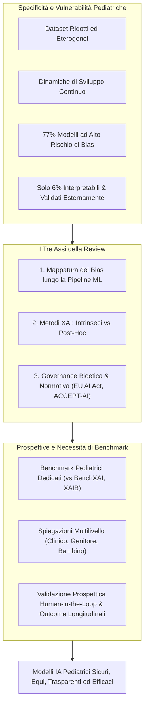
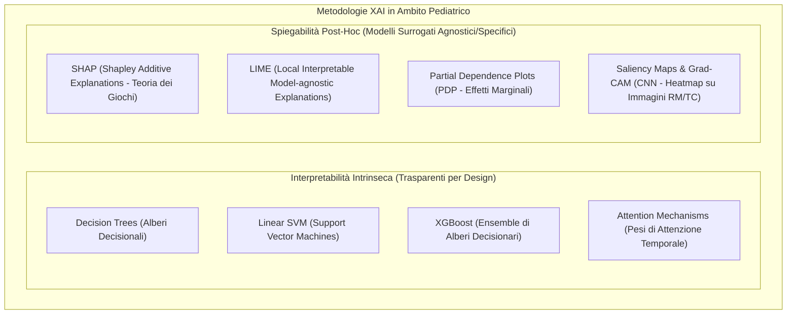
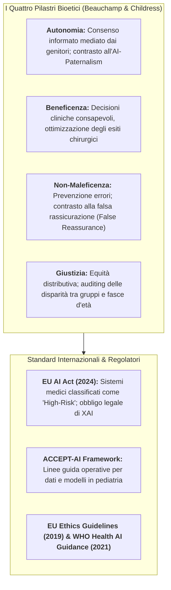

# Explainable AI: Ethical Frameworks, Bias, and the Necessity for Benchmarks (Verhoeven et al., 2026)

## Definizione Operativa
- Sintesi: Articolo di revisione sistematico e concettuale pubblicato sullo *European Journal of Pediatric Surgery* da Rosa Verhoeven, Wiam Bouisaghouane e Jan BF Hulscher (University Medical Center Groningen / Beatrix Children's Hospital, University of Groningen, 2026; DOI: 10.1055/a-2702-1843) che analizza lo stato dell'arte, le criticità etico-metodologiche e le prospettive applicative dell'**Explainable AI (XAI)** nella chirurgia e nell'assistenza sanitaria pediatrica.
- **Utilità CBT:** Risponde alla vulnerabilità specifica delle coorti pediatriche (dati scarsi, elevata eterogeneità, sviluppo biologico dinamico), dove fino al **77% dei modelli di IA presenta un alto rischio di bias** e solo il **6% dei modelli in chirurgia pediatrica risulta sia interpretabile sia validato esternamente**. Fornisce una guida tassonomica sui metodi XAI intrinseci e post-hoc, ancora la spiegabilità ai quattro pilastri della bioetica clinica e agli standard vincolanti dell'**EU AI Act** (sistemi medici classificati come *high-risk*), ed evidenzia l'urgenza di benchmark pediatrici dedicati e validazioni prospettiche *human-in-the-loop*.

---

## Evidenze dalla Letteratura

### 1. La Tassonomia del Bias nella Pipeline di Machine Learning Pediatrico
Il bias algoritmico può manifestarsi e amplificarsi in ciascuna delle quattro fasi fondamentali del ciclo di vita dell'IA (Verhoeven et al., 2026):

1. **Fase di Raccolta Dati (*Data Collection Bias*):**
   - *Sovrarappresentazione di Centri Terziari:* La maggioranza dei dataset clinici pediatrici proviene da ospedali accademici e di terzo livello, con un'iper-rappresentazione di casistiche complesse o rare e una marcata carenza di dati su patologie pediatriche di routine.
   - *Esclusione di Comorbidità:* I criteri restrittivi di inclusione nei trial escludono frequentemente pazienti con quadri clinici complessi o sindromici.
   - *Disparità Geografiche e Socioeconomiche:* Forte sbilanciamento verso dati provenienti da paesi occidentali ad alto reddito (*High-Income Countries* - HIC), con conseguente inefficacia e distorsione quando i modelli vengono applicati in contesti a medio-basso reddito (*LMICs*) o su popolazioni marginalizzate.
2. **Fase di Etichettatura (*Labeling Bias*):**
   - L'apprendimento supervisionato poggia su annotazioni cliniche umane soggette a distorsioni cognitive:
     - *Attribution bias:* iper-affidamento sulle proprie assunzioni o convinzioni pregresse da parte del medico.
     - *Availability bias:* tendenza a basarsi su casi clinici recenti, insoliti o emotivamente salienti, esacerbata dai contesti di emergenza e alta pressione ospedaliera.
   - Questi errori si imprimono nella *ground truth*, insegnando al modello correlazioni patologiche spurie.
3. **Fase di Sviluppo del Modello (*Algorithmic & Confirmation Bias*):**
   - Le scelte architetturali, l'ottimizzazione degli iperparametri e le metriche globali (anziché disaggregate per fasce d'età o sottogruppi) possono favorire inconsapevolmente modelli che confermano le ipotesi a priori dei ricercatori (*confirmation bias*).
4. **Fase di Deployment e Monitoraggio Post-Distribuzione:**
   - *Automation bias:* propensione dei clinici ad accettare acriticamente le raccomandazioni algoritmiche, anche quando errate.
   - *Feedback loops distorsivi:* le decisioni cliniche condizionate da predizioni biased generano cartelle cliniche a loro volta alterate, che finiscono per inquinare i successivi cicli di retraining del modello.

---

### 2. Metodologie di Explainable AI (XAI) in Chirurgia Pediatrica
L'XAI mira a convertire modelli "black-box" in sistemi trasparenti, quantificando l'importanza delle variabili predittive (*feature importance*), visualizzando i confini decisionali e mappando le attivazioni spaziali o temporali.

#### Confronto delle Tecniche XAI e Applicazioni Pediatriche (Tabella 1 della Review):

| Tecnica XAI | Categoria | Output Tipico | Casi d'Uso in Chirurgia Pediatrica | Punti di Forza | Limiti |
| :--- | :--- | :--- | :--- | :--- | :--- |
| **Alberi Decisionali** | Intrinseca, model-specific | Percorsi decisionali (if-then), feature importance | Predizione precoce di sepsi pediatrica | Altamente intuitivo per il clinico | Meno accurato su dati complessi non lineari, incline a overfitting |
| **SVM Lineari** | Intrinseca, model-specific | Confini di decisione, vettori di supporto, pesi | Rischio di complicanze post-operatorie | Efficace su dati ad alta dimensionalità | Meno intuitivo degli alberi, limitato a separazioni lineari |
| **XGBoost** | Intrinseca, model-specific | Feature importance aggregata per guadagno (*gain*) | Esiti riabilitativi post-chirurgia spinale pediatrica (parametri sagittali e self-image) | Elevata accuratezza predittiva e quantificazione pesi | Non isola facilmente le direzioni per singoli rami |
| **Attention Mechanisms** | Intrinseca (modelli sequenziali) | Pesi di attenzione su finestre temporali | Monitoraggio continuo parametri vitali per predizione precoce di enterocolite necrotizzante (NEC) | Cattura dipendenze e pattern temporali longitudinali | Minore interpretabilità clinica immediata |
| **SHAP** | Post-hoc, model-agnostic | Valori Shapley (+ / -) locali e globali | Rischio di malnutrizione post-cardiochirurgia congenita | Fondamento teorico solido (teoria dei giochi), consistenza matematica | Elevato carico computazionale; correlazione $\neq$ causalità |
| **LIME** | Post-hoc, model-agnostic | Pesi del surrogato lineare locale | Spiegazione di singole predizioni in modelli di rischio chirurgico e screening autismo | Intuitivo per spiegazioni individuali caso per caso | Stabilità variabile; validità circoscritta al vicinato locale |
| **Partial Dependence Plots (PDP)** | Post-hoc, model-agnostic | Grafici di risposta marginale | Valutazione effetto soglia di biomarcatori su esiti di trapianto | Rileva relazioni non lineari ed effetti soglia | Assume indipendenza tra feature |
| **Saliency Maps / Grad-CAM** | Post-hoc, model-specific (CNN) | Heatmap anatomiche sovrapposte all'imaging | Classificazione e localizzazione di tumori cerebrali pediatrici su risonanza magnetica | Visualizzazione immediata delle aree di interesse per il radiologo/chirurgo | Possibile rumore o evidenziazione di artefatti irrilevanti |

---

### 3. Framework Etici, Bioetica Clinica e Obblighi Normativi

L'adozione dell'XAI in pediatria è vincolata ai quattro principi cardine della bioetica biomedica di Beauchamp & Childress (2001) e alle recenti normative internazionali (Verhoeven et al., 2026):

1. **Autonomia e Prevenzione dell'AI-Paternalism:** Nei pazienti pediatrici, l'autonomia decisionale è esercitata dai genitori/tutori con il progressivo coinvolgimento del minore. Sistemi opachi creano una forma di *AI-paternalism* che si somma al tradizionale paternalismo medico, escludendo la famiglia dalle scelte terapeutiche. L'XAI restituisce la trasparenza necessaria per un valido consenso informato.
2. **Beneficenza:** La comprensione delle determinanti algoritmiche permette al chirurgo di personalizzare l'intervento e migliorare gli esiti clinici.
3. **Non-Maleficenza e Rischio di *False Reassurance*:** Identificare le debolezze del modello protegge i bambini vulnerabili. Tuttavia, spiegazioni iper-semplificate o graficamente accattivanti ma non rigorose rischiano di generare *falsa rassicurazione*, inducendo il chirurgo a fidarsi incautamente di predizioni errate.
4. **Giustizia:** L'audit della trasparenza consente di identificare disparità prestazionali tra sottogruppi demografici o condizioni rare.
5. **Standard Giuridici dell'EU AI Act (in vigore da agosto 2024):** La normativa europea classifica i software medici basati su IA come **sistemi ad alto rischio (*High-Risk AI Systems*)**, rendendo la trasparenza, la tracciabilità e la supervisione umana (*human oversight*) un **obbligo normativo inderogabile**.
6. **Il Framework ACCEPT-AI:** Elaborato specificamente per l'età evolutiva (Muralidharan et al., 2023), definisce requisiti per l'acquisizione responsabile dei dati pediatrici, la spiegabilità adeguata all'età (*age-appropriate explanations*) e la sorveglianza clinica continua.

---

### 4. La Necessità di Benchmark Standardizzati in Pediatria

La letteratura attuale presenta un grave ritardo metodologico:
- Solo il **44% dei modelli di IA in chirurgia pediatrica incorpora tecniche di interpretabilità**, e appena il **6% risulta contemporaneamente interpretabile ed esternamente validato** (Elahmedi et al., 2024; Verhoeven et al., 2026).
- **Correlazione vs Causalità:** Le tecniche XAI identificano associazioni statistiche, non nessi causali; basare decisioni chirurgiche su feature correlazionali non causali può condurre a trattamenti inefficaci o dannosi.
- **Limiti dei Benchmark Esistenti:** Strumenti generalisti come **BenchXAI** (per dati biomedici multimodali) e **XAIB** (per spiegabilità post-hoc) valutano coerenza e fedeltà, ma sono calibrati su dataset di adulti e non considerano le traiettorie di sviluppo infantile né la necessità di comunicare le spiegazioni a un pubblico a tre livelli (chirurgo, genitore, bambino).
- **Raccomandazioni per la Ricerca Futura:**
  1. Istituzione di **benchmark pediatrici dedicati** dotati di dataset curati e metriche standard di fedeltà/stabilità.
  2. Conduzione di studi prospettici **Human-in-the-Loop** per valutare l'usabilità nel flusso di lavoro clinico reale.
  3. Misurazione dell'impatto clinico dell'XAI sugli **esiti a lungo termine** (morbilità post-operatoria, sopravvivenza, qualità della vita).

---

**Riferimenti Bibliografici:**
- Verhoeven, R., Bouisaghouane, W., & Hulscher, J. B. F. (2026). Explainable AI: Ethical Frameworks, Bias, and the Necessity for Benchmarks. *European Journal of Pediatric Surgery*, 36(1), 168–173. https://doi.org/10.1055/a-2702-1843
- Beauchamp, T. L., & Childress, J. F. (2001). *Principles of Biomedical Ethics* (5th ed.). Oxford University Press.
- Elahmedi, M., Sawhney, R., Guadagno, E., Botelho, F., & Poenaru, D. (2024). The state of artificial intelligence in pediatric surgery: a systematic review. *Journal of Pediatric Surgery*, 59(5), 774–782.
- European Commission. (2024). *Artificial Intelligence Act*. High-Risk Medical AI Regulatory Framework.
- Goncharenko, I., Zahariev, I., Gorbunov, S., et al. (2025). Open and extensible benchmark for explainable artificial intelligence methods. *Algorithms*, 18(2), 85.
- Metsch, J. M., & Hauschild, A. C. (2025). BenchXAI: comprehensive benchmarking of post-hoc explainable AI methods on multi-modal biomedical data. *Computers in Biology and Medicine*, 191, 110124.
- Muralidharan, V., Burgart, A., Daneshjou, R., & Rose, S. (2023). Recommendations for the use of pediatric data in artificial intelligence and machine learning ACCEPT-AI. *NPJ Digital Medicine*, 6(1), 166.
- Schouten, J. S., Kalden, M. A. C. M., van Twist, E., et al. (2024). From bytes to bedside: a systematic review on the use and readiness of artificial intelligence in the neonatal and pediatric intensive care unit. *Intensive Care Medicine*, 50(11), 1767–1777.

---

## Relazioni
- Vedi anche: [[xai-in-pediatric-surgery]], [[pediatric-ai-bias-and-vulnerabilities]], [[accept-ai-and-pediatric-ethical-frameworks]], [[pediatric-xai-benchmarking]], [[software-as-a-medical-device-salute-mentale]], [[audit-bias-llm-clinici]], [[explainable-mental-health-diagnosis]], [[ai-research-ethics]], [[three-layer-governance-framework]]