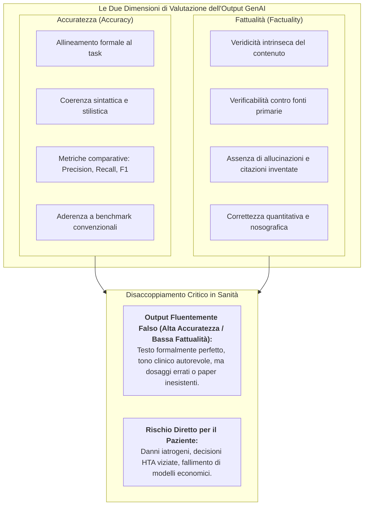
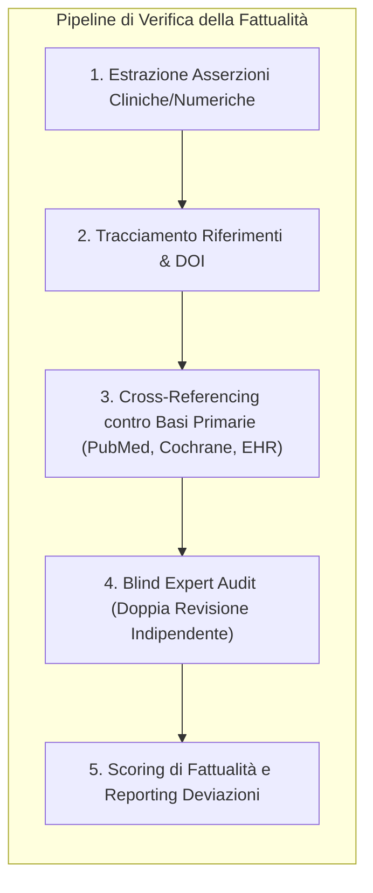

# Accuratezza vs. Fattualità nei Modelli di Intelligenza Artificiale

## Definizione Operativa
- La distinzione tra **Accuratezza** (*Accuracy*) e **Fattualità** (*Factuality*) costituisce uno dei pilastri concettuali ed epistemologici più critici nella valutazione dei Large Language Models ([[large-language-models|LLM]]) e dell'Intelligenza Artificiale Generativa in ambito biomedico, clinico ed economico-sanitario.
- **Accuratezza (Task/Format Alignment):** Misura il grado di allineamento, coerenza e adeguatezza dell'output rispetto ai requisiti formali del task, ai parametri stilistici, alle metriche comparative (es. Precision, Recall, F1-Score, BLEU, ROUGE) o a un insieme di benchmark prefissati. Un modello può dimostrare un'elevata accuratezza strutturale o sintattica rispondendo con un tono perfettamente appropriato, autorevole e ben formattato.
- **Fattualità (Intrinsic Truthfulness & Verifiability):** Riguarda la **veridicità intrinseca del contenuto**, l'assenza di dati inventati o distorsioni empiriche e la diretta verificabilità di ogni affermazione contro fonti primarie validate o una *ground truth* oggettiva. La fattualità contrasta direttamente il fenomeno delle **allucinazioni** (*hallucinations*), ossia la fabbricazione plausibile ma fittizia di studi clinici, parametri farmacologici o stime epidemiologiche.
- **Rilevanza nei Framework di Reporting:** Sia lo Statement [[chart-reporting-guideline|CHART]] sia il framework [[elevate-genai-framework|ELEVATE-GenAI]] (Fleurence et al., 2025; Huo et al., 2025) formalizzano la separazione metodologica tra la valutazione dell'accuratezza e la verifica della fattualità, impedendo che punteggi elevati in metriche lessicali o stilistiche mascherino errori fattuali catastrofici.



---

## Analisi Comparativa delle Due Dimensioni

```mermaid
quadrantChart
    title Matrice Accuratezza Formale vs Fattualità Clinica
    x-axis Bassa Accuratezza Formale --> Alta Accuratezza Formale
    y-axis Bassa Fattualità (Allucinazioni) --> Alta Fattualità (Dati Verificati)
    quadrant-1 "Ottimale Clinico (Valido e Verificato)"
    quadrant-2 "Contenuto Corretto ma Formattazione/Task Errato"
    quadrant-3 "Scarto Totale (Incoerente e Falso)"
    quadrant-4 "Zona di Massimo Rischio (Placida Falsità)"
    "Allucinazione Fluida": [0.85, 0.15]
    "Sintesi Rigorosa Verificata": [0.90, 0.95]
    "Output Mal Formattato ma Vero": [0.20, 0.85]
    "Rumore Computazionale": [0.15, 0.10]
```

| Criterio | Accuratezza (*Accuracy*) | Fattualità (*Factuality*) |
| :--- | :--- | :--- |
| **Oggetto di Valutazione** | Correttezza rispetto allo spazio del compito, coerenza con gli input, metriche linguistiche. | Corrispondenza ontologica ed empirica con la realtà clinico-scientifica. |
| **Tipologia di Errore Rilevata** | Risposta fuori tema, omissione di vincoli del prompt, punteggi bassi di sovrapposizione lessicale. | Fabbricazione di trial clinici, allucinazione di numeri/ICER, dosaggi letali, attribuzioni bibliografiche false. |
| **Metodologia di Misurazione** | Metriche computazionali automatizzate (BLEU, ROUGE, BERTScore, accuracy di classificazione). | Protocolli sistematici di *fact-checking*, verifica manuale su PubMed/Cochrane, cross-referencing con fonti primarie. |
| **Maturità Metrica nei Framework** | **Media** (necessita calibrazione su task complessi). | **Alta** (protocolli di verifica del dato binari o ben definiti). |
| **Rischio di Sotto-rilevazione** | Facilmente rilevabile mediante test automatizzati. | Altamente insidiosa se l'output appare ben articolato e convincente (*credible hallucination*). |

---

## Meccanismi di Fallimento: Perché l'Accuratezza Non Implica la Fattualità

1. **Allucinazioni Plausibili (*Fluent Hallucinations*):** I modelli transformer generano risposte basandosi su pattern probabilistici di co-occorrenza di token. Un LLM può produrre una sintesi metodologica impeccabile sul piano lessicale e grammaticale, inventando interamente i parametri numerici o i coefficienti di transizione di un modello di Markov.
2. **Fabbricazione di Citazioni Bibliografiche:** Nei task di revisione sistematica della letteratura ([[elevate-genai-framework|SLR]]), un modello può generare riferimenti formattati perfettamente secondo lo stile Vancouver o APA con tanto di DOI plausibili ma completamente inesistenti, ingannando revisori non esperti.
3. **Drift Parametrico nei Calcoli Economici:** Nella modellazione economica sanitaria ([[heor-generative-ai-validation|HEOR]]), l'accuratezza nella generazione di script in R o Python (il codice compila senza errori) non garantisce la fattualità dei parametri epidemiologici o dei costi unitari inseriti nelle formule.

---

## Protocolli Operativi per la Verifica della Fattualità

Nei quadri di reporting [[chart-reporting-guideline|CHART]] ed [[elevate-genai-framework|ELEVATE-GenAI]], la verifica della fattualità richiede l'adozione di standard metodologici espliciti:



- **Cross-Referencing Sistematico:** Ogni citazione o asserzione terapeutica generata dal chatbot deve essere mappata e verificata a fronte della banca dati primaria o delle linee guida cliniche di riferimento.
- **Accecamento dei Valutatori (*Blinding*):** Il protocollo CHART impone che gli esperti umani che valutano la fattualità non conoscano l'identità del modello per evitare che la notorietà dello sviluppatore influenzi il giudizio di veridicità.
- **Soglie di Incertezza e Astensione:** Integrazione di meccanismi di calibrazione che permettano al modello di dichiarare la propria incertezza o astenersi (*abstention*) anziché generare risposte fittizie di fronte a quesiti privi di riscontro nei dati di addestramento.

---

## Implicazioni per la Ricerca e la Sanità

- **Nelle Decisioni Cliniche:** L'affidamento su parametri apparentemente accurati ma fattualmente falsi può tradursi in errori di prescrizione o raccomandazioni diagnostiche nocive.
- **Nelle Valutazioni di Health Technology Assessment (HTA):** L'utilizzo di dati inventati in modelli di costo-efficacia può distorcere l'allocazione delle risorse del sistema sanitario nazionale.
- **Nella Peer Review Biomedica:** I revisori devono pretendere la rendicontazione disgiunta delle metriche di accuratezza del task e dei log di audit di fattualità.

---

## Voci Correlate
- [[Linee_Guida_Reporting_AI_Generativa_CHART_ELEVATE|Sintesi: Linee Guida per il Reporting della GenAI in Medicina ed Economia Sanitaria]]
- [[chart-reporting-guideline|CHART Reporting Guideline]]
- [[elevate-genai-framework|ELEVATE-GenAI Framework]]
- [[heor-generative-ai-validation|Validazione della GenAI nell'HEOR]]
- [[gai-research-integrity-and-verification|Integrità della Ricerca e Verifica della GenAI]]
- [[traffic-light-quality-appraisal-clinical-ai|Traffic Light Quality Appraisal per l'IA Clinica]]
- [[large-language-models|Large Language Models (LLM)]]
- [[living-guidelines-in-health-ai|Living Guidelines nell'Intelligenza Artificiale Sanitaria]]
