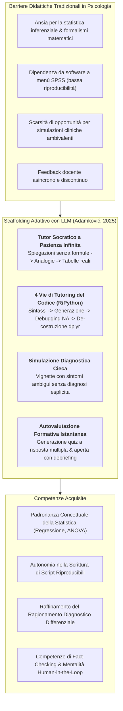
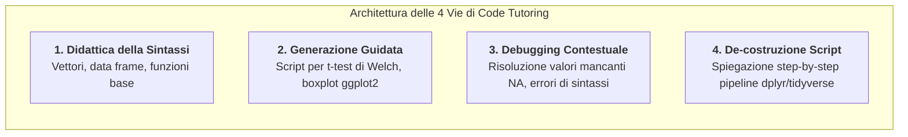

# Adaptive Learning and Code Tutoring in Psychology (Apprendimento Adattivo e Tutoring di Programmazione in Psicologia)

## Definizione Operativa
- L'**Adaptive Learning and Code Tutoring in Psychology** (apprendimento adattivo e tutoraggio computazionale nelle scienze psicologiche) identifica il modello pedagogico mediato da modelli linguistici di grandi dimensioni ([[large-language-models]]) finalizzato a personalizzare l'insegnamento della psicologia, decostruire l'ansia statistica e facilitare l'acquisizione di competenze computazionali aperte (R, Python).
- **Formalizzazione Concettuale (Adamkovič, 2025):** Supera il paradigma trasmissivo frontale e l'uso acritico di software commerciali point-and-click (SPSS), integrando l'LLM come **tutor socratico a infinita pazienza** in grado di:
  1. Adattare dinamicamente il livello di astrazione teorico-quantitativa alle preconoscenze dello studente;
  2. Guidare l'apprendimento incrementale del codice scientifico attraverso 4 vie strutturate (insegnamento base, generazione, debugging, spiegazione);
  3. Simulare scenari clinici complessi caratterizzati da ambiguità diagnostica per allenare il ragionamento clinico differenziale prima del tirocinio sul campo.
- **Quadro Teorico:** Si ancora alle teorie dello scaffolding pedagogico (Holmes et al., 2019) e dell'apprendimento attivo, mitigando al contempo il rischio di de-skilling cognitivo (*cognitive offloading*) mediante verifiche formative continue.

---

## Domini Applicativi e Progressioni Didattiche

### 1. Decostruzione dei Concetti Quantitativi (Caso: Regressione Lineare)
Il modello descritto da Adamkovič (2025) struttura l'interazione in una sequenza progressiva di prompt che abbatte gradualmente la complessità cognitiva:
1. **Passaggio 1 (Definizione Generale):** Spiegazione qualitativa del costrutto di regressione lineare.
2. **Passaggio 2 (Abbattimento del Formalismo):** Riformulazione del concetto senza l'uso di equazioni algebriche, adatta a studenti con ansia matematica (*statistical anxiety*).
3. **Passaggio 3 (Chiarimento Sottile):** Distinzione tra coefficienti standardizzati ($\beta$) e non standardizzati ($b$) mediante analogie concrete della vita quotidiana.
4. **Passaggio 4 (Interpretazione Applicata):** Inserimento nel prompt di una tabella empirica reale per guidare lo studente all'interpretazione statistica e sostantiva degli output.
5. **Passaggio 5 (Feedback Formativo):** Creazione automatica di quiz con verifica immediata dei concetti appresi.

---

### 2. Le 4 Vie per l'Apprendimento del Codice (R e Python)
Per facilitare la transizione da SPSS a linguaggi aperti (Masuadi et al., 2021), l'LLM opera su quattro binari complementari:

1. **Insegnamento Fondazionale:** Richiesta guidata passo-passo sulla creazione di vettori, manipolazione di dataset e calcolo di indici descrittivi.
2. **Generazione di Codice:** Richiesta di codice specifico vincolato al contesto (es. subsetting di dati con filtri logici e confronto medie con t-test di Welch).
3. **Debugging Interattivo:** Inserimento dell'errore reale (es. `mean()` che restituisce `NA` a causa di valori mancanti) per spiegare il parametro `na.rm = TRUE` e prevenire errori futuri.
4. **Spiegazione di Pipeline Complesse:** Scomposizione di script con operatori pipe (`%>%`), raggruppamenti (`group_by`) e mutazioni logiche (`mutate`, `case_when`).

---

### 3. Simulazione Clinica Formativa e Ambiguità Diagnostica
- **Vignette Diagnostiche a Risoluzione Aperta:** Gli studenti richiedono all'LLM di simulare un caso clinico ambiguo con l'istruzione perentoria di *non rivelare la diagnosi*. Lo studente deve condurre il ragionamento differenziale e chiedere conferma al modello solo dopo aver articolato la propria ipotesi.
- **Role-Playing Terapeutico Didattico:** Simulazione interattiva di un colloquio (es. gestione dell'ansia scolastica con tecniche CBT), conclusa con una richiesta esplicita di debriefing formativo sullo stile comunicativo e sulle scelte d'intervento.

---

## Rischi Pedagogici e Salvaguardie Metacognitive

1. **Rischio di De-skilling e Delega Cognitiva (*Cognitive Offloading*):** L'accettazione passiva del codice o delle spiegazioni dell'LLM può generare una falsa sensazione di competenza (*illusion of explanatory depth*). È essenziale che lo studente scriva ed esegua personalmente il codice, analizzandone ogni riga (Lee et al., 2025).
2. **Rischio di Allucinazioni Statistiche:** Gli LLM possono commettere errori di calcolo numerico o interpretare erroneamente test non parametrici. I risultati devono essere sempre controllati tramite l'esecuzione dell'interprete R/Python.
3. **Preservazione dell'Empatia e del Senso Clinico:** Le simulazioni testuali sono strumenti di addestramento preliminare e non sostituiscono il tirocinio clinico supervisionato da psicoterapeuti esperti.

---

## Riferimenti Bibliografici

- **Adamkovič, M. (2025).** *Large Language Models in (Not Only) Psychology Training and Research: A Brief Introduction*. Centre of Social and Psychological Sciences, Slovak Academy of Sciences. https://doi.org/10.31577/2025.9788082980144
- **Holmes, W., Bialik, M., & Fadel, C. (2019).** *Artificial Intelligence in Education: Promises and Implications for Teaching and Learning* (1st ed.). Center for Curriculum Redesign.
- **Lee, H. P. H., Sarkar, A., Tankelevitch, L., et al. (2025).** The Impact of Generative AI on Critical Thinking: Self-Reported Reductions in Cognitive Effort and Confidence Effects From a Survey of Knowledge Workers. *Microsoft Research Preprint*.
- **Masuadi, E., Mohamud, M., Almutairi, M., et al. (2021).** Trends in the usage of statistical software and their associated study designs in health sciences research: A bibliometric analysis. *Cureus*, 13(8), e12639.

---

## Related Pages
- [[final_textbook_genAIinpsychologyresearchandtraining]]
- [[design-tweaking-conceptual-replication]]
- [[prompting-in-psychology]]
- [[cognitive-offloading-e-diagnostic-deskilling]]
- [[human-in-the-reasoning]]
- [[modello-centauro-clinico]]
- [[simulazione-pazienti-ai]]
- [[ai-literacy-in-academia]]
- [[stepwise-cot]]
