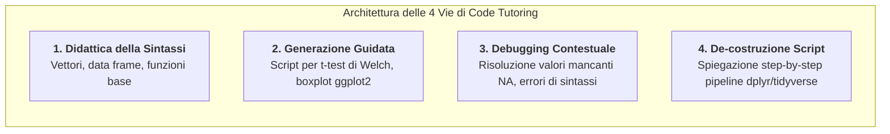
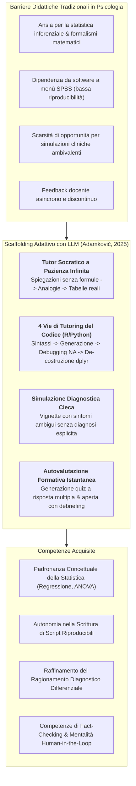

# Adaptive Learning and Code Tutoring in Psychology (Apprendimento Adattivo e Tutoring di Programmazione in Psicologia)

## Definizione Operativa
- Sintesi: L'**Adaptive Learning and Code Tutoring in Psychology** (apprendimento adattivo e tutoraggio computazionale nelle scienze psicologiche) identifica il modello pedagogico mediato da modelli linguistici di grandi dimensioni ([[large-language-models]]) finalizzato a personalizzare l'insegnamento della psicologia, decostruire l'ansia statistica e facilitare l'acquisizione di competenze computazionali aperte (R, Python). Supera il paradigma trasmissivo frontale e l'uso acritico di software commerciali point-and-click (SPSS), integrando l'LLM come **tutor socratico a infinita pazienza**.
- **Utilità CBT:** Trova applicazione nel role-playing terapeutico didattico (es. gestione dell'ansia scolastica con tecniche CBT) e nelle simulazioni cliniche formative caratterizzate da ambiguità diagnostica. Gli studenti possono simulare vignette cliniche a risoluzione aperta senza rivelare inizialmente la diagnosi, allenando il ragionamento clinico differenziale prima del tirocinio sul campo e ricevendo debriefing formativo istantaneo sullo stile comunicativo e sulle scelte d'intervento. Le simulazioni testuali restano tuttavia uno strumento di addestramento preliminare per preservare l'empatia, e non sostituiscono il tirocinio clinico supervisionato.

## Evidenze dalla Letteratura
- **Scaffolding Adattivo e Decostruzione Quantitativa (Adamkovič, 2025):** L'LLM adatta dinamicamente il livello di astrazione teorico-quantitativa alle preconoscenze dello studente. Ad esempio, nella decostruzione di concetti come la regressione lineare, l'interazione viene strutturata per abbattere la complessità: 1) Definizione generale; 2) Abbattimento del formalismo per ridurre l'ansia matematica (*statistical anxiety*); 3) Chiarimento sottile con analogie quotidiane (es. coefficienti standardizzati vs non); 4) Interpretazione applicata su tabelle empiriche; 5) Feedback formativo istantaneo tramite quiz.
- **4 Vie per l'Apprendimento del Codice (Masuadi et al., 2021; Adamkovič, 2025):** Per la transizione da SPSS a linguaggi aperti, l'LLM guida l'apprendimento su quattro binari:
  1. *Insegnamento Fondazionale:* Sintassi base (vettori, data frame, indici descrittivi).
  2. *Generazione Guidata:* Script vincolati al contesto (es. t-test di Welch, boxplot ggplot2).
  3. *Debugging Interattivo:* Risoluzione di errori (es. `mean()` con `NA`) spiegando i parametri per prevenire errori futuri.
  4. *De-costruzione Script:* Spiegazione step-by-step di pipeline complesse (es. operatori pipe `%>%`, `dplyr`, `mutate`).

- **Rischi Pedagogici e Salvaguardie Metacognitive (Holmes et al., 2019; Lee et al., 2025):** Sebbene si ancori a teorie dell'apprendimento attivo, vi è il rischio di de-skilling e *cognitive offloading*. L'accettazione passiva del codice può generare una falsa competenza (*illusion of explanatory depth*). È cruciale la scrittura e l'esecuzione manuale del codice, oltre a salvaguardie contro le allucinazioni statistiche. I risultati devono essere sempre testati nell'interprete (fact-checking e mentalità human-in-the-loop).

**Riferimenti Bibliografici:**
- **Adamkovič, M. (2025).** *Large Language Models in (Not Only) Psychology Training and Research: A Brief Introduction*. Centre of Social and Psychological Sciences, Slovak Academy of Sciences. https://doi.org/10.31577/2025.9788082980144
- **Holmes, W., Bialik, M., & Fadel, C. (2019).** *Artificial Intelligence in Education: Promises and Implications for Teaching and Learning* (1st ed.). Center for Curriculum Redesign.
- **Lee, H. P. H., Sarkar, A., Tankelevitch, L., et al. (2025).** The Impact of Generative AI on Critical Thinking: Self-Reported Reductions in Cognitive Effort and Confidence Effects From a Survey of Knowledge Workers. *Microsoft Research Preprint*.
- **Masuadi, E., Mohamud, M., Almutairi, M., et al. (2021).** Trends in the usage of statistical software and their associated study designs in health sciences research: A bibliometric analysis. *Cureus*, 13(8), e12639.

## Relazioni
- [[final-textbook-genaiinpsychologyresearchandtraining]]
- [[design-tweaking-conceptual-replication]]
- [[prompting-in-psychology]]
- [[cognitive-offloading-e-diagnostic-deskilling]]
- [[human-in-the-reasoning]]
- [[modello-centauro-clinico]]
- [[simulazione-pazienti-ai]]
- [[ai-literacy-in-academia]]
- [[stepwise-cot]]
