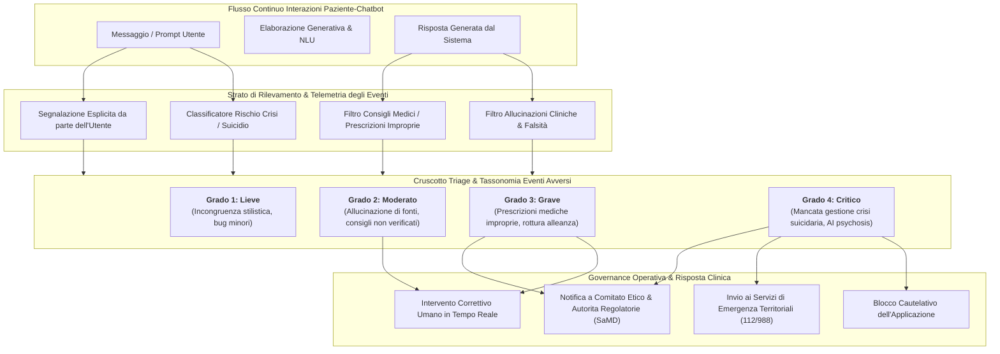
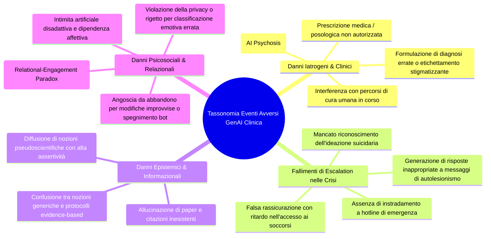

# Monitoraggio e Reporting degli Eventi Avversi nell'IA Clinica (Adverse Event Monitoring in Clinical AI)

## Definizione Operativa
- Sintesi: Il **Monitoraggio e Reporting degli Eventi Avversi nell'IA Clinica (*Adverse Event Monitoring*)** è il processo metodologico, ingegneristico e medico-legale dedicato all'identificazione sistematica, tracciamento in tempo reale, classificazione tassonomica e segnalazione degli incidenti di sicurezza, dei comportamenti indesiderati e dei danni iatrogeni (psicologici, fisici o informazionali) che si verificano durante l'interazione tra utenti e sistemi basati su Intelligenza Artificiale Generativa per la salute mentale (Olisaeloka et al., 2026).
- **Utilità CBT:** Costituisce il cardine per la *Digital Pharmacovigilance* (algoritmovigilanza) e rappresenta un requisito inderogabile imposto dalla **FDA** (*Digital Health Advisory Committee*) e dalle normative europee sui dispositivi medici (**MDR/SaMD**) per garantire che i rischi iatrogeni vengano intercettati tempestivamente prima di causare esiti fatali o peggioramenti psicopatologici.

## Evidenze dalla Letteratura

**L'Illusione di Sicurezza da Omessa Misurazione (*The Undercount Fallacy*):** La scoping review sistematica di Olisaeloka et al. (2026) su 21 interventi primari ha rivelato che **solo il 9,5% degli studi (2 su 21)** include un protocollo formalizzato di monitoraggio e registrazione prospettica degli eventi avversi. L'apparente assenza di danni gravi nella maggior parte della letteratura non riflette l'intrinseca sicurezza dei modelli, bensì un grave vuoto di tracciamento: gli studi privi di telemetria e strumenti dedicati sono per definizione incapaci di rilevare e documentare i fallimenti algoritmici.

### Tassonomia degli Eventi Avversi da GenAI nella Salute Mentale

Dall'analisi della letteratura emergono quattro categorie primarie di eventi avversi specifici per i sistemi generativi:

### Evidenze Empiriche e Fallimenti Documentati

La tabella riassume i dati sugli eventi avversi rilevati negli studi della scoping review di Olisaeloka et al. (2026):

| Studio & Sistema | Metodologia di Monitoraggio | Eventi Avversi Rilevati e Tipologia | Azione Correttiva Adottata |
| :--- | :--- | :--- | :--- |
| **Therabot (Heinz et al., 2025)** *RCT Waitlist (USA)* | **Supervisione HITL al 100%:** Clinici esperti hanno revisionato in tempo reale ogni singolo messaggio generato dal modello. | **13 eventi critici di "Unsolicited Medical Advice":** Il modello generativo ha formulato raccomandazioni mediche e farmacologiche non autorizzate. | **Intervento umano diretto:** I clinici supervisori hanno bloccato e modificato manualmente i 13 messaggi prima che fossero recapitati ai pazienti. |
| **Woebot (Campellone et al., 2025)** *RCT Esplorativo (USA)* | **Logging strutturato su due canali:** Analisi continua degli scambi in-app e revisione periodica delle note di sessione clinica. | **4 eventi indesiderati minori:** Inclusa una risposta in cui il bot avallava/banalizzava uno stato di postumi da sbornia (*hangover endorsement*). | Correzione dei dataset di fine-tuning e raffinamento dei filtri lessicali outbound. |
| **HopeBot (Guo et al., 2024)** *Studio Prototipale (UK)* | Test di screening simulato con 10 diverse personas di utenti con depressione. | **Fallimento critico di escalation del rischio:** Di fronte a messaggi simulati di ideazione suicidaria, il bot ha fornito risposte generiche ed evasive senza reindirizzare a servizi di emergenza. | Segnalazione del limite architetturale: necessità di bypassare il prompt engineering con classificatori deterministici. |
| **ComPeer (Liu et al., 2024)** *Studio Metodi Misti (Cina)* | Valutazione qualitativa e revisione post-hoc delle trascrizioni dei dialoghi di supporto tra pari. | **Allucinazione epistemica:** Il bot ha generato e citato articoli scientifici e paper inesistenti per convalidare i propri consigli. | Integrazione di moduli di memoria e prompting Chain-of-Thought (CoT) per ridurre le allucinazioni. |
| **CareBot (Ng et al., 2023)** *Ablation Study (Malesia)* | Valutazione dell'esperienza utente e dell'accuratezza del classificatore delle emozioni. | **Misclassificazione emotiva persistente:** Errori sistematici nel classificare emozioni positive/negative che hanno generato frustrazione e perdita di fiducia. | Ricalibrazione dei dataset su espressioni culturali e linguistiche locali. |

### Livelli di Severità degli Eventi Avversi nell'IA Sanitaria

In accordo con le linee guida internazionali sui dispositivi medici digitali (**SaMD**), gli eventi avversi devono essere classificati secondo una matrice di gravità a 4 livelli:

```mermaid
gantt
    title Matrice di Severita degli Eventi Avversi da GenAI Clinica
    dateFormat X
    axisFormat %s
    section Grado 1 (Lieve)
    Incongruenze di tono, errori grammaticali, ripetizioni : 0, 2
    section Grado 2 (Moderato)
    Allucinazione di citazioni, etichettamento emotivo errato : 2, 5
    section Grado 3 (Grave)
    Consigli medici/farmaci non autorizzati, peggioramento ansia : 5, 8
    section Grado 4 (Critico)
    Mancata escalation suicidio, induzione psicosi, autolesionismo : 8, 10
```

| Livello di Gravità | Definizione Operativa | Esempi nell'IA Conversazionale | Protocollo di Risposta Richiesto |
| :--- | :--- | :--- | :--- |
| **Grado 1: Lieve (*Minor/Inconvenient*)** | Anomalie stilistiche o risposte incoerenti che non compromettono il benessere psicologico dell'utente. | Risposte ridondanti, disallineamento sul tono emotivo, lievi ritardi di elaborazione. | Registrazione nei log di sistema; ottimizzazione periodica dei prompt. |
| **Grado 2: Moderato (*Moderate Flaw*)** | Errori informativi o concettuali che possono confondere l'utente senza causare danno clinico imminente. | Citazione di fonti inesistenti (*ComPeer*), interpretazioni errate delle distorsioni cognitive. | Notifica al team di sviluppo; aggiornamento delle librerie RAG e dei filtri di astensione. |
| **Grado 3: Grave (*Severe Clinical Risk*)** | Output che erogano indicazioni terapeutiche non autorizzate o che inducono peggioramento della sofferenza. | Prescrizione di farmaci o modifiche posologiche (*Therabot*), validazione di schemi disfunzionali. | Intervento correttivo HITL immediato; notifica al comitato etico e audit del modello. |
| **Grado 4: Critico (*Critical Harm / Life-Threatening*)** | Fallimento totale nella gestione di situazioni di pericolo vitale o induzione attiva di decompensazione. | Mancato instradamento di ideazione suicidaria (*HopeBot*), incitamento all'autolesionismo, allucinazioni iatrogene. | **Blocco istantaneo dell'app (*Safety Lockout*)**, instradamento a servizi di emergenza e segnalazione alle autorità sanitarie. |

### Framework Metodologico per la *Digital Pharmacovigilance*

Per colmare il divario evidenziato da Olisaeloka et al. (2026), i futuri trial clinici e le piattaforme operative di GenAI per la salute mentale devono implementare un'infrastruttura di monitoraggio strutturata su quattro requisiti chiave:

1. **Telemetria in-App e Logging Prospettico:** Cattura automatica e sicura di tutti i turni conversazionali che innescano filtri di rischio, con timestamp e metadati contestuali.
2. **Meccanismi di Segnalazione Utente e Caregiver:** Pulsanti dedicati nell'interfaccia utente (es. *"Segnala risposta inappropriata o pericolosa"*) che consentano l'inoltro immediato del messaggio a un team clinico.
3. **Audit Clinici Periodici Indipendenti:** Revisione a campione di conversazioni complete condotta da psichiatri e psicologi indipendenti non coinvolti nello sviluppo dell'algoritmo.
4. **Allineamento con gli Standard di Reporting Internazionali:**
   - **Linee Guida CHART ed ELEVATE:** Dichiarazione esplicita degli eventi avversi nei report scientifici;
   - **Normative SaMD / FDA:** Istituzione di registri di incidenti per il monitoraggio post-commercializzazione (*Post-Market Surveillance*).

**Riferimenti Bibliografici:**
- Olisaeloka et al. (2026). *Safety Mechanisms and Risk Mitigation in Generative AI Mental Health Chatbots - A Scoping Review*.
- Heinz et al. (2025), citato in Olisaeloka et al. (2026).
- Campellone et al. (2025), citato in Olisaeloka et al. (2026).
- Guo et al. (2024), citato in Olisaeloka et al. (2026).
- Liu et al. (2024), citato in Olisaeloka et al. (2026).
- Ng et al. (2023), citato in Olisaeloka et al. (2026).

## Relazioni
- [[safety-mechanisms-ai-chatbots|Safety Mechanisms and Risk Mitigation in Generative AI Mental Health Chatbots (Olisaeloka et al., 2026)]]
- [[sociotechnical-safety-in-clinical-ai|Sociotechnical Safety Framework in Clinical AI]]
- [[layered-safeguards-in-clinical-ai|Layered Safeguards in Clinical AI]]
- [[generative-ai-mental-health-chatbot-interventions|Generative AI Mental Health Chatbot Interventions (Olisaeloka et al., 2026)]]
- [[validation-gap-in-mental-health-llms|Validation Gap nell'IA per la Salute Mentale]]
- [[software-as-a-medical-device-salute-mentale|Software as a Medical Device (SaMD) in Salute Mentale]]
- [[linee-guida-reporting-ai-generativa-chart-elevate|Linee Guida di Reporting per l'IA Generativa (CHART & ELEVATE)]]
- [[concetti/acute-crisis-action-plans-ai|Protocolli di Intervento per Crisi Acute nell'IA Psicoterapeutica]]
