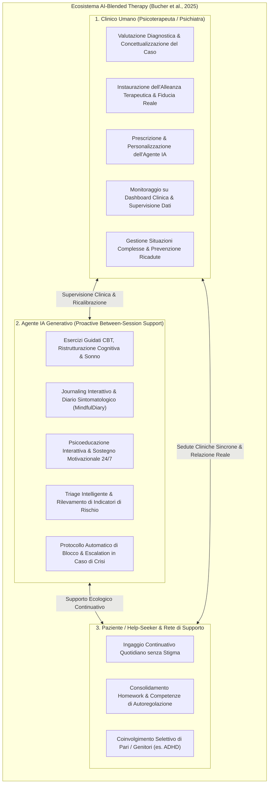
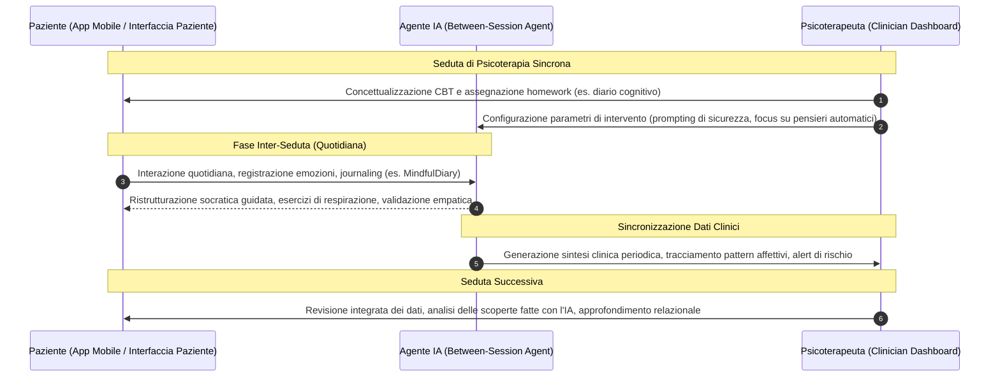

# AI-Blended Therapy (Terapia Integrata con Agenti Generativi di IA)

## Definizione Operativa
- Sintesi: L'**AI-Blended Therapy** (Terapia Integrata con IA Generativa) è il modello clinico ed ecologico formulato da Bucher, Egger, Vashkite, Wu e Schwabe (2025; *JMIR Mental Health*, doi: [10.2196/78410](https://doi.org/10.2196/78410)) che definisce l'integrazione strutturale degli agenti conversazionali basati su modelli linguistici di grandi dimensioni ([[large-language-models|LLM]]) all'interno di percorsi psicoterapeutici e psichiatrici **guidati e supervisionati da clinici umani abilitati**. A differenza del *blended care* classico (Wentzel et al., 2016; Herbener & Damholdt, 2025) dove i moduli digitali sono statici, deterministici e basati su regole o alberi decisionali passivi, nell'AI-Blended Therapy gli agenti manifestano una **agency conversazionale proattiva** (*proactive conversational agency*), consentendo un supporto altamente personalizzato, dialogico e adattivo tra una seduta e l'altra (*between-session engagement*), pur mantenendo l'ancoraggio deontologico e decisionale al terapeuta umano. L'obiettivo clinico è superare il paradigma fallimentare e rischioso delle applicazioni "fai-da-te" monoutente (*single-user standalone silos*), garantendo la salvaguardia dell'alleanza terapeutica, la prevenzione di allucinazioni iatrogene e la continuità ecologica del trattamento.
- **Utilità CBT:** L'architettura multi-stakeholder a tre terminali supporta un ingaggio continuativo quotidiano senza stigma. Attraverso l'agente IA generativo, i pazienti consolidano gli homework e le competenze di autoregolazione svolgendo esercizi guidati CBT, ristrutturazione cognitiva, miglioramento del sonno, psicoeducazione interattiva, sostegno motivazionale 24/7 e journaling interattivo (come il diario sintomatologico MindfulDiary). Il sistema implementa un triage intelligente con rilevamento di indicatori di rischio, protocolli di blocco automatico ed escalation sicura in caso di crisi. Il clinico sfrutta la dashboard clinica per la valutazione diagnostica, prescrizione e personalizzazione dell'agente, monitoraggio e supervisione dei dati, consentendo la gestione di situazioni complesse, la prevenzione delle ricadute e la revisione integrata dei dati durante la seduta, dedicando maggior tempo all'approfondimento relazionale e all'alleanza terapeutica. È possibile anche un coinvolgimento selettivo di pari o genitori (es. ADHD).

## Evidenze dalla Letteratura
Il razionale clinico per l'adozione dell'AI-Blended Therapy rispetto alle app autonome si basa sulla mitigazione di gravi criticità (Bucher et al., 2025; Balan & Gumpel, 2025; Lawrence et al., 2024):
- **Mitigazione del Rischio Iatrogeno e delle Allucinazioni:** I modelli autonomi possono generare informazioni mediche errate o pericolose (es. consigli dietetici a pazienti con anoressia, Monteith et al., 2024; o pessimismo prognostico demoralizzante, Elyoseph et al., 2024). Nell'AI-Blended Therapy, il clinico accede ai report sintetici e disinnesca immediatamente fraintendimenti o credenze distorte, rettificando i dati e controllando i prompt.
- **Preservazione dell'Alleanza Terapeutica e della Relazione Reale:** La tecnologia non possiede intenzionalità né coscienza morale ([[genuineness-gap|Genuineness Gap]]). Tuttavia, ereditando la legittimità del professionista umano (*Stamp of Approval*), l'agente è percepito come un'estensione della cura (*collaborative tool*), massimizzando la motivazione, la persistenza al trattamento (*adherence*), e riducendo il *drop-out* tipico dell' *overreliance* / *halo effect* nei bot monoutente.
- **Gestione Dinamica dell'Emergenza e Protocolli di Escalation:** A differenza dei chatbot autonomi che continuano a conversare anche dopo aver consigliato il pronto soccorso in caso di ideazione suicidaria (Heston, 2023), i sistemi blended attivano un canale di notifica prioritaria (*escalation sicura*) al terapeuta o ai servizi territoriali al rilevamento di segnali di allarme.

```mermaid
flowchart LR
    subgraph StandaloneRisks ["Rischi delle App Standalone Monoutente"]
        R1["<b>Halo Effect & Overreliance:</b> Il paziente crede all'onniscienza del bot"]
        R2["<b>Rischio Iatrogeno:</b> Allucinazioni su diete restrittive o farmaci"]
        R3["<b>Fallimento in Crisi:</b> Mancata interruzione in ideazione suicidaria"]
        R4["<b>Drop-out Elevato:</b> Mancanza di legame interpersonale autentico"]
    end

    subgraph BlendedSolutions ["Soluzioni dell'AI-Blended Therapy"]
        S1["<b>Supervisione Clinica:</b> Il terapeuta rettifica i dati e controlla i prompt"]
        S2["<b>Stamp of Approval:</b> L'agente eredita la legittimità del professionista"]
        S3["<b>Escalation Sicura:</b> Allerta immediata del terapeuta in caso di acuzie"]
        S4["<b>Adherence Potenziata:</b> Il lavoro inter-seduta è valorizzato in seduta"]
    end

    StandaloneRisks ==> BlendedSolutions
```

### Applicazioni Empiriche di Ecosistemi Blended
Studi pionieristici dimostrano l'efficacia del modello:
- **MindfulDiary (Kim et al., 2024):** Integra un'interfaccia paziente basata su LLM per il journaling guidato e una *dashboard clinica*. I pazienti psichiatrici usano il bot per chiarire i pensieri; l'IA genera riassunti e mappe tematiche per lo psichiatra, risparmiando tempo anamnestico e approfondendo l'intervento.
- **Robotica Assistiva e Terapia Occupazionale per ADHD (Berrezueta-Guzman et al., 2024):** Sistema tripartito in cui un robot LLM assiste il bambino in compiti esecutivi, mentre un'app mobile condivide metriche di attenzione ed engagement con terapeuta e genitori.
- **Supporto Motivazionale alle Malattie Croniche (Bassi et al., 2022):** Integrazione del virtual coach *Motibot* per adulti con patologie croniche, con supervisione periodica da parte del personale sanitario per sostenere il coping adattivo.

### Questioni Aperte di Governance e Deontologia
L'implementazione su larga scala solleva questioni cruciali (Bucher et al., 2025):
1. **Governance e Confidenzialità dei Dati Inter-Seduta (Dilemma dello Spazio Protetto):** Un monitoraggio totale rischia di inibire la spontaneità (*chilling effect*); di contro, una sintesi aggregata dell'IA deve garantire l'assenza di allucinazioni omissionistiche.
2. **Definizione Chiara dei Ruoli Operativi:** L'agente non deve presentarsi come "sostituto del terapeuta", bensì come un facilitatore di processi (allenatore di abilità, facilitatore di introspezione o memoria di lavoro clinica).
3. **Responsabilità Medico-Legale Non Delegabile:** Le decisioni diagnostiche, terapeutiche e di emergenza restano al professionista umano (*human-in-the-loop / human-in-the-reasoning*).
4. **AI Literacy per Clinici e Pazienti:** È indispensabile formare il terapeuta a interpretare criticamente gli output dell'IA, gestire la dashboard e istruire il paziente sui limiti del modello linguistico.

**Riferimenti Bibliografici:**
- Bucher, A., Egger, S., Vashkite, I., Wu, W., & Schwabe, G. (2025). "It’s Not Only Attention We Need": Systematic Review of Large Language Models in Mental Health Care. *JMIR Mental Health*, 12, e78410. https://doi.org/10.2196/78410
- Wentzel, J., et al. (2016). Blended eHealth for depression: a systematic review and meta-analysis. *JMIR Mental Health*, 3(3), e34.
- Herbener, P. S., & Damholdt, M. F. (2025). AI in Psychotherapy: The Genuineness and Credibility Gaps. *arXiv:2509.02144*.
- Kim, T., Bae, S., Kim, H., Lee, S., Hong, H., & Yang, C. (2024). MindfulDiary: harnessing large language model to support psychiatric patients' journaling. *CHI '24*, 1–20.
- Berrezueta-Guzman, S., et al. (2024). Exploring the efficacy of robotic assistants with chatGPT and claude in enhancing ADHD therapy. *Intelligent Environments 2024*, 1–10.
- Bassi, G., et al. (2022). A virtual coach (Motibot) for supporting healthy coping strategies among adults with diabetes. *JMIR Human Factors*, 9(1), e32211.

## Relazioni
- [[mental-v12i1e78410]]
- [[three-layer-morphological-framework-mental-health-ai]]
- [[concetti/blended-care-ai-framework]]
- [[modello-centauro-clinico]]
- [[prognostic-pessimism-in-clinical-ai]]
- [[retrieval-vs-generative-clinical-chatbots]]
- [[three-layer-governance-framework]]
- [[human-in-the-reasoning]]
- [[layered-safeguards-in-clinical-ai]]
