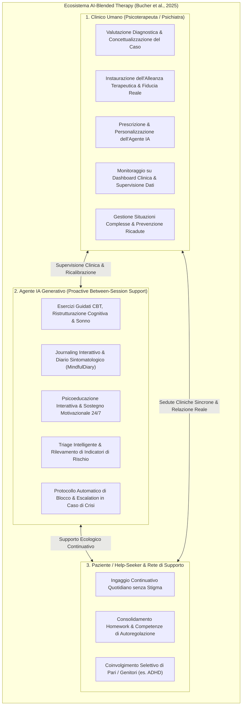
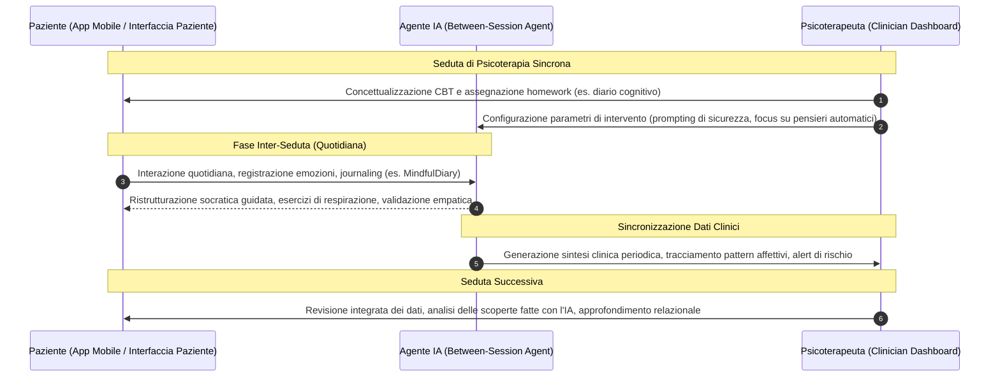

```mermaid
flowchart LR
    subgraph StandaloneRisks ["Rischi delle App Standalone Monoutente"]
        R1["<b>Halo Effect & Overreliance:</b> Il paziente crede all'onniscienza del bot"]
        R2["<b>Rischio Iatrogeno:</b> Allucinazioni su diete restrittive o farmaci"]
        R3["<b>Fallimento in Crisi:</b> Mancata interruzione in ideazione suicidaria"]
        R4["<b>Drop-out Elevato:</b> Mancanza di legame interpersonale autentico"]
    end

    subgraph BlendedSolutions ["Soluzioni dell'AI-Blended Therapy"]
        S1["<b>Supervisione Clinica:</b> Il terapeuta rettifica i dati e controlla i prompt"]
        S2["<b>Stamp of Approval:</b> L'agente eredita la legittimità del professionista"]
        S3["<b>Escalation Sicura:</b> Allerta immediata del terapeuta in caso di acuzie"]
        S4["<b>Adherence Potenziata:</b> Il lavoro inter-seduta è valorizzato in seduta"]
    end

    StandaloneRisks ==> BlendedSolutions
```

# AI-Blended Therapy (Terapia Integrata con Agenti Generativi di IA)

## Definizione Operativa
- L'**AI-Blended Therapy** (Terapia Integrata con IA Generativa) è il modello clinico ed ecologico formulato da Bucher, Egger, Vashkite, Wu e Schwabe (2025; *JMIR Mental Health*, doi: [10.2196/78410](https://doi.org/10.2196/78410)) che definisce l'integrazione strutturale degli agenti conversazionali basati su modelli linguistici di grandi dimensioni ([[large-language-models|LLM]]) all'interno di percorsi psicoterapeutici e psichiatrici **guidati e supervisionati da clinici umani abilitati**.
- **Distinzione Rispetto al Blended Care Tradizionale:**
  - Nel *blended care* classico (Wentzel et al., 2016; Herbener & Damholdt, 2025), i moduli digitali sono tipicamente deterministici, statici e basati su regole o alberi decisionali passivi.
  - Nell'**AI-Blended Therapy**, gli agenti basati su LLM manifestano una vera e propria **agency conversazionale proattiva** (*proactive conversational agency*), consentendo un supporto altamente personalizzato, dialogico e adattivo tra una seduta e l'altra (*between-session engagement*), pur mantenendo l'ancoraggio deontologico e decisionale al terapeuta umano.
- **Obiettivo Clinico:** Superare il paradigma fallimentare e rischioso delle applicazioni "fai-da-te" monoutente (*single-user standalone silos*), garantendo la salvaguardia dell'alleanza terapeutica, la prevenzione di allucinazioni iatrogene e la continuità ecologica del trattamento.

---

## Razionale Clinico: Perché l'AI-Blended Therapy Supera i Limiti delle App Autonome

La letteratura sistematica (Bucher et al., 2025; Balan & Gumpel, 2025; Lawrence et al., 2024) documenta gravi criticità quando i pazienti utilizzano chatbot generativi in totale autonomia:

1. **Mitigazione del Rischio Iatrogeno e delle Allucinazioni:**
   - Negli studi su modelli autonomi, gli LLM possono generare informazioni mediche errate o pericolose (es. consigli dietetici a pazienti con anoressia, Monteith et al., 2024; o pessimismo prognostico demoralizzante, Elyoseph et al., 2024). Nell'AI-Blended Therapy, il clinico ha accesso ai report sintetici generati dall'IA e può disinnescare immediatamente fraintendimenti o credenze distorte.
2. **Preservazione dell'Alleanza Terapeutica e della Relazione Reale:**
   - La tecnologia non possiede intenzionalità né coscienza morale ([[genuineness-gap|Genuineness Gap]]). Tuttavia, quando l'agente è raccomandato e calibrato dal terapeuta di fiducia, il paziente percepisce lo strumento come un'estensione della cura (*collaborative tool*), massimizzando la motivazione e la persistenza al trattamento (*adherence*).
3. **Gestione Dinamica dell'Emergenza e Protocolli di Escalation:**
   - Molti chatbot autonomi continuano a conversare anche dopo aver consigliato il pronto soccorso (Heston, 2023). In un sistema blended, l'individuazione di segnali di allarme (parole chiave di autolesionismo, drastico calo dell'umore) attiva un **canale di notifica prioritaria** al terapeuta curante o ai servizi di emergenza territoriali.

---

## Architettura dei Flussi di Dati e Interazione Multi-Utente

A differenza del 94% delle attuali applicazioni che sono monoutente (*single-user silos*), l'AI-Blended Therapy richiede un'architettura **multi-stakeholder** a tre terminali:

---

## Applicazioni Empiriche di Ecosistemi Blended

Sebbene la maggior parte della letteratura sia ancora a livello di fattibilità tecnica, studi pionieristici dimostrano la fattibilità e l'efficacia del modello blended:
- **MindfulDiary (Kim et al., 2024):** Sistema che integra un'interfaccia paziente basata su LLM per il journaling guidato e una *dashboard per il clinico*. I pazienti psichiatrici utilizzano il bot per chiarire i propri pensieri quotidiani; il modello genera automaticamente riassunti longitudinali e mappe dei temi ricorrenti che lo psichiatra esamina all'inizio della seduta, risparmiando tempo anamnestico e aumentando la profondità dell'intervento.
- **Robotica Assistiva e Terapia Occupazionale per l'ADHD (Berrezueta-Guzman et al., 2024):** Sistema tripartito in cui un robot conversazionale abilitato da LLM lavora con il bambino nello svolgimento di compiti esecutivi, mentre un'applicazione mobile condivide in tempo reale metriche di attenzione ed engagement sia con il terapeuta che con i genitori.
- **Supporto Motivazionale alle Malattie Croniche (Bassi et al., 2022):** Integrazione del virtual coach *Motibot* per adulti con patologie croniche, con supervisione periodica da parte del personale sanitario per sostenere il coping adattivo.

---

## Questioni Aperte di Governance e Deontologia

L'implementazione su larga scala dell'AI-Blended Therapy solleva questioni cruciali analizzate da Bucher et al. (2025):

1. **Governance e Confidenzialità dei Dati Inter-Seduta:**
   - *Dilemma dello Spazio Protetto:* Quanta parte delle trascrizioni integrali del paziente deve essere visibile al terapeuta? Un monitoraggio totale rischia di inibire la spontaneità dell'utente (*chilling effect*); una sintesi aggregata generata dall'IA deve garantire l'assenza di allucinazioni omissionistiche.
2. **Definizione Chiara dei Ruoli Operativi:**
   - L'agente non deve mai presentarsi come "sostituto del terapeuta", bensì come un **facilitatore di processi** (allenatore di abilità, facilitatore di introspezione o memoria di lavoro clinica).
3. **Responsabilità Medico-Legale Non Delegabile:**
   - La responsabilità per la diagnosi, la formulazione del piano terapeutico e le decisioni di emergenza rimane inderogabilmente in capo al professionista umano (*human-in-the-loop / human-in-the-reasoning*).
4. **AI Literacy per Clinici e Pazienti:**
   - È indispensabile una formazione strutturata che abiliti il terapeuta a interpretare criticamente gli output dell'IA, a gestire la propria dashboard e a educare il paziente sui limiti del modello linguistico.

---

## Riferimenti Bibliografici
- Bucher, A., Egger, S., Vashkite, I., Wu, W., & Schwabe, G. (2025). "It’s Not Only Attention We Need": Systematic Review of Large Language Models in Mental Health Care. *JMIR Mental Health*, 12, e78410. https://doi.org/10.2196/78410
- Wentzel, J., et al. (2016). Blended eHealth for depression: a systematic review and meta-analysis. *JMIR Mental Health*, 3(3), e34.
- Herbener, P. S., & Damholdt, M. F. (2025). AI in Psychotherapy: The Genuineness and Credibility Gaps. *arXiv:2509.02144*.
- Kim, T., Bae, S., Kim, H., Lee, S., Hong, H., & Yang, C. (2024). MindfulDiary: harnessing large language model to support psychiatric patients' journaling. *CHI '24*, 1–20.
- Berrezueta-Guzman, S., et al. (2024). Exploring the efficacy of robotic assistants with chatGPT and claude in enhancing ADHD therapy. *Intelligent Environments 2024*, 1–10.
- Bassi, G., et al. (2022). A virtual coach (Motibot) for supporting healthy coping strategies among adults with diabetes. *JMIR Human Factors*, 9(1), e32211.

---

## Relazioni
- [[mental_v12i1e78410]]
- [[three-layer-morphological-framework-mental-health-ai]]
- [[concetti/blended-care-ai-framework]]
- [[modello-centauro-clinico]]
- [[prognostic-pessimism-in-clinical-ai]]
- [[retrieval-vs-generative-clinical-chatbots]]
- [[three-layer-governance-framework]]
- [[human-in-the-reasoning]]
- [[layered-safeguards-in-clinical-ai]]
