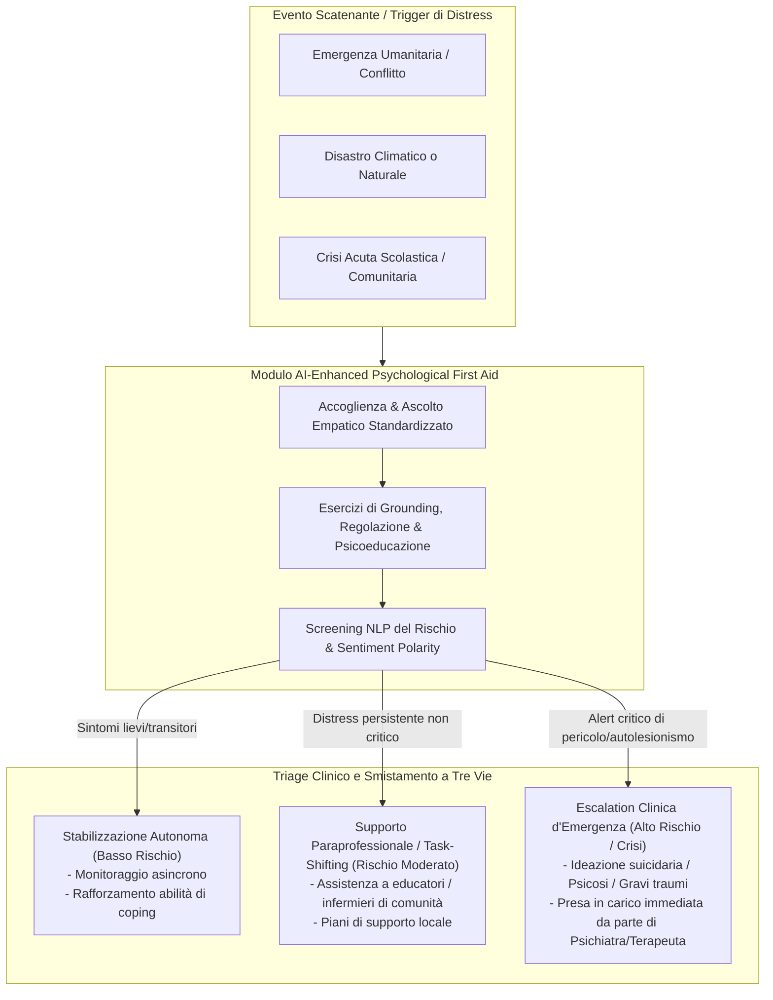

# Primo Soccorso Psicologico Potenziato da IA (AI-Enhanced Psychological First Aid - PFA)

## Definizione Operativa
- L'**AI-Enhanced Psychological First Aid (PFA)** è un framework applicativo e clinico analizzato da **Espino Carrasco et al. (2025)** che integra modelli di elaborazione del linguaggio naturale (NLP), agenti conversazionali adattivi e sistemi di screening intelligenti all'interno dei protocolli internazionalmente validati di **Primo Soccorso Psicologico (Psychological First Aid)** promossi dall'OMS e dallo *Inter-Agency Standing Committee* (IASC).
- **La Funzione di "Ponte Operativo" (*Triage and Stabilization Bridge*):** Il sistema non persegue finalità psicoterapeutiche a lungo termine né tenta di sostituire la relazione clinica complessa, bensì opera come interfaccia immediata, sostenibile e a bassa intensità tra l'evento critico acuto e il sistema sanitario formale:
  1. *De-escalation e Contenimento Emotivo:* Offre risposte strutturate di validazione non giudicante e ascolto empatico standardizzato nelle primissime ore/giorni successivi a un trauma o distress acuto.
  2. *Tecniche di Grounding e Stabilizzazione:* Guida l'utente attraverso protocolli validati di respirazione controllata, esercizi di ancoraggio sensoriale (grounding) e psicoeducazione essenziale sulle reazioni allo stress.
  3. *Triage Intelligente e Screening del Rischio:* Monitora costantemente la comparsa di indicatori critici (ideazione suicidaria, dissociazione grave, psicosi) per attivare l'escalation immediata a professionisti sanitari.
  4. *Integrazione con il Task-Shifting e la Rete Comunitaria:* Fornisce a operatori sanitari non specialistici, infermieri ed educatori toolkit digitali per identificare e supportare soggetti a rischio, collegandoli a risorse materiali e mediche sul territorio.
- **Utilità Clinica e CBT:** Costituisce il livello di ingresso (*entry point*) di un modello di cura a gradini (*stepped care*). Intercettando il distress prima che si cronicizzi in disturbi da stress post-traumatico (PTSD), depressione maggiore o ansia disabilitante, preserva le limitate risorse specialistiche umane per i casi ad alta complessità.

---

## Principi Fondamentali di Implementazione

### 1. Risposta Rapida in Scenari di Trauma Climatico e Crisi Sociali
- **Flessibilità di Intervento:** Gli studi esaminati da Espino Carrasco et al. (es. Saltzman & Hansel, 2024 per i traumi post-eventi climatici estremi; Bondar et al., 2025 per contesti di conflitto) dimostrano che la tempestività del supporto nei giorni successivi al trauma è il fattore prognostico più determinante per prevenire lo sviluppo di PTSD.
- **Accessibilità Istantanea:** L'AI-Enhanced PFA abbatte le barriere geografiche e temporali, permettendo l'erogazione contestuale di interventi di stabilizzazione anche quando le infrastrutture sanitarie locali sono collassate o sature.

---

### 2. Task-Shifting e Democratizzazione dell'Assistenza (LMIC)
- **Superamento della Carenza di Personale:** Nei paesi a basso e medio reddito (LMIC), dove vi è una media inferiore a un professionista di salute mentale ogni 100.000 abitanti, l'erogazione di terapie tradizionali su larga scala è irrealizzabile.
- **Empowerment degli Operatori di Prima Linea:** L'IA funge da co-pilota per figure non specializzate (operatori di comunità, volontari della protezione civile, insegnanti; Freitas et al., 2025):
  - Suggerisce schemi di colloquio supportivo;
  - Aiuta a decodificare segnali non verbali o paraverbali di forte sofferenza;
  - Standardizza la qualità dell'assistenza di base secondo le linee guida internazionali.

---

### 3. Rispetto Culturale e Integrazione con i Sistemi Tradizionali
- **Adattamento Oltre la Lingua:** Un sistema di AI-Enhanced PFA non deve limitarsi a tradurre letteralmente i testi occidentali, ma deve incorporare i significati culturali del trauma e del lutto (Irfan et al., 2024; Shidhaye, 2024).
- **Integrazione con le Risorse della Comunità:** L'agente intelligente deve indirizzare l'utente non solo a presidi medici, ma valorizzare le reti naturali di supporto sociale, le associazioni locali e i contesti comunitari protetti.

---

### 4. Salvaguardie Deontologiche e Protocolli di Fail-Safe
- **Esplicita Dichiarazione di Non-Umanità:** Il sistema deve chiarire immediatamente e in modo inequivocabile la propria natura algoritmica, prevenendo illusioni di legame transferale o attaccamenti parasociali patologici.
- **Nessuna Prescrizione Autonoma:** Il modulo PFA è strettamente vincolato alla stabilizzazione emotiva e non deve formulare diagnosi psichiatriche né consigliare terapie farmacologiche.
- **Hard Fallback di Sicurezza:** In caso di esplicita dichiarazione di intento suicidario o rischio per l'incolumità propria e altrui, il sistema interrompe l'interazione standard, attiva numeri di emergenza geolocalizzati e avvisa gli operatori reperibili.

---

## Confronto: PFA Tradizionale vs AI-Enhanced PFA

| Parametro | Psychological First Aid Tradizionale | AI-Enhanced Psychological First Aid |
| :--- | :--- | :--- |
| **Operatore Principale** | Operatore umano formato (volontario o professionista) | Agente conversazionale algoritmico + Operatore supportato (*task-shifting*) |
| **Disponibilità e Latenza** | Dipendente dalla presenza fisica in loco (ore o giorni di attesa) | Immediata h24, fruibile via smartphone/web a latenza zero |
| **Scalabilità** | Limitata dal numero di operatori reperibili sul campo | Massiva ed elastica, in grado di gestire migliaia di utenti simultaneamente |
| **Capacità di Triage** | Valutazione soggettiva dell'operatore | Screening standardizzato con alert automatici basati su NLP |
| **Fattibilità Economica in LMIC** | Alti costi logistici di formazione e dispiegamento continuo | Bassi costi marginali post-implementazione con architetture edge/cloud leggere |
| **Rischio Principale** | Burnout e affaticamento da compassione degli operatori | Rischio di disallineamento stocastico, allucinazioni e barriere di digital literacy |

---

## Riferimenti Bibliografici
- Espino Carrasco, D. K., Palomino Alcántara, M. d. R., Arbulú Pérez Vargas, C. G., Santa Cruz Espino, B. M., Dávila Valdera, L. J., Vargas Cabrera, C., Espino Carrasco, M., Dávila Valdera, A., & Agurto Córdova, L. M. (2025). Sustainability of AI-Assisted Mental Health Intervention: A Review of the Literature from 2020–2025. *International Journal of Environmental Research and Public Health*, 22(9), 1382. https://doi.org/10.3390/ijerph22091382
- Bondar, K. M., Bilozir, O. S., Shestopalova, O. P., & Hamaniuk, V. A. (2025). Bridging minds and machines: AI’s role in enhancing mental health and productivity amidst Ukraine’s challenges. *CEUR Workshop Proceedings*, 3918, 43–59.
- Freitas, A., Costa, B., Martinho, D., Pais, F., Duarte, I., Martins, C., Marreiros, G., & Almeida, R. (2025). A multidisciplinary approach to prevent student anxiety: A Toolkit for educators. *Procedia Computer Science*, 256, 852–860.
- Irfan, N., Zafar, S., & Hussain, I. (2024). Synergistic Precision: Integrating Artificial Intelligence and Bioactive Natural Products for Advanced Prediction of Maternal Mental Health During Pregnancy. *Journal of Natural Remedies*, 24, 2559–2569.
- McInnis, M. G., & Merajver, S. D. (2011). Global mental health: Global strengths and strategies. Task-shifting in a shifting health economy. *Asian Journal of Psychiatry*, 4(3), 165–171.
- Saltzman, L. Y., & Hansel, T. C. (2024). Child and Adolescent Trauma Response Following Climate-Related Events: Leveraging Existing Knowledge With New Technologies. *Traumatology*. https://doi.org/10.1037/trm0000508
- World Health Organization, War Trauma Foundation, & World Vision International. (2011). *Psychological first aid: Guide for field workers*. World Health Organization.

---

## Relazioni
- Documento sorgente: [[ijerph-22-01382]]
- Concetti correlati: [[multidimensional-sustainability-mental-health-ai]], [[tiered-human-ai-healing-ecosystem]], [[stepped-care-ai-integration]], [[acute-crisis-action-plans-ai]], [[human-in-the-reasoning]], [[algorithmic-bias-and-digital-inequalities]], [[federated-learning-and-differential-privacy-mental-health]]
