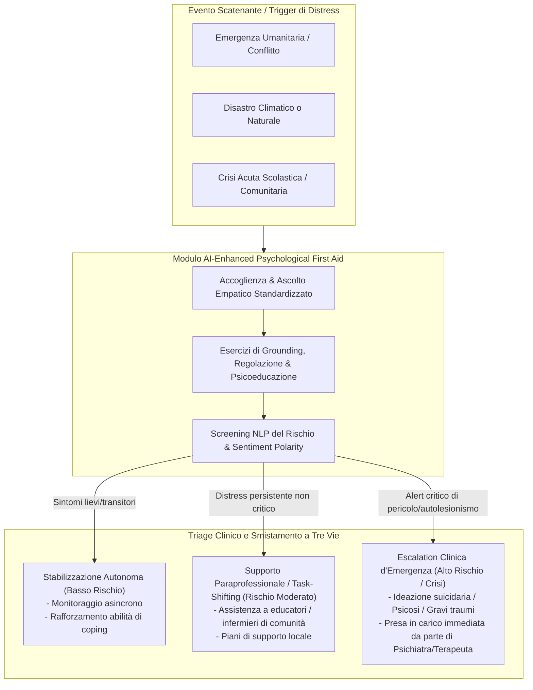

# Primo Soccorso Psicologico Potenziato da IA (AI-Enhanced Psychological First Aid - PFA)

## Definizione Operativa
- Sintesi: L'**AI-Enhanced Psychological First Aid (PFA)** è un framework applicativo e clinico analizzato da Espino Carrasco et al. (2025) che integra modelli di elaborazione del linguaggio naturale (NLP), agenti conversazionali adattivi e sistemi di screening intelligenti all'interno dei protocolli internazionalmente validati di Primo Soccorso Psicologico (OMS e IASC). Opera come "Ponte Operativo" a bassa intensità per fornire de-escalation emotiva, tecniche di grounding e triage intelligente nelle primissime ore successive a un trauma, fungendo da supporto e non da sostituto della relazione clinica formale e comunitaria.
- **Utilità CBT:** Costituisce il livello di ingresso (*entry point*) di un modello di cura a gradini (*stepped care*). Intercettando e mitigando il distress acuto prima che si cronicizzi (es. in PTSD, ansia o depressione maggiore), preserva le limitate risorse specialistiche per i casi clinici complessi, fornendo psicoeducazione essenziale e rinforzando le abilità di coping autonome.

## Evidenze dalla Letteratura
- **Risposta Rapida in Scenari di Trauma:** L'AI-Enhanced PFA garantisce latenza zero e scalabilità massiva, rivelandosi fondamentale in caso di emergenze umanitarie e disastri climatici, dove la tempestività del supporto nei primissimi giorni previene lo sviluppo di PTSD (Saltzman & Hansel, 2024; Bondar et al., 2025).
- **Task-Shifting e Democratizzazione (LMIC):** Supporta e fa da co-pilota per operatori non specialistici nei paesi a basso e medio reddito, fornendo toolkit digitali, suggerendo schemi di colloquio e aiutando a decodificare segnali di grave distress (Freitas et al., 2025; McInnis & Merajver, 2011).
- **Integrazione Culturale:** Deve superare la mera traduzione linguistica incorporando i significati culturali del trauma e collegando l'utente alle reti naturali di supporto sociale (Irfan et al., 2024; Shidhaye, 2024).
- **Sicurezza e Deontologia:** Il sistema richiede la dichiarazione inequivocabile della propria natura algoritmica, evita l'erogazione di terapie o diagnosi autonome, e utilizza protocolli di *hard fallback* per indirizzare immediatamente i casi a rischio grave (es. ideazione suicidaria) ai servizi d'emergenza (Espino Carrasco et al., 2025).
- **Vantaggi e Rischi vs PFA Tradizionale:** A differenza del PFA condotto da umani (OMS, 2011), l'IA non soffre di affaticamento da compassione (burnout) e abbatte i costi logistici per l'addestramento su larga scala, ma introduce sfide legate al superamento delle barriere di digital literacy, al rischio di disallineamenti stocastici e allucinazioni algoritmiche.

**Riferimenti Bibliografici:**
- Espino Carrasco, D. K., Palomino Alcántara, M. d. R., Arbulú Pérez Vargas, C. G., Santa Cruz Espino, B. M., Dávila Valdera, L. J., Vargas Cabrera, C., Espino Carrasco, M., Dávila Valdera, A., & Agurto Córdova, L. M. (2025). Sustainability of AI-Assisted Mental Health Intervention: A Review of the Literature from 2020–2025. *International Journal of Environmental Research and Public Health*, 22(9), 1382. https://doi.org/10.3390/ijerph22091382
- Bondar, K. M., Bilozir, O. S., Shestopalova, O. P., & Hamaniuk, V. A. (2025). Bridging minds and machines: AI’s role in enhancing mental health and productivity amidst Ukraine’s challenges. *CEUR Workshop Proceedings*, 3918, 43–59.
- Freitas, A., Costa, B., Martinho, D., Pais, F., Duarte, I., Martins, C., Marreiros, G., & Almeida, R. (2025). A multidisciplinary approach to prevent student anxiety: A Toolkit for educators. *Procedia Computer Science*, 256, 852–860.
- Irfan, N., Zafar, S., & Hussain, I. (2024). Synergistic Precision: Integrating Artificial Intelligence and Bioactive Natural Products for Advanced Prediction of Maternal Mental Health During Pregnancy. *Journal of Natural Remedies*, 24, 2559–2569.
- McInnis, M. G., & Merajver, S. D. (2011). Global mental health: Global strengths and strategies. Task-shifting in a shifting health economy. *Asian Journal of Psychiatry*, 4(3), 165–171.
- Saltzman, L. Y., & Hansel, T. C. (2024). Child and Adolescent Trauma Response Following Climate-Related Events: Leveraging Existing Knowledge With New Technologies. *Traumatology*. https://doi.org/10.1037/trm0000508
- World Health Organization, War Trauma Foundation, & World Vision International. (2011). *Psychological first aid: Guide for field workers*. World Health Organization.

## Relazioni
- Documento sorgente: [[ijerph-22-01382]]
- Concetti correlati: [[multidimensional-sustainability-mental-health-ai]], [[tiered-human-ai-healing-ecosystem]], [[stepped-care-ai-integration]], [[acute-crisis-action-plans-ai]], [[human-in-the-reasoning]], [[algorithmic-bias-and-digital-inequalities]], [[federated-learning-and-differential-privacy-mental-health]]
