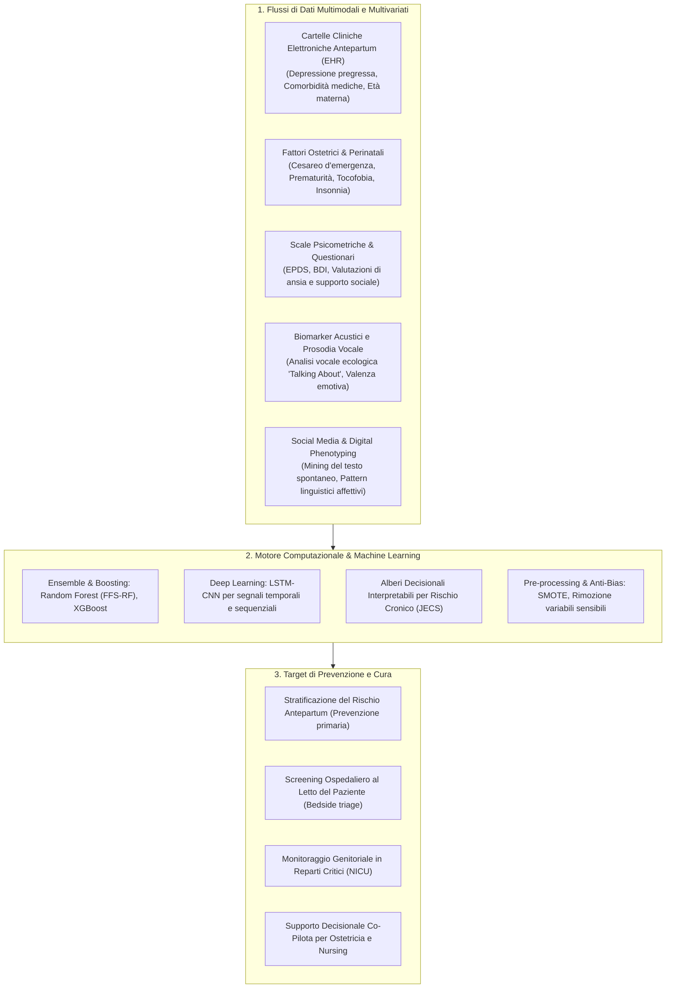
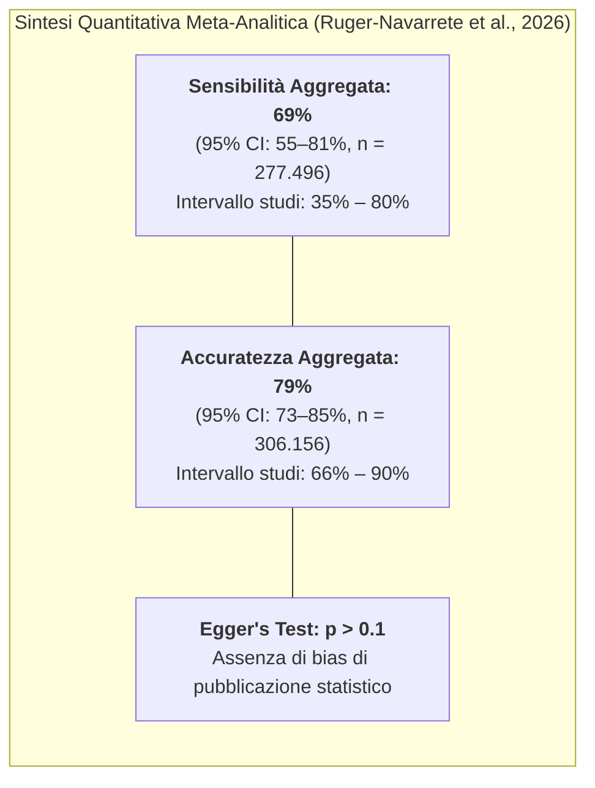

# Intelligenza Artificiale nella Predizione della Depressione Perinatale e Postpartum (AI in Perinatal and Postpartum Depression Prediction)

## Definizione Operativa
- L'**Intelligenza Artificiale nella Predizione della Depressione Perinatale** definisce l'applicazione di algoritmi di Machine Learning supervisionato, Deep Learning, Natural Language Processing (NLP) e analisi del segnale vocale per la stima precoce del rischio, lo screening automatizzato e la prevenzione della depressione perinatale e postpartum (PPD) (Ruger-Navarrete et al., 2026; *Frontiers in Psychiatry*, doi: 10.3389/fpsyt.2025.1734102).
- **Il Cambio di Paradigma: Dal Postpartum al Continuum Peripartum:** Superando la visione tradizionale che confina la depressione alla sola fase successiva al parto, l'evidenza clinico-computazionale riconosce che circa il **50% degli episodi depressivi postpartum esordisce durante la gravidanza (fase antepartum)**. I modelli di IA consentono di anticipare la finestra di screening dal terzo trimestre o fin dalle prime visite ostetriche, integrando dati anamnestici, cartelle cliniche elettroniche (EHR/EMR), risposte psicometriche (EPDS) e biomarker digitali/acustici per abilitare interventi preventivi tempestivi.

---

## Evidenze Empiriche e Prestazioni Computazionali

### 1. Sintesi Meta-Analitica delle Prestazioni Diagnostiche
La meta-analisi di Ruger-Navarrete et al. (2026), basata su 16 studi internazionali ($N > 300.000$ partecipanti), fornisce stime quantitative solide sull'efficacia predittiva dell'IA:
- **Sensibilità Meta-Analitica Aggregata (Pooled Sensitivity):** **69%** (95% CI: 55–81%; $n = 277.496$ individui su 7 stime a effetti casuali).
- **Accuratezza Meta-Analitica Aggregata (Pooled Accuracy):** **79%** (95% CI: 73–85%; $n = 306.156$ individui su 7 stime a effetti casuali).
- **Eterogeneità Metodologica:** Entrambe le stime presentano un'elevata eterogeneità statistica ($I^2 > 90\%$), riconducibile alla diversità dei predittori impiegati (dati amministrativi ospedalieri vs questionari standardizzati vs testo web), ai differenti cut-off diagnostici (es. EPDS $\ge 10$ vs $\ge 13$) e alla variabilità degli algoritmi.

---

### 2. Gerarchia Clinica dei Predittori di Rischio

I modelli di Machine Learning hanno permesso di stabilire una precisa gerarchia del peso predittivo delle variabili nella depressione perinatale:

1. **Storia Psichiatrica Pregressa (Predittore Cardinale):** La presenza di episodi depressivi o disturbi d'ansia antecedenti alla gravidanza costituisce il fattore di gran lunga più potente in tutti i modelli basati su EHR (Wakefield & Frasch, 2023; Andersson et al., 2021).
2. **Fattori Ostetrici e Complicanze del Parto:** Il ricorso a parto cesareo non programmato/in emergenza, il parto pretermine, la gravidanza indesiderata o non pianificata, l'elevata paura del parto (*tocofobia*) e i gravi disturbi del sonno durante i trimestri di gestazione emergono come forti predittori di vulnerabilità acuta (Fazraningtyas et al., 2025; Wakefield & Frasch, 2023).
3. **Variabili Psicosociali e Demografiche:** Età materna $\ge 35$ anni, assenza di supporto sociale percepito, condizioni di indigenza economica e status di migrante incrementano marcatamente la probabilità di PPD (Andersson et al., 2021; Gopalakrishnan et al., 2022).
4. **Tratti di Personalità vs Storia Clinica:** Le analisi comparative (Andersson et al., 2021) dimostrano che i tratti di personalità stabili (es. nevroticismo) possiedono un valore predittivo marcatamente inferiore rispetto alla storia anamnestica e ai fattori ostetrici contingenti.

---

### 3. Fonti di Dati Innovative e Digital Phenotyping

- **Analisi Acustica della Voce ('Talking About' Algorithm):** Fanos et al. (2023) hanno validato un sistema basato sull'estrazione di parametri vocali (frequenza fondamentale, timbro, formanti) dal parlato spontaneo delle neomamme, classificando le risposte affettive in positive o negative ed evitando i bias di conformismo o reticenza tipici dei questionari cartacei.
- **Social Media Mining e NLP (ASHN):** Gopalakrishnan et al. (2023) e Trifan et al. (2020) hanno addestrato architetture ibride (Attribute Selection Hybrid Network) per estrarre marker linguistici di anedonia, affaticamento e isolamento dai post delle utenti, dimostrando che il cambiamento nel lessico emotivo precede spesso la richiesta formale di aiuto clinico.
- **Screening Genitoriale in Terapia Intensiva Neonatale (NICU):** Sadjadpour et al. (2024) hanno esteso l'applicazione dell'IA ai genitori di neonati critici ricoverati in NICU, ottenendo performance diagnostiche (Accuratezza 66%, Sensibilità 73%) pari ai metodi di screening specialistici tradizionali, ma con tempi di risposta immediati.

---

## Matrice Comparativa delle Architetture Algoritmiche

| Famiglia Algoritmica | Studi Chiave | Punti di Forza Clinici | Limiti & Rischi Critici | Raccomandazione d'Uso |
| :--- | :--- | :--- | :--- | :--- |
| **Random Forest & Ensemble** (FFS-RF, Bagging) | Zhang et al. (2020), Fazraningtyas et al. (2025) | Elevata robustezza su dati eterogenei; riduzione dell'overfitting su piccoli campioni; ottima accuratezza. | Richiede bilanciamento dei campioni; complessità interpretativa intermedia. | **Scelta d'elezione** per modelli clinici predittivi su EHR. |
| **Gradient Boosting** (XGBoost) | Shin et al. (2020), Ruger-Navarrete et al. (2026) | Massima accuratezza predittiva su dati tabulari complessi; gestione integrata dei missing values. | Sensibile all'iper-parametrizzazione; rischio di bias se non regolarizzato. | **Fortemente Raccomandato** per screening ospedaliero ad alto volume. |
| **Deep Learning** (LSTM-CNN) | Srivatsav & Nanthini (2024) | Cattura dipendenze temporali e pattern sequenziali; estrazione automatica di feature dal parlato/testo. | Richiede ampie moli di dati; natura a "scatola nera" (black box); alto costo computazionale. | **Consigliato** per monitoraggio continuo via app o segnali vocali. |
| **Alberi Decisionali Interpretabili** | Matsumura et al. (2025) | Massima trasparenza e interpretabilità clinica immediata per ostetriche e medici; implementazione facile. | Minore capacità di catturare interazioni non lineari complesse rispetto a RF/XGBoost. | **Ottimale** per alberi decisionali rapidi e screening al letto del paziente. |
| **Explainable AI (XAI)** | Shivaprasad et al. (2024) | Spiegabilità locale e globale (SHAP/LIME); validazione clinica delle feature rilevanti. | Overhead computazionale aggiuntivo. | **Indispensabile** per il supporto decisionale medico-infermieristico. |

---

## Implicazioni per la Psicoterapia e la Clinica Perinatale

1. **Screening Anticipatorio e Prevenzione Primaria:** L'identificazione precoce nel primo/secondo trimestre di gravidanza abilita l'avvio tempestivo di protocolli psicoterapeutici evidence-based (CBT perinatale, Interpersonal Psychotherapy - IPT, training di regolazione emotiva e igiene del sonno), riducendo drasticamente l'incidenza di forme depressive severe e psicosi puerperali.
2. **Protezione dello Sviluppo Neonatale e del Legame di Attaccamento:** Prevenendo la cronicizzazione depressiva materna, gli interventi precoci tutelano la qualità dell'interazione madre-bambino, prevenendo ritardi nell'acquisizione del linguaggio, deficit cognitivi infantili e disturbi del neurosviluppo a lungo termine correlati allo stress materno cronico.
3. **Modello Centauro e Ruolo Chiave del Personale Infermieristico e Ostetrico:** L'IA non opera in autonomia: si configura come un co-pilota analitico al servizio di ostetriche, infermieri pediatrici e psichiatri. La tecnologia automatizza la rilevazione dei pattern di rischio, consentendo ai professionisti di concentrare il tempo clinico sull'accoglienza empatica e sulla relazione terapeutica.

---

## Riferimenti Bibliografici
- Ruger-Navarrete, A., Gómez-Ferrera, M., Mérida-Yáñez, B., Vázquez-Lara, J. M., Gómez-Salgado, J., García-Oliva, S., et al. (2026). Artificial intelligence in the prevention and early detection of postpartum depression: a systematic review and meta-analysis. *Frontiers in Psychiatry*, 16, 1734102. https://doi.org/10.3389/fpsyt.2025.1734102
- Andersson, S., Bathula, D. R., Iliadis, S. I., Walter, M., & Skalkidou, A. (2021). Predicting women with depressive symptoms postpartum with machine learning methods. *Scientific Reports*, 11, 7877. https://doi.org/10.1038/s41598-021-86368-y
- Fanos, V., Dessì, A., Deledda, L., Lai, A., Ranzi, P., Avellino, I., et al. (2023). Postpartum depression screening through artificial intelligence: preliminary data through the Talking About algorithm. *Journal of Pediatric and Neonatal Individualized Medicine*, 12(1), 1–11. https://doi.org/10.7363/120222
- Fazraningtyas, W. A., Rahmatullah, B., Naparin, H., Basit, M., & Razak, N. A. (2025). A predictive model for postpartum depression: ensemble learning strategies in machine learning. *Indonesian Journal of Electrical Engineering and Computer Science*, 37, 443–451. https://doi.org/10.11591/ijeecs.v37.i1.pp443-451
- Gopalakrishnan, A., Gururajan, R., Venkataraman, R., Zhou, X., Ching, K. C., Saravanan, A., et al. (2023). Attribute Selection Hybrid Network Model for risk factors analysis of postpartum depression using Social media. *Brain Informatics*, 10(1), 28. https://doi.org/10.1186/s40708-023-00206-7
- Matsumura, K., Hamazaki, K., Kasamatsu, H., Tsuchida, A., Inadera, H., & JECS Group. (2025). Decision tree learning for predicting chronic postpartum depression in the Japan Environment and Children’s Study. *Journal of Affective Disorders*, 369, 643–652. https://doi.org/10.1016/j.jad.2024.10.034
- Sadjadpour, F., Hosseinichimeh, N., Abedi, V., & Soghier, L. M. (2024). Comparative analysis of machine learning versus traditional method for early detection of parental depression symptoms in the NICU. *Frontiers in Public Health*, 12, 1380034. https://doi.org/10.3389/fpubh.2024.1380034
- Shin, D., Lee, K. J., Adeluwa, T., & Hur, J. (2020). Machine learning-based predictive modeling of postpartum depression. *Journal of Clinical Medicine*, 9(9), 2899. https://doi.org/10.3390/jcm9092899
- Shivaprasad, S., Chadaga, K., Sampathila, N., Prabhu, S., Chadaga, P. R., & K, S. (2024). Explainable machine learning methods to predict postpartum depression risk. *Systems Science & Control Engineering*, 12(1), 2427033. https://doi.org/10.1080/21642583.2024.2427033
- Srivatsav, P., & Nanthini, S. (2024). Detecting early markers of post-partum depression in new mothers: an efficient LSTM-CNN approach compared to logistic regression. In *Proceedings of the 5th ICITIIT* (pp. 1–6). IEEE. https://doi.org/10.1109/ICITIIT61487.2024.10580321
- Wakefield, C., & Frasch, M. (2023). Predicting patients requiring treatment for depression in the postpartum period from common electronic medical record data antepartum using machine learning. *Obstetrics & Gynecology*, 141(5), 63S. https://doi.org/10.1097/01.AOG.0000930572.02566.ab
- Zhang, W., Liu, H., Silenzio, V. M. B., Qiu, P., & Gong, W. (2020). Machine learning models for the prediction of postpartum depression: application and comparison based on a cohort study. *JMIR Medical Informatics*, 8(4), e15516. https://doi.org/10.2196/15516

---

## Relazioni
- Vedi anche: [[fpsyt-16-1734102]], [[algorithmic-bias-perinatal-ai]], [[multimodal-anxiety-detection-ai]], [[social-media-phenotyping-anxiety]], [[modello-centauro-clinico]], [[pediatric-ai-bias-and-vulnerabilities]], [[clinical-decision-making-and-artificial-intelligence]], [[embedded-ethics-interface]], [[ai-psychosocial-functioning-in-psychosis]]
