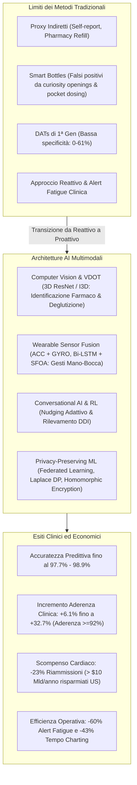
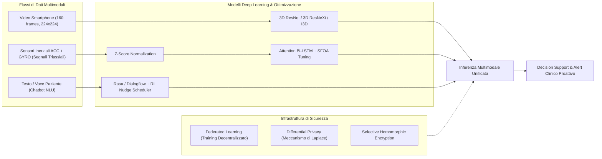

# AI-Powered Real-Time Adherence Monitoring for Remote Patient Care in Telemedicine

## Definizione Operativa
- Rassegna sistematica e studio metodologico condotto da Chidiebere Joshua e Whitney Peterson (2025) che analizza l'integrazione di architetture di Intelligenza Artificiale multimodale nel monitoraggio in tempo reale dell'aderenza farmacologica all'interno di piattaforme di telemedicina e *Remote Patient Monitoring* (RPM).
- **Utilità Clinica e Telemedica:** Supera radicalmente i limiti dei metodi indiretti e reattivi tradizionali (self-report, conteggio pillole, registri di refill e *smart pill bottles* affette da falsi positivi per "curiosity openings"), introducendo un paradigma di sorveglianza clinica proattiva basato su Computer Vision (3D ResNet, I3D, AiCure), sensori indossabili inerziali (Bi-LSTM ottimizzate con *Sheep Flock Optimization Algorithm* - SFOA), agenti conversazionali guidati da Reinforcement Learning e framework per la tutela della privacy (*Federated Learning*, *Differential Privacy*, *Homomorphic Encryption*).

## Evidenze dalla Letteratura

### 1. Inquadramento Epidemiologico e Limiti del Telemonitoraggio Tradizionale
- **Epidemiologia della Non-Aderenza:** Fino al 50% dei pazienti affetti da patologie croniche non assume le terapie secondo prescrizione (Joshua & Peterson, 2025). Nelle malattie croniche non trasmissibili (NCDs come ipertensione, diabete, insufficienza cardiaca), la non-aderenza è direttamente correlata a un aumento del 17% del rischio di ricovero ospedaliero per tutte le cause e a un marcato incremento della mortalità a lungo termine.
- **Impatto Economico:** Negli Stati Uniti, dove la spesa sanitaria assorbe circa il 18% del PIL, centinaia di miliardi di dollari vengono spesi ogni anno in accessi acuti e complicanze prevenibili derivanti dalla mancata aderenza.
- **Fallimento delle Metriche Indirette e dei DAT di Prima Generazione:**
  - *Self-report e Questionari (es. Morisky 8-Item Scale)*: Soggetti a bias di desiderabilità sociale e vuoti di memoria.
  - *Pharmacy Refill Data*: Documentano il mero acquisto/possesso del farmaco, non la reale ingestione.
  - *Dispositivi Elettronici (GlowCap, AdhereTech)*: Registrano l'apertura del flacone ma non discriminano aperture esplorative (*curiosity openings*) o dosaggi tascabili (*pocket dosing*), saturando i dati di falsi positivi.
  - *Digital Adherence Technologies (DATs)* non intelligenti: Nei trial su tubercolosi mostrano una sensibilità accettabile (70%–94%) ma una specificità inadeguata (0%–61%), risultando inaffidabili per decisioni cliniche critiche.

---

### 2. Architetture di Intelligenza Artificiale e Metodologie Computazionali

#### A. Computer Vision e Video-Observed Therapy (VDOT)
- **Pipeline di Elaborazione Video:** Estrazione standardizzata di circa 160 frame per video mediante `FFmpeg`, ridimensionati a risoluzione $224 \times 224$ pixel, previa eliminazione manuale/automatica di frame con scarsa illuminazione o viso non identificabile.
- **Modelli di Classificazione Binaria (Aderenza vs Non-Aderenza):**
  1. **3D ResNet:** Ottiene le migliori prestazioni complessive, catturando feature spaziali (riconoscimento compressa/bocca) e temporali (traiettoria e deglutizione) con **90.1% di precisione** e **95.8% di sensibilità**, garantendo la massima velocità di inferenza per il deployment clinico su larga scala.
  2. **3D ResNeXt:** Sfrutta *grouped convolutions* per ottimizzare il footprint computazionale.
  3. **Inflated 3D (I3D):** Progettata specificamente per l'action recognition umana in sequenze video complesse.
  4. **Inception-v4:** Impiegata come baseline statica bidimensionale.
- **Evidenze di Efficacia (Piattaforma AiCure):** L'utilizzo di algoritmi di computer vision su smartphone per confermare la deglutizione ha raggiunto il **100% di aderenza** in pazienti post-ictus in terapia anticoagulante (rispetto al 50% dei controlli non monitorati) e un incremento del **+17.9%** in pazienti affetti da schizofrenia con deficit cognitivo.

#### B. Wearable Sensor Fusion e Riconoscimento Gesti Motori
- **Sensori Utilizzati:** Accelerometri triassiali (ACC) e giroscopi triassiali (GYRO) integrati in smartwatch commerciali o cerotti medicali.
- **Normalizzazione Z-Score:** I segnali grezzi, fortemente rumorosi, vengono normalizzati ($\mu = 0, \sigma = 1$), rendendo la rete invariante rispetto all'ampiezza o alla rapidità del movimento generale dell'individuo.
- **Attention-based Bi-LSTM:** Rete ricorrente bidirezionale in grado di modellare le dipendenze temporali passate e future lungo l'intera sequenza cinematica mano-bocca (*hand-to-mouth*), discriminando con accuratezza l'assunzione del farmaco da gesti confondenti (mangiare, bere).
- **Sheep Flock Optimization Algorithm (SFOA):** Metaeuristica bio-ispirata utilizzata per la sintonizzazione ottimale degli iperparametri della Bi-LSTM, consentendo al modello di raggiungere il **98.90% di accuratezza** e il **97.8% di sensibilità** (Rahman et al., 2024).

#### C. Conversational AI e Nudging Adattivo con Reinforcement Learning
- **Agenti Conversazionali:** Framework come Rasa e Dialogflow gestiscono l'estrazione di entità e il riconoscimento degli intenti per l'interazione con il paziente.
- **Scheduling Dinamico con Reinforcement Learning (RL):** Supera i promemoria ad orari fissi (facilmente ignorati o causa di assuefazione), apprendendo dai pattern storici di risposta per erogare "nudge" comportamentali contestualizzati nel momento di massima probabilità di assunzione (livelli di aderenza $\ge 92\%$).
- **Sicurezza Farmacologica:** Modelli ibridi CNN per il rilevamento di interazioni farmaco-farmaco (*Drug-Drug Interactions* - DDI) con accuratezza tra il 79% e il 95%.

#### D. Privacy-Preserving Machine Learning (PPML)
- **Federated Learning (FL):** Addestramento dei modelli su dispositivi edge locali senza centralizzazione né trasmissione di dati video o biometrici grezzi.
- **Differential Privacy (DP):** Protezione dei gradienti aggregati contro attacchi di *membership inference* tramite il meccanismo di Laplace:
  $$L(x) = f(x) + \text{Lap}\left(\frac{\Delta f}{\epsilon}\right)$$
  dove $\Delta f$ rappresenta la sensibilità globale della funzione ed $\epsilon$ è il privacy budget.
- **Homomorphic Encryption (HE):** Crittografia omomorfa selettiva applicata a calcoli ad alto rischio per consentire elaborazioni direttamente sui dati cifrati.

---

### 3. Prestazioni dei Modelli e Benchmark

| Architettura / Algoritmo | Dominio Applicativo | Accuratezza / Precisione | Sensibilità / Specificità |
| :--- | :--- | :--- | :--- |
| **SFOA-Bi-LSTM** | Gesture Recognition (Smartwatch) | **98.90%** Accuratezza | **97.8%** Sensibilità |
| **3D ResNet** | Video Ingestion Monitoring (TB) | **90.1%** Precisione | **95.8%** Sensibilità (Spec: 43.5%–55.4%) |
| **Hybrid CNN-DDI** | Rilevamento Interazioni Farmaci | **95.0%** Accuratezza | N/A |
| **Movelet Algorithm** | Smartwatch (Coorte Oncologica) | **85.0%** Accuratezza | N/A |
| **Artificial Neural Networks** | Predizione Non-Aderenza Ipertensione | **79.0%** Accuratezza | N/A |
| **Framework RPM Globale** | Malattie Croniche e Telemedicina | Fino a **97.7%** Accuratezza Predittiva | Incremento aderenza **+6.1% / +32.7%** |

---

### 4. Impatto Clinico, Economico e Operativo
1. **Esiti Clinici e Aderenza:**
   - I trial controllati randomizzati evidenziano miglioramenti statisticamente significativi dei tassi di compliance, oscillanti tra il **+6.1% e il +32.7%**.
   - Significativo incremento dei tassi di refill nei pazienti anziani trattati con agenti conversazionali intelligenti.
2. **Sostenibilità Economica e De-ospedalizzazione:**
   - **Scompenso Cardiaco (Heart Failure):** Riduzione del **23% delle riammissioni ospedaliere**, generando oltre **10 miliardi di dollari di risparmi annuali** nel sistema sanitario statunitense.
   - **Diabete e Patologie Cardiovascolari:** Abbattimento del **30% delle spese complessive di ricovero**.
   - **Pronto Soccorso:** Riduzione del **25% degli accessi al PS**.
3. **Efficienza Clinica e Mitigazione dell'Alert Fatigue:**
   - **Filtro delle Anomalie Multivariate:** Riduzione del **60% dei falsi positivi di allerta**, prevenendo l'affaticamento da allarmi (*alert fatigue*) nei team di cura.
   - **Documentazione Virtuale Assistita:** Riduzione del tempo di charting medico da **11.2 a 6.4 minuti per visita (-43%)**, preservando l'accuratezza documentale nelle cartelle cliniche elettroniche (EHR).

---

### 5. Discussione, Sfide Etiche e Limitazioni

1. **Dalla Sorveglianza Reattiva al Rilevamento Multivariato Proattivo:**
   - Il telemonitoraggio tradizionale si limita ad avvisare a posteriori quando una dose è stata saltata. L'IA analizza pattern multivariati incrociando parametri biometrici, abitudini di movimento e contesti: ad esempio, una lieve fluttuazione dell'attività fisica associata alla mancata assunzione di un diuretico in un paziente scompensato consente di anticipare la crisi emodinamica prima che richieda il ricovero.
2. **Trasparenza, Black-Box ed Explainable AI (XAI):**
   - La complessità dei modelli deep learning ostacola la fiducia clinica; i medici necessitano di giustificazioni comprensibili (*XAI*) per convalidare le raccomandazioni terapeutiche e le notifiche di allerta.
3. **Determinanti Sociali della Salute (SDOH) e Divario Digitale:**
   - I pazienti sopra i 75 anni mostrano tassi inferiori di adozione rispetto alle fasce più giovani (*digital divide*).
   - Necessità di personalizzazione culturale e linguistica dei sistemi NLP (es. sperimentazioni di NLP in lingua araba/irachena per pazienti oncologiche) per garantire equità d'accesso ed evitare discriminazioni algoritmiche.
4. **Limitazioni Metodologiche della Letteratura:**
   - *Dataset Secondari e Sintetici*: Numerose verifiche ad alta accuratezza (specialmente per PPML e TB) derivano da dataset di laboratorio che non riproducono pienamente la rumorosità delle cartelle cliniche reali.
   - *Campioni Ridotti e Breve Follow-Up*: Molti RCT (inclusi quelli di AiCure) hanno arruolato campioni contenuti ($n < 60$) con osservazione limitata a 12–24 settimane, lasciando aperta la questione del mantenimento dell'aderenza su scale pluriennali.
   - *Latenza Computazionale*: L'overhead introdotto da Homomorphic Encryption e Federated Learning può generare ritardi di elaborazione incompatibili con il monitoraggio ad altissima frequenza.

**Riferimenti Bibliografici:**
- Joshua, C., & Peterson, W. (2025). AI-Powered Real-Time Adherence Monitoring for Remote Patient Care in Telemedicine. *Research Article*, June 2025.
- Labovitz, D. L., et al. (2020). Using Artificial Intelligence to Measure Adherence to Anticoagulants in Stroke Patients. *Stroke and Cerebrovascular Diseases*, 29(10), 105048.
- Sekandi, J. N., et al. (2023). Application of AI to the Monitoring of Medication Adherence for TB Treatment in Africa. *JMIR AI*, 2(1), e40167.
- Steinhubl, S. R., et al. (2022). Economic Impact of AI-Driven Heart Failure Monitoring. *Health Affairs*, 41(5), 259-273.
- Zisanur Rahman, Md., et al. (2024). A Smart Wearable Sensor-Based Model for Medication Adherence Using SFOA-Bi-LSTM. *Digital Health*, 10, 1-15.

## Relazioni
- Vedi anche: [[video-observed-therapy-ai]], [[wearable-sensor-fusion-adherence]], [[proactive-surveillance-alert-fatigue]], [[privacy-preserving-rpm-frameworks]], [[context-aware-adaptive-nudging]], [[chronic-disease-monitoring-adherence]], [[software-as-a-medical-device-salute-mentale]], [[ai-clinical-decision-support]], [[etica-privacy-bias-ia-clinica]]