# Intelligenza Artificiale nel Funzionamento Psicosociale della Psicosi (AI in Psychosocial Functioning in Psychosis)

## Definizione Operativa
- L'**Intelligenza Artificiale applicata al Funzionamento Psicosociale nella Psicosi** definisce l'impiego integrato di algoritmi di Machine Learning (supervisionato, causale ed ensemble), modelli di elaborazione del segnale vocale e sensoristica passiva (*digital phenotyping*) per la stima oggettiva, la predizione precoce e il monitoraggio continuo delle capacità funzionali, relazionali e occupazionali negli individui con disturbi dello spettro psicotico (Mok et al., 2025).
- **Utilità CBT:** Supera il riduzionismo diagnostico binario consentendo una quantificazione dinamica della *recovery* funzionale (*social and occupational functioning*, *Theory of Mind*, qualità della vita percepita). Permette di stratificare precocemente il rischio di declino psicosociale, personalizzare i moduli di *Social Cognition Training* (SCT), allocare in modo mirato interventi riabilitativi (es. *Supported Employment* / IPS) e fungere da co-pilota analitico centauro per il terapeuta senza sostituire la relazione clinica incarnata.

## Evidenze dalla Letteratura
- **Accuratezza Predittiva Differenziale per Dominio:** La meta-analisi su modelli di machine learning indica che la predizione della cognizione sociale (riconoscimento affetti ER40/BLERT, ToM) raggiunge un'accuratezza discriminativa superiore (AUC = 0.77, 95% CI: 0.69–0.85) rispetto alla predizione di esiti psicosociali complessi a lungo termine come mantenimento lavorativo o punteggio GAF (AUC = 0.68, 95% CI: 0.60–0.77; p = 0.003) (Mok et al., 2025).
- **Gerarchia Predittiva dei Dati di Input:** I sintomi clinici e affettivi risultano i predittori prossimali più accurati del funzionamento funzionale (RMSE = 7.10, 95% CI: 5.78–8.43), seguiti da batterie neurocognitive (RMSE = 8.17, 95% CI: 7.36–8.99), mentre i biomarker genetici e poligenici mostrano il massimo errore predittivo (RMSE = 9.19, 95% CI: 7.96–10.41) (Mok et al., 2025).
- **Architetture Algoritmiche Ottimali ed Ensemble:** Modelli basati su Random Forest e Bagging Ensemble associati a selezione rigorosa delle feature (M5 Prime, LASSO, RFE) superano significativamente i singoli alberi decisionali o regressioni lineari, gestendo l'eterogeneità clinica e raggiungendo un'accuratezza fino al 79.5% e AUC fino a 0.867 (Li et al., 2022; Lin et al., 2021a).
- **Digital Phenotyping e Monitoraggio Continuo:** Il mobile sensing passivo (CrossCheck: mobilità GPS, accelerometria, log comunicativi) stima la *Social Functioning Scale* (SFS) con un MAE di 2.17–2.79 (~10% di margine d'errore) (Wang et al., 2020), mentre l'analisi acustica del parlato (F0, micro-variazioni formanti F1-F3) rileva tempestivamente fluttuazioni nella qualità della vita soggettiva (J-SQLS) eliminando il recall bias (Shibata et al., 2023).
- **Causal Discovery e Policy Offline:** L'inferenza causale (GFCI, Reti Bayesiane) identifica percorsi causali diretti verso il funzionamento occupazionale e gerarchie ToM (Miley et al., 2023; Bosco et al., 2024), mentre il Reinforcement Learning Offline (Batch Constrained Q-Learning) supporta raccomandazioni cliniche in-session con accuratezza del 64% (Lin et al., 2023).
- **Limiti, Rischi e Controindicazioni:** I modelli supervisionati risentono della scarsa generalizzabilità e campioni ridotti; il digital phenotyping pone sfide etiche di privacy e perde accuratezza nelle fasi di acuzie severa; i chatbot conversazionali autonomi basati su LLM sono strettamente controindicati nella psicosi attiva per il rischio di *AI Psychosis*, sicofanzia e rinforzo di convinzioni deliranti (Mok et al., 2025).

```mermaid
flowchart TD
    subgraph InputStreams ["1. Flussi di Dati Multidimensionali"]
        I1["Dati Clinici & Psicometrici<br/>(PANSS, BDI, TEPS, DUP)"]
        I2["Cognizione Sociale & Neurocognizione<br/>(ToM T.h.o.m.a.s, ER40, BLERT, MSCEIT)"]
        I3["Digital Phenotyping Passivo<br/>(Mobile sensing CrossCheck, Geolocation, Sleep)"]
        I4["Biomarker Vocali & Acustici<br/>(Pitch, Jitter, Formanti F1-F3, Shimmer)"]
    end

    subgraph ComputationalEngine ["2. Motore di Inferenza & Modellazione"]
        M1["Ensemble Learning & Feature Selection<br/>(Random Forest + LASSO, Bagging + M5 Prime)"]
        M2["Causal Discovery & Reti Probabilistiche<br/>(Greedy Fast Causal Inference, Bayesian Networks)"]
        M3["Reinforcement Learning Offline per Raccomandazioni<br/>(Batch Constrained Q-Learning - BCQ)"]
    end

    subgraph FunctionalOutcomes ["3. Target Psicosociali & Predizione"]
        O1["Autonomia Sociale & Lavorativa<br/>(GAF, PSP, SLOF, Tasso di impiego)"]
        O2["Decodifica Emozionale & Cognizione Sociale<br/>(Riconoscimento affetti, ToM di 1°/2°/3° ordine)"]
        O3["Qualità della Vita Soggettiva (QoL)<br/>(QLS, J-SQLS, Benessere percepito)"]
    end

    subgraph ClinicalAction ["4. Decisione Clinica & Intervento CBT"]
        A1["Stratificazione Precoce del Rischio di Disabilità"]
        A2["Scaffolding Riabilitativo Social Cognition Training (SCT)"]
        A3["Co-pilota Centauro: Raccomandazioni in Seduta"]
    end

    InputStreams --> ComputationalEngine
    ComputationalEngine --> FunctionalOutcomes
    FunctionalOutcomes --> ClinicalAction
```

| Paradigma di IA | Ruolo Clinico | Vantaggi Principali | Rischi & Limiti Critici | Indicazione Clinica |
| :--- | :--- | :--- | :--- | :--- |
| **Supervised ML & Ensemble** (RF, SVM, Bagging) | Stratificazione del rischio funzionale e predizione del recovery | Elevata accuratezza (AUC 0.70–0.87), gestione di dati non lineari | Modelli statici, necessità di baseline strutturate | **Fortemente Raccomandato** per screening e pianificazione |
| **Causal Discovery & Bayesian Networks** | Identificazione di target terapeutici primari e gerarchie ToM | Spiegabilità causale, validazione di relazioni dirette vs spurie | Richiede campioni ampi e assunzioni di indipendenza | **Fondamentale** per la strutturazione dei protocolli CBT/SCT |
| **Digital Phenotyping** (Mobile & Audio Sensing) | Monitoraggio ecologico e continuativo tra le sedute | Rilevazione passiva in tempo reale, zero recall bias | Sfide di privacy, scarso transfer su pazienti con acuzie severa | **Consigliato** in fase di remissione o stabilizzazione |
| **Chatbot Conversazionali Autonomi (LLM)** | Psicoterapia o supporto conversazionale non supervisionato | Accessibilità 24/7, basso costo di erogazione | Rischio elevato di AI Psychosis, sicofanzia, rinforzo di deliri, stigma | **CONTROINDICATO** nella psicosi attiva senza clinico umano |
| **Co-pilota Centauro / Real-Time Recommendation** | Suggerimento argomenti e tecniche al terapeuta durante la seduta | Preserva l'alleanza terapeutica, potenzia la decisione umana | Accuratezza attuale moderata (64%), necessità di calibrazione | **Promettente** come supporto decisionale per il terapeuta |

**Riferimenti Bibliografici:**
- Mok, C. H. Y., Cheng, C. P. W., & Chu, M. H. W. (2025). Application of artificial intelligence and psychosocial functioning in psychosis: a systematic review and meta-analysis. *Frontiers in Psychiatry*, 16, 1692177. https://doi.org/10.3389/fpsyt.2025.1692177
- Bosco, F. M., Colle, L., Salvini, R., & Gabbatore, I. (2024). A machine-learning approach to investigating the complexity of theory of mind in individuals with schizophrenia. *Heliyon*, 10(6), e30693. https://doi.org/10.1016/j.heliyon.2024.e30693
- Li, C., Wang, W., Guo, Q., Jiang, L., Qiao, K., Hu, Y., et al. (2022). Deep learning system for brain image-aided diagnosis of multiple major mental disorders. *bioRxiv*, 2022-06. https://doi.org/10.1101/2022.06.01.22275855
- Lin, B., Cecchi, G., & Bouneffouf, D. (2023). Psychotherapy AI companion with reinforcement learning recommendations and interpretable policy dynamics. In *Companion Proceedings of the ACM Web Conference 2023 (WWW '23)* (pp. 932–939). ACM. https://doi.org/10.1145/3543873.3587623
- Lin, E., Lin, C. H., & Lane, H. Y. (2021a). Applying a bagging ensemble machine learning approach to predict the functional outcome of schizophrenia with clinical symptoms and cognitive functions. *Scientific Reports*, 11, 6922. https://doi.org/10.1038/s41598-021-86382-0
- Miley, K., Meyer-Kalos, P., Ma, S., Bond, D. J., Kummerfeld, E., & Vinogradov, S. (2023). Causal pathways to social and occupational functioning in the first episode of schizophrenia: uncovering unmet treatment needs. *Psychological Medicine*, 53(5), 2041–2049. https://doi.org/10.1017/S0033291721003780
- Shibata, Y., Victorino, J. F., Natsuyama, T., Okamoto, N., Yoshimura, R., & Shibata, T. (2023). Estimation of subjective quality of life in schizophrenic patients using speech features. *Frontiers in Rehabilitation Sciences*, 4, 1121034. https://doi.org/10.3389/fresc.2023.1121034
- Wang, W., Mirjafari, S., Harari, G., Ben-Zeev, D., Brian, R., Choudhury, T., et al. (2020). Social sensing: Assessing social functioning of patients living with schizophrenia using mobile phone sensing. In *Proceedings of the 2020 CHI Conference on Human Factors in Computing Systems* (pp. 1–15). ACM. https://doi.org/10.1145/3313831.3376855

## Relazioni
- Vedi anche: [[fpsyt-16-1692177]], [[causal-discovery-psychosocial-targets]], [[modello-centauro-clinico]], [[ai-psychosis]], [[applied-theory-of-mind-llm]], [[synthetic-psychopathology]], [[multimodal-anxiety-detection-ai]], [[social-media-phenotyping-anxiety]], [[clinical-ai-simulation]], [[supervisione-clinica-ai]]
