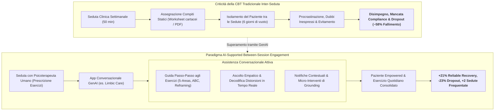
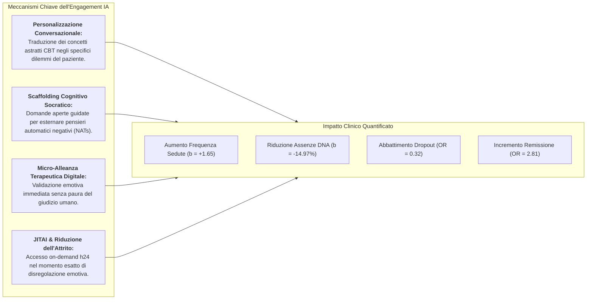
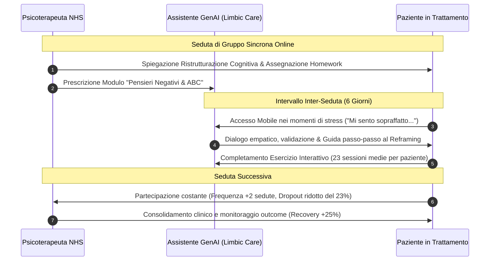

# AI-Supported Between-Session Engagement in CBT (Coinvolgimento Inter-Sessione Supportato da IA nella CBT)

## Definizione Operativa
- Il paradigma di **AI-Supported Between-Session Engagement** (coinvolgimento inter-seduta supportato da intelligenza artificiale) definisce l'integrazione di agenti conversazionali generativi basati su Large Language Models ([[large-language-models|LLM]]) per guidare, personalizzare e sostenere l'esecuzione dei compiti a casa (*homework assignments*) e degli esercizi cognitivo-comportamentali tra le sedute di psicoterapia condotte da terapeuti umani (Habicht et al., 2025; *Journal of Medical Internet Research*, doi: [10.2196/60435](https://doi.org/10.2196/60435)).
- **Inquadramento Clinico e CBT:** L'esecuzione continuativa degli esercizi terapeutici tra una seduta e l'altra costituisce il fondamento empirico dell'efficacia della Terapia Cognitivo-Comportamentale (CBT), consentendo il consolidamento mnesico, la ristrutturazione cognitiva in vivo e la generalizzazione delle strategie di coping negli ambienti ecologici di vita (Beck, 1979; Kazantzis et al., 2004, 2016). Tuttavia, il mancato svolgimento dei compiti (*homework non-compliance*) e il conseguente disingaggio rappresentano la causa primaria dell'insuccesso terapeutico, che interessa fino al **58% dei pazienti** (Cuijpers et al., 2023), con tassi di abbandono (*dropout*) particolarmente critici nei formati di terapia di gruppo.
- **Risoluzione del Gap:** Il supporto generativo trasforma le tradizionali schede cartacee e i PDF statici — intrinsecamente passivi e privi di retroazione — in un'interazione dialogica dinamica, empatica e adattiva, incrementando la compliance senza erodere il tempo clinico del terapeuta né violare i confini del setting professionale.

---

## Meccanismi di Azione Psicologica e Computazionale

### 1. Scaffolding Cognitivo e Decostruzione dei Pensieri Automatici
L'interazione con un LLM opportunamente vincolato consente al paziente di esteriorizzare il monologo interiore disfunzionale. Attraverso il dialogo socratico generativo, l'IA guida l'utente a identificare le distorsioni cognitive (es. catastrofismo, pensiero dicotomico, personalizzazione) e a compilare schemi complessi come il **modello delle 5 aree** (situazione, pensieri, emozioni, reazioni corporee, comportamenti) o i diari ABC, riducendo il carico cognitivo associato alla compilazione autonoma su supporto cartaceo.

### 2. Micro-Alleanza Digitale e Spazio Non Giudicante
Nelle evidenze qualitative (Habicht et al., 2025), l'**81.4% degli utenti** riporta benefici specifici per la propria salute mentale. Tra questi:
- Il **26.5%** segnala un miglioramento drastico nella chiarezza concettuale e nell'autoconsapevolezza emotiva derivante dall'atto di verbalizzare per iscritto i propri vissuti;
- Il **20.4%** evidenzia l'efficacia nell'apprendimento e nell'interiorizzazione delle strategie di coping;
- L'**8.0%** valorizza la possibilità di sfogarsi in uno spazio confidenziale e protetto (*"parlare apertamente con un'IA che non giudica i tuoi sentimenti"*), abbattendo le resistenze legate alla vergogna o alla desiderabilità sociale.

### 3. Effetto Paracolpi (*Buffer Effect*) nella Terapia di Gruppo
Nei contesti di CBT di gruppo — tradizionalmente penalizzati da tassi di abbandono superiori del 15–20% rispetto alla psicoterapia individuale — l'assistente IA agisce come un equalizzatore clinico: compensa la fisiologica riduzione dell'attenzione individualizzata da parte del conduttore umano, garantendo a ciascun partecipante un tutor dedicato per applicare i contenuti discussi in plenaria.

---

## Evidenze Empiriche Real-World (Habicht et al., 2025)

Nello studio condotto su 244 pazienti nei servizi **NHS Talking Therapies** del Regno Unito, l'adozione dell'assistente generativo Limbic Care tra le sedute ha prodotto miglioramenti parametrici di rilievo:

### Sintesi dei Parametri Clinici Comparativi:
- **Aderenza alle Sedute:** Incremento medio di circa **2 sedute completate** ($b=1.65$, $P<.001$).
- **Sedute Did Not Attend (DNA):** Riduzione di **15 punti percentuali** nelle sedute disertate o cancellate all'ultimo minuto ($b=-14.97$, $P<.001$).
- **Tasso di Dropout Totale:** Riduzione di **23 punti percentuali** nel rischio di abbandono definitivo ($\text{OR}=0.32$, 95% CI [$0.171, 0.595$], $P<.001$).
- **Miglioramento Clinico Affidabile (*Reliable Improvement*):** Incremento di **21 punti percentuali** ($\text{OR}=2.21$, 95% CI [$1.279, 3.834$], $P=.005$).
- **Remissione Clinica (*Recovery Rate*):** Incremento di **25 punti percentuali** nel passaggio da caseness a non-caseness ($\text{OR}=2.81$, 95% CI [$1.561, 5.069$], $P=.001$).
- **Guarigione Affidabile (*Reliable Recovery*):** Incremento di **21 punti percentuali** ($\text{OR}=2.37$, 95% CI [$1.311, 4.290$], $P=.004$).
- **Gradiente Dose-Risposta:** L'aderenza è risultata dose-dipendente: il numero di esercizi completati correla con le sedute frequentate ($r=0.46$, $P<.001$), la riduzione delle DNA ($r=-0.35$, $P<.001$) e l'aumento della guarigione affidabile ($r_{pb}=0.17$, $P=.04$).

---

## Governance Clinica, Sicurezza e Farmacoeconomia

1. **Integrazione Human-in-the-Loop ([[modello-centauro-clinico]]):** L'agente generativo non opera come sostituto autonomo del terapeuta né effettua diagnosi algoritmiche non supervisionate; si limita a veicolare i protocolli approvati dal clinico curante all'interno di un sistema a rischio controllato.
2. **Conformità Dispositivi Medici e ISO 13485:** L'implementazione clinica di LLM richiede architetture a strati protetti (*guardrails* per harm-prevention, rilevamento di ideazione suicidaria e allarmi di emergenza) rispondenti a sistemi di gestione qualità certificati (Gilbert et al., 2023; Rollwage et al., 2024).
3. **Sostenibilità nei Sistemi Sanitari Pubblici:** A fronte di un costo medio di **£1.087 per reliable recovery** nei servizi di salute mentale NHS, l'incremento di efficacia del 21% genera un valore netto stimato di **£228 per paziente**, liberando ore cliniche e riducendo le liste d'attesa.

---

## Riferimenti Bibliografici
- Habicht, J., Dina, L.-M., McFadyen, J., Stylianou, M., Harper, R., Hauser, T. U., & Rollwage, M. (2025). Generative AI–Enabled Therapy Support Tool for Improved Clinical Outcomes and Patient Engagement in Group Therapy: Real-World Observational Study. *Journal of Medical Internet Research*, 27, e60435. https://doi.org/10.2196/60435
- Beck, A. T. (1979). *Cognitive therapy of depression*. Guilford Press.
- Cuijpers, P., Miguel, C., Harrer, M., Plessen, C. Y., Ciharova, M., Ebert, D., et al. (2023). Cognitive behavior therapy vs. control conditions, other psychotherapies, pharmacotherapies and combined treatment for depression: a comprehensive meta-analysis including 409 trials with 52,702 patients. *World Psychiatry*, 22(1), 105–115.
- Kazantzis, N., Whittington, C., Zelencich, L., Kyrios, M., Norton, P. J., & Hofmann, S. G. (2016). Quantity and quality of homework compliance: a meta-analysis of relations with outcome in cognitive behavior therapy. *Behavior Therapy*, 47(5), 755–772.
- McFadyen, J., Habicht, J., Dina, L. M., Harper, R., Hauser, T. U., & Rollwage, M. (2024). AI-enabled conversational agent increases engagement with cognitive-behavioral therapy: a randomized controlled trial. *medRxiv*, 10.1101/2024.11.01.24316565.
- Rollwage, M., Juchems, K., Pisupati, S., Prichard, G., Balogh, A., McFadyen, J., et al. (2024). The Limbic Layer: transforming large language models (LLMs) into clinical mental health experts. *PsyArXiv*, 10.31234/osf.io/9d7tp.

---

## Relazioni
- [[jmir-2025-1-e60435]]
- [[interactive-vs-psychoeducational-ai-engagement]]
- [[ai-enhanced-cbt]]
- [[digital-therapeutic-alliance]]
- [[modello-centauro-clinico]]
- [[concetti/between-session-continuity-ai]]
- [[clinical-readiness-gap-in-mh-chatbots]]
- [[software-as-a-medical-device-salute-mentale]]
- [[layered-safeguards-in-clinical-ai]]
- [[care-continuum-ai-functions-mental-health]]
- [[early-vs-late-dropout-cbt]]
