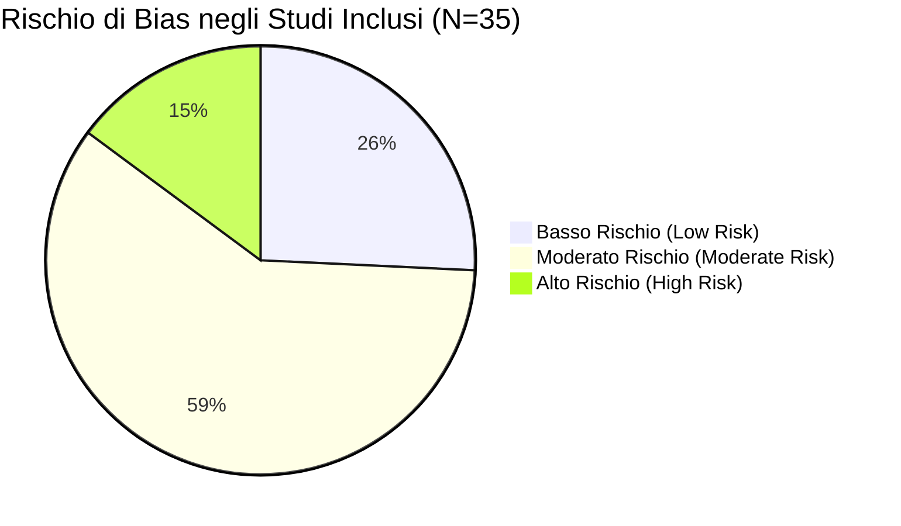
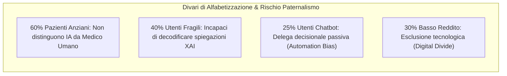
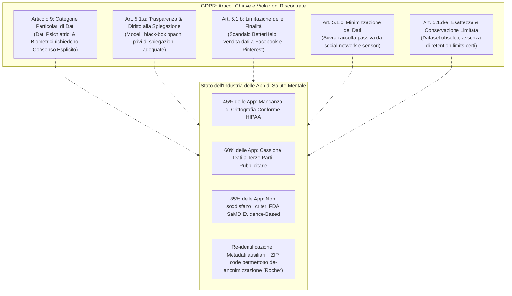
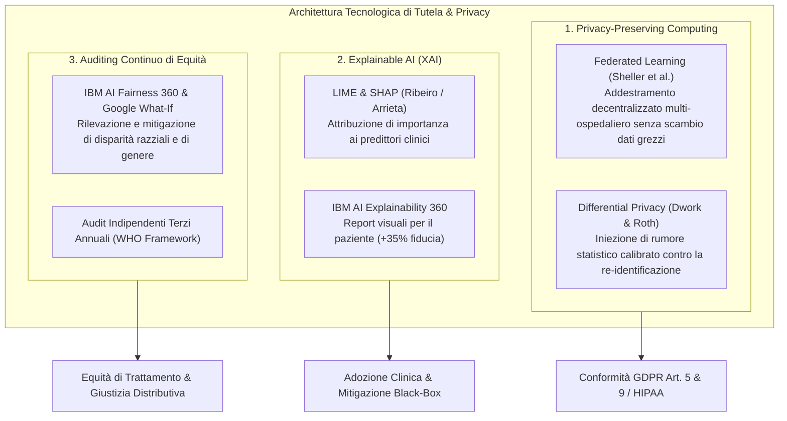

# AI Applications Integrating Legal and Regulatory Perspectives in Mental Health: Systematic Review (Kandeel et al., 2026)

## Definizione Operativa
- **Revisione sistematica** condotta secondo le linee guida **PRISMA 2020** e pubblicata su *JMIR AI* da Moustafa Elmetwaly Kandeel, Eid G Abo Hamza, Alaa Abouahmed, Gehad Mohamed AbdelAziz, Adham Hashish, Tarek Abo El Wafa, Ahmed Khalil e Ahmed Eldakak (College of Law, Al Ain University; University of Sharjah; Tanta University; UAE University; Institute of Public Administration, Riyadh, 2026; DOI: [10.2196/84305](https://doi.org/10.2196/84305)).
- **Oggetto e Ambito:** Analizza in modo esaustivo 35 studi empirici peer-reviewed (pubblicati tra gennaio 2013 e dicembre 2024 su PubMed, IEEE Xplore, PsycINFO, Scopus e Cochrane Library; accordo inter-rater con indice di Cohen $\kappa = 0.84$) sull'impiego dell'Intelligenza Artificiale per la diagnosi, il trattamento e l'empowerment del paziente nei disturbi mentali (Depressione Maggiore, Rischio Suicidario, Ansia, Schizofrenia, Bipolarismo).
- **Integrazione Giuridico-Regolatoria:** Rappresenta una delle prime sintesi sistematiche a intersecare formalmente le metriche di accuratezza clinico-tecnologica con i quadri normativi internazionali: il **GDPR europeo (Regolamento UE 2016/679, Artt. 5 e 9)**, la normativa statunitense **HIPAA**, l'**EU AI Act (2024)** che classifica l'IA per la salute mentale come sistema *High-Risk*, le linee guida **FDA SaMD** (*Software as a Medical Device*) e i principi etici dell'**OMS (WHO)**.
- **Utilità Clinica e Psichiatria Computazionale:** Esamina il passaggio dall'approccio diagnostico soggettivo e dai lunghi cicli di *trial-and-error* farmacoterapeutico a strumenti oggettivi, predittivi e accessibili h24 (modelli [[natural-language-processing|NLP]] su social media ed EHR con accuratezza fino all'89-92%, sensori wearable come Empatica E4 con $F_1 = 0.81$, neuroimaging fMRI con accuratezza dell'88%, sistemi multimodali con $\text{AUC} = 0.91$, chatbot CBT come Woebot e Wysa con riduzioni sintomatiche del 22-30%).
- **Criticità e Soluzioni:** Denuncia gravi lacune di conformità regolatoria (solo il 17% degli studi tratta il GDPR, il 45% delle app commerciali non usa crittografia a norma HIPAA, il 60% condivide dati sanitari con inserzionisti terzi come nel caso BetterHelp, rischi di de-anonimizzazione tramite metadati ausiliari secondo Rocher et al.), fenomeni di **[[algorithmic-paternalism-in-ai-mental-health|paternalismo algoritmico]]** (25% di delega decisionale passiva all'IA), divari di alfabetizzazione sanitaria (il 60% degli anziani non distingue consigli IA da consigli umani; il 40% a bassa literacy non comprende spiegazioni XAI) e bias demografico-culturali (calo di performance fino al 15% su lingue non inglesi; sottostima del rischio nel 35% dei pazienti neri). Propone salvaguardie architetturali: **Federated Learning**, **Differential Privacy**, **Explainable AI** (LIME, SHAP, IBM AI Explainability 360), **Audit sistematici di bias** (IBM AI Fairness 360) e workflow cooperativi **Human-in-the-Loop / Modello Centauro**.

```mermaid
flowchart TD
    subgraph GlobalCrisis ["Crisi Globale della Salute Mentale"]
        C1["970M di persone con disturbi psichici (WHO)"]
        C2["1T $ / anno di perdite economiche"]
        C3["Barriere: Stigma (60%), Mancanza Specialisti (50%), Gap Geografici"]
    end

    subgraph AIApplications ["Modalità di IA Applicata (35 Studi Empirici)"]
        A1["NLP su Social Media & EHR (40%): Depressione (Acc 89%), Suicidio (AUC 0.92)"]
        A2["Wearable & Sensori Biometrici (26%): Empatica E4 / HRV per Ansia (F1 0.81)"]
        A3["Chatbot CBT & Agenti Conversazionali (20%): Woebot, Wysa (-22% PHQ-9, -30% GAD-7)"]
        A4["Modelli Multimodali Ibridi (14%): Text + Actigraphy + EHRs (AUC 0.91)"]
        A5["Neuroimaging Deep Learning: CNN su fMRI / Schizofrenia (Acc 88%)"]
    end

    subgraph CriticalRisks ["Vulnerabilità Cliniche, Etiche e Giuridiche"]
        R1["Privacy: Re-identificazione dati (Rocher), Purpose Creep (Caso BetterHelp)"]
        R2["Bassa Conformità: 45% app non crittografate HIPAA, 60% tracciamento terzi"]
        R3["Bias Razziale & Culturale: Drop 15% su lingue non-EN, AAVE travisato"]
        R4["Paternalismo Algoritmico: 25% delega passiva scelte, 60% anziani confusi"]
        R5["Black-Box & Diffidenza: 45% clinici scettici, assenza di empatia autentica"]
    end

    subgraph RegulatoryGovernance ["Integrazione Normativa & Safeguards Tecniche"]
        G1["GDPR Art. 5 (Minimizzazione, Finalità) & Art. 9 (Consenso Esplicito Dati Particolari)"]
        G2["EU AI Act 2024: Classificazione 'High-Risk' & Audit Obbligatori"]
        G3["Privacy-Preserving AI: Federated Learning & Differential Privacy"]
        G4["Trasparenza & Fiducia: XAI (LIME, SHAP, IBM AI Explainability 360)"]
        G5["Equità & Sicurezza: Bias Auditing (IBM Fairness 360) & Human-in-the-Loop"]
    end

    GlobalCrisis --> AIApplications
    AIApplications --> CriticalRisks
    CriticalRisks --> RegulatoryGovernance
```

---

## Evidenze dalla Letteratura

### 1. Inquadramento Clinico-Epidemiologico e Barriere di Accesso
- **Impatto Epidemiologico Globale:** Secondo i report dell'OMS (WHO, 2022), oltre **970 milioni di individui** soffrono di disturbi dell'umore, ansia o disturbi da uso di sostanze. Depressione e ansia generano annualmente oltre **1 trilione di dollari USA** in perdite di produttività globale (Patel et al., 2018).
- **Il Divario di Trattamento (*Treatment Gap*):**
  - Oltre il **50% della popolazione mondiale** non ha alcun accesso a professionisti della salute mentale specializzati. In regioni a basso reddito come l'Africa subsahariana, il rapporto scende fino a **1 psichiatra ogni 2 milioni di abitanti** (Naslund et al., 2017).
  - Lo **stigma sociale** associato alla malattia mentale impedisce a circa il **60% delle persone** bisognose di rivolgersi a un terapeuta di persona (Kandeel et al., 2026).
  - La psichiatria e la psicoterapia tradizionali dipendono fortemente da colloqui clinici a cadenza settimanale/quindicinale, resoconti retrospettivi soggettivi del paziente e un prolungato processo di *trial-and-error* farmacologico.
- **Ruolo Trasformativo dell'IA:** Offre canali di screening scalabili, a costi marginali nulli, continui e operativi 24 ore su 24 e 7 giorni su 7 tramite smartphone e wearable, democratizzando l'accesso al supporto psicologico primario.

---

### 2. Metodologia di Revisione Sistematica (PRISMA 2020) e Rischio di Bias
- **Banche Dati e Selezione:** Revisione sistematica secondo le linee guida **PRISMA 2020** (Page et al., 2021) su 5 database: *PubMed* (ambito biomedico), *IEEE Xplore* (ingegneria e IA), *PsycINFO* (letteratura psicologica), *Scopus* (focus multidisciplinare) e *Cochrane Library* (trial evidence-based), per il periodo **2013–2024**.
- **Flusso dei Record:** 2.534 record estratti $\rightarrow$ 1.872 dopo rimozione duplicati $\rightarrow$ 295 dopo screening titolo/abstract $\rightarrow$ 123 full-text esaminati $\rightarrow$ **35 studi empirici inclusi** (accordo tra i 2 revisori indipendenti con Cohen $\kappa = 0.84$).
- **Distribuzione Geografica e Temporale:**
  - Il 66% (23/35) degli studi è stato pubblicato nel periodo **2018–2024**, riflettendo la rapida accelerazione del machine learning e del deep learning.
  - Paesi capofila per affiliazione del primo autore: Stati Uniti (34%, 12/35), Cina (20%, 7/35), Regno Unito (14%, 5/35), Australia (11%, 4/35), Canada (9%, 3/35), altri Paesi (11%, 4/35).
- **Valutazione della Qualità Metodologica e Rischio di Bias:**
  - Valutata tramite *Risk of Bias-2 (RoB-2)* per trial clinici randomizzati, *QUADAS-2* per studi di accuratezza diagnostica e *Newcastle-Ottawa Scale* per coorti osservazionali.
  - **Solo il 26% (9/35) degli studi presenta un basso rischio di bias** (*low risk of bias*); il **60% (21/35) presenta un rischio moderato** e il **15% (5/35) un rischio elevato**.
  - Gravi carenze di trasparenza metodologica: solo il 14% (5/35) ha registrato un protocollo prospettico (es. PROSPERO, OSF), solo il 20% (7/35) ha dichiarato esplicita aderenza a PRISMA 2020, e solo l'11% (4/35) ha graduato la certezza delle evidenze con il sistema **GRADE**.

---

### 3. Modalità Diagnostiche di Intelligenza Artificiale e Performance Empiriche

| Studio | Modalità AI / Tecnica | Disegno di Studio | Condizione Clinica & Popolazione | Risultati Chiave & Metriche | Principali Limiti |
| :--- | :--- | :--- | :--- | :--- | :--- |
| **Gkotsis et al. (2017)** | LSTM (Deep Learning) | RCT / Intervento | Depressione (Utenti social Reddit, lingua inglese) | **Accuratezza 89%** nel rilevare linguaggio depressivo | Limitato all'inglese; campioni ristretti |
| **De Choudhury et al. (2013)** | LDA + SVM | Coorte Retrospettiva | Depressione (Utenti Twitter / X) | **$\text{AUC} = 0.85$** nel predire l'esordio depressivo **3 mesi prima** della diagnosi clinica | Disegno retrospettivo; assenza di validazione clinica |
| **Coppersmith et al. (2018)** | SVM + NLP | Cross-sectional | Rischio Suicidario (Utenti Twitter / X) | **$\text{AUC} = 0.92$** tramite pattern come *"can't go on"* ed esaurimento emotivo | Bias culturale nei dati di addestramento |
| **Harrigian et al. (2021)** | BERT (Multilingual) | Benchmark NLP | Depressione e Rischio Clinico (Social media) | **Calo del 15% dell'accuratezza** quando modelli addestrati in inglese sono testati su post in mandarino o spagnolo | Campioni non-EN di ridotte dimensioni |
| **Liu et al. (2023)** | XLM-RoBERTa | Cross-sectional | Depressione & Ansia (Forum in 12 lingue) | **$F_1 = 0.82$ cross-linguale**, eguagliando i modelli monolingua | Copertura limitata per lingue a basse risorse |
| **Guntuku et al. (2017)** | LIWC + Random Forest | Coorte Retrospettiva | Ansia (Utenti Reddit e Facebook) | **$F_1 = 0.78$** nell'identificare pattern di rimuginio (*worry*) e ruminazione | Bias di self-report nei ground-truth labels |
| **Tseng et al. (2023)** | NLP + Attigrafia + EHR | Coorte + EHRs | Ricaduta Depressiva (Adulti con MDD) | **$\text{AUC} = 0.91$** combinando testo, sensori Fitbit e cartelle cliniche (**+12%** rispetto a singola modalità) | Complessità computazionale; problemi di interoperabilità |
| **Jacobson et al. (2020)** | Wearable (HRV / Empatica E4) | Coorte | Episodi di Ansia Acuta (Giovani tech-literate) | **$F_1 = 0.81$** tramite variabilità della frequenza cardiaca ed elettrodermica | Rumore del segnale; aderenza d'uso; bias da caffeina/sport |
| **Zeng et al. (2018)** | CNN su Neuroimaging fMRI | Cross-sectional | Schizofrenia (Pazienti clinici) | **Accuratezza 88%** rilevando disconnettività nella corteccia prefrontale (PFC) | Modello black-box privo di interpretabilità |

#### Dettaglio delle Modalità Tecnologiche:
1. **Natural Language Processing (40% degli studi, 14/35):**
   - Rileva marcatori psicolinguistici: uso frequente di pronomi di prima persona singolare (*"io", "me"*), parole a valenza emotiva negativa, riduzione della diversità lessicale, metafore implicite (*"non vedo via d'uscita"*) ed espressioni dirette di autolesionismo (*"farla finita"*).
   - Consente lo screening passivo su larga scala a costi trascurabili, ma risente di una forte eterogeneità e di una vulnerabilità al contesto socio-culturale.
2. **Sensori Indossabili e Fenotipizzazione Digitale (26% degli studi, 9/35):**
   - Tracciano parametri biologici continui: variabilità cardiaca (HRV), conduttanza cutanea (EDA), pattern di sonno e mobilità GPS (es. riduzione drastica del conteggio dei passi come marker depressivo).
   - Limiti: artefatti da movimento, assunzione di caffeina, attività fisica intensa e scarsa aderenza d'uso a lungo termine.
3. **Neuroimaging e Deep Learning:**
   - CNN e Graph Neural Networks (GNN) estraggono correlati neurali oggettivi (disconnettività prefrontale-ippocampale), riducendo la dipendenza dal resoconto soggettivo, ma restano confinati al ruolo di secondo livello diagnostico a causa di costi elevati e opacità algoritmica.
4. **Sistemi Diagnostici Ibridi Multimodali (14% degli studi, 5/35):**
   - La fusione sinergica di segnali linguistici (NLP), comportamentali/fisiologici (wearable) e anamnestici (EHR) garantisce le performance più elevate ($\text{AUC} = 0.85 - 0.91$), superando del 12% i modelli monomodali nella predizione delle ricadute depressive.

---

### 4. Interventi Terapeutici e Conversational Agents (Chatbot CBT)
- **Efficacia Terapeutica dei Chatbot (20% degli studi, 7/35):**
  - Applicazioni basate su protocolli evidence-based di Psicoterapia Cognitivo-Comportamentale (CBT) come **Woebot** e **Wysa** forniscono psicoeducazione interattiva, ristrutturazione cognitiva ed esercizi di monitoraggio dell'umore.
  - In trial clinici randomizzati, Woebot ha dimostrato una **riduzione del 22% dei sintomi depressivi** (punteggi PHQ-9) attraverso interventi quotidiani di rivalutazione cognitiva (Darcy et al., 2021).
  - Wysa, adattata culturalmente con metafore locali dello stress, ha ridotto i sintomi d'ansia (GAD-7) di circa il **30%** in popolazioni indiane (Ritvo et al., 2020; Kandeel et al., 2026).
  - Piattaforme multilingue come **X2AI**, traducendo conversazioni terapeutiche in arabo e swahili, hanno incrementato l'ingaggio degli utenti del **40%** rispetto a strumenti generici non localizzati.
- **Limiti Strutturali dei Chatbot Terapeutici:**
  - **Incapacità di Gestione delle Emergenze Acute:** I chatbot faticano a gestire l'ideazione suicidaria imminente o crisi psicotiche; Wysa ha mostrato un tasso di errore del **12% nel classificare espressioni sarcastiche come ideazione suicidaria** (Ritvo et al., 2020).
  - **Assenza di Empatia Incarnata Autentica:** L'impossibilità di stabilire una reale risonanza interpersonale espone a fragilità l'alleanza terapeutica, rendendo indispensabile un meccanismo di triage e passaggio rapido (*escalation*) a operatori umani (Laranjo et al., 2018).

---

### 5. Integrazione Clinica e Supporto alle Decisioni (*Human-in-the-Loop*)
- **Farmacoterapia Personalizzata:** Modelli di machine learning applicati a trial clinici predicono l'efficacia dei trattamenti con antidepressivi SSRI con $\text{AUC} = 0.76$, riducendo i tempi morti e i fallimenti legati all'approccio empirico per tentativi (Chekroud et al., 2016).
- **Monitoraggio dell'Aderenza Terapeutica:** La piattaforma **AiCure**, sfruttando la computer vision e il riconoscimento facciale su smartphone per confermare l'assunzione dei farmaci, ha aumentato la compliance del **25%** nei pazienti con schizofrenia.
- **Riduzione degli Errori tramite Supervisione Umana:** Quando i clinici incrociano i propri giudizi con i segnali di allerta algoritmica di AiCure, il tasso di errore clinico **si riduce fino al 40%** (Nwosu et al., 2022).
- **Barriere all'Adozione Clinica:** Circa il **45% degli psicoterapeuti e psichiatri** esprime forte diffidenza verso gli algoritmi a causa della loro natura "black-box" e del timore di interruzioni del flusso di lavoro clinico in presenza di raccomandazioni discordanti rispetto all'intuito diagnostico umano (Topol, 2019).

---

### 6. Paternalismo Algoritmico, Autonomia del Paziente e Digital Health Literacy
- **Il Fenomeno del [[algorithmic-paternalism-in-ai-mental-health|Paternalismo Algoritmico]]:** Si verifica quando i sistemi automatizzati (chatbot, notifiche biometriche predittive) inducono nel paziente una delega passiva e acritica delle proprie scelte di vita (*automation bias*), compromettendo l'autoefficacia e l'agency personale.
- **Dati sull'Automation Bias:** Nei trial su Woebot, il **25% degli utenti ha delegato decisioni esistenziali critiche al bot**, disattendendo i disclaimer che ne specificavano i limiti operativi non medici (Darcy et al., 2021).
- **Erosione della Fiducia dei Clinici:** L'eccessivo affidamento sull'IA può condizionare negativamente anche i professionisti: specializzandi in psichiatria hanno riportato una riduzione della sicurezza diagnostica autonoma quando affiancati da strumenti IA disallineati (Topol, 2019).
- **Divario di Comprensione (*Health Literacy Gap*):**
  - **Popolazione Anziana:** Circa il **60% dei pazienti anziani** non è in grado di distinguere una raccomandazione algoritmica da un consiglio medico formulato da un essere umano, risultando esposta a manipolazioni o persuasione indebita (Dzangare & Gulu, 2025).
  - **Fasce a Bassa Scolarizzazione:** Il **40% degli utenti a basso reddito/bassa alfabetizzazione** non comprende le spiegazioni tecniche fornite dagli strumenti di XAI, subendo un ampliamento delle disparità di salute (*health inequity*).
  - **Digital Divide:** Circa il 30% degli individui a basso reddito non possiede smartphone idonei per accedere a queste tecnologie.

---

### 7. Quadro Regolatorio e Giuridico: GDPR, HIPAA, EU AI Act e FDA SaMD
La review evidenzia una preoccupante discrepanza tra potenziale tecnologico e conformità legale: **solo il 17% (6/35) degli studi empirici ha integrato formalmente i requisiti di conformità normativa** (es. GDPR), e appena il **20% (7/35) ha eseguito audit di equità o bias algoritmico**.

- **I Vincoli del GDPR (Regolamento UE 2016/679):**
  - **Articolo 9 (Dati Sensibili):** I dati sullo stato di salute mentale, biometrici e genetici sono protetti da divieto generale di trattamento, salvo esplicito consenso informato o finalità di ricerca con rigorose garanzie. Gran parte della ricerca NLP su social media opera in una zona grigia etica raccogliendo post pubblici senza consenso esplicito degli autori (D'Alfonso et al., 2025).
  - **Articolo 5.1(b) (Limitazione delle Finalità e *"Purpose Creep"*):** I dati raccolti per finalità cliniche non possono essere riutilizzati per finalità commerciali. Il **caso BetterHelp** costituisce l'esempio emblematico di violazione: la piattaforma ha venduto dati sanitari intimi degli utenti a piattaforme pubblicitarie (Facebook, Pinterest) violando le dichiarazioni di riservatezza (Martinez-Martin & Kreitmair, 2018).
  - **Articolo 5.1(c) (Minimizzazione dei Dati):** Molti applicativi wearable e di social harvesting raccolgono un volume sproporzionato di dati e metadati rispetto alle reali esigenze di screening (Guntuku et al., 2017).
  - **Re-identificazione dei Dati:** Rocher et al. (2019) hanno dimostrato che dati sanitari formalmente anonimizzati possono essere facilmente ri-identificati combinando metadati ausiliari apparentemente innocui (come codice di avviamento postale/ZIP code, genere e timestamp).
- **Stato di Sicurezza delle Applicazioni Commerciali:**
  - Il **45% delle applicazioni di salute mentale** presenta protocolli di crittografia non conformi agli standard HIPAA (Benjamens et al., 2020).
  - Il **60% delle applicazioni condivide sistematicamente dati** con inserzionisti commerciali di terze parti.
  - Meno del **15% delle app di salute mentale** soddisfa i requisiti di validazione evidence-based della FDA per i *Software as a Medical Device* (SaMD).
- **EU AI Act (2024):** Classifica espressamente le applicazioni di IA per la salute mentale come sistemi ad **Alto Rischio (*High-Risk*)**, imponendo requisiti vincolanti di gestione del rischio, qualità dei dataset di addestramento, registrazione delle attività (*logging*), trasparenza, sorveglianza umana e robustezza della sicurezza cibernetica.

---

### 8. Bias Algoritmico, Disparità Razziali e Soluzioni Architetturali
- **Evidenze di Bias Razziale e Culturale:**
  - Obermeyer et al. (2019) hanno documentato che algoritmi commerciali ampiamente diffusi negli ospedali statunitensi sottostimavano sistematicamente i bisogni di cura dei pazienti neri rispetto a quelli bianchi a parità di complessità clinica.
  - I modelli NLP tendono a classificare l'espressione del dolore nei pazienti neri come comportamento di "ricerca compulsiva di farmaci" (*drug-seeking*) circa il **35% più frequentemente** rispetto ai pazienti bianchi (Obermeyer et al., 2019).
  - Algoritmi di NLP (come le prime versioni di Woebot) classificavano espressioni di sofferenza in *African American Vernacular English* (AAVE) come a "basso rischio", rendendo necessari cicli correttivi di re-addestramento (Harrigian et al., 2021).
  - Manifestazioni somatiche del disagio psichico tipiche delle culture orientali vengono sistematicamente travisate da modelli calibrati unicamente su campioni occidentali (WEIRD).

- **Soluzioni Architetturali e Metodologiche:**
  1. **Federated Learning (Apprendimento Federato):** Consente l'addestramento collaborativo di modelli multi-centro senza mai accentrare o condividere i dati sensibili dei pazienti (Sheller et al., 2020).
  2. **Differential Privacy (Privacy Differenziale):** Introduce perturbazioni statistiche controllate nei dataset aggregati, garantendo l'impossibilità matematica di risalire al singolo individuo (Dwork & Roth, 2014).
  3. **Explainable AI (XAI):** Algoritmi come **LIME** (*Local Interpretable Model-Agnostic Explanations*) e **SHAP** (*Shapley Additive Explanations*) convertono le correlazioni opache in pesi decisionali comprensibili. L'uso di dashboard come **IBM AI Explainability 360** incrementa la fiducia del paziente e del clinico del **35%** (Arya et al., 2020).
  4. **Fairness Audits Periodici:** Applicazione sistematica di toolkit standardizzati (IBM AI Fairness 360, Google What-If Tool) prima del deploy clinico e monitoraggio post-marketing obbligatorio (Bellamy et al., 2018).

---

### 9. Limiti della Letteratura e Raccomandazioni Future
- **Limiti Identificati:**
  1. *Restrizione alla sola lingua inglese:* Esclusione di studi non-anglofoni che introduce un potenziale bias geografico e riduce la rappresentatività globale.
  2. *Elevata eterogeneità metodologica:* Impossibilità di eseguire una meta-analisi quantitativa a causa della marcata diversità nelle metriche di esito e nelle architetture AI.
  3. *Prevalenza di disegni retrospettivi:* Solo il 26% di studi a basso rischio di bias; predominanza di dataset NLP retrospettivi privi di validazione prospettica in contesti clinici reali.
  4. *Frammentazione giurisdizionale:* La diversa applicabilità transfrontaliera di GDPR, HIPAA e normative locali limita la trasferibilità diretta delle raccomandazioni legali.
- **Raccomandazioni per la Ricerca e la Policy:**
  - Sviluppare dataset di addestramento multilingue, multiculturali e demograficamente bilanciati per azzerare i gap di generalizzabilità.
  - Imporre framework etico-giuridici vincolanti basati sul paradigma *Privacy by Design* fin dalla fase di concezione dell'algoritmo.
  - Promuovere metodologie di co-design partecipativo (*participatory design*) che coinvolgano clinici, pazienti ed esperti legali (Torous et al., 2021).
  - Regolamentare formalmente i profili di responsabilità civile e professionale (*civil liability*) in caso di errore diagnostico o danno iatrogeno guidato dall'IA (Eldakak et al., 2024; Mohamed, 2024).
  - Adottare modelli di **collaborazione aumentata (Modello Centauro)** dove l'IA funge da supporto additivo alle decisioni cliniche senza mai sostituire il giudizio umano e la relazione terapeutica.

---

**Riferimenti Bibliografici:**
- Kandeel, M. E., Abo Hamza, E. G., Abouahmed, A., AbdelAziz, G. M., Hashish, A., Abo El Wafa, T., Khalil, A., & Eldakak, A. (2026). AI Applications Integrating Legal and Regulatory Perspectives in Mental Health: Systematic Review. *JMIR AI*, 5, e84305. https://doi.org/10.2196/84305
- Arya, V., Bellamy, R. K., Chen, P. Y., et al. (2020). AI Explainability 360: an extensible toolkit for understanding data and machine learning models. *Journal of Machine Learning Research*, 21, 1–6.
- Bellamy, R. K., Dey, K., Hind, M., et al. (2018). AI Fairness 360: an extensible toolkit for detecting, understanding, and mitigating unwanted algorithmic bias. *arXiv preprint arXiv:1810.01943*.
- Benjamens, S., Dhunnoo, P., & Meskó, B. (2020). The state of artificial intelligence-based FDA-approved medical devices and algorithms: an online database. *npj Digital Medicine*, 3(1), 60–64.
- Chekroud, A. M., Zotti, R. J., Shehzad, Z., et al. (2016). Cross-trial prediction of treatment outcome in depression: a machine learning approach. *The Lancet Psychiatry*, 3(3), 243–250.
- Coppersmith, G., Leary, R., Crutchley, P., & Fine, A. (2018). Natural language processing of social media as screening for suicide risk. *Biomedical Informatics Insights*, 10, 1178222618792860.
- D'Alfonso, S., Coghlan, S., Schmidt, S., & Mangelsdorf, S. (2025). Ethical dimensions of digital phenotyping within the context of mental healthcare. *Journal of Technology in Behavioral Science*, 10(1), 132–147.
- Darcy, A., Daniels, J., Salinger, D., Wicks, P., & Robinson, A. (2021). Evidence of human-level bonds established with a digital conversational agent: cross-sectional, retrospective observational study. *JMIR Formative Research*, 5(5), e27868.
- De Choudhury, M., Gamon, M., Counts, S., & Horvitz, E. (2013). Predicting depression via social media. *ICWSM*, 7(1), 128–137.
- Dwork, C., & Roth, A. (2014). The algorithmic foundations of differential privacy. *Foundations and Trends in Theoretical Computer Science*, 9(3-4), 211–487.
- Dzangare, G., & Gulu, T. A. (2025). Adopting artificial intelligence for health information literacy: a literature review. *Information Development*, 41(3), 576–591.
- Eldakak, A., Alremeithi, A., Dahiyat, E., El-Gheriani, M., Mohamed, H., & Abdulrahim Abdulla, M. I. (2024). Civil liability for the actions of autonomous AI in healthcare: an invitation to further contemplation. *Humanities and Social Sciences Communications*, 11(1), 305.
- Gkotsis, G., Oellrich, A., Velupillai, S., et al. (2017). Characterisation of mental health conditions in social media using Informed Deep Learning. *Scientific Reports*, 7(1), 45141.
- Guntuku, S. C., Yaden, D. B., Kern, M. L., Ungar, L. H., & Eichstaedt, J. C. (2017). Detecting depression and mental illness on social media: an integrative review. *Current Opinion in Behavioral Sciences*, 18, 43–49.
- Harrigian, K., Aguirre, C., & Dredze, M. (2021). On the state of social media data for mental health research. *CLPsych 2021*, 15–24.
- Jacobson, N. C., Bentley, K. H., Walton, A., et al. (2020). Ethical dilemmas posed by mobile health and machine learning in psychiatry research. *Bulletin of the World Health Organization*, 98(4), 270–276.
- Liu, Y., Ye, H., Weissweiler, L., Pei, R., & Schuetze, H. (2023). Crosslingual transfer learning for low-resource languages based on multilingual colexification graphs. *EMNLP 2023*, 562.
- Martinez-Martin, N., & Kreitmair, K. (2018). Ethical issues for direct-to-consumer digital psychotherapy apps: addressing accountability, data protection, and consent. *JMIR Mental Health*, 5(2), e32.
- Mohamed, H. (2024). The iRobo-Surgeon conundrum: comparative reflections on the legal treatment of intraoperative errors committed by autonomous surgical robots. *Law, Innovation and Technology*, 16(1), 194–217.
- Naslund, J. A., Aschbrenner, K. A., Araya, R., et al. (2017). Digital technology for treating and preventing mental disorders in low-income and middle-income countries: a narrative review of the literature. *The Lancet Psychiatry*, 4(6), 486–500.
- Nwosu, A., Boardman, S., Husain, M. M., & Doraiswamy, P. M. (2022). Digital therapeutics for mental health: is attrition the Achilles heel? *Frontiers in Psychiatry*, 13, 900615.
- Obermeyer, Z., Powers, B., Vogeli, C., & Mullainathan, S. (2019). Dissecting racial bias in an algorithm used to manage the health of populations. *Science*, 366(6464), 447–453.
- Page, M. J., McKenzie, J. E., Bossuyt, P. M., et al. (2021). The PRISMA 2020 statement: an updated guideline for reporting systematic reviews. *BMJ*, 372, n71.
- Patel, V., Saxena, S., Lund, C., et al. (2018). The Lancet Commission on global mental health and sustainable development. *The Lancet*, 392(10157), 1553–1598.
- Ritvo, P., Ahmad, F., El Morr, C., Pirbaglou, M., & Moineddin, R. (2020). A mindfulness-based intervention for student depression, anxiety, and stress: randomized controlled trial. *JMIR Mental Health*, 8(1), e23491.
- Rocher, L., Hendrickx, J. M., & de Montjoye, Y. A. (2019). Estimating the success of re-identifications in incomplete datasets using generative models. *Nature Communications*, 10(1), 3069.
- Sheller, M. J., Edwards, B., Reina, G. A., et al. (2020). Federated learning in medicine: facilitating multi-institutional collaborations without sharing patient data. *Scientific Reports*, 10(1), 12598.
- Topol, E. J. (2019). *Deep Medicine: How Artificial Intelligence Can Make Healthcare Human Again*. Basic Books.
- Torous, J., Bucci, S., Bell, I. H., et al. (2021). The growing field of digital psychiatry: current evidence and the future of apps, social media, chatbots, and virtual reality. *World Psychiatry*, 20(3), 318–335.
- Tseng, H. W., Chou, F. H., Chen, C. H., & Chang, Y. P. (2023). Effects of mindfulness-based cognitive therapy on major depressive disorder with multiple episodes: a systematic review and meta-analysis. *IJERPH*, 20(2), 1555.
- World Health Organization. (2021). *Ethics and governance of artificial intelligence for health*. WHO Guidance.
- World Health Organization. (2022). *World mental health report: transforming mental health for all*. WHO Report.
- Zeng, L. L., Wang, H., Hu, P., et al. (2018). Multi-site diagnostic classification of schizophrenia using discriminant deep learning with functional connectivity MRI. *EBioMedicine*, 30, 74–85.

---

## Relazioni
- Vedi anche: [[algorithmic-paternalism-in-ai-mental-health]], [[gdpr-governance-mental-health-ai]], [[audit-bias-llm-clinici]], [[software-as-a-medical-device-salute-mentale]], [[three-layer-governance-framework]], [[modello-centauro-clinico]], [[explainable-mental-health-diagnosis]], [[network-based-mental-healthcare]], [[ai-assisted-psychotherapy]], [[ai-research-ethics]], [[digital-therapeutic-alliance]], [[uso-problematico-chatbot-ai]], [[five-axis-clinical-evaluation]]
