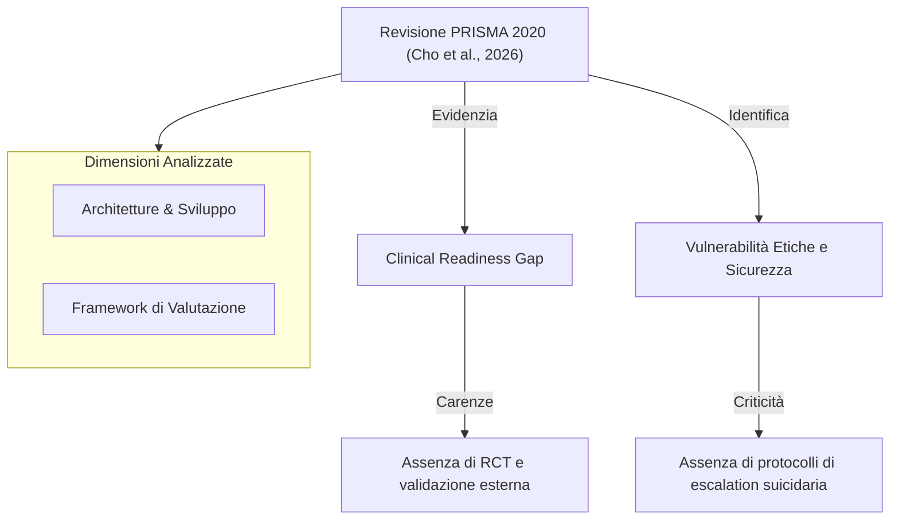

# Large Language Model–Based Chatbots and Agentic AI for Mental Health Counseling: Systematic Review of Methodologies, Evaluation Frameworks, and Ethical Safeguards (Cho et al., 2026)

## Definizione Operativa

La revisione sistematica PRISMA 2020, condotta da Ha Na Cho, Jiayuan Wang, Di Hu e Kai Zheng (Università della California, Irvine; pubblicata su *JMIR AI* 2026;5:e80348, doi: 10.2196/80348), sintetizza in modo esaustivo 20 studi originali pubblicati tra il 2020 e il maggio 2025 dedicati allo sviluppo, alle tecniche computazionali, ai framework di valutazione e alle salvaguardie etico-regolatorie di chatbot e sistemi agentici basati su [[large-language-models]] (LLM) per il counseling e il supporto in salute mentale.

Lo studio introduce la prima tassonomia metodologica sistematica che correla:
*   **Architetture di modello:** (decoder-only, GPT, LLaMA, Qwen, ChatGLM).
*   **Strategie di prompt engineering:** (few-shot, persona, CoT, prompt chaining, RAG).
*   **Tecniche di fine-tuning:** (PEFT/LoRA/QLoRA, full FT, RLHF).
*   **Approcci di valutazione:** (metriche linguistiche NLP vs rubriche cliniche).

Un risultato centrale della revisione è l'identificazione del "[[clinical-readiness-gap-in-mh-chatbots|Clinical Readiness Gap]]": mentre la capacità conversazionale dei sistemi è elevata in ambiente di laboratorio, manca una validazione clinica esterna indipendente e un allineamento con gli standard regolatori (es. FDA, WHO).

## Evidenze dalla Letteratura

### Sintesi Metodologica e Risultati Chiave
1.  **Architetture:** Il 45% (9/20) degli studi impiega modelli della famiglia GPT; il 90% (18/20) ricorre a fine-tuning o domain-adaptation. Nessuno studio utilizza modelli puramente encoder-only (es. BERT) come generatori primari.
2.  **Valutazione:** Il 90% degli studi utilizza metriche di sovrapposizione lessicale (BLEU, ROUGE, BERTScore). **Nessuno studio (0/20) ha condotto un trial clinico randomizzato (RCT)** né ha implementato una validazione clinica esterna in contesti reali con scale psicometriche validate (es. PHQ-9, GAD-7).
3.  **Sicurezza ed Etica:** Tramite il *[[traffic-light-quality-appraisal-clinical-ai|traffic light framework]]*, l'85% degli studi non documenta protocolli di escalation per il rischio suicidario, evidenziando gravi carenze nel dominio "Ethics & Safety".
4.  **Trasparenza:** Solo il 30% degli studi ha reso pubblico il codice sorgente; il 20% ha condiviso porzioni di dataset.

### Framework di Valutazione (Traffic Light)
La qualità metodologica è stata analizzata su 5 domini:
*   **Design dello studio:** Generalmente robusto (13/20 a basso rischio).
*   **Dataset:** Discreto (18/20 a basso rischio).
*   **Metriche:** Elevata standardizzazione NLP (18/20 a basso rischio).
*   **Validazione esterna:** Grave criticità (16/20 con preoccupazioni, 2/20 ad alto rischio).
*   **Etica e Sicurezza:** Area di massimo rischio (30% ad alto rischio, 55% con preoccupazioni).

**Riferimenti Bibliografici:**
- Cho, H. N., Wang, J., Hu, D., & Zheng, K. (2026). Large Language Model–Based Chatbots and Agentic AI for Mental Health Counseling: Systematic Review of Methodologies, Evaluation Frameworks, and Ethical Safeguards. *JMIR AI*, 5, e80348. https://doi.org/10.2196/80348
- Page, M. J., et al. (2021). The PRISMA 2020 statement: an updated guideline for reporting systematic reviews. *BMJ*, 372, n71.
- Abbasian, M., et al. (2024). Foundation metrics for evaluating effectiveness of healthcare conversations powered by generative AI. *NPJ Digital Medicine*, 7(1), 82.
- World Health Organization. (2024). *Ethics and governance of artificial intelligence for health*.
- U.S. Food and Drug Administration. (2021). *AI/ML-Based Software as a Medical Device (SaMD) Action Plan*.

## Relazioni

