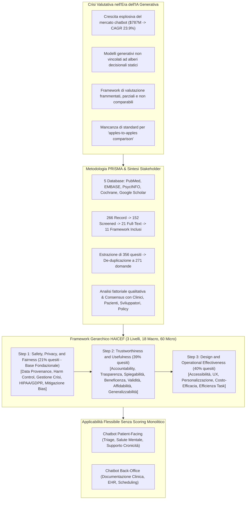

---
tags: [haicef, conversational-ai, health-chatbots, ai-evaluation-framework, chai, safety-privacy-fairness, trustworthiness-usefulness, design-operational-effectiveness, prisma, systematic-review, maslow-hierarchy, healthcare-evaluation, clinical-nlp]
source_papers: ["ai_v4i1e69006.pdf"]
---

# Standardizing and Scaffolding Health Care AI-Chatbot Evaluation: Systematic Review (Hua et al., 2025)

## Definizione Operativa e Sintesi Esecutiva
- Systematic review e sviluppo di framework metodologico condotto da un team multidisciplinare (Yining Hua, Winna Xia, David Bates, George Luke Hartstein, Hyungjin Tom Kim, Michael Li, Benjamin W. Nelson, Charles Stromeyer IV, Darlene King, Jina Suh, Li Zhou, John Torous) affiliato a Harvard Business School, Beth Israel Deaconess Medical Center, Brigham and Women's Hospital, Brown University, Thomas Jefferson University, UT Southwestern e Microsoft, pubblicato su *JMIR AI* (2025;4:e69006, doi:10.2196/69006).
- **Il Contesto e la Crisi Valutativa:** Il mercato dei chatbot sanitari è in rapida espansione ($787,1 milioni nel 2022, CAGR stimato del 23,9% dal 2023 al 2030), trainato dalla domanda post-pandemica e dalla diffusione dei [[large-language-models]] (LLM) generativi. A differenza dei sistemi tradizionali basati su alberi decisionali rigidi, i modelli generativi producono risposte dinamiche e non vincolate, rendendo obsoleti i metodi di test convenzionali. La frammentazione della letteratura ha prodotto framework isolati, eterogenei e spesso limitati a metriche superficiali di gradimento o task completion.
- **La Soluzione HAICEF (*Health Care AI Chatbot Evaluation Framework*):** Guidati dalle linee guida PRISMA e da un'analisi fattoriale qualitativa con stakeholder multipli (clinici, pazienti, sviluppatori, epidemiologi, esperti di policy), gli autori hanno sintetizzato 11 framework esistenti estraendo 356 domande, rifinite a **271 quesiti operativi**. Questi sono stati mappati e strutturati su **3 livelli gerarchici di priorità** (ispirati alla gerarchia dei bisogni di Maslow e al framework per app APA), comprendenti **18 costrutti di secondo livello** e **60 costrutti di terzo livello** (di cui 56 coperti da domande specifiche).
- **Il Principio Chiave "Safety-First" e la Discrepanza della Letteratura:** L'analisi rivela una profonda disconnessione: la maggior parte dei framework preesistenti si concentra sul livello superiore (*Design and Operational Effectiveness*, 40% delle domande) o su metriche di performance (*Trustworthiness and Usefulness*, 39%), trascurando la base fondazionale (*Safety, Privacy, and Fairness*, 21%). Il framework HAICEF stabilisce che la sicurezza, la riservatezza (HIPAA/GDPR) e l'equità algoritmica costituiscono la precondizione non negoziabile: se un chatbot fallisce il Livello 1, l'esame dei livelli successivi diventa superfluo.

---

## Evidenze dalla Letteratura e Metodologia

### 1. Inquadramento: Rischi Clinici e Vuoto di Standardizzazione
- **Rischi Reali Documentati:** La letteratura documenta gravi derive iatrogene nei chatbot non adeguatamente validati:
  - Chatbot per disturbi alimentari che forniscono consigli dietetici pericolosi e restrittivi a pazienti vulnerabili (Sharp, Torous, & West, 2023; caso *Tessa*).
  - Agenti conversazionali che generano rappresentazioni stigmatizzanti della schizofrenia (King, 2022) o forniscono istruzioni dettagliate su condotte autolesive e suicidarie (De Freitas & Cohen, 2024).
  - Diffusione di informazioni cliniche errate o sottilmente inesatte nell'ambito oncologico e farmacologico, difficilmente rilevabili anche da clinici esperti (Chen et al., 2023).
- **Origine dei Dati di Training:** La maggior parte degli agenti generativi commerciali è addestrata su dati estratti dal web e dai social media anziché su cartelle cliniche convalidate o evidenze biomediche peer-reviewed (Hua et al., 2025b), introducendo bias sistemici e allucinazioni cliniche.

---

### 2. Disegno dello Studio PRISMA e Sintesi degli 11 Framework

```mermaid
flowchart LR
    subgraph Search ["Ricerca Sistematica"]
        R1["PubMed (n=106)"]
        R2["EMBASE (n=82)"]
        R3["APA PsycINFO (n=40)"]
        R4["Cochrane Library (n=20)"]
        R5["Google Scholar (Top 100 / n=18)"]
    end

    subgraph ScreeningProcess ["Filtro PRISMA"]
        S1["266 Record Identificati"] --> S2["114 Duplicati Rimossi"]
        S2 --> S3["152 Record Screened"]
        S3 --> S4["131 Esclusi (Titolo/Abstract)"]
        S4 --> S5["21 Full-Text Valutati"]
        S5 --> S6["10 Esclusi (6 non-evaluation, 4 non-framework)"]
        S6 --> S7["11 Framework Inclusi"]
    end

    Search --> S1
```

Gli 11 framework inclusi rappresentano lo stato dell'arte pre-HAICEF e riflettono approcci eterogenei:
1. **Denecke & Warren (2020):** Valutazione di applicazioni sanitarie con conversational user interface (CUI).
2. **Martinengo et al. (2023):** Tassonomia e classificazione concettuale basata su interviste a esperti (etica, privacy, coinvolgimento utente).
3. **Denecke & May (2023):** Tassonomia tecnica e cluster analysis degli archetipi di agenti conversazionali.
4. **Ding et al. (2024):** Framework a 4 stadi (fattibilità/usabilità, efficacia, effettività, implementazione) derivato dalle linee guida WHO.
5. **Xue et al. (2023):** Scoping review sullo stato attuale dei chatbot per la salute digitale.
6. **Denecke (2023):** Guida per lo sviluppo di agenti ad alta qualità e sicurezza per il paziente.
7. **Liu et al. (2023):** Analisi della qualità dell'informazione erogata dai chatbot sanitari.
8. **Coghlan et al. (2023):** Questioni etiche e raccomandazioni per l'impiego dei chatbot nella salute mentale.
9. **Shlobin et al. (2024):** Integrazione etica e validazione human-in-the-loop per chatbot in neurochirurgia.
10. **Nadarzynski et al. (2024):** Roadmap per l'equità sanitaria e l'inclusività negli agenti conversazionali.
11. **Abbasian et al. (2024):** Metriche fondazionali per la valutazione dell'efficacia delle conversazioni cliniche basate su GenAI.

---

## Architettura Dettagliata del Framework HAICEF

HAICEF si articola in una struttura ad albero a tre livelli gerarchici. Non assegna punteggi numerici monolitici (*non-scoring scaffold*), ma agisce come una guida flessibile in cui i vari stakeholder possono ponderare i costrutti secondo il contesto operativo.

```mermaid
graph TD
    subgraph L1 ["Livello 1: Safety, Privacy, and Fairness (n=56 quesiti, 21%)"]
        S["Safety (n=17)"] --> S1["Data Provenance (EHR vs Social Data)"]
        S --> S2["Harm Control & Prevenzione Rischi"]
        S --> S3["Automation Bias Reduction"]
        S --> S4["Critical Help & Triage Emergenze"]
        S --> S5["Outcome Proxies Appropriateness & Ethics"]
        
        SEC["Security (n=14)"] --> SEC1["Protection Methods & Crittografia"]
        SEC --> SEC2["Security Standards & Vulnerability Testing"]
        SEC --> SEC3["Third-party Reliability & Cloud Auditing"]
        
        RES["Resilience"] --> RES1["Tolleranza agli Eventi Avversi e Disconnessioni"]
        
        P["Privacy (n=22)"] --> P1["Conformità HIPAA / GDPR"]
        P --> P2["Data Collection, Storage & Exchange Protocols"]
        P --> P3["Data Protection & Privacy Policy"]
        
        F["Fairness & Bias (n=3)"] --> F1["Systemic & Institutional Bias"]
        F --> F2["Computational, Statistical & Demographic Bias"]
        F --> F3["Human-Cognitive Bias & Population Parity"]
    end

    subgraph L2 ["Livello 2: Trustworthiness and Usefulness (n=107 quesiti, 39%)"]
        ACC["Accountability (n=2)"]
        TR["Transparency (n=18)"] --> TR1["Usage Specification & Model Limits"]
        EXP["Explainability (n=1)"] --> EXP1["Model Explainability & Interpretability"]
        BEN["Beneficence (n=17)"] --> BEN1["Clinical Evidence (RCT/A-B) & Health Outcomes"]
        VAL["Validity (n=28)"] --> VAL1["Language Understanding, Retrieval & Outcome Accuracy"]
        REL["Reliability (n=29)"] --> REL1["Failure Prevention, Robustness & Workflow Fit"]
        GEN["Generalizability (n=4)"] --> GEN1["Age/Scenario Adaptability & Out-of-Distribution Data"]
        TEST["Testability (n=8)"] --> TEST1["Verifiability & Regular Auditing"]
    end

    subgraph L3 ["Livello 3: Design and Operational Effectiveness (n=108 quesiti, 40%)"]
        ACCS["Accessibility (n=46)"] --> ACCS1["Versatile Access (Multilingua, Voce/Testo, Multiplatform)"]
        ACCS --> ACCS2["User Literacy & Inclusione Digitale"]
        
        UX["User Experience & Simplicity"] --> UX1["Likability, Respectfulness, Clear Communication"]
        UX --> UX2["Interface Design & Ease of Use"]
        
        PENG["Personalized Engagement (n=31)"] --> PENG1["Personalization & Rapport Building (Empathy/Persona)"]
        PENG --> PENG2["User Adherence & Progress Awareness (Memory/Strategy Adjustment)"]
        
        CE["Cost-Effectiveness (n=18)"] --> CE1["Comparative Effectiveness & Economic/Ecological Viability"]
        CE --> CE2["Task Efficiency (Response Time, Conciseness, Actionability)"]
    end

    L1 ==> L2
    L2 ==> L3
```

### Tabella dei Costrutti HAICEF (Livelli 1, 2 e 3)

| Livello Prioritario (Step) | Macro-Costrutto (Livello 2) | Costrutti Granulari (Livello 3) | Definizione Operativa e Focus Valutativo | Peso Relativo (% Domande) |
| :--- | :--- | :--- | :--- | :---: |
| **Step 1: Safety, Privacy, and Fairness** | **Safety** | *Outcome proxies, Data provenance (providers/sources), Harm control, Automation bias reduction, Critical help, Ethics* | Prevenzione del peggioramento degli esiti clinici; tracciamento rigoroso dell'origine dei dati; mitigazione dell'accettazione acritica da parte dell'utente; gestione delle emergenze. | **21%** (56 domande) |
| | **Security** | *Protection method, Security standard, Third-party reliability* | Salvaguardia della riservatezza, integrità e disponibilità contro accessi non autorizzati e minacce esterne. | |
| | **Resilience** | *Resilience* | Capacità del sistema di resistere a fallimenti tecnici, eventi avversi imprevisti e variazioni ambientali. | |
| | **Privacy** | *Data exchange, Data collection/storage, Data usage, Privacy policy, Data protection* | Conformità normativa rigorosa (HIPAA, GDPR); protezione dei dati sanitari personali e consenso informato. | |
| | **Fairness & Bias** | *Systemic bias, Computational/statistical bias, Human-cognitive biases, Population bias* | Riduzione delle disparità algoritmiche; parità di accuratezza tra sottogruppi demografici e popolazioni sottorappresentate. | |
| **Step 2: Trustworthiness and Usefulness** | **Accountability** | *Accountability assurance* | Standard di verificabilità e assunzione di responsabilità lungo l'intero ciclo di vita dell'agente. | **39%** (107 domande) |
| | **Transparency** | *Usage specification, Model characteristics, Model availability, Model limitations, Data usage* | Comunicazione chiara e trasparente di limiti, confini operativi, modalità di addestramento e funzionalità del modello. | |
| | **Explainability** | *Model explainability, Model interpretability* | Trasparenza dei processi decisionali interni e resa comprensibile degli output all'utente finale. | |
| | **Beneficence** | *Health outcomes, Clinical evidence (RCT/A-B test), Use behavior, Intervention, Health care system* | Dimostrazione tangibile di benefici clinici superiori ai rischi; impatto positivo sul comportamento e sul sistema sanitario. | |
| | **Validity** | *Data relevance/credibility, Language understanding, Retrieval accuracy, Outcome accuracy, Task completion* | Accuratezza clinica e linguistica in condizioni di utilizzo reale; correttezza del recupero delle informazioni. | |
| | **Reliability** | *Failure prevention, Robustness, Workflow integration, Reproducibility, Monitoring, Up-to-dateness* | Costanza di funzionamento nel tempo; robustezza di fronte a input anomali; integrazione fluida nelle routine cliniche. | |
| | **Generalizability** | *Contextual adaptability (Age/Scenario), Novel data performance* | Capacità di mantenere elevate performance su dati non visti e contesti demografici/clinici differenti. | |
| | **Testability** | *Verifiability (Quantifiability), Regular auditing* | Misurabilità quantitativa e predisposizione ad audit periodici di sicurezza e accuratezza. | |
| **Step 3: Design and Operational Effectiveness** | **Accessibility** | *Versatile access (Multilanguage, Multimodal input/output, Multiplatform, Multidevice), User literacy* | Fruibilità universale indipendentemente da abilità fisiche, competenze tecnologiche o barriere linguistiche. | **40%** (108 domande) |
| | **User Experience** | *Likability, Agent understanding, User engagement, Respectfulness, Response appropriateness, Credibility, UI Design, Simplicity* | Interazione fluida, rispettosa, gradevole ed ergonomica; minimizzazione del carico cognitivo per l'utente. | |
| | **Personalized Engagement** | *Personalization, Anthropomorphism & Relationship (Rapport, Empathy, Humor, Identity), User adherence, Feedback incorporation, Progress awareness (Memory, Strategy adjustment)* | Adattamento sartoriale al profilo dell'utente; mantenimento della memoria multi-sessione; sintonizzazione relazionale. | |
| | **Cost-Effectiveness** | *Comparative effectiveness, Economical viability, Environmental viability, Task efficiency (Time, Conciseness, Relevance, Practicality)* | Sostenibilità economica ed ecologica; tempestività, concisione e praticità azionabile delle risposte fornite. | |

---

## Analisi Comparativa dei Framework Pregressi

La revisione sistematica evidenzia le coperture parziali dei framework esistenti, risolte dall'approccio unificato di HAICEF:

| Dimensione di Valutazione | [12] Denecke 2020 | [16] Martinengo 2023 | [14] Denecke 2023 | [21] Ding 2024 | [18] Xue 2023 | [13] Denecke 2023b | [15] Liu 2023 | [17] Coghlan 2023 | [20] Shlobin 2024 | [22] Nadarzynski 2024 | [19] Abbasian 2024 | **HAICEF (Hua 2025)** |
| :--- | :---: | :---: | :---: | :---: | :---: | :---: | :---: | :---: | :---: | :---: | :---: | :---: |
| **Safety (Sicurezza)** | ✔ | ✔ | | ✔ | ✔ | | | ✔ | ✔ | ✔ | ✔ | **✔ (17 costrutti)** |
| **Security (Sicurezza Informatica)**| ✔ | ✔ | | | ✔ | ✔ | | | | ✔ | ✔ | **✔ (14 costrutti)** |
| **Resilience (Resilienza)** | | | | | | | | | | | ✔ | **✔ (Costrutto dedicato)**|
| **Fairness & Bias Management** | | ✔ | | | | | | ✔ | ✔ | ✔ | ✔ | **✔ (Copertura totale)**|
| **Privacy (Riservatezza Dati)** | ✔ | ✔ | ✔ | | ✔ | ✔ | | ✔ | ✔ | ✔ | ✔ | **✔ (22 costrutti)** |
| **Accountability & Trasparenza** | | | | | | | | ✔ | ✔ | ✔ | | **✔ (Costrutti centrali)**|
| **Explainability & Interpretabilità**| | | | | | | | ✔ | ✔ | | ✔ | **✔ (Modello & Output)** |
| **Beneficence & Efficacia Clinica** | | ✔ | | | | | | | ✔ | | | **✔ (RCT/A-B Evidence)** |
| **Validity & Accuratezza** | ✔ | ✔ | | ✔ | ✔ | ✔ | ✔ | | | ✔ | ✔ | **✔ (28 costrutti)** |
| **Reliability & Workflow** | ✔ | | | | ✔ | | ✔ | | | | ✔ | **✔ (29 costrutti)** |
| **Generalizability (Nuovi Dati)** | | | | | | | | | | ✔ | ✔ | **✔ (Adattabilità)** |
| **Accessibility (Accessibilità)** | | ✔ | | | | ✔ | ✔ | | | ✔ | | **✔ (46 costrutti)** |
| **Cost-Effectiveness & Efficienza**| | ✔ | ✔ | | | | | | | ✔ | | **✔ (18 costrutti)** |
| **Personalized Engagement & UX** | ✔ | ✔ | ✔ | ✔ | ✔ | | | | | | ✔ | **✔ (31 costrutti)** |

---

## Implicazioni per la Salute Mentale, la Psicoterapia CBT e la Governance Sanitaria

### 1. La Prospettiva Clinica e CBT: Superare il Falso Conforto dell'Empatia Superficiale
- **Il Rischio dell'Illusion of Competence:** Nei chatbot clinici e di supporto psicologico, la fluidità linguistica e l'empatia apparente (*simulated empathy*) possono mascherare allucinazioni diagnostiche o incapacità di gestire il rischio suicidario ([[reflective-interpretability]], [[rlhf-safety-therapeutic-conflict]]).
- **Prioritizzazione Piramidale:** Collocare *Safety, Privacy and Fairness* come Step 1 obbliga chi valuta un'applicazione di salute mentale a verificare preliminarmente:
  1. *Protocolli di Crisi:* Il chatbot possiede meccanismi deterministici di deviazione (*harm control / critical help*) per intercettare ideazione suicidaria, autolesionismo o sintomi psicotici acuti?
  2. *Data Provenance e Privacy:* Le conversazioni intime del paziente sono protette da crittografia end-to-end e isolate dall'addestramento continuo di modelli di terze parti?
  3. *Automation Bias:* L'utente fragile viene incoraggiato a mantenere il pensiero critico senza delegare decisioni vitali all'agente?

### 2. Dualità Operativa: Applicazioni Patient-Facing vs Back-Office
- **Strumenti Patient-Facing (Triage, Terapia Digitale, Automonitoraggio):** Massima enfasi su Step 1 (sicurezza, gestione crisi, privacy) e Step 3 (empatia calibrata, memoria della seduta, aderenza alle prescrizioni comportamentali).
- **Strumenti Back-Office (Sintesi Clinica, Estrazione Dati EHR, Scheduling):** Massima enfasi su Step 2 (validità, accuratezza del retrieval, affidabilità del flusso di lavoro, robustezza) e Step 1 (sicurezza informatica e conformità HIPAA/GDPR).

### 3. Allineamento Regolatorio e Standard Internazionali
- HAICEF funge da ponte tra le linee guida di alto livello della [[chai-blueprint-health-ai|Coalition for Health AI (CHAI)]] e i requisiti vincolanti delle normative internazionali sui dispositivi medici software (**FDA SaMD** 21 CFR 820 ed **EU AI Act** / Regolamento MDR 2017/745).
- Prossimi sviluppi previsti: validazione prospettica in ambienti clinici eterogenei e consensus Delphi per estendere i costrutti di accountability assurance e accessibilità inclusiva.

---

## Riferimenti Bibliografici
- Abbasian, M., Khatibi, E., Azimi, I., Oniani, D., Shakeri Hossein Abad, Z., Thieme, A., et al. (2024). Foundation metrics for evaluating effectiveness of healthcare conversations powered by generative AI. *NPJ Digital Medicine*, 7(1), Article 82. https://doi.org/10.1038/s41746-024-01074-z
- Coalition for Health AI (CHAI). (2023). *Blueprint for Trustworthy AI: Implementation Guidance and Assurance for Healthcare*. Published online April 2023. https://www.coalitionforhealthai.org/
- Coghlan, S., Leins, K., Sheldrick, S., Cheong, M., Gooding, P., & D'Alfonso, S. (2023). To chat or bot to chat: ethical issues with using chatbots in mental health. *Digital Health*, 9, 20552076231183542. https://doi.org/10.1177/20552076231183542
- Denecke, K. (2023). Framework for guiding the development of high-quality conversational agents in healthcare. *Healthcare*, 11(8), 1061. https://doi.org/10.3390/healthcare11081061
- Denecke, K., & May, R. (2023). Developing a technical-oriented taxonomy to define archetypes of conversational agents in health care: literature review and cluster analysis. *Journal of Medical Internet Research*, 25, e41583. https://doi.org/10.2196/41583
- Denecke, K., & Warren, J. (2020). How to evaluate health applications with conversational user interface? *Studies in Health Technology and Informatics*, 270, 976-980. https://doi.org/10.3233/SHTI200307
- Ding, H., Simmich, J., Vaezipour, A., Andrews, N., & Russell, T. (2024). Evaluation framework for conversational agents with artificial intelligence in health interventions: a systematic scoping review. *Journal of the American Medical Informatics Association*, 31(3), 746-761. https://doi.org/10.1093/jamia/ocad222
- Henson, P., David, G., Albright, K., & Torous, J. (2019). Deriving a practical framework for the evaluation of health apps. *The Lancet Digital Health*, 1(2), e52-e54. https://doi.org/10.1016/S2589-7500(19)30013-5
- Hua, Y., Xia, W., Bates, D., Hartstein, G. L., Kim, H. T., Li, M., Nelson, B. W., Stromeyer, C., IV, King, D., Suh, J., Zhou, L., & Torous, J. (2025). Standardizing and Scaffolding Health Care AI-Chatbot Evaluation: Systematic Review. *JMIR AI*, 4, e69006. https://doi.org/10.2196/69006
- Liu, C., Zowghi, D., Peng, G., & Kong, S. (2023). Information quality of conversational agents in healthcare. *Information Development*, 41(3), 1080-1102. https://doi.org/10.1177/02666669231172434
- Martinengo, L., Lin, X., Jabir, A. I., Kowatsch, T., Atun, R., Car, J., et al. (2023). Conversational agents in health care: expert interviews to inform the definition, classification, and conceptual framework. *Journal of Medical Internet Research*, 25, e50767. https://doi.org/10.2196/50767
- Nadarzynski, T., Knights, N., Husbands, D., Graham, C. A., Llewellyn, C. D., Buchanan, T., et al. (2024). Achieving health equity through conversational AI: a roadmap for design and implementation of inclusive chatbots in healthcare. *PLOS Digital Health*, 3(5), e0000492. https://doi.org/10.1371/journal.pdig.0000492
- Shlobin, N. A., Ward, M., Shah, H. A., Brown, E. D., Sciubba, D. M., Langer, D., et al. (2024). Ethical incorporation of artificial intelligence into neurosurgery: a generative pretrained transformer chatbot-based, human-modified approach. *World Neurosurgery*, 187, e769-e791. https://doi.org/10.1016/j.wneu.2024.04.165
- Xue, J., Zhang, B., Zhao, Y., Zhang, Q., Zheng, C., Jiang, J., et al. (2023). Evaluation of the current state of chatbots for digital health: scoping review. *Journal of Medical Internet Research*, 25, e47217. https://doi.org/10.2196/47217

---

## Relazioni
- Progetti e framework correlati: [[haicef-framework]], [[chai-blueprint-health-ai]], [[healthcare-conversational-agents]], [[five-axis-clinical-evaluation]], [[software-as-a-medical-device-salute-mentale]], [[three-layer-governance-framework]], [[rlhf-safety-therapeutic-conflict]], [[reflective-interpretability]], [[audit-bias-llm-clinici]], [[modello-centauro-clinico]], [[simulated-therapeutic-alliance]].
