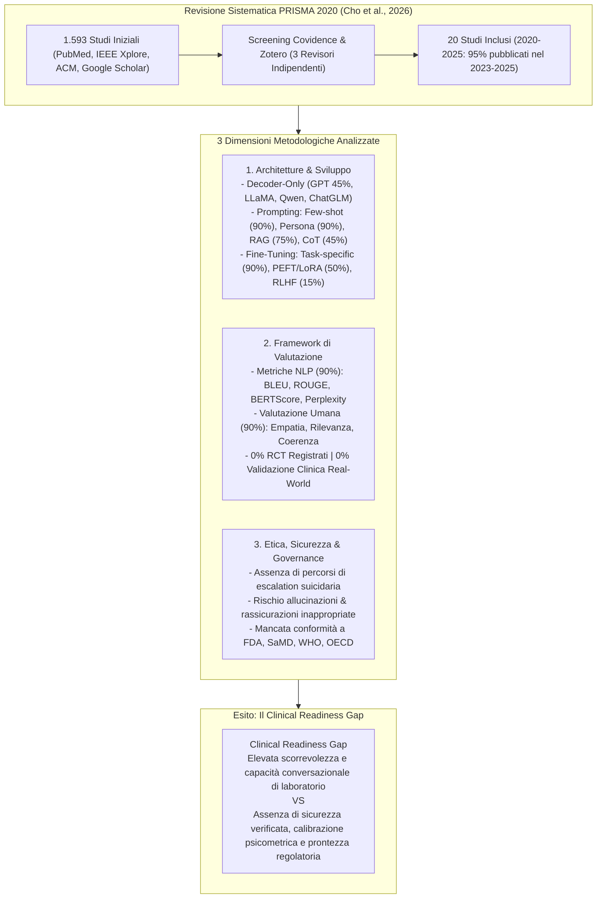
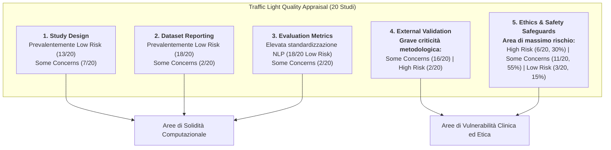
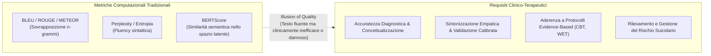

---
tags: [systematic-review, conversational-agents, mental-health-counseling, agentic-ai, prisma-2020, evaluation-frameworks, ethical-safeguards, clinical-readiness-gap, traffic-light-quality-appraisal, large-language-models, fine-tuning, prompt-engineering, retrieval-augmented-generation, safety-escalation]
source_papers: ["ai_v5i1e80348.pdf"]
---

# Large Language Model–Based Chatbots and Agentic AI for Mental Health Counseling: Systematic Review of Methodologies, Evaluation Frameworks, and Ethical Safeguards (Cho et al., 2026)

## Definizione Operativa
- **Systematic review PRISMA 2020** condotta da Ha Na Cho, Jiayuan Wang, Di Hu e Kai Zheng (Department of Informatics, University of California, Irvine; pubblicata su *JMIR AI* 2026;5:e80348, doi: 10.2196/80348) che sintetizza in modo esaustivo 20 studi originali (gennaio 2020 – maggio 2025) dedicati allo sviluppo, alle tecniche computazionali, ai framework di valutazione e alle salvaguardie etico-regolatorie dei chatbot e dei sistemi agentici basati su [[large-language-models]] (LLM) per il counseling e il supporto in salute mentale.
- **Utilità Clinica e per la Ricerca in DMHI (Digital Mental Health Interventions):** Fornisce la prima tassonomia metodologica sistematica che correla le architetture di modello (decoder-only, GPT, LLaMA, Qwen, ChatGLM), le strategie di prompt engineering (few-shot, persona, CoT, prompt chaining, RAG) e le tecniche di fine-tuning (PEFT/LoRA/QLoRA, full FT, RLHF) con i relativi approcci di valutazione (metriche linguistiche NLP vs rubriche cliniche) e con la presenza o assenza di salvaguardie di sicurezza.
- **Risultanze Chiave e "[[clinical-readiness-gap-in-mh-chatbots|Clinical Readiness Gap]]":**
  1. *Predominanza di Architetture Generative Decoder-Only:* Il 45% (9/20) degli studi impiega modelli della famiglia GPT (GPT-2, 3, 3.5, 4) e il 90% (18/20) ricorre a fine-tuning o domain-adaptation (LLaMA, ChatGLM, Qwen, Baichuan, PanGu). Nessuno studio impiega modelli puramente encoder-only (es. BERT) come generatori primari di dialogo.
  2. *Disconnessione tra Metriche NLP e Misurazione Clinica:* Il 90% (18/20) degli studi utilizza metriche quantitative di sovrapposizione lessicale (BLEU, ROUGE, distinct-n, perplexity, BERTScore) e il 65% (13/20) valutazioni qualitative esperte, ma **nessuno studio (0/20) ha condotto o registrato un trial clinico randomizzato controllato (RCT)** né ha implementato una validazione clinica esterna indipendente in setting di cura reali con scale psicometriche validate (PHQ-9, GAD-7, SUS).
  3. *Vulnerabilità Etiche e Carenza di Salvaguardie Operative:* Tramite una valutazione strutturata della qualità a semaforo (*[[traffic-light-quality-appraisal-clinical-ai|traffic light framework]]* su 5 domini), l'ambito *Ethics & Safety* e quello *External Validation* evidenziano i maggiori livelli di rischio: l'85% degli studi non documenta protocolli operativi formali per la gestione e l'escalation del rischio suicidario o delle allucinazioni cliniche, e mancano allineamenti con gli standard regolatori (FDA, Software as a Medical Device - SaMD, linee guida WHO/OECD).
  4. *Crisi di Riproducibilità e Trasparenza:* Solo il 30% (6/20) degli studi ha reso pubblico il codice sorgente o i modelli, e solo il 20% (4/20) ha condiviso porzioni di dataset; le metriche sui costi computazionali (latenza, hardware, memoria) sono quasi totalmente omesse.

---

## Panoramica e Contesto dello Studio

L'aumento globale del carico legato ai disturbi di salute mentale, combinato con la carenza cronica di professionisti e i tempi di attesa elevati, ha spinto verso lo sviluppo accelerato di **Interventi Digitali per la Salute Mentale (DMHI)**. Con l'avvento dei Large Language Models basati su Transformer (famiglia GPT, serie LLaMA, Qwen, ChatGLM, Mistral), i chatbot per la salute mentale hanno superato le storiche limitazioni dei sistemi a regole e dei modelli basati su alberi decisionali statici, offrendo interazioni dinamiche, aperte e contestualmente adattive.

Tuttavia, la letteratura su questi applicativi si è sviluppata in modo frammentario tra informatica, elaborazione del linguaggio naturale (NLP) e scienze mediche. La revisione sistematica di Cho et al. (2026) colma questa lacuna analizzando i 20 sistemi empirici più rilevanti sviluppati tra il 2020 e il 2025.

### Quesiti di Ricerca della Revisione:
1. **Applicazione e sviluppo:** In che modo i modelli LLM sono stati implementati e ingegnerizzati per il counseling psicologico?
2. **Metriche e outcome:** Quali esiti clinici, psicometrici o linguistici sono stati misurati per valutarne efficacia e affidabilità?
3. **Etica e governance:** Come sono stati affrontati i rischi critici (bias, allucinazioni, gestione del rischio suicidario e trasparenza algoritmica)?

---

## Architetture Tecnologiche, Prompting e Fine-Tuning

```mermaid
flowchart LR
    subgraph BaseModels ["Modelli Base Utilizzati (20 Studi)"]
        GPT["GPT Family (GPT-2, 3, 3.5, 4)<br/><b>45% (9/20)</b>"]
        OpenLLM["LLaMA / Mistral / Alpaca<br/><b>20% (4/20)</b>"]
        AsianLLM["ChatGLM / Qwen / Baichuan<br/><b>35% (7/20)</b>"]
        Hybrid["RASA / DialoGPT / T5<br/><b>15% (3/20)</b>"]
    end

    subgraph PromptingMethods ["Strategie di Prompting"]
        PR1["Few-Shot: <b>90% (18/20)</b>"]
        PR2["Instruction Tuning: <b>95% (19/20)</b>"]
        PR3["Persona-Based: <b>90% (18/20)</b>"]
        PR4["Prompt Chaining: <b>90% (18/20)</b>"]
        PR5["RAG: <b>75% (15/20)</b>"]
        PR6["Chain-of-Thought (CoT): <b>45% (9/20)</b>"]
        PR7["Multimodal Input: <b>15% (3/20)</b>"]
    end

    subgraph TuningStrategies ["Strategie di Fine-Tuning"]
        FT1["Task-Specific FT: <b>90% (18/20)</b>"]
        FT2["Instruction FT: <b>60% (12/20)</b>"]
        FT3["PEFT / LoRA / QLoRA: <b>50% (10/20)</b>"]
        FT4["Full FT: <b>30% (6/20)</b>"]
        FT5["RLHF: <b>15% (3/20)</b>"]
        FT6["Continual Learning: <b>5% (1/20)</b>"]
    end

    BaseModels --> PromptingMethods --> TuningStrategies
```

### 1. Modelli e Architetture
- **Decoder-Only Dominance:** La totalità dei sistemi di dialogo impiega architetture decoder-only o ibride autoregressive seq2seq. I modelli encoder-only (come BERT, RoBERTa) non sono mai impiegati per la generazione del dialogo, ma solo per task di classificazione intermedi o metriche di scoring (es. BERTScore).
- **Modelli Proprietari vs Open-Weight:** Ampio impiego di modelli OpenAI commerciali (GPT-3, GPT-3.5-turbo, GPT-4/4.0), affiancati da modelli open-weight (Mistral-7B, LLaMA-2-7B, Qwen-7B/14B/max, ChatGLM2-6B, Baichuan-7B). I modelli general-purpose acquisiscono competenza clinica unicamente tramite prompt specializzati o pesi adattati.

### 2. Strategie di Prompt Engineering
- **Instruction & Persona-Based Prompting (90-95%):** Utilizzati per definire l'identità del terapeuta virtuale, imponendo toni caldi, empatici e non giudicanti e guidando le tecniche di ascolto attivo.
- **Prompt Chaining (90%):** Decomposizione della seduta in stadi logici consecutivi (accoglienza -> esplorazione del problema -> ristrutturazione/intervento -> debriefing).
- **Retrieval-Augmented Generation / RAG (75%):** Integrazione di basi di conoscenza esterne (manuali clinici CBT, linee guida di supporto emotivo, criteri DSM-5) per ancorare le risposte e ridurre le allucinazioni fattuali.
- **Chain-of-Thought / CoT (45%):** Utilizzato per forzare il modello a compiere passaggi di ragionamento diagnostico o di concettualizzazione del caso prima di emettere la verbalizzazione rivolta all'utente.

### 3. Approcci di Fine-Tuning
- **PEFT (Parameter-Efficient Fine-Tuning) e QLoRA (50%):** Lo standard de facto per l'adattamento specialistico mantenendo contenuti i costi computazionali.
- **RLHF (Reinforcement Learning from Human Feedback, 15%):** Applicato solo in una minoranza di studi pionieristici (es. Fan et al., 2025; Kang et al., 2024; Mishra et al., 2023) per allineare l'output alle preferenze di clinici o supervisori.
- **Continual Learning (5%):** Quasi inesplorato (1 solo studio), evidenziando la staticità dei modelli che non apprendono longitudinalmente dalle interazioni terapeutiche.

---

## Sintesi dei 20 Sistemi Inclusi nella Revisione

La tabella seguente riassume i 20 sistemi di MH counseling analizzati da Cho et al. (2026):

| Autore (Anno) | Nome Sistema / Modello | LLM Integrato | Metodi di Prompting | Strategia di Fine-Tuning | Metriche Principali |
| :--- | :--- | :--- | :--- | :--- | :--- |
| **Moon et al. [31] (2024)** | *We Care* | Mistral-7B Instruct v0.2 | Few-shot, CoT, RAG, Instruction | Task-specific FT, QLoRA | $F_1$, BLEU, ROUGE-L, BERTScore, Valutazione umana (n=2) |
| **Lai et al. [35] (2023)** | *Psy-LLM* | PanGu, WenZhong | Few-shot, RAG, Instruction, Persona | Task-specific FT, LoRA, Continual learning | Perplexity, ROUGE-L, distinct-n, Esperti umani (n=6) |
| **Marmol-Romero et al. [20] (2024)** | — | GPT-3 | Few-shot, Prompt chaining, Persona | — (Zero-shot / API prompt) | Frequenza messaggi, gamification, Soddisfazione utenti |
| **Chen et al. [37] (2024)** | *PBChat* | ChatGLM2 | Few-shot, CoT, Chaining, Persona | Task-specific FT, QLoRA | BLEU-1/4, ROUGE-1/2/L, BERTScore, Valutatori umani (n=409) |
| **Agnihotri et al. [21] (2021)** | *TACA* | GPT-2 | Few-shot, CoT, RAG, Chaining, Persona | Full FT, Instruction FT | Accuracy, $F_1$, Rilevanza emotiva esperta |
| **George et al. [22] (2024)** | *Mello* | Mistral-7B Instruct v0.1 | Few-shot, Chaining, Instruction, Persona | Task-specific FT, QLoRA | PsychoBench (Emotional Intelligence & Empathy Scale) |
| **Xiao et al. [38] (2024)** | *HealMe* | LLaMA2-7B-chat | Few-shot, CoT, Chaining, Persona | Supervised FT, LoRA | GPT-4 judge, PANAS pre/post therapy, Esperti (n=8) |
| **Kang et al. [23] (2025)** | *HoMemeTown / Dr. CareSam* | GPT-4.0 | Few-shot, RAG, Chaining, Persona | — (In-context learning) | NLP su criteri DSM-5, Interviste utenti (n=20) |
| **Qiu et al. [24] (2024)** | *PsyChat* | ChatGLM2-6B2 | Few-shot, CoT, RAG, Chaining, Persona | Task-specific FT, LoRA | $F_1$, Perplexity, METEOR, BLEU, ROUGE-L, distinct-1/2 |
| **Hanji et al. [32] (2024)** | *Self-Heal* | GPT-2 | Few-shot, Chaining, Multimodal input | Task-specific FT, Full FT | Valutazione esperta (empatia, coerenza, engagement) |
| **Kang et al. [25] (2024)** | — | LLaMA2-7B, ChatGLM2-6B | Few-shot, CoT, RAG, Chaining, Instruction | Task-specific FT, Inhibited LoRA, RLHF | ROUGE, Fluency, Valutazione esperta su matching clinico |
| **Fan et al. [26] (2025)** | — | Qwen2-7B | Few-shot, CoT, RAG, Chaining, Persona | Task-specific FT, LoRA, RLHF (GPT-4 assistita) | Accuracy, Precision, Recall, GPT-4 rating, Esperti (n=200 campioni) |
| **Mishra et al. [27] (2023)** | *e-THERAPIST* | GPT-2 Medium | Few-shot, Chaining, Persona | Task-specific FT, Full FT, RLHF | W-ACC, Macro-$F_1$, Perplexity, BERTScore-$F_1$, Esperti (n=6) |
| **Gu & Zhu [28] (2024)** | *MentalBlend* | GPT-4, GPT-3.5-turbo | Few-shot, CoT, RAG, Chaining, Persona | Task-specific FT | BLEU (1-4), BERTScore, distinct-2, Esperti (n=6) |
| **Gaikwad et al. [33] (2024)** | *Sahara: Virtual Companion* | DialoGPT + T5 | Few-shot, RAG, Chaining, Multimodal | Task-specific FT, Full FT | Word error rate, Accuracy, Perplexity |
| **Na et al. [36] (2024)** | *CBT-LLM* | Baichuan-7B | Few-shot, CoT, RAG, Chaining, Persona | Task-specific FT, LoRA | Accuracy, Recall, $F_1$, BLEU, METEOR, CHRF, BLEURT, BERTScore |
| **Yu & McGuinness [29] (2024)** | — | DialoGPT, ChatGPT 3.5 | Few-shot, RAG, Chaining, Persona | Task-specific FT, Full FT | Perplexity, BLEU, Valutazione utenti (n=20: 10 paz., 10 prof.) |
| **Hu et al. [39] (2024)** | — | Qwen-7B, Qwen-max | Few-shot, CoT, RAG, Multimodal | Task-specific FT, LoRA | Soddisfazione utenti (n=48), Interviste qualitative (n=10) |
| **Mavila et al. [34] (2024)** | *iCare* | RASA, GPT-3 | Few-shot, RAG, Chaining, Persona | Task-specific FT, Instruction FT | Accuracy, Precision, Recall, $F_1$, Soddisfazione utente |
| **Hu et al. [30] (2024)** | *PsycoLLM* | Qwen1.5-14B-Chat | Few-shot, RAG, Chaining, Persona | Full FT, Task-specific FT | Accuracy, ROUGE-1/L, BLEU-4, BERTScore, Audit esperto dati |

---

## Valutazione della Qualità Metodologica: Il Traffic Light Framework

Cho et al. (2026) hanno condotto un'approfondita valutazione del rischio di bias e della qualità metodologica attraverso un **quadro a semaforo (*[[traffic-light-quality-appraisal-clinical-ai|Traffic Light Framework]]*)** articolato su 5 domini cardine:

### Sintesi dei Risultati per Dominio:
1. **Study Design:** In generale robusto per la componente computazionale (13 studi a basso rischio), con dubbi emergenti solo laddove il disegno non distingueva chiaramente il contributo del prompting rispetto al fine-tuning.
2. **Dataset Reporting:** Soddisfacente (13 studi hanno utilizzato dataset pubblici come *PsyQA*, *Counsel-Chat*, *SmileChat*, *HOPE*), ma 6 studi si sono basati su dati proprietari senza disclosure.
3. **Evaluation Metrics:** Giudicato formalmente a basso rischio per la consistenza delle metriche computazionali impiegate (BLEU, ROUGE, BERTScore), pur evidenziando il limite concettuale della metrica lessicale rispetto al costrutto clinico.
4. **External Validation (Criticità Severa):** Quasi la totalità degli studi (18/20) è risultata a rischio ("some concerns" o "high risk") per la mancanza di dataset di test esterni, assenza di valutazione multi-centrica e mancato calcolo dell'affidabilità inter-rater (Cohen's Kappa o ICC).
5. **Ethics & Safety Reporting (Criticità Massima):** L'85% degli studi (17/20) presenta rischi moderati o elevati. Mancano audit formali di fairness, analisi del bias demografico/culturale, protocolli di mitigazione delle allucinazioni e canali di escalation per emergenze cliniche.

---

## Analisi Critica: Discrepanze tra Metriche NLP e Outcome Clinici

Uno dei contributi teorici più incisivi della revisione è l'evidenziazione del **divario tra indici lessicali e valore terapeutico reale**:

- **L'Illusione di Qualità delle Metriche Lessicali:** Punteggi elevati di BLEU o ROUGE indicano unicamente che l'output dell'LLM condivide parole con le risposte di riferimento del dataset. Non riflettono la capacità maieutica, il timing delle domande, l'alleanza terapeutica o l'appropriatezza clinica.
- **Rassicurazione Inappropriata (*Inappropriate Reassurance*):** I modelli non calibrati tendono a produrre risposte sbrigativamente ottimistiche ("andrà tutto bene", "non preoccuparti"), violando i principi base dell'accettazione e della validazione emotiva CBT.
- **Mancanza di Strumenti Psicometrici Standardizzati:** Solo 3 studi su 20 [22, 23, 38] hanno integrato scale psicometriche validate (es. PANAS pre/post sessione in Xiao et al., 2024; PsychoBench in George et al., 2024; o criteri DSM-5 in Kang et al., 2025). Nessuno studio ha monitorato longitudinalmente la riduzione sintomatica tramite scale cliniche primarie (PHQ-9 per la depressione o GAD-7 per l'ansia) in setting reali.

---

## Deployment, Riproducibilità e Costi di Risorsa

### 1. Canali e Formati di Erogazione (*Service Approach*)
- **Applicazioni Standalone Web-Based (90%, 18/20):** La quasi totalità dei sistemi è implementata come portale web o chat isolata, senza integrazione nelle cartelle cliniche elettroniche (EHR) o nei flussi di lavoro sanitari.
- **Agenti Virtuali e Ruoli Multipli (20%, 4/20):** Integrazione di avatar o personas terapeutiche strutturate (es. *PsyChat*, *PsycoLLM*, *We Care*).
- **Integrazioni Piattaforma (10%, 2/20):** Un sistema integrato in un ambiente virtuale Unity 3D (Yu & McGuinness, 2024) e uno erogato via bot Telegram (Marmol-Romero et al., 2024).
- **Mancanza di Soluzioni Mobile e Ibride:** Un solo studio ha realizzato un'app nativa mobile (*Self-Heal*), e nessun sistema ha testato un'architettura ibrida cross-platform (Web + Mobile + SMS), limitando l'accessibilità reale per popolazioni svantaggiate.

### 2. Trasparenza, Codice e Dati Aperti
- **Open-Source Scarcity:** Solo il 30% (6/20) degli studi ha pubblicato il codice o i pesi del modello; solo il 20% (4/20) ha reso disponibili i dati. Questa opacità impedisce il benchmarking indipendente e la replicabilità scientifica.
- **Assenza di Reporting su Compute e Latenza:** I requisiti di memoria GPU, i tempi di inferenza, i consumi energetici e i costi di deployment in cloud sono sistematicamente omessi, rendendo impossibile valutare la fattibilità economica per strutture sanitarie pubbliche o paesi a basso e medio reddito.

---

## Frontiere Emergenti: Dalla Chatbot Monolitica all'Agentic AI

Cho et al. (2026) evidenziano una transizione fondamentale in corso nella letteratura più recente (2024–2025):
- **Dalle Risposte Statiche a Sistemi Multi-Agente:** Evoluzione da chatbot a singolo turno verso architetture composte da molteplici agenti specializzati e collaborativi (es. agente terapeuta, agente paziente, supervisore critico, modulo RAG di recupero linee guida cliniche, safety guardrail in background).
- **CoT Clinico e Decomposizione del Ragionamento:** Utilizzo di catene di pensiero step-by-step per strutturare la concettualizzazione del caso prima di rispondere all'utente.
- **Multimodalità Emergente:** Primi tentativi di integrare input vocali o segnali fisiologici, sebbene ancora in fase embrionale (solo 3 studi su 20).

---

## Riferimenti Bibliografici
- Cho, H. N., Wang, J., Hu, D., & Zheng, K. (2026). Large Language Model–Based Chatbots and Agentic AI for Mental Health Counseling: Systematic Review of Methodologies, Evaluation Frameworks, and Ethical Safeguards. *JMIR AI*, 5, e80348. https://doi.org/10.2196/80348
- Page, M. J., et al. (2021). The PRISMA 2020 statement: an updated guideline for reporting systematic reviews. *BMJ*, 372, n71.
- Abbasian, M., Khatibi, E., Azimi, I., Oniani, D., Shakeri Hossein Abad, Z., Thieme, A., et al. (2024). Foundation metrics for evaluating effectiveness of healthcare conversations powered by generative AI. *NPJ Digital Medicine*, 7(1), 82.
- World Health Organization. (2024). *Ethics and governance of artificial intelligence for health: Guidance on large multi-modal models*. WHO Guidelines Approved by the Guidelines Review Committee.
- U.S. Food and Drug Administration. (2021). *Artificial Intelligence/Machine Learning (AI/ML)-Based Software as a Medical Device (SaMD) Action Plan*. FDA.

---

## Related pages
- [[clinical-readiness-gap-in-mh-chatbots]]
- [[traffic-light-quality-appraisal-clinical-ai]]
- [[healthcare-conversational-agents]]
- [[ai-assisted-psychotherapy]]
- [[clinical-fidelity-assessment]]
- [[software-as-a-medical-device-salute-mentale]]
- [[risk-ontology-ai-psychotherapy]]
- [[three-layer-governance-framework]]
- [[evidence-adoption-gap-ai-mental-health]]
- [[counseling-benchmarks-evaluation]]
- [[validita-psicometrica-llm]]
- [[open-data-scarcity-clinical-psychology]]
- [[modello-centauro-clinico]]
- [[large-language-models]]
- [[1-s2.0-S1386505625004216-main]]
- [[11920_2026_Article_1690]]
- [[2510.25384v1]]
- [[2607.25667v1]]