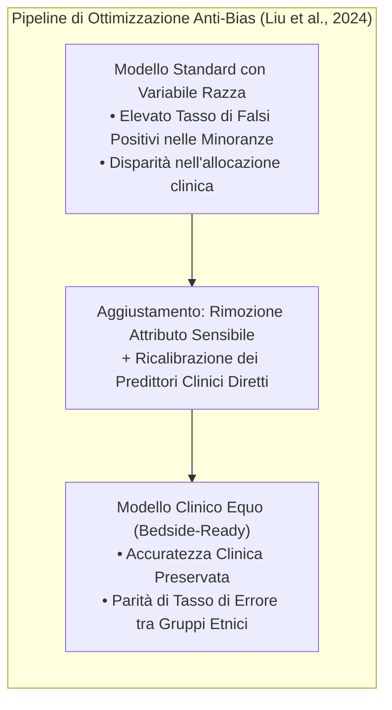
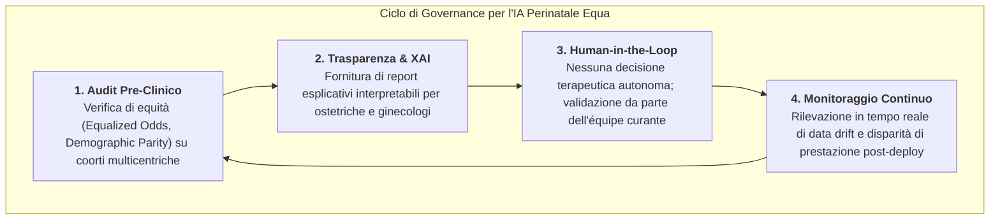

# Bias Algoritmico ed Equità nell'IA per la Salute Mentale Perinatale (Algorithmic Bias and Equity in Perinatal AI)

## Definizione Operativa
- Il **Bias Algoritmico nell'IA per la Salute Mentale Perinatale** definisce la presenza di disparità sistematiche nell'accuratezza predittiva, nei tassi di falsi positivi/falsi negativi e nell'allocazione delle risorse clinico-assistenziali a danno di specifiche sottopopolazioni (minoranze etnico-razziali, donne a basso reddito, madri migranti) all'interno dei modelli di Machine Learning applicati allo screening della depressione perinatale e postpartum (PPD) (Ruger-Navarrete et al., 2026; *Frontiers in Psychiatry*, doi: 10.3389/fpsyt.2025.1734102).
- **Rilevanza Clinica ed Etica:** Nelle applicazioni ospedaliere basate su cartelle cliniche elettroniche (EHR/EMR), l'addestramento ingenuo su dataset storici non calibrati rischia di perpetuare disuguaglianze strutturali: un eccesso di falsi positivi induce sovra-medicalizzazione, allarme ingiustificato e stigma, mentre un eccesso di falsi negativi priva madri vulnerabili di interventi preventivi tempestivi (Park et al., 2021; Liu et al., 2024).

```mermaid
flowchart TD
    subgraph BiasSources ["1. Fonti Primarie di Bias nei Dati Perinatali"]
        B1["Disparità Storiche nelle Cartelle Cliniche (EHR)<br/>(Minore accesso alle cure, annotazioni diseguali)"]
        B2["Sbilanciamento di Classe nei Dataset Clinici<br/>(Prevalenza PPD 10-20%, sottorappresentazione casi critici)"]
        B3["Linguaggio & Bias nei Social Media / Questionari<br/>(Barriere linguistiche, reticenza culturale, auto-selezione)"]
    end

    subgraph FailureModes ["2. Manifestazioni del Bias Algoritmico"]
        F1["Disparità nel Tasso di Falsi Positivi<br/>(Sovrastima del rischio in specifiche etnie)"]
        F2["Disparità nel Tasso di Falsi Negativi<br/>(Mancata identificazione in donne socialmente vulnerabili)"]
        F3["Degradazione delle Performance Out-of-Distribution<br/>(Modelli addestrati su coorti omogenee)"]
    end

    subgraph MitigationPipelines ["3. Strategie di Mitigazione & De-Biasing"]
        M1["Tecniche di Resampling: SMOTE & Bootstrapping<br/>(Ribilanciamento delle classi minoritarie)"]
        M2["Rimozione/Regolarizzazione delle Variabili Sensibili<br/>(Esclusione della razza come predittore diretto)"]
        M3["Ottimizzazione Avanzata & Bio-inspired (ABC + PPO)"]
        M4["Explainable AI (XAI / SHAP) per Validazione Clinica"]
    end

    subgraph ClinicalEquitableOutcome ["4. Implementazione Clinica Equa (Bedside)"]
        C1["Audit Periodico delle Metriche di Equità (Fairness)"]
        C2["Integrazione Co-Pilota con Ostetricia e Nursing"]
        C3["Allocazione Imparziale dei Percorsi Preventivi"]
    end

    BiasSources --> FailureModes
    FailureModes --> MitigationPipelines
    MitigationPipelines --> ClinicalEquitableOutcome
```

---

## Evidenze Empiriche sui Meccanismi di Bias

### 1. Bias Razziale ed Etnico nei Modelli EHR Ospedalieri
L'analisi empirica condotta su sistemi ospedalieri statunitensi evidenzia pattern precisi di disparità algoritmica:
- **L'Evidenza di Park et al. (2021):** Valutando diversi modelli di machine learning addestrati su cartelle elettroniche per la predizione della PPD, gli autori hanno rilevato che i modelli non calibrati producono sistematiche distorsioni razziali, con tassi di falsi positivi significativamente più elevati per le donne afroamericane e ispaniche rispetto alle pazienti caucasiche.
- **La Soluzione di Liu et al. (2024) per l'Uso Ospedaliero (*Bedside Deployment*):** In uno studio su tre ampi set di cartelle cliniche elettroniche ospedaliere, Liu et al. hanno dimostrato che:
  1. L'inclusione della variabile demografica esplicita "razza/etnia" funge da scorciatoia statistica che amplifica il bias senza migliorare l'accuratezza clinica intrinseca;
  2. **Rimuovendo la variabile razza** e ricalibrando i predittori clinici oggettivi (storia depressiva, complicanze del parto, parametri fisiologici), il modello mantiene invariata l'elevata capacità discriminativa eliminando la discrepanza nel tasso di falsi positivi tra gruppi etnici.

---

### 2. Gestione del Forte Disequilibrio di Classe (Class Imbalance)

La prevalenza della depressione postpartum si attesta mediamente tra il 10% e il 20%. Nei dataset clinici reali, la forte sproporzione tra classe maggioritaria (donne asintomatiche) e classe minoritaria (donne con PPD) induce i modelli a massimizzare l'accuratezza globale classificando erroneamente tutti i soggetti come sani.

- **Tecniche di Over-Sampling e SMOTE (Shin et al., 2020; Fazraningtyas et al., 2025):** L'applicazione della *Synthetic Minority Over-sampling Technique* (SMOTE) e del bootstrapping stratificato permette di sintetizzare esempi realistici della classe minoritaria nello spazio delle feature, migliorando la sensibilità senza degradare la specificità.
- **Modellazione Neurale con Ottimizzazione Bio-Ispirata (Tang et al., 2024):** L'integrazione di reti neurali artificiali con algoritmi *Artificial Bee Colony* (ABC) e *Proximal Policy Optimization* (PPO) consente di addestrare modelli robusti su popolazioni ad alto rischio caratterizzate da dataset marcatamente sbilanciati, abbattendo la varianza dell'errore.

---

### 3. Selezione di Feature e Controllo dell'Overfitting su Piccoli Campioni
- **Fast Feature Selection (FFS-RF) e SVM (Zhang et al., 2020):** In contesti clinici dove la dimensione campionaria è limitata, l'eccesso di variabili rispetto al numero di pazienti induce overfitting e memorizzazione di pattern spuri. L'impiego combinato di algoritmi di selezione rapida delle feature (*FFS*) e *Random Forest* isola un sottoinsieme parsimonioso di variabili determinanti, azzerando il rumore e garantendo generalizzabilità a popolazioni esterne.

---

## Tassonomia delle Strategie di De-Biasing e Mitigazione

| Livello di Intervento | Metodologia Tecnica | Autori di Riferimento | Meccanismo Operativo | Obiettivo Clinico |
| :--- | :--- | :--- | :--- | :--- |
| **Pre-Processing (Dati)** | Rimozione attributi sensibili espliciti | Liu et al. (2024) | Esclusione della variabile razza/etnia dalle feature di training. | Prevenire correlazioni discriminatorie nei tassi di falsi allarmi. |
| **Pre-Processing (Dati)** | SMOTE & Re-sampling stratificato | Shin et al. (2020), Fazraningtyas et al. (2025) | Generazione di pattern sintetici per la classe depressiva minoritaria. | Incrementare la sensibilità nei gruppi a bassa prevalenza campionaria. |
| **In-Processing (Modello)** | Fast Feature Selection (FFS-RF) | Zhang et al. (2020) | Selezione parsimoniosa dei nodi decisionali ottimali. | Eliminare feature ridondanti e ridurre il rischio di overfitting. |
| **In-Processing (Modello)** | Bio-inspired ABC + PPO | Tang et al. (2024) | Ottimizzazione della funzione di perdita su dataset sbilanciati. | Garantire stabilità predittiva in coorti ad alto rischio clinico. |
| **Post-Processing & Spiegabilità** | Explainable AI (XAI / SHAP) | Shivaprasad et al. (2024) | Trasparenza locale sui contributi delle singole variabili per paziente. | Consentire al clinico di validare razionalmente la predizione algoritmica. |

---

## Raccomandazioni per la Governance Ospedaliera e Clinica

1. **Protocolli di Audit Multicentrico Prima del Deployment:** Prima di integrare un algoritmo nei sistemi di cartella clinica elettronica ospedaliera, è indispensabile eseguire test di equità (*Fairness Audit*) stratificati per età materna, status socioeconomico ed etnia, verificando che la sensibilità e il tasso di falsi positivi siano omogenei tra tutti i gruppi.
2. **Formazione Interdisciplinare di Ostetriche e Infermieri:** Il personale sanitario deve essere formato a interpretare gli output probabilistici dei modelli, evitando sia l'eccessiva acquiescenza verso l'algoritmo (*automation bias*) sia il rigetto ingiustificato della tecnologia.
3. **Consenso Informato e Protezione della Privacy Materna:** I dati estratti da app mobili o social media richiedono stringenti protocolli di consenso informato e crittografia conforme al GDPR, garantendo che le informazioni relative alla salute mentale perinatale non vengano utilizzate per scopi assicurativi o discriminatori.

---

## Riferimenti Bibliografici
- Ruger-Navarrete, A., Gómez-Ferrera, M., Mérida-Yáñez, B., Vázquez-Lara, J. M., Gómez-Salgado, J., García-Oliva, S., et al. (2026). Artificial intelligence in the prevention and early detection of postpartum depression: a systematic review and meta-analysis. *Frontiers in Psychiatry*, 16, 1734102. https://doi.org/10.3389/fpsyt.2025.1734102
- Fazraningtyas, W. A., Rahmatullah, B., Naparin, H., Basit, M., & Razak, N. A. (2025). A predictive model for postpartum depression: ensemble learning strategies in machine learning. *Indonesian Journal of Electrical Engineering and Computer Science*, 37, 443–451. https://doi.org/10.11591/ijeecs.v37.i1.pp443-451
- Liu, Y., Joly, R., Reading Turchioe, M., Benda, N., Hermann, A., Beecy, A., et al. (2024). Preparing for the bedside - optimizing a postpartum depression risk prediction model for clinical implementation in a health system. *Journal of the American Medical Informatics Association*, 31, 1258–1267. https://doi.org/10.1093/jamia/ocae056
- Park, Y., Hu, J., Singh, M., Sylla, I., Dankwa-Mullan, I., Koski, E., et al. (2021). Comparison of methods to reduce bias from clinical prediction models of postpartum depression. *JAMA Network Open*, 4(4), e213909. https://doi.org/10.1001/jamanetworkopen.2021.3909
- Shin, D., Lee, K. J., Adeluwa, T., & Hur, J. (2020). Machine learning-based predictive modeling of postpartum depression. *Journal of Clinical Medicine*, 9(9), 2899. https://doi.org/10.3390/jcm9092899
- Shivaprasad, S., Chadaga, K., Sampathila, N., Prabhu, S., Chadaga, P. R., & K, S. (2024). Explainable machine learning methods to predict postpartum depression risk. *Systems Science & Control Engineering*, 12(1), 2427033. https://doi.org/10.1080/21642583.2024.2427033
- Tang, Y., Huang, T., & Yin, X. (2024). Postpartum depression identification: integrating mutual learning-based artificial bee colony and proximal policy optimization for enhanced diagnostic precision. *International Journal of Advanced Computer Science and Applications*, 15(4), 332–347. https://doi.org/10.14569/IJACSA.2024.0150636
- Zhang, W., Liu, H., Silenzio, V. M. B., Qiu, P., & Gong, W. (2020). Machine learning models for the prediction of postpartum depression: application and comparison based on a cohort study. *JMIR Medical Informatics*, 8(4), e15516. https://doi.org/10.2196/15516

---

## Relazioni
- Vedi anche: [[fpsyt-16-1734102]], [[ai-perinatal-depression-prediction]], [[pediatric-ai-bias-and-vulnerabilities]], [[misurazione-bias-razziale-llm]], [[embedded-ethics-interface]], [[traffic-light-quality-appraisal-clinical-ai]], [[modello-centauro-clinico]], [[clinical-decision-making-and-artificial-intelligence]]
